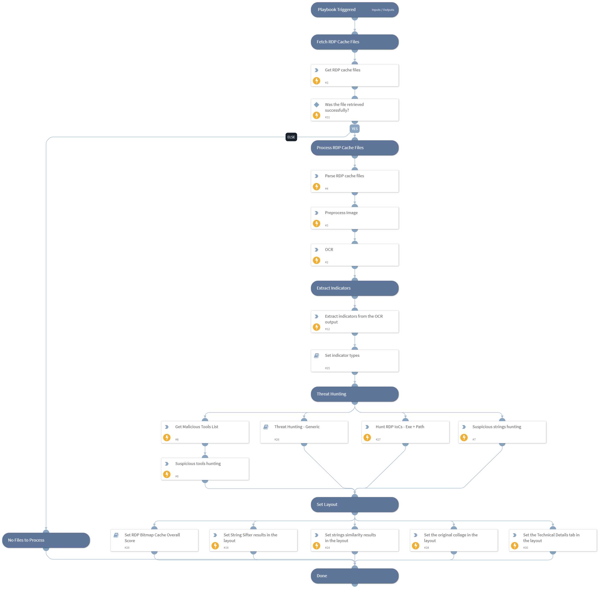

## Playbook: Automated Collection and Forensic Analysis of RDP Sessions Cache Data

This playbook automates the collection and forensic analysis of RDP sessions cache data. It involves the following steps:

### Step 1: Collect Cache Files and Convert to Image

The first step is to collect the cache files from RDP sessions and convert them into an image format.

### Step 2: Extract Readable Text from the Image

Once the cache files are converted into an image, the playbook extracts readable text from the image to facilitate analysis.

### Step 3: Build Indicators of Compromise (IOCs) from Text

In this step, the extracted text is used to build indicators of compromise (IOCs) for further investigation and threat hunting.

### Step 4: Enrich Extracted Indicators for Further Hunting

Finally, the playbook enriches the extracted indicators by adding additional context and information, enhancing their usefulness for further hunting and analysis.

> Note: It is important to customize and adapt this playbook to fit specific use cases and environments. Additionally, ensure compliance with legal and privacy requirements when collecting and analyzing data.

Feel free to modify and enhance this playbook according to your requirements.

## Dependencies

This playbook uses the following sub-playbooks, integrations, and scripts.

### Sub-playbooks

* Retrieve File from Endpoint - Generic V3
* Threat Hunting - Generic

### Integrations

Rasterize

### Scripts

* Set
* PreProcessImage
* StringSimilarity
* StringSifter
* UnzipFile
* SetGridField
* BMCTool

### Commands

* xdr-file-retrieve
* lolbas-get-indicators
* image-ocr-extract-text
* rasterize-image
* splunk-search
* extractIndicators
* rasterize-pdf
* setIncident

## Playbook Inputs

---

| **Name** | **Description** | **Default Value** | **Required** |
| --- | --- | --- | --- |
| ShouldCollectRDPCache | When set to True, will use XDR to get RDP cache files from the endpoints. When set to False will try and use existing cache files from context. | false | Required |
| EndpointIDs | A comma-separated list of endpoint ID's to retrieve cache files from. |  | Optional |
| FilePath | The path of the file to retrieve or use wildcard for multiple files. For example: C:\\the\\path\\to\\cache_file.bin C:\\the\\path\\to\\\* | C:\Users\administrator\AppData\Local\Microsoft\Terminal Server Client\Cache\* | Optional |
| Hostname | Hostname of the machine on which the file is located. For PS remote it can also be an IP address. |  | Optional |
| min_score | StringSifter - Limit output to strings with score &gt;= min-score. |  | Optional |
| limit | StringSifter - Limit output to the top limit ranked strings. |  | Optional |
| similiarity_threshold  | StringSimilarity - The similarity threshold to show results for, a value between 0 &lt; x &gt;1. | 0.3 | Optional |
| QRadarTimeFrame | The time frame for the QRadar hunting query. | LAST 7 DAYS | Optional |
| SplunkEarliestTime | The earliest time for the Splunk hunting query. | -7d@d | Optional |
| SplunkLatestTime | The latest time for the Splunk hunting query, | now | Optional |

## Playbook Outputs

---
There are no outputs for this playbook.

## Playbook Image

---

