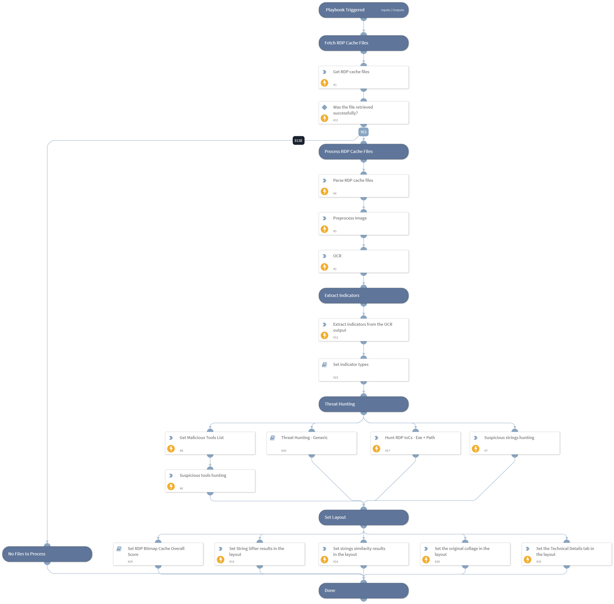

This playbook automates the collection and forensic analysis of RDP sessions cache data by collecting the cache files and convert it to an image, extract readable text from the image and build IOC's from text and finally enrich any extracted indicators for further hunting

## Dependencies

This playbook uses the following sub-playbooks, integrations, and scripts.

### Sub-playbooks

* Set RDP Bitmap Cache Overall Score
* Set indicator types 
* Threat Hunting - Generic

### Integrations

This playbook does not use any integrations.

### Scripts

* StringSifter
* GetListRow
* PreProcessImage
* Set
* BMC-Tool
* stringSimilarity
* SetGridField

### Commands

* setIncident
* splunk-search
* image-ocr-extract-text
* xdr-file-retrieve
* extractIndicators

## Playbook Inputs

---
There are no inputs for this playbook.

## Playbook Outputs

---
There are no outputs for this playbook.

## Playbook Image

---

