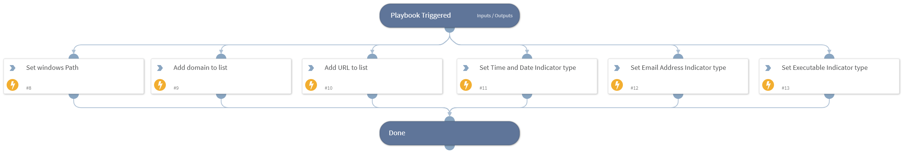

This playbook takes IOCs as input and adds the type into a list to be able to calculate stats about the types of the extracted indicators

## Dependencies

This playbook uses the following sub-playbooks, integrations, and scripts.

### Sub-playbooks

This playbook does not use any sub-playbooks.

### Integrations

This playbook does not use any integrations.

### Scripts

This playbook does not use any scripts.

### Commands

* addToList
* setList

## Playbook Inputs

---

| **Name** | **Description** | **Default Value** | **Required** |
| --- | --- | --- | --- |
| Domain |  |  | Optional |
| URL |  |  | Optional |
| WindowsDateTime |  |  | Optional |
| IP |  |  | Optional |
| Executables |  |  | Optional |
| WindowsPaths |  |  | Optional |
| EmailAddresses |  |  | Optional |

## Playbook Outputs

---
There are no outputs for this playbook.

## Playbook Image

---

