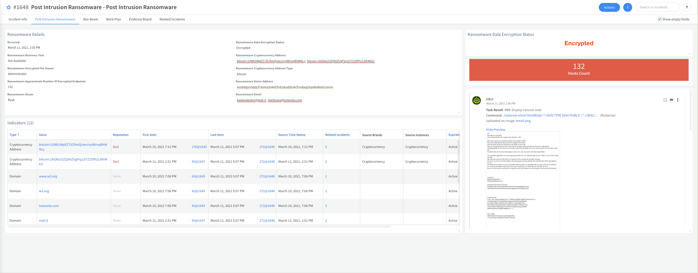
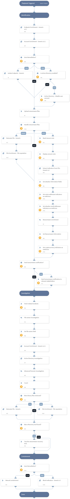

When a ransomware attack is detected, for example by your endpoint protection service, this pack can help you better understand your position and exposure against the threat actor group by collecting the needed information from your environment, performing the required investigation steps, containing the incident, and visualizing the data with its custom **Post Intrusion Ransomware** layout.
## What does this pack do?
The main features of the semi-automated **Post Intrusion Ransomware Investigation** playbook included in the pack are:
- Performs automated user and host data enrichment.
- Performs automated endpoint isolation and user revocation.
- Provides guidance to retrieve the necessary files to identify the ransomware strain.
- Extracts indicators from the ransomware note, including cryptocurrency and onion addresses.
- Provides guidance on additional recommended investigation steps such as endpoint forensics, searching for more infected endpoints, and investigating activities of the infected user.
- Performs Active Directory forensics. 
- Automatically blocks malicious indicators.
As part of this pack, you will get out-of-the-box playbook, incident type, incident fields and a layout to display all of the information gathered during the ransomware investigation performed by the playbook.  
## Integrations
Integrations required for this pack.
- Fetch incidents integration: the integration you are using to fetch and ingest ransomware incidents, for example, Palo Alto Networks Cortex XDR.
- Active Directory Query V2 - [(see the documentation)](https://xsoar.pan.dev/docs/reference/integrations/active-directory-query-v2)
- Rasterize - [(see the documentation)](https://xsoar.pan.dev/docs/reference/integrations/rasterize)
- Cryptocurrency - [(see the documentation)](https://xsoar.pan.dev/docs/reference/integrations/cryptocurrency)
For more information, visit our [Cortex XSOAR Developer Docs](https://xsoar.pan.dev/docs/reference/packs/ransomware)

