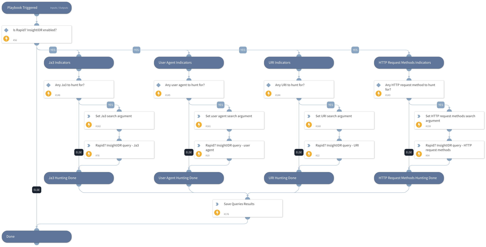

This playbook queries Rapid7 InsightIDR SIEM for indicators associated with HTTP requests, including HTTP request methods, user agents, URIs, and Ja3.

Note that multiple search values should be separated by commas only (without spaces or any special characters). 

## Dependencies
This playbook uses the following sub-playbooks, integrations, and scripts.

### Sub-playbooks
This playbook does not use any sub-playbooks.

### Integrations
* Rapid7 InsightIDR

### Scripts
* SetAndHandleEmpty
* LoadJSON
* IsIntegrationAvailable

### Commands
* rapid7-insight-idr-query-log-set

## Playbook Inputs
---

| **Name** | **Description** | **Default Value** | **Required** |
| --- | --- | --- | --- |
| UserAgent | A single or multiple user agents to search for within Rapid7 InsightIDR logs.  Separate multiple search values by commas only \(without spaces or any special characters\). |  | Optional |
| InsightIDRUserAgentField | The name of the fields, in Rapid7 InsightIDR, in which to find the user agents. |  | Optional |
| URI | A single or multiple URIs to search for within Rapid7 InsightIDR logs.  Separate multiple search values by commas only \(without spaces or any special characters\). |  | Optional |
| InsightIDRURIField | The name of the fields, in Rapid7 InsightIDR, in which to find the URIs. |  | Optional |
| HTTPRequestMethods | A single or multiple HTTP requests methods to search for within Rapid7 InsightIDR logs.  Separate multiple search values by commas only \(without spaces or any special characters\). |  | Optional |
| InsightIDRHttpMethodsField | The name of the fields, in Rapid7 InsightIDR, in which to find the HTTP request methods. |  | Optional |
| Ja3 | A single or multiple Ja3s to search for within Rapid7 InsightIDR logs.  Separate multiple search values by commas only \(without spaces or any special characters\).  JA3 is a method for creating SSL/TLS client fingerprints that should be easy to produce on any platform and can be easily shared for threat intelligence. |  | Optional |
| InsightIDRJa3Field | The name of the fields, in Rapid7 InsightIDR, in which to find the Ja3s. |  | Optional |
| LogSetId | An identifier for a Rapid7 InsightIDR log set to query. |  | Required |
| time_range | Specify the timeframe in which the Rapid7 InsightIDR logs will be searched. Most start with 'last' \(e.g., last 2 months, last 10 minutes\). The 'start_time' and 'end_time' inputs should not be used if the time_range input is specified.  Supported time units \(case insensitive\): min\(s\) or minute\(s\) hr\(s\) or hour\(s\) day\(s\) week\(s\) month\(s\) year\(s\) |  | Optional |
| logs_per_page | Specify the maximum number of log entries to return per page, up to 500 \(the maximum allowed\). By default, 50 is set. |  | Optional |
| sequence_number | The earliest sequence number of a log entry to start searching.  If this query parameter is included, the query results will additionally include all log entries received in the 'start_time' millisecond which have sequence numbers larger than the one specified.  Sequence numbers are identifiers used to distinguish between log entries received in the same millisecond. If a log entry was split up into several log entries during ingestion, then those chunks are ordered by sequence number. |  | Optional |
| start_time | Specify the query start time at which the Rapid7 InsightIDR logs will be searched, as a UNIX timestamp in milliseconds.  For example, if you wish to begin searching 1 week ago, the UNIX timestamp value is 604800. |  | Optional |
| end_time | Specify the query end time at which the Rapid7 InsightIDR logs will be searched, as a UNIX timestamp in milliseconds.  For example, to end searching a day ago, the UNIX timestamp value would be 86400. |  | Optional |

## Playbook Outputs
---

| **Path** | **Description** | **Type** |
| --- | --- | --- |
| Rapid7InsightIDR.HuntingResults | Events log objects containing relevant fields. | string |

## Playbook Image
---
