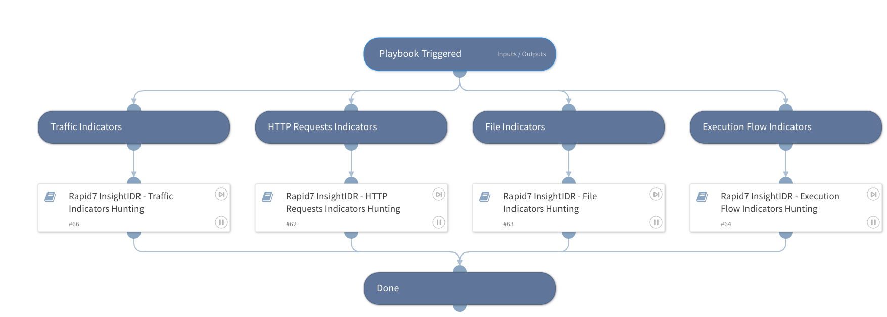

This playbook facilitates threat hunting and detection of IOCs within Rapid7 InsightIDR SIEM logs utilizing four sub-playbooks. The sub-playbooks query Rapid7 InsightIDR SIEM for different indicators including files, traffic, HTTP requests, and execution flows indicators.

Note that multiple search values should be separated by commas only (without spaces or any special characters). 

Supported IOCs for this playbook:
- MD5
- SHA1
- SHA256
- IP Address
- URLDomain
- Registry Value
- Registry Key
- Registry Hives
- Command Line
- File Name
- Process Name
- HTTP Request Methods
- User Agent
- Port Number
- File Path
- Geolocation
- Email Address
- CIDR
- URI
- Ja3
- FileType

## Dependencies
This playbook uses the following sub-playbooks, integrations, and scripts.

### Sub-playbooks
* Rapid7 InsightIDR - Execution Flow Indicators Hunting
* Rapid7 InsightIDR - Traffic Indicators Hunting
* Rapid7 InsightIDR - File Indicators Hunting
* Rapid7 InsightIDR - HTTP Requests Indicators Hunting

### Integrations
This playbook does not use any integrations.

### Scripts
This playbook does not use any scripts.

### Commands
This playbook does not use any commands.

## Playbook Inputs
---

| **Name** | **Description** | **Default Value** | **Required** |
| --- | --- | --- | --- |
| IPAddress | A single or multiple IP addresses to search for within Rapid7 InsightIDR logs. Used for both source and destination IP addresses.  Separate multiple search values by commas only \(without spaces or any special characters\). |  | Optional |
| InsightIDRdstIPField | The name of the fields, in Rapid7 InsightIDR, in which to find the destination IPs. |  | Optional |
| InsightIDRsrcIPField | The name of the fields, in Rapid7 InsightIDR, in which to find the source IPs. |  | Optional |
| Application | A single or multiple application names to search for within Rapid7 InsightIDR logs.  Separate multiple search values by commas only \(without spaces or any special characters\). |  | Optional |
| InsightIDRAppField | The name of the fields, in Rapid7 InsightIDR, in which to find the application names. |  | Optional |
| PortNumber | A single or multiple IP addresses to search for within Rapid7 InsightIDR logs. Used for both source and destination ports.  Separate multiple search values by commas only \(without spaces or any special characters\). |  | Optional |
| InsightIDRsrcPortField | The name of the fields, in Rapid7 InsightIDR, in which to find the source ports. |  | Optional |
| InsightIDRdstPortField | The name of the fields, in Rapid7 InsightIDR, in which to find the destination ports. |  | Optional |
| Geolocation | A single or multiple country names or codes to search for within Rapid7 InsightIDR logs. Used for both source and destination geolocations.  Separate multiple search values by commas only \(without spaces or any special characters\). |  | Optional |
| InsightIDRsrcGeolocationField | The name of the fields, in Rapid7 InsightIDR, in which to find the source geolocations. |  | Optional |
| InsightIDRSdstGeolocationField | The name of the fields, in Rapid7 InsightIDR, in which to find the destination geolocations. |  | Optional |
| UserAgent | A single or multiple user agents to search for within Rapid7 InsightIDR logs.  Separate multiple search values by commas only \(without spaces or any special characters\). |  | Optional |
| InsightIDRUserAgentField | The name of the fields, in Rapid7 InsightIDR, in which to find the user agents. |  | Optional |
| FileType | A single or multiple file types to search for within Rapid7 InsightIDR logs.  Separate multiple search values by commas only \(without spaces or any special characters\). |  | Optional |
| InsightIDRFileTypeField | The name of the fields, in Rapid7 InsightIDR, in which to find the file types. |  | Optional |
| FileName | A single or multiple file names to search for within Rapid7 InsightIDR logs.  Separate multiple search values by commas only \(without spaces or any special characters\). |  | Optional |
| InsightIDRFileNameField | The name of the fields, in Rapid7 InsightIDR, in which to find the file names. |  | Optional |
| URLDomain | Single or multiple URLs and/or domains to search for within Rapid7 InsightIDR logs.  Separate multiple search values by commas only \(without spaces or any special characters\). |  | Optional |
| InsightIDRURLDomainField | The name of the fields, in Rapid7 InsightIDR, in which to find the URLs or domains. |  | Optional |
| URI | A single or multiple URIs to search for within Rapid7 InsightIDR logs.  Separate multiple search values by commas only \(without spaces or any special characters\). |  | Optional |
| InsightIDRURIField | The name of the fields, in Rapid7 InsightIDR, in which to find the URIs. |  | Optional |
| EmailAddress | A single or multiple email addresses to search for within Rapid7 InsightIDR logs. Used for both sender and recipient email addresses.  Separate multiple search values by commas only \(without spaces or any special characters\). |  | Optional |
| InsightIDRSenderField | The name of the fields, in Rapid7 InsightIDR, in which to find the sender's email addresses. |  | Optional |
| InsightIDRRecipientField | The name of the fields, in Rapid7 InsightIDR, in which to find the recipient's email addresses. |  | Optional |
| HTTPRequestMethods | A single or multiple HTTP requests methods to search for within Rapid7 InsightIDR logs.  Separate multiple search values by commas only \(without spaces or any special characters\). |  | Optional |
| InsightIDRHttpMethodsField | The name of the fields, in Rapid7 InsightIDR, in which to find the HTTP request methods. |  | Optional |
| MD5 | A single or multiple MD5 file hashes to search for within Rapid7 InsightIDR logs.  Separate multiple search values by commas only \(without spaces or any special characters\). |  | Optional |
| InsightIDRMD5Field | The name of the fields, in Rapid7 InsightIDR, in which to find the MD5 hashes. |  | Optional |
| SHA256 | A single or multiple SHA256 file hashes to search for within Rapid7 InsightIDR logs.  Separate multiple search values by commas only \(without spaces or any special characters\). |  | Optional |
| InsightIDRSHA256Field | The name of the fields, in Rapid7 InsightIDR, in which to find the SHA256 hashes. |  | Optional |
| SHA1 | A single or multiple SHA1 file hashes to search for within Rapid7 InsightIDR logs.  Separate multiple search values by commas only \(without spaces or any special characters\). |  | Optional |
| InsightIDRSHA1Field | The name of the fields, in Rapid7 InsightIDR, in which to find the SHA1 hashes. |  | Optional |
| RegistryValue | A single or multiple registry values to search for within Rapid7 InsightIDR logs.  Separate multiple search values by commas only \(without spaces or any special characters\). |  | Optional |
| InsightIDRRegistryValueField | The name of the fields, in Rapid7 InsightIDR, in which to find the registry values. |  | Optional |
| RegistryKey | A single or multiple registry keys to search for within Rapid7 InsightIDR logs.  Separate multiple search values by commas only \(without spaces or any special characters\). |  | Optional |
| InsightIDRRegistryKeyField | The name of the fields, in Rapid7 InsightIDR, in which to find the registry keys. |  | Optional |
| RegistryHives | Only relevant for hunting on Windows hosts. A single or multiple registry hives to search for within Rapid7 InsightIDR logs.  Separate multiple search values by commas only \(without spaces or any special characters\). |  | Optional |
| InsightIDRRegistryHivesField | The name of the fields, in Rapid7 InsightIDR, in which to find the registry hives. |  | Optional |
| CommandLine | A single or multiple commands to parse and set for future use within hunting playbooks.  Separate multiple search values by commas only \(without spaces or any special characters\). |  | Optional |
| InsightIDRCommandLineField | The name of the fields, in Rapid7 InsightIDR, in which to find the command's lines. |  | Optional |
| ProcessName | A single or multiple process names to search for within Rapid7 InsightIDR logs.  Separate multiple search values by commas only \(without spaces or any special characters\). |  | Optional |
| InsightIDRProcessNameField | The name of the fields, in Rapid7 InsightIDR, in which to find the process names. |  | Optional |
| FilePath | A single or multiple file paths to search for within Rapid7 InsightIDR logs.  Separate multiple search values by commas only \(without spaces or any special characters\). |  | Optional |
| InsightIDRFilePathField | The name of the fields, in Rapid7 InsightIDR, in which to find the file paths. |  | Optional |
| CIDR | A single or multiple IP ranges to search for within Rapid7 InsightIDR logs.  Separate multiple search values by commas only \(without spaces or any special characters\). |  | Optional |
| Ja3 | A single or multiple Ja3s to search for within Rapid7 InsightIDR logs.  Separate multiple search values by commas only \(without spaces or any special characters\).  JA3 is a method for creating SSL/TLS client fingerprints that should be easy to produce on any platform and can be easily shared for threat intelligence. |  | Optional |
| InsightIDRJa3Field | The name of the fields, in Rapid7 InsightIDR, in which to find the Ja3s. |  | Optional |
| LogSetId | An identifier for a Rapid7 InsightIDR log set to query. |  | Required |
| time_range | Specify the timeframe in which the Rapid7 InsightIDR logs will be searched. Most start with 'last' \(e.g., last 2 months, last 10 minutes\). The 'start_time' and 'end_time' inputs should not be used if the time_range input is specified.  Supported time units \(case insensitive\): min\(s\) or minute\(s\) hr\(s\) or hour\(s\) day\(s\) week\(s\) month\(s\) year\(s\) |  | Optional |
| logs_per_page | Specify the maximum number of log entries to return per page, up to 500 \(the maximum allowed\). By default, 50 is set. |  | Optional |
| sequence_number | The earliest sequence number of a log entry to start searching.  If this query parameter is included, the query results will additionally include all log entries received in the 'start_time' millisecond which have sequence numbers larger than the one specified.  Sequence numbers are identifiers used to distinguish between log entries received in the same millisecond. If a log entry was split up into several log entries during ingestion, then those chunks are ordered by sequence number. |  | Optional |
| start_time | Specify the query start time at which the Rapid7 InsightIDR logs will be searched, as a UNIX timestamp in milliseconds.  For example, if you wish to begin searching 1 week ago, the UNIX timestamp value is 604800. |  | Optional |
| end_time | Specify the query end time at which the Rapid7 InsightIDR logs will be searched, as a UNIX timestamp in milliseconds.  For example, to end searching a day ago, the UNIX timestamp value would be 86400. |  | Optional |

## Playbook Outputs
---

| **Path** | **Description** | **Type** |
| --- | --- | --- |
| Rapid7InsightIDR.HuntingResults | Events log objects containing relevant fields. | string |

## Playbook Image
---
