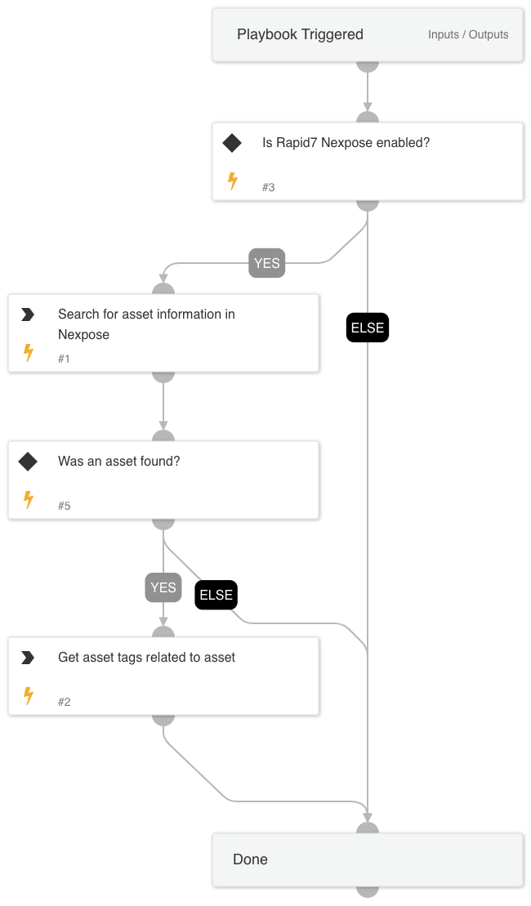

Given an IP address, this playbook searches Rapid7 Nexpose assets for an asset with the associated IP address to retrieve asset information and proceeds to return all associated tags with it.

## Dependencies
This playbook uses the following sub-playbooks, integrations, and scripts.

### Sub-playbooks
This playbook does not use any sub-playbooks.

### Integrations
Rapid7 Nexpose

### Scripts
This playbook does not use any scripts.

### Commands
* nexpose-get-asset-tags
* nexpose-search-assets

## Playbook Inputs
---

| **Name** | **Description** | **Default Value** | **Required** |
| --- | --- | --- | --- |
| IP | IP used to search for asset information and tags. | | Optional |

## Playbook Outputs
---

| **Path** | **Description** | **Type** |
| --- | --- | --- |
| Nexpose.Asset | List of asset\(s\) information from the Nexpose search. | unknown |
| Nexpose.AssetTag | List of asset tags from the Nexpose tag search. | unknown |

## Playbook Image
---
