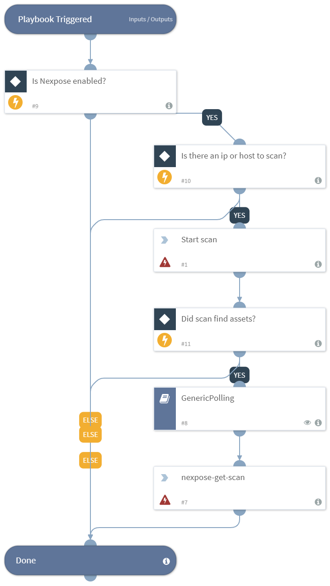

Scans according to asset IP addresses or host names, and waits for the scan to finish by polling the scan status in pre-defined intervals.

## Dependencies
This playbook uses the following sub-playbooks, integrations, and scripts.

### Sub-playbooks
* GenericPolling

### Integrations
* Rapid7 Nexpose

### Scripts
This playbook does not use any scripts.

### Commands
* nexpose-get-scan
* nexpose-start-assets-scan

## Playbook Inputs
---

| **Name** | **Description** | **Default Value** | **Required** |
| --- | --- | --- | --- | 
| IPs | The asset IP addresses to scan. | ${IP.Address} | Optional |
| HostNames | The hostnames of the assets to scan. | ${Nexpose.Asset.HostName} |Optional |
| Name | The scan name as specified by the user. | - | Optional |

## Playbook Outputs
---

| **Path** | **Description** | **Type** |
| --- | --- | --- |
| Nexpose.Scan.ScanType | The scan type. Can be, "automated", "manual", or "scheduled". | unknown |
| Nexpose.Scan.Completed | The end time of the scan in ISO8601 format. | unknown |
| Nexpose.Scan.StartedBy | The name of the user that started the scan. | unknown |
| Nexpose.Scan.Assets | The number of assets found in the scan | unknown |
| Nexpose.Scan.TotalTime | The duration of the scan (in minutes). | unknown |
| Nexpose.Scan.Id | The identifier of the scan. | unknown |
| Nexpose.Scan.Status | The scan status. Can be, "aborted", "unknown", "running", "finished", "stopped", "error", "paused", "dispatched", or "integrating". | unknown |
| Nexpose.Scan.Vulnerabilities.Critical | The number of critical vulnerabilities. | unknown |
| Nexpose.Scan.Vulnerabilities.Moderate | The number of moderate vulnerabilities. | unknown |
| Nexpose.Scan.Vulnerabilities.Severe | The number of severe vulnerabilities. | unknown |
| Nexpose.Scan.Vulnerabilities.Total | The total number of vulnerabilities. | unknown |

## Playbook Image
---

