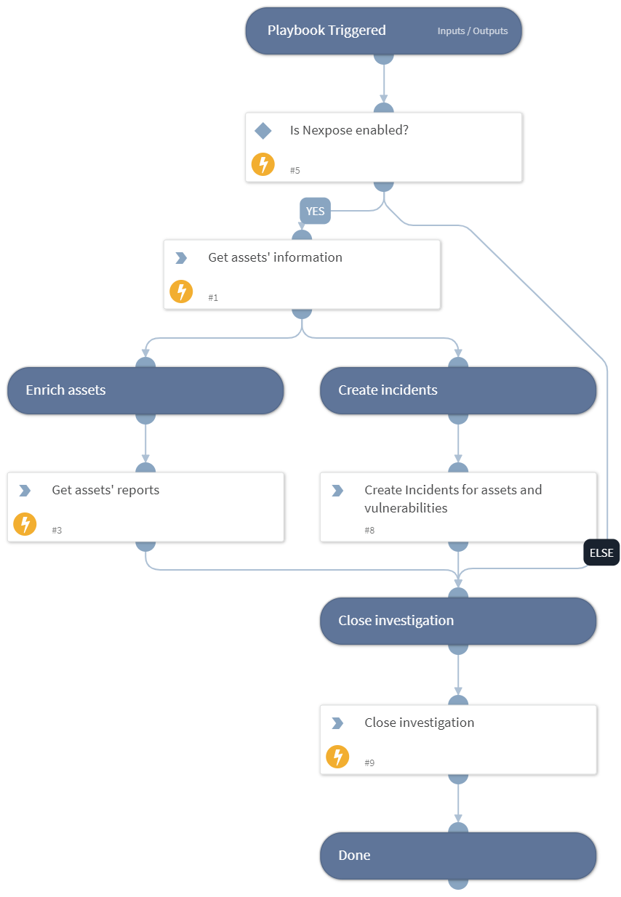

Deprecated. No available replacement. Manage assets vulnerabilities using Nexpose.

This playbook runs as a job, and by default creates incidents of type "Vulnerability" based on assets and vulnerabilities.
The incidents are created by querying Nexpose for the input assets vulnerability list.
You can define the minimum severity (minSeverity) that incidents are created for.
Duplicate incidents are not created for the same asset ID and the Nexpose ID.

This playbook is a part of a series of playbooks for Nexpose vulnerability management and remediation.
For this series of playbooks to run successfully, create a Job and do the following:
1. Assign this playbook to the Job
2. Enter the relevant assets' hostnames in the playbook inputs (comma separated list).
3. Associate the "Vulnerability" type incident to the "Vulnerability Handling - Nexpose" playbook.

## Dependencies

This playbook uses the following sub-playbooks, integrations, and scripts.

### Sub-playbooks

This playbook does not use any sub-playbooks.

### Integrations

* Rapid7 Nexpose

### Scripts

* NexposeCreateIncidentsFromAssets

### Commands

* nexpose-create-assets-report
* nexpose-search-assets
* closeInvestigation

## Playbook Inputs

---

| **Name** | **Description** | **Default Value** | **Required** |
| --- | --- | --- | --- |
| Hostname | Assets' hostnames list \(comma separated\). |  | Optional |
| MinSeverity | The minimum Nexpose severity \(Moderate, Severe, Critical\) to create incidents for. | Severe | Required |

## Playbook Outputs

---
There are no outputs for this playbook.

## Playbook Image

---

