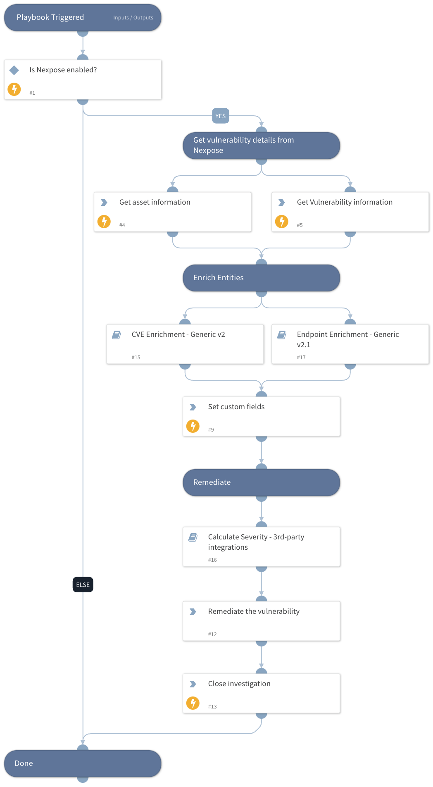

Overview
-
Rapid7 Nexpose provides vulnerability management, assessment, and
response to changes in the environment while prioritizing risk across
vulnerabilities, configurations, and controls.\
Use the Nexpose integration to access sites, assets, vulnerabilities and
their solutions, scans and reports. The integration was developed with
the Nexpose API v3.

Rapid7 Nexpose Playbooks
-
For scans there are two sub-playbooks available, depending on the command.

To start a site scan, use the `Nexpose Scan Site` sub-playbook.

To start an assets scan, use the `Nexpose Scan Assets` sub-playbook.

When using the `sort` parameter, the fields to sort must be provided as
they are in the API, e.g `riskScore`. All the available fields for any
type of response can be found in the [API Documentation.](https://help.rapid7.com/insightvm/en-us/api/index.html#tag/Asset)

#### Nexpose Scan Assets

#### Nexpose Scan Site

#### Vulnerability Handling - Nexpose

#### Vulnerability Management - Nexpose

#### Nexpose - Create and download a report - GenericPolling

