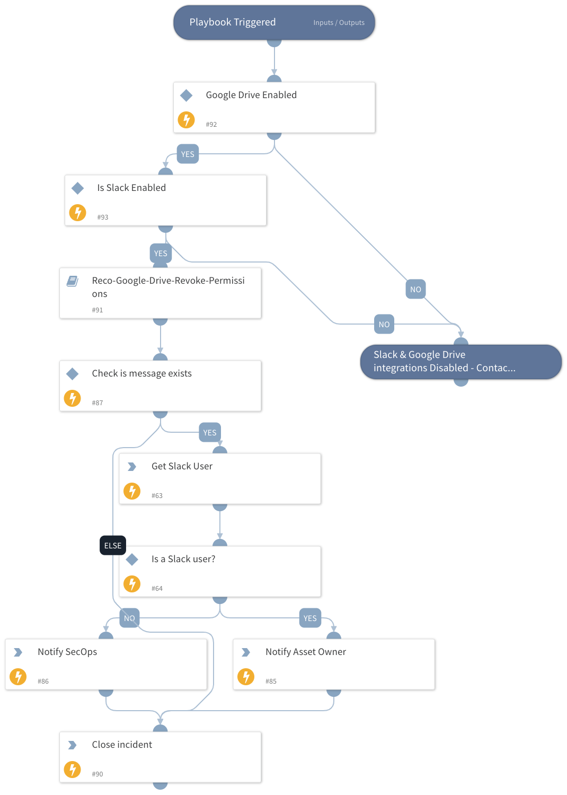

Reco Google Drive Automation

## Dependencies

This playbook depends on the following integrations:
 - Google Drive
 - Slack

### Sub-playbooks

This playbook depends on the following sub-playbooks:
 - Reco Google Drive Revoke Permissions

### Integrations

Reco

### Scripts

This playbook does not use any scripts.

### Commands

slack-get-user-details
send-notification

## Playbook Inputs

---

| **Name**                 | **Description**               | **Default Value**         | **Required** |
|--------------------------|-------------------------------| ------------------------- | ------------ |
| Reco  | Finding Json Object from Reco | ${incident} | Required     |

## Playbook Outputs

This playbook does not have any outputs.

## Playbook Image

---

