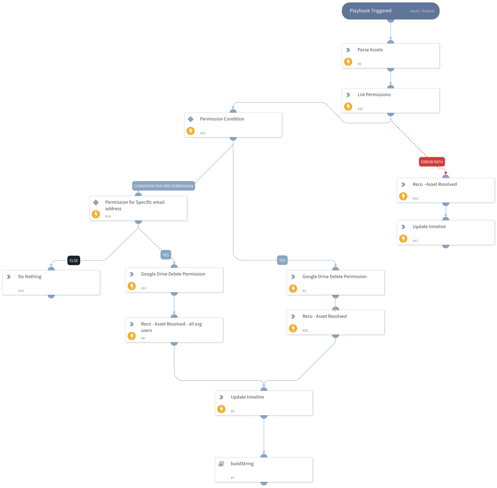

Reco Google Drive Revoke Permissions

## Dependencies

This playbook depends on the following integrations:
 - Google Drive 

### Sub-playbooks

This playbook does not use any sub-playbooks.

### Integrations

Reco

### Scripts

This playbook does not use any scripts.

### Commands

reco-resolve-visibility-event
reco-update-incident-timeline
google-drive-file-permissions-list
google-drive-file-permission-delete

## Playbook Inputs

---

| **Name**                 | **Description**               | **Default Value**         | **Required** |
|--------------------------|-------------------------------| ------------------------- | ------------ |
| Reco  | Finding Json Object from Reco | ${incident} | Required     |

## Playbook Outputs

This playbook does not have any outputs.

## Playbook Image

---

