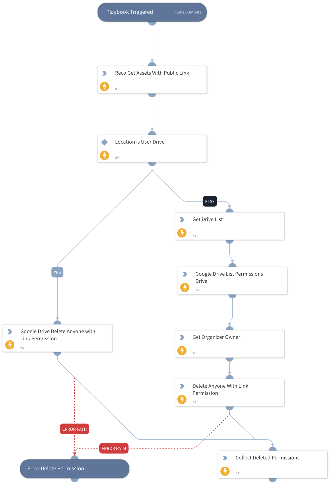

Reco Google Drive - Reduce Publicly Exposed Sensitive Files Risk

## Dependencies

This playbook depends on the following integrations:
 - Google Drive

### Integrations

Reco

### Scripts

This playbook does not use any scripts.

### Commands

reco-get-sensitive-assets-with-public-link
google-drive-file-permissions-list
google-drive-file-permission-delete
google-drive-file-permission-delete

## Playbook Inputs

---

| **Name**                 | **Description**                                           | **Required** |
|--------------------------|-----------------------------------------------------------| ------------ |
| admin_email_address  | Email address of the admin in google to get shared drives | | Required     |

## Playbook Outputs

This playbook does not have any outputs.

## Playbook Image

---

