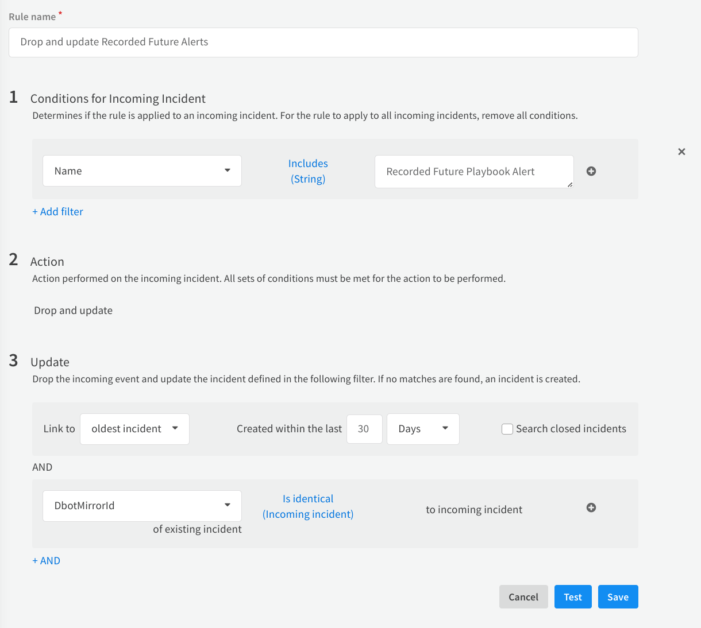

# Recorded Future - Playbook Alerts Integration

Fetch & triage Recorded Future Playbook Alerts.


## Configure Recorded Future - Playbook Alerts on Cortex XSOAR

1. Navigate to **Settings** > **Integrations** > **Servers & Services**.
2. Search for Recorded Future - Playbook Alerts.
3. Click **Add instance** to create and configure a new integration instance.

    | **Parameter**                                            | **Description**                                                                                                                                                             | **Required** |
    |----------------------------------------------------------|-----------------------------------------------------------------------------------------------------------------------------------------------------------------------------|--------------|
    | API URL (e.g., https://api.recordedfuture.com/gw/xsoar/) |                                                                                                                                                                             | True         |
    | API Token                                                |                                                                                                                                                                             | True         |
    | Trust any certificate (not secure)                       |                                                                                                                                                                             | False        |
    | Use system proxy settings                                |                                                                                                                                                                             | False        |
    | Fetch incidents                                          |                                                                                                                                                                             | False        |
    | First Incidient Fetch: Time Range                        | Limit incidents to include in the first fetch by time range. Input format: "NN hours" or "NN days". E.g., input "5 days" to fetch all incidents created in the last 5 days. | False        |
    | Playbook Alerts: Fetched Categories                      | Some listed Playbook alert Categories might be unavailable due to limitations in the current Recorded Future subscription                                                   | False        |
    | Maximum number of incidents per fetch                    |                                                                                                                                                                             | False        |
    | Playbook Alerts: Fetched Statuses                        |                                                                                                                                                                             | False        |
    | Playbook Alerts: Fetched Priorities Threshold            | Returns alerts with this selected priority or higher. High > Moderate > Informational                                                                                       | False        |
    | Incident type                                            |                                                                                                                                                                             | False        |

4. Click **Test** to validate the URLs, token, and connection.

## Pre-Process Rule

The integration pulls in Playbook alerts from Recorded Future base on its updates, this creates the need for a preprocessing rule that updates existing incidents instead of creating duplicates. Follow the guidlines below to configure the preprocessing rule.

1. Navigate to **Settings** > **Integrations** > **Pre-Process Rules**
2. Click **New Rule**
3. Enter a name for the rule
4. In the Conditions for Incoming Incident section, enter the following:
**Name** - **Includes** - **Recorded Future Playbook Alert**
5. In the Action section, select: Drop and update
6. In the Update section, choose:
**Link to** - **Oldest incident** - **Created within the last** - *Your desired timeframe*
7. In the rule for update, choose:
**DbotMirrorId** - **Is identical (Incoming Incident)** - **to incoming incident**



> The configuration of the preprocessing rule is optional, but highly recommended.


## Commands

You can execute these commands from the Cortex XSOAR CLI, as part of an automation, or in a playbook.
After you successfully execute a command, a DBot message appears in the War Room with the command details.


### recordedfuture-playbook-alerts-search

***
Search playbook alerts based on filters.

#### Base Command

`recordedfuture-playbook-alerts-search`

#### Input

| **Argument Name**     | **Description**                                                                                                                                          | **Required** |
|-----------------------|----------------------------------------------------------------------------------------------------------------------------------------------------------|--------------|
| category              | The playbook alert categories to retrieve. Default is all_available. Possible values are: all_available, domain_abuse, vulnerability, code_repo_leakage. | Optional     |
| limit                 | The maximum number of alerts to fetch.                                                                                                                   | Optional     |
| time_since_update     | The amount of time since the last update. E.g., "2 hours" or "7 days" ago.                                                                               | Optional     |
| playbook_alert_status | The statuses to retrieve. Defaults to only new status if not specified. Possible values are: new, in-progress, dismissed, resolved.                      | Optional     |
| priority              | Actions priority assigned in Recorded Future. Possible values are: high, moderate, informational.                                                        | Optional     |
| order_search_by       | The order by which to search for playbook alerts. Possible values are: updated, created.                                                                 | Optional     |

##### Command Example
```!recordedfuture-playbook-alerts-search```
```!recordedfuture-playbook-alerts-search category=domain_abuse```
```!recordedfuture-playbook-alerts-search category=vulnerability```
```!recordedfuture-playbook-alerts-search limit=10```
```!recordedfuture-playbook-alerts-search playbook_alert_status=in-progress```
```!recordedfuture-playbook-alerts-search priority=high```
```!recordedfuture-playbook-alerts-search order_search_by=updated```


#### Context Output

| **Path**                                        | **Type** | **Description**                              |
|-------------------------------------------------|----------|----------------------------------------------|
| RecordedFuture.PlaybookAlerts.playbook_alert_id | String   | Unique ID of the playbook alert.             |
| RecordedFuture.PlaybookAlerts.category          | String   | Playbook alert category.                     |
| RecordedFuture.PlaybookAlerts.priority          | String   | Recommended Priority of the alert.           |
| RecordedFuture.PlaybookAlerts.status            | String   | Current alert status in Recorded Future.     |
| RecordedFuture.PlaybookAlerts.title             | String   | Title of the alert.                          |
| RecordedFuture.PlaybookAlerts.updated           | date     | Date of last update.                         |
| RecordedFuture.PlaybookAlerts.created           | date     | Date of creation.                            |
| RecordedFuture.PlaybookAlerts.organization_id   | String   | Organization uhash.                          |
| RecordedFuture.PlaybookAlerts.organization_name | String   | Plaintext Organization name.                 |
| RecordedFuture.PlaybookAlerts.assignee_id       | String   | uhash of the assigned user.                  |
| RecordedFuture.PlaybookAlerts.assignee_name     | unknown  | name of the assigned user.                   |
| RecordedFuture.PlaybookAlerts.owner_id          | String   | uhash of the enterprise that owns the alert. |
| RecordedFuture.PlaybookAlerts.owner_name        | String   | Name of the enterprise that owns the alert.  |


### recordedfuture-playbook-alerts-details

***
Get Playbook alert details by ID.

#### Base Command

`recordedfuture-playbook-alerts-details`

#### Input

| **Argument Name** | **Description**                                                                                                                                        | **Required** |
|-------------------|--------------------------------------------------------------------------------------------------------------------------------------------------------|--------------|
| alert_ids         | IDs of the playbook alert that should be fetched.                                                                                                      | Required     |
| detail_sections   | What evidence sections to include in the fetch. Fetches all available if not specified. Possible values are: status, action, summary, log, whois, dns. | Optional     |

##### Command Example
```!recordedfuture-playbook-alerts-details alert_ids="12312312-1231-1231-1231-123123123123" detail_sections="status,log"```

#### Context Output

| **Path**                                                                              | **Type** | **Description**                                                           |
|---------------------------------------------------------------------------------------|----------|---------------------------------------------------------------------------|
| RecordedFuture.PlaybookAlerts.playbook_alert_id                                       | String   | Unique ID of the playbook alert.                                          |
| RecordedFuture.PlaybookAlerts.category                                                | String   | Playbook alert category.                                                  |
| RecordedFuture.PlaybookAlerts.priority                                                | String   | Recommended Priority of the alert.                                        |
| RecordedFuture.PlaybookAlerts.status                                                  | String   | Current alert status in Recorded Future.                                  |
| RecordedFuture.PlaybookAlerts.title                                                   | String   | Title of the alert.                                                       |
| RecordedFuture.PlaybookAlerts.updated                                                 | date     | Date of last update.                                                      |
| RecordedFuture.PlaybookAlerts.created                                                 | date     | Date of creation.                                                         |
| RecordedFuture.PlaybookAlerts.organization_id                                         | String   | Organization uhash.                                                       |
| RecordedFuture.PlaybookAlerts.organization_name                                       | String   | Plaintext Organization name.                                              |
| RecordedFuture.PlaybookAlerts.assignee_id                                             | String   | uhash of the assigned user.                                               |
| RecordedFuture.PlaybookAlerts.assignee_name                                           | String   | name of the assigned user.                                                |
| RecordedFuture.PlaybookAlerts.owner_id                                                | String   | uhash of the enterprise that owns the alert.                              |
| RecordedFuture.PlaybookAlerts.owner_name                                              | String   | Name of the enterprise that owns the alert.                               |
| RecordedFuture.PlaybookAlerts.panel_status.playbook_alert_id                          | String   | Unique ID of the playbook alert.                                          |
| RecordedFuture.PlaybookAlerts.panel_status.category                                   | String   | Playbook alert category.                                                  |
| RecordedFuture.PlaybookAlerts.panel_status.priority                                   | String   | Recommended Priority of the alert.                                        |
| RecordedFuture.PlaybookAlerts.panel_status.status                                     | String   | Current alert status in Recorded Future.                                  |
| RecordedFuture.PlaybookAlerts.panel_status.title                                      | String   | Title of the alert.                                                       |
| RecordedFuture.PlaybookAlerts.panel_status.updated                                    | date     | Date of last update.                                                      |
| RecordedFuture.PlaybookAlerts.panel_status.created                                    | date     | Date of creation                                                          |
| RecordedFuture.PlaybookAlerts.panel_status.organization_id                            | String   | Organization uhash.                                                       |
| RecordedFuture.PlaybookAlerts.panel_status.organization_name                          | String   | Plaintext Organization name.                                              |
| RecordedFuture.PlaybookAlerts.panel_status.assignee_id                                | String   | uhash of the assigned user.                                               |
| RecordedFuture.PlaybookAlerts.panel_status.assignee_name                              | unknown  | name of the assigned user.                                                |
| RecordedFuture.PlaybookAlerts.panel_status.owner_id                                   | String   | uhash of the enterprise that owns the alert.                              |
| RecordedFuture.PlaybookAlerts.panel_status.owner_name                                 | String   | Name of the enterprise that owns the alert.                               |
| RecordedFuture.PlaybookAlerts.panel_status.case_rule_id                               | String   | ID of the playbook alert category.                                        |
| RecordedFuture.PlaybookAlerts.panel_status.case_rule_label                            | String   | Name of the playbook alert category.                                      |
| RecordedFuture.PlaybookAlerts.panel_status.context_list.context                       | Array    | Context of entity connected to the Playbook alert.                        |
| RecordedFuture.PlaybookAlerts.panel_status.created                                    | String   | Date marking the creation of the Playbook alert in Recorded Future.       |
| RecordedFuture.PlaybookAlerts.panel_status.entity_criticality                         | String   | Criticality of the Playbook alert.                                        |
| RecordedFuture.PlaybookAlerts.panel_status.entity_id                                  | String   | ID of the entity in Recorded Future.                                      |
| RecordedFuture.PlaybookAlerts.panel_status.entity_name                                | String   | Name of the entity.                                                       |
| RecordedFuture.PlaybookAlerts.panel_status.risk_score                                 | String   | Risk score of the entity in Recorded Future.                              |
| RecordedFuture.PlaybookAlerts.panel_status.targets                                    | Array    | List of targets of the Playbook alert.                                    |
| RecordedFuture.PlaybookAlerts.panel_status.lifecycle_stage                            | String   | Indicates what lifecycle the vulerability is in.                          |
| RecordedFuture.PlaybookAlerts.panel_summary.explanation                               | String   | Entails the explanation to the triggering of the Playbook alert.          |
| RecordedFuture.PlaybookAlerts.panel_summary.resolved_record_list.context_list.context | String   | Context of entity connected to the Playbook alert.                        |
| RecordedFuture.PlaybookAlerts.panel_summary.resolved_record_list.criticality          | String   | Level of criticality.                                                     |
| RecordedFuture.PlaybookAlerts.panel_summary.resolved_record_list.entity               | String   | ID of the entitiy in Recorded Future.                                     |
| RecordedFuture.PlaybookAlerts.panel_summary.resolved_record_list.record_type          | String   | Type of record A, CNAME or MX.                                            |
| RecordedFuture.PlaybookAlerts.panel_summary.resolved_record_list.risk_score           | String   | Risk score of the entity in Recorded Future.                              |
| RecordedFuture.PlaybookAlerts.panel_summary.screenshots.description                   | String   | Description of the image.                                                 |
| RecordedFuture.PlaybookAlerts.panel_summary.screenshots.image_id                      | String   | ID of the screenshot in recorded future.                                  |
| RecordedFuture.PlaybookAlerts.panel_summary.screenshots.tag                           | String   | Image Analisys tag.                                                       |
| RecordedFuture.PlaybookAlerts.panel_summary.screenshots.created                       | String   | When the image was created.                                               |
| RecordedFuture.PlaybookAlerts.panel_summary.screenshots.base64                        | String   | The image binary encoded as a base64 string.                              |
| RecordedFuture.PlaybookAlerts.panel_summary.summary.targets.name                      | String   | Target affected by the vulnerability.                                     |
| RecordedFuture.PlaybookAlerts.panel_summary.summary.lifecycle_stage                   | String   | The current lifecycle stage of the Playbook Alert.                        |
| RecordedFuture.PlaybookAlerts.panel_summary.summary.riskrules.rule                    | String   | Name of the rule that triggered.                                          |
| RecordedFuture.PlaybookAlerts.panel_summary.summary.riskrules.description             | String   | Short description of the trigger \(E.g 13 sightings on 1 source..\).      |
| RecordedFuture.PlaybookAlerts.panel_summary.affected_products.name                    | String   | Name of of affected product.                                              |
| RecordedFuture.PlaybookAlerts.panel_summary.insikt_notes.id                           | String   | The ID of the Insikt note.                                                |
| RecordedFuture.PlaybookAlerts.panel_summary.insikt_notes.title                        | String   | The title of the Insikt note.                                             |
| RecordedFuture.PlaybookAlerts.panel_summary.insikt_notes.topic                        | String   | The topic of the Insikt note.                                             |
| RecordedFuture.PlaybookAlerts.panel_summary.insikt_notes.published                    | String   | The time at which the Insikt note was published.                          |
| RecordedFuture.PlaybookAlerts.panel_summary.insikt_notes.fragment                     | String   | A fragment of the Insikt note text.                                       |
| RecordedFuture.PlaybookAlerts.panel_log.id                                            | String   | Log ID in Recorded Future.                                                |
| RecordedFuture.PlaybookAlerts.panel_log.actor_id                                      | String   | ID of the actor.                                                          |
| RecordedFuture.PlaybookAlerts.panel_log.created                                       | String   | When was the log created.                                                 |
| RecordedFuture.PlaybookAlerts.panel_log.modified                                      | String   | When was the log last modified.                                           |
| RecordedFuture.PlaybookAlerts.panel_log.action_priority                               | String   | The priority of the Playbook alert.                                       |
| RecordedFuture.PlaybookAlerts.panel_log.message                                       | String   | Log message.                                                              |
| RecordedFuture.PlaybookAlerts.panel_log.changes.assigne_change.old                    | String   | Previous assignee.                                                        |
| RecordedFuture.PlaybookAlerts.panel_log.changes.assigne_change.new                    | String   | New assignee.                                                             |
| RecordedFuture.PlaybookAlerts.panel_log.changes.assigne_change.type                   | String   | Type of change.                                                           |
| RecordedFuture.PlaybookAlerts.panel_log.changes.status_change.old                     | String   | Previous status.                                                          |
| RecordedFuture.PlaybookAlerts.panel_log.changes.status_change.new                     | String   | New status.                                                               |
| RecordedFuture.PlaybookAlerts.panel_log.changes.status_change.type                    | String   | Type of change.                                                           |
| RecordedFuture.PlaybookAlerts.panel_log.changes.title_change.old                      | String   | Previous title.                                                           |
| RecordedFuture.PlaybookAlerts.panel_log.changes.title_change.new                      | String   | New title.                                                                |
| RecordedFuture.PlaybookAlerts.panel_log.changes.title_change.type                     | String   | Type of change.                                                           |
| RecordedFuture.PlaybookAlerts.panel_log.changes.priority_change.old                   | String   | Previous priority.                                                        |
| RecordedFuture.PlaybookAlerts.panel_log.changes.priority_change.new                   | String   | New priority.                                                             |
| RecordedFuture.PlaybookAlerts.panel_log.changes.priority_change.type                  | String   | Type of change.                                                           |
| RecordedFuture.PlaybookAlerts.panel_log.changes.reopen_strategy_change.old            | String   | Previous reopen strategy.                                                 |
| RecordedFuture.PlaybookAlerts.panel_log.changes.reopen_strategy_change.new            | String   | New reopen strategy.                                                      |
| RecordedFuture.PlaybookAlerts.panel_log.changes.reopen_strategy_change.type           | String   | Type of change.                                                           |
| RecordedFuture.PlaybookAlerts.panel_log.changes.entities_change.removed               | String   | Removed entity.                                                           |
| RecordedFuture.PlaybookAlerts.panel_log.changes.entities_change.added                 | String   | Added entity.                                                             |
| RecordedFuture.PlaybookAlerts.panel_log.changes.entities_change.type                  | String   | Type of change.                                                           |
| RecordedFuture.PlaybookAlerts.panel_log.changes.related_entities_change.removed       | String   | Removed related entity.                                                   |
| RecordedFuture.PlaybookAlerts.panel_log.changes.related_entities_change.added         | String   | Added related entity.                                                     |
| RecordedFuture.PlaybookAlerts.panel_log.changes.related_entities_changetype           | String   | Type of change.                                                           |
| RecordedFuture.PlaybookAlerts.panel_log.changes.description_change.old                | String   | Previous description.                                                     |
| RecordedFuture.PlaybookAlerts.panel_log.changes.description_change.new                | String   | New description.                                                          |
| RecordedFuture.PlaybookAlerts.panel_log.changes.description_change.type               | String   | Type of change.                                                           |
| RecordedFuture.PlaybookAlerts.panel_log.changes.external_id_change.old                | String   | Previous external ID.                                                     |
| RecordedFuture.PlaybookAlerts.panel_log.changes.external_id_change.new                | String   | New external ID.                                                          |
| RecordedFuture.PlaybookAlerts.panel_log.changes.external_id_change.type               | String   | Type of change.                                                           |
| RecordedFuture.PlaybookAlerts.panel_action.action                                     | String   | The name of the action.                                                   |
| RecordedFuture.PlaybookAlerts.panel_action.updated                                    | String   | When was the action last updated.                                         |
| RecordedFuture.PlaybookAlerts.panel_action.assignee_name                              | String   | Full name of the assignee.                                                |
| RecordedFuture.PlaybookAlerts.panel_action.assignee_id                                | String   | ID of the assignee.                                                       |
| RecordedFuture.PlaybookAlerts.panel_action.status                                     | String   | The status of the action.                                                 |
| RecordedFuture.PlaybookAlerts.panel_action.description                                | String   | A short description of the action.                                        |
| RecordedFuture.PlaybookAlerts.panel_action.link                                       | String   | A link associated with the action.                                        |
| RecordedFuture.PlaybookAlerts.panel_dns.ip_list.record                                | String   | The DNS record.                                                           |
| RecordedFuture.PlaybookAlerts.panel_dns.ip_list.risk_score                            | String   | Risk score associated with the record.                                    |
| RecordedFuture.PlaybookAlerts.panel_dns.ip_list.criticality                           | String   | The level of criticality.                                                 |
| RecordedFuture.PlaybookAlerts.panel_dns.ip_list.record_type                           | String   | Type of record A, CNAME or MX.                                            |
| RecordedFuture.PlaybookAlerts.panel_dns.ip_list.context_list.context                  | String   | Labels of malicious behavior types that can be associated with an entity. |
| RecordedFuture.PlaybookAlerts.panel_dns.mx_list.record                                | String   | The DNS record.                                                           |
| RecordedFuture.PlaybookAlerts.panel_dns.mx_list.risk_score                            | String   | Risk score associated with the record.                                    |
| RecordedFuture.PlaybookAlerts.panel_dns.mx_list.criticality                           | String   | The level of criticality.                                                 |
| RecordedFuture.PlaybookAlerts.panel_dns.mx_list.record_type                           | String   | Type of record A, CNAME or MX.                                            |
| RecordedFuture.PlaybookAlerts.panel_dns.mx_list.context_list.context                  | String   | Labels of malicious behavior types that can be associated with an entity. |
| RecordedFuture.PlaybookAlerts.panel_dns.ns_list.record                                | String   | The DNS record.                                                           |
| RecordedFuture.PlaybookAlerts.panel_dns.ns_list.risk_score                            | String   | Risk score associated with the record.                                    |
| RecordedFuture.PlaybookAlerts.panel_dns.ns_list.criticality                           | String   | The level of criticality.                                                 |
| RecordedFuture.PlaybookAlerts.panel_dns.ns_list.record_type                           | String   | Type of record A, CNAME or MX.                                            |
| RecordedFuture.PlaybookAlerts.panel_dns.ns_list.context_list.context                  | String   | Labels of malicious behavior types that can be associated with an entity. |
| RecordedFuture.PlaybookAlerts.panel_whois.body.added                                  | String   | When the whois information was added.                                     |
| RecordedFuture.PlaybookAlerts.panel_whois.body.attribute                              | String   | Attribute, either whois or whoisContancts.                                |
| RecordedFuture.PlaybookAlerts.panel_whois.body.entity                                 | String   | ID of whois entity.                                                       |
| RecordedFuture.PlaybookAlerts.panel_whois.body.provider                               | String   | Name of provider.                                                         |
| RecordedFuture.PlaybookAlerts.panel_whois.body.value.createdDate                      | String   | When was it created.                                                      |
| RecordedFuture.PlaybookAlerts.panel_whois.body.value.nameServers                      | Array    | List of name server IDs.                                                  |
| RecordedFuture.PlaybookAlerts.panel_whois.body.value.privateRegistration              | Bool     | Boolean indicating private registration.                                  |
| RecordedFuture.PlaybookAlerts.panel_whois.body.value.registrarName                    | String   | Name of the registrar.                                                    |
| RecordedFuture.PlaybookAlerts.panel_whois.body.value.status                           | String   | Status of registrar.                                                      |
| RecordedFuture.PlaybookAlerts.panel_whois.body.value.city                             | String   | Contact located in this city.                                             |
| RecordedFuture.PlaybookAlerts.panel_whois.body.value.country                          | String   | Contact located in this city.                                             |
| RecordedFuture.PlaybookAlerts.panel_whois.body.value.name                             | String   | Name of contact.                                                          |
| RecordedFuture.PlaybookAlerts.panel_whois.body.value.organization                     | String   | Name of contact organization.                                             |
| RecordedFuture.PlaybookAlerts.panel_whois.body.value.postalCode                       | String   | Postal code of contact organization.                                      |
| RecordedFuture.PlaybookAlerts.panel_whois.body.value.state                            | String   | Contact located in state.                                                 |
| RecordedFuture.PlaybookAlerts.panel_whois.body.value.street1                          | String   | Street name of contact.                                                   |
| RecordedFuture.PlaybookAlerts.panel_whois.body.value.telephone                        | String   | Phone number of contact.                                                  |
| RecordedFuture.PlaybookAlerts.panel_whois.body.value.type                             | String   | Type of contact.                                                          |

### recordedfuture-playbook-alerts-update

***
Update the status of one or multiple Playbook alerts

#### Base Command

`recordedfuture-playbook-alerts-update`

#### Input

| **Argument Name** | **Description**                                                                                                                                                                     | **Required** |
|-------------------|-------------------------------------------------------------------------------------------------------------------------------------------------------------------------------------|--------------|
| alert_ids         | IDs of the playbook alerts that will be updated.                                                                                                                                    | Required     | 
| new_status        | New status to set for all alerts in alert_ids. Possible values are: new, in-progress, dismissed, resolved.                                                                          | Required     |
| comment           | Add a comment to all alerts in alert_ids.                                                                                                                                           | Optional     |
| reopen            | Set the reopen strategy for the alert. Reopen on significant updates or keep the alert Resolved. Default: reopen on significant updates. Can only be used with new_status=resolved. | Optional     |

##### Command Example
```!recordedfuture-playbook-alerts-update alert_ids="12312312-1231-1231-1231-123123123123" new_status="New"```

#### Context Output

| **Path**                                        | **Type** | **Description**                                      |
|-------------------------------------------------|----------|------------------------------------------------------|
| RecordedFuture.PlaybookAlerts.playbook_alert_id | string   | Unique ID of the playbook alert in Recorded Future.  |
| RecordedFuture.PlaybookAlerts.current_status    | string   | Current status of playbook alert in Recorded Future. |
| RecordedFuture.PlaybookAlerts.title             | string   | Title of the playbook alert in Recorded Future.      |
| RecordedFuture.PlaybookAlerts.status_message    | string   | Message describing the outcome of the update.        |

---