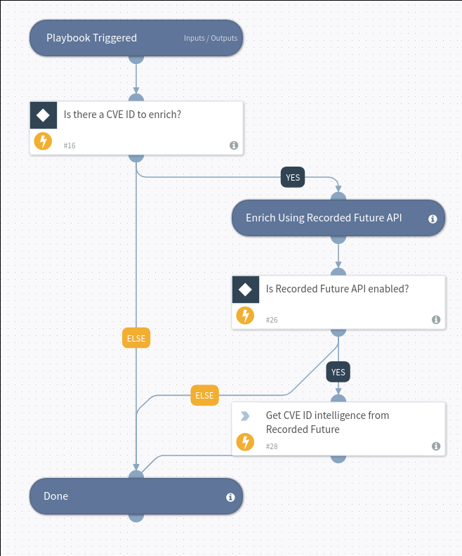

CVE Enrichment using Recorded Future Intelligence

## Dependencies
This playbook uses the following sub-playbooks, integrations, and scripts. Depends on the recorded futures indicator field risk rules.

### Sub-playbooks
This playbook does not use any sub-playbooks.

### Integrations
* Recorded Future v2

### Scripts
This playbook does not use any scripts.

### Commands
* recordedfuture-intelligence

## Playbook Inputs
---

| **Name** | **Description** | **Default Value** | **Required** |
| --- | --- | --- | --- |
| CVE | The CVE ID to enrich. | CVE.ID | Optional |

## Playbook Outputs
---

| **Path** | **Description** | **Type** |
| --- | --- | --- |
| DBotScore.Indicator | The indicator that was tested | string |
| DBotScore.Type | Indicator type | string |
| DBotScore.Vendor | Vendor used to calculate the score | string |
| DBotScore.Score | The actual score | number |
| CVE.ID | Vulnerability name | string |
| RecordedFuture.CVE.criticality | Risk Criticality | number |
| RecordedFuture.CVE.criticalityLabel | Risk Criticality Label | string |
| RecordedFuture.CVE.riskString | Risk String | string |
| RecordedFuture.CVE.riskSummary | Risk Summary | string |
| RecordedFuture.CVE.rules | Risk Rules | string |
| RecordedFuture.CVE.score | Risk Score | number |
| RecordedFuture.CVE.firstSeen | Evidence First Seen | date |
| RecordedFuture.CVE.lastSeen | Evidence Last Seen | date |
| RecordedFuture.CVE.intelCard | Recorded Future Intelligence Card URL | string |
| RecordedFuture.CVE.type | Entity Type | string |
| RecordedFuture.CVE.name | Entity | string |
| RecordedFuture.CVE.id | Recorded Future Entity ID | string |
| RecordedFuture.CVE.metrics.type | Recorded Future Metrics Type | String |
| RecordedFuture.CVE.metrics.value | Recorded Future Metrics Value | Number |
| RecordedFuture.CVE.threatLists.description | Recorded Future Threat List Description | String |
| RecordedFuture.CVE.threatLists.id | Recorded Future Threat List ID | String |
| RecordedFuture.CVE.threatLists.name | Recorded Future Threat List Name | String |
| RecordedFuture.CVE.threatLists.type | Recorded Future Threat List Type | String |
| RecordedFuture.CVE.relatedEntities.RelatedAttacker.count | Recorded Future Related Count | Number |
| RecordedFuture.CVE.relatedEntities.RelatedAttacker.id | Recorded Future Related ID | String |
| RecordedFuture.CVE.relatedEntities.RelatedAttacker.name | Recorded Future Related Name | String |
| RecordedFuture.CVE.relatedEntities.RelatedAttacker.type | Recorded Future Related Type | String |
| RecordedFuture.CVE.relatedEntities.RelatedTarget.count | Recorded Future Related Count | Number |
| RecordedFuture.CVE.relatedEntities.RelatedTarget.id | Recorded Future Related ID | String |
| RecordedFuture.CVE.relatedEntities.RelatedTarget.name | Recorded Future Related Name | String |
| RecordedFuture.CVE.relatedEntities.RelatedTarget.type | Recorded Future Related Type | String |
| RecordedFuture.CVE.relatedEntities.RelatedThreatActor.count | Recorded Future Related Count | Number |
| RecordedFuture.CVE.relatedEntities.RelatedThreatActor.id | Recorded Future Related ID | String |
| RecordedFuture.CVE.relatedEntities.RelatedThreatActor.name | Recorded Future Related Name | String |
| RecordedFuture.CVE.relatedEntities.RelatedThreatActor.type | Recorded Future Related Type | String |
| RecordedFuture.CVE.relatedEntities.RelatedMalware.count | Recorded Future Related Count | Number |
| RecordedFuture.CVE.relatedEntities.RelatedMalware.id | Recorded Future Related ID | String |
| RecordedFuture.CVE.relatedEntities.RelatedMalware.name | Recorded Future Related Name | String |
| RecordedFuture.CVE.relatedEntities.RelatedMalware.type | Recorded Future Related Type | String |
| RecordedFuture.CVE.relatedEntities.RelatedCyberVulnerability.count | Recorded Future Related Count | Number |
| RecordedFuture.CVE.relatedEntities.RelatedCyberVulnerability.id | Recorded Future Related ID | String |
| RecordedFuture.CVE.relatedEntities.RelatedCyberVulnerability.name | Recorded Future Related Name | String |
| RecordedFuture.CVE.relatedEntities.RelatedCyberVulnerability.type | Recorded Future Related Type | String |
| RecordedFuture.CVE.relatedEntities.RelatedIpAddress.count | Recorded Future Related Count | Number |
| RecordedFuture.CVE.relatedEntities.RelatedIpAddress.id | Recorded Future Related ID | String |
| RecordedFuture.CVE.relatedEntities.RelatedIpAddress.name | Recorded Future Related Name | String |
| RecordedFuture.CVE.relatedEntities.RelatedIpAddress.type | Recorded Future Related Type | String |
| RecordedFuture.CVE.relatedEntities.RelatedInternetDomainName.count | Recorded Future Related Count | Number |
| RecordedFuture.CVE.relatedEntities.RelatedInternetDomainName.id | Recorded Future Related ID | String |
| RecordedFuture.CVE.relatedEntities.RelatedInternetDomainName.name | Recorded Future Related Name | String |
| RecordedFuture.CVE.relatedEntities.RelatedInternetDomainName.type | Recorded Future Related Type | String |
| RecordedFuture.CVE.relatedEntities.RelatedProduct.count | Recorded Future Related Count | Number |
| RecordedFuture.CVE.relatedEntities.RelatedProduct.id | Recorded Future Related ID | String |
| RecordedFuture.CVE.relatedEntities.RelatedProduct.name | Recorded Future Related Name | String |
| RecordedFuture.CVE.relatedEntities.RelatedProduct.type | Recorded Future Related Type | String |
| RecordedFuture.CVE.relatedEntities.RelatedCountries.count | Recorded Future Related Count | Number |
| RecordedFuture.CVE.relatedEntities.RelatedCountries.id | Recorded Future Related ID | String |
| RecordedFuture.CVE.relatedEntities.RelatedCountries.name | Recorded Future Related Name | String |
| RecordedFuture.CVE.relatedEntities.RelatedCountries.type | Recorded Future Related Type | String |
| RecordedFuture.CVE.relatedEntities.RelatedHash.count | Recorded Future Related Count | Number |
| RecordedFuture.CVE.relatedEntities.RelatedHash.id | Recorded Future Related ID | String |
| RecordedFuture.CVE.relatedEntities.RelatedHash.name | Recorded Future Related Name | String |
| RecordedFuture.CVE.relatedEntities.RelatedHash.type | Recorded Future Related Type | String |
| RecordedFuture.CVE.relatedEntities.RelatedTechnology.count | Recorded Future Related Count | Number |
| RecordedFuture.CVE.relatedEntities.RelatedTechnology.id | Recorded Future Related ID | String |
| RecordedFuture.CVE.relatedEntities.RelatedTechnology.name | Recorded Future Related Name | String |
| RecordedFuture.CVE.relatedEntities.RelatedTechnology.type | Recorded Future Related Type | String |
| RecordedFuture.CVE.relatedEntities.RelatedEmailAddress.count | Recorded Future Related Count | Number |
| RecordedFuture.CVE.relatedEntities.RelatedEmailAddress.id | Recorded Future Related ID | String |
| RecordedFuture.CVE.relatedEntities.RelatedEmailAddress.name | Recorded Future Related Name | String |
| RecordedFuture.CVE.relatedEntities.RelatedEmailAddress.type | Recorded Future Related Type | String |
| RecordedFuture.CVE.relatedEntities.RelatedAttackVector.count | Recorded Future Related Count | Number |
| RecordedFuture.CVE.relatedEntities.RelatedAttackVector.id | Recorded Future Related ID | String |
| RecordedFuture.CVE.relatedEntities.RelatedAttackVector.name | Recorded Future Related Name | String |
| RecordedFuture.CVE.relatedEntities.RelatedAttackVector.type | Recorded Future Related Type | String |
| RecordedFuture.CVE.relatedEntities.RelatedMalwareCategory.count | Recorded Future Related Count | Number |
| RecordedFuture.CVE.relatedEntities.RelatedMalwareCategory.id | Recorded Future Related ID | String |
| RecordedFuture.CVE.relatedEntities.RelatedMalwareCategory.name | Recorded Future Related Name | String |
| RecordedFuture.CVE.relatedEntities.RelatedMalwareCategory.type | Recorded Future Related Type | String |
| RecordedFuture.CVE.relatedEntities.RelatedOperations.count | Recorded Future Related Count | Number |
| RecordedFuture.CVE.relatedEntities.RelatedOperations.id | Recorded Future Related ID | String |
| RecordedFuture.CVE.relatedEntities.RelatedOperations.name | Recorded Future Related Name | String |
| RecordedFuture.CVE.relatedEntities.RelatedOperations.type | Recorded Future Related Type | String |
| RecordedFuture.CVE.relatedEntities.RelatedCompany.count | Recorded Future Related Count | Number |
| RecordedFuture.CVE.relatedEntities.RelatedCompany.id | Recorded Future Related ID | String |
| RecordedFuture.CVE.relatedEntities.RelatedCompany.name | Recorded Future Related Name | String |
| RecordedFuture.CVE.relatedEntities.RelatedCompany.type | Recorded Future Related Type | String |

## Playbook Image
---

