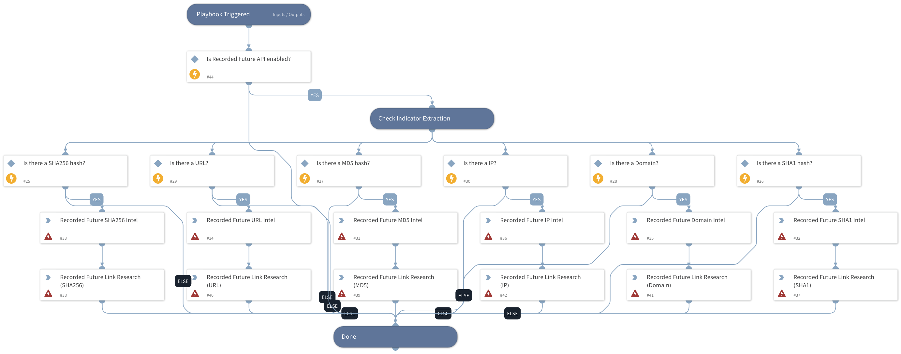

Template playbook to incorporate Recorded Future enrichment for IPs, Hashes, Domains, URLs into your current workflows. Playbook also shows how to look up available 'Links' data for IOCs.

## Dependencies
This playbook uses the following sub-playbooks, integrations, and scripts.

### Sub-playbooks
This playbook does not use any sub-playbooks.

### Integrations
* Recorded Future v2

### Scripts
This playbook does not use any scripts.

### Commands
* recordedfuture-intelligence
* recordedfuture-links

## Playbook Inputs
---

| **Name** | **Description** | **Default Value** | **Required** |
| --- | --- | --- | --- |
| MD5 | File MD5 hash to enrich. | File.MD5 | Optional |
| SHA256 | The file SHA256 hash to enrich. | File.SHA256 | Optional |
| SHA1 | The file SHA1 hash to enrich. | File.SHA1 | Optional |
| IP | The IP Address to enrich. | IP.Address | Optional |
| Domain | The Domain name to enrich. | Domain.Name | Optional |
| URL | The URL to enrich. | URL.Data | Optional |

## Playbook Outputs
---

| **Path** | **Description** | **Type** |
| --- | --- | --- |
| DBotScore.Indicator | The indicator that was tested. | string |
| DBotScore.Type | The indicator type. | string |
| DBotScore | The DBotScore object. | unknown |
| DBotScore.Vendor | Vendor used to calculate the score. | string |
| DBotScore.Score | The actual score. | number |

## Playbook Image
---
