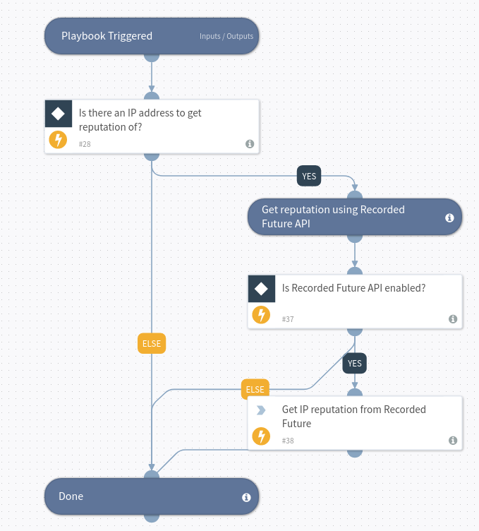

IP address reputation using Recorded Future SOAR Enrichment

## Dependencies
This playbook uses the following sub-playbooks, integrations, and scripts. Depends on the recorded futures indicator field; risk rules.

### Sub-playbooks
This playbook does not use any sub-playbooks.

### Integrations
* Recorded Future v2

### Scripts
This playbook does not use any scripts.

### Commands
* ip

## Playbook Inputs
---

| **Name** | **Description** | **Default Value** | **Required** |
| --- | --- | --- | --- |
| IP | The IP address to get reputation of. | IP.Address | Optional |

## Playbook Outputs
---

| **Path** | **Description** | **Type** |
| --- | --- | --- |
| DBotScore.Indicator | The indicator that was tested | string |
| DBotScore.Type | Indicator type | string |
| DBotScore.Vendor | Vendor used to calculate the score | string |
| DBotScore.Score | The actual score | number |
| IP.Malicious.Vendor | For malicious IP addresses, the vendor that made the decision | string |
| IP.Malicious.Description | For malicious IP addresses, the reason that the vendor made the decision | string |
| IP.Address | IP address | string |
| RecordedFuture.IP.riskScore | Recorded Future IP Risk Score | number |
| RecordedFuture.IP.riskLevel | Recorded Future IP Risk Level | string |
| RecordedFuture.IP.Evidence.rule | Recorded Risk Rule Name | string |
| RecordedFuture.IP.Evidence.mitigation | Recorded Risk Rule Mitigation | string |
| RecordedFuture.IP.Evidence.description | Recorded Risk Rule Description | string |
| RecordedFuture.IP.Evidence.timestamp | Recorded Risk Rule Timestamp | date |
| RecordedFuture.IP.Evidence.level | Recorded Risk Rule Level | number |
| RecordedFuture.IP.Evidence.ruleid | Recorded Risk Rule ID | string |
| RecordedFuture.IP.name | IP Address | string |
| RecordedFuture.IP.maxRules | Maximum count of Recorded Future IP Risk Rules | number |
| RecordedFuture.IP.ruleCount | Number of triggered Recorded Future IP Risk Rules | number |

## Playbook Image
---

