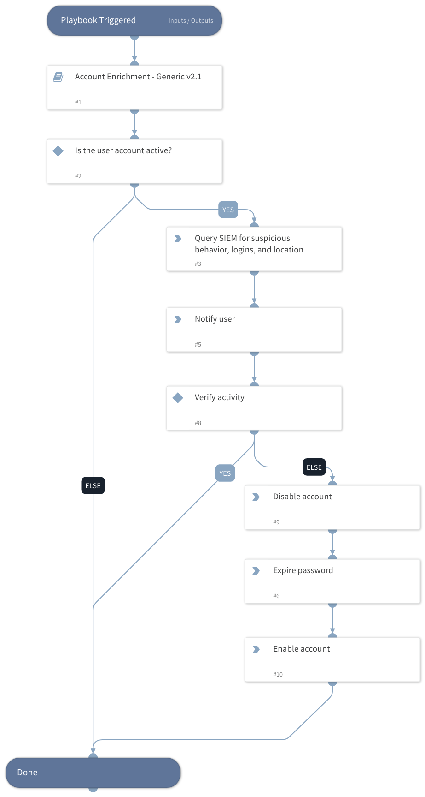

Template playbook showing suggested steps to triage leaked credential alerts. Classifier/Mapper are available to ingest Recorded Future Leaked Credential Alerts.

## Dependencies
This playbook uses the following sub-playbooks, integrations, and scripts.

### Sub-playbooks
* Account Enrichment - Generic v2.1

### Integrations
This playbook does not use any integrations.

### Scripts
This playbook does not use any scripts.

### Commands
This playbook does not use any commands.

## Playbook Inputs
---

| **Name** | **Description** | **Default Value** | **Required** |
| --- | --- | --- | --- |
| account |  | incident.recordedfuturealertentities.name | Optional |

## Playbook Outputs
---
There are no outputs for this playbook.

## Playbook Image
---
