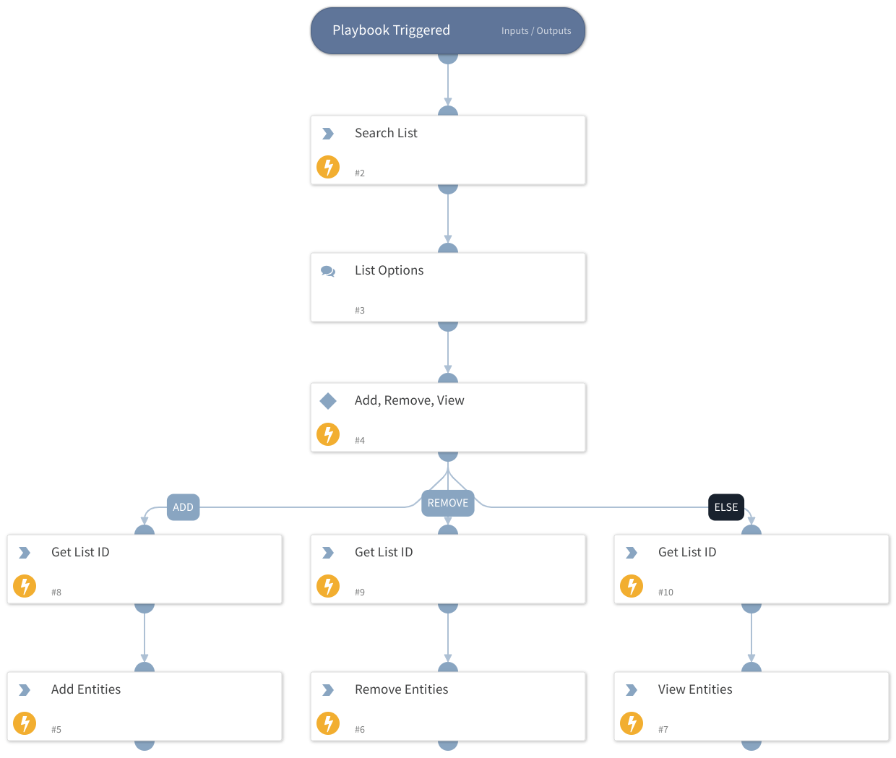

Manage, view, and edit your lists in Recorded Future.

## Dependencies

This playbook uses the following sub-playbooks, integrations, and scripts.

### Sub-playbooks

This playbook does not use any sub-playbooks.

### Integrations

RecordedFutureLists

### Scripts

This playbook does not use any scripts.

### Commands

* recordedfuture-lists-search
* recordedfuture-lists-entities
* recordedfuture-lists-add-entities
* recordedfuture-lists-remove-entities

## Playbook Inputs

---
There are no inputs for this playbook.

## Playbook Outputs

---
There are no outputs for this playbook.

## Playbook Image

---

