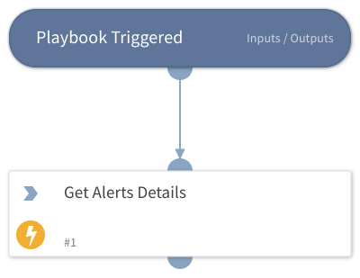

A default playbook to fetch details of Playbook alert that does not yet have mapping made by Recorded Future

## Dependencies

This playbook uses the following sub-playbooks, integrations, and scripts.

### Sub-playbooks

This playbook does not use any sub-playbooks.

### Integrations

* RecordedFuturePlaybookAlerts

### Scripts

This playbook does not use any scripts.

### Commands

* recordedfuture-playbook-alerts-details

## Playbook Inputs

---
There are no inputs for this playbook.

## Playbook Outputs

---
There are no outputs for this playbook.

## Playbook Image

---

