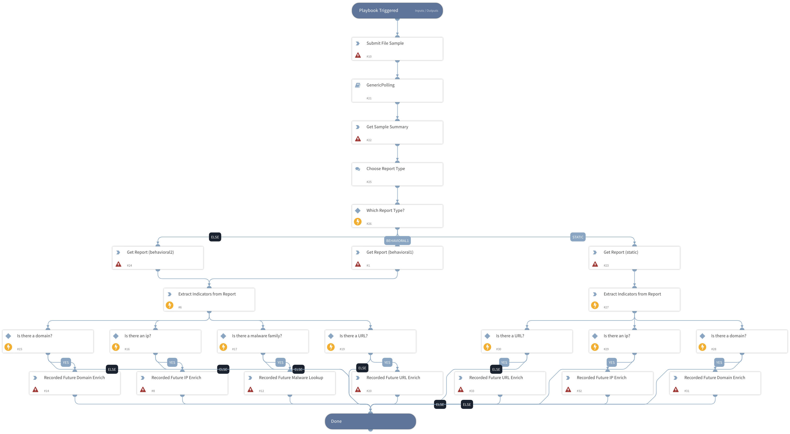

Template playbook utilizing Hatching.io to sandbox a given file and generate an analysis report. Indicators from the given report are then extracted and enriched with Recorded Future data.

## Dependencies
This playbook uses the following sub-playbooks, integrations, and scripts.

### Sub-playbooks
* GenericPolling

### Integrations
* Hatching Triage
* Recorded Future v2

### Scripts
This playbook does not use any scripts.

### Commands
* domain
* triage-submit-sample
* recordedfuture-malware-search
* triage-get-report-triage
* triage-get-sample-summary
* ip
* triage-get-static-report
* extractIndicators
* url

## Playbook Inputs
---

| **Name** | **Description** | **Default Value** | **Required** |
| --- | --- | --- | --- |
| File |  | File.EntryID | Optional |

## Playbook Outputs
---

| **Path** | **Description** | **Type** |
| --- | --- | --- |
| DBotScore | The DBotScore object. | unknown |
| DBotScore.Indicator | Triage analysis target | unknown |
| DBotScore.Type | The indicator type - File or URL | unknown |
| DBotScore.Vendor | The integration used to generate the indicator | unknown |
| DBotScore.Score | Analysis verdict as score from 1 to 10 | unknown |

## Playbook Image
---
