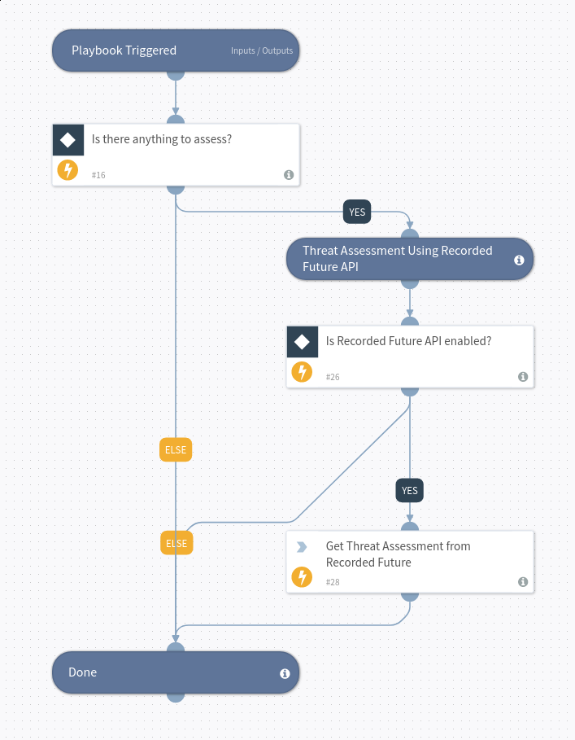

Threat Assessment using the Recorded Future SOAR Triage API and the context Phishing.

## Dependencies
This playbook uses the following sub-playbooks, integrations, and scripts. Depends on the recorded futures indicator field; threat assessment.

### Sub-playbooks
This playbook does not use any sub-playbooks.

### Integrations
* Recorded Future v2

### Scripts
This playbook does not use any scripts.

### Commands
* recordedfuture-threat-assessment

## Playbook Inputs
---

| **Name** | **Description** | **Default Value** | **Required** |
| --- | --- | --- | --- |
| CVE | CVE ID to check if it is related to the C2 context. | CVE.ID | Optional |
| IP | IP Address to check if it is related to the C2 context. | IP.Address | Optional |
| URL | URL to check if it is related to the C2 context. | URL.Data | Optional |
| MD5 | MD5 to check if it is related to the C2 context. | File.MD5 | Optional |
| SHA1 | SHA\-1 to check if it is related to the C2 context. | File.SHA1 | Optional |
| SHA256 | SHA\-256 to check if it is related to the C2 context. | File.SHA256 | Optional |
| Domain | Domain to check if it is related to the C2 context. | Domain.Name | Optional |
| threat-assessment-context | Context to use for assessment. This is used by Recorded Future to calculate the relevant score and verdict. Valid values are "c2", "malware" and "phishing". | phishing | Required |

## Playbook Outputs
---

| **Path** | **Description** | **Type** |
| --- | --- | --- |
| DBotScore.Indicator | The indicator that was tested | string |
| DBotScore.Type | Indicator type | string |
| DBotScore.Vendor | Vendor used to calculate the score | string |
| DBotScore.Score | The actual score | number |
| File.SHA256 | File SHA\-256 | string |
| File.SHA512 | File SHA\-512 | string |
| File.SHA1 | File SHA\-1 | string |
| File.MD5 | File MD5 | string |
| File.CRC32 | File CRC32 | string |
| File.CTPH | File CTPH | string |
| IP.Address | IP address | string |
| IP.ASN | ASN | string |
| IP.Geo.Country | IP Geolocation Country | string |
| Domain.Name | Domain name | string |
| URL.Data | URL name | string |
| CVE.ID | Vulnerability name | string |
| RecordedFuture.verdict | Recorded Future verdict | boolean |
| RecordedFuture.context | Threat Assessment Context | string |
| RecordedFuture.riskScore | Recorded Future Max Score | number |
| RecordedFuture.Entities.id | Entity ID | string |
| RecordedFuture.Entities.name | Entity Name | string |
| RecordedFuture.Entities.type | Entity Type | string |
| RecordedFuture.Entities.score | Entity Score | string |
| RecordedFuture.Entities.Evidence.ruleid | Recorded Future Risk Rule ID | string |
| RecordedFuture.Entities.Evidence.timestamp | Recorded Future Evidence Timestamp | date |
| RecordedFuture.Entities.Evidence.mitigation | Recorded Future Evidence Mitigation | string |
| RecordedFuture.Entities.Evidence.description | Recorded Future Evidence Description | string |
| RecordedFuture.Entities.Evidence.rule | Recorded Future Risk Rule | string |
| RecordedFuture.Entities.Evidence.level | Recorded Future Risk Rule Level | number |

## Playbook Image
---

