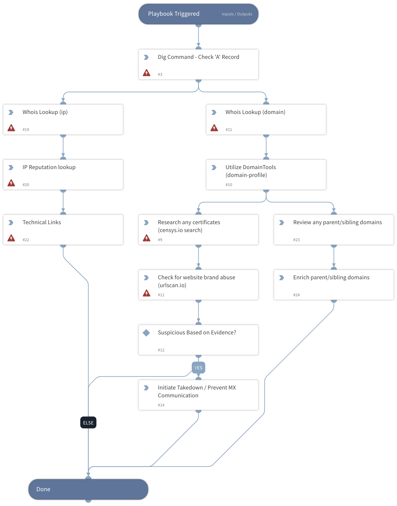

Template playbook showing suggested steps to triage typo squat alerts. Classifier/Mapper are available to ingest Recorded Future Typo squat Alerts.

## Dependencies
This playbook uses the following sub-playbooks, integrations, and scripts.

### Sub-playbooks
This playbook does not use any sub-playbooks.

### Integrations
* Whois
* CensysV2
* urlscan.io
* Recorded Future v2

### Scripts
* Dig

### Commands
* cen-search
* recordedfuture-links
* ip
* whois
* url

## Playbook Inputs
---

| **Name** | **Description** | **Default Value** | **Required** |
| --- | --- | --- | --- |
| domain |  | incident.recordedfuturealertentities.name | Optional |

## Playbook Outputs
---
There are no outputs for this playbook.

## Playbook Image
---
