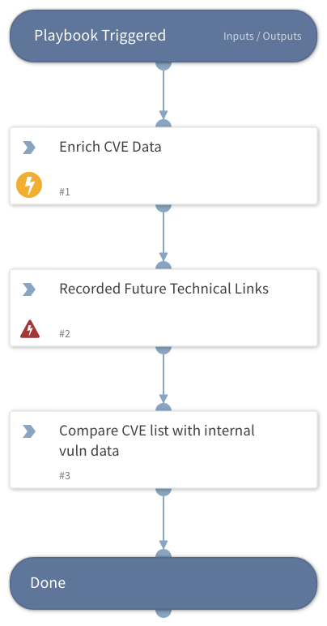

Template playbook showing suggested steps to triage new critical vulnerability alerts. Playbook include New and Critical CVEs. Classifier/Mapper are available to ingest Recorded Future New, Critical or Pre NVD Vulnerability Alerts.

## Dependencies
This playbook uses the following sub-playbooks, integrations, and scripts.

### Sub-playbooks
This playbook does not use any sub-playbooks.

### Integrations
* Recorded Future v2
* RecordedFuture

### Scripts
This playbook does not use any scripts.

### Commands
* recordedfuture-links
* recordedfuture-intelligence

## Playbook Inputs
---

| **Name** | **Description** | **Default Value** | **Required** |
| --- | --- | --- | --- |
| cve |  | incident.recordedfuturealertentities.name | Optional |

## Playbook Outputs
---
There are no outputs for this playbook.

## Playbook Image
---
