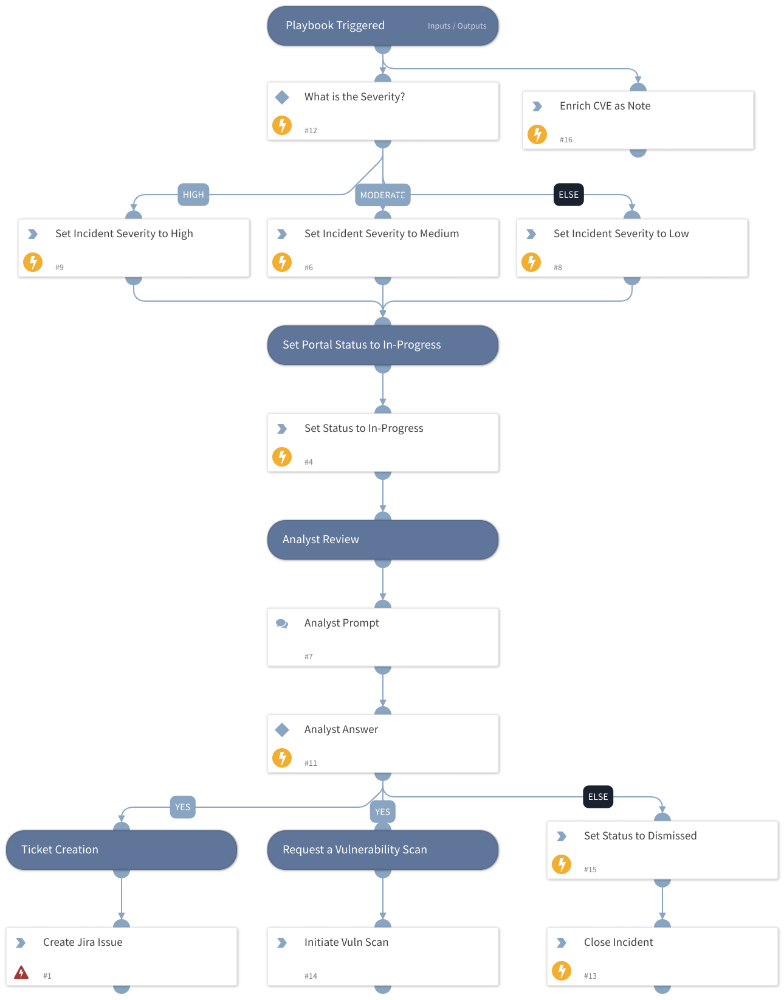

This playbook was developed as a template to handle the ingestion of Recorded Future Cyber Vulnerability playbook alerts.

## Dependencies

This playbook uses the following sub-playbooks, integrations, and scripts.

### Sub-playbooks

This playbook does not use any sub-playbooks.

### Integrations

* RecordedFuturePlaybookAlerts
* jira-v2
* Recorded Future v2

### Scripts

This playbook does not use any scripts.

### Commands

* recordedfuture-playbook-alerts-update
* recordedfuture-intelligence
* jira-create-issue
* setIncident
* closeInvestigation

## Playbook Inputs

---
There are no inputs for this playbook.

## Playbook Outputs

---
There are no outputs for this playbook.

## Playbook Image

---

