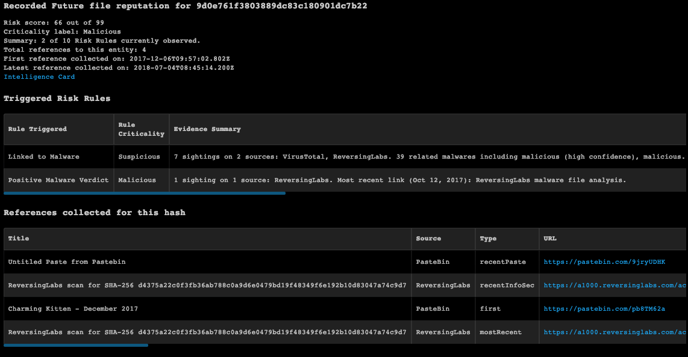

<!-- HTML_DOC -->

Deprecated. Use Recorded Future v2 from RecordedFuture pack instead.

Recorded Future is a threat intelligence platform, whose indicator and alert data is ingested into Cortex XSOAR for enrichment.

This integration was integrated and tested with revision r128029 of Recorded Future.

<h2 id="use-cases">Use Cases</h2>

<ol>
<li>Get reputation of IOCs: IP addresses, domains and files.</li>
<li>Look up threat intelligence context for an IOC.</li>
<li>Ingest indicators from risk lists - <strong>important</strong> note below.</li>
<li>Fetch alerts by rules - <strong>important</strong> note below.</li>
</ol>

<h2 id="fetched-incidents-data">Fetched Incidents Data</h2>

<pre>{
  "data": {
    "rule": {
      "url": "https://app.recordedfuture.com/live/sc/ViewIdkobra_view_report_item_alert_editor?view_opts=%7B%22reportId%22%3A%22Y8d2JN%22%2C%22bTitle%22%3Atrue%2C%22title%22%3A%22DJIA+Cyber%22%7D&amp;state.bNavbar=false",
      "name": "DJIA Cyber",
      "id": "Y8d2JN"
    },
    "type": "EVENT",
    "entities": [
      {
        "entity": null,
        "risk": {},
        "trend": {},
        "documents": [
          {
            "references": [
              {
                "fragment": "This malware can steal passwords, credit card info in Chrome, Safari.",
                "entities": [
                  {
                    "id": "czhXN",
                    "name": "PT Reliance Securities Tbk",
                    "type": "Company"
                  },
                  {
                    "id": "B_sMd",
                    "name": "Apple Safari",
                    "type": "Product"
                  },
                  {
                    "id": "B_tZO",
                    "name": "Palo Alto Networks",
                    "type": "Company"
                  },
                  {
                    "id": "GARXk",
                    "name": "MSMEs",
                    "type": "Company"
                  },
                  {
                    "id": "B_LyO",
                    "name": "Apple",
                    "type": "Company"
                  },
                  {
                    "id": "B_HE4",
                    "name": "Google",
                    "type": "Company"
                  }
                ],
                "language": "eng"
              }
            ],
            "source": {
              "id": "KFGeiP",
              "name": "CanIndia NEWS",
              "type": "Source"
            },
            "url": "http://www.canindia.com/this-malware-can-steal-passwords-credit-card-info-in-chrome-safari/",
            "title": "This malware can steal passwords, credit card info in Chrome, Safari"
          },
          {
            "references": [
              {
                "fragment": "Malicious code hidden in the Windows registry.",
                "entities": [
                  {
                    "id": "B_Hs5",
                    "name": "F5 Networks",
                    "type": "Company"
                  },
                  {
                    "id": "B_E-R",
                    "name": "Twitter",
                    "type": "Company"
                  },
                  {
                    "id": "J0LOpv",
                    "name": "Malicious code",
                    "type": "AttackVector"
                  },
                  {
                    "id": "Y97Q48",
                    "name": "HTML Signature Solutions",
                    "type": "Company"
                  },
                  {
                    "id": "CBJSs",
                    "name": "LinkedIn",
                    "type": "Company"
                  },
                  {
                    "id": "B_HOS",
                    "name": "Microsoft Windows",
                    "type": "Product"
                  }
                ],
                "language": "eng"
              }
            ],
            "source": {
              "id": "RrKkHT",
              "name": "F5 Networks",
              "type": "Source"
            },
            "url": "https://www.f5.com/labs/articles/threat-intelligence/gozi-adds-evasion-techniques-to-its-growing-bag-of-tricks",
            "title": null
          },
          {
            "references": [
              {
                "fragment": "The company noted in a blog post the ransomware had infected more than 100 Windows servers by exploiting several web application vulnerabilities, and the number of victims was rising.",
                "entities": [
                  {
                    "id": "Cq3eF",
                    "name": "Web application vulnerabilities",
                    "type": "IndustryTerm"
                  },
                  {
                    "id": "J0Nl-p",
                    "name": "Ransomware",
                    "type": "MalwareCategory"
                  },
                  {
                    "id": "B_HOS",
                    "name": "Microsoft Windows",
                    "type": "Product"
                  }
                ],
                "language": "eng"
              },
              {
                "fragment": "The company noted in a blog post the ransomware had infected more than 100 Windows servers by exploiting several web application vulnerabilities, and the number of victims was rising.",
                "entities": [
                  {
                    "id": "Cq3eF",
                    "name": "Web application vulnerabilities",
                    "type": "IndustryTerm"
                  },
                  {
                    "id": "J0Nl-p",
                    "name": "Ransomware",
                    "type": "MalwareCategory"
                  },
                  {
                    "id": "B_HOS",
                    "name": "Microsoft Windows",
                    "type": "Product"
                  }
                ],
                "language": "eng"
              }
            ],
            "source": {
              "id": "idn:8btc.com",
              "name": "8btc.com",
              "type": "InternetDomainName"
            },
            "url": "https://news.8btc.com/an-upgraded-satan-ransomware-infects-hundreds-of-windows-servers-in-china-demanding-a-ransom-of-1-bitcoin-within-3-days",
            "title": "An Upgraded Satan Ransomware Infects Hundreds of Windows Servers in China, Demanding a Ransom of 1 Bitcoin Within 3 Days | NEWS.8BTC.COM."
          },
          {
            "references": [
              {
                "fragment": "example.gmail.com|1qazse4r",
                "entities": [
                  {
                    "id": "email:example.gmail.com",
                    "name": "example.gmail.com",
                    "type": "EmailAddress"
                  }
                ],
                "language": "eng"
              },
              {
                "fragment": "example.gmail.com|snapy573",
                "entities": [
                  {
                    "id": "email:example.gmail.com",
                    "name": "example.gmail.com",
                    "type": "EmailAddress"
                  }
                ],
                "language": "eng"
              },
              {
                "fragment": "example.gmail.com|ric290888",
                "entities": [
                  {
                    "id": "email:example.gmail.com",
                    "name": "example.gmail.com",
                    "type": "EmailAddress"
                  }
                ],
                "language": "eng"
              },
              {
                "fragment": "example.gmail.com|cumicumi49",
                "entities": [
                  {
                    "id": "email:example.gmail.com",
                    "name": "example.gmail.com",
                    "type": "EmailAddress"
                  }
                ],
                "language": "eng"
              },
              {
                "fragment": "example.gmail.com|20may1993",
                "entities": [
                  {
                    "id": "email:example.gmail.com",
                    "name": "example.gmail.com",
                    "type": "EmailAddress"
                  }
                ],
                "language": "eng"
              },
              {
                "fragment": "example.gmail.com|04041995",
                "entities": [
                  {
                    "id": "email:example.gmail.com",
                    "name": "example.gmail.com",
                    "type": "EmailAddress"
                  }
                ],
                "language": "eng"
              },
              {
                "fragment": "example.gmail.com|lk63864551",
                "entities": [
                  {
                    "id": "email:example.gmail.com",
                    "name": "example.gmail.com",
                    "type": "EmailAddress"
                  }
                ],
                "language": "eng"
              },
              {
                "fragment": "example.gmail.com|mememesheryl",
                "entities": [
                  {
                    "id": "email:example.gmail.com",
                    "name": "example.gmail.com",
                    "type": "EmailAddress"
                  }
                ],
                "language": "eng"
              },
              {
                "fragment": "example.gmail.com|danubrata45",
                "entities": [
                  {
                    "id": "email:example.gmail.com",
                    "name": "example.gmail.com",
                    "type": "EmailAddress"
                  }
                ],
                "language": "eng"
              },
              {
                "fragment": "example.gmail.com|miracles7",
                "entities": [
                  {
                    "id": "email:example.gmail.com",
                    "name": "example.gmail.com",
                    "type": "EmailAddress"
                  }
                ],
                "language": "eng"
              },
              {
                "fragment": "example.gmail.com|albert",
                "entities": [
                  {
                    "id": "email:example.gmail.com",
                    "name": "example.gmail.com",
                    "type": "EmailAddress"
                  }
                ],
                "language": "eng"
              },
              {
                "fragment": "example.gmail.com|14Oktober1998",
                "entities": [
                  {
                    "id": "email:example.gmail.com",
                    "name": "example.gmail.com",
                    "type": "EmailAddress"
                  }
                ],
                "language": "eng"
              },
              {
                "fragment": "example.gmail.com|1234qwer",
                "entities": [
                  {
                    "id": "email:example.gmail.com",
                    "name": "example.gmail.com",
                    "type": "EmailAddress"
                  }
                ],
                "language": "eng"
              },
              {
                "fragment": "example.gmail.com|dwitamaalfred",
                "entities": [
                  {
                    "id": "email:example.gmail.com",
                    "name": "example.gmail.com",
                    "type": "EmailAddress"
                  }
                ],
                "language": "eng"
              },
              {
                "fragment": "example.gmail.com|oliviaagnes",
                "entities": [
                  {
                    "id": "email:example.gmail.com",
                    "name": "example.gmail.com",
                    "type": "EmailAddress"
                  }
                ],
                "language": "eng"
              },
              {
                "fragment": "example.gmail.com|5148520362",
                "entities": [
                  {
                    "id": "email:example.gmail.com",
                    "name": "example.gmail.com",
                    "type": "EmailAddress"
                  }
                ],
                "language": "eng"
              },
              {
                "fragment": "example.gmail.com|kucit11",
                "entities": [
                  {
                    "id": "email:example.gmail.com",
                    "name": "example.gmail.com",
                    "type": "EmailAddress"
                  }
                ],
                "language": "eng"
              },
              {
                "fragment": "example.gmail.com|n1kuailema",
                "entities": [
                  {
                    "id": "email:example.gmail.com",
                    "name": "example.gmail.com",
                    "type": "EmailAddress"
                  }
                ],
                "language": "eng"
              },
              {
                "fragment": "example.gmail.com|limajuli",
                "entities": [
                  {
                    "id": "email:example.gmail.com",
                    "name": "example.gmail.com",
                    "type": "EmailAddress"
                  }
                ],
                "language": "eng"
              },
              {
                "fragment": "example.gmail.com|tasyakevinrio",
                "entities": [
                  {
                    "id": "email:example.gmail.com",
                    "name": "example.gmail.com",
                    "type": "EmailAddress"
                  }
                ],
                "language": "eng"
              },
              {
                "fragment": "example.gmail.com|747474",
                "entities": [
                  {
                    "id": "email:example.gmail.com",
                    "name": "example.gmail.com",
                    "type": "EmailAddress"
                  }
                ],
                "language": "eng"
              },
              {
                "fragment": "example.gmail.com|sanurlovers",
                "entities": [
                  {
                    "id": "email:example.gmail.com",
                    "name": "example.gmail.com",
                    "type": "EmailAddress"
                  }
                ],
                "language": "eng"
              },
              {
                "fragment": "example.gmail.com|bologe10101994",
                "entities": [
                  {
                    "id": "email:example.gmail.com",
                    "name": "example.gmail.com",
                    "type": "EmailAddress"
                  }
                ],
                "language": "eng"
              },
              {
                "fragment": "example.gmail.com|flymuc12",
                "entities": [
                  {
                    "id": "email:example.gmail.com",
                    "name": "example.gmail.com",
                    "type": "EmailAddress"
                  }
                ],
                "language": "eng"
              },
              {
                "fragment": "example.gmail.com|donnie",
                "entities": [
                  {
                    "id": "email:example.gmail.com",
                    "name": "example.gmail.com",
                    "type": "EmailAddress"
                  }
                ],
                "language": "eng"
              },
              {
                "fragment": "example.gmail.com|g153ll3",
                "entities": [
                  {
                    "id": "email:example.gmail.com",
                    "name": "example.gmail.com",
                    "type": "EmailAddress"
                  }
                ],
                "language": "eng"
              },
              {
                "fragment": "example.gmail.com|kolonel8",
                "entities": [
                  {
                    "id": "email:example.gmail.com",
                    "name": "example.gmail.com",
                    "type": "EmailAddress"
                  }
                ],
                "language": "eng"
              },
              {
                "fragment": "example.gmail.com|Na11032009",
                "entities": [
                  {
                    "id": "email:example.gmail.com",
                    "name": "example.gmail.com",
                    "type": "EmailAddress"
                  }
                ],
                "language": "eng"
              },
              {
                "fragment": "example.gmail.com|gogle05",
                "entities": [
                  {
                    "id": "email:example.gmail.com",
                    "name": "example.gmail.com",
                    "type": "EmailAddress"
                  }
                ],
                "language": "eng"
              },
              {
                "fragment": "example.gmail.com|my9snapy",
                "entities": [
                  {
                    "id": "email:example.gmail.com",
                    "name": "example.gmail.com",
                    "type": "EmailAddress"
                  }
                ],
                "language": "eng"
              },
              {
                "fragment": "example.gmail.com|bani2005",
                "entities": [
                  {
                    "id": "email:example.gmail.com",
                    "name": "example.gmail.com",
                    "type": "EmailAddress"
                  }
                ],
                "language": "eng"
              },
              {
                "fragment": "example.gmail.com|mala2581998",
                "entities": [
                  {
                    "id": "email:example.gmail.com",
                    "name": "example.gmail.com",
                    "type": "EmailAddress"
                  }
                ],
                "language": "eng"
              },
              {
                "fragment": "example.gmail.com|961501",
                "entities": [
                  {
                    "id": "email:example.gmail.com",
                    "name": "example.gmail.com",
                    "type": "EmailAddress"
                  }
                ],
                "language": "eng"
              },
              {
                "fragment": "example.gmail.com|april322912",
                "entities": [
                  {
                    "id": "email:example.gmail.com",
                    "name": "example.gmail.com",
                    "type": "EmailAddress"
                  }
                ],
                "language": "eng"
              },
              {
                "fragment": "example.gmail.com|dalshabet2012",
                "entities": [
                  {
                    "id": "email:example.gmail.com",
                    "name": "example.gmail.com",
                    "type": "EmailAddress"
                  }
                ],
                "language": "eng"
              },
              {
                "fragment": "example.gmail.com|vicha1002",
                "entities": [
                  {
                    "id": "email:example.gmail.com",
                    "name": "example.gmail.com",
                    "type": "EmailAddress"
                  }
                ],
                "language": "eng"
              },
              {
                "fragment": "example.gmail.com|0811570188",
                "entities": [
                  {
                    "id": "email:example.gmail.com",
                    "name": "example.gmail.com",
                    "type": "EmailAddress"
                  }
                ],
                "language": "eng"
              },
              {
                "fragment": "example.gmail.com|amidala7",
                "entities": [
                  {
                    "id": "email:example.gmail.com",
                    "name": "example.gmail.com",
                    "type": "EmailAddress"
                  }
                ],
                "language": "eng"
              },
              {
                "fragment": "example.gmail.com|janand",
                "entities": [
                  {
                    "id": "email:example.gmail.com",
                    "name": "example.gmail.com",
                    "type": "EmailAddress"
                  }
                ],
                "language": "eng"
              },
              {
                "fragment": "example.gmail.com|cheptie",
                "entities": [
                  {
                    "id": "email:example.gmail.com",
                    "name": "example.gmail.com",
                    "type": "EmailAddress"
                  }
                ],
                "language": "eng"
              },
              {
                "fragment": "example.gmail.com|Dealova33",
                "entities": [
                  {
                    "id": "email:example.gmail.com",
                    "name": "example.gmail.com",
                    "type": "EmailAddress"
                  }
                ],
                "language": "eng"
              },
              {
                "fragment": "example.gmail.com|jss231094",
                "entities": [
                  {
                    "id": "email:example.gmail.com",
                    "name": "example.gmail.com",
                    "type": "EmailAddress"
                  }
                ],
                "language": "eng"
              },
              {
                "fragment": "example.gmail.com|arschgeil00",
                "entities": [
                  {
                    "id": "email:example.gmail.com",
                    "name": "example.gmail.com",
                    "type": "EmailAddress"
                  }
                ],
                "language": "eng"
              },
              {
                "fragment": "example.gmail.com|burlgoat97",
                "entities": [
                  {
                    "id": "email:example.gmail.com",
                    "name": "example.gmail.com",
                    "type": "EmailAddress"
                  }
                ],
                "language": "eng"
              },
              {
                "fragment": "example.gmail.com|Ahau7296",
                "entities": [
                  {
                    "id": "email:example.gmail.com",
                    "name": "example.gmail.com",
                    "type": "EmailAddress"
                  }
                ],
                "language": "eng"
              },
              {
                "fragment": "example.gmail.com|gilaabis",
                "entities": [
                  {
                    "id": "email:example.gmail.com",
                    "name": "example.gmail.com",
                    "type": "EmailAddress"
                  }
                ],
                "language": "eng"
              },
              {
                "fragment": "example.gmail.com|123456",
                "entities": [
                  {
                    "id": "email:example.gmail.com",
                    "name": "example.gmail.com",
                    "type": "EmailAddress"
                  }
                ],
                "language": "eng"
              },
              {
                "fragment": "example.gmail.com|Tiffani16694",
                "entities": [
                  {
                    "id": "email:example.gmail.com",
                    "name": "example.gmail.com",
                    "type": "EmailAddress"
                  }
                ],
                "language": "eng"
              },
              {
                "fragment": "example.gmail.com|4ndr15ukm4v4r094",
                "entities": [
                  {
                    "id": "email:example.gmail.com",
                    "name": "example.gmail.com",
                    "type": "EmailAddress"
                  }
                ],
                "language": "eng"
              }
            ],
            "source": {
              "id": "Jv_xrR",
              "name": "PasteBin",
              "type": "Source"
            },
            "url": "https://pastebin.com/20WrvAKf",
            "title": "5K empas Indo + Bonus"
          },
          {
            "references": [
              {
                "fragment": "| [+] E-mail Found: example.gmail.com",
                "entities": [
                  {
                    "id": "email:example.gmail.com",
                    "name": "example.gmail.com",
                    "type": "EmailAddress"
                  }
                ],
                "language": "eng"
              }
            ],
            "source": {
              "id": "Jv_xrR",
              "name": "PasteBin",
              "type": "Source"
            },
            "url": "https://pastebin.com/Ntk14mse",
            "title": "Anonymous JTSEC #OpIsis Full Recon #11"
          },
          {
            "references": [
              {
                "fragment": "I remember reading that it was made loose on purpose so cords don't bring your Mac down if they're tripped over.",
                "entities": [
                  {
                    "id": "BBh7yv",
                    "name": "Mac",
                    "type": "Product"
                  }
                ],
                "language": "eng"
              }
            ],
            "source": {
              "id": "TiY1wz",
              "name": "Apple devices",
              "type": "Source"
            },
            "url": "https://www.reddit.com/r/apple/comments/aljr4z/apple_testing_iphones_with_usbc_port/efi3j06/",
            "title": "/u/ccrama on Apple testing iPhones with USB-C port"
          },
          {
            "references": [
              {
                "fragment": "App Store, iTunes Store, Apple Music been down for several hours now! @AppleSupport.",
                "entities": [
                  {
                    "id": "JZHhWg",
                    "name": "Apple iTunes",
                    "type": "Product"
                  },
                  {
                    "id": "QGkOLY",
                    "name": "@AppleSupport",
                    "type": "Username"
                  },
                  {
                    "id": "B_LyO",
                    "name": "Apple",
                    "type": "Company"
                  }
                ],
                "language": "eng"
              }
            ],
            "source": {
              "id": "BV5",
              "name": "Twitter",
              "type": "Source"
            },
            "url": "https://twitter.com/PRHTH/statuses/1091215388086394880",
            "title": "App Store, iTunes Store , Apple Music down พร้อมกันหมดเลยจ้า หลายชั่วโมงแล้ว \n\nApp Store, iTunes Store, Apple Music been down for several hours now! @AppleSupport"
          },
          {
            "references": [
              {
                "fragment": "An Upgraded Satan Ransomware Infects Hundreds of Windows Servers in China, Demanding a Ransom of 1 Bitcoin Within 3 Days - 8BTC via BTCnews #Bitcoin https://t.co/1YEkzEdO92.",
                "entities": [
                  {
                    "id": "B75KVV",
                    "name": "via",
                    "type": "IndustryTerm"
                  },
                  {
                    "id": "url:https://news.8btc.com/an-upgraded-satan-ransomware-infects-hundreds-of-windows-servers-in-china-demanding-a-ransom-of-1-bitcoin-within-3-days",
                    "name": "https://news.8btc.com/an-upgraded-satan-ransomware-infects-hundreds-of-windows-servers-in-china-demanding-a-ransom-of-1-bitcoin-within-3-days",
                    "type": "URL"
                  },
                  {
                    "id": "IH6pHd",
                    "name": "Bitcoin",
                    "type": "Technology"
                  },
                  {
                    "id": "Kei3LZ",
                    "name": "#Bitcoin",
                    "type": "Hashtag"
                  },
                  {
                    "id": "SePISm",
                    "name": "Satan",
                    "type": "Malware"
                  },
                  {
                    "id": "B_FNa",
                    "name": "China",
                    "type": "Country"
                  },
                  {
                    "id": "J0Nl-p",
                    "name": "Ransomware",
                    "type": "MalwareCategory"
                  },
                  {
                    "id": "B_HOS",
                    "name": "Microsoft Windows",
                    "type": "Product"
                  }
                ],
                "language": "eng"
              }
            ],
            "source": {
              "id": "BV5",
              "name": "Twitter",
              "type": "Source"
            },
            "url": "https://twitter.com/btcnewsapp/statuses/1091268383180537856",
            "title": "An Upgraded Satan Ransomware Infects Hundreds of Windows Servers in China, Demanding a Ransom of 1 Bitcoin Within 3 Days - 8BTC via BTCnews #Bitcoin https://t.co/1YEkzEdO92"
          },
          {
            "references": [
              {
                "fragment": "@Apple Flaw that allows hacker to access target mic, camera, location, memory.",
                "entities": [
                  {
                    "id": "P_iscR",
                    "name": "@Apple",
                    "type": "Username"
                  }
                ],
                "language": "eng"
              }
            ],
            "source": {
              "id": "BV5",
              "name": "Twitter",
              "type": "Source"
            },
            "url": "https://twitter.com/ganag92444992/statuses/1091257432662134784",
            "title": "@Apple Flaw that allows hacker to access target mic, camera, location, memory.\nAny remedy for that? Targetted due to that flaw\nSo not  #iOS #Apple #iphone  #hacker #HackerNews #cybersecurity #privacy #HumanRights #surveillance #DataSecurity #DataProtection"
          }
        ]
      }
    ],
    "review": {
      "noteDate": null,
      "note": null,
      "noteAuthor": null,
      "assignee": null,
      "status": "no-action"
    },
    "url": "https://app.recordedfuture.com/live/sc/notification/?id=Y9-jli",
    "triggered": "2019-02-01T09:58:13.564Z",
    "title": "DJIA Cyber - New references in 9 documents",
    "counts": {
      "references": 58,
      "entities": 0,
      "documents": 9
    },
    "id": "Y9-jli"
  }
}
</pre>

<h2 id="configure-recorded-future-on-demisto">Configure Recorded Future on Cortex XSOAR</h2>

To use Recorded Future in Cortex XSOAR, a Recorded Future API token is required. For more information, see the <a href="https://support.recordedfuture.com/hc/en-us/articles/115004179227-Managing-API-tokens">Recorded Future documentation</a>.

<ol>
<li>Navigate to <strong>Settings</strong> &gt; <strong>Integrations</strong> &gt; <strong>Servers &amp; Services</strong>.</li>
<li>Search for Recorded Future.</li>
<li>Click <strong>Add instance</strong> to create and configure a new integration instance.
<ul>
<li>
<strong>Name</strong>: a textual name for the integration instance.</li>
<li><strong>Server URL (e.g., <a href="https://api.recordedfuture.com/">https://api.recordedfuture.com</a>)</strong></li>
<li><strong>API Token</strong></li>
<li><strong>File Threshold. Minimum risk score from Recorded Future to consider the file malicious.</strong></li>
<li><strong>IP Threshold. Minimum risk score from RF to consider the IP malicious.</strong></li>
<li><strong>Domain Threshold. Minimum risk score from Recorded Future to consider the domain malicious.</strong></li>
<li><strong>URL Threshold. Minimum risk score from Recorded Future to consider the URL malicious.</strong></li>
<li><strong>Vulnerability Threshold. Minimum risk score from Recorded Future to consider the vulnerability critical.</strong></li>
<li><strong>Trust any certificate (not secure)</strong></li>
<li><strong>Use system proxy settings</strong></li>
<li><strong>Fetch incidents</strong></li>
<li><strong>Rule names to fetch alerts by, separated by semicolon. If empty, all alerts will be fetched</strong></li>
<li><strong>First fetch time (&lt;number&gt; &lt;time unit&gt;, e.g., 12 hours, 7 days, 3 months, 1 year)</strong></li>
<li><strong>Incident type</strong></li>
</ul>
</li>
<li>Click <strong>Test</strong> to validate the URLs, token, and connection.</li>
</ol>

<h2 id="commands">Commands</h2>

You can execute these commands from the Cortex XSOAR CLI, as part of an automation, or in a playbook.  After you successfully execute a command, a DBot message appears in the War Room with the command details.

<ol>
<li><a href="#get-information-for-a-domain-or-dns">Get information for a domain or DNS: domain</a></li>
<li><a href="#get-information-for-an-ip-address">Get information for an IP address: ip</a></li>
<li><a href="#get-information-for-a-file">Get information for a file: file</a></li>
<li><a href="#get-information-for-a-url">Get information for a URL: url</a></li>
<li><a href="#get-threat-intelligence-context-for-an-indicator">Get threat intelligence context for an indicator: recorded-future-get-related-entities</a></li>
<li><a href="#get-hash-threats">Get hash threats: recorded-future-get-threats-hash</a></li>
<li><a href="#get-ip-threats">Get IP threats: recorded-future-get-threats-ip</a></li>
<li><a href="#get-url-threats">Get URL threats: recorded-future-get-threats-url</a></li>
<li><a href="#get-domain-threats">Get domain threats: recorded-future-get-threats-domain</a></li>
<li><a href="#get-vulnerability-threats">Get vulnerability threats: recorded-future-get-threats-vulnerabilities</a></li>
<li><a href="#get-the-domain-risk-list">Get the domain risk list: recorded-future-get-domain-risklist</a></li>
<li><a href="#get-the-url-risk-list">Get the URL risk list: recorded-future-get-url-risklist</a></li>
<li><a href="#get-the-ip-address-risk-list">Get the IP address risk list: recorded-future-get-ip-risklist</a></li>
<li><a href="#get-the-vulnerability-risk-list">Get the vulnerability risk list: recorded-future-get-vulnerability-risklist</a></li>
<li><a href="#get-the-has-risk-list">Get the hash risk list: recorded-future-get-hash-risklist</a></li>
<li><a href="#get-the-domain-risk-rules">Get domain risk rules: recorded-future-get-domain-riskrules</a></li>
<li><a href="#get-the-has-risk-rules">Get hash risk rules: recorded-future-get-hash-riskrules</a></li>
<li><a href="#get-the-ip-address-risk-rules">Get IP address risk rules: recorded-future-get-ip-riskrules</a></li>
<li><a href="#get-the-url-risk-rules">Get URL risk rules: recorded-future-get-url-riskrules</a></li>
<li><a href="#get-the-vulnerability-risk-rules">Get vulnerability risk rules: recorded-future-get-vulnerability-riskrules</a></li>
<li><a href="#get-a-list-of-alert-rules">Get a list of alert rules: recorded-future-get-alert-rules</a></li>
<li><a href="#get-a-list-of-alerts">Get a list of alerts: recorded-future-get-alerts</a></li>
</ol>

<h3 id="get-information-for-a-domain-or-dns">1. Get information for a domain or DNS</h3>

This command is deprecated.

Use `recordedfuture-intelligence` command from Recorded Future v2 with the following argument `entity_type=domain` and `entity=domain_value`.

You can find context differences <a href="https://xsoar.pan.dev/docs/reference/integrations/recorded-future-v2#recordedfuture-intelligence">here</a>. Notice that 'community notes' output is no longer supported.

Returns threat intelligence information for a domain or DNS in Recorded Future.

<h5 id="base-command">Base Command</h5>

<code>domain</code>

<h5 id="input">Input</h5>

<table style="width: 748px;">
<thead>
<tr>
<th style="width: 140px;"><strong>Argument Name</strong></th>
<th style="width: 529px;"><strong>Description</strong></th>
<th style="width: 71px;"><strong>Required</strong></th>
</tr>
</thead>
<tbody>
<tr>
<td style="width: 140px;">domain</td>
<td style="width: 529px;">Domain to get the reputation of</td>
<td style="width: 71px;">Required</td>
</tr>
<tr>
<td style="width: 140px;">detailed</td>
<td style="width: 529px;">If true, fetches evidence details. Evidence is a record that is generated if any of the risk rules in Recorded Future is triggered.</td>
<td style="width: 71px;">Optional</td>
</tr>
</tbody>
</table>

 

<h5 id="context-output">Context Output</h5>

<table style="width: 749px;">
<thead>
<tr>
<th style="width: 325px;"><strong>Path</strong></th>
<th style="width: 81px;"><strong>Type</strong></th>
<th style="width: 334px;"><strong>Description</strong></th>
</tr>
</thead>
<tbody>
<tr>
<td style="width: 325px;">DBotScore.Indicator</td>
<td style="width: 81px;">string</td>
<td style="width: 334px;">The indicator that was tested</td>
</tr>
<tr>
<td style="width: 325px;">DBotScore.Type</td>
<td style="width: 81px;">string</td>
<td style="width: 334px;">Indicator type</td>
</tr>
<tr>
<td style="width: 325px;">DBotScore.Vendor</td>
<td style="width: 81px;">string</td>
<td style="width: 334px;">Vendor used to calculate the score</td>
</tr>
<tr>
<td style="width: 325px;">DBotScore.Score</td>
<td style="width: 81px;">number</td>
<td style="width: 334px;">The actual score</td>
</tr>
<tr>
<td style="width: 325px;">Domain.Name</td>
<td style="width: 81px;">string</td>
<td style="width: 334px;">Domain name</td>
</tr>
<tr>
<td style="width: 325px;">Domain.RecordedFuture.Criticality</td>
<td style="width: 81px;">string</td>
<td style="width: 334px;">Domain criticality label</td>
</tr>
<tr>
<td style="width: 325px;">Domain.RecordedFuture.FirstSeen</td>
<td style="width: 81px;">date</td>
<td style="width: 334px;">Risk first seen timestamp</td>
</tr>
<tr>
<td style="width: 325px;">Domain.RecordedFuture.LastSeen</td>
<td style="width: 81px;">date</td>
<td style="width: 334px;">Risk last seen timestamp</td>
</tr>
<tr>
<td style="width: 325px;">Domain.Tags</td>
<td style="width: 81px;">String</td>
<td style="width: 334px;">Tags that are associated with the Domain.</td>
</tr>
<tr>
<td style="width: 325px;">Domain.CommunityNotes.note</td>
<td style="width: 81px;">String</td>
<td style="width: 334px;">A summary note on the mentioning of the domain in a source monitored by Recorded Future.</td>
</tr>
<tr>
<td style="width: 325px;">Domain.CommunityNotes.timestamp</td>
<td style="width: 81px;">date</td>
<td style="width: 334px;">The timestamp in which the community note was created.</td>
</tr>
<tr>
<td style="width: 325px;">Domain.Publications.source</td>
<td style="width: 81px;">String</td>
<td style="width: 334px;">The publication's source.</td>
</tr>
<tr>
<td style="width: 325px;">Domain.Publications.title</td>
<td style="width: 81px;">String</td>
<td style="width: 334px;">The title of the published information.</td>
</tr>
<tr>
<td style="width: 325px;">Domain.Publications.link</td>
<td style="width: 81px;">String</td>
<td style="width: 334px;">A link to the published information.</td>
</tr>
<tr>
<td style="width: 325px;">Domain.Publications.timestamp</td>
<td style="width: 81px;">date</td>
<td style="width: 334px;">The timestamp in which the information was published.</td>
</tr>
</tbody>
</table>

 

<h5 id="command-example">Command Example</h5>

<pre>!domain domain=google.com detailed=true</pre>

<h5 id="context-example">Context Example</h5>

<pre>{
    "DBotScore": {
        "Indicator": "google.com",
        "Score": 2,
        "Type": "domain",
        "Vendor": "Recorded Future"
    },
    "Domain": {
     "Name": "google.com",
    "RecordedFuture": {
        "Criticality": "Unusual",
        "FirstSeen": "2009-01-21T14:00:18.000Z",
        "LastSeen": "2018-07-04T07:25:34.533Z",
       }
     }
}
</pre>

<h5 id="human-readable-output">Human Readable Output</h5>

<h3 id="get-information-for-an-ip-address">2. Get information for an IP address</h3>

This command is deprecated.

Use `recordedfuture-intelligence` command from Recorded Future v2 with the following argument `entity_type=ip` and `entity=ip_value`.

You can find context differences <a href="https://xsoar.pan.dev/docs/reference/integrations/recorded-future-v2#recordedfuture-intelligence">here</a>. Notice that 'community notes' output is no longer supported.

Returns threat intelligence information for an IP address in Recorded Future.

<h5 id="base-command-1">Base Command</h5>

<code>ip</code>

<h5 id="input-1">Input</h5>

<table style="width: 748px;">
<thead>
<tr>
<th style="width: 145px;"><strong>Argument Name</strong></th>
<th style="width: 524px;"><strong>Description</strong></th>
<th style="width: 71px;"><strong>Required</strong></th>
</tr>
</thead>
<tbody>
<tr>
<td style="width: 145px;">ip</td>
<td style="width: 524px;">IP address to get the reputation of</td>
<td style="width: 71px;">Required</td>
</tr>
<tr>
<td style="width: 145px;">detailed</td>
<td style="width: 524px;">If true, fetches evidence details. Evidence is a record that is generated if any of the risk rules in Recorded Future is triggered.</td>
<td style="width: 71px;">Optional</td>
</tr>
</tbody>
</table>

 

<h5 id="context-output-1">Context Output</h5>

<table style="width: 749px;">
<thead>
<tr>
<th style="width: 211px;"><strong>Path</strong></th>
<th style="width: 46px;"><strong>Type</strong></th>
<th style="width: 483px;"><strong>Description</strong></th>
</tr>
</thead>
<tbody>
<tr>
<td style="width: 211px;">DBotScore.Indicator</td>
<td style="width: 46px;">string</td>
<td style="width: 483px;">The indicator that was tested</td>
</tr>
<tr>
<td style="width: 211px;">DBotScore.Type</td>
<td style="width: 46px;">string</td>
<td style="width: 483px;">Indicator type</td>
</tr>
<tr>
<td style="width: 211px;">DBotScore.Vendor</td>
<td style="width: 46px;">string</td>
<td style="width: 483px;">Vendor used to calculate the score</td>
</tr>
<tr>
<td style="width: 211px;">DBotScore.Score</td>
<td style="width: 46px;">number</td>
<td style="width: 483px;">The actual score</td>
</tr>
<tr>
<td style="width: 211px;">IP.Malicious.Vendor</td>
<td style="width: 46px;">string</td>
<td style="width: 483px;">For malicious IP addresses, the vendor that made the decision</td>
</tr>
<tr>
<td style="width: 211px;">IP.Malicious.Description</td>
<td style="width: 46px;">string</td>
<td style="width: 483px;">For malicious IP addresses, the reason that the vendor made the decision</td>
</tr>
<tr>
<td style="width: 211px;">IP.Address</td>
<td style="width: 46px;">string</td>
<td style="width: 483px;">IP address</td>
</tr>
<tr>
<td style="width: 211px;">IP.RecordedFuture.Criticality</td>
<td style="width: 46px;">string</td>
<td style="width: 483px;">Risk criticality label</td>
</tr>
<tr>
<td style="width: 211px;">IP.RecordedFuture.FirstSeen</td>
<td style="width: 46px;">date</td>
<td style="width: 483px;">Risk first seen timestamp</td>
</tr>
<tr>
<td style="width: 211px;">IP.RecordedFuture.LastSeen</td>
<td style="width: 46px;">date</td>
<td style="width: 483px;">Risk last seen timestamp</td>
</tr>
<tr>
<td style="width: 325px;">IP.Tags</td>
<td style="width: 81px;">String</td>
<td style="width: 334px;">Tags that are associated with the IP.</td>
</tr>
<tr>
<td style="width: 325px;">IP.CommunityNotes.note</td>
<td style="width: 81px;">String</td>
<td style="width: 334px;">A summary note on the mentioning of the IP in a source monitored by Recorded Future.</td>
</tr>
<tr>
<td style="width: 325px;">IP.CommunityNotes.timestamp</td>
<td style="width: 81px;">date</td>
<td style="width: 334px;">The timestamp in which the community note was created.</td>
</tr>
<tr>
<td style="width: 325px;">IP.Publications.source</td>
<td style="width: 81px;">String</td>
<td style="width: 334px;">The publication's source.</td>
</tr>
<tr>
<td style="width: 325px;">IP.Publications.title</td>
<td style="width: 81px;">String</td>
<td style="width: 334px;">The title of the published information.</td>
</tr>
<tr>
<td style="width: 325px;">IP.Publications.link</td>
<td style="width: 81px;">String</td>
<td style="width: 334px;">A link to the published information.</td>
</tr>
<tr>
<td style="width: 325px;">IP.Publications.timestamp</td>
<td style="width: 81px;">date</td>
<td style="width: 334px;">The timestamp in which the information was published.</td>
</tr>
</tbody>
</table>

 

<h5 id="command-example-1">Command Example</h5>

<pre>!ip ip=93.174.93.63 detailed=true</pre>

<h5 id="context-example-1">Context Example</h5>

<pre>{
    "DBotScore": {
        "Indicator": "93.174.93.63",
        "Score": 3,
        "Type": "ip",
        "Vendor": "Recorded Future"
    },
    "IP": {
        "Address": "93.174.93.63",,
        "Malicious": {
            "Description": "Score above 99",
            "Vendor": "Recorded Future"
        },
    "RecordedFuture": {
        "Criticality": "Very Malicious",
        "FirstSeen": "2014-12-07T04:37:34.125Z",
        "LastSeen": "2018-07-01T22:02:26.908Z",
      }
    }
}
</pre>

<h5 id="human-readable-output-1">Human Readable Output</h5>

<h3 id="get-information-for-a-file">3. Get information for a file</h3>

This command is deprecated.

Use `recordedfuture-intelligence` command from Recorded Future v2 with the following argument `entity_type=file` and `entity=hash_value`.

You can find context differences <a href="https://xsoar.pan.dev/docs/reference/integrations/recorded-future-v2#recordedfuture-intelligence">here</a>. Notice that 'community notes' output is no longer supported.

Returns threat intelligence information for a file in Recorded Future.

<h5 id="base-command-2">Base Command</h5>

<code>file</code>

<h5 id="input-2">Input</h5>

<table style="width: 749px;">
<thead>
<tr>
<th style="width: 133px;"><strong>Argument Name</strong></th>
<th style="width: 536px;"><strong>Description</strong></th>
<th style="width: 71px;"><strong>Required</strong></th>
</tr>
</thead>
<tbody>
<tr>
<td style="width: 133px;">file</td>
<td style="width: 536px;">File hash to check the reputation of (MD5, SHA-1, SHA-256, SHA-512, CRC-32, CTPH)</td>
<td style="width: 71px;">Required</td>
</tr>
<tr>
<td style="width: 133px;">detailed</td>
<td style="width: 536px;">If true, fetches evidence details. Evidence is a record that is generated if any of the risk rules in Recorded Future is triggered.</td>
<td style="width: 71px;">Optional</td>
</tr>
</tbody>
</table>

 

<h5 id="context-output-2">Context Output</h5>

<table style="width: 749px;">
<thead>
<tr>
<th style="width: 216px;"><strong>Path</strong></th>
<th style="width: 62px;"><strong>Type</strong></th>
<th style="width: 462px;"><strong>Description</strong></th>
</tr>
</thead>
<tbody>
<tr>
<td style="width: 216px;">File.SHA256</td>
<td style="width: 62px;">string</td>
<td style="width: 462px;">File SHA-256</td>
</tr>
<tr>
<td style="width: 216px;">File.SHA512</td>
<td style="width: 62px;">string</td>
<td style="width: 462px;">File SHA-512</td>
</tr>
<tr>
<td style="width: 216px;">File.SHA1</td>
<td style="width: 62px;">string</td>
<td style="width: 462px;">File SHA-1</td>
</tr>
<tr>
<td style="width: 216px;">File.MD5</td>
<td style="width: 62px;">string</td>
<td style="width: 462px;">File MD5</td>
</tr>
<tr>
<td style="width: 216px;">File.CRC32</td>
<td style="width: 62px;">string</td>
<td style="width: 462px;">File CRC-32</td>
</tr>
<tr>
<td style="width: 216px;">File.CTPH</td>
<td style="width: 62px;">string</td>
<td style="width: 462px;">File CTPH</td>
</tr>
<tr>
<td style="width: 216px;">File.Malicious.Vendor</td>
<td style="width: 62px;">string</td>
<td style="width: 462px;">For malicious files, the vendor that made the decision</td>
</tr>
<tr>
<td style="width: 216px;">File.Malicious.Description</td>
<td style="width: 62px;">string</td>
<td style="width: 462px;">For malicious files, the reason that the vendor made the decision</td>
</tr>
<tr>
<td style="width: 216px;">DBotScore.Indicator</td>
<td style="width: 62px;">string</td>
<td style="width: 462px;">The indicator that was tested</td>
</tr>
<tr>
<td style="width: 216px;">DBotScore.Type</td>
<td style="width: 62px;">string</td>
<td style="width: 462px;">Indicator type</td>
</tr>
<tr>
<td style="width: 216px;">DBotScore.Vendor</td>
<td style="width: 62px;">string</td>
<td style="width: 462px;">Vendor used to calculate the score</td>
</tr>
<tr>
<td style="width: 216px;">DBotScore.Score</td>
<td style="width: 62px;">number</td>
<td style="width: 462px;">The actual score</td>
</tr>
<tr>
<td style="width: 216px;">File.Criticality</td>
<td style="width: 62px;">string</td>
<td style="width: 462px;">Risk criticality label</td>
</tr>
<tr>
<td style="width: 216px;">File.RecordedFuture.FirstSeen</td>
<td style="width: 62px;">date</td>
<td style="width: 462px;">Risk first seen timestamp</td>
</tr>
<tr>
<td style="width: 216px;">File.RecordedFuture.LastSeen</td>
<td style="width: 62px;">date</td>
<td style="width: 462px;">Risk last seen timestamp</td>
</tr>
<tr>
<td style="width: 325px;">File.Tags</td>
<td style="width: 81px;">String</td>
<td style="width: 334px;">Tags that are associated with the File.</td>
</tr>
<tr>
<td style="width: 325px;">File.CommunityNotes.note</td>
<td style="width: 81px;">String</td>
<td style="width: 334px;">A summary note on the mentioning of the file in a source monitored by Recorded Future.</td>
</tr>
<tr>
<td style="width: 325px;">File.CommunityNotes.timestamp</td>
<td style="width: 81px;">date</td>
<td style="width: 334px;">The timestamp in which the community note was created.</td>
</tr>
<tr>
<td style="width: 325px;">File.Publications.source</td>
<td style="width: 81px;">String</td>
<td style="width: 334px;">The publication's source.</td>
</tr>
<tr>
<td style="width: 325px;">File.Publications.title</td>
<td style="width: 81px;">String</td>
<td style="width: 334px;">The title of the published information.</td>
</tr>
<tr>
<td style="width: 325px;">File.Publications.link</td>
<td style="width: 81px;">String</td>
<td style="width: 334px;">A link to the published information.</td>
</tr>
<tr>
<td style="width: 325px;">File.Publications.timestamp</td>
<td style="width: 81px;">date</td>
<td style="width: 334px;">The timestamp in which the information was published.</td>
</tr>
</tbody>
</table>

 

<h5 id="command-example-2">Command Example</h5>

<pre>!file file=9d0e761f3803889dc83c180901dc7b22 detailed=true</pre>

<h5 id="context-example-2">Context Example</h5>

<pre>{
    "DBotScore": {
        "Indicator": "9d0e761f3803889dc83c180901dc7b22",
        "Score": 3,
        "Type": "file",
        "Vendor": "Recorded Future"
    },
    "File": {
        "MD5": "9d0e761f3803889dc83c180901dc7b22",
        "Malicious": {
            "Description": "Score above 65",
            "Vendor": "Recorded Future"
        },
       "RecordedFuture": {
         "Criticality": "Malicious",
         "FirstSeen": "2017-12-06T09:57:02.802Z",
         "LastSeen": "2018-02-01T08:25:27.902Z",
      }
    }
}
</pre>

<h5 id="human-readable-output-2">Human Readable Output</h5>

<h3 id="get-information-for-a-url">4. Get information for a URL</h3>

This command is deprecated.

Use `recordedfuture-intelligence` command from Recorded Future v2 with the following argument `entity_type=url` and `entity=url_value`.

You can find context differences <a href="https://xsoar.pan.dev/docs/reference/integrations/recorded-future-v2#recordedfuture-intelligence">here</a>. Notice that 'community notes' output is no longer supported.

Returns threat intelligence information for a URL in Recorded Future.

<h5 id="base-command-3">Base Command</h5>

<code>url</code>

<h5 id="input-3">Input</h5>

<table style="width: 748px;">
<thead>
<tr>
<th style="width: 164px;"><strong>Argument Name</strong></th>
<th style="width: 505px;"><strong>Description</strong></th>
<th style="width: 71px;"><strong>Required</strong></th>
</tr>
</thead>
<tbody>
<tr>
<td style="width: 164px;">url</td>
<td style="width: 505px;">URL to get the reputation of</td>
<td style="width: 71px;">Required</td>
</tr>
<tr>
<td style="width: 164px;">detailed</td>
<td style="width: 505px;">If true, fetches evidence details. Evidence is a record that is generated if any of the risk rules in Recorded Future is triggered.</td>
<td style="width: 71px;">Optional</td>
</tr>
</tbody>
</table>

 

<h5 id="context-output-3">Context Output</h5>

<table style="width: 749px;">
<thead>
<tr>
<th style="width: 306px;"><strong>Path</strong></th>
<th style="width: 83px;"><strong>Type</strong></th>
<th style="width: 351px;"><strong>Description</strong></th>
</tr>
</thead>
<tbody>
<tr>
<td style="width: 306px;">DBotScore.Indicator</td>
<td style="width: 83px;">string</td>
<td style="width: 351px;">The indicator that was tested</td>
</tr>
<tr>
<td style="width: 306px;">DBotScore.Type</td>
<td style="width: 83px;">string</td>
<td style="width: 351px;">Indicator type</td>
</tr>
<tr>
<td style="width: 306px;">DBotScore.Vendor</td>
<td style="width: 83px;">string</td>
<td style="width: 351px;">Vendor used to calculate the score</td>
</tr>
<tr>
<td style="width: 306px;">DBotScore.Score</td>
<td style="width: 83px;">number</td>
<td style="width: 351px;">The actual score</td>
</tr>
<tr>
<td style="width: 306px;">URL.Data</td>
<td style="width: 83px;">string</td>
<td style="width: 351px;">URL name</td>
</tr>
<tr>
<td style="width: 306px;">URL.RecordedFuture.Criticality</td>
<td style="width: 83px;">string</td>
<td style="width: 351px;">URL criticality label</td>
</tr>
<tr>
<td style="width: 306px;">URL.RecordedFuture.FirstSeen</td>
<td style="width: 83px;">date</td>
<td style="width: 351px;">Risk first seen timestamp</td>
</tr>
<tr>
<td style="width: 306px;">URL.RecordedFuture.LastSeen</td>
<td style="width: 83px;">date</td>
<td style="width: 351px;">Risk last seen timestamp</td>
</tr>
<tr>
<td style="width: 325px;">URL.Tags</td>
<td style="width: 81px;">String</td>
<td style="width: 334px;">Tags that are associated with the URL.</td>
</tr>
<tr>
<td style="width: 325px;">URL.CommunityNotes.note</td>
<td style="width: 81px;">String</td>
<td style="width: 334px;">A summary note on the mentioning of the URL in a source monitored by Recorded Future.</td>
</tr>
<tr>
<td style="width: 325px;">URL.CommunityNotes.timestamp</td>
<td style="width: 81px;">date</td>
<td style="width: 334px;">The timestamp in which the community note was created.</td>
</tr>
<tr>
<td style="width: 325px;">URL.Publications.source</td>
<td style="width: 81px;">String</td>
<td style="width: 334px;">The publication's source.</td>
</tr>
<tr>
<td style="width: 325px;">URL.Publications.title</td>
<td style="width: 81px;">String</td>
<td style="width: 334px;">The title of the published information.</td>
</tr>
<tr>
<td style="width: 325px;">URL.Publications.link</td>
<td style="width: 81px;">String</td>
<td style="width: 334px;">A link to the published information.</td>
</tr>
<tr>
<td style="width: 325px;">URL.Publications.timestamp</td>
<td style="width: 81px;">date</td>
<td style="width: 334px;">The timestamp in which the information was published.</td>
</tr>
</tbody>
</table>

 

<h5 id="command-example-3">Command Example</h5>

<pre></pre>

<h5 id="context-example-3">Context Example</h5>

<pre>{
    "URL": {
        "Malicious": {
            "Vendor": "Recorded Future", 
            "Description": "Score above 70"
        }, 
        "Data": "https://www.obfuscated.com", 
        "RecordedFuture": {
            "FirstSeen": "2019-02-02T00:00:00.000Z", 
            "Criticality": "Malicious", 
            "LastSeen": "2019-02-02T23:59:59.000Z"
        }
    }, 
    "DBotScore": {
        "Vendor": "Recorded Future", 
        "Indicator": "https://www.obfuscated.com", 
        "Score": 3, 
        "Type": "url"
    }
}
</pre>

<h5 id="human-readable-output-3">Human Readable Output</h5>

<h3 id="get-threat-intelligence-context-for-an-indicator">5. Get threat intelligence context for an indicator</h3>

Returns threat intelligence context for an indicator in Recorded Future.

<h5 id="base-command-4">Base Command</h5>

<code>recorded-future-get-related-entities</code>

<h5 id="input-4">Input</h5>

<table style="width: 749px;">
<thead>
<tr>
<th style="width: 158px;"><strong>Argument Name</strong></th>
<th style="width: 511px;"><strong>Description</strong></th>
<th style="width: 71px;"><strong>Required</strong></th>
</tr>
</thead>
<tbody>
<tr>
<td style="width: 158px;">entityType</td>
<td style="width: 511px;">The type of entity to fetch context for. (Should be provided with its value in entityValue argument)</td>
<td style="width: 71px;">Required</td>
</tr>
<tr>
<td style="width: 158px;">entityValue</td>
<td style="width: 511px;">The value of the entity to fetch context for. (Should be provided with its type in entityType argument, Hash types supported: MD5, SHA-1, SHA-256, SHA-512, CRC-32, CTPH)</td>
<td style="width: 71px;">Required</td>
</tr>
<tr>
<td style="width: 158px;">resultEntityType</td>
<td style="width: 511px;">CSV list of related entity types to return in the result (e.g., Hash,IP,Domain)</td>
<td style="width: 71px;">Optional</td>
</tr>
</tbody>
</table>

 

<h5 id="context-output-4">Context Output</h5>

<table style="width: 749px;">
<thead>
<tr>
<th style="width: 412px;"><strong>Path</strong></th>
<th style="width: 49px;"><strong>Type</strong></th>
<th style="width: 279px;"><strong>Description</strong></th>
</tr>
</thead>
<tbody>
<tr>
<td style="width: 412px;">File.SHA256</td>
<td style="width: 49px;">string</td>
<td style="width: 279px;">File SHA-256</td>
</tr>
<tr>
<td style="width: 412px;">File.SHA512</td>
<td style="width: 49px;">string</td>
<td style="width: 279px;">File SHA-512</td>
</tr>
<tr>
<td style="width: 412px;">File.SHA1</td>
<td style="width: 49px;">string</td>
<td style="width: 279px;">File SHA-1</td>
</tr>
<tr>
<td style="width: 412px;">File.MD5</td>
<td style="width: 49px;">string</td>
<td style="width: 279px;">File MD5</td>
</tr>
<tr>
<td style="width: 412px;">File.CRC32</td>
<td style="width: 49px;">string</td>
<td style="width: 279px;">File CRC-32</td>
</tr>
<tr>
<td style="width: 412px;">File.CTPH</td>
<td style="width: 49px;">string</td>
<td style="width: 279px;">File CTPH</td>
</tr>
<tr>
<td style="width: 412px;">File.RecordedFuture.RelatedEntities.IPAddress.Count</td>
<td style="width: 49px;">number</td>
<td style="width: 279px;">File related entity count (IP)</td>
</tr>
<tr>
<td style="width: 412px;">File.RecordedFuture.RelatedEntities.IPAddress.ID</td>
<td style="width: 49px;">string</td>
<td style="width: 279px;">File related entity ID (IP)</td>
</tr>
<tr>
<td style="width: 412px;">File.RecordedFuture.RelatedEntities.IPAddress.Name</td>
<td style="width: 49px;">string</td>
<td style="width: 279px;">File related entity name (IP)</td>
</tr>
<tr>
<td style="width: 412px;">File.RecordedFuture.RelatedEntities.Hash.Count</td>
<td style="width: 49px;">number</td>
<td style="width: 279px;">File related entity count (Hash)</td>
</tr>
<tr>
<td style="width: 412px;">File.RecordedFuture.RelatedEntities.Hash.ID</td>
<td style="width: 49px;">string</td>
<td style="width: 279px;">File related entity ID (Hash)</td>
</tr>
<tr>
<td style="width: 412px;">File.RecordedFuture.RelatedEntities.Hash.Name</td>
<td style="width: 49px;">string</td>
<td style="width: 279px;">File related entity name (Hash)</td>
</tr>
<tr>
<td style="width: 412px;">File.RecordedFuture.RelatedEntities.Domain.Count</td>
<td style="width: 49px;">number</td>
<td style="width: 279px;">File related entity count (Domain)</td>
</tr>
<tr>
<td style="width: 412px;">File.RecordedFuture.RelatedEntities.Domain.ID</td>
<td style="width: 49px;">string</td>
<td style="width: 279px;">File related entity ID (Domain)</td>
</tr>
<tr>
<td style="width: 412px;">File.RecordedFuture.RelatedEntities.Domain.Name</td>
<td style="width: 49px;">string</td>
<td style="width: 279px;">File related entity name (Domain)</td>
</tr>
<tr>
<td style="width: 412px;">File.RecordedFuture.RelatedEntities.Attacker.Count</td>
<td style="width: 49px;">number</td>
<td style="width: 279px;">File related entity count (Attacker)</td>
</tr>
<tr>
<td style="width: 412px;">File.RecordedFuture.RelatedEntities.Attacker.ID</td>
<td style="width: 49px;">string</td>
<td style="width: 279px;">File related entity ID (Attacker)</td>
</tr>
<tr>
<td style="width: 412px;">File.RecordedFuture.RelatedEntities.Attacker.Name</td>
<td style="width: 49px;">string</td>
<td style="width: 279px;">File related entity name (Attacker)</td>
</tr>
<tr>
<td style="width: 412px;">File.RecordedFuture.RelatedEntities.Malware.Count</td>
<td style="width: 49px;">number</td>
<td style="width: 279px;">File related entity count (Malware)</td>
</tr>
<tr>
<td style="width: 412px;">File.RecordedFuture.RelatedEntities.Malware.ID</td>
<td style="width: 49px;">string</td>
<td style="width: 279px;">File related entity ID (Malware)</td>
</tr>
<tr>
<td style="width: 412px;">File.RecordedFuture.RelatedEntities.Malware.Name</td>
<td style="width: 49px;">string</td>
<td style="width: 279px;">File related entity name (Malware)</td>
</tr>
<tr>
<td style="width: 412px;">File.RecordedFuture.RelatedEntities.URL.Count</td>
<td style="width: 49px;">number</td>
<td style="width: 279px;">File related entity count (URL)</td>
</tr>
<tr>
<td style="width: 412px;">File.RecordedFuture.RelatedEntities.URL.ID</td>
<td style="width: 49px;">string</td>
<td style="width: 279px;">File related entity ID (URL)</td>
</tr>
<tr>
<td style="width: 412px;">File.RecordedFuture.RelatedEntities.URL.Data</td>
<td style="width: 49px;">string</td>
<td style="width: 279px;">File related entity name (URL)</td>
</tr>
<tr>
<td style="width: 412px;">IP.Address</td>
<td style="width: 49px;">string</td>
<td style="width: 279px;">IP address</td>
</tr>
<tr>
<td style="width: 412px;">IP.RecordedFuture.RelatedEntities.IPAddress.Count</td>
<td style="width: 49px;">number</td>
<td style="width: 279px;">IP related entity count (IP)</td>
</tr>
<tr>
<td style="width: 412px;">IP.RecordedFuture.RelatedEntities.IPAddress.ID</td>
<td style="width: 49px;">string</td>
<td style="width: 279px;">IP related entity ID (IP)</td>
</tr>
<tr>
<td style="width: 412px;">IP.RecordedFuture.RelatedEntities.IPAddress.Name</td>
<td style="width: 49px;">string</td>
<td style="width: 279px;">IP related entity name (IP)</td>
</tr>
<tr>
<td style="width: 412px;">IP.RecordedFuture.RelatedEntities.Hash.Count</td>
<td style="width: 49px;">number</td>
<td style="width: 279px;">IP related entity count (Hash)</td>
</tr>
<tr>
<td style="width: 412px;">IP.RecordedFuture.RelatedEntities.Hash.ID</td>
<td style="width: 49px;">string</td>
<td style="width: 279px;">IP related entity ID (Hash)</td>
</tr>
<tr>
<td style="width: 412px;">IP.RecordedFuture.RelatedEntities.Hash.Name</td>
<td style="width: 49px;">string</td>
<td style="width: 279px;">IP related entity name (Hash)</td>
</tr>
<tr>
<td style="width: 412px;">IP.RecordedFuture.RelatedEntities.Domain.Count</td>
<td style="width: 49px;">number</td>
<td style="width: 279px;">IP related entity count (Domain)</td>
</tr>
<tr>
<td style="width: 412px;">IP.RecordedFuture.RelatedEntities.Domain.ID</td>
<td style="width: 49px;">string</td>
<td style="width: 279px;">IP related entity ID (Domain)</td>
</tr>
<tr>
<td style="width: 412px;">IP.RecordedFuture.RelatedEntities.Domain.Name</td>
<td style="width: 49px;">string</td>
<td style="width: 279px;">IP related entity name (Domain)</td>
</tr>
<tr>
<td style="width: 412px;">IP.RecordedFuture.RelatedEntities.Attacker.Count</td>
<td style="width: 49px;">number</td>
<td style="width: 279px;">IP related entity count (Attacker)</td>
</tr>
<tr>
<td style="width: 412px;">IP.RecordedFuture.RelatedEntities.Attacker.ID</td>
<td style="width: 49px;">string</td>
<td style="width: 279px;">IP related entity ID (Attacker)</td>
</tr>
<tr>
<td style="width: 412px;">IP.RecordedFuture.RelatedEntities.Attacker.Name</td>
<td style="width: 49px;">string</td>
<td style="width: 279px;">IP related entity name (Attacker)</td>
</tr>
<tr>
<td style="width: 412px;">IP.RecordedFuture.RelatedEntities.Malware.Count</td>
<td style="width: 49px;">number</td>
<td style="width: 279px;">IP related entity count (Malware)</td>
</tr>
<tr>
<td style="width: 412px;">IP.RecordedFuture.RelatedEntities.Malware.ID</td>
<td style="width: 49px;">string</td>
<td style="width: 279px;">IP related entity ID (Malware)</td>
</tr>
<tr>
<td style="width: 412px;">IP.RecordedFuture.RelatedEntities.Malware.Name</td>
<td style="width: 49px;">string</td>
<td style="width: 279px;">IP related entity name (Malware)</td>
</tr>
<tr>
<td style="width: 412px;">IP.RecordedFuture.RelatedEntities.URL.Count</td>
<td style="width: 49px;">number</td>
<td style="width: 279px;">IP related entity count (URL)</td>
</tr>
<tr>
<td style="width: 412px;">IP.RecordedFuture.RelatedEntities.URL.ID</td>
<td style="width: 49px;">string</td>
<td style="width: 279px;">IP related entity ID (URL)</td>
</tr>
<tr>
<td style="width: 412px;">IP.RecordedFuture.RelatedEntities.URL.Data</td>
<td style="width: 49px;">string</td>
<td style="width: 279px;">IP related entity name (URL)</td>
</tr>
<tr>
<td style="width: 412px;">Domain.Name</td>
<td style="width: 49px;">string</td>
<td style="width: 279px;">Domain name</td>
</tr>
<tr>
<td style="width: 412px;">Domain.RecordedFuture.RelatedEntities.IPAddress.Count</td>
<td style="width: 49px;">number</td>
<td style="width: 279px;">Domain related entity count (IP)</td>
</tr>
<tr>
<td style="width: 412px;">Domain.RecordedFuture.RelatedEntities.IPAddress.ID</td>
<td style="width: 49px;">string</td>
<td style="width: 279px;">Domain related entity ID (IP)</td>
</tr>
<tr>
<td style="width: 412px;">Domain.RecordedFuture.RelatedEntities.IPAddress.Name</td>
<td style="width: 49px;">string</td>
<td style="width: 279px;">Domain related entity name (IP)</td>
</tr>
<tr>
<td style="width: 412px;">Domain.RecordedFuture.RelatedEntities.Hash.Count</td>
<td style="width: 49px;">number</td>
<td style="width: 279px;">Domain related entity count (Hash)</td>
</tr>
<tr>
<td style="width: 412px;">Domain.RecordedFuture.RelatedEntities.Hash.ID</td>
<td style="width: 49px;">string</td>
<td style="width: 279px;">Domain related entity ID (Hash)</td>
</tr>
<tr>
<td style="width: 412px;">Domain.RecordedFuture.RelatedEntities.Hash.Name</td>
<td style="width: 49px;">string</td>
<td style="width: 279px;">Domain related entity name (Hash)</td>
</tr>
<tr>
<td style="width: 412px;">Domain.RecordedFuture.RelatedEntities.Domain.Count</td>
<td style="width: 49px;">number</td>
<td style="width: 279px;">Domain related entity count (Domain)</td>
</tr>
<tr>
<td style="width: 412px;">Domain.RecordedFuture.RelatedEntities.Domain.ID</td>
<td style="width: 49px;">string</td>
<td style="width: 279px;">Domain related entity ID (Domain)</td>
</tr>
<tr>
<td style="width: 412px;">Domain.RecordedFuture.RelatedEntities.Domain.Name</td>
<td style="width: 49px;">string</td>
<td style="width: 279px;">Domain related entity name (Domain)</td>
</tr>
<tr>
<td style="width: 412px;">Domain.RecordedFuture.RelatedEntities.Attacker.Count</td>
<td style="width: 49px;">number</td>
<td style="width: 279px;">Domain related entity count (Attacker)</td>
</tr>
<tr>
<td style="width: 412px;">Domain.RecordedFuture.RelatedEntities.Attacker.ID</td>
<td style="width: 49px;">string</td>
<td style="width: 279px;">Domain related entity ID (Attacker)</td>
</tr>
<tr>
<td style="width: 412px;">Domain.RecordedFuture.RelatedEntities.Attacker.Name</td>
<td style="width: 49px;">string</td>
<td style="width: 279px;">Domain related entity name (Attacker)</td>
</tr>
<tr>
<td style="width: 412px;">Domain.RecordedFuture.RelatedEntities.Malware.Count</td>
<td style="width: 49px;">number</td>
<td style="width: 279px;">Domain related entity count (Malware)</td>
</tr>
<tr>
<td style="width: 412px;">Domain.RecordedFuture.RelatedEntities.Malware.ID</td>
<td style="width: 49px;">string</td>
<td style="width: 279px;">Domain related entity ID (Malware)</td>
</tr>
<tr>
<td style="width: 412px;">Domain.RecordedFuture.RelatedEntities.Malware.Name</td>
<td style="width: 49px;">string</td>
<td style="width: 279px;">Domain related entity name (Malware)</td>
</tr>
<tr>
<td style="width: 412px;">Domain.RecordedFuture.RelatedEntities.URL.Count</td>
<td style="width: 49px;">number</td>
<td style="width: 279px;">Domain related entity count (URL)</td>
</tr>
<tr>
<td style="width: 412px;">Domain.RecordedFuture.RelatedEntities.URL.ID</td>
<td style="width: 49px;">string</td>
<td style="width: 279px;">Domain related entity ID (URL)</td>
</tr>
<tr>
<td style="width: 412px;">Domain.RecordedFuture.RelatedEntities.URL.Data</td>
<td style="width: 49px;">string</td>
<td style="width: 279px;">Domain related entity name (URL)</td>
</tr>
<tr>
<td style="width: 412px;">URL.Data</td>
<td style="width: 49px;">string</td>
<td style="width: 279px;">URL name</td>
</tr>
<tr>
<td style="width: 412px;">URL.RecordedFuture.RelatedEntities.IPAddress.Count</td>
<td style="width: 49px;">number</td>
<td style="width: 279px;">URL related entity count (IP)</td>
</tr>
<tr>
<td style="width: 412px;">URL.RecordedFuture.RelatedEntities.IPAddress.ID</td>
<td style="width: 49px;">string</td>
<td style="width: 279px;">URL related entity ID (IP)</td>
</tr>
<tr>
<td style="width: 412px;">URL.RecordedFuture.RelatedEntities.IPAddress.Name</td>
<td style="width: 49px;">string</td>
<td style="width: 279px;">URL related entity name (IP)</td>
</tr>
<tr>
<td style="width: 412px;">URL.RecordedFuture.RelatedEntities.Hash.Count</td>
<td style="width: 49px;">number</td>
<td style="width: 279px;">URL related entity count (Hash)</td>
</tr>
<tr>
<td style="width: 412px;">URL.RecordedFuture.RelatedEntities.Hash.ID</td>
<td style="width: 49px;">string</td>
<td style="width: 279px;">URL related entity ID (Hash)</td>
</tr>
<tr>
<td style="width: 412px;">URL.RecordedFuture.RelatedEntities.Hash.Name</td>
<td style="width: 49px;">string</td>
<td style="width: 279px;">URL related entity name (Hash)</td>
</tr>
<tr>
<td style="width: 412px;">URL.RecordedFuture.RelatedEntities.Domain.Count</td>
<td style="width: 49px;">number</td>
<td style="width: 279px;">URL related entity count (Domain)</td>
</tr>
<tr>
<td style="width: 412px;">URL.RecordedFuture.RelatedEntities.Domain.ID</td>
<td style="width: 49px;">string</td>
<td style="width: 279px;">URL related entity ID (Domain)</td>
</tr>
<tr>
<td style="width: 412px;">URL.RecordedFuture.RelatedEntities.Domain.Name</td>
<td style="width: 49px;">string</td>
<td style="width: 279px;">URL related entity name (Domain)</td>
</tr>
<tr>
<td style="width: 412px;">URL.RecordedFuture.RelatedEntities.Attacker.Count</td>
<td style="width: 49px;">number</td>
<td style="width: 279px;">URL related entity count (Attacker)</td>
</tr>
<tr>
<td style="width: 412px;">URL.RecordedFuture.RelatedEntities.Attacker.ID</td>
<td style="width: 49px;">string</td>
<td style="width: 279px;">URL related entity ID (Attacker)</td>
</tr>
<tr>
<td style="width: 412px;">URL.RecordedFuture.RelatedEntities.Attacker.Name</td>
<td style="width: 49px;">string</td>
<td style="width: 279px;">URL related entity name (Attacker)</td>
</tr>
<tr>
<td style="width: 412px;">URL.RecordedFuture.RelatedEntities.Malware.Count</td>
<td style="width: 49px;">number</td>
<td style="width: 279px;">URL related entity count (Malware)</td>
</tr>
<tr>
<td style="width: 412px;">URL.RecordedFuture.RelatedEntities.Malware.ID</td>
<td style="width: 49px;">string</td>
<td style="width: 279px;">URL related entity ID (Malware)</td>
</tr>
<tr>
<td style="width: 412px;">URL.RecordedFuture.RelatedEntities.Malware.Name</td>
<td style="width: 49px;">string</td>
<td style="width: 279px;">URL related entity name (Malware)</td>
</tr>
<tr>
<td style="width: 412px;">URL.RecordedFuture.RelatedEntities.URL.Count</td>
<td style="width: 49px;">number</td>
<td style="width: 279px;">URL related entity count (URL)</td>
</tr>
<tr>
<td style="width: 412px;">URL.RecordedFuture.RelatedEntities.URL.ID</td>
<td style="width: 49px;">string</td>
<td style="width: 279px;">URL related entity ID (URL)</td>
</tr>
<tr>
<td style="width: 412px;">URL.RecordedFuture.RelatedEntities.URL.Data</td>
<td style="width: 49px;">string</td>
<td style="width: 279px;">URL related entity name (URL)</td>
</tr>
</tbody>
</table>

 

<h5 id="command-example-4">Command Example</h5>

<pre>!recorded-future-get-related-entities entityType=domain entityValue=www.google.com resultEntityType=Malware</pre>

<h5 id="context-example-4">Context Example</h5>

<pre>{
    "Domain": {
        "Name": "www.google.com", 
        "RecordedFuture": {
            "RelatedEntities": {
                "Malware": [
                    {
                        "Count": 5150, 
                        "ID": "KeKudK", 
                        "Name": "Mydoom"
                    }, 
                    {
                        "Count": 1757, 
                        "ID": "J21f9C", 
                        "Name": "Zeus"
                    }, 
                    {
                        "Count": 1230, 
                        "ID": "eKnXx", 
                        "Name": "FakeAV"
                    }, 
                    {
                        "Count": 877, 
                        "ID": "Kj0AOY", 
                        "Name": "Adload"
                    }, 
                    {
                        "Count": 839,  ...
</pre>

<h5 id="human-readable-output-4">Human Readable Output</h5>

<h3 id="get-hash-threats">6. Get hash threats</h3>

This command is deprecated.

Use `recordedfuture-intelligence` command from Recorded Future v2 with the following argument `entity_type=file` and `entity=hash_value`.

You can find context differences <a href="https://xsoar.pan.dev/docs/reference/integrations/recorded-future-v2#recordedfuture-intelligence">here</a> 

Returns hash threats from Recorded Future.

<h5 id="base-command-5">Base Command</h5>

<code>recorded-future-get-threats-hash</code>

<h5 id="input-5">Input</h5>

<table style="width: 749px;">
<thead>
<tr>
<th style="width: 133px;"><strong>Argument Name</strong></th>
<th style="width: 536px;"><strong>Description</strong></th>
<th style="width: 71px;"><strong>Required</strong></th>
</tr>
</thead>
<tbody>
<tr>
<td style="width: 133px;">detailed</td>
<td style="width: 536px;">If true, fetches evidence details. Evidence is a record that is generated if any of the risk rules in Recorded Future is triggered.</td>
<td style="width: 71px;">Optional</td>
</tr>
<tr>
<td style="width: 133px;">limit</td>
<td style="width: 536px;">Number of results to return</td>
<td style="width: 71px;">Optional</td>
</tr>
<tr>
<td style="width: 133px;">risk_lower</td>
<td style="width: 536px;">Minimum threshold score to return results for</td>
<td style="width: 71px;">Optional</td>
</tr>
<tr>
<td style="width: 133px;">risk_higher</td>
<td style="width: 536px;">Maximum threshold score to return results for</td>
<td style="width: 71px;">Optional</td>
</tr>
<tr>
<td style="width: 133px;">orderby</td>
<td style="width: 536px;">Category to sort results by</td>
<td style="width: 71px;">Optional</td>
</tr>
<tr>
<td style="width: 133px;">direction</td>
<td style="width: 536px;">Sort direction</td>
<td style="width: 71px;">Optional</td>
</tr>
</tbody>
</table>

 

<h5 id="context-output-5">Context Output</h5>

<table style="width: 749px;">
<thead>
<tr>
<th style="width: 225px;"><strong>Path</strong></th>
<th style="width: 47px;"><strong>Type</strong></th>
<th style="width: 468px;"><strong>Description</strong></th>
</tr>
</thead>
<tbody>
<tr>
<td style="width: 225px;">File.SHA256</td>
<td style="width: 47px;">string</td>
<td style="width: 468px;">File SHA-256</td>
</tr>
<tr>
<td style="width: 225px;">File.SHA512</td>
<td style="width: 47px;">string</td>
<td style="width: 468px;">File SHA-512</td>
</tr>
<tr>
<td style="width: 225px;">File.SHA1</td>
<td style="width: 47px;">string</td>
<td style="width: 468px;">File SHA-1</td>
</tr>
<tr>
<td style="width: 225px;">File.MD5</td>
<td style="width: 47px;">string</td>
<td style="width: 468px;">File MD5</td>
</tr>
<tr>
<td style="width: 225px;">File.CRC32</td>
<td style="width: 47px;">string</td>
<td style="width: 468px;">File CRC-32</td>
</tr>
<tr>
<td style="width: 225px;">File.CTPH</td>
<td style="width: 47px;">string</td>
<td style="width: 468px;">File CTPH</td>
</tr>
<tr>
<td style="width: 225px;">File.Malicious.Vendor</td>
<td style="width: 47px;">string</td>
<td style="width: 468px;">For malicious files, the vendor that made the decision</td>
</tr>
<tr>
<td style="width: 225px;">File.Malicious.Description</td>
<td style="width: 47px;">string</td>
<td style="width: 468px;">For malicious files, the reason that the vendor made the decision</td>
</tr>
<tr>
<td style="width: 225px;">DBotScore.Indicator</td>
<td style="width: 47px;">string</td>
<td style="width: 468px;">The indicator that was tested</td>
</tr>
<tr>
<td style="width: 225px;">DBotScore.Type</td>
<td style="width: 47px;">string</td>
<td style="width: 468px;">Indicator type</td>
</tr>
<tr>
<td style="width: 225px;">DBotScore.Vendor</td>
<td style="width: 47px;">string</td>
<td style="width: 468px;">Vendor used to calculate the score</td>
</tr>
<tr>
<td style="width: 225px;">DBotScore.Score</td>
<td style="width: 47px;">number</td>
<td style="width: 468px;">The actual score</td>
</tr>
<tr>
<td style="width: 225px;">File.RecordedFuture.Criticality</td>
<td style="width: 47px;">string</td>
<td style="width: 468px;">Risk criticality label</td>
</tr>
<tr>
<td style="width: 225px;">File.RecordedFuture.FirstSeen</td>
<td style="width: 47px;">date</td>
<td style="width: 468px;">Risk first seen timestamp</td>
</tr>
<tr>
<td style="width: 225px;">File.RecordedFuture.LastSeen</td>
<td style="width: 47px;">date</td>
<td style="width: 468px;">Risk last seen timestamp</td>
</tr>
</tbody>
</table>

 

<h5 id="command-example-5">Command Example</h5>

<pre>!recorded-future-get-threats-hash detailed=true orderby=sevendayshits</pre>

<h5 id="context-example-5">Context Example</h5>

<pre>{
    "DBotScore": {
        "Vendor": "Recorded Future", 
        "Indicator": "c4efca7808662973b7dc5ec04f82ea232b5f8fa4bb9bdd45cdfadc815c9ceeb9", 
        "Score": 3, 
        "Type": "file"
    }, 
    "File": {
        "Malicious": {
            "Vendor": "Recorded Future", 
            "Description": "Score above 65"
        }, 
        "SHA256": "c4efca7808662973b7dc5ec04f82ea232b5f8fa4bb9bdd45cdfadc815c9ceeb9", 
        "RecordedFuture": {
            "FirstSeen": "2018-09-12T05:39:01.057Z", 
            "Criticality": "Malicious", 
            "LastSeen": "2019-02-01T06:39:01.306Z"
        }
    }
}
</pre>

<h5 id="human-readable-output-5">Human Readable Output</h5>

<h3 id="get-ip-threats">7. Get IP threats</h3>

This command is deprecated.

Use `recordedfuture-intelligence` command from Recorded Future v2 with the following argument `entity_type=ip` and entity=ip_value.

You can find context differences <a href="https://xsoar.pan.dev/docs/reference/integrations/recorded-future-v2#recordedfuture-intelligence">here</a>.

Returns IP threats from Recorded Future

<h5 id="base-command-6">Base Command</h5>

<code>recorded-future-get-threats-ip</code>

<h5 id="input-6">Input</h5>

<table style="width: 749px;">
<thead>
<tr>
<th style="width: 141px;"><strong>Argument Name</strong></th>
<th style="width: 528px;"><strong>Description</strong></th>
<th style="width: 71px;"><strong>Required</strong></th>
</tr>
</thead>
<tbody>
<tr>
<td style="width: 141px;">detailed</td>
<td style="width: 528px;">If true, fetches evidence details. Evidence is a record that is generated if any of the risk rules in Recorded Future is triggered.</td>
<td style="width: 71px;">Optional</td>
</tr>
<tr>
<td style="width: 141px;">limit</td>
<td style="width: 528px;">Number of results to return</td>
<td style="width: 71px;">Optional</td>
</tr>
<tr>
<td style="width: 141px;">risk_lower</td>
<td style="width: 528px;">Minimum threshold score to return results for</td>
<td style="width: 71px;">Optional</td>
</tr>
<tr>
<td style="width: 141px;">risk_higher</td>
<td style="width: 528px;">Maximum threshold score to return results for</td>
<td style="width: 71px;">Optional</td>
</tr>
<tr>
<td style="width: 141px;">orderby</td>
<td style="width: 528px;">Category to sort by</td>
<td style="width: 71px;">Optional</td>
</tr>
<tr>
<td style="width: 141px;">direction</td>
<td style="width: 528px;">Sort direction</td>
<td style="width: 71px;">Optional</td>
</tr>
</tbody>
</table>

 

<h5 id="context-output-6">Context Output</h5>

<table style="width: 749px;">
<thead>
<tr>
<th style="width: 209px;"><strong>Path</strong></th>
<th style="width: 48px;"><strong>Type</strong></th>
<th style="width: 483px;"><strong>Description</strong></th>
</tr>
</thead>
<tbody>
<tr>
<td style="width: 209px;">DBotScore.Indicator</td>
<td style="width: 48px;">string</td>
<td style="width: 483px;">The indicator that was tested</td>
</tr>
<tr>
<td style="width: 209px;">DBotScore.Type</td>
<td style="width: 48px;">string</td>
<td style="width: 483px;">Indicator type</td>
</tr>
<tr>
<td style="width: 209px;">DBotScore.Vendor</td>
<td style="width: 48px;">string</td>
<td style="width: 483px;">Vendor used to calculate the score</td>
</tr>
<tr>
<td style="width: 209px;">DBotScore.Score</td>
<td style="width: 48px;">number</td>
<td style="width: 483px;">The actual score</td>
</tr>
<tr>
<td style="width: 209px;">IP.Malicious.Vendor</td>
<td style="width: 48px;">string</td>
<td style="width: 483px;">For malicious IP addresses, the vendor that made the decision</td>
</tr>
<tr>
<td style="width: 209px;">IP.Malicious.Description</td>
<td style="width: 48px;">string</td>
<td style="width: 483px;">For malicious IP addresses, the reason that the vendor made the decision</td>
</tr>
<tr>
<td style="width: 209px;">IP.Address</td>
<td style="width: 48px;">string</td>
<td style="width: 483px;">IP address</td>
</tr>
<tr>
<td style="width: 209px;">IP.RecordedFuture.Criticality</td>
<td style="width: 48px;">string</td>
<td style="width: 483px;">Risk criticality label</td>
</tr>
<tr>
<td style="width: 209px;">IP.RecordedFuture.FirstSeen</td>
<td style="width: 48px;">string</td>
<td style="width: 483px;">Risk first seen timestamp</td>
</tr>
<tr>
<td style="width: 209px;">IP.RecordedFuture.LastSeen</td>
<td style="width: 48px;">date</td>
<td style="width: 483px;">Risk last seen timestamp</td>
</tr>
</tbody>
</table>

 

<h5 id="command-example-6">Command Example</h5>

<pre>!recorded-future-get-threats-ip detailed=true orderby=sevendayshits</pre>

<h5 id="context-example-6">Context Example</h5>

<pre>{
    "IP": {
        "RecordedFuture": {
            "FirstSeen": "2012-12-26T11:01:01.939Z", 
            "Criticality": "Malicious", 
            "LastSeen": "2019-02-03T17:37:08.283Z"
        }, 
        "Malicious": {
            "Vendor": "Recorded Future", 
            "Description": "Score above 74"
        }, 
        "Address": "1.2.0.1"
    }, 
    "DBotScore": {
        "Vendor": "Recorded Future", 
        "Indicator": "1.2.0.1", 
        "Score": 3, 
        "Type": "ip"
    }
}
</pre>

<h5 id="human-readable-output-6">Human Readable Output</h5>

<h3 id="get-url-threats">8. Get URL threats</h3>

This command is deprecated.

Use `recordedfuture-intelligence` command from Recorded Future v2 with the following arguments `entity_type=url` and `entity=url_value`.

You can find context differences <a href="https://xsoar.pan.dev/docs/reference/integrations/recorded-future-v2#recordedfuture-intelligence">here</a>.

Returns URL threats from Recorded Future

<h5 id="base-command-7">Base Command</h5>

<code>recorded-future-get-threats-url</code>

<h5 id="input-7">Input</h5>

<table style="width: 749px;">
<thead>
<tr>
<th style="width: 144px;"><strong>Argument Name</strong></th>
<th style="width: 525px;"><strong>Description</strong></th>
<th style="width: 71px;"><strong>Required</strong></th>
</tr>
</thead>
<tbody>
<tr>
<td style="width: 144px;">detailed</td>
<td style="width: 525px;">If true, fetches evidence details. Evidence is a record that is generated if any of the risk rules in Recorded Future is triggered.</td>
<td style="width: 71px;">Optional</td>
</tr>
<tr>
<td style="width: 144px;">limit</td>
<td style="width: 525px;">Number of results to return</td>
<td style="width: 71px;">Optional</td>
</tr>
<tr>
<td style="width: 144px;">risk_lower</td>
<td style="width: 525px;">Minimum threshold score to return results for</td>
<td style="width: 71px;">Optional</td>
</tr>
<tr>
<td style="width: 144px;">risk_higher</td>
<td style="width: 525px;">Maximum threshold score to return results for</td>
<td style="width: 71px;">Optional</td>
</tr>
<tr>
<td style="width: 144px;">orderby</td>
<td style="width: 525px;">Category to sort by</td>
<td style="width: 71px;">Optional</td>
</tr>
<tr>
<td style="width: 144px;">direction</td>
<td style="width: 525px;">Sort direction</td>
<td style="width: 71px;">Optional</td>
</tr>
</tbody>
</table>

 

<h5 id="context-output-7">Context Output</h5>

<table style="width: 749px;">
<thead>
<tr>
<th style="width: 318px;"><strong>Path</strong></th>
<th style="width: 71px;"><strong>Type</strong></th>
<th style="width: 351px;"><strong>Description</strong></th>
</tr>
</thead>
<tbody>
<tr>
<td style="width: 318px;">DBotScore.Indicator</td>
<td style="width: 71px;">string</td>
<td style="width: 351px;">The indicator that was tested</td>
</tr>
<tr>
<td style="width: 318px;">DBotScore.Type</td>
<td style="width: 71px;">string</td>
<td style="width: 351px;">Indicator type</td>
</tr>
<tr>
<td style="width: 318px;">DBotScore.Vendor</td>
<td style="width: 71px;">string</td>
<td style="width: 351px;">Vendor used to calculate the score</td>
</tr>
<tr>
<td style="width: 318px;">DBotScore.Score</td>
<td style="width: 71px;">number</td>
<td style="width: 351px;">The actual score</td>
</tr>
<tr>
<td style="width: 318px;">URL.Data</td>
<td style="width: 71px;">string</td>
<td style="width: 351px;">URL name</td>
</tr>
<tr>
<td style="width: 318px;">URL.RecordedFuture.Criticality</td>
<td style="width: 71px;">string</td>
<td style="width: 351px;">URL criticality label</td>
</tr>
<tr>
<td style="width: 318px;">URL.RecordedFuture.FirstSeen</td>
<td style="width: 71px;">date</td>
<td style="width: 351px;">Risk first seen timestamp</td>
</tr>
<tr>
<td style="width: 318px;">URL.RecordedFuture.LastSeen</td>
<td style="width: 71px;">date</td>
<td style="width: 351px;">Risk last seen timestamp</td>
</tr>
</tbody>
</table>

 

<h5 id="command-example-7">Command Example</h5>

<pre>!recorded-future-get-threats-url detailed=true orderby=sevendayshits</pre>

<h5 id="context-example-7">Context Example</h5>

<pre>{
    "URL": {
        "Malicious": {
            "Vendor": "Recorded Future", 
            "Description": "Score above 65"
        }, 
        "Data": "obfuscated.com", 
        "RecordedFuture": {
            "FirstSeen": "2019-02-03T00:00:00.000Z", 
            "Criticality": "Malicious", 
            "LastSeen": "2019-02-03T23:59:59.000Z"
        }
    }, 
    "DBotScore": {
        "Vendor": "Recorded Future", 
        "Indicator": "https://obfuscated.com", 
        "Score": 3, 
        "Type": "url"
    }
}
</pre>

<h5 id="human-readable-output-7">Human Readable Output</h5>

<h3 id="get-domain-threats">9. Get domain threats</h3>

This command is deprecated.

Use `recordedfuture-intelligence` command from Recorded Future v2 with the following arguments `entity_type=domain` and `entity=domain_value`.

You can find context differences <a href="https://xsoar.pan.dev/docs/reference/integrations/recorded-future-v2#recordedfuture-intelligence">here</a>.

Returns domain threats from Recorded Future.

<h5 id="base-command-8">Base Command</h5>

<code>recorded-future-get-threats-domain</code>

<h5 id="input-8">Input</h5>

<table style="width: 749px;">
<thead>
<tr>
<th style="width: 154px;"><strong>Argument Name</strong></th>
<th style="width: 515px;"><strong>Description</strong></th>
<th style="width: 71px;"><strong>Required</strong></th>
</tr>
</thead>
<tbody>
<tr>
<td style="width: 154px;">detailed</td>
<td style="width: 515px;">If true, fetches evidence details. Evidence is a record that is generated if any of the risk rules in Recorded Future is triggered.</td>
<td style="width: 71px;">Optional</td>
</tr>
<tr>
<td style="width: 154px;">limit</td>
<td style="width: 515px;">Limit number of results returned</td>
<td style="width: 71px;">Optional</td>
</tr>
<tr>
<td style="width: 154px;">risk_lower</td>
<td style="width: 515px;">Minimum threshold score to return results for</td>
<td style="width: 71px;">Optional</td>
</tr>
<tr>
<td style="width: 154px;">risk_higher</td>
<td style="width: 515px;">Maximum threshold score to return results for</td>
<td style="width: 71px;">Optional</td>
</tr>
<tr>
<td style="width: 154px;">orderby</td>
<td style="width: 515px;">Category to sort by</td>
<td style="width: 71px;">Optional</td>
</tr>
<tr>
<td style="width: 154px;">direction</td>
<td style="width: 515px;">Sort direction</td>
<td style="width: 71px;">Optional</td>
</tr>
</tbody>
</table>

 

<h5 id="context-output-8">Context Output</h5>

<table style="width: 749px;">
<thead>
<tr>
<th style="width: 335px;"><strong>Path</strong></th>
<th style="width: 71px;"><strong>Type</strong></th>
<th style="width: 334px;"><strong>Description</strong></th>
</tr>
</thead>
<tbody>
<tr>
<td style="width: 335px;">DBotScore.Indicator</td>
<td style="width: 71px;">string</td>
<td style="width: 334px;">The indicator that was tested</td>
</tr>
<tr>
<td style="width: 335px;">DBotScore.Type</td>
<td style="width: 71px;">string</td>
<td style="width: 334px;">Indicator type</td>
</tr>
<tr>
<td style="width: 335px;">DBotScore.Vendor</td>
<td style="width: 71px;">string</td>
<td style="width: 334px;">Vendor used to calculate the score</td>
</tr>
<tr>
<td style="width: 335px;">DBotScore.Score</td>
<td style="width: 71px;">number</td>
<td style="width: 334px;">The actual score</td>
</tr>
<tr>
<td style="width: 335px;">Domain.Name</td>
<td style="width: 71px;">string</td>
<td style="width: 334px;">Domain name</td>
</tr>
<tr>
<td style="width: 335px;">Domain.RecordedFuture.Criticality</td>
<td style="width: 71px;">string</td>
<td style="width: 334px;">Domain criticality label</td>
</tr>
<tr>
<td style="width: 335px;">Domain.RecordedFuture.FirstSeen</td>
<td style="width: 71px;">date</td>
<td style="width: 334px;">Risk first seen timestamp</td>
</tr>
<tr>
<td style="width: 335px;">Domain.RecordedFuture.LastSeen</td>
<td style="width: 71px;">date</td>
<td style="width: 334px;">Risk last seen timestamp</td>
</tr>
</tbody>
</table>

 

<h5 id="command-example-8">Command Example</h5>

<pre>!recorded-future-get-threats-domain detailed=true</pre>

<h5 id="context-example-8">Context Example</h5>

<pre>{
    "DBotScore": {
        "Vendor": "Recorded Future", 
        "Indicator": "obfuscated.com", 
        "Score": 3, 
        "Type": "domain"
    }, 
    "Domain": {
        "Malicious": {
            "Vendor": "Recorded Future", 
            "Description": "Score above 94"
        }, 
        "Name": "obfuscated.com", 
        "RecordedFuture": {
            "FirstSeen": "2016-09-16T21:06:34.240Z", 
            "Criticality": "Very Malicious", 
            "LastSeen": "2019-02-03T16:09:03.653Z"
        }
    }
}
</pre>

<h5 id="human-readable-output-8">Human Readable Output</h5>

<h3 id="get-vulnerability-threats">10. Get vulnerability threats</h3>

This command is deprecated.

Use `recordedfuture-intelligence` command from Recorded Future v2 with the following arguments `entity_type=cve` and `entity=cve_value`.

You can find context differences <a href="https://xsoar.pan.dev/docs/reference/integrations/recorded-future-v2#recordedfuture-intelligence">here</a>.

Returns vulnerability threats from Recorded Future.

<h5 id="base-command-9">Base Command</h5>

<code>recorded-future-get-threats-vulnerabilities</code>

<h5 id="input-9">Input</h5>

<table style="width: 749px;">
<thead>
<tr>
<th style="width: 141px;"><strong>Argument Name</strong></th>
<th style="width: 528px;"><strong>Description</strong></th>
<th style="width: 71px;"><strong>Required</strong></th>
</tr>
</thead>
<tbody>
<tr>
<td style="width: 141px;">limit</td>
<td style="width: 528px;">Number of results to return</td>
<td style="width: 71px;">Optional</td>
</tr>
<tr>
<td style="width: 141px;">risk_lower</td>
<td style="width: 528px;">Minimum threshold score to return results for</td>
<td style="width: 71px;">Optional</td>
</tr>
<tr>
<td style="width: 141px;">risk_higher</td>
<td style="width: 528px;">Maximum threshold score to return results for</td>
<td style="width: 71px;">Optional</td>
</tr>
<tr>
<td style="width: 141px;">detailed</td>
<td style="width: 528px;">If true, fetches evidence details. Evidence is a record that is generated if any of the risk rules in Recorded Future is triggered.</td>
<td style="width: 71px;">Optional</td>
</tr>
<tr>
<td style="width: 141px;">orderby</td>
<td style="width: 528px;">Category to sort by</td>
<td style="width: 71px;">Optional</td>
</tr>
<tr>
<td style="width: 141px;">direction</td>
<td style="width: 528px;">Sort direction</td>
<td style="width: 71px;">Optional</td>
</tr>
</tbody>
</table>

 

<h5 id="context-output-9">Context Output</h5>

<table style="width: 749px;">
<thead>
<tr>
<th style="width: 370px;"><strong>Path</strong></th>
<th style="width: 65px;"><strong>Type</strong></th>
<th style="width: 305px;"><strong>Description</strong></th>
</tr>
</thead>
<tbody>
<tr>
<td style="width: 370px;">CVE.ID</td>
<td style="width: 65px;">string</td>
<td style="width: 305px;">Vulnerability CVE ID</td>
</tr>
<tr>
<td style="width: 370px;">CVE.RecordedFuture.Criticality</td>
<td style="width: 65px;">string</td>
<td style="width: 305px;">CVE criticality label</td>
</tr>
<tr>
<td style="width: 370px;">CVE.RecordedFuture.FirstSeen</td>
<td style="width: 65px;">date</td>
<td style="width: 305px;">Risk first seen timestamp</td>
</tr>
<tr>
<td style="width: 370px;">CVE.RecordedFuture.LastSeen</td>
<td style="width: 65px;">date</td>
<td style="width: 305px;">Risk last seen timestamp</td>
</tr>
</tbody>
</table>

 

<h5 id="command-example-9">Command Example</h5>

<pre>!recorded-future-get-threats-vulnerabilities detailed=true</pre>

<h5 id="context-example-9">Context Example</h5>

<pre>{
    "CVE": {
        "ID": "CVE-2017-0147", 
        "RecordedFuture": {
            "FirstSeen": "2017-03-14T16:59:26.413Z", 
            "Criticality": "Very Critical", 
            "LastSeen": "2019-02-03T17:19:59.183Z"
        }
    }
}
</pre>

<h5 id="human-readable-output-9">Human Readable Output</h5>

<h3 id="get-the-domain-risk-list">11. Get the domain risk list</h3>

This command is deprecated and will not be supported in Recorded Future v2.

Gets the domain risk list as a CSV file from Recorded Future.

<h5 id="base-command-10">Base Command</h5>

<code>recorded-future-get-domain-risklist</code>

<h5 id="input-10">Input</h5>

<table style="width: 749px;">
<thead>
<tr>
<th style="width: 150px;"><strong>Argument Name</strong></th>
<th style="width: 519px;"><strong>Description</strong></th>
<th style="width: 71px;"><strong>Required</strong></th>
</tr>
</thead>
<tbody>
<tr>
<td style="width: 150px;">list</td>
<td style="width: 519px;">Specify a domain list by a risk rule name, which can be retrieved by the get-domain-riskrules command.</td>
<td style="width: 71px;">Optional</td>
</tr>
</tbody>
</table>

 

<h5 id="context-output-10">Context Output</h5>

<table style="width: 749px;">
<thead>
<tr>
<th style="width: 263px;"><strong>Path</strong></th>
<th style="width: 94px;"><strong>Type</strong></th>
<th style="width: 383px;"><strong>Description</strong></th>
</tr>
</thead>
<tbody>
<tr>
<td style="width: 263px;">InfoFile.Name</td>
<td style="width: 94px;">string</td>
<td style="width: 383px;">File name</td>
</tr>
<tr>
<td style="width: 263px;">InfoFile.EntryID</td>
<td style="width: 94px;">string</td>
<td style="width: 383px;">The EntryID of the file</td>
</tr>
<tr>
<td style="width: 263px;">InfoFile.Size</td>
<td style="width: 94px;">number</td>
<td style="width: 383px;">File size</td>
</tr>
<tr>
<td style="width: 263px;">InfoFile.Type</td>
<td style="width: 94px;">string</td>
<td style="width: 383px;">File type, e.g., “PE”</td>
</tr>
<tr>
<td style="width: 263px;">InfoFile.Info</td>
<td style="width: 94px;">string</td>
<td style="width: 383px;">Basic information of the file</td>
</tr>
<tr>
<td style="width: 263px;">InfoFile.Extension</td>
<td style="width: 94px;">string</td>
<td style="width: 383px;">File extension</td>
</tr>
</tbody>
</table>

 

<h5 id="command-example-10">Command Example</h5>

<pre>!recorded-future-get-domain-risklist list=historicalThreatListMembership</pre>

<h5 id="context-example-10">Context Example</h5>

<pre>{
    "InfoFile": {
        "Info": "text/csv; charset=utf-8", 
        "Name": "domain_risk_list.csv", 
        "Extension": "csv", 
        "EntryID": "72047@cc00e449-9e7b-4609-8a68-1c8c01114562", 
        "Type": "ASCII text, with very long lines\n", 
        "Size": 2803398
    }
}
</pre>

<h5 id="human-readable-output-10">Human Readable Output</h5>

<h3 id="get-the-url-risk-list">12. Get the URL risk list</h3>

This command is deprecated and will not be supported in Recorded Future v2.

Gets the URL risk list as a CSV file from Recorded Future.

<h5 id="base-command-11">Base Command</h5>

<code>recorded-future-get-url-risklist</code>

<h5 id="input-11">Input</h5>

<table style="width: 749px;">
<thead>
<tr>
<th style="width: 148px;"><strong>Argument Name</strong></th>
<th style="width: 521px;"><strong>Description</strong></th>
<th style="width: 71px;"><strong>Required</strong></th>
</tr>
</thead>
<tbody>
<tr>
<td style="width: 148px;">list</td>
<td style="width: 521px;">Specify a URL list by a risk rule name, which can be retrieved from the get-url-riskrules command.</td>
<td style="width: 71px;">Optional</td>
</tr>
</tbody>
</table>

 

<h5 id="context-output-11">Context Output</h5>

<table style="width: 749px;">
<thead>
<tr>
<th style="width: 253px;"><strong>Path</strong></th>
<th style="width: 104px;"><strong>Type</strong></th>
<th style="width: 383px;"><strong>Description</strong></th>
</tr>
</thead>
<tbody>
<tr>
<td style="width: 253px;">InfoFile.Name</td>
<td style="width: 104px;">string</td>
<td style="width: 383px;">File name</td>
</tr>
<tr>
<td style="width: 253px;">InfoFile.EntryID</td>
<td style="width: 104px;">string</td>
<td style="width: 383px;">The EntryID of the file</td>
</tr>
<tr>
<td style="width: 253px;">InfoFile.Size</td>
<td style="width: 104px;">number</td>
<td style="width: 383px;">File size</td>
</tr>
<tr>
<td style="width: 253px;">InfoFile.Type</td>
<td style="width: 104px;">string</td>
<td style="width: 383px;">File type, e.g., “PE”</td>
</tr>
<tr>
<td style="width: 253px;">InfoFile.Info</td>
<td style="width: 104px;">string</td>
<td style="width: 383px;">Basic information of the file</td>
</tr>
<tr>
<td style="width: 253px;">InfoFile.Extension</td>
<td style="width: 104px;">string</td>
<td style="width: 383px;">File extension</td>
</tr>
</tbody>
</table>

 

<h5 id="command-example-11">Command Example</h5>

<pre>!recorded-future-get-url-risklist list=ransomwareDistribution</pre>

<h5 id="context-example-11">Context Example</h5>

<pre>{
    "InfoFile": {
        "Info": "text/csv; charset=utf-8", 
        "Name": "url_risk_list.csv", 
        "Extension": "csv", 
        "EntryID": "72055@cc00e449-9e7b-4609-8a68-1c8c01114562", 
        "Type": "ASCII text, with very long lines\n", 
        "Size": 2990
    }
}
</pre>

<h5 id="human-readable-output-11">Human Readable Output</h5>

<h3 id="get-the-ip-address-risk-list">13. Get the IP address risk list</h3>

This command is deprecated and will not be supported in Recorded Future v2.

Gets the IP risk list as a CSV file from Recorded Future.

<h5 id="base-command-12">Base Command</h5>

<code>recorded-future-get-ip-risklist</code>

<h5 id="input-12">Input</h5>

<table style="width: 749px;">
<thead>
<tr>
<th style="width: 148px;"><strong>Argument Name</strong></th>
<th style="width: 521px;"><strong>Description</strong></th>
<th style="width: 71px;"><strong>Required</strong></th>
</tr>
</thead>
<tbody>
<tr>
<td style="width: 148px;">list</td>
<td style="width: 521px;">Specify an IP list by a risk rule name, which can be retrieved from the get-ip-riskrules command.</td>
<td style="width: 71px;">Optional</td>
</tr>
</tbody>
</table>

 

<h5 id="context-output-12">Context Output</h5>

<table style="width: 749px;">
<thead>
<tr>
<th style="width: 258px;"><strong>Path</strong></th>
<th style="width: 99px;"><strong>Type</strong></th>
<th style="width: 383px;"><strong>Description</strong></th>
</tr>
</thead>
<tbody>
<tr>
<td style="width: 258px;">InfoFile.Name</td>
<td style="width: 99px;">string</td>
<td style="width: 383px;">File name</td>
</tr>
<tr>
<td style="width: 258px;">InfoFile.EntryID</td>
<td style="width: 99px;">string</td>
<td style="width: 383px;">The EntryID of the file</td>
</tr>
<tr>
<td style="width: 258px;">InfoFile.Size</td>
<td style="width: 99px;">number</td>
<td style="width: 383px;">File size</td>
</tr>
<tr>
<td style="width: 258px;">InfoFile.Type</td>
<td style="width: 99px;">string</td>
<td style="width: 383px;">File type, e.g., “PE”</td>
</tr>
<tr>
<td style="width: 258px;">InfoFile.Info</td>
<td style="width: 99px;">string</td>
<td style="width: 383px;">Basic information of the file</td>
</tr>
<tr>
<td style="width: 258px;">InfoFile.Extension</td>
<td style="width: 99px;">string</td>
<td style="width: 383px;">File extension</td>
</tr>
</tbody>
</table>

 

<h5 id="command-example-12">Command Example</h5>

<pre>!recorded-future-get-ip-risklist list=malwareDelivery</pre>

<h5 id="context-example-12">Context Example</h5>

<pre>{
    "InfoFile": {
        "Info": "text/csv; charset=utf-8", 
        "Name": "ip_risk_list.csv", 
        "Extension": "csv", 
        "EntryID": "72063@cc00e449-9e7b-4609-8a68-1c8c01114562", 
        "Type": "UTF-8 Unicode text, with very long lines\n", 
        "Size": 254932
    }
}
</pre>

<h5 id="human-readable-output-12">Human Readable Output</h5>

<h3 id="get-the-vulnerability-risk-list">14. Get the vulnerability risk list</h3>

This command is deprecated and will not be supported in Recorded Future v2.

Gets the vulnerability (CVE) risk list from Recorded Future.

<h5 id="base-command-13">Base Command</h5>

<code>recorded-future-get-vulnerability-risklist</code>

<h5 id="input-13">Input</h5>

<table style="width: 748px;">
<thead>
<tr>
<th style="width: 142px;"><strong>Argument Name</strong></th>
<th style="width: 527px;"><strong>Description</strong></th>
<th style="width: 71px;"><strong>Required</strong></th>
</tr>
</thead>
<tbody>
<tr>
<td style="width: 142px;">list</td>
<td style="width: 527px;">Specify a vulnerability list by a risk rule name, which can be retrieved from the get-vulnerability-riskrules command.</td>
<td style="width: 71px;">Optional</td>
</tr>
</tbody>
</table>

 

<h5 id="context-output-13">Context Output</h5>

<table style="width: 749px;">
<thead>
<tr>
<th style="width: 256px;"><strong>Path</strong></th>
<th style="width: 101px;"><strong>Type</strong></th>
<th style="width: 383px;"><strong>Description</strong></th>
</tr>
</thead>
<tbody>
<tr>
<td style="width: 256px;">InfoFile.Name</td>
<td style="width: 101px;">string</td>
<td style="width: 383px;">File name</td>
</tr>
<tr>
<td style="width: 256px;">InfoFile.EntryID</td>
<td style="width: 101px;">string</td>
<td style="width: 383px;">File entry ID</td>
</tr>
<tr>
<td style="width: 256px;">InfoFile.Size</td>
<td style="width: 101px;">number</td>
<td style="width: 383px;">File size</td>
</tr>
<tr>
<td style="width: 256px;">InfoFile.Type</td>
<td style="width: 101px;">string</td>
<td style="width: 383px;">File type, e.g., “PE”</td>
</tr>
<tr>
<td style="width: 256px;">InfoFile.Info</td>
<td style="width: 101px;">string</td>
<td style="width: 383px;">Basic information of the file</td>
</tr>
<tr>
<td style="width: 256px;">InfoFile.Extension</td>
<td style="width: 101px;">string</td>
<td style="width: 383px;">File extension</td>
</tr>
</tbody>
</table>

 

<h5 id="command-example-13">Command Example</h5>

<pre>!recorded-future-get-vulnerability-risklist list=cyberSignalCritical</pre>

<h5 id="context-example-13">Context Example</h5>

<pre>{
    "InfoFile": {
        "Info": "text/csv; charset=utf-8", 
        "Name": "cve_risk_list.csv", 
        "Extension": "csv", 
        "EntryID": "72073@cc00e449-9e7b-4609-8a68-1c8c01114562", 
        "Type": "UTF-8 Unicode text, with very long lines\n", 
        "Size": 3611
    }
}
</pre>

<h5 id="human-readable-output-13">Human Readable Output</h5>

<h3 id="get-the-hash-risk-list">15. Get the hash risk list</h3>

This command is deprecated and will not be supported in Recorded Future v2.

Gets the hash risk list from Recorded Future.

<h5 id="base-command-14">Base Command</h5>

<code>recorded-future-get-hash-risklist</code>

<h5 id="input-14">Input</h5>

<table style="width: 749px;">
<thead>
<tr>
<th style="width: 159px;"><strong>Argument Name</strong></th>
<th style="width: 510px;"><strong>Description</strong></th>
<th style="width: 71px;"><strong>Required</strong></th>
</tr>
</thead>
<tbody>
<tr>
<td style="width: 159px;">list</td>
<td style="width: 510px;">Specify a hash list by a riskrule name, which can be retrieved from the get-hash-riskrules command.</td>
<td style="width: 71px;">Optional</td>
</tr>
</tbody>
</table>

 

<h5 id="context-output-14">Context Output</h5>

<table style="width: 749px;">
<thead>
<tr>
<th style="width: 257px;"><strong>Path</strong></th>
<th style="width: 100px;"><strong>Type</strong></th>
<th style="width: 383px;"><strong>Description</strong></th>
</tr>
</thead>
<tbody>
<tr>
<td style="width: 257px;">InfoFile.Name</td>
<td style="width: 100px;">string</td>
<td style="width: 383px;">File name</td>
</tr>
<tr>
<td style="width: 257px;">InfoFile.EntryID</td>
<td style="width: 100px;">string</td>
<td style="width: 383px;">File entry ID</td>
</tr>
<tr>
<td style="width: 257px;">InfoFile.Size</td>
<td style="width: 100px;">number</td>
<td style="width: 383px;">File size</td>
</tr>
<tr>
<td style="width: 257px;">InfoFile.Type</td>
<td style="width: 100px;">string</td>
<td style="width: 383px;">File type, e.g., “PE”</td>
</tr>
<tr>
<td style="width: 257px;">InfoFile.Info</td>
<td style="width: 100px;">string</td>
<td style="width: 383px;">Basic information of the file</td>
</tr>
<tr>
<td style="width: 257px;">InfoFile.Extension</td>
<td style="width: 100px;">string</td>
<td style="width: 383px;">File extension</td>
</tr>
</tbody>
</table>

 

<h5 id="command-example-14">Command Example</h5>

<pre>!recorded-future-get-hash-risklist list=historicalThreatListMembership</pre>

<h5 id="context-example-14">Context Example</h5>

<pre>{
    "InfoFile": {
        "Info": "text/csv; charset=utf-8", 
        "Name": "hash_list.csv", 
        "Extension": "csv", 
        "EntryID": "72081@cc00e449-9e7b-4609-8a68-1c8c01114562", 
        "Type": "ASCII text, with very long lines\n", 
        "Size": 8995
    }
}
</pre>

<h5 id="human-readable-output-14">Human Readable Output</h5>

<h3 id="get-the-domain-risk-rules">16. Get the domain risk rules</h3>

This command is deprecated and will not be supported in Recorded Future v2.

Gets the risk rules for domain data.

<h5 id="base-command-15">Base Command</h5>

<code>recorded-future-get-domain-riskrules</code>

<h5 id="input-15">Input</h5>

There are no input arguments for this command.

<h5 id="context-output-15">Context Output</h5>

<table style="width: 749px;">
<thead>
<tr>
<th style="width: 438px;"><strong>Path</strong></th>
<th style="width: 69px;"><strong>Type</strong></th>
<th style="width: 233px;"><strong>Description</strong></th>
</tr>
</thead>
<tbody>
<tr>
<td style="width: 438px;">RecordedFuture.RiskRule.Domain.Name</td>
<td style="width: 69px;">string</td>
<td style="width: 233px;">Risk rule name</td>
</tr>
<tr>
<td style="width: 438px;">RecordedFuture.RiskRule.Domain.Description</td>
<td style="width: 69px;">string</td>
<td style="width: 233px;">Risk rule description</td>
</tr>
<tr>
<td style="width: 438px;">RecordedFuture.RiskRule.Domain.Count</td>
<td style="width: 69px;">number</td>
<td style="width: 233px;">Risk rule indicator count</td>
</tr>
<tr>
<td style="width: 438px;">RecordedFuture.RiskRule.Domain.Criticality</td>
<td style="width: 69px;">string</td>
<td style="width: 233px;">Risk rule criticality</td>
</tr>
</tbody>
</table>

 

<h5 id="command-example-15">Command Example</h5>

<pre>!recorded-future-get-domain-riskrules</pre>

<h5 id="context-example-15">Context Example</h5>

<pre>{
    "RecordedFuture": {
        "RiskRule": {
            "Domain": [
                {
                    "Count": 1263174, 
                    "Description": "Linked to Cyber Attack", 
                    "Criticality": "Suspicious", 
                    "Name": "linkedToCyberAttack"
                }, 
                {
                    "Count": 118450670, 
                    "Description": "Linked to Malware", 
                    "Criticality": "Suspicious", 
                    "Name": "linkedToMalware"
                }, 
                {
                    "Count": 1542009, 
                    "Description": "Linked to Attack Vector", 
                    "Criticality": "Suspicious", 
                    "Name": "linkedToVector"
                }, 
                {
                    "Count": 342012, 
                    "Description": "Linked to Vulnerability", 
                    "Criticality": "Suspicious", 
                    "Name": "linkedToVuln"
                }, 
                {
                    "Count": 2615, 
                    "Description": "Malware SSL Certificate Fingerprint", 
                    "Criticality": "Malicious", 
                    "Name": "malwareSsl"
                }, 
                {
                    "Count": 171016408, 
                    "Description": "Positive Malware Verdict", 
                    "Criticality": "Malicious", 
                    "Name": "positiveMalwareVerdict"
                }, 
                {
                    "Count": 48382, 
                    "Description": "Threat Researcher", 
                    "Criticality": "Unusual", 
                    "Name": "threatResearcher"
                }, 
                {
                    "Count": 2136, 
                    "Description": "Reported by Insikt Group", 
                    "Criticality": "Unusual", 
                    "Name": "analystNote"
                }, 
                {
                    "Count": 5, 
                    "Description": "Trending in Recorded Future Analyst Community", 
                    "Criticality": "Unusual", 
                    "Name": "rfTrending"
                }, 
                {
                    "Count": 1018, 
                    "Description": "Historically Reported in Threat List", 
                    "Criticality": "Unusual", 
                    "Name": "historicalThreatListMembership"
                }
            ]
        }
    }
}
</pre>

<h5 id="human-readable-output-15">Human Readable Output</h5>

<h3 id="get-the-has-risk-rules">17. Get the has risk rules</h3>

This command is deprecated and will not be supported in Recorded Future v2.

Gets the risk rules for hash data.

<h5 id="base-command-16">Base Command</h5>

<code>recorded-future-get-hash-riskrules</code>

<h5 id="input-16">Input</h5>

There are no input arguments for this command.

<h5 id="context-output-16">Context Output</h5>

<table style="width: 749px;">
<thead>
<tr>
<th style="width: 428px;"><strong>Path</strong></th>
<th style="width: 71px;"><strong>Type</strong></th>
<th style="width: 241px;"><strong>Description</strong></th>
</tr>
</thead>
<tbody>
<tr>
<td style="width: 428px;">RecordedFuture.RiskRule.Hash.Name</td>
<td style="width: 71px;">string</td>
<td style="width: 241px;">Risk rule name</td>
</tr>
<tr>
<td style="width: 428px;">RecordedFuture.RiskRule.Hash.Description</td>
<td style="width: 71px;">string</td>
<td style="width: 241px;">Risk rule description</td>
</tr>
<tr>
<td style="width: 428px;">RecordedFuture.RiskRule.Hash.Count</td>
<td style="width: 71px;">number</td>
<td style="width: 241px;">Risk rule indicator count</td>
</tr>
<tr>
<td style="width: 428px;">RecordedFuture.RiskRule.Hash.Criticality</td>
<td style="width: 71px;">string</td>
<td style="width: 241px;">Risk rule criticality</td>
</tr>
</tbody>
</table>

 

<h5 id="command-example-16">Command Example</h5>

<pre>!recorded-future-get-hash-riskrules</pre>

<h5 id="context-example-16">Context Example</h5>

<pre>{
    "RecordedFuture": {
        "RiskRule": {
            "Hash": [
                {
                    "Count": 1263174, 
                    "Description": "Linked to Cyber Attack", 
                    "Criticality": "Suspicious", 
                    "Name": "linkedToCyberAttack"
                }, 
                {
                    "Count": 118449991, 
                    "Description": "Linked to Malware", 
                    "Criticality": "Suspicious", 
                    "Name": "linkedToMalware"
                }, 
                {
                    "Count": 1542002, 
                    "Description": "Linked to Attack Vector", 
                    "Criticality": "Suspicious", 
                    "Name": "linkedToVector"
                }, 
                {
                    "Count": 342012, 
                    "Description": "Linked to Vulnerability", 
                    "Criticality": "Suspicious", 
                    "Name": "linkedToVuln"
                }, 
                {
                    "Count": 2615, 
                    "Description": "Malware SSL Certificate Fingerprint", 
                    "Criticality": "Malicious", 
                    "Name": "malwareSsl"
                }, 
                {
                    "Count": 171015323, 
                    "Description": "Positive Malware Verdict", 
                    "Criticality": "Malicious", 
                    "Name": "positiveMalwareVerdict"
                }, 
                {
                    "Count": 48382, 
                    "Description": "Threat Researcher", 
                    "Criticality": "Unusual", 
                    "Name": "threatResearcher"
                }, 
                {
                    "Count": 2136, 
                    "Description": "Reported by Insikt Group", 
                    "Criticality": "Unusual", 
                    "Name": "analystNote"
                }, 
                {
                    "Count": 5, 
                    "Description": "Trending in Recorded Future Analyst Community", 
                    "Criticality": "Unusual", 
                    "Name": "rfTrending"
                }, 
                {
                    "Count": 1018, 
                    "Description": "Historically Reported in Threat List", 
                    "Criticality": "Unusual", 
                    "Name": "historicalThreatListMembership"
                }
            ]
        }
    }
}
</pre>

<h5 id="human-readable-output-16">Human Readable Output</h5>

<h3 id="get-the-ip-address-risk-rules">18. Get the IP address risk rules</h3>

This command is deprecated and will not be supported in Recorded Future v2.

Gets the risk rules for IP data.

<h5 id="base-command-17">Base Command</h5>

<code>recorded-future-get-ip-riskrules</code>

<h5 id="input-17">Input</h5>

There are no input arguments for this command.

<h5 id="context-output-17">Context Output</h5>

<table style="width: 749px;">
<thead>
<tr>
<th style="width: 415px;"><strong>Path</strong></th>
<th style="width: 74px;"><strong>Type</strong></th>
<th style="width: 251px;"><strong>Description</strong></th>
</tr>
</thead>
<tbody>
<tr>
<td style="width: 415px;">RecordedFuture.RiskRule.IP.Name</td>
<td style="width: 74px;">string</td>
<td style="width: 251px;">Risk rule name</td>
</tr>
<tr>
<td style="width: 415px;">RecordedFuture.RiskRule.IP.Description</td>
<td style="width: 74px;">string</td>
<td style="width: 251px;">Risk rule description</td>
</tr>
<tr>
<td style="width: 415px;">RecordedFuture.RiskRule.IP.Count</td>
<td style="width: 74px;">number</td>
<td style="width: 251px;">Risk rule indicator count</td>
</tr>
<tr>
<td style="width: 415px;">RecordedFuture.RiskRule.IP.Criticality</td>
<td style="width: 74px;">string</td>
<td style="width: 251px;">Risk rule criticality</td>
</tr>
</tbody>
</table>

 

<h5 id="command-example-17">Command Example</h5>

<pre>!recorded-future-get-ip-riskrules</pre>

<h5 id="context-example-17">Context Example</h5>

<pre>{
    "RecordedFuture": {
        "RiskRule": {
            "IP": [
                {
                    "Count": 1187, 
                    "Description": "Recently Defaced Site", 
                    "Criticality": "Suspicious", 
                    "Name": "recentlyDefaced"
                }, 
                {
                    "Count": 233465, 
                    "Description": "Historically Reported by DHS AIS", 
                    "Criticality": "Unusual", 
                    "Name": "dhsAis"
                }, 
                {
                    "Count": 76, 
                    "Description": "Recently Reported by DHS AIS", 
                    "Criticality": "Suspicious", 
                    "Name": "recentDhsAis"
                }, 
                {
                    "Count": 65391, 
                    "Description": "Historical Botnet Traffic", 
                    "Criticality": "Unusual", 
                    "Name": "botnet"
                },  ...
</pre>

<h5 id="human-readable-output-17">Human Readable Output</h5>

<h3 id="get-the-url-risk-rules">19. Get the URL risk rules</h3>

This command is deprecated and will not be supported in Recorded Future v2.

Gets the risk rules for URL data.

<h5 id="base-command-18">Base Command</h5>

<code>recorded-future-get-url-riskrules</code>

<h5 id="input-18">Input</h5>

There are no input arguments for this command.

<h5 id="context-output-18">Context Output</h5>

<table style="width: 749px;">
<thead>
<tr>
<th style="width: 423px;"><strong>Path</strong></th>
<th style="width: 73px;"><strong>Type</strong></th>
<th style="width: 244px;"><strong>Description</strong></th>
</tr>
</thead>
<tbody>
<tr>
<td style="width: 423px;">RecordedFuture.RiskRule.URL.Name</td>
<td style="width: 73px;">string</td>
<td style="width: 244px;">Risk rule name</td>
</tr>
<tr>
<td style="width: 423px;">RecordedFuture.RiskRule.URL.Description</td>
<td style="width: 73px;">string</td>
<td style="width: 244px;">Risk rule description</td>
</tr>
<tr>
<td style="width: 423px;">RecordedFuture.RiskRule.URL.Count</td>
<td style="width: 73px;">number</td>
<td style="width: 244px;">Risk rule indicator count</td>
</tr>
<tr>
<td style="width: 423px;">RecordedFuture.RiskRule.URL.Criticality</td>
<td style="width: 73px;">string</td>
<td style="width: 244px;">Risk rule criticality</td>
</tr>
</tbody>
</table>

 

<h5 id="command-example-18">Command Example</h5>

<pre>!recorded-future-get-url-riskrules</pre>

<h5 id="context-example-18">Context Example</h5>

<pre>{
    "RecordedFuture": {
        "RiskRule": {
            "URL": [
                {
                    "Count": 151947, 
                    "Description": "Historically Reported as a Defanged URL", 
                    "Criticality": "Suspicious", 
                    "Name": "defangedURL"
                }, 
                {
                    "Count": 2389, 
                    "Description": "Recently Reported as a Defanged URL", 
                    "Criticality": "Malicious", 
                    "Name": "recentDefangedURL"
                }, 
                {
                    "Count": 2242, 
                    "Description": "Compromised URL", 
                    "Criticality": "Malicious", 
                    "Name": "compromisedUrl"
                }, 
                {
                    "Count": 2259, 
                    "Description": "Active Phishing URL", 
                    "Criticality": "Malicious", 
                    "Name": "phishingUrl"
                }, 
                {
                    "Count": 88, 
                    "Description": "C&amp;C URL", 
                    "Criticality": "Very Malicious", 
                    "Name": "cncUrl"
                }, 
                {
                    "Count": 9, 
                    "Description": "Ransomware Distribution URL", 
                    "Criticality": "Very Malicious", 
                    "Name": "ransomwareDistribution"
                }, 
                {
                    "Count": 176069, 
                    "Description": "Historically Reported in Threat List", 
                    "Criticality": "Unusual", 
                    "Name": "historicalThreatListMembership"
                }
            ]
        }
    }
}
</pre>

<h5 id="human-readable-output-18">Human Readable Output</h5>

<h3 id="get-the-vulnerability-risk-rules">20. Get the vulnerability risk rules</h3>

This command is deprecated and will not be supported in Recorded Future v2.

Gets the risk rules for vulnerability data.

<h5 id="base-command-19">Base Command</h5>

<code>recorded-future-get-vulnerability-riskrules</code>

<h5 id="input-19">Input</h5>

There are no input arguments for this command.

<h5 id="context-output-19">Context Output</h5>

<table style="width: 749px;">
<thead>
<tr>
<th style="width: 456px;"><strong>Path</strong></th>
<th style="width: 65px;"><strong>Type</strong></th>
<th style="width: 219px;"><strong>Description</strong></th>
</tr>
</thead>
<tbody>
<tr>
<td style="width: 456px;">RecordedFuture.RiskRule.Vulnerability.Name</td>
<td style="width: 65px;">string</td>
<td style="width: 219px;">Risk rule name</td>
</tr>
<tr>
<td style="width: 456px;">RecordedFuture.RiskRule.Vulnerability.Description</td>
<td style="width: 65px;">string</td>
<td style="width: 219px;">Risk rule description</td>
</tr>
<tr>
<td style="width: 456px;">RecordedFuture.RiskRule.Vulnerability.Count</td>
<td style="width: 65px;">number</td>
<td style="width: 219px;">Risk rule indicator count</td>
</tr>
<tr>
<td style="width: 456px;">RecordedFuture.RiskRule.Vulnerability.Criticality</td>
<td style="width: 65px;">string</td>
<td style="width: 219px;">Risk rule criticality</td>
</tr>
</tbody>
</table>

 

<h5 id="command-example-19">Command Example</h5>

<pre>!recorded-future-get-vulnerability-riskrules</pre>

<h5 id="context-example-19">Context Example</h5>

<pre>{
    "RecordedFuture": {
        "RiskRule": {
            "Vulnerability": [
                {
                    "Count": 1, 
                    "Description": "Cyber Exploit Signal: Critical", 
                    "Criticality": "Critical", 
                    "Name": "cyberSignalCritical"
                }, 
                {
                    "Count": 4, 
                    "Description": "Cyber Exploit Signal: Important", 
                    "Criticality": "High", 
                    "Name": "cyberSignalHigh"
                }, 
                {
                    "Count": 105, 
                    "Description": "Cyber Exploit Signal: Medium", 
                    "Criticality": "Medium", 
                    "Name": "cyberSignalMedium"
                }, 
                {
                    "Count": 22203, 
                    "Description": "Linked to Historical Cyber Exploit", 
                    "Criticality": "Low", 
                    "Name": "linkedToCyberExploit"
                },  ...
</pre>

<h5 id="human-readable-output-19">Human Readable Output</h5>

<h3 id="get-a-list-of-alert-rules">21. Get a list of alert rules</h3>

This command is deprecated.

Use `recordedfuture-alert-rules` command from Recorded Future v2 instead.

You can find context differences <a href="https://xsoar.pan.dev/docs/reference/integrations/recorded-future-v2#recordedfuture-alert-rules">here</a>.

Gets Recorded Future alert rules.

<h5 id="base-command-20">Base Command</h5>

<code>recorded-future-get-alert-rules</code>

<h5 id="input-20">Input</h5>

<table style="width: 749px;">
<thead>
<tr>
<th style="width: 193px;"><strong>Argument Name</strong></th>
<th style="width: 442px;"><strong>Description</strong></th>
<th style="width: 105px;"><strong>Required</strong></th>
</tr>
</thead>
<tbody>
<tr>
<td style="width: 193px;">rule_name</td>
<td style="width: 442px;">Rule name to search, can be a partial name</td>
<td style="width: 105px;">Optional</td>
</tr>
<tr>
<td style="width: 193px;">limit</td>
<td style="width: 442px;">Number of rules to return</td>
<td style="width: 105px;">Optional</td>
</tr>
</tbody>
</table>

 

<h5 id="context-output-20">Context Output</h5>

<table style="width: 749px;">
<thead>
<tr>
<th style="width: 446px;"><strong>Path</strong></th>
<th style="width: 78px;"><strong>Type</strong></th>
<th style="width: 216px;"><strong>Description</strong></th>
</tr>
</thead>
<tbody>
<tr>
<td style="width: 446px;">RecordedFuture.AlertRule.ID</td>
<td style="width: 78px;">string</td>
<td style="width: 216px;">Alert rule ID</td>
</tr>
<tr>
<td style="width: 446px;">RecordedFuture.AlertRule.Name</td>
<td style="width: 78px;">string</td>
<td style="width: 216px;">Alert rule name</td>
</tr>
</tbody>
</table>

 

<h5 id="command-example-20">Command Example</h5>

<pre>!recorded-future-get-alert-rules rule_name="Global Trends"
</pre>

<h5 id="context-example-20">Context Example</h5>

<pre>{
    "RecordedFuture": {
        "AlertRule": [
            {
                "ID": "Y8wa3G", 
                "Name": "Global Trends, Trending Vulnerabilities"
            }, 
            {
                "ID": "Y8wa3F", 
                "Name": "Global Trends, Trending Attackers"
            }
        ]
}
</pre>

<h5 id="human-readable-output-20">Human Readable Output</h5>

<h3 id="get-a-list-of-alerts">22. Get a list of alerts</h3>

This command is deprecated.

Use `recordedfuture-alerts` command from Recorded Future v2 instead.

You can find context differences <a href="https://xsoar.pan.dev/docs/reference/integrations/recorded-future-v2#recordedfuture-alerts">here</a>.

Gets alerts from Recorded Future.

<h5 id="base-command-21">Base Command</h5>

<code>recorded-future-get-alerts</code>

<h5 id="input-21">Input</h5>

<table style="width: 749px;">
<thead>
<tr>
<th style="width: 170px;"><strong>Argument Name</strong></th>
<th style="width: 469px;"><strong>Description</strong></th>
<th style="width: 101px;"><strong>Required</strong></th>
</tr>
</thead>
<tbody>
<tr>
<td style="width: 170px;">rule_id</td>
<td style="width: 469px;">Alert rule ID</td>
<td style="width: 101px;">Optional</td>
</tr>
<tr>
<td style="width: 170px;">limit</td>
<td style="width: 469px;">Number of alerts to return</td>
<td style="width: 101px;">Optional</td>
</tr>
<tr>
<td style="width: 170px;">triggered_time</td>
<td style="width: 469px;">Alert triggered time, e.g., “1 hour” or “2 days”</td>
<td style="width: 101px;">Optional</td>
</tr>
<tr>
<td style="width: 170px;">assignee</td>
<td style="width: 469px;">Alert assignee’s email address</td>
<td style="width: 101px;">Optional</td>
</tr>
<tr>
<td style="width: 170px;">status</td>
<td style="width: 469px;">Alert review status</td>
<td style="width: 101px;">Optional</td>
</tr>
<tr>
<td style="width: 170px;">freetext</td>
<td style="width: 469px;">Free text search</td>
<td style="width: 101px;">Optional</td>
</tr>
<tr>
<td style="width: 170px;">offset</td>
<td style="width: 469px;">Alerts from offset</td>
<td style="width: 101px;">Optional</td>
</tr>
<tr>
<td style="width: 170px;">orderby</td>
<td style="width: 469px;">Alerts sort order</td>
<td style="width: 101px;">Optional</td>
</tr>
<tr>
<td style="width: 170px;">direction</td>
<td style="width: 469px;">Alerts sort direction</td>
<td style="width: 101px;">Optional</td>
</tr>
</tbody>
</table>

 

<h5 id="context-output-21">Context Output</h5>

<table style="width: 749px;">
<thead>
<tr>
<th style="width: 413px;"><strong>Path</strong></th>
<th style="width: 71px;"><strong>Type</strong></th>
<th style="width: 256px;"><strong>Description</strong></th>
</tr>
</thead>
<tbody>
<tr>
<td style="width: 413px;">RecordedFuture.Alert.ID</td>
<td style="width: 71px;">string</td>
<td style="width: 256px;">Alert ID</td>
</tr>
<tr>
<td style="width: 413px;">RecordedFuture.Alert.Name</td>
<td style="width: 71px;">string</td>
<td style="width: 256px;">Alert name</td>
</tr>
<tr>
<td style="width: 413px;">RecordedFuture.Alert.Type</td>
<td style="width: 71px;">string</td>
<td style="width: 256px;">Alert type</td>
</tr>
<tr>
<td style="width: 413px;">RecordedFuture.Alert.Triggered</td>
<td style="width: 71px;">date</td>
<td style="width: 256px;">Alert triggered time</td>
</tr>
<tr>
<td style="width: 413px;">RecordedFuture.Alert.Status</td>
<td style="width: 71px;">string</td>
<td style="width: 256px;">Alert status</td>
</tr>
<tr>
<td style="width: 413px;">RecordedFuture.Alert.Assignee</td>
<td style="width: 71px;">string</td>
<td style="width: 256px;">Alert assignee</td>
</tr>
<tr>
<td style="width: 413px;">RecordedFuture.Alert.Rule</td>
<td style="width: 71px;">string</td>
<td style="width: 256px;">Alert rule name</td>
</tr>
</tbody>
</table>

 

<h5 id="command-example-21">Command Example</h5>

<pre>!recorded-future-get-alerts triggered_time="24 hours"</pre>

<h5 id="context-example-21">Context Example</h5>

<pre>{
    "RecordedFuture": {
        "Alert": [
            {
                "Status": "no-action", 
                "Name": "DJIA Cyber - New references in 10 documents", 
                "Triggered": "2019-02-04T10:06:28.619Z", 
                "Rule": "DJIA Cyber", 
                "Assignee": null, 
                "Type": "EVENT", 
                "ID": "Y_7dPz"
            }, 
            {
                "Status": "no-action", 
                "Name": "DJIA Cyber - New references in 6 documents", 
                "Triggered": "2019-02-04T06:06:59.791Z", 
                "Rule": "DJIA Cyber", 
                "Assignee": null, 
                "Type": "EVENT", 
                "ID": "Y_zJEj"
            }, 
            {
                "Status": "no-action", 
                "Name": "DJIA Cyber - New references in 1 document", 
                "Triggered": "2019-02-04T02:05:50.210Z", 
                "Rule": "DJIA Cyber", 
                "Assignee": null, 
                "Type": "EVENT", 
                "ID": "Y_s-Pu"
            }, 
            {
                "Status": "no-action", 
                "Name": "DJIA Cyber - New references in 12 documents", 
                "Triggered": "2019-02-03T22:05:45.377Z", 
                "Rule": "DJIA Cyber", 
                "Assignee": null, 
                "Type": "EVENT", 
                "ID": "Y_lnjO"
            }, 
            {
                "Status": "no-action", 
                "Name": "DJIA Cyber - New references in 11 documents", 
                "Triggered": "2019-02-03T18:05:36.142Z", 
                "Rule": "DJIA Cyber", 
                "Assignee": null, 
                "Type": "EVENT", 
                "ID": "Y_esMY"
            }, 
            {
                "Status": "no-action", 
                "Name": "DJIA Cyber - New references in 8 documents", 
                "Triggered": "2019-02-03T14:05:21.965Z", 
                "Rule": "DJIA Cyber", 
                "Assignee": null, 
                "Type": "EVENT", 
                "ID": "Y_X-vd"
            }
        ]
    }
}
</pre>

<h5 id="human-readable-output-21">Human Readable Output</h5>

<h2 id="additional-information">Additional Information</h2>

<h3 id="important-notes-regarding-risk-lists">Important notes regarding Risk Lists:</h3>

The risk list commands are wrapped by the following scripts:  <code>RecordedFutureDomainRiskList</code>  <code>RecordedFutureHashRiskList</code>  <code>RecordedFutureIPRiskList</code>  <code>RecordedFutureURLRiskList</code>  <code>RecordedFutureVulnerabilityRiskList</code>  Those scripts perform the same functionality and in addition create indicators in Cortex XSOAR, with the option to specify a threshold and delete the existing indicators - <strong>which will delete ALL the malicious Recorded Future indicators of that type</strong>.

The lists are updated in Recorded Future every hour. It is important to refrain from executing the risk list commands and scripts often, as they are costly, API credits wise. A good practice will be to schedule a job that executes the scripts once a day or a similar timeframe. For more information, see the <a href="https://support.recordedfuture.com/hc/en-us/articles/115010401968-Risk-List-Download-Recommendations" target="_blank" rel="noopener">Recorded Future documentation</a>.

The lists contain a large number of indicators, so extracting them into Cortex XSOAR might take a while. It is possible to specify a risk rule in order to extract a specific list.

<h3 id="important-notes-regarding-alerts">Important notes regarding Alerts:</h3>

The integration fetches alerts from Recorded Future, which are generated by predefined rules.  It is possible to fetch all the alerts by not specifying any rule names. It is important however to know that each fetched alert costs 1 API credit, so fetching many alerts frequently could result in running out of credits. A good practice would be to specify alert rules or make sure not too many alerts are fetched every time.

<h2 id="known-limitations">Known Limitations</h2>

The <a href="https://support.recordedfuture.com/hc/en-us/articles/115005362948-Recorded-Future-API-Credits-and-Quota-Enforcement" target="_blank" rel="noopener">Recorded Future API</a> enforces a quota    For alerts:    (From the Recorded Future support site)

