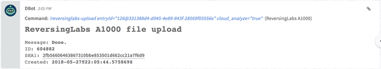
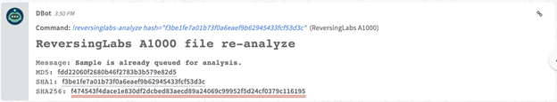
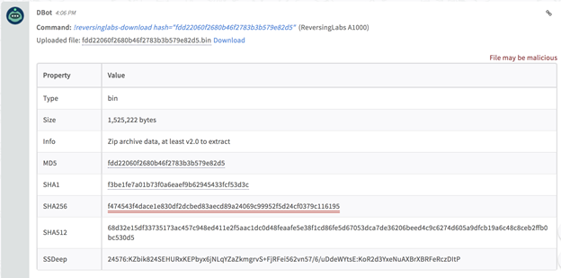
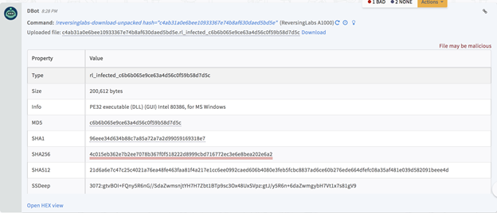
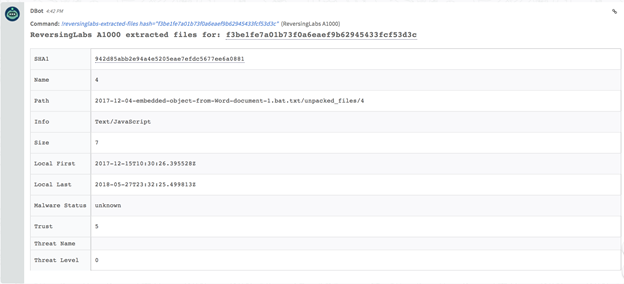
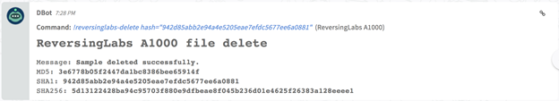
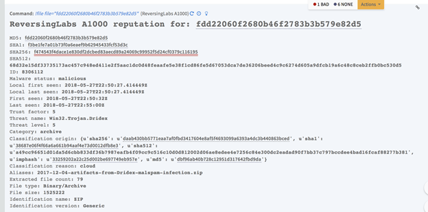

<!-- HTML_DOC -->
<h2>Overview</h2>

Use the A1000 Malware Analysis Platform to support advanced hunting and investigations through high-speed automated static analysis. A1000 Malware Analysis Platform is integrated with file reputation services to provide in-depth rich context and threat classification on over 6B files and across all file types.

This integration was integrated and tested with ReversingLabs A1000 Malware Analysis Platform™, 3.7.1.4.

<h2>Use Cases</h2>
<ul>
<li>Supports automated analysis processes (Static Analysis) that includes unpacking and identifying the families of archives, installers, packers and compressors.</li>
<li>Extracts over 3,000 PTIs from extracted files for PE/Windows, ELF/Linux, Mac OS, iOS, Android, firmware, and documents.</li>
<li>Calculates file threat level using extracted information.</li>
</ul>

Helps in regulating the investigation process by uploading and downloading samples to A1000 cloud platform at any point in time. (File reputation data can also be retrieved from an A1000 appliance.)

<h2>Prerequisites</h2>

You need to obtain the following ReversingLabs A1000 platform information.

<ul>
<li>Base URL of the A1000 box (https://a1000.reversinglabs.com)</li>
<li>Authentication Token</li>
</ul>
<h3><strong>Get Your ReversingLabs A1000 Authentication Token</strong></h3>
<ol>
<li>Log in to the ReversingLabs A1000 platform.</li>
<li>Navigate to <strong>Administration</strong> and click the <strong>Tokens</strong> icon.</li>
<li>On the Authentication Tokens page, click the red plus button to create a new token key.</li>
<li>Select the necessary user, and click the <strong>Save</strong> button.  The new key is listed on the token table.</li>
<li>Copy the key (authentication token), which you will paste when you configure the integration on Cortex XSOAR.</li>
</ol>

<h2>Configure ReversingLabs A1000 Cortex XSOAR</h2>
<ol>
<li>Navigate to <strong>Settings</strong> &gt; <strong>Integrations</strong> &gt; <strong>Servers &amp; Services</strong>.</li>
<li>Search for ReversingLabs A1000.</li>
<li>Click <strong>Add instance</strong> to create and configure a new integration instance.
<ul>
<li>
<strong>Name</strong>: a textual name for the integration instance.</li>
<li>
<strong>Base URL of the A1000 box</strong> : <a href="https://a1000.reversinglabs.com">https://a1000.reversinglabs.com</a>
</li>
<li>
<strong>Authentication Token</strong>: paste the token that you copied.</li>
</ul>
</li>
<li>Click <strong>Test</strong> to validate the URLs and connection.</li>
</ol>

<h2>Commands</h2>

You can execute these commands from the Cortex XSOAR CLI, as part of an automation, or in a playbook. After you successfully execute a command, a DBot message appears in the War Room with the command details.

<ul>
<li><a href="#h_912555453321527505457054">Upload a sample to A1000 for analysis: reversinglabs-upload</a></li>
<li><a href="#h_647371130511527506262720">Re-analyze sample set: reversinglabs-analyze</a></li>
<li><a href="#h_647658906741527506634366">Download a sample to the investigation: reversinglabs-download</a></li>
<li><a href="#h_8906442831021527506843583">Download samples obtained through the unpacking process: reversinglabs-download-unpacked</a></li>
<li><a href="#h_185753201371527507288364">List extracted files from a sample: reversinglabs-extracted-files</a></li>
<li><a href="#h_6346727131761527508201583">Delete an uploaded sample: reversinglabs-delete</a></li>
<li><a href="#h_4283683432211527508631666">Retrieve file reputation data from an A1000 appliance: file</a></li>
</ul>

<h3 id="h_912555453321527505457054">Upload a sample to A1000 for analysis : reversinglabs-upload</h3>

Upload a sample to A1000 for analysis. 

<h4>Command Example</h4>

<code>!reversinglabs-upload entryId="<em>126@331388d4-d045-4e89-843f-28569f05556e</em>" cloud_analyze="<em>true</em>"</code>

<h4>Input</h4>
<table style="width: 622px;" border="2" cellpadding="6">
<tbody>
<tr>
<td style="width: 155px;">

<strong>Parameter</strong>

</td>
<td style="width: 440px;">

<strong>Description</strong>

</td>
</tr>
<tr>
<td style="width: 155px;">

entryId

</td>
<td style="width: 440px;">

Entry ID of the file to be uploaded. (Once you upload a file on Cortex XSOAR’s platform, click on the link(chain) icon to get the entry ID of that file)

</td>
</tr>
<tr>
<td style="width: 155px;">

comment

</td>
<td style="width: 440px;">

A comment for the file to be uploaded.

</td>
</tr>
<tr>
<td style="width: 155px;">

tags

</td>
<td style="width: 440px;">

A comma separated list of tags for the file.

</td>
</tr>
<tr>
<td style="width: 155px;">

cloud_analyze

</td>
<td style="width: 440px;">

Specifies if the sample is sent to TiCloud for scanning. By default the value is <em>true</em>.

<ul>
<li>True = sent to TiCloud</li>
<li>False = not sent to TiCloud</li>
</ul>
</td>
</tr>
</tbody>
</table>
<h4> </h4>
<h4>Human Readable Output</h4>
<h4> 
</h4>
<h4>Raw Output</h4>
<pre>{
"code": 201,
 "message": "Done.",
 "detail": {
     "id": 604883,
     "sha1": "2fb56606463867310bbe853501d662cc21a7f6d9",
     "user": 585,
     "created": "2018-05-27T22:32:06.830474Z",
     "filename": "2018-05-24-Trickbot-malspam-1140-UTC.eml",
     "href": "/?q=2fb56606463867310bbe853501d662cc21a7f6d9"
 }
}</pre>

<h3 id="h_647371130511527506262720">Reanalyze sample set: reversinglabs-analyze</h3>

Schedule a set of samples that were previously updated to the A1000 appliance to be reanalyzed.

<h4>Command Example</h4>

<code>!reversinglabs-analyze hash="<em>2fb56606463867310bbe853501d662cc21a7f6d9</em>"</code>

<h4> Input</h4>
<table style="width: 623px;" border="2" cellpadding="6">
<tbody>
<tr>
<td style="width: 142px;">

<strong>Parameter</strong>

</td>
<td style="width: 475px;">

<strong>Description</strong>

</td>
</tr>
<tr>
<td style="width: 142px;">

hash

</td>
<td style="width: 475px;">

The hash of a previously uploaded sample. Hexadecimal representation of SHA-1, SHA-256, SHA-512, or MD5 digest.

</td>
</tr>
</tbody>
</table>
<h4> </h4>
<h4>Human Readable Output</h4>
<pre> </pre>
<h4>Raw Output</h4>
<pre>{
     "code": 200,
     "message": "Sample is already queued for analysis.",
     "detail": {
     "sha1": "f3be1fe7a01b73f0a6eaef9b62945433fcf53d3c",
     "Sha256": "f474543f4dace1e830df2dcbed83aecd89a24069c99952f5d24cf0379c116195",
     "md5": "fdd22060f2680b46f2783b3b579e82d5"
     }
}</pre>

<h3 id="h_647658906741527506634366">Download a sample to the investigation: reversinglabs-download</h3>

Download a sample that resides on A1000 to the investigation.

<h4>Command Example</h4>

<code>!reversinglabs-download hash="<em>fdd22060f2680b46f2783b3b579e82d5</em>"</code>

<h4>Input</h4>
<table border="2" width="624" cellpadding="6">
<tbody>
<tr>
<td width="182">

<strong>Parameter</strong>

</td>
<td width="442">

<strong>Description</strong>

</td>
</tr>
<tr>
<td width="182">

hash

</td>
<td width="442">

The hash of a sample that resides on A1000. Hexadecimal representation of SHA-1, SHA-256, SHA-512, or MD5 digest.

</td>
</tr>
</tbody>
</table>
<h4>  </h4>
<h4>Human Readable Output</h4>

 

<h4>Raw Output</h4>

There is no raw output for this command.

When the command runs successfully, you get a downloadable file.

When the command fails, you receive a notification with one of the following error codes.

<ul>
<li>
<strong>404</strong> - Sample not found.</li>
<li>
<strong>401</strong> - Unable to retrieve sample content.</li>
</ul>

<h3 id="h_8906442831021527506843583">Download samples obtained through the unpacking process : reversinglabs-download-unpacked</h3>

Download samples obtained through the unpacking process. 

<h4>Command Example</h4>

<code>!reversinglabs-download-unpacked hash="<em>6bb767e20c25e4d37e73fc0733c7ef2fce4ac8c6</em>"</code>

<h4>Input</h4>
<table border="2" width="624" cellpadding="6">
<tbody>
<tr>
<td width="182">

<strong>Parameter</strong>

</td>
<td width="442">

<strong>Description</strong>

</td>
</tr>
<tr>
<td width="182">

hash

</td>
<td width="442">

The hash of a sample that resides on A1000. Hexadecimal representation of SHA-1, SHA-256, SHA-512, or MD5 digest

</td>
</tr>
</tbody>
</table>
<h4> </h4>
<h4>Human Readable Output</h4>
<h4> 
</h4>
<h4>Raw Output</h4>

There is no raw output for this command.

When the command runs successfully, you get a downloadable file.

When the command fails, you are receive a notification with one of the following error codes.

<ul>
<li>
<strong>404</strong> - Sample not found.</li>
<li>
<strong>401</strong> - Unable to retrieve sample content.</li>
</ul>

<h3 id="h_185753201371527507288364">List extracted files from a sample : reversinglabs-extracted-files</h3>

List extracted files from a sample

<h4>Command Example</h4>

<code>!reversinglabs-extracted-files hash="<em>f3be1fe7a01b73f0a6eaef9b62945433fcf53d3c</em>"</code>

<h4>Input</h4>
<table border="2" width="624" cellpadding="6">
<tbody>
<tr>
<td width="182">

<strong>Parameter</strong>

</td>
<td width="442">

<strong>Description</strong>

</td>
</tr>
<tr>
<td width="182">

hash

</td>
<td width="442">

The hash of an already uploaded sample. Hexadecimal representation of SHA-1, SHA-256, SHA-512, or MD5 digest

</td>
</tr>
</tbody>
</table>
<h4> </h4>
<h4>Human Readable Output</h4>

 

<h4>Raw Output</h4>
<pre>{
 "count": 5,
 "next": null,
 "previous": null,
 "results": [
   {
     "id": 197,
     "parent_relationship": null,
     "sample": {
     "id": 192,
     "sha1": "e906fa3d51e86a61741b3499145a114e9bfb7c56",
     "type_display": "PE/Exe",
     "category": "application",
     "file_type": "PE",
     "file_subtype": "Exe",
     "identification_name": "",
     "identification_version": "",
     "file_size": 267278,
     "extracted_file_count": 2,
     "local_first_seen": "2016-05-05T09:57:50.910412Z",
     "local_last_seen": "2016-05-05T13:43:21.282072Z",
     "threat_status": "malicious",
     "trust_factor": 5,
     "threat_level": 5,
     "threat_name": "Win32.Trojan.Bitman"
   },
 "filename": "DeVuongHoi.exe",
 "path": "DeVuongHoi.exe"
},
{
 "id": 198,
 "parent_relationship": null,
 "sample": {
   "id": 198,
   "sha1": "e654d39cd13414b5151e8cf0d8f5b166dddd45cb",
   "type_display": "PE/Exe",
   "category": "application",
   "file_type": "PE",
   "file_subtype": "Exe",
   "identification_name": "",
   "identification_version": "",
   "file_size": 290816,
ReversingLabs
123
   "extracted_file_count": 1,
   "local_first_seen": "2016-05-05T09:58:27.096525Z",
   "local_last_seen": "2016-05-05T09:58:27.096525Z",
   "threat_status": "malicious",
   "trust_factor": 5,
   "threat_level": 5,
   "threat_name": "Win32.Malware.YARA"
 },
 "filename": "DieGroupv8.exe",
 "path": "DieGroupv8.exe"
},
...</pre>

<h3 id="h_6346727131761527508201583">Delete an uploaded sample : reversinglabs-delete</h3>

Delete an uploaded sample for the specified hash value that resides A1000. All related data, including extracted samples and metadata, will be deleted.

<h4>Command Example</h4>

!reversinglabs-delete hash="<em>942d85abb2e94a4e5205eae7efdc5677ee6a0881</em>"<em> </em>

<h4>Input</h4>
<table border="2" width="624" cellpadding="6">
<tbody>
<tr>
<td width="182">

<strong>Parameter</strong>

</td>
<td width="442">

<strong>Description</strong>

</td>
</tr>
<tr>
<td width="182">

hash

</td>
<td width="442">

The hash of a sample that resides on A1000. Hexadecimal representation of SHA-1, SHA-256, SHA-512, or MD5 digest

</td>
</tr>
</tbody>
</table>
<h4>  </h4>
<h4>Human Readable Output</h4>

 

<h4>Raw Output</h4>
<pre>{
     "code": 200,
     "message": "Sample deleted successfully.",
     "detail": {
     "sha1": "f3be1fe7a01b73f0a6eaef9b62945433fcf53d3c",
     "Sha256": "f474543f4dace1e830df2dcbed83aecd89a24069c99952f5d24cf0379c116195",
     "Sha512": "68d32e15df33735173ac457c948ed411e2f5aac1dc0d48feaafe5e38f1cd86fe5d67053dca7de36206beed4c9c6274d605a9dfcb19a6c48c8ceb2ffb0bc530d5"
     "md5": "fdd22060f2680b46f2783b3b579e82d5"
     }
}</pre>

<h3 id="h_4283683432211527508631666">Retrieve file reputation data from an A1000 appliance : file</h3>

Retrieve file reputation data from an A1000 appliance.

<h4>Command Example</h4>

<code>!file file="<em>8437682e44a764d0c0f610f6cb262a98</em>"</code>

<h4> </h4>
<h4>Input</h4>
<table border="2" width="624" cellpadding="6">
<tbody>
<tr>
<td width="182">

<strong>Parameter</strong>

</td>
<td width="442">

<strong>Description</strong>

</td>
</tr>
<tr>
<td width="182">

file

</td>
<td width="442">

The hash that you want to retrieve reputation data for. Hexadecimal representation of SHA-1, SHA-256, SHA-512, or MD5 digest.

</td>
</tr>
</tbody>
</table>
<h4> </h4>
<h4>Human Readable Output</h4>

 

<h4>Context Output</h4>
<table border="2" width="624" cellpadding="6">
<tbody>
<tr>
<td width="247">

<strong>Parameter</strong>

</td>
<td width="377">

<strong>Description</strong>

</td>
</tr>
<tr>
<td width="247">

File.MD5

</td>
<td width="377">

Bad hash detected.

</td>
</tr>
<tr>
<td width="247">

File.SHA1

</td>
<td width="377">

Bad hash SHA-1.

</td>
</tr>
<tr>
<td width="247">

File.Malicious.Vendor

</td>
<td width="377">

For malicious files, the vendor that made the decision.

</td>
</tr>
<tr>
<td width="247">

File.Malicious.Detections

</td>
<td width="377">

For malicious files, the total number of detections.

</td>
</tr>
<tr>
<td width="247">

File.Malicious.TotalEngines

</td>
<td width="377">

For malicious files, the total number of engines.

</td>
</tr>
<tr>
<td width="247">

DBotScore.Indicator

</td>
<td width="377">

The indicator that is being tested.

</td>
</tr>
<tr>
<td width="247">

DBotScore.Type

</td>
<td width="377">

Indicator type.

</td>
</tr>
<tr>
<td width="247">

DBotScore.Vendor

</td>
<td width="377">

Vendor used to calculate the score.

</td>
</tr>
<tr>
<td width="247">

DBotScore.Score

</td>
<td width="377">

The actual score

</td>
</tr>
</tbody>
</table>

 

<h4>Raw Output</h4>
<pre>"results": [
{
          "category": "archive",
          "aliases": {
           "0": "2017-12-04-artifacts-from-Dridex-malspam-infection.zip"
          },
          "classification_origin":{
                    "imphash": "33259202a22c25d002be697749eb957e",
                    "md5": "dbf96ab40b728c12951d317642fbd9da",
                    "sha1": "38687e06f4f66a6a661b94aaf4e73d0012dfb8e3",
                    "sha256": "daab430bb5771eaa7af0fbd3417604e8af5f4693099a6393a4dc3b440863bced",
                    "sha512": "a49cc96651d01da5d6cbb833df36b7987eafb4f09cc9c516c10d0d812002d06ae8edee4e7256c84e300dc2eadad90f7bb37c797bccdee4bad16fcaf88277b381"
          }
          "classification_reason": "cloud",
          "extracted_file_count": 79,
          "file_size": 1525222,
          "file_subtype": "Archive",
          "file_type": "Binary",
          "identification_name": "ZIP",
          "identification_version": "Generic",
          "local_first_seen": "2018-05-27T22:50:27.414449Z",
          "local_last_seen": "2018-05-27T22:50:27.414449Z",
          "md5": "fdd22060f2680b46f2783b3b579e82d5",
          "sha1": "f3be1fe7a01b73f0a6eaef9b62945433fcf53d3c",
          "sha256": "f474543f4dace1e830df2dcbed83aecd89a24069c99952f5d24cf0379c116195",
          "sha512": "68d32e15df33735173ac457c948ed411e2f5aac1dc0d48feaafe5e38f1cd86fe5d67053dca7de36206beed4c9c6274d605a9dcb19a6c48c8ceb2ffb0bc530d5",
          "summary":{
                    "id": 8306112,
                    "indicators": []
          }
          "sha1": "f3be1fe7a01b73f0a6eaef9b62945433fcf53d3c",
          "threat_level": 5,
          "threat_name": Win32.Trojan.Dridex,
          "threat_status": malicious,
          "ticloud": {
                    "first_seen": "2018-05-27T22:50:32Z",
                    "last_seen": "2018-05-27T22:55:00Z",
                    "threat_level": 0,
                    "threat_name": null,
                    "threat_status": "known",
                    "trust_factor": 5,
                    "Trust_factor" 5
          }
} </pre>
