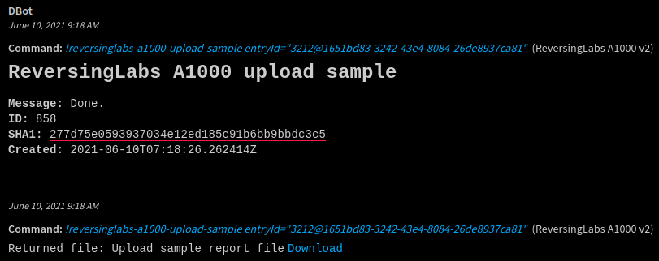
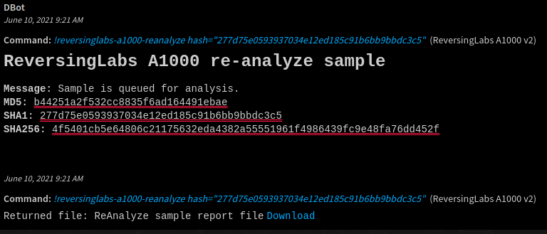
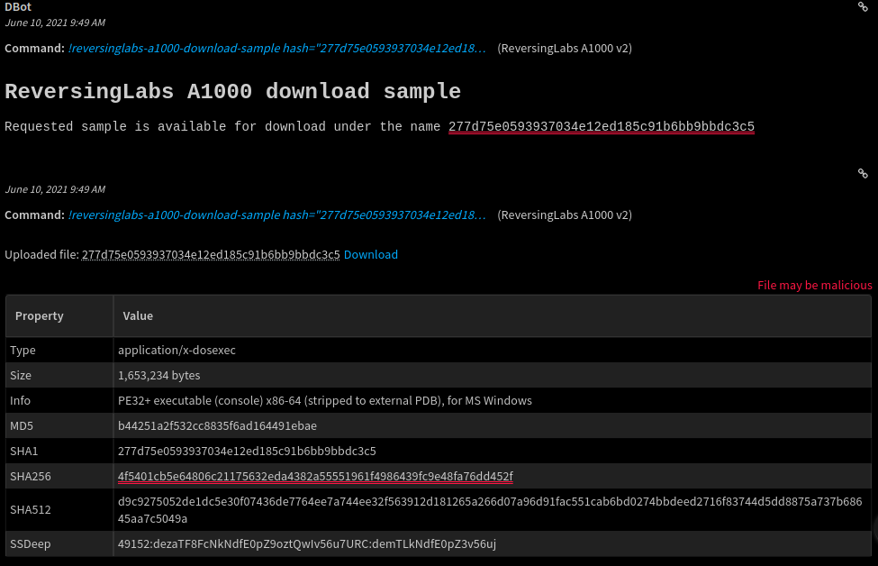
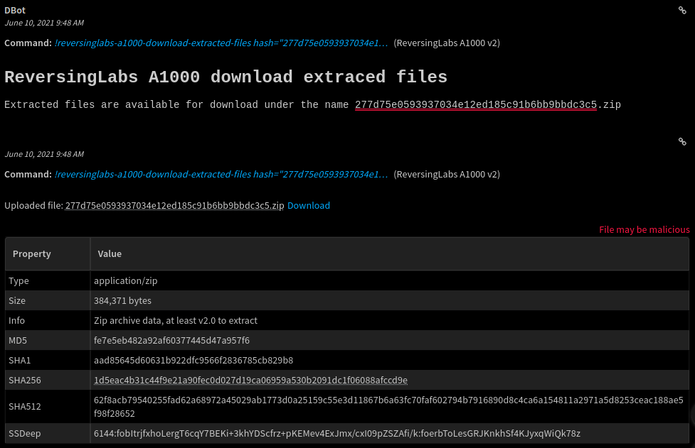
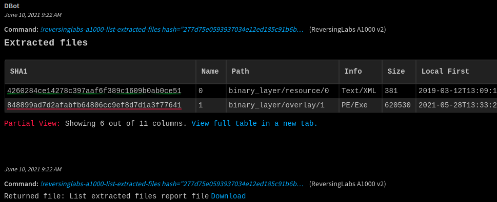
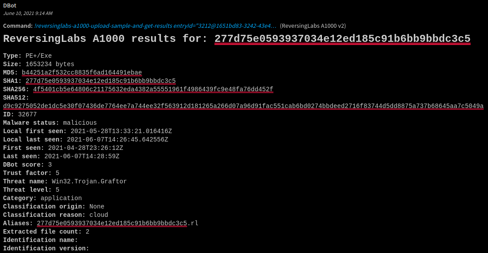
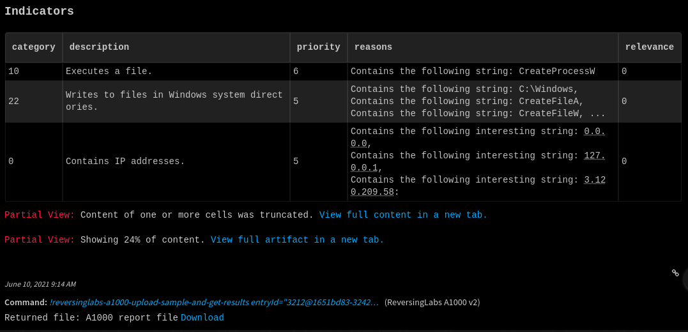
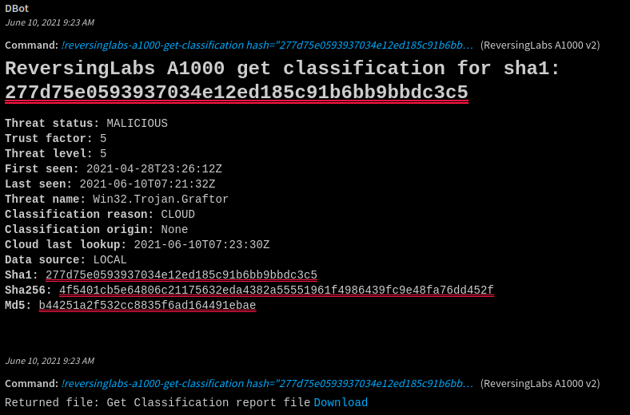

## Overview

This integration supports using ReversingLabs Advanced File Analysis to 'detonate file' on the A1000 Advanced Malware Analysis Appliance.

The A1000 appliance is a powerful threat detection and file analysis platform that integrates other ReversingLabs technologies (TitaniumCore - the automated static analysis solution, and TitaniumCloud File Reputation Service) to provide detailed information on each file's status and threat capabilities.

The A1000 makes it easy to upload multiple samples for analysis. It can process, unpack, and classify them in a matter of milliseconds, and display detailed analysis reports. Historical analysis results are preserved in a database to enable in-depth searching, and malware samples are continually reanalyzed to ensure the most up-to-date file reputation status.

* * *

## Prerequisites

You need to obtain the following ReversingLabs A1000 platform information.

*   A1000 instance
*   A1000 API Token

* * *

## Configure ReversingLabs A1000 on Cortex XSOAR

1.  Navigate to **Settings** > **Integrations** > **Servers & Services**.
2.  Search for ReversingLabs A1000.
3.  Click **Add instance** to create and configure a new integration instance.  

    | **Parameter** | **Required** |
    | --- | --- |
    | ReversingLabs A1000 instance URL | True |
    | API Token | True |  
    | Verify host certificates | True (default: False) |
    | Reliability  |  True (default: C - Fairly reliable)

4.  Click **Test** to validate connection.

* * *

## Commands

You can execute these commands from the XSOAR CLI, as part of an automation, or in a playbook. 
After you successfully execute a command, a DBot message appears in the War Room with the command details.
For all commands, full report is saved as a part of the context and also returned as a downloadable file.

-  [reversinglabs-a1000-upload-sample](#reversinglabs-a1000-upload-sample)
-  [reversinglabs-a1000-reanalyze](#reversinglabs-a1000-reanalyze)
-  [reversinglabs-a1000-download-sample](#reversinglabs-a1000-download-sample)
-  [reversinglabs-a1000-download-extracted-files](#reversinglabs-a1000-download-extracted-files)
-  [reversinglabs-a1000-list-extracted-files](#reversinglabs-a1000-list-extracted-files)
-  [reversinglabs-a1000-delete-sample](#reversinglabs-a1000-delete-sample)
-  [reversinglabs-a1000-get-results](#reversinglabs-a1000-get-results)
-  [reversinglabs-a1000-upload-sample-and-get-results](#reversinglabs-a1000-upload-sample-and-get-results)
-  [reversinglabs-a1000-get-classification](#reversinglabs-a1000-get-classification)
-  [reversinglabs-a1000-advanced-search](#reversinglabs-a1000-advanced-search)


* * *

## reversinglabs-a1000-upload-sample

Upload sample to A1000 appliance for analysis. 

### Command Example

`!reversinglabs-a1000-upload-sample entryId="3212@1651bd83-3242-43e4-8084-26de8937ca81"`

### Input

| **Argument Name** | **Description** | **Required** |
| --- | --- | --- |
| entryId | Entry ID of the sample to be uploaded | True | 
| comment | A comment for the file to be uploaded | True | 
| tags | A comma separated list of tags for the file | True |  

### Human Readable Output


### Context Output
| **Path** | **Description** |
| --- | --- |
| ReversingLabs.a1000_upload_report | Full report in JSON | 

<br>

<details><summary>Context Example:</summary>
<p>

```json
{
    "Type": 1,
    "ContentsFormat": "json",
    "Contents": {
        "a1000_upload_report": {
            "code": 201,
            "message": "Done.",
            "detail": {
                "id": 860,
                "sha1": "277d75e0593937034e12ed185c91b6bb9bbdc3c5",
                "user": 11,
                "created": "2021-06-14T08:37:00.927865Z",
                "filename": "277d75e0593937034e12ed185c91b6bb9bbdc3c5.rl",
                "href": "/?q=277d75e0593937034e12ed185c91b6bb9bbdc3c5"
            }
        }
    },
    "HumanReadable": "## ReversingLabs A1000 upload sample\n **Message:** Done.\n    **ID:** 860\n    **SHA1:** 277d75e0593937034e12ed185c91b6bb9bbdc3c5\n    **Created:** 2021-06-14T08:37:00.927865Z",
    "EntryContext": {
        "ReversingLabs": {
            "a1000_upload_report": {
                "code": 201,
                "message": "Done.",
                "detail": {
                    "id": 860,
                    "sha1": "277d75e0593937034e12ed185c91b6bb9bbdc3c5",
                    "user": 11,
                    "created": "2021-06-14T08:37:00.927865Z",
                    "filename": "277d75e0593937034e12ed185c91b6bb9bbdc3c5.rl",
                    "href": "/?q=277d75e0593937034e12ed185c91b6bb9bbdc3c5"
                }
            }
        }
    },
    "IndicatorTimeline": [],
    "IgnoreAutoExtract": false,
    "Note": false,
    "Relationships": []
}
```
</p>
</details>

* * *

## reversinglabs-a1000-reanalyze

Schedule a sample that were previously uploaded to the A1000 appliance to be reanalyzed.

### Command Example

`!reversinglabs-a1000-reanalyze hash="277d75e0593937034e12ed185c91b6bb9bbdc3c5"
`

###  Input

| **Argument Name** | **Description** | **Required** |
| --- | --- | --- |
| hash | The hash of a previously uploaded sample. Supported hash types: SHA1, SHA256, SHA512, MD5 | True |

### Human Readable Output


### Context Output

| **Path** | **Description** |
| --- | --- |
| ReversingLabs.a1000_reanalyze_report | Full report in JSON | 
 
<br>

<details><summary>Context Example:</summary>
<p>

```json
{
    "Type": 1,
    "ContentsFormat": "json",
    "Contents": {
        "a1000_reanalyze_report": {
            "code": 201,
            "message": "Sample is queued for analysis.",
            "detail": {
                "sha1": "277d75e0593937034e12ed185c91b6bb9bbdc3c5",
                "sha256": "4f5401cb5e64806c21175632eda4382a55551961f4986439fc9e48fa76dd452f",
                "sha512": "d9c9275052de1dc5e30f07436de7764ee7a744ee32f563912d181265a266d07a96d91fac551cab6bd0274bbdeed2716f83744d5dd8875a737b68645aa7c5049a",
                "md5": "b44251a2f532cc8835f6ad164491ebae",
                "imphash": "71f37f91c14c4729e462a32b6b2ae9d4"
            },
            "analysis": [
                {
                    "name": "cloud",
                    "code": 201,
                    "message": "Sample is queued for analysis."
                },
                {
                    "name": "core",
                    "code": 201,
                    "message": "Sample is queued for core analysis."
                }
            ]
        }
    },
    "HumanReadable": "## ReversingLabs A1000 re-analyze sample\n**Message:** Sample is queued for analysis.\n    **MD5:** b44251a2f532cc8835f6ad164491ebae\n    **SHA1:** 277d75e0593937034e12ed185c91b6bb9bbdc3c5\n    **SHA256:** 4f5401cb5e64806c21175632eda4382a55551961f4986439fc9e48fa76dd452f",
    "EntryContext": {
        "ReversingLabs": {
            "a1000_reanalyze_report": {
                "code": 201,
                "message": "Sample is queued for analysis.",
                "detail": {
                    "sha1": "277d75e0593937034e12ed185c91b6bb9bbdc3c5",
                    "sha256": "4f5401cb5e64806c21175632eda4382a55551961f4986439fc9e48fa76dd452f",
                    "sha512": "d9c9275052de1dc5e30f07436de7764ee7a744ee32f563912d181265a266d07a96d91fac551cab6bd0274bbdeed2716f83744d5dd8875a737b68645aa7c5049a",
                    "md5": "b44251a2f532cc8835f6ad164491ebae",
                    "imphash": "71f37f91c14c4729e462a32b6b2ae9d4"
                },
                "analysis": [
                    {
                        "name": "cloud",
                        "code": 201,
                        "message": "Sample is queued for analysis."
                    },
                    {
                        "name": "core",
                        "code": 201,
                        "message": "Sample is queued for core analysis."
                    }
                ]
            }
        }
    },
    "IndicatorTimeline": [],
    "IgnoreAutoExtract": false,
    "Note": false,
    "Relationships": []
}
```
</p>
</details>

* * *

## reversinglabs-a1000-download-sample
Download sample from A1000 appliance. Returns file binary.

### Command Example

`!reversinglabs-a1000-download-sample hash="277d75e0593937034e12ed185c91b6bb9bbdc3c5"
`

###  Input

| **Argument Name** | **Description** | **Required** |
| --- | --- | --- |
| hash | The hash of a previously uploaded sample. Supported hash types: SHA1, SHA256, SHA512, MD5 | True |

### Human Readable Output



* * *

## reversinglabs-a1000-download-extracted

Download files extracted from the requested sample. The files are obtained through the unpacking process during sample analysis with the TitaniumCore static analysis engine.
Extracted files are downloaded in a single compressed archive file.

### Command Example
 
`!reversinglabs-a1000-download-extracted hash="277d75e0593937034e12ed185c91b6bb9bbdc3c5"`

### Input

| **Argument Name** | **Description** | **Required** |
| --- | --- | --- |
| hash | The hash of a previously uploaded sample. Supported hash types: SHA1, SHA256, SHA512, MD5 | True |

### Human Readable Output


* * *

## reversinglabs-a1000-list-extracted-files

Get a list of all files the TitaniumCore engine extracted from the requested sample during static analysis.

### Command Example

`!reversinglabs-a1000-download-extracted-files hash="277d75e0593937034e12ed185c91b6bb9bbdc3c5"`

### Input

| **Argument Name** | **Description** | **Required** |
| --- | --- | --- |
| hash | The hash of a previously uploaded sample. Supported hash types: SHA1, SHA256, SHA512, MD5 | True | 

### Human Readable Output


### Context Output

| **Path** | **Description** |
| --- | --- |
| ReversingLabs.a1000_list_extracted_report | Full report in JSON | 
 
<br>

<details><summary>Context Example:</summary>
<p>

```json
{
    "Type": 1,
    "ContentsFormat": "json",
    "Contents": {
        "a1000_list_extracted_report": {
            "count": 2,
            "next": null,
            "previous": null,
            "results": [
                {
                    "id": 63182,
                    "parent_relationship": null,
                    "sample": {
                        "id": 1316,
                        "sha1": "4260284ce14278c397aaf6f389c1609b0ab0ce51",
                        "type_display": "Text/XML",
                        "category": "other",
                        "file_type": "Text",
                        "file_subtype": "XML",
                        "identification_name": "",
                        "identification_version": "",
                        "file_size": 381,
                        "extracted_file_count": 0,
                        "local_first_seen": "2019-03-12T13:09:12.890450Z",
                        "local_last_seen": "2021-05-28T13:33:45.989623Z",
                        "threat_status": "known",
                        "trust_factor": 0,
                        "threat_level": 0,
                        "threat_name": null
                    },
                    "filename": "0",
                    "path": "binary_layer/resource/0",
                    "container_sha1": null
                },
                {
                    "id": 63183,
                    "parent_relationship": null,
                    "sample": {
                        "id": 32680,
                        "sha1": "848899ad7d2afabfb64806cc9ef8d7d1a3f77641",
                        "type_display": "PE/Exe",
                        "category": "application",
                        "file_type": "PE",
                        "file_subtype": "Exe",
                        "identification_name": "",
                        "identification_version": "",
                        "file_size": 620530,
                        "extracted_file_count": 0,
                        "local_first_seen": "2021-05-28T13:33:21.016416Z",
                        "local_last_seen": "2021-05-28T13:33:45.989623Z",
                        "threat_status": "malicious",
                        "trust_factor": 5,
                        "threat_level": 5,
                        "threat_name": "Win32.Trojan.Graftor"
                    },
                    "filename": "1",
                    "path": "binary_layer/overlay/1",
                    "container_sha1": null
                }
            ]
        }
    },
    "HumanReadable": "### Extracted files\n|SHA1|Name|Path|Info|Size|Local First|Local Last|Malware Status|Trust|Threat Name|Threat Level|\n|---|---|---|---|---|---|---|---|---|---|---|\n| 4260284ce14278c397aaf6f389c1609b0ab0ce51 | 0 | binary_layer/resource/0 | Text/XML | 381 | 2019-03-12T13:09:12.890450Z | 2021-05-28T13:33:45.989623Z | known | 0 |  | 0 |\n| 848899ad7d2afabfb64806cc9ef8d7d1a3f77641 | 1 | binary_layer/overlay/1 | PE/Exe | 620530 | 2021-05-28T13:33:21.016416Z | 2021-05-28T13:33:45.989623Z | malicious | 5 | Win32.Trojan.Graftor | 5 |\n",
    "EntryContext": {
        "ReversingLabs": {
            "a1000_list_extracted_report": {
                "count": 2,
                "next": null,
                "previous": null,
                "results": [
                    {
                        "id": 63182,
                        "parent_relationship": null,
                        "sample": {
                            "id": 1316,
                            "sha1": "4260284ce14278c397aaf6f389c1609b0ab0ce51",
                            "type_display": "Text/XML",
                            "category": "other",
                            "file_type": "Text",
                            "file_subtype": "XML",
                            "identification_name": "",
                            "identification_version": "",
                            "file_size": 381,
                            "extracted_file_count": 0,
                            "local_first_seen": "2019-03-12T13:09:12.890450Z",
                            "local_last_seen": "2021-05-28T13:33:45.989623Z",
                            "threat_status": "known",
                            "trust_factor": 0,
                            "threat_level": 0,
                            "threat_name": null
                        },
                        "filename": "0",
                        "path": "binary_layer/resource/0",
                        "container_sha1": null
                    },
                    {
                        "id": 63183,
                        "parent_relationship": null,
                        "sample": {
                            "id": 32680,
                            "sha1": "848899ad7d2afabfb64806cc9ef8d7d1a3f77641",
                            "type_display": "PE/Exe",
                            "category": "application",
                            "file_type": "PE",
                            "file_subtype": "Exe",
                            "identification_name": "",
                            "identification_version": "",
                            "file_size": 620530,
                            "extracted_file_count": 0,
                            "local_first_seen": "2021-05-28T13:33:21.016416Z",
                            "local_last_seen": "2021-05-28T13:33:45.989623Z",
                            "threat_status": "malicious",
                            "trust_factor": 5,
                            "threat_level": 5,
                            "threat_name": "Win32.Trojan.Graftor"
                        },
                        "filename": "1",
                        "path": "binary_layer/overlay/1",
                        "container_sha1": null
                    }
                ]
            }
        }
    },
    "IndicatorTimeline": [],
    "IgnoreAutoExtract": false,
    "Note": false,
    "Relationships": []
}
```
</p>
</details>

* * *

## reversinglabs-a1000-delete-sample

Delete the sample with the requested hash value. All related data, including extracted samples and metadata, will be deleted from the current A1000 instance.

### Command Example

!reversinglabs-delete hash="_942d85abb2e94a4e5205eae7efdc5677ee6a0881_"

### Input

| **Argument Name** | **Description** | **Required** |
| --- | --- | --- |
| hash | The hash of a previously uploaded sample. Supported hash types: SHA1, SHA256, SHA512, MD5 | True | 

### Human Readable Output


### Context Output

| **Path** | **Description** |
| --- | --- |
| ReversingLabs.a1000_delete_report | Full report in JSON | 

<br>

<details><summary>Context Example:</summary>
<p>

```json
{
    "Type": 1,
    "ContentsFormat": "json",
    "Contents": {
        "a1000_delete_report": {
            "results": {
                "code": 200,
                "detail": {
                    "sha1": "277d75e0593937034e12ed185c91b6bb9bbdc3c5",
                    "sha256": "4f5401cb5e64806c21175632eda4382a55551961f4986439fc9e48fa76dd452f",
                    "sha512": "d9c9275052de1dc5e30f07436de7764ee7a744ee32f563912d181265a266d07a96d91fac551cab6bd0274bbdeed2716f83744d5dd8875a737b68645aa7c5049a",
                    "md5": "b44251a2f532cc8835f6ad164491ebae"
                },
                "message": "Sample deleted successfully."
            }
        }
    },
    "HumanReadable": "## ReversingLabs A1000 delete sample\n **Message:** Sample deleted successfully.\n    **MD5:** b44251a2f532cc8835f6ad164491ebae\n    **SHA1:** 277d75e0593937034e12ed185c91b6bb9bbdc3c5\n    **SHA256:** 4f5401cb5e64806c21175632eda4382a55551961f4986439fc9e48fa76dd452f",
    "EntryContext": {
        "ReversingLabs": {
            "a1000_delete_report": {
                "results": {
                    "code": 200,
                    "detail": {
                        "sha1": "277d75e0593937034e12ed185c91b6bb9bbdc3c5",
                        "sha256": "4f5401cb5e64806c21175632eda4382a55551961f4986439fc9e48fa76dd452f",
                        "sha512": "d9c9275052de1dc5e30f07436de7764ee7a744ee32f563912d181265a266d07a96d91fac551cab6bd0274bbdeed2716f83744d5dd8875a737b68645aa7c5049a",
                        "md5": "b44251a2f532cc8835f6ad164491ebae"
                    },
                    "message": "Sample deleted successfully."
                }
            }
        }
    },
    "IndicatorTimeline": [],
    "IgnoreAutoExtract": false,
    "Note": false,
    "Relationships": []
}
```
</p>
</details>

* * *

### reversinglabs-a1000-get-results

Retrieve analysis report from A1000 appliance.

### Command Example

`!reversinglabs-a1000-get-results hash="277d75e0593937034e12ed185c91b6bb9bbdc3c5"`

### Input

| **Argument Name** | **Description** | **Required** |
| --- | --- | --- |
| hash | The hash of a previously uploaded sample. Supported hash types: SHA1, SHA256, SHA512, MD5 | True | 

### Human Readable Output:



### Context Output

| **Path** | **Description** |
| --- | --- |
|File | File indicator |
| DBotScore | Score | 
| ReversingLabs.a1000_report | Full report in JSON | 
 
<br>

<details><summary>Context Example:</summary>
<p>

```json
{
    "Type": 1,
    "ContentsFormat": "json",
    "Contents": {
        "a1000_report": {
            "count": 1,
            "next": null,
            "previous": null,
            "results": [
                {
                    "aliases": [
                        "277d75e0593937034e12ed185c91b6bb9bbdc3c5.rl"
                    ],
                    "category": "application",
                    "classification_origin": null,
                    "classification_reason": "cloud",
                    "extracted_file_count": 2,
                    "file_size": 1653234,
                    "file_subtype": "Exe",
                    "file_type": "PE+",
                    "id": 32677,
                    "identification_name": "",
                    "identification_version": "",
                    "local_first_seen": "2021-05-28T13:33:21.016416Z",
                    "local_last_seen": "2021-05-28T13:33:45.989623Z",
                    "md5": "b44251a2f532cc8835f6ad164491ebae",
                    "sha1": "277d75e0593937034e12ed185c91b6bb9bbdc3c5",
                    "sha256": "4f5401cb5e64806c21175632eda4382a55551961f4986439fc9e48fa76dd452f",
                    "sha512": "d9c9275052de1dc5e30f07436de7764ee7a744ee32f563912d181265a266d07a96d91fac551cab6bd0274bbdeed2716f83744d5dd8875a737b68645aa7c5049a",
                    "summary": {
                        "id": 32677,
                        "sha1": "277d75e0593937034e12ed185c91b6bb9bbdc3c5",
                        "indicators": [
                            {
                                "priority": 6,
                                "category": 10,
                                "description": "Executes a file.",
                                "relevance": 0,
                                "reasons": [
                                    "Contains the following string: CreateProcessW"
                                ]
                            },
                            {
                                "priority": 5,
                                "category": 22,
                                "description": "Writes to files in Windows system directories.",
                                "relevance": 0,
                                "reasons": [
                                    "Contains the following string: C:\\Windows\\",
                                    "Contains the following string: CreateFileA",
                                    "Contains the following string: CreateFileW",
                                    "Contains the following string: WriteFile"
                                ]
                            },
                            {
                                "priority": 5,
                                "category": 0,
                                "description": "Contains IP addresses.",
                                "relevance": 0,
                                "reasons": [
                                    "Contains the following interesting string: 0.0.0.0",
                                    "Contains the following interesting string: 127.0.0.1",
                                    "Contains the following interesting string: 3.120.209.58:"
                                ]
                            },
                            {
                                "priority": 5,
                                "category": 11,
                                "description": "Tampers with user/account privileges.",
                                "relevance": 0,
                                "reasons": [
                                    "Contains the following string: AdjustTokenPrivileges"
                                ]
                            },
                            {
                                "priority": 5,
                                "category": 0,
                                "description": "Contains URLs that use non-standard ports.",
                                "relevance": 0,
                                "reasons": [
                                    "3.120.209.58:8080 contains a suspicious port number."
                                ]
                            },
                            {
                                "priority": 4,
                                "category": 22,
                                "description": "Creates/opens files in Windows system directories.",
                                "relevance": 0,
                                "reasons": [
                                    "Contains the following string: C:\\Windows\\",
                                    "Contains the following string: CreateFileA",
                                    "Contains the following string: CreateFileW"
                                ]
                            },
                            {
                                "priority": 4,
                                "category": 22,
                                "description": "Reads from files in Windows system directories.",
                                "relevance": 0,
                                "reasons": [
                                    "Contains the following string: C:\\Windows\\",
                                    "Contains the following string: CreateFileA",
                                    "Contains the following string: CreateFileW",
                                    "Contains the following string: ReadFile"
                                ]
                            },
                            {
                                "priority": 4,
                                "category": 13,
                                "description": "Enumerates system information.",
                                "relevance": 0,
                                "reasons": [
                                    "Contains the following string: GetSystemInfo"
                                ]
                            },
                            {
                                "priority": 4,
                                "category": 4,
                                "description": "Possibly does process injection.",
                                "relevance": 0,
                                "reasons": [
                                    "Imports the following function: LoadLibraryA",
                                    "Imports the following function: ResumeThread",
                                    "Contains the following string: CreateProcessW"
                                ]
                            },
                            {
                                "priority": 4,
                                "category": 11,
                                "description": "Requests permission required to lock physical pages in memory.",
                                "relevance": 0,
                                "reasons": [
                                    "Contains the following string: AdjustTokenPrivileges",
                                    "Contains the following string: SeLockMemoryPrivilege"
                                ]
                            },
                            {
                                "priority": 4,
                                "category": 11,
                                "description": "Enumerates user/account privilege information.",
                                "relevance": 0,
                                "reasons": [
                                    "Contains the following string: GetTokenInformation"
                                ]
                            },
                            {
                                "priority": 3,
                                "category": 22,
                                "description": "Writes to files.",
                                "relevance": 0,
                                "reasons": [
                                    "Contains the following string: CreateFileA",
                                    "Contains the following string: CreateFileW",
                                    "Contains the following string: WriteFile"
                                ]
                            },
                            {
                                "priority": 3,
                                "category": 1,
                                "description": "Uses anti-debugging methods.",
                                "relevance": 0,
                                "reasons": [
                                    "Contains the following string: IsDebuggerPresent"
                                ]
                            },
                            {
                                "priority": 3,
                                "category": 7,
                                "description": "Detects/enumerates process modules.",
                                "relevance": 0,
                                "reasons": [
                                    "Contains the following string: GetModuleFileNameW"
                                ]
                            },
                            {
                                "priority": 3,
                                "category": 10,
                                "description": "Terminates a process/thread.",
                                "relevance": 0,
                                "reasons": [
                                    "Contains the following string: TerminateProcess"
                                ]
                            },
                            {
                                "priority": 3,
                                "category": 0,
                                "description": "Issues DNS queries.",
                                "relevance": 0,
                                "reasons": [
                                    "Imports the following function: GetAddrInfoW"
                                ]
                            },
                            {
                                "priority": 2,
                                "category": 22,
                                "description": "Reads from files.",
                                "relevance": 0,
                                "reasons": [
                                    "Contains the following string: CreateFileA",
                                    "Contains the following string: CreateFileW",
                                    "Contains the following string: ReadFile"
                                ]
                            },
                            {
                                "priority": 2,
                                "category": 10,
                                "description": "Might load additional DLLs and APIs.",
                                "relevance": 0,
                                "reasons": [
                                    "Imports the following function: GetProcAddress",
                                    "Imports the following function: LoadLibraryA"
                                ]
                            },
                            {
                                "priority": 2,
                                "category": 13,
                                "description": "Enumerates system variables.",
                                "relevance": 0,
                                "reasons": [
                                    "Imports the following function: getenv"
                                ]
                            },
                            {
                                "priority": 2,
                                "category": 12,
                                "description": "Monitors directory changes.",
                                "relevance": 0,
                                "reasons": [
                                    "Contains the following string: ReadDirectoryChangesW"
                                ]
                            },
                            {
                                "priority": 2,
                                "category": 10,
                                "description": "Uses pipes for interprocess communication.",
                                "relevance": 0,
                                "reasons": [
                                    "Imports the following function: ConnectNamedPipe",
                                    "Imports the following function: CreateNamedPipeW"
                                ]
                            },
                            {
                                "priority": 1,
                                "category": 22,
                                "description": "Creates/Opens a file.",
                                "relevance": 0,
                                "reasons": [
                                    "Contains the following string: CreateFileA",
                                    "Contains the following string: CreateFileW"
                                ]
                            },
                            {
                                "priority": 1,
                                "category": 12,
                                "description": "Contains references to document file extensions.",
                                "relevance": 0,
                                "reasons": [
                                    "Contains the following string: topology.xml"
                                ]
                            },
                            {
                                "priority": 1,
                                "category": 12,
                                "description": "Contains references to executable file extensions.",
                                "relevance": 0,
                                "reasons": [
                                    "Contains the following string: ADVAPI32.dll",
                                    "Contains the following string: KERNEL32.DLL",
                                    "Contains the following string: MSVCP140.dll",
                                    "Contains the following string: USER32.dll",
                                    "Contains the following string: VCRUNTIME140.dll",
                                    "Contains the following string: api-ms-win-core-synch-l1-2-0.dll",
                                    "Contains the following string: api-ms-win-crt-convert-l1-1-0.dll",
                                    "Contains the following string: api-ms-win-crt-heap-l1-1-0.dll",
                                    "Contains the following string: api-ms-win-crt-locale-l1-1-0.dll",
                                    "Contains the following string: api-ms-win-crt-math-l1-1-0.dll",
                                    "Contains the following string: api-ms-win-crt-runtime-l1-1-0.dll",
                                    "Contains the following string: api-ms-win-crt-stdio-l1-1-0.dll",
                                    "Contains the following string: api-ms-win-crt-string-l1-1-0.dll",
                                    "Contains the following string: api-ms-win-crt-time-l1-1-0.dll",
                                    "Contains the following string: api-ms-win-crt-utility-l1-1-0.dll",
                                    "Contains the following string: kernel32.dll",
                                    "Contains the following string: ntdll.dll",
                                    "Contains the following string: powrprof.dll",
                                    "Contains the following string: psapi.dll",
                                    "Contains the following string: user32.dll"
                                ]
                            },
                            {
                                "priority": 1,
                                "category": 12,
                                "description": "Contains references to source code file extensions.",
                                "relevance": 0,
                                "reasons": [
                                    "Contains the following string: * Error occurred in topology.c "
                                ]
                            },
                            {
                                "priority": 1,
                                "category": 10,
                                "description": "Contains reference to advapi32.dll which is Advanced Windows 32 Base API.",
                                "relevance": 0,
                                "reasons": [
                                    "Contains the following string: ADVAPI32.dll"
                                ]
                            },
                            {
                                "priority": 1,
                                "category": 10,
                                "description": "Contains reference to api-ms-win-core-synch-l1-2-0.dll which is ApiSet Stub DLL.",
                                "relevance": 0,
                                "reasons": [
                                    "Contains the following string: api-ms-win-core-synch-l1-2-0.dll"
                                ]
                            },
                            {
                                "priority": 1,
                                "category": 10,
                                "description": "Contains reference to kernel32.dll which is Windows NT BASE API Client DLL.",
                                "relevance": 0,
                                "reasons": [
                                    "Contains the following string: KERNEL32.DLL",
                                    "Contains the following string: kernel32.dll"
                                ]
                            },
                            {
                                "priority": 1,
                                "category": 10,
                                "description": "Contains reference to ntdll.dll which is NT Layer DLL.",
                                "relevance": 0,
                                "reasons": [
                                    "Contains the following string: ntdll.dll"
                                ]
                            },
                            {
                                "priority": 1,
                                "category": 10,
                                "description": "Contains reference to powrprof.dll which is Power Profile Helper DLL.",
                                "relevance": 0,
                                "reasons": [
                                    "Contains the following string: powrprof.dll"
                                ]
                            },
                            {
                                "priority": 1,
                                "category": 10,
                                "description": "Contains reference to psapi.dll which is Process Status Helper.",
                                "relevance": 0,
                                "reasons": [
                                    "Contains the following string: psapi.dll"
                                ]
                            },
                            {
                                "priority": 1,
                                "category": 10,
                                "description": "Contains reference to user32.dll which is Multi-User Windows USER API Client DLL.",
                                "relevance": 0,
                                "reasons": [
                                    "Contains the following string: USER32.dll",
                                    "Contains the following string: user32.dll"
                                ]
                            },
                            {
                                "priority": 1,
                                "category": 10,
                                "description": "Contains reference to ws2_32.dll which is Windows Socket 2.0 32-Bit DLL.",
                                "relevance": 0,
                                "reasons": [
                                    "Contains the following string: WS2_32.dll"
                                ]
                            }
                        ],
                        "unpacking_status": {
                            "failed": 0,
                            "success": 1,
                            "partial": 0
                        }
                    },
                    "threat_level": 5,
                    "threat_name": "Win32.Trojan.Graftor",
                    "threat_status": "malicious",
                    "ticloud": {
                        "threat_status": "malicious",
                        "trust_factor": 5,
                        "threat_level": 4,
                        "first_seen": "2021-04-28T23:26:12Z",
                        "last_seen": "2021-05-28T13:34:49Z",
                        "threat_name": "Win64.Coinminer.Malxmr"
                    },
                    "ticore": {
                        "info": {
                            "statistics": {
                                "file_stats": [
                                    {
                                        "type": "PE+",
                                        "subtype": "Exe",
                                        "count": 1,
                                        "identifications": [
                                            {
                                                "count": 1,
                                                "name": "Unknown"
                                            }
                                        ]
                                    },
                                    {
                                        "type": "PE",
                                        "subtype": "Exe",
                                        "count": 1,
                                        "identifications": [
                                            {
                                                "count": 1,
                                                "name": "Unknown"
                                            }
                                        ]
                                    },
                                    {
                                        "type": "Text",
                                        "subtype": "XML",
                                        "count": 1,
                                        "identifications": [
                                            {
                                                "count": 1,
                                                "name": "Unknown"
                                            }
                                        ]
                                    }
                                ]
                            },
                            "file": {
                                "file_type": "PE+",
                                "file_subtype": "Exe",
                                "size": 1653234,
                                "entropy": 6.18799192412328,
                                "hashes": [
                                    {
                                        "name": "imphash",
                                        "value": "71f37f91c14c4729e462a32b6b2ae9d4"
                                    },
                                    {
                                        "name": "md5",
                                        "value": "b44251a2f532cc8835f6ad164491ebae"
                                    },
                                    {
                                        "name": "rha0",
                                        "value": "e268f6a56d568c8b466dbb1f5671401a6898135e"
                                    },
                                    {
                                        "name": "sha1",
                                        "value": "277d75e0593937034e12ed185c91b6bb9bbdc3c5"
                                    },
                                    {
                                        "name": "sha256",
                                        "value": "4f5401cb5e64806c21175632eda4382a55551961f4986439fc9e48fa76dd452f"
                                    },
                                    {
                                        "name": "sha512",
                                        "value": "d9c9275052de1dc5e30f07436de7764ee7a744ee32f563912d181265a266d07a96d91fac551cab6bd0274bbdeed2716f83744d5dd8875a737b68645aa7c5049a"
                                    },
                                    {
                                        "name": "ssdeep",
                                        "value": "49152:dezaTF8FcNkNdfE0pZ9oztQwIv56u7URC:demTLkNdfE0pZ3v56uj"
                                    }
                                ]
                            },
                            "validation": {
                                "valid": false,
                                "scan_results": [
                                    {
                                        "valid": true,
                                        "type": 5,
                                        "name": "TitaniumCore PE Rich Header Validator",
                                        "version": "4.0.4.0"
                                    },
                                    {
                                        "valid": true,
                                        "type": 5,
                                        "name": "TitaniumCore PE Checksum Validator",
                                        "version": "4.0.4.0"
                                    },
                                    {
                                        "valid": false,
                                        "type": 3,
                                        "name": "TitaniumCore PECOFF Validator",
                                        "version": "5.0.4",
                                        "warnings": [
                                            "OptionalHeader.AddressOfEntryPoint is fixable",
                                            "OptionalHeader.BaseOfCode is fixable",
                                            "OptionalHeader.SizeOfCode is fixable",
                                            "OptionalHeader.SizeOfInitializedData is fixable",
                                            "PE.ImportTable is fixable",
                                            "PE.RelocationTable is invalid",
                                            "PE.SectionTable is fixable",
                                            "PE.TLSTable is fixable"
                                        ]
                                    }
                                ]
                            },
                            "overlays": [
                                {
                                    "from": 0,
                                    "offset": 1032704,
                                    "size": 620530,
                                    "entropy": 0,
                                    "hashes": [
                                        {
                                            "name": "md5",
                                            "value": "8b84009488f7254a2be3c4409bcf286a"
                                        },
                                        {
                                            "name": "sha1",
                                            "value": "848899ad7d2afabfb64806cc9ef8d7d1a3f77641"
                                        },
                                        {
                                            "name": "sha256",
                                            "value": "91ad1155d57e91caa994da40fff6048eb8c10fcf9a6c1b7d5a393f605d718acc"
                                        }
                                    ]
                                }
                            ]
                        },
                        "application": {
                            "capabilities": [
                                [
                                    "clipboard",
                                    false
                                ],
                                [
                                    "ipc",
                                    true
                                ],
                                [
                                    "threads",
                                    true
                                ],
                                [
                                    "processes",
                                    true
                                ],
                                [
                                    "storage",
                                    true
                                ],
                                [
                                    "filesystem",
                                    true
                                ],
                                [
                                    "peripherals",
                                    true
                                ],
                                [
                                    "user_input",
                                    true
                                ],
                                [
                                    "hardware_interfaces",
                                    true
                                ],
                                [
                                    "networking",
                                    true
                                ],
                                [
                                    "cryptography",
                                    false
                                ],
                                [
                                    "security",
                                    true
                                ],
                                [
                                    "system",
                                    true
                                ],
                                [
                                    "modules",
                                    true
                                ],
                                [
                                    "memory_management",
                                    true
                                ],
                                [
                                    "user_interface",
                                    true
                                ],
                                [
                                    "command_line",
                                    true
                                ],
                                [
                                    "time_and_date",
                                    true
                                ],
                                [
                                    "identity",
                                    false
                                ],
                                [
                                    "monitoring",
                                    true
                                ],
                                [
                                    "configuration",
                                    false
                                ],
                                [
                                    "compression",
                                    false
                                ],
                                [
                                    "multimedia",
                                    true
                                ],
                                [
                                    "deprecated",
                                    true
                                ],
                                [
                                    "undocumented",
                                    true
                                ],
                                [
                                    "application_management",
                                    false
                                ],
                                [
                                    "service_management",
                                    false
                                ],
                                [
                                    "messaging",
                                    false
                                ],
                                [
                                    "protection",
                                    true
                                ],
                                [
                                    "drivers",
                                    true
                                ]
                            ],
                            "pe": {
                                "analysis": {
                                    "analysis_state": 3,
                                    "security_grade": 5,
                                    "issues": [
                                        {
                                            "code": 13005,
                                            "name": "RC13005",
                                            "description": "Unexpected optional_header_t::address_of_entry_point location. It is expected that executable code is not in a writable section.",
                                            "relevance": 0,
                                            "count": 1
                                        },
                                        {
                                            "code": 18357,
                                            "name": "RC18357",
                                            "description": "One or more target addresses required to be relocated are not covered by the relocation table. Such addresses include load config, TLS, exception and delay import table elements. This will cause the file to be loaded in invalid state.",
                                            "relevance": 0,
                                            "count": 1
                                        },
                                        {
                                            "code": 23003,
                                            "name": "WC23003",
                                            "description": "Unexpected optional_header_t::base_of_code value. It is expected that this value is set to the first code section start.",
                                            "relevance": 0,
                                            "count": 1
                                        },
                                        {
                                            "code": 23004,
                                            "name": "WC23004",
                                            "description": "Unexpected optional_header_t::size_of_code value. It is expected that this value is set to the sum of all sections that contain code.",
                                            "relevance": 0,
                                            "count": 1
                                        },
                                        {
                                            "code": 23005,
                                            "name": "WC23005",
                                            "description": "Unexpected optional_header_t::size_of_initialized_data value. It is expected that this value is set to the sum of all sections that contain initialized data.",
                                            "relevance": 0,
                                            "count": 1
                                        },
                                        {
                                            "code": 23007,
                                            "name": "WC23007",
                                            "description": "Unexpected optional_header_t::address_of_entry_point value. It is expected that this value is greater than optional_header_t::base_of_code.",
                                            "relevance": 0,
                                            "count": 1
                                        },
                                        {
                                            "code": 23008,
                                            "name": "WC23008",
                                            "description": "Unexpected optional_header_t::address_of_entry_point value. It is expected that this value is within the bounds defined by optional_header_t::base_of_code and optional_header_t::size_of_code.",
                                            "relevance": 0,
                                            "count": 1
                                        },
                                        {
                                            "code": 24007,
                                            "name": "WC24007",
                                            "description": "Detected unnecessary alignment padding at the end of a section with executable attributes.",
                                            "relevance": 0,
                                            "count": 1
                                        },
                                        {
                                            "code": 24033,
                                            "name": "WC24033",
                                            "description": "Detected that image_section_header_t::characteristics is missing common attributes. One or more sections found to be missing image_scn_cnt_code_k for sections marked with image_scn_mem_execute_k.",
                                            "relevance": 0,
                                            "count": 1
                                        },
                                        {
                                            "code": 24034,
                                            "name": "WC24034",
                                            "description": "Detected that image_section_header_t::characteristics combines unlikely attributes. One or more sections found to combine image_scn_mem_write_k and image_scn_mem_execute_k.",
                                            "relevance": 0,
                                            "count": 2
                                        },
                                        {
                                            "code": 24035,
                                            "name": "WC24035",
                                            "description": "Detected that image_section_header_t::characteristics combines unlikely attributes. One or more sections found to combine image_scn_mem_write_k and image_scn_cnt_code_k.",
                                            "relevance": 0,
                                            "count": 1
                                        },
                                        {
                                            "code": 24036,
                                            "name": "WC24036",
                                            "description": "Detected that image_section_header_t::characteristics combines unlikely attributes. One or more sections found to combine image_scn_mem_write_k and image_scn_mem_discardable_k.",
                                            "relevance": 0,
                                            "count": 1
                                        },
                                        {
                                            "code": 28107,
                                            "name": "WC28107",
                                            "description": "Unexpected import table thunk section attributes detected. It is expected that the image_scn_cnt_initialized_data_k attribute is set.",
                                            "relevance": 0,
                                            "count": 1
                                        },
                                        {
                                            "code": 28203,
                                            "name": "WC28203",
                                            "description": "Unexpected TLS index section attributes detected. It is expected that image_scn_cnt_initialized_data_k attribute is set.",
                                            "relevance": 0,
                                            "count": 1
                                        },
                                        {
                                            "code": 28302,
                                            "name": "WC28302",
                                            "description": "Detected that an image_runtime_function_entry64_t assigned to a leaf function. It is not necessary to cover these functions with exception handling information.",
                                            "relevance": 0,
                                            "count": 2
                                        },
                                        {
                                            "code": 28304,
                                            "name": "WC28304",
                                            "description": "Detected that multiple image_runtime_unwind_info_t structures have the same content. This data duplication overhead can be eliminated by reusing an existing image_runtime_unwind_info_t entry.",
                                            "relevance": 0,
                                            "count": 87
                                        },
                                        {
                                            "code": 33005,
                                            "name": "SC33005",
                                            "description": "Unexpected optional_header_t::address_of_entry_point value. The entry point resides in a writable section, which makes it possible to change code while executing. Lowers grade to F.",
                                            "relevance": 0,
                                            "count": 1
                                        },
                                        {
                                            "code": 33012,
                                            "name": "SC33012",
                                            "description": "Detected security mitigation policy issue in optional_header_t::dll_characteristics. Control flow guard feature flag is not set. Lowers grade to B.",
                                            "relevance": 0,
                                            "count": 1
                                        },
                                        {
                                            "code": 38103,
                                            "name": "SC38103",
                                            "description": "Detected that import thunk are present in a segment with writable access. This exposes the imported functions to risks of pointer hijacking. Lowers grade to D.",
                                            "relevance": 0,
                                            "count": 1
                                        },
                                        {
                                            "code": 38252,
                                            "name": "SC38252",
                                            "description": "Detected that resource entries are present in a segment with writable access. This exposes the resource table and entries to risks of content modification. Lowers grade to C.",
                                            "relevance": 0,
                                            "count": 1
                                        },
                                        {
                                            "code": 38610,
                                            "name": "SC38610",
                                            "description": "Detected security mitigation policy issue in dll_extended_data_t::flags. The image is not compatible with Intel Control Flow Enforcement Technology. No impact to the final grade at this time.",
                                            "relevance": 0,
                                            "count": 1
                                        },
                                        {
                                            "code": 39132,
                                            "name": "SC39132",
                                            "description": "Detected the use of SDLC banned function msvcrt.strcpy. Use of this function is considered unsafe because it's an unbound string operation. Lowers grade to D.",
                                            "relevance": 0,
                                            "count": 1
                                        },
                                        {
                                            "code": 39136,
                                            "name": "SC39136",
                                            "description": "Detected the use of SDLC banned function msvcrt.strncpy. Use of this function is considered unsafe because it's an unbound string operation. Lowers grade to C.",
                                            "relevance": 0,
                                            "count": 1
                                        },
                                        {
                                            "code": 39138,
                                            "name": "SC39138",
                                            "description": "Detected the use of SDLC banned function msvcrt.wcsncpy. Use of this function is considered unsafe because it's an unbound string operation. Lowers grade to C.",
                                            "relevance": 0,
                                            "count": 1
                                        },
                                        {
                                            "code": 39186,
                                            "name": "SC39186",
                                            "description": "Detected the use of SDLC banned function msvcrt.strlen. Use of this function is considered unsafe because it's an unbound string operation. Lowers grade to D.",
                                            "relevance": 0,
                                            "count": 1
                                        },
                                        {
                                            "code": 39187,
                                            "name": "SC39187",
                                            "description": "Detected the use of SDLC banned function msvcrt.wcslen. Use of this function is considered unsafe because it's an unbound string operation. Lowers grade to D.",
                                            "relevance": 0,
                                            "count": 1
                                        }
                                    ]
                                },
                                "dos_header": {
                                    "e_cblp": 144,
                                    "e_cp": 3,
                                    "e_crlc": 0,
                                    "e_cparhdr": 4,
                                    "e_minalloc": 0,
                                    "e_maxalloc": 65535,
                                    "e_ss": 0,
                                    "e_sp": 184,
                                    "e_csum": 0,
                                    "e_ip": 0,
                                    "e_cs": 0,
                                    "e_lfarlc": 64,
                                    "e_ovno": 0,
                                    "e_res": "0000000000000000",
                                    "e_oemid": 0,
                                    "e_oeminfo": 0,
                                    "e_res2": "0000000000000000000000000000000000000000",
                                    "e_lfanew": 288
                                },
                                "rich_header": {
                                    "checksum": 3487510137,
                                    "offset": 128,
                                    "size": 160,
                                    "entries": [
                                        {
                                            "tooling": 5,
                                            "version": 27905,
                                            "product": 259,
                                            "counter": 2
                                        },
                                        {
                                            "tooling": 1,
                                            "version": 27905,
                                            "product": 260,
                                            "counter": 20
                                        },
                                        {
                                            "tooling": 2,
                                            "version": 27905,
                                            "product": 261,
                                            "counter": 62
                                        },
                                        {
                                            "tooling": 10,
                                            "version": 27905,
                                            "product": 255,
                                            "counter": 1
                                        },
                                        {
                                            "tooling": 10,
                                            "version": 0,
                                            "product": 151,
                                            "counter": 1
                                        },
                                        {
                                            "tooling": 6,
                                            "version": 27905,
                                            "product": 258,
                                            "counter": 1
                                        }
                                    ]
                                },
                                "file_header": {
                                    "machine": 34404,
                                    "number_of_sections": 5,
                                    "time_date_stamp": 1567039421,
                                    "time_date_stamp_decoded": "2019-08-29T00:43:41Z",
                                    "pointer_to_symbol_table": 0,
                                    "number_of_symbols": 0,
                                    "size_of_optional_headers": 240,
                                    "characteristics": 546
                                },
                                "optional_header": {
                                    "is_checksum_valid": true,
                                    "major_linker_version": 14,
                                    "minor_linker_version": 22,
                                    "size_of_code": 278528,
                                    "size_of_initialized_data": 4096,
                                    "size_of_uninitialized_data": 3190784,
                                    "address_of_entry_point": 631608,
                                    "base_of_code": 3194880,
                                    "base_of_data": 0,
                                    "image_base": 5368709120,
                                    "section_alignment": 4096,
                                    "file_alignment": 512,
                                    "major_os_version": 6,
                                    "minor_os_version": 0,
                                    "major_image_version": 0,
                                    "minor_image_version": 0,
                                    "major_subsystem_version": 6,
                                    "minor_subsystem_version": 0,
                                    "win32_version_value": 0,
                                    "size_of_image": 3489792,
                                    "size_of_headers": 4096,
                                    "checksum": 0,
                                    "subsystem": 3,
                                    "dll_characteristics": 33120,
                                    "size_of_stack_reserve": 1048576,
                                    "size_of_stack_commit": 4096,
                                    "size_of_heap_reserve": 1048576,
                                    "size_of_heap_commit": 4096,
                                    "loader_flags": 0,
                                    "number_of_rva_and_sizes": 16,
                                    "data_directories": [
                                        {
                                            "address": 0,
                                            "size": 0
                                        },
                                        {
                                            "address": 3477504,
                                            "size": 360
                                        },
                                        {
                                            "address": 3473408,
                                            "size": 476
                                        },
                                        {
                                            "address": 3416064,
                                            "size": 17532
                                        },
                                        {
                                            "address": 0,
                                            "size": 0
                                        },
                                        {
                                            "address": 3485696,
                                            "size": 2348
                                        },
                                        {
                                            "address": 0,
                                            "size": 0
                                        },
                                        {
                                            "address": 0,
                                            "size": 0
                                        },
                                        {
                                            "address": 0,
                                            "size": 0
                                        },
                                        {
                                            "address": 3472776,
                                            "size": 40
                                        },
                                        {
                                            "address": 3472824,
                                            "size": 264
                                        },
                                        {
                                            "address": 0,
                                            "size": 0
                                        },
                                        {
                                            "address": 0,
                                            "size": 0
                                        },
                                        {
                                            "address": 0,
                                            "size": 0
                                        },
                                        {
                                            "address": 0,
                                            "size": 0
                                        },
                                        {
                                            "address": 0,
                                            "size": 0
                                        }
                                    ]
                                },
                                "sections": [
                                    {
                                        "name": "UPX0",
                                        "flags": 3758096544,
                                        "relative_base": 4096,
                                        "physical_base": 1024,
                                        "relative_size": 3190784,
                                        "physical_size": 741376,
                                        "entropy": 6.491081263479382,
                                        "hashes": [
                                            {
                                                "name": "md5",
                                                "value": "48f1f4b30c4aa3257354534b726024e6"
                                            },
                                            {
                                                "name": "sha1",
                                                "value": "fc1fe40e8d5e8b12ed5ff208922c0253ddca4c97"
                                            },
                                            {
                                                "name": "sha256",
                                                "value": "2f6940890450dd4087ab6c11e0eedfbc4f05acd383d7e81a5da703068a97132c"
                                            }
                                        ]
                                    },
                                    {
                                        "name": "UPX1",
                                        "flags": 3758096448,
                                        "relative_base": 3194880,
                                        "physical_base": 742400,
                                        "relative_size": 278528,
                                        "physical_size": 278528,
                                        "entropy": 1.4941570017119794,
                                        "hashes": [
                                            {
                                                "name": "md5",
                                                "value": "a77f02465c7c1887e4943bf723911b90"
                                            },
                                            {
                                                "name": "sha1",
                                                "value": "58ac911f5fbd4a322e9ee8ce3014441747ba62dc"
                                            },
                                            {
                                                "name": "sha256",
                                                "value": "0ef22fd2a1205d2e8deca5a93ab3056376537d6b58f89cf644662dbd8cfa7b74"
                                            }
                                        ]
                                    },
                                    {
                                        "name": ".rsrc",
                                        "flags": 3221225536,
                                        "relative_base": 3473408,
                                        "physical_base": 1020928,
                                        "relative_size": 4096,
                                        "physical_size": 2048,
                                        "entropy": 4.237610617095575,
                                        "hashes": [
                                            {
                                                "name": "md5",
                                                "value": "7667cb8ac464114a647abf6034d857c3"
                                            },
                                            {
                                                "name": "sha1",
                                                "value": "4a2c33aba7fdcbe1e7dcb8500ee81a28bf5ca0bf"
                                            },
                                            {
                                                "name": "sha256",
                                                "value": "974e23412cb54178322da04151eb3dbacb88e4d6b66eec451106c246e1dba2ad"
                                            }
                                        ]
                                    },
                                    {
                                        "name": ".imports",
                                        "flags": 3221225536,
                                        "relative_base": 3477504,
                                        "physical_base": 1022976,
                                        "relative_size": 8192,
                                        "physical_size": 7168,
                                        "entropy": 4.988715246825829,
                                        "hashes": [
                                            {
                                                "name": "md5",
                                                "value": "80a99c372b91fa4bf869cb642fd2773e"
                                            },
                                            {
                                                "name": "sha1",
                                                "value": "f0bb76f896024fc8f130909662f69cc0d4690a4b"
                                            },
                                            {
                                                "name": "sha256",
                                                "value": "182cbe6c0aee57cfe4a3ccb5cd82fd585643d2d046547669a26ef9a68ce0d4a2"
                                            }
                                        ]
                                    },
                                    {
                                        "name": ".reloc",
                                        "flags": 3254779968,
                                        "relative_base": 3485696,
                                        "physical_base": 1030144,
                                        "relative_size": 4096,
                                        "physical_size": 2560,
                                        "entropy": 5.273901829103879,
                                        "hashes": [
                                            {
                                                "name": "md5",
                                                "value": "da10336c5c1ecfa06a4ba04b03fb54b4"
                                            },
                                            {
                                                "name": "sha1",
                                                "value": "215f239823c3c8419571ca96a3634c069cc9b161"
                                            },
                                            {
                                                "name": "sha256",
                                                "value": "88a03113252f8034671d07fdd030955d80aa1e223fc0ddee64a0a6c434f3b822"
                                            }
                                        ]
                                    }
                                ],
                                "imports": [
                                    {
                                        "name": "ADVAPI32.dll",
                                        "apis": [
                                            "AdjustTokenPrivileges",
                                            "OpenProcessToken",
                                            "GetTokenInformation",
                                            "LookupPrivilegeValueW",
                                            "LsaClose",
                                            "LsaOpenPolicy",
                                            "LsaAddAccountRights"
                                        ]
                                    },
                                    {
                                        "name": "KERNEL32.DLL",
                                        "apis": [
                                            "WaitForSingleObjectEx",
                                            "RtlLookupFunctionEntry",
                                            "RtlVirtualUnwind",
                                            "UnhandledExceptionFilter",
                                            "ResetEvent",
                                            "InitializeCriticalSectionAndSpinCount",
                                            "RtlCaptureContext",
                                            "CreateEventW",
                                            "InitializeSListHead",
                                            "SetUnhandledExceptionFilter",
                                            "IsProcessorFeaturePresent",
                                            "GetStdHandle",
                                            "GetConsoleMode",
                                            "SetConsoleMode",
                                            "GetLastError",
                                            "CreateMutexW",
                                            "Sleep",
                                            "CreateProcessW",
                                            "MultiByteToWideChar",
                                            "GetCurrentProcess",
                                            "GetCurrentThread",
                                            "SetThreadPriority",
                                            "SetPriorityClass",
                                            "GetModuleHandleW",
                                            "GetProcAddress",
                                            "SetThreadAffinityMask",
                                            "CloseHandle",
                                            "FreeConsole",
                                            "GetConsoleWindow",
                                            "FlushInstructionCache",
                                            "VirtualAlloc",
                                            "VirtualProtect",
                                            "VirtualFree",
                                            "GetLargePageMinimum",
                                            "LocalAlloc",
                                            "LocalFree",
                                            "GetFileType",
                                            "GetConsoleScreenBufferInfo",
                                            "SetConsoleTextAttribute",
                                            "RegisterWaitForSingleObject",
                                            "UnregisterWait",
                                            "GetConsoleCursorInfo",
                                            "CreateFileW",
                                            "DuplicateHandle",
                                            "PostQueuedCompletionStatus",
                                            "QueueUserWorkItem",
                                            "SetConsoleCursorInfo",
                                            "FillConsoleOutputCharacterW",
                                            "ReadConsoleInputW",
                                            "CreateFileA",
                                            "ReadConsoleW",
                                            "WriteConsoleInputW",
                                            "FillConsoleOutputAttribute",
                                            "WriteConsoleW",
                                            "GetNumberOfConsoleInputEvents",
                                            "WideCharToMultiByte",
                                            "SetConsoleCursorPosition",
                                            "EnterCriticalSection",
                                            "GetModuleFileNameW",
                                            "LeaveCriticalSection",
                                            "InitializeCriticalSection",
                                            "IsDebuggerPresent",
                                            "GetSystemInfo",
                                            "GetCurrentDirectoryW",
                                            "GetCurrentProcessId",
                                            "GetSystemTimeAsFileTime",
                                            "QueryPerformanceCounter",
                                            "SetConsoleCtrlHandler",
                                            "CancelIo",
                                            "SetHandleInformation",
                                            "CreateEventA",
                                            "CreateIoCompletionPort",
                                            "SetFileCompletionNotificationModes",
                                            "SetErrorMode",
                                            "GetQueuedCompletionStatus",
                                            "GetQueuedCompletionStatusEx",
                                            "SleepConditionVariableCS",
                                            "TlsSetValue",
                                            "ReleaseSemaphore",
                                            "WakeConditionVariable",
                                            "InitializeConditionVariable",
                                            "WaitForSingleObject",
                                            "ResumeThread",
                                            "SetEvent",
                                            "TlsAlloc",
                                            "DeleteCriticalSection",
                                            "CreateSemaphoreW",
                                            "CreateSemaphoreA",
                                            "GetLongPathNameW",
                                            "ReadDirectoryChangesW",
                                            "ReadFile",
                                            "SetNamedPipeHandleState",
                                            "SetLastError",
                                            "WriteFile",
                                            "CreateNamedPipeW",
                                            "PeekNamedPipe",
                                            "CancelSynchronousIo",
                                            "GetNamedPipeHandleStateA",
                                            "CancelIoEx",
                                            "SwitchToThread",
                                            "ConnectNamedPipe",
                                            "FlushFileBuffers",
                                            "TerminateProcess",
                                            "UnregisterWaitEx",
                                            "GetExitCodeProcess",
                                            "FormatMessageA",
                                            "DebugBreak",
                                            "GetModuleHandleA",
                                            "LoadLibraryA",
                                            "GetProcessAffinityMask",
                                            "SetProcessAffinityMask",
                                            "GetCurrentThreadId",
                                            "QueryPerformanceFrequency"
                                        ]
                                    },
                                    {
                                        "name": "MSVCP140.dll",
                                        "apis": [
                                            "?_Gndec@?$basic_streambuf@DU?$char_traits@D@std@@@std@@IEAAPEADXZ",
                                            "?gbump@?$basic_streambuf@DU?$char_traits@D@std@@@std@@IEAAXH@Z",
                                            "?getloc@?$basic_streambuf@DU?$char_traits@D@std@@@std@@QEBA?AVlocale@2@XZ",
                                            "??1?$basic_streambuf@DU?$char_traits@D@std@@@std@@UEAA@XZ",
                                            "??0?$basic_streambuf@DU?$char_traits@D@std@@@std@@IEAA@XZ",
                                            "?pbump@?$basic_streambuf@DU?$char_traits@D@std@@@std@@IEAAXH@Z",
                                            "?in@?$codecvt@DDU_Mbstatet@@@std@@QEBAHAEAU_Mbstatet@@PEBD1AEAPEBDPEAD3AEAPEAD@Z",
                                            "_Thrd_hardware_concurrency",
                                            "?id@?$codecvt@DDU_Mbstatet@@@std@@2V0locale@2@A",
                                            "?_Getcat@?$codecvt@DDU_Mbstatet@@@std@@SA_KPEAPEBVfacet@locale@2@PEBV42@@Z",
                                            "?unshift@?$codecvt@DDU_Mbstatet@@@std@@QEBAHAEAU_Mbstatet@@PEAD1AEAPEAD@Z",
                                            "?showmanyc@?$basic_streambuf@DU?$char_traits@D@std@@@std@@MEAA_JXZ",
                                            "?_Fiopen@std@@YAPEAU_iobuf@@PEB_WHH@Z",
                                            "?read@?$basic_istream@DU?$char_traits@D@std@@@std@@QEAAAEAV12@PEAD_J@Z",
                                            "??1?$basic_istream@DU?$char_traits@D@std@@@std@@UEAA@XZ",
                                            "??0?$basic_istream@DU?$char_traits@D@std@@@std@@QEAA@PEAV?$basic_streambuf@DU?$char_traits@D@std@@@1@_N@Z",
                                            "??0?$basic_ios@DU?$char_traits@D@std@@@std@@IEAA@XZ",
                                            "?setstate@?$basic_ios@DU?$char_traits@D@std@@@std@@QEAAXH_N@Z",
                                            "??1?$basic_ios@DU?$char_traits@D@std@@@std@@UEAA@XZ",
                                            "?xsputn@?$basic_streambuf@DU?$char_traits@D@std@@@std@@MEAA_JPEBD_J@Z",
                                            "?xsgetn@?$basic_streambuf@DU?$char_traits@D@std@@@std@@MEAA_JPEAD_J@Z",
                                            "?_Init@?$basic_streambuf@DU?$char_traits@D@std@@@std@@IEAAXXZ",
                                            "?_Xlength_error@std@@YAXPEBD@Z",
                                            "?_Xout_of_range@std@@YAXPEBD@Z",
                                            "_Xtime_get_ticks",
                                            "_Mtx_init_in_situ",
                                            "_Mtx_destroy_in_situ",
                                            "_Mtx_lock",
                                            "_Mtx_unlock",
                                            "?_Throw_C_error@std@@YAXH@Z",
                                            "_Query_perf_counter",
                                            "_Query_perf_frequency",
                                            "_Thrd_join",
                                            "_Thrd_id",
                                            "_Cnd_do_broadcast_at_thread_exit",
                                            "?_Throw_Cpp_error@std@@YAXH@Z",
                                            "_Thrd_sleep",
                                            "_Thrd_yield",
                                            "??0_Lockit@std@@QEAA@H@Z",
                                            "??1_Lockit@std@@QEAA@XZ",
                                            "??Bid@locale@std@@QEAA_KXZ",
                                            "?_Getgloballocale@locale@std@@CAPEAV_Locimp@12@XZ",
                                            "?always_noconv@codecvt_base@std@@QEBA_NXZ",
                                            "?out@?$codecvt@DDU_Mbstatet@@@std@@QEBAHAEAU_Mbstatet@@PEBD1AEAPEBDPEAD3AEAPEAD@Z",
                                            "?_Pninc@?$basic_streambuf@DU?$char_traits@D@std@@@std@@IEAAPEADXZ"
                                        ]
                                    },
                                    {
                                        "name": "USER32.dll",
                                        "apis": [
                                            "ShowWindow",
                                            "GetSystemMetrics",
                                            "GetMessageA",
                                            "MapVirtualKeyW",
                                            "DispatchMessageA",
                                            "TranslateMessage"
                                        ]
                                    },
                                    {
                                        "name": "VCRUNTIME140.dll",
                                        "apis": [
                                            "__std_exception_destroy",
                                            "__std_exception_copy",
                                            "strstr",
                                            "__C_specific_handler",
                                            "strchr",
                                            "memchr",
                                            "__std_terminate",
                                            "__CxxFrameHandler3",
                                            "_CxxThrowException",
                                            "memset",
                                            "strrchr",
                                            "memcmp",
                                            "memcpy",
                                            "_purecall",
                                            "memmove"
                                        ]
                                    },
                                    {
                                        "name": "WS2_32.dll",
                                        "apis": [
                                            "0x006f",
                                            "0x0070",
                                            "0x0073",
                                            "0x0012",
                                            "WSARecvFrom",
                                            "0x0002",
                                            "WSAIoctl",
                                            "0x0003",
                                            "WSASend",
                                            "0x0016",
                                            "WSASocketW",
                                            "0x0008",
                                            "GetAddrInfoW",
                                            "FreeAddrInfoW",
                                            "0x0015",
                                            "0x000a",
                                            "0x0007",
                                            "WSARecv",
                                            "0x0017",
                                            "0x0009"
                                        ]
                                    },
                                    {
                                        "name": "api-ms-win-crt-convert-l1-1-0.dll",
                                        "apis": [
                                            "atof",
                                            "strtoul",
                                            "_strtoui64",
                                            "mbstowcs",
                                            "strtoull",
                                            "strtoll",
                                            "atoi",
                                            "strtol"
                                        ]
                                    },
                                    {
                                        "name": "api-ms-win-crt-environment-l1-1-0.dll",
                                        "apis": [
                                            "getenv"
                                        ]
                                    },
                                    {
                                        "name": "api-ms-win-crt-filesystem-l1-1-0.dll",
                                        "apis": [
                                            "_unlock_file",
                                            "_lock_file",
                                            "_fstat64i32",
                                            "_stat64i32"
                                        ]
                                    },
                                    {
                                        "name": "api-ms-win-crt-heap-l1-1-0.dll",
                                        "apis": [
                                            "_set_new_mode",
                                            "realloc",
                                            "_aligned_malloc",
                                            "malloc",
                                            "free",
                                            "calloc",
                                            "_callnewh",
                                            "_aligned_free"
                                        ]
                                    },
                                    {
                                        "name": "api-ms-win-crt-locale-l1-1-0.dll",
                                        "apis": [
                                            "_configthreadlocale"
                                        ]
                                    },
                                    {
                                        "name": "api-ms-win-crt-math-l1-1-0.dll",
                                        "apis": [
                                            "modff",
                                            "nan",
                                            "_dtest",
                                            "__setusermatherr",
                                            "fabs"
                                        ]
                                    },
                                    {
                                        "name": "api-ms-win-crt-runtime-l1-1-0.dll",
                                        "apis": [
                                            "_invalid_parameter_noinfo_noreturn",
                                            "_control87",
                                            "_errno",
                                            "terminate",
                                            "abort",
                                            "_beginthreadex",
                                            "_register_thread_local_exe_atexit_callback",
                                            "_c_exit",
                                            "_set_invalid_parameter_handler",
                                            "__p___argc",
                                            "_exit",
                                            "_initterm_e",
                                            "_initterm",
                                            "_get_initial_narrow_environment",
                                            "_set_app_type",
                                            "_seh_filter_exe",
                                            "_cexit",
                                            "_crt_atexit",
                                            "_register_onexit_function",
                                            "_initialize_onexit_table",
                                            "_initialize_narrow_environment",
                                            "_configure_narrow_argv",
                                            "strerror",
                                            "exit",
                                            "__p___argv"
                                        ]
                                    },
                                    {
                                        "name": "api-ms-win-crt-stdio-l1-1-0.dll",
                                        "apis": [
                                            "__stdio_common_vsscanf",
                                            "fflush",
                                            "_open",
                                            "fwrite",
                                            "fputs",
                                            "__stdio_common_vsprintf",
                                            "__acrt_iob_func",
                                            "ftell",
                                            "fgetc",
                                            "fgets",
                                            "fseek",
                                            "fgetpos",
                                            "fputc",
                                            "__stdio_common_vfprintf",
                                            "ferror",
                                            "fsetpos",
                                            "_fseeki64",
                                            "_close",
                                            "_read",
                                            "setvbuf",
                                            "ungetc",
                                            "fread",
                                            "_get_osfhandle",
                                            "__p__commode",
                                            "fclose",
                                            "_set_fmode",
                                            "fopen",
                                            "__stdio_common_vswprintf",
                                            "_get_stream_buffer_pointers"
                                        ]
                                    },
                                    {
                                        "name": "api-ms-win-crt-string-l1-1-0.dll",
                                        "apis": [
                                            "_wcsnicmp",
                                            "strlen",
                                            "wcslen",
                                            "strncmp",
                                            "_stricmp",
                                            "tolower",
                                            "_strnicmp",
                                            "strncpy",
                                            "strcpy",
                                            "strcmp",
                                            "strcspn",
                                            "_strdup",
                                            "isspace",
                                            "strspn",
                                            "wcsncpy"
                                        ]
                                    },
                                    {
                                        "name": "api-ms-win-crt-time-l1-1-0.dll",
                                        "apis": [
                                            "_time64",
                                            "_localtime64_s"
                                        ]
                                    },
                                    {
                                        "name": "api-ms-win-crt-utility-l1-1-0.dll",
                                        "apis": [
                                            "srand",
                                            "rand",
                                            "qsort",
                                            "_rotr"
                                        ]
                                    }
                                ],
                                "resources": [
                                    {
                                        "type": "RT_MANIFEST",
                                        "name": "1",
                                        "language_id_name": "English - United States",
                                        "language_id": 1033,
                                        "code_page": 0,
                                        "offset": 1021020,
                                        "size": 381,
                                        "entropy": 4.9116145157351045,
                                        "hashes": [
                                            {
                                                "name": "md5",
                                                "value": "1e4a89b11eae0fcf8bb5fdd5ec3b6f61"
                                            },
                                            {
                                                "name": "sha1",
                                                "value": "4260284ce14278c397aaf6f389c1609b0ab0ce51"
                                            },
                                            {
                                                "name": "sha256",
                                                "value": "4bb79dcea0a901f7d9eac5aa05728ae92acb42e0cb22e5dd14134f4421a3d8df"
                                            }
                                        ]
                                    }
                                ]
                            }
                        },
                        "protection": {
                            "crypto": [
                                "base64_byte",
                                "blake_c32_c28",
                                "haval",
                                "keccak_rc",
                                "rijndael_se",
                                "rijndael_te0_be",
                                "rijndael_te1_be",
                                "rijndael_te2_be",
                                "rijndael_te3_be",
                                "sha256"
                            ]
                        },
                        "security": {
                            "features": [
                                "/GS",
                                "/GUARD:CF",
                                "/HIGHENTROPYVA",
                                "ASLR",
                                "DEP"
                            ]
                        },
                        "behaviour": {},
                        "certificate": {},
                        "document": {},
                        "email": {},
                        "mobile": {},
                        "media": {},
                        "web": {},
                        "strings": [
                            {
                                "f": 2,
                                "c": 88,
                                "v": "D$0H",
                                "o": 1066
                            },
                            {
                                "f": 2,
                                "c": 1,
                                "v": "\rvO\u000b",
                                "o": 1317
                            },
                            {
                                "f": 2,
                                "c": 1,
                                "v": "\r^O\u000b",
                                "o": 1357
                            }
                        ],
                        "interesting_strings": [
                            {
                                "category": "http",
                                "values": [
                                    {
                                        "offset": 659032,
                                        "occurrences": 1,
                                        "value": "donate.v2.xmrig.com"
                                    }
                                ]
                            },
                            {
                                "category": "ipv4",
                                "values": [
                                    {
                                        "offset": 693264,
                                        "occurrences": 1,
                                        "value": "0.0.0.0"
                                    },
                                    {
                                        "offset": 642734,
                                        "occurrences": 1,
                                        "value": "127.0.0.1"
                                    },
                                    {
                                        "offset": 643349,
                                        "occurrences": 1,
                                        "value": "3.120.209.58:8080",
                                        "tags": [
                                            "uri-suspicious-port"
                                        ]
                                    }
                                ]
                            }
                        ],
                        "classification": {
                            "classification": 3,
                            "factor": 5,
                            "result": "Win32.Trojan.Graftor",
                            "scan_results": [
                                {
                                    "ignored": false,
                                    "type": 6,
                                    "classification": 3,
                                    "factor": 5,
                                    "name": "TitaniumCloud",
                                    "result": "Win32.Trojan.Graftor"
                                },
                                {
                                    "ignored": false,
                                    "type": 5,
                                    "classification": 3,
                                    "factor": 5,
                                    "name": "TitaniumCore RHA1",
                                    "version": "4.0.4.0",
                                    "result": "Win64.Trojan.MinerXMRig"
                                },
                                {
                                    "ignored": false,
                                    "type": 6,
                                    "classification": 3,
                                    "factor": 4,
                                    "name": "TitaniumCloud",
                                    "result": "Win64.Coinminer.Malxmr"
                                }
                            ],
                            "propagation_source": {
                                "name": "sha1",
                                "value": "848899ad7d2afabfb64806cc9ef8d7d1a3f77641"
                            }
                        },
                        "indicators": [
                            {
                                "priority": 6,
                                "category": 10,
                                "description": "Executes a file.",
                                "relevance": 0,
                                "reasons": [
                                    "Contains the following string: CreateProcessW"
                                ]
                            },
                            {
                                "priority": 5,
                                "category": 22,
                                "description": "Writes to files in Windows system directories.",
                                "relevance": 0,
                                "reasons": [
                                    "Contains the following string: C:\\Windows\\",
                                    "Contains the following string: CreateFileA",
                                    "Contains the following string: CreateFileW",
                                    "Contains the following string: WriteFile"
                                ]
                            },
                            {
                                "priority": 5,
                                "category": 0,
                                "description": "Contains IP addresses.",
                                "relevance": 0,
                                "reasons": [
                                    "Contains the following interesting string: 0.0.0.0",
                                    "Contains the following interesting string: 127.0.0.1",
                                    "Contains the following interesting string: 3.120.209.58:"
                                ]
                            },
                            {
                                "priority": 5,
                                "category": 11,
                                "description": "Tampers with user/account privileges.",
                                "relevance": 0,
                                "reasons": [
                                    "Contains the following string: AdjustTokenPrivileges"
                                ]
                            },
                            {
                                "priority": 5,
                                "category": 0,
                                "description": "Contains URLs that use non-standard ports.",
                                "relevance": 0,
                                "reasons": [
                                    "3.120.209.58:8080 contains a suspicious port number."
                                ]
                            },
                            {
                                "priority": 4,
                                "category": 22,
                                "description": "Creates/opens files in Windows system directories.",
                                "relevance": 0,
                                "reasons": [
                                    "Contains the following string: C:\\Windows\\",
                                    "Contains the following string: CreateFileA",
                                    "Contains the following string: CreateFileW"
                                ]
                            },
                            {
                                "priority": 4,
                                "category": 22,
                                "description": "Reads from files in Windows system directories.",
                                "relevance": 0,
                                "reasons": [
                                    "Contains the following string: C:\\Windows\\",
                                    "Contains the following string: CreateFileA",
                                    "Contains the following string: CreateFileW",
                                    "Contains the following string: ReadFile"
                                ]
                            },
                            {
                                "priority": 4,
                                "category": 13,
                                "description": "Enumerates system information.",
                                "relevance": 0,
                                "reasons": [
                                    "Contains the following string: GetSystemInfo"
                                ]
                            },
                            {
                                "priority": 4,
                                "category": 4,
                                "description": "Possibly does process injection.",
                                "relevance": 0,
                                "reasons": [
                                    "Imports the following function: LoadLibraryA",
                                    "Imports the following function: ResumeThread",
                                    "Contains the following string: CreateProcessW"
                                ]
                            },
                            {
                                "priority": 4,
                                "category": 11,
                                "description": "Requests permission required to lock physical pages in memory.",
                                "relevance": 0,
                                "reasons": [
                                    "Contains the following string: AdjustTokenPrivileges",
                                    "Contains the following string: SeLockMemoryPrivilege"
                                ]
                            },
                            {
                                "priority": 4,
                                "category": 11,
                                "description": "Enumerates user/account privilege information.",
                                "relevance": 0,
                                "reasons": [
                                    "Contains the following string: GetTokenInformation"
                                ]
                            },
                            {
                                "priority": 3,
                                "category": 22,
                                "description": "Writes to files.",
                                "relevance": 0,
                                "reasons": [
                                    "Contains the following string: CreateFileA",
                                    "Contains the following string: CreateFileW",
                                    "Contains the following string: WriteFile"
                                ]
                            },
                            {
                                "priority": 3,
                                "category": 1,
                                "description": "Uses anti-debugging methods.",
                                "relevance": 0,
                                "reasons": [
                                    "Contains the following string: IsDebuggerPresent"
                                ]
                            },
                            {
                                "priority": 3,
                                "category": 7,
                                "description": "Detects/enumerates process modules.",
                                "relevance": 0,
                                "reasons": [
                                    "Contains the following string: GetModuleFileNameW"
                                ]
                            },
                            {
                                "priority": 3,
                                "category": 10,
                                "description": "Terminates a process/thread.",
                                "relevance": 0,
                                "reasons": [
                                    "Contains the following string: TerminateProcess"
                                ]
                            },
                            {
                                "priority": 3,
                                "category": 0,
                                "description": "Issues DNS queries.",
                                "relevance": 0,
                                "reasons": [
                                    "Imports the following function: GetAddrInfoW"
                                ]
                            },
                            {
                                "priority": 2,
                                "category": 22,
                                "description": "Reads from files.",
                                "relevance": 0,
                                "reasons": [
                                    "Contains the following string: CreateFileA",
                                    "Contains the following string: CreateFileW",
                                    "Contains the following string: ReadFile"
                                ]
                            },
                            {
                                "priority": 2,
                                "category": 10,
                                "description": "Might load additional DLLs and APIs.",
                                "relevance": 0,
                                "reasons": [
                                    "Imports the following function: GetProcAddress",
                                    "Imports the following function: LoadLibraryA"
                                ]
                            },
                            {
                                "priority": 2,
                                "category": 13,
                                "description": "Enumerates system variables.",
                                "relevance": 0,
                                "reasons": [
                                    "Imports the following function: getenv"
                                ]
                            },
                            {
                                "priority": 2,
                                "category": 12,
                                "description": "Monitors directory changes.",
                                "relevance": 0,
                                "reasons": [
                                    "Contains the following string: ReadDirectoryChangesW"
                                ]
                            },
                            {
                                "priority": 2,
                                "category": 10,
                                "description": "Uses pipes for interprocess communication.",
                                "relevance": 0,
                                "reasons": [
                                    "Imports the following function: ConnectNamedPipe",
                                    "Imports the following function: CreateNamedPipeW"
                                ]
                            },
                            {
                                "priority": 1,
                                "category": 22,
                                "description": "Creates/Opens a file.",
                                "relevance": 0,
                                "reasons": [
                                    "Contains the following string: CreateFileA",
                                    "Contains the following string: CreateFileW"
                                ]
                            },
                            {
                                "priority": 1,
                                "category": 12,
                                "description": "Contains references to document file extensions.",
                                "relevance": 0,
                                "reasons": [
                                    "Contains the following string: topology.xml"
                                ]
                            },
                            {
                                "priority": 1,
                                "category": 12,
                                "description": "Contains references to executable file extensions.",
                                "relevance": 0,
                                "reasons": [
                                    "Contains the following string: ADVAPI32.dll",
                                    "Contains the following string: KERNEL32.DLL",
                                    "Contains the following string: MSVCP140.dll",
                                    "Contains the following string: USER32.dll",
                                    "Contains the following string: VCRUNTIME140.dll",
                                    "Contains the following string: api-ms-win-core-synch-l1-2-0.dll",
                                    "Contains the following string: api-ms-win-crt-convert-l1-1-0.dll",
                                    "Contains the following string: api-ms-win-crt-heap-l1-1-0.dll",
                                    "Contains the following string: api-ms-win-crt-locale-l1-1-0.dll",
                                    "Contains the following string: api-ms-win-crt-math-l1-1-0.dll",
                                    "Contains the following string: api-ms-win-crt-runtime-l1-1-0.dll",
                                    "Contains the following string: api-ms-win-crt-stdio-l1-1-0.dll",
                                    "Contains the following string: api-ms-win-crt-string-l1-1-0.dll",
                                    "Contains the following string: api-ms-win-crt-time-l1-1-0.dll",
                                    "Contains the following string: api-ms-win-crt-utility-l1-1-0.dll",
                                    "Contains the following string: kernel32.dll",
                                    "Contains the following string: ntdll.dll",
                                    "Contains the following string: powrprof.dll",
                                    "Contains the following string: psapi.dll",
                                    "Contains the following string: user32.dll"
                                ]
                            },
                            {
                                "priority": 1,
                                "category": 12,
                                "description": "Contains references to source code file extensions.",
                                "relevance": 0,
                                "reasons": [
                                    "Contains the following string: * Error occurred in topology.c "
                                ]
                            },
                            {
                                "priority": 1,
                                "category": 10,
                                "description": "Contains reference to advapi32.dll which is Advanced Windows 32 Base API.",
                                "relevance": 0,
                                "reasons": [
                                    "Contains the following string: ADVAPI32.dll"
                                ]
                            },
                            {
                                "priority": 1,
                                "category": 10,
                                "description": "Contains reference to api-ms-win-core-synch-l1-2-0.dll which is ApiSet Stub DLL.",
                                "relevance": 0,
                                "reasons": [
                                    "Contains the following string: api-ms-win-core-synch-l1-2-0.dll"
                                ]
                            },
                            {
                                "priority": 1,
                                "category": 10,
                                "description": "Contains reference to kernel32.dll which is Windows NT BASE API Client DLL.",
                                "relevance": 0,
                                "reasons": [
                                    "Contains the following string: KERNEL32.DLL",
                                    "Contains the following string: kernel32.dll"
                                ]
                            },
                            {
                                "priority": 1,
                                "category": 10,
                                "description": "Contains reference to ntdll.dll which is NT Layer DLL.",
                                "relevance": 0,
                                "reasons": [
                                    "Contains the following string: ntdll.dll"
                                ]
                            },
                            {
                                "priority": 1,
                                "category": 10,
                                "description": "Contains reference to powrprof.dll which is Power Profile Helper DLL.",
                                "relevance": 0,
                                "reasons": [
                                    "Contains the following string: powrprof.dll"
                                ]
                            },
                            {
                                "priority": 1,
                                "category": 10,
                                "description": "Contains reference to psapi.dll which is Process Status Helper.",
                                "relevance": 0,
                                "reasons": [
                                    "Contains the following string: psapi.dll"
                                ]
                            },
                            {
                                "priority": 1,
                                "category": 10,
                                "description": "Contains reference to user32.dll which is Multi-User Windows USER API Client DLL.",
                                "relevance": 0,
                                "reasons": [
                                    "Contains the following string: USER32.dll",
                                    "Contains the following string: user32.dll"
                                ]
                            },
                            {
                                "priority": 1,
                                "category": 10,
                                "description": "Contains reference to ws2_32.dll which is Windows Socket 2.0 32-Bit DLL.",
                                "relevance": 0,
                                "reasons": [
                                    "Contains the following string: WS2_32.dll"
                                ]
                            }
                        ],
                        "story": "This file (SHA1: 277d75e0593937034e12ed185c91b6bb9bbdc3c5) is a 64-bit portable executable application. The application uses the Windows character subsystem, while the language used is English from United States. Appended data was detected at the file&#x27;s end. Its length is smaller than the size of the image. Cryptography related data was found in the file. This application has access to monitoring, networking and running processes, has protection and security related capabilities and uses deprecated APIs and undocumented APIs. There are 2 extracted files.",
                        "signatures": [],
                        "browser": {},
                        "software_package": {},
                        "attack": [
                            {
                                "matrix": "Enterprise",
                                "tactics": [
                                    {
                                        "id": "TA0002",
                                        "name": "Execution",
                                        "description": "The adversary is trying to run malicious code.",
                                        "techniques": [
                                            {
                                                "id": "T1106",
                                                "name": "Execution through API",
                                                "description": "Adversary tools may directly use the Windows application programming interface (API) to execute binaries. Functions such as the Windows API CreateProcess will allow programs and scripts to start other processes with proper path and argument parameters.",
                                                "indicators": [
                                                    {
                                                        "priority": 6,
                                                        "category": 10,
                                                        "id": 21,
                                                        "relevance": 0,
                                                        "description": "Executes a file."
                                                    }
                                                ]
                                            }
                                        ]
                                    },
                                    {
                                        "id": "TA0007",
                                        "name": "Discovery",
                                        "description": "The adversary is trying to figure out your environment.",
                                        "techniques": [
                                            {
                                                "id": "T1082",
                                                "name": "System Information Discovery",
                                                "description": "An adversary may attempt to get detailed information about the operating system and hardware, including version, patches, hotfixes, service packs, and architecture. Adversaries may use the information from System Information Discovery during automated discovery to shape follow-on behaviors, including whether or not the adversary fully infects the target and/or attempts specific actions.",
                                                "indicators": [
                                                    {
                                                        "priority": 4,
                                                        "category": 13,
                                                        "id": 149,
                                                        "relevance": 0,
                                                        "description": "Enumerates system information."
                                                    },
                                                    {
                                                        "priority": 2,
                                                        "category": 13,
                                                        "id": 151,
                                                        "relevance": 0,
                                                        "description": "Enumerates system variables."
                                                    }
                                                ]
                                            }
                                        ]
                                    },
                                    {
                                        "id": "TA0040",
                                        "name": "Impact",
                                        "description": "The adversary is trying to manipulate, interrupt, or destroy your systems and data.",
                                        "techniques": [
                                            {
                                                "id": "T1489",
                                                "name": "Service Stop",
                                                "description": "Adversaries may stop or disable services on a system to render those services unavailable to legitimate users. Stopping critical services can inhibit or stop response to an incident or aid in the adversary's overall objectives to cause damage to the environment.",
                                                "indicators": [
                                                    {
                                                        "priority": 3,
                                                        "category": 10,
                                                        "id": 387,
                                                        "relevance": 0,
                                                        "description": "Terminates a process/thread."
                                                    }
                                                ]
                                            }
                                        ]
                                    }
                                ]
                            }
                        ],
                        "malware": {}
                    },
                    "trust_factor": 5
                }
            ]
        }
    },
    "HumanReadable": "## ReversingLabs A1000 results for: 277d75e0593937034e12ed185c91b6bb9bbdc3c5\n **Type:** PE+/Exe\n    **Size:** 1653234 bytes \n**MD5:** b44251a2f532cc8835f6ad164491ebae\n**SHA1:** 277d75e0593937034e12ed185c91b6bb9bbdc3c5\n**SHA256:** 4f5401cb5e64806c21175632eda4382a55551961f4986439fc9e48fa76dd452f\n**SHA512:** d9c9275052de1dc5e30f07436de7764ee7a744ee32f563912d181265a266d07a96d91fac551cab6bd0274bbdeed2716f83744d5dd8875a737b68645aa7c5049a\n**ID:** 32677\n    **Malware status:** malicious\n    **Local first seen:** 2021-05-28T13:33:21.016416Z\n    **Local last seen:** 2021-05-28T13:33:45.989623Z\n    **First seen:** 2021-04-28T23:26:12Z\n    **Last seen:** 2021-05-28T13:34:49Z\n    **DBot score:** 3\n    **Trust factor:** 5 \n**Threat name:** Win32.Trojan.Graftor\n                **Threat level:** 5\n **Category:** application\n    **Classification origin:** None\n    **Classification reason:** cloud\n    **Aliases:** 277d75e0593937034e12ed185c91b6bb9bbdc3c5.rl\n    **Extracted file count:** 2\n    **Identification name:** \n    **Identification version:** \n### Indicators\n|category|description|priority|reasons|relevance|\n|---|---|---|---|---|\n| 10 | Executes a file. | 6 | Contains the following string: CreateProcessW | 0 |\n| 22 | Writes to files in Windows system directories. | 5 | Contains the following string: C:\\Windows\\,<br>Contains the following string: CreateFileA,<br>Contains the following string: CreateFileW,<br>Contains the following string: WriteFile | 0 |\n| 0 | Contains IP addresses. | 5 | Contains the following interesting string: 0.0.0.0,<br>Contains the following interesting string: 127.0.0.1,<br>Contains the following interesting string: 3.120.209.58: | 0 |\n| 11 | Tampers with user/account privileges. | 5 | Contains the following string: AdjustTokenPrivileges | 0 |\n| 0 | Contains URLs that use non-standard ports. | 5 | 3.120.209.58:8080 contains a suspicious port number. | 0 |\n| 22 | Creates/opens files in Windows system directories. | 4 | Contains the following string: C:\\Windows\\,<br>Contains the following string: CreateFileA,<br>Contains the following string: CreateFileW | 0 |\n| 22 | Reads from files in Windows system directories. | 4 | Contains the following string: C:\\Windows\\,<br>Contains the following string: CreateFileA,<br>Contains the following string: CreateFileW,<br>Contains the following string: ReadFile | 0 |\n| 13 | Enumerates system information. | 4 | Contains the following string: GetSystemInfo | 0 |\n| 4 | Possibly does process injection. | 4 | Imports the following function: LoadLibraryA,<br>Imports the following function: ResumeThread,<br>Contains the following string: CreateProcessW | 0 |\n| 11 | Requests permission required to lock physical pages in memory. | 4 | Contains the following string: AdjustTokenPrivileges,<br>Contains the following string: SeLockMemoryPrivilege | 0 |\n| 11 | Enumerates user/account privilege information. | 4 | Contains the following string: GetTokenInformation | 0 |\n| 22 | Writes to files. | 3 | Contains the following string: CreateFileA,<br>Contains the following string: CreateFileW,<br>Contains the following string: WriteFile | 0 |\n| 1 | Uses anti-debugging methods. | 3 | Contains the following string: IsDebuggerPresent | 0 |\n| 7 | Detects/enumerates process modules. | 3 | Contains the following string: GetModuleFileNameW | 0 |\n| 10 | Terminates a process/thread. | 3 | Contains the following string: TerminateProcess | 0 |\n| 0 | Issues DNS queries. | 3 | Imports the following function: GetAddrInfoW | 0 |\n| 22 | Reads from files. | 2 | Contains the following string: CreateFileA,<br>Contains the following string: CreateFileW,<br>Contains the following string: ReadFile | 0 |\n| 10 | Might load additional DLLs and APIs. | 2 | Imports the following function: GetProcAddress,<br>Imports the following function: LoadLibraryA | 0 |\n| 13 | Enumerates system variables. | 2 | Imports the following function: getenv | 0 |\n| 12 | Monitors directory changes. | 2 | Contains the following string: ReadDirectoryChangesW | 0 |\n| 10 | Uses pipes for interprocess communication. | 2 | Imports the following function: ConnectNamedPipe,<br>Imports the following function: CreateNamedPipeW | 0 |\n| 22 | Creates/Opens a file. | 1 | Contains the following string: CreateFileA,<br>Contains the following string: CreateFileW | 0 |\n| 12 | Contains references to document file extensions. | 1 | Contains the following string: topology.xml | 0 |\n| 12 | Contains references to executable file extensions. | 1 | Contains the following string: ADVAPI32.dll,<br>Contains the following string: KERNEL32.DLL,<br>Contains the following string: MSVCP140.dll,<br>Contains the following string: USER32.dll,<br>Contains the following string: VCRUNTIME140.dll,<br>Contains the following string: api-ms-win-core-synch-l1-2-0.dll,<br>Contains the following string: api-ms-win-crt-convert-l1-1-0.dll,<br>Contains the following string: api-ms-win-crt-heap-l1-1-0.dll,<br>Contains the following string: api-ms-win-crt-locale-l1-1-0.dll,<br>Contains the following string: api-ms-win-crt-math-l1-1-0.dll,<br>Contains the following string: api-ms-win-crt-runtime-l1-1-0.dll,<br>Contains the following string: api-ms-win-crt-stdio-l1-1-0.dll,<br>Contains the following string: api-ms-win-crt-string-l1-1-0.dll,<br>Contains the following string: api-ms-win-crt-time-l1-1-0.dll,<br>Contains the following string: api-ms-win-crt-utility-l1-1-0.dll,<br>Contains the following string: kernel32.dll,<br>Contains the following string: ntdll.dll,<br>Contains the following string: powrprof.dll,<br>Contains the following string: psapi.dll,<br>Contains the following string: user32.dll | 0 |\n| 12 | Contains references to source code file extensions. | 1 | Contains the following string: * Error occurred in topology.c  | 0 |\n| 10 | Contains reference to advapi32.dll which is Advanced Windows 32 Base API. | 1 | Contains the following string: ADVAPI32.dll | 0 |\n| 10 | Contains reference to api-ms-win-core-synch-l1-2-0.dll which is ApiSet Stub DLL. | 1 | Contains the following string: api-ms-win-core-synch-l1-2-0.dll | 0 |\n| 10 | Contains reference to kernel32.dll which is Windows NT BASE API Client DLL. | 1 | Contains the following string: KERNEL32.DLL,<br>Contains the following string: kernel32.dll | 0 |\n| 10 | Contains reference to ntdll.dll which is NT Layer DLL. | 1 | Contains the following string: ntdll.dll | 0 |\n| 10 | Contains reference to powrprof.dll which is Power Profile Helper DLL. | 1 | Contains the following string: powrprof.dll | 0 |\n| 10 | Contains reference to psapi.dll which is Process Status Helper. | 1 | Contains the following string: psapi.dll | 0 |\n| 10 | Contains reference to user32.dll which is Multi-User Windows USER API Client DLL. | 1 | Contains the following string: USER32.dll,<br>Contains the following string: user32.dll | 0 |\n| 10 | Contains reference to ws2_32.dll which is Windows Socket 2.0 32-Bit DLL. | 1 | Contains the following string: WS2_32.dll | 0 |\n",
    "EntryContext": {
        "File(val.MD5 && val.MD5 == obj.MD5 || val.SHA1 && val.SHA1 == obj.SHA1 || val.SHA256 && val.SHA256 == obj.SHA256 || val.SHA512 && val.SHA512 == obj.SHA512 || val.CRC32 && val.CRC32 == obj.CRC32 || val.CTPH && val.CTPH == obj.CTPH || val.SSDeep && val.SSDeep == obj.SSDeep)": [
            {
                "MD5": "b44251a2f532cc8835f6ad164491ebae",
                "SHA1": "277d75e0593937034e12ed185c91b6bb9bbdc3c5",
                "SHA256": "4f5401cb5e64806c21175632eda4382a55551961f4986439fc9e48fa76dd452f",
                "Malicious": {
                    "Vendor": "ReversingLabs A1000",
                    "Description": "cloud - Win32.Trojan.Graftor"
                }
            }
        ],
        "DBotScore(val.Indicator && val.Indicator == obj.Indicator && val.Vendor == obj.Vendor && val.Type == obj.Type)": [
            {
                "Indicator": "277d75e0593937034e12ed185c91b6bb9bbdc3c5",
                "Type": "file",
                "Vendor": "ReversingLabs A1000",
                "Score": 3
            }
        ],
        "ReversingLabs": {
            "a1000_report": {
                "count": 1,
                "next": null,
                "previous": null,
                "results": [
                    {
                        "aliases": [
                            "277d75e0593937034e12ed185c91b6bb9bbdc3c5.rl"
                        ],
                        "category": "application",
                        "classification_origin": null,
                        "classification_reason": "cloud",
                        "extracted_file_count": 2,
                        "file_size": 1653234,
                        "file_subtype": "Exe",
                        "file_type": "PE+",
                        "id": 32677,
                        "identification_name": "",
                        "identification_version": "",
                        "local_first_seen": "2021-05-28T13:33:21.016416Z",
                        "local_last_seen": "2021-05-28T13:33:45.989623Z",
                        "md5": "b44251a2f532cc8835f6ad164491ebae",
                        "sha1": "277d75e0593937034e12ed185c91b6bb9bbdc3c5",
                        "sha256": "4f5401cb5e64806c21175632eda4382a55551961f4986439fc9e48fa76dd452f",
                        "sha512": "d9c9275052de1dc5e30f07436de7764ee7a744ee32f563912d181265a266d07a96d91fac551cab6bd0274bbdeed2716f83744d5dd8875a737b68645aa7c5049a",
                        "summary": {
                            "id": 32677,
                            "sha1": "277d75e0593937034e12ed185c91b6bb9bbdc3c5",
                            "indicators": [
                                {
                                    "priority": 6,
                                    "category": 10,
                                    "description": "Executes a file.",
                                    "relevance": 0,
                                    "reasons": [
                                        "Contains the following string: CreateProcessW"
                                    ]
                                },
                                {
                                    "priority": 5,
                                    "category": 22,
                                    "description": "Writes to files in Windows system directories.",
                                    "relevance": 0,
                                    "reasons": [
                                        "Contains the following string: C:\\Windows\\",
                                        "Contains the following string: CreateFileA",
                                        "Contains the following string: CreateFileW",
                                        "Contains the following string: WriteFile"
                                    ]
                                },
                                {
                                    "priority": 5,
                                    "category": 0,
                                    "description": "Contains IP addresses.",
                                    "relevance": 0,
                                    "reasons": [
                                        "Contains the following interesting string: 0.0.0.0",
                                        "Contains the following interesting string: 127.0.0.1",
                                        "Contains the following interesting string: 3.120.209.58:"
                                    ]
                                },
                                {
                                    "priority": 5,
                                    "category": 11,
                                    "description": "Tampers with user/account privileges.",
                                    "relevance": 0,
                                    "reasons": [
                                        "Contains the following string: AdjustTokenPrivileges"
                                    ]
                                },
                                {
                                    "priority": 5,
                                    "category": 0,
                                    "description": "Contains URLs that use non-standard ports.",
                                    "relevance": 0,
                                    "reasons": [
                                        "3.120.209.58:8080 contains a suspicious port number."
                                    ]
                                },
                                {
                                    "priority": 4,
                                    "category": 22,
                                    "description": "Creates/opens files in Windows system directories.",
                                    "relevance": 0,
                                    "reasons": [
                                        "Contains the following string: C:\\Windows\\",
                                        "Contains the following string: CreateFileA",
                                        "Contains the following string: CreateFileW"
                                    ]
                                },
                                {
                                    "priority": 4,
                                    "category": 22,
                                    "description": "Reads from files in Windows system directories.",
                                    "relevance": 0,
                                    "reasons": [
                                        "Contains the following string: C:\\Windows\\",
                                        "Contains the following string: CreateFileA",
                                        "Contains the following string: CreateFileW",
                                        "Contains the following string: ReadFile"
                                    ]
                                },
                                {
                                    "priority": 4,
                                    "category": 13,
                                    "description": "Enumerates system information.",
                                    "relevance": 0,
                                    "reasons": [
                                        "Contains the following string: GetSystemInfo"
                                    ]
                                },
                                {
                                    "priority": 4,
                                    "category": 4,
                                    "description": "Possibly does process injection.",
                                    "relevance": 0,
                                    "reasons": [
                                        "Imports the following function: LoadLibraryA",
                                        "Imports the following function: ResumeThread",
                                        "Contains the following string: CreateProcessW"
                                    ]
                                },
                                {
                                    "priority": 4,
                                    "category": 11,
                                    "description": "Requests permission required to lock physical pages in memory.",
                                    "relevance": 0,
                                    "reasons": [
                                        "Contains the following string: AdjustTokenPrivileges",
                                        "Contains the following string: SeLockMemoryPrivilege"
                                    ]
                                },
                                {
                                    "priority": 4,
                                    "category": 11,
                                    "description": "Enumerates user/account privilege information.",
                                    "relevance": 0,
                                    "reasons": [
                                        "Contains the following string: GetTokenInformation"
                                    ]
                                },
                                {
                                    "priority": 3,
                                    "category": 22,
                                    "description": "Writes to files.",
                                    "relevance": 0,
                                    "reasons": [
                                        "Contains the following string: CreateFileA",
                                        "Contains the following string: CreateFileW",
                                        "Contains the following string: WriteFile"
                                    ]
                                },
                                {
                                    "priority": 3,
                                    "category": 1,
                                    "description": "Uses anti-debugging methods.",
                                    "relevance": 0,
                                    "reasons": [
                                        "Contains the following string: IsDebuggerPresent"
                                    ]
                                },
                                {
                                    "priority": 3,
                                    "category": 7,
                                    "description": "Detects/enumerates process modules.",
                                    "relevance": 0,
                                    "reasons": [
                                        "Contains the following string: GetModuleFileNameW"
                                    ]
                                },
                                {
                                    "priority": 3,
                                    "category": 10,
                                    "description": "Terminates a process/thread.",
                                    "relevance": 0,
                                    "reasons": [
                                        "Contains the following string: TerminateProcess"
                                    ]
                                },
                                {
                                    "priority": 3,
                                    "category": 0,
                                    "description": "Issues DNS queries.",
                                    "relevance": 0,
                                    "reasons": [
                                        "Imports the following function: GetAddrInfoW"
                                    ]
                                },
                                {
                                    "priority": 2,
                                    "category": 22,
                                    "description": "Reads from files.",
                                    "relevance": 0,
                                    "reasons": [
                                        "Contains the following string: CreateFileA",
                                        "Contains the following string: CreateFileW",
                                        "Contains the following string: ReadFile"
                                    ]
                                },
                                {
                                    "priority": 2,
                                    "category": 10,
                                    "description": "Might load additional DLLs and APIs.",
                                    "relevance": 0,
                                    "reasons": [
                                        "Imports the following function: GetProcAddress",
                                        "Imports the following function: LoadLibraryA"
                                    ]
                                },
                                {
                                    "priority": 2,
                                    "category": 13,
                                    "description": "Enumerates system variables.",
                                    "relevance": 0,
                                    "reasons": [
                                        "Imports the following function: getenv"
                                    ]
                                },
                                {
                                    "priority": 2,
                                    "category": 12,
                                    "description": "Monitors directory changes.",
                                    "relevance": 0,
                                    "reasons": [
                                        "Contains the following string: ReadDirectoryChangesW"
                                    ]
                                },
                                {
                                    "priority": 2,
                                    "category": 10,
                                    "description": "Uses pipes for interprocess communication.",
                                    "relevance": 0,
                                    "reasons": [
                                        "Imports the following function: ConnectNamedPipe",
                                        "Imports the following function: CreateNamedPipeW"
                                    ]
                                },
                                {
                                    "priority": 1,
                                    "category": 22,
                                    "description": "Creates/Opens a file.",
                                    "relevance": 0,
                                    "reasons": [
                                        "Contains the following string: CreateFileA",
                                        "Contains the following string: CreateFileW"
                                    ]
                                },
                                {
                                    "priority": 1,
                                    "category": 12,
                                    "description": "Contains references to document file extensions.",
                                    "relevance": 0,
                                    "reasons": [
                                        "Contains the following string: topology.xml"
                                    ]
                                },
                                {
                                    "priority": 1,
                                    "category": 12,
                                    "description": "Contains references to executable file extensions.",
                                    "relevance": 0,
                                    "reasons": [
                                        "Contains the following string: ADVAPI32.dll",
                                        "Contains the following string: KERNEL32.DLL",
                                        "Contains the following string: MSVCP140.dll",
                                        "Contains the following string: USER32.dll",
                                        "Contains the following string: VCRUNTIME140.dll",
                                        "Contains the following string: api-ms-win-core-synch-l1-2-0.dll",
                                        "Contains the following string: api-ms-win-crt-convert-l1-1-0.dll",
                                        "Contains the following string: api-ms-win-crt-heap-l1-1-0.dll",
                                        "Contains the following string: api-ms-win-crt-locale-l1-1-0.dll",
                                        "Contains the following string: api-ms-win-crt-math-l1-1-0.dll",
                                        "Contains the following string: api-ms-win-crt-runtime-l1-1-0.dll",
                                        "Contains the following string: api-ms-win-crt-stdio-l1-1-0.dll",
                                        "Contains the following string: api-ms-win-crt-string-l1-1-0.dll",
                                        "Contains the following string: api-ms-win-crt-time-l1-1-0.dll",
                                        "Contains the following string: api-ms-win-crt-utility-l1-1-0.dll",
                                        "Contains the following string: kernel32.dll",
                                        "Contains the following string: ntdll.dll",
                                        "Contains the following string: powrprof.dll",
                                        "Contains the following string: psapi.dll",
                                        "Contains the following string: user32.dll"
                                    ]
                                },
                                {
                                    "priority": 1,
                                    "category": 12,
                                    "description": "Contains references to source code file extensions.",
                                    "relevance": 0,
                                    "reasons": [
                                        "Contains the following string: * Error occurred in topology.c "
                                    ]
                                },
                                {
                                    "priority": 1,
                                    "category": 10,
                                    "description": "Contains reference to advapi32.dll which is Advanced Windows 32 Base API.",
                                    "relevance": 0,
                                    "reasons": [
                                        "Contains the following string: ADVAPI32.dll"
                                    ]
                                },
                                {
                                    "priority": 1,
                                    "category": 10,
                                    "description": "Contains reference to api-ms-win-core-synch-l1-2-0.dll which is ApiSet Stub DLL.",
                                    "relevance": 0,
                                    "reasons": [
                                        "Contains the following string: api-ms-win-core-synch-l1-2-0.dll"
                                    ]
                                },
                                {
                                    "priority": 1,
                                    "category": 10,
                                    "description": "Contains reference to kernel32.dll which is Windows NT BASE API Client DLL.",
                                    "relevance": 0,
                                    "reasons": [
                                        "Contains the following string: KERNEL32.DLL",
                                        "Contains the following string: kernel32.dll"
                                    ]
                                },
                                {
                                    "priority": 1,
                                    "category": 10,
                                    "description": "Contains reference to ntdll.dll which is NT Layer DLL.",
                                    "relevance": 0,
                                    "reasons": [
                                        "Contains the following string: ntdll.dll"
                                    ]
                                },
                                {
                                    "priority": 1,
                                    "category": 10,
                                    "description": "Contains reference to powrprof.dll which is Power Profile Helper DLL.",
                                    "relevance": 0,
                                    "reasons": [
                                        "Contains the following string: powrprof.dll"
                                    ]
                                },
                                {
                                    "priority": 1,
                                    "category": 10,
                                    "description": "Contains reference to psapi.dll which is Process Status Helper.",
                                    "relevance": 0,
                                    "reasons": [
                                        "Contains the following string: psapi.dll"
                                    ]
                                },
                                {
                                    "priority": 1,
                                    "category": 10,
                                    "description": "Contains reference to user32.dll which is Multi-User Windows USER API Client DLL.",
                                    "relevance": 0,
                                    "reasons": [
                                        "Contains the following string: USER32.dll",
                                        "Contains the following string: user32.dll"
                                    ]
                                },
                                {
                                    "priority": 1,
                                    "category": 10,
                                    "description": "Contains reference to ws2_32.dll which is Windows Socket 2.0 32-Bit DLL.",
                                    "relevance": 0,
                                    "reasons": [
                                        "Contains the following string: WS2_32.dll"
                                    ]
                                }
                            ],
                            "unpacking_status": {
                                "failed": 0,
                                "success": 1,
                                "partial": 0
                            }
                        },
                        "threat_level": 5,
                        "threat_name": "Win32.Trojan.Graftor",
                        "threat_status": "malicious",
                        "ticloud": {
                            "threat_status": "malicious",
                            "trust_factor": 5,
                            "threat_level": 4,
                            "first_seen": "2021-04-28T23:26:12Z",
                            "last_seen": "2021-05-28T13:34:49Z",
                            "threat_name": "Win64.Coinminer.Malxmr"
                        },
                        "ticore": {
                            "info": {
                                "statistics": {
                                    "file_stats": [
                                        {
                                            "type": "PE+",
                                            "subtype": "Exe",
                                            "count": 1,
                                            "identifications": [
                                                {
                                                    "count": 1,
                                                    "name": "Unknown"
                                                }
                                            ]
                                        },
                                        {
                                            "type": "PE",
                                            "subtype": "Exe",
                                            "count": 1,
                                            "identifications": [
                                                {
                                                    "count": 1,
                                                    "name": "Unknown"
                                                }
                                            ]
                                        },
                                        {
                                            "type": "Text",
                                            "subtype": "XML",
                                            "count": 1,
                                            "identifications": [
                                                {
                                                    "count": 1,
                                                    "name": "Unknown"
                                                }
                                            ]
                                        }
                                    ]
                                },
                                "file": {
                                    "file_type": "PE+",
                                    "file_subtype": "Exe",
                                    "size": 1653234,
                                    "entropy": 6.18799192412328,
                                    "hashes": [
                                        {
                                            "name": "imphash",
                                            "value": "71f37f91c14c4729e462a32b6b2ae9d4"
                                        },
                                        {
                                            "name": "md5",
                                            "value": "b44251a2f532cc8835f6ad164491ebae"
                                        },
                                        {
                                            "name": "rha0",
                                            "value": "e268f6a56d568c8b466dbb1f5671401a6898135e"
                                        },
                                        {
                                            "name": "sha1",
                                            "value": "277d75e0593937034e12ed185c91b6bb9bbdc3c5"
                                        },
                                        {
                                            "name": "sha256",
                                            "value": "4f5401cb5e64806c21175632eda4382a55551961f4986439fc9e48fa76dd452f"
                                        },
                                        {
                                            "name": "sha512",
                                            "value": "d9c9275052de1dc5e30f07436de7764ee7a744ee32f563912d181265a266d07a96d91fac551cab6bd0274bbdeed2716f83744d5dd8875a737b68645aa7c5049a"
                                        },
                                        {
                                            "name": "ssdeep",
                                            "value": "49152:dezaTF8FcNkNdfE0pZ9oztQwIv56u7URC:demTLkNdfE0pZ3v56uj"
                                        }
                                    ]
                                },
                                "validation": {
                                    "valid": false,
                                    "scan_results": [
                                        {
                                            "valid": true,
                                            "type": 5,
                                            "name": "TitaniumCore PE Rich Header Validator",
                                            "version": "4.0.4.0"
                                        },
                                        {
                                            "valid": true,
                                            "type": 5,
                                            "name": "TitaniumCore PE Checksum Validator",
                                            "version": "4.0.4.0"
                                        },
                                        {
                                            "valid": false,
                                            "type": 3,
                                            "name": "TitaniumCore PECOFF Validator",
                                            "version": "5.0.4",
                                            "warnings": [
                                                "OptionalHeader.AddressOfEntryPoint is fixable",
                                                "OptionalHeader.BaseOfCode is fixable",
                                                "OptionalHeader.SizeOfCode is fixable",
                                                "OptionalHeader.SizeOfInitializedData is fixable",
                                                "PE.ImportTable is fixable",
                                                "PE.RelocationTable is invalid",
                                                "PE.SectionTable is fixable",
                                                "PE.TLSTable is fixable"
                                            ]
                                        }
                                    ]
                                },
                                "overlays": [
                                    {
                                        "from": 0,
                                        "offset": 1032704,
                                        "size": 620530,
                                        "entropy": 0,
                                        "hashes": [
                                            {
                                                "name": "md5",
                                                "value": "8b84009488f7254a2be3c4409bcf286a"
                                            },
                                            {
                                                "name": "sha1",
                                                "value": "848899ad7d2afabfb64806cc9ef8d7d1a3f77641"
                                            },
                                            {
                                                "name": "sha256",
                                                "value": "91ad1155d57e91caa994da40fff6048eb8c10fcf9a6c1b7d5a393f605d718acc"
                                            }
                                        ]
                                    }
                                ]
                            },
                            "application": {
                                "capabilities": [
                                    [
                                        "clipboard",
                                        false
                                    ],
                                    [
                                        "ipc",
                                        true
                                    ],
                                    [
                                        "threads",
                                        true
                                    ],
                                    [
                                        "processes",
                                        true
                                    ],
                                    [
                                        "storage",
                                        true
                                    ],
                                    [
                                        "filesystem",
                                        true
                                    ],
                                    [
                                        "peripherals",
                                        true
                                    ],
                                    [
                                        "user_input",
                                        true
                                    ],
                                    [
                                        "hardware_interfaces",
                                        true
                                    ],
                                    [
                                        "networking",
                                        true
                                    ],
                                    [
                                        "cryptography",
                                        false
                                    ],
                                    [
                                        "security",
                                        true
                                    ],
                                    [
                                        "system",
                                        true
                                    ],
                                    [
                                        "modules",
                                        true
                                    ],
                                    [
                                        "memory_management",
                                        true
                                    ],
                                    [
                                        "user_interface",
                                        true
                                    ],
                                    [
                                        "command_line",
                                        true
                                    ],
                                    [
                                        "time_and_date",
                                        true
                                    ],
                                    [
                                        "identity",
                                        false
                                    ],
                                    [
                                        "monitoring",
                                        true
                                    ],
                                    [
                                        "configuration",
                                        false
                                    ],
                                    [
                                        "compression",
                                        false
                                    ],
                                    [
                                        "multimedia",
                                        true
                                    ],
                                    [
                                        "deprecated",
                                        true
                                    ],
                                    [
                                        "undocumented",
                                        true
                                    ],
                                    [
                                        "application_management",
                                        false
                                    ],
                                    [
                                        "service_management",
                                        false
                                    ],
                                    [
                                        "messaging",
                                        false
                                    ],
                                    [
                                        "protection",
                                        true
                                    ],
                                    [
                                        "drivers",
                                        true
                                    ]
                                ],
                                "pe": {
                                    "analysis": {
                                        "analysis_state": 3,
                                        "security_grade": 5,
                                        "issues": [
                                            {
                                                "code": 13005,
                                                "name": "RC13005",
                                                "description": "Unexpected optional_header_t::address_of_entry_point location. It is expected that executable code is not in a writable section.",
                                                "relevance": 0,
                                                "count": 1
                                            },
                                            {
                                                "code": 18357,
                                                "name": "RC18357",
                                                "description": "One or more target addresses required to be relocated are not covered by the relocation table. Such addresses include load config, TLS, exception and delay import table elements. This will cause the file to be loaded in invalid state.",
                                                "relevance": 0,
                                                "count": 1
                                            },
                                            {
                                                "code": 23003,
                                                "name": "WC23003",
                                                "description": "Unexpected optional_header_t::base_of_code value. It is expected that this value is set to the first code section start.",
                                                "relevance": 0,
                                                "count": 1
                                            },
                                            {
                                                "code": 23004,
                                                "name": "WC23004",
                                                "description": "Unexpected optional_header_t::size_of_code value. It is expected that this value is set to the sum of all sections that contain code.",
                                                "relevance": 0,
                                                "count": 1
                                            },
                                            {
                                                "code": 23005,
                                                "name": "WC23005",
                                                "description": "Unexpected optional_header_t::size_of_initialized_data value. It is expected that this value is set to the sum of all sections that contain initialized data.",
                                                "relevance": 0,
                                                "count": 1
                                            },
                                            {
                                                "code": 23007,
                                                "name": "WC23007",
                                                "description": "Unexpected optional_header_t::address_of_entry_point value. It is expected that this value is greater than optional_header_t::base_of_code.",
                                                "relevance": 0,
                                                "count": 1
                                            },
                                            {
                                                "code": 23008,
                                                "name": "WC23008",
                                                "description": "Unexpected optional_header_t::address_of_entry_point value. It is expected that this value is within the bounds defined by optional_header_t::base_of_code and optional_header_t::size_of_code.",
                                                "relevance": 0,
                                                "count": 1
                                            },
                                            {
                                                "code": 24007,
                                                "name": "WC24007",
                                                "description": "Detected unnecessary alignment padding at the end of a section with executable attributes.",
                                                "relevance": 0,
                                                "count": 1
                                            },
                                            {
                                                "code": 24033,
                                                "name": "WC24033",
                                                "description": "Detected that image_section_header_t::characteristics is missing common attributes. One or more sections found to be missing image_scn_cnt_code_k for sections marked with image_scn_mem_execute_k.",
                                                "relevance": 0,
                                                "count": 1
                                            },
                                            {
                                                "code": 24034,
                                                "name": "WC24034",
                                                "description": "Detected that image_section_header_t::characteristics combines unlikely attributes. One or more sections found to combine image_scn_mem_write_k and image_scn_mem_execute_k.",
                                                "relevance": 0,
                                                "count": 2
                                            },
                                            {
                                                "code": 24035,
                                                "name": "WC24035",
                                                "description": "Detected that image_section_header_t::characteristics combines unlikely attributes. One or more sections found to combine image_scn_mem_write_k and image_scn_cnt_code_k.",
                                                "relevance": 0,
                                                "count": 1
                                            },
                                            {
                                                "code": 24036,
                                                "name": "WC24036",
                                                "description": "Detected that image_section_header_t::characteristics combines unlikely attributes. One or more sections found to combine image_scn_mem_write_k and image_scn_mem_discardable_k.",
                                                "relevance": 0,
                                                "count": 1
                                            },
                                            {
                                                "code": 28107,
                                                "name": "WC28107",
                                                "description": "Unexpected import table thunk section attributes detected. It is expected that the image_scn_cnt_initialized_data_k attribute is set.",
                                                "relevance": 0,
                                                "count": 1
                                            },
                                            {
                                                "code": 28203,
                                                "name": "WC28203",
                                                "description": "Unexpected TLS index section attributes detected. It is expected that image_scn_cnt_initialized_data_k attribute is set.",
                                                "relevance": 0,
                                                "count": 1
                                            },
                                            {
                                                "code": 28302,
                                                "name": "WC28302",
                                                "description": "Detected that an image_runtime_function_entry64_t assigned to a leaf function. It is not necessary to cover these functions with exception handling information.",
                                                "relevance": 0,
                                                "count": 2
                                            },
                                            {
                                                "code": 28304,
                                                "name": "WC28304",
                                                "description": "Detected that multiple image_runtime_unwind_info_t structures have the same content. This data duplication overhead can be eliminated by reusing an existing image_runtime_unwind_info_t entry.",
                                                "relevance": 0,
                                                "count": 87
                                            },
                                            {
                                                "code": 33005,
                                                "name": "SC33005",
                                                "description": "Unexpected optional_header_t::address_of_entry_point value. The entry point resides in a writable section, which makes it possible to change code while executing. Lowers grade to F.",
                                                "relevance": 0,
                                                "count": 1
                                            },
                                            {
                                                "code": 33012,
                                                "name": "SC33012",
                                                "description": "Detected security mitigation policy issue in optional_header_t::dll_characteristics. Control flow guard feature flag is not set. Lowers grade to B.",
                                                "relevance": 0,
                                                "count": 1
                                            },
                                            {
                                                "code": 38103,
                                                "name": "SC38103",
                                                "description": "Detected that import thunk are present in a segment with writable access. This exposes the imported functions to risks of pointer hijacking. Lowers grade to D.",
                                                "relevance": 0,
                                                "count": 1
                                            },
                                            {
                                                "code": 38252,
                                                "name": "SC38252",
                                                "description": "Detected that resource entries are present in a segment with writable access. This exposes the resource table and entries to risks of content modification. Lowers grade to C.",
                                                "relevance": 0,
                                                "count": 1
                                            },
                                            {
                                                "code": 38610,
                                                "name": "SC38610",
                                                "description": "Detected security mitigation policy issue in dll_extended_data_t::flags. The image is not compatible with Intel Control Flow Enforcement Technology. No impact to the final grade at this time.",
                                                "relevance": 0,
                                                "count": 1
                                            },
                                            {
                                                "code": 39132,
                                                "name": "SC39132",
                                                "description": "Detected the use of SDLC banned function msvcrt.strcpy. Use of this function is considered unsafe because it's an unbound string operation. Lowers grade to D.",
                                                "relevance": 0,
                                                "count": 1
                                            },
                                            {
                                                "code": 39136,
                                                "name": "SC39136",
                                                "description": "Detected the use of SDLC banned function msvcrt.strncpy. Use of this function is considered unsafe because it's an unbound string operation. Lowers grade to C.",
                                                "relevance": 0,
                                                "count": 1
                                            },
                                            {
                                                "code": 39138,
                                                "name": "SC39138",
                                                "description": "Detected the use of SDLC banned function msvcrt.wcsncpy. Use of this function is considered unsafe because it's an unbound string operation. Lowers grade to C.",
                                                "relevance": 0,
                                                "count": 1
                                            },
                                            {
                                                "code": 39186,
                                                "name": "SC39186",
                                                "description": "Detected the use of SDLC banned function msvcrt.strlen. Use of this function is considered unsafe because it's an unbound string operation. Lowers grade to D.",
                                                "relevance": 0,
                                                "count": 1
                                            },
                                            {
                                                "code": 39187,
                                                "name": "SC39187",
                                                "description": "Detected the use of SDLC banned function msvcrt.wcslen. Use of this function is considered unsafe because it's an unbound string operation. Lowers grade to D.",
                                                "relevance": 0,
                                                "count": 1
                                            }
                                        ]
                                    },
                                    "dos_header": {
                                        "e_cblp": 144,
                                        "e_cp": 3,
                                        "e_crlc": 0,
                                        "e_cparhdr": 4,
                                        "e_minalloc": 0,
                                        "e_maxalloc": 65535,
                                        "e_ss": 0,
                                        "e_sp": 184,
                                        "e_csum": 0,
                                        "e_ip": 0,
                                        "e_cs": 0,
                                        "e_lfarlc": 64,
                                        "e_ovno": 0,
                                        "e_res": "0000000000000000",
                                        "e_oemid": 0,
                                        "e_oeminfo": 0,
                                        "e_res2": "0000000000000000000000000000000000000000",
                                        "e_lfanew": 288
                                    },
                                    "rich_header": {
                                        "checksum": 3487510137,
                                        "offset": 128,
                                        "size": 160,
                                        "entries": [
                                            {
                                                "tooling": 7,
                                                "version": 30729,
                                                "product": 147,
                                                "counter": 22
                                            },
                                            {
                                                "tooling": 1,
                                                "version": 41118,
                                                "product": 199,
                                                "counter": 4
                                            },
                                            {
                                                "tooling": 1,
                                                "version": 26504,
                                                "product": 260,
                                                "counter": 10
                                            },
                                            {
                                                "tooling": 5,
                                                "version": 26504,
                                                "product": 259,
                                                "counter": 3
                                            },
                                            {
                                                "tooling": 2,
                                                "version": 26504,
                                                "product": 261,
                                                "counter": 32
                                            },
                                            {
                                                "tooling": 7,
                                                "version": 26504,
                                                "product": 257,
                                                "counter": 4
                                            },
                                            {
                                                "tooling": 7,
                                                "version": 26715,
                                                "product": 257,
                                                "counter": 15
                                            },
                                            {
                                                "tooling": 7,
                                                "version": 0,
                                                "product": 1,
                                                "counter": 413
                                            },
                                            {
                                                "tooling": 1,
                                                "version": 27905,
                                                "product": 264,
                                                "counter": 30
                                            },
                                            {
                                                "tooling": 5,
                                                "version": 27905,
                                                "product": 259,
                                                "counter": 2
                                            },
                                            {
                                                "tooling": 1,
                                                "version": 27905,
                                                "product": 260,
                                                "counter": 20
                                            },
                                            {
                                                "tooling": 2,
                                                "version": 27905,
                                                "product": 261,
                                                "counter": 62
                                            },
                                            {
                                                "tooling": 10,
                                                "version": 27905,
                                                "product": 255,
                                                "counter": 1
                                            },
                                            {
                                                "tooling": 10,
                                                "version": 0,
                                                "product": 151,
                                                "counter": 1
                                            },
                                            {
                                                "tooling": 6,
                                                "version": 27905,
                                                "product": 258,
                                                "counter": 1
                                            }
                                        ]
                                    },
                                    "file_header": {
                                        "machine": 34404,
                                        "number_of_sections": 5,
                                        "time_date_stamp": 1567039421,
                                        "time_date_stamp_decoded": "2019-08-29T00:43:41Z",
                                        "pointer_to_symbol_table": 0,
                                        "number_of_symbols": 0,
                                        "size_of_optional_headers": 240,
                                        "characteristics": 546
                                    },
                                    "optional_header": {
                                        "is_checksum_valid": true,
                                        "major_linker_version": 14,
                                        "minor_linker_version": 22,
                                        "size_of_code": 278528,
                                        "size_of_initialized_data": 4096,
                                        "size_of_uninitialized_data": 3190784,
                                        "address_of_entry_point": 631608,
                                        "base_of_code": 3194880,
                                        "base_of_data": 0,
                                        "image_base": 5368709120,
                                        "section_alignment": 4096,
                                        "file_alignment": 512,
                                        "major_os_version": 6,
                                        "minor_os_version": 0,
                                        "major_image_version": 0,
                                        "minor_image_version": 0,
                                        "major_subsystem_version": 6,
                                        "minor_subsystem_version": 0,
                                        "win32_version_value": 0,
                                        "size_of_image": 3489792,
                                        "size_of_headers": 4096,
                                        "checksum": 0,
                                        "subsystem": 3,
                                        "dll_characteristics": 33120,
                                        "size_of_stack_reserve": 1048576,
                                        "size_of_stack_commit": 4096,
                                        "size_of_heap_reserve": 1048576,
                                        "size_of_heap_commit": 4096,
                                        "loader_flags": 0,
                                        "number_of_rva_and_sizes": 16,
                                        "data_directories": [
                                            {
                                                "address": 0,
                                                "size": 0
                                            },
                                            {
                                                "address": 3477504,
                                                "size": 360
                                            },
                                            {
                                                "address": 3473408,
                                                "size": 476
                                            },
                                            {
                                                "address": 3416064,
                                                "size": 17532
                                            },
                                            {
                                                "address": 0,
                                                "size": 0
                                            },
                                            {
                                                "address": 3485696,
                                                "size": 2348
                                            },
                                            {
                                                "address": 0,
                                                "size": 0
                                            },
                                            {
                                                "address": 0,
                                                "size": 0
                                            },
                                            {
                                                "address": 0,
                                                "size": 0
                                            },
                                            {
                                                "address": 3472776,
                                                "size": 40
                                            },
                                            {
                                                "address": 3472824,
                                                "size": 264
                                            },
                                            {
                                                "address": 0,
                                                "size": 0
                                            },
                                            {
                                                "address": 0,
                                                "size": 0
                                            },
                                            {
                                                "address": 0,
                                                "size": 0
                                            },
                                            {
                                                "address": 0,
                                                "size": 0
                                            },
                                            {
                                                "address": 0,
                                                "size": 0
                                            }
                                        ]
                                    },
                                    "sections": [
                                        {
                                            "name": "UPX0",
                                            "flags": 3758096544,
                                            "relative_base": 4096,
                                            "physical_base": 1024,
                                            "relative_size": 3190784,
                                            "physical_size": 741376,
                                            "entropy": 6.491081263479382,
                                            "hashes": [
                                                {
                                                    "name": "md5",
                                                    "value": "48f1f4b30c4aa3257354534b726024e6"
                                                },
                                                {
                                                    "name": "sha1",
                                                    "value": "fc1fe40e8d5e8b12ed5ff208922c0253ddca4c97"
                                                },
                                                {
                                                    "name": "sha256",
                                                    "value": "2f6940890450dd4087ab6c11e0eedfbc4f05acd383d7e81a5da703068a97132c"
                                                }
                                            ]
                                        },
                                        {
                                            "name": "UPX1",
                                            "flags": 3758096448,
                                            "relative_base": 3194880,
                                            "physical_base": 742400,
                                            "relative_size": 278528,
                                            "physical_size": 278528,
                                            "entropy": 1.4941570017119794,
                                            "hashes": [
                                                {
                                                    "name": "md5",
                                                    "value": "a77f02465c7c1887e4943bf723911b90"
                                                },
                                                {
                                                    "name": "sha1",
                                                    "value": "58ac911f5fbd4a322e9ee8ce3014441747ba62dc"
                                                },
                                                {
                                                    "name": "sha256",
                                                    "value": "0ef22fd2a1205d2e8deca5a93ab3056376537d6b58f89cf644662dbd8cfa7b74"
                                                }
                                            ]
                                        },
                                        {
                                            "name": ".rsrc",
                                            "flags": 3221225536,
                                            "relative_base": 3473408,
                                            "physical_base": 1020928,
                                            "relative_size": 4096,
                                            "physical_size": 2048,
                                            "entropy": 4.237610617095575,
                                            "hashes": [
                                                {
                                                    "name": "md5",
                                                    "value": "7667cb8ac464114a647abf6034d857c3"
                                                },
                                                {
                                                    "name": "sha1",
                                                    "value": "4a2c33aba7fdcbe1e7dcb8500ee81a28bf5ca0bf"
                                                },
                                                {
                                                    "name": "sha256",
                                                    "value": "974e23412cb54178322da04151eb3dbacb88e4d6b66eec451106c246e1dba2ad"
                                                }
                                            ]
                                        },
                                        {
                                            "name": ".imports",
                                            "flags": 3221225536,
                                            "relative_base": 3477504,
                                            "physical_base": 1022976,
                                            "relative_size": 8192,
                                            "physical_size": 7168,
                                            "entropy": 4.988715246825829,
                                            "hashes": [
                                                {
                                                    "name": "md5",
                                                    "value": "80a99c372b91fa4bf869cb642fd2773e"
                                                },
                                                {
                                                    "name": "sha1",
                                                    "value": "f0bb76f896024fc8f130909662f69cc0d4690a4b"
                                                },
                                                {
                                                    "name": "sha256",
                                                    "value": "182cbe6c0aee57cfe4a3ccb5cd82fd585643d2d046547669a26ef9a68ce0d4a2"
                                                }
                                            ]
                                        },
                                        {
                                            "name": ".reloc",
                                            "flags": 3254779968,
                                            "relative_base": 3485696,
                                            "physical_base": 1030144,
                                            "relative_size": 4096,
                                            "physical_size": 2560,
                                            "entropy": 5.273901829103879,
                                            "hashes": [
                                                {
                                                    "name": "md5",
                                                    "value": "da10336c5c1ecfa06a4ba04b03fb54b4"
                                                },
                                                {
                                                    "name": "sha1",
                                                    "value": "215f239823c3c8419571ca96a3634c069cc9b161"
                                                },
                                                {
                                                    "name": "sha256",
                                                    "value": "88a03113252f8034671d07fdd030955d80aa1e223fc0ddee64a0a6c434f3b822"
                                                }
                                            ]
                                        }
                                    ],
                                    "imports": [
                                        {
                                            "name": "ADVAPI32.dll",
                                            "apis": [
                                                "AdjustTokenPrivileges",
                                                "OpenProcessToken",
                                                "GetTokenInformation",
                                                "LookupPrivilegeValueW",
                                                "LsaClose",
                                                "LsaOpenPolicy",
                                                "LsaAddAccountRights"
                                            ]
                                        },
                                        {
                                            "name": "KERNEL32.DLL",
                                            "apis": [
                                                "WaitForSingleObjectEx",
                                                "RtlLookupFunctionEntry",
                                                "RtlVirtualUnwind",
                                                "UnhandledExceptionFilter",
                                                "ResetEvent",
                                                "InitializeCriticalSectionAndSpinCount",
                                                "RtlCaptureContext",
                                                "CreateEventW",
                                                "InitializeSListHead",
                                                "SetUnhandledExceptionFilter",
                                                "IsProcessorFeaturePresent",
                                                "GetStdHandle",
                                                "GetConsoleMode",
                                                "SetConsoleMode",
                                                "GetLastError",
                                                "CreateMutexW",
                                                "Sleep",
                                                "CreateProcessW",
                                                "MultiByteToWideChar",
                                                "GetCurrentProcess",
                                                "GetCurrentThread",
                                                "SetThreadPriority",
                                                "SetPriorityClass",
                                                "GetModuleHandleW",
                                                "GetProcAddress",
                                                "SetThreadAffinityMask",
                                                "CloseHandle",
                                                "FreeConsole",
                                                "GetConsoleWindow",
                                                "FlushInstructionCache",
                                                "VirtualAlloc",
                                                "VirtualProtect",
                                                "VirtualFree",
                                                "GetLargePageMinimum",
                                                "LocalAlloc",
                                                "LocalFree",
                                                "GetFileType",
                                                "GetConsoleScreenBufferInfo",
                                                "SetConsoleTextAttribute",
                                                "RegisterWaitForSingleObject",
                                                "UnregisterWait",
                                                "GetConsoleCursorInfo",
                                                "CreateFileW",
                                                "DuplicateHandle",
                                                "PostQueuedCompletionStatus",
                                                "QueueUserWorkItem",
                                                "SetConsoleCursorInfo",
                                                "FillConsoleOutputCharacterW",
                                                "ReadConsoleInputW",
                                                "CreateFileA",
                                                "ReadConsoleW",
                                                "WriteConsoleInputW",
                                                "FillConsoleOutputAttribute",
                                                "WriteConsoleW",
                                                "GetNumberOfConsoleInputEvents",
                                                "WideCharToMultiByte",
                                                "SetConsoleCursorPosition",
                                                "EnterCriticalSection",
                                                "GetModuleFileNameW",
                                                "LeaveCriticalSection",
                                                "InitializeCriticalSection",
                                                "IsDebuggerPresent",
                                                "GetSystemInfo",
                                                "GetCurrentDirectoryW",
                                                "GetCurrentProcessId",
                                                "GetSystemTimeAsFileTime",
                                                "QueryPerformanceCounter",
                                                "SetConsoleCtrlHandler",
                                                "CancelIo",
                                                "SetHandleInformation",
                                                "CreateEventA",
                                                "CreateIoCompletionPort",
                                                "SetFileCompletionNotificationModes",
                                                "SetErrorMode",
                                                "GetQueuedCompletionStatus",
                                                "GetQueuedCompletionStatusEx",
                                                "SleepConditionVariableCS",
                                                "TlsSetValue",
                                                "ReleaseSemaphore",
                                                "WakeConditionVariable",
                                                "InitializeConditionVariable",
                                                "WaitForSingleObject",
                                                "ResumeThread",
                                                "SetEvent",
                                                "TlsAlloc",
                                                "DeleteCriticalSection",
                                                "CreateSemaphoreW",
                                                "CreateSemaphoreA",
                                                "GetLongPathNameW",
                                                "ReadDirectoryChangesW",
                                                "ReadFile",
                                                "SetNamedPipeHandleState",
                                                "SetLastError",
                                                "WriteFile",
                                                "CreateNamedPipeW",
                                                "PeekNamedPipe",
                                                "CancelSynchronousIo",
                                                "GetNamedPipeHandleStateA",
                                                "CancelIoEx",
                                                "SwitchToThread",
                                                "ConnectNamedPipe",
                                                "FlushFileBuffers",
                                                "TerminateProcess",
                                                "UnregisterWaitEx",
                                                "GetExitCodeProcess",
                                                "FormatMessageA",
                                                "DebugBreak",
                                                "GetModuleHandleA",
                                                "LoadLibraryA",
                                                "GetProcessAffinityMask",
                                                "SetProcessAffinityMask",
                                                "GetCurrentThreadId",
                                                "QueryPerformanceFrequency"
                                            ]
                                        },
                                        {
                                            "name": "MSVCP140.dll",
                                            "apis": [
                                                "?_Gndec@?$basic_streambuf@DU?$char_traits@D@std@@@std@@IEAAPEADXZ",
                                                "?gbump@?$basic_streambuf@DU?$char_traits@D@std@@@std@@IEAAXH@Z",
                                                "?getloc@?$basic_streambuf@DU?$char_traits@D@std@@@std@@QEBA?AVlocale@2@XZ",
                                                "??1?$basic_streambuf@DU?$char_traits@D@std@@@std@@UEAA@XZ",
                                                "??0?$basic_streambuf@DU?$char_traits@D@std@@@std@@IEAA@XZ",
                                                "?pbump@?$basic_streambuf@DU?$char_traits@D@std@@@std@@IEAAXH@Z",
                                                "?in@?$codecvt@DDU_Mbstatet@@@std@@QEBAHAEAU_Mbstatet@@PEBD1AEAPEBDPEAD3AEAPEAD@Z",
                                                "_Thrd_hardware_concurrency",
                                                "?id@?$codecvt@DDU_Mbstatet@@@std@@2V0locale@2@A",
                                                "?_Getcat@?$codecvt@DDU_Mbstatet@@@std@@SA_KPEAPEBVfacet@locale@2@PEBV42@@Z",
                                                "?unshift@?$codecvt@DDU_Mbstatet@@@std@@QEBAHAEAU_Mbstatet@@PEAD1AEAPEAD@Z",
                                                "?showmanyc@?$basic_streambuf@DU?$char_traits@D@std@@@std@@MEAA_JXZ",
                                                "?_Fiopen@std@@YAPEAU_iobuf@@PEB_WHH@Z",
                                                "?read@?$basic_istream@DU?$char_traits@D@std@@@std@@QEAAAEAV12@PEAD_J@Z",
                                                "??1?$basic_istream@DU?$char_traits@D@std@@@std@@UEAA@XZ",
                                                "??0?$basic_istream@DU?$char_traits@D@std@@@std@@QEAA@PEAV?$basic_streambuf@DU?$char_traits@D@std@@@1@_N@Z",
                                                "??0?$basic_ios@DU?$char_traits@D@std@@@std@@IEAA@XZ",
                                                "?setstate@?$basic_ios@DU?$char_traits@D@std@@@std@@QEAAXH_N@Z",
                                                "??1?$basic_ios@DU?$char_traits@D@std@@@std@@UEAA@XZ",
                                                "?xsputn@?$basic_streambuf@DU?$char_traits@D@std@@@std@@MEAA_JPEBD_J@Z",
                                                "?xsgetn@?$basic_streambuf@DU?$char_traits@D@std@@@std@@MEAA_JPEAD_J@Z",
                                                "?_Init@?$basic_streambuf@DU?$char_traits@D@std@@@std@@IEAAXXZ",
                                                "?_Xlength_error@std@@YAXPEBD@Z",
                                                "?_Xout_of_range@std@@YAXPEBD@Z",
                                                "_Xtime_get_ticks",
                                                "_Mtx_init_in_situ",
                                                "_Mtx_destroy_in_situ",
                                                "_Mtx_lock",
                                                "_Mtx_unlock",
                                                "?_Throw_C_error@std@@YAXH@Z",
                                                "_Query_perf_counter",
                                                "_Query_perf_frequency",
                                                "_Thrd_join",
                                                "_Thrd_id",
                                                "_Cnd_do_broadcast_at_thread_exit",
                                                "?_Throw_Cpp_error@std@@YAXH@Z",
                                                "_Thrd_sleep",
                                                "_Thrd_yield",
                                                "??0_Lockit@std@@QEAA@H@Z",
                                                "??1_Lockit@std@@QEAA@XZ",
                                                "??Bid@locale@std@@QEAA_KXZ",
                                                "?_Getgloballocale@locale@std@@CAPEAV_Locimp@12@XZ",
                                                "?always_noconv@codecvt_base@std@@QEBA_NXZ",
                                                "?out@?$codecvt@DDU_Mbstatet@@@std@@QEBAHAEAU_Mbstatet@@PEBD1AEAPEBDPEAD3AEAPEAD@Z",
                                                "?_Pninc@?$basic_streambuf@DU?$char_traits@D@std@@@std@@IEAAPEADXZ"
                                            ]
                                        },
                                        {
                                            "name": "USER32.dll",
                                            "apis": [
                                                "ShowWindow",
                                                "GetSystemMetrics",
                                                "GetMessageA",
                                                "MapVirtualKeyW",
                                                "DispatchMessageA",
                                                "TranslateMessage"
                                            ]
                                        },
                                        {
                                            "name": "VCRUNTIME140.dll",
                                            "apis": [
                                                "__std_exception_destroy",
                                                "__std_exception_copy",
                                                "strstr",
                                                "__C_specific_handler",
                                                "strchr",
                                                "memchr",
                                                "__std_terminate",
                                                "__CxxFrameHandler3",
                                                "_CxxThrowException",
                                                "memset",
                                                "strrchr",
                                                "memcmp",
                                                "memcpy",
                                                "_purecall",
                                                "memmove"
                                            ]
                                        },
                                        {
                                            "name": "WS2_32.dll",
                                            "apis": [
                                                "0x006f",
                                                "0x0070",
                                                "0x0073",
                                                "0x0012",
                                                "WSARecvFrom",
                                                "0x0002",
                                                "WSAIoctl",
                                                "0x0003",
                                                "WSASend",
                                                "0x0016",
                                                "WSASocketW",
                                                "0x0008",
                                                "GetAddrInfoW",
                                                "FreeAddrInfoW",
                                                "0x0015",
                                                "0x000a",
                                                "0x0007",
                                                "WSARecv",
                                                "0x0017",
                                                "0x0009"
                                            ]
                                        },
                                        {
                                            "name": "api-ms-win-crt-convert-l1-1-0.dll",
                                            "apis": [
                                                "atof",
                                                "strtoul",
                                                "_strtoui64",
                                                "mbstowcs",
                                                "strtoull",
                                                "strtoll",
                                                "atoi",
                                                "strtol"
                                            ]
                                        },
                                        {
                                            "name": "api-ms-win-crt-environment-l1-1-0.dll",
                                            "apis": [
                                                "getenv"
                                            ]
                                        },
                                        {
                                            "name": "api-ms-win-crt-filesystem-l1-1-0.dll",
                                            "apis": [
                                                "_unlock_file",
                                                "_lock_file",
                                                "_fstat64i32",
                                                "_stat64i32"
                                            ]
                                        },
                                        {
                                            "name": "api-ms-win-crt-heap-l1-1-0.dll",
                                            "apis": [
                                                "_set_new_mode",
                                                "realloc",
                                                "_aligned_malloc",
                                                "malloc",
                                                "free",
                                                "calloc",
                                                "_callnewh",
                                                "_aligned_free"
                                            ]
                                        },
                                        {
                                            "name": "api-ms-win-crt-locale-l1-1-0.dll",
                                            "apis": [
                                                "_configthreadlocale"
                                            ]
                                        },
                                        {
                                            "name": "api-ms-win-crt-math-l1-1-0.dll",
                                            "apis": [
                                                "modff",
                                                "nan",
                                                "_dtest",
                                                "__setusermatherr",
                                                "fabs"
                                            ]
                                        },
                                        {
                                            "name": "api-ms-win-crt-runtime-l1-1-0.dll",
                                            "apis": [
                                                "_invalid_parameter_noinfo_noreturn",
                                                "_control87",
                                                "_errno",
                                                "terminate",
                                                "abort",
                                                "_beginthreadex",
                                                "_register_thread_local_exe_atexit_callback",
                                                "_c_exit",
                                                "_set_invalid_parameter_handler",
                                                "__p___argc",
                                                "_exit",
                                                "_initterm_e",
                                                "_initterm",
                                                "_get_initial_narrow_environment",
                                                "_set_app_type",
                                                "_seh_filter_exe",
                                                "_cexit",
                                                "_crt_atexit",
                                                "_register_onexit_function",
                                                "_initialize_onexit_table",
                                                "_initialize_narrow_environment",
                                                "_configure_narrow_argv",
                                                "strerror",
                                                "exit",
                                                "__p___argv"
                                            ]
                                        },
                                        {
                                            "name": "api-ms-win-crt-stdio-l1-1-0.dll",
                                            "apis": [
                                                "__stdio_common_vsscanf",
                                                "fflush",
                                                "_open",
                                                "fwrite",
                                                "fputs",
                                                "__stdio_common_vsprintf",
                                                "__acrt_iob_func",
                                                "ftell",
                                                "fgetc",
                                                "fgets",
                                                "fseek",
                                                "fgetpos",
                                                "fputc",
                                                "__stdio_common_vfprintf",
                                                "ferror",
                                                "fsetpos",
                                                "_fseeki64",
                                                "_close",
                                                "_read",
                                                "setvbuf",
                                                "ungetc",
                                                "fread",
                                                "_get_osfhandle",
                                                "__p__commode",
                                                "fclose",
                                                "_set_fmode",
                                                "fopen",
                                                "__stdio_common_vswprintf",
                                                "_get_stream_buffer_pointers"
                                            ]
                                        },
                                        {
                                            "name": "api-ms-win-crt-string-l1-1-0.dll",
                                            "apis": [
                                                "_wcsnicmp",
                                                "strlen",
                                                "wcslen",
                                                "strncmp",
                                                "_stricmp",
                                                "tolower",
                                                "_strnicmp",
                                                "strncpy",
                                                "strcpy",
                                                "strcmp",
                                                "strcspn",
                                                "_strdup",
                                                "isspace",
                                                "strspn",
                                                "wcsncpy"
                                            ]
                                        },
                                        {
                                            "name": "api-ms-win-crt-time-l1-1-0.dll",
                                            "apis": [
                                                "_time64",
                                                "_localtime64_s"
                                            ]
                                        },
                                        {
                                            "name": "api-ms-win-crt-utility-l1-1-0.dll",
                                            "apis": [
                                                "srand",
                                                "rand",
                                                "qsort",
                                                "_rotr"
                                            ]
                                        }
                                    ],
                                    "resources": [
                                        {
                                            "type": "RT_MANIFEST",
                                            "name": "1",
                                            "language_id_name": "English - United States",
                                            "language_id": 1033,
                                            "code_page": 0,
                                            "offset": 1021020,
                                            "size": 381,
                                            "entropy": 4.9116145157351045,
                                            "hashes": [
                                                {
                                                    "name": "md5",
                                                    "value": "1e4a89b11eae0fcf8bb5fdd5ec3b6f61"
                                                },
                                                {
                                                    "name": "sha1",
                                                    "value": "4260284ce14278c397aaf6f389c1609b0ab0ce51"
                                                },
                                                {
                                                    "name": "sha256",
                                                    "value": "4bb79dcea0a901f7d9eac5aa05728ae92acb42e0cb22e5dd14134f4421a3d8df"
                                                }
                                            ]
                                        }
                                    ]
                                }
                            },
                            "protection": {
                                "crypto": [
                                    "base64_byte",
                                    "blake_c32_c28",
                                    "haval",
                                    "keccak_rc",
                                    "rijndael_se",
                                    "rijndael_te0_be",
                                    "rijndael_te1_be",
                                    "rijndael_te2_be",
                                    "rijndael_te3_be",
                                    "sha256"
                                ]
                            },
                            "security": {
                                "features": [
                                    "/GS",
                                    "/GUARD:CF",
                                    "/HIGHENTROPYVA",
                                    "ASLR",
                                    "DEP"
                                ]
                            },
                            "behaviour": {},
                            "certificate": {},
                            "document": {},
                            "email": {},
                            "mobile": {},
                            "media": {},
                            "web": {},
                            "strings": [
                                {
                                    "f": 2,
                                    "c": 88,
                                    "v": "D$0H",
                                    "o": 1066
                                },
                                {
                                    "f": 2,
                                    "c": 1,
                                    "v": "\rvO\u000b",
                                    "o": 1317
                                },
                                {
                                    "f": 2,
                                    "c": 1,
                                    "v": "\r^O\u000b",
                                    "o": 1357
                                }
                            ],
                            "interesting_strings": [
                                {
                                    "category": "http",
                                    "values": [
                                        {
                                            "offset": 659032,
                                            "occurrences": 1,
                                            "value": "donate.v2.xmrig.com"
                                        }
                                    ]
                                },
                                {
                                    "category": "ipv4",
                                    "values": [
                                        {
                                            "offset": 693264,
                                            "occurrences": 1,
                                            "value": "0.0.0.0"
                                        },
                                        {
                                            "offset": 642734,
                                            "occurrences": 1,
                                            "value": "127.0.0.1"
                                        },
                                        {
                                            "offset": 643349,
                                            "occurrences": 1,
                                            "value": "3.120.209.58:8080",
                                            "tags": [
                                                "uri-suspicious-port"
                                            ]
                                        }
                                    ]
                                }
                            ],
                            "classification": {
                                "classification": 3,
                                "factor": 5,
                                "result": "Win32.Trojan.Graftor",
                                "scan_results": [
                                    {
                                        "ignored": false,
                                        "type": 6,
                                        "classification": 3,
                                        "factor": 5,
                                        "name": "TitaniumCloud",
                                        "result": "Win32.Trojan.Graftor"
                                    },
                                    {
                                        "ignored": false,
                                        "type": 5,
                                        "classification": 3,
                                        "factor": 5,
                                        "name": "TitaniumCore RHA1",
                                        "version": "4.0.4.0",
                                        "result": "Win64.Trojan.MinerXMRig"
                                    },
                                    {
                                        "ignored": false,
                                        "type": 6,
                                        "classification": 3,
                                        "factor": 4,
                                        "name": "TitaniumCloud",
                                        "result": "Win64.Coinminer.Malxmr"
                                    }
                                ],
                                "propagation_source": {
                                    "name": "sha1",
                                    "value": "848899ad7d2afabfb64806cc9ef8d7d1a3f77641"
                                }
                            },
                            "indicators": [
                                {
                                    "priority": 6,
                                    "category": 10,
                                    "description": "Executes a file.",
                                    "relevance": 0,
                                    "reasons": [
                                        "Contains the following string: CreateProcessW"
                                    ]
                                },
                                {
                                    "priority": 5,
                                    "category": 22,
                                    "description": "Writes to files in Windows system directories.",
                                    "relevance": 0,
                                    "reasons": [
                                        "Contains the following string: C:\\Windows\\",
                                        "Contains the following string: CreateFileA",
                                        "Contains the following string: CreateFileW",
                                        "Contains the following string: WriteFile"
                                    ]
                                },
                                {
                                    "priority": 5,
                                    "category": 0,
                                    "description": "Contains IP addresses.",
                                    "relevance": 0,
                                    "reasons": [
                                        "Contains the following interesting string: 0.0.0.0",
                                        "Contains the following interesting string: 127.0.0.1",
                                        "Contains the following interesting string: 3.120.209.58:"
                                    ]
                                },
                                {
                                    "priority": 5,
                                    "category": 11,
                                    "description": "Tampers with user/account privileges.",
                                    "relevance": 0,
                                    "reasons": [
                                        "Contains the following string: AdjustTokenPrivileges"
                                    ]
                                },
                                {
                                    "priority": 5,
                                    "category": 0,
                                    "description": "Contains URLs that use non-standard ports.",
                                    "relevance": 0,
                                    "reasons": [
                                        "3.120.209.58:8080 contains a suspicious port number."
                                    ]
                                },
                                {
                                    "priority": 4,
                                    "category": 22,
                                    "description": "Creates/opens files in Windows system directories.",
                                    "relevance": 0,
                                    "reasons": [
                                        "Contains the following string: C:\\Windows\\",
                                        "Contains the following string: CreateFileA",
                                        "Contains the following string: CreateFileW"
                                    ]
                                },
                                {
                                    "priority": 4,
                                    "category": 22,
                                    "description": "Reads from files in Windows system directories.",
                                    "relevance": 0,
                                    "reasons": [
                                        "Contains the following string: C:\\Windows\\",
                                        "Contains the following string: CreateFileA",
                                        "Contains the following string: CreateFileW",
                                        "Contains the following string: ReadFile"
                                    ]
                                },
                                {
                                    "priority": 4,
                                    "category": 13,
                                    "description": "Enumerates system information.",
                                    "relevance": 0,
                                    "reasons": [
                                        "Contains the following string: GetSystemInfo"
                                    ]
                                },
                                {
                                    "priority": 4,
                                    "category": 4,
                                    "description": "Possibly does process injection.",
                                    "relevance": 0,
                                    "reasons": [
                                        "Imports the following function: LoadLibraryA",
                                        "Imports the following function: ResumeThread",
                                        "Contains the following string: CreateProcessW"
                                    ]
                                },
                                {
                                    "priority": 4,
                                    "category": 11,
                                    "description": "Requests permission required to lock physical pages in memory.",
                                    "relevance": 0,
                                    "reasons": [
                                        "Contains the following string: AdjustTokenPrivileges",
                                        "Contains the following string: SeLockMemoryPrivilege"
                                    ]
                                },
                                {
                                    "priority": 4,
                                    "category": 11,
                                    "description": "Enumerates user/account privilege information.",
                                    "relevance": 0,
                                    "reasons": [
                                        "Contains the following string: GetTokenInformation"
                                    ]
                                },
                                {
                                    "priority": 3,
                                    "category": 22,
                                    "description": "Writes to files.",
                                    "relevance": 0,
                                    "reasons": [
                                        "Contains the following string: CreateFileA",
                                        "Contains the following string: CreateFileW",
                                        "Contains the following string: WriteFile"
                                    ]
                                },
                                {
                                    "priority": 3,
                                    "category": 1,
                                    "description": "Uses anti-debugging methods.",
                                    "relevance": 0,
                                    "reasons": [
                                        "Contains the following string: IsDebuggerPresent"
                                    ]
                                },
                                {
                                    "priority": 3,
                                    "category": 7,
                                    "description": "Detects/enumerates process modules.",
                                    "relevance": 0,
                                    "reasons": [
                                        "Contains the following string: GetModuleFileNameW"
                                    ]
                                },
                                {
                                    "priority": 3,
                                    "category": 10,
                                    "description": "Terminates a process/thread.",
                                    "relevance": 0,
                                    "reasons": [
                                        "Contains the following string: TerminateProcess"
                                    ]
                                },
                                {
                                    "priority": 3,
                                    "category": 0,
                                    "description": "Issues DNS queries.",
                                    "relevance": 0,
                                    "reasons": [
                                        "Imports the following function: GetAddrInfoW"
                                    ]
                                },
                                {
                                    "priority": 2,
                                    "category": 22,
                                    "description": "Reads from files.",
                                    "relevance": 0,
                                    "reasons": [
                                        "Contains the following string: CreateFileA",
                                        "Contains the following string: CreateFileW",
                                        "Contains the following string: ReadFile"
                                    ]
                                },
                                {
                                    "priority": 2,
                                    "category": 10,
                                    "description": "Might load additional DLLs and APIs.",
                                    "relevance": 0,
                                    "reasons": [
                                        "Imports the following function: GetProcAddress",
                                        "Imports the following function: LoadLibraryA"
                                    ]
                                },
                                {
                                    "priority": 2,
                                    "category": 13,
                                    "description": "Enumerates system variables.",
                                    "relevance": 0,
                                    "reasons": [
                                        "Imports the following function: getenv"
                                    ]
                                },
                                {
                                    "priority": 2,
                                    "category": 12,
                                    "description": "Monitors directory changes.",
                                    "relevance": 0,
                                    "reasons": [
                                        "Contains the following string: ReadDirectoryChangesW"
                                    ]
                                },
                                {
                                    "priority": 2,
                                    "category": 10,
                                    "description": "Uses pipes for interprocess communication.",
                                    "relevance": 0,
                                    "reasons": [
                                        "Imports the following function: ConnectNamedPipe",
                                        "Imports the following function: CreateNamedPipeW"
                                    ]
                                },
                                {
                                    "priority": 1,
                                    "category": 22,
                                    "description": "Creates/Opens a file.",
                                    "relevance": 0,
                                    "reasons": [
                                        "Contains the following string: CreateFileA",
                                        "Contains the following string: CreateFileW"
                                    ]
                                },
                                {
                                    "priority": 1,
                                    "category": 12,
                                    "description": "Contains references to document file extensions.",
                                    "relevance": 0,
                                    "reasons": [
                                        "Contains the following string: topology.xml"
                                    ]
                                },
                                {
                                    "priority": 1,
                                    "category": 12,
                                    "description": "Contains references to executable file extensions.",
                                    "relevance": 0,
                                    "reasons": [
                                        "Contains the following string: ADVAPI32.dll",
                                        "Contains the following string: KERNEL32.DLL",
                                        "Contains the following string: MSVCP140.dll",
                                        "Contains the following string: USER32.dll",
                                        "Contains the following string: VCRUNTIME140.dll",
                                        "Contains the following string: api-ms-win-core-synch-l1-2-0.dll",
                                        "Contains the following string: api-ms-win-crt-convert-l1-1-0.dll",
                                        "Contains the following string: api-ms-win-crt-heap-l1-1-0.dll",
                                        "Contains the following string: api-ms-win-crt-locale-l1-1-0.dll",
                                        "Contains the following string: api-ms-win-crt-math-l1-1-0.dll",
                                        "Contains the following string: api-ms-win-crt-runtime-l1-1-0.dll",
                                        "Contains the following string: api-ms-win-crt-stdio-l1-1-0.dll",
                                        "Contains the following string: api-ms-win-crt-string-l1-1-0.dll",
                                        "Contains the following string: api-ms-win-crt-time-l1-1-0.dll",
                                        "Contains the following string: api-ms-win-crt-utility-l1-1-0.dll",
                                        "Contains the following string: kernel32.dll",
                                        "Contains the following string: ntdll.dll",
                                        "Contains the following string: powrprof.dll",
                                        "Contains the following string: psapi.dll",
                                        "Contains the following string: user32.dll"
                                    ]
                                },
                                {
                                    "priority": 1,
                                    "category": 12,
                                    "description": "Contains references to source code file extensions.",
                                    "relevance": 0,
                                    "reasons": [
                                        "Contains the following string: * Error occurred in topology.c "
                                    ]
                                },
                                {
                                    "priority": 1,
                                    "category": 10,
                                    "description": "Contains reference to advapi32.dll which is Advanced Windows 32 Base API.",
                                    "relevance": 0,
                                    "reasons": [
                                        "Contains the following string: ADVAPI32.dll"
                                    ]
                                },
                                {
                                    "priority": 1,
                                    "category": 10,
                                    "description": "Contains reference to api-ms-win-core-synch-l1-2-0.dll which is ApiSet Stub DLL.",
                                    "relevance": 0,
                                    "reasons": [
                                        "Contains the following string: api-ms-win-core-synch-l1-2-0.dll"
                                    ]
                                },
                                {
                                    "priority": 1,
                                    "category": 10,
                                    "description": "Contains reference to kernel32.dll which is Windows NT BASE API Client DLL.",
                                    "relevance": 0,
                                    "reasons": [
                                        "Contains the following string: KERNEL32.DLL",
                                        "Contains the following string: kernel32.dll"
                                    ]
                                },
                                {
                                    "priority": 1,
                                    "category": 10,
                                    "description": "Contains reference to ntdll.dll which is NT Layer DLL.",
                                    "relevance": 0,
                                    "reasons": [
                                        "Contains the following string: ntdll.dll"
                                    ]
                                },
                                {
                                    "priority": 1,
                                    "category": 10,
                                    "description": "Contains reference to powrprof.dll which is Power Profile Helper DLL.",
                                    "relevance": 0,
                                    "reasons": [
                                        "Contains the following string: powrprof.dll"
                                    ]
                                },
                                {
                                    "priority": 1,
                                    "category": 10,
                                    "description": "Contains reference to psapi.dll which is Process Status Helper.",
                                    "relevance": 0,
                                    "reasons": [
                                        "Contains the following string: psapi.dll"
                                    ]
                                },
                                {
                                    "priority": 1,
                                    "category": 10,
                                    "description": "Contains reference to user32.dll which is Multi-User Windows USER API Client DLL.",
                                    "relevance": 0,
                                    "reasons": [
                                        "Contains the following string: USER32.dll",
                                        "Contains the following string: user32.dll"
                                    ]
                                },
                                {
                                    "priority": 1,
                                    "category": 10,
                                    "description": "Contains reference to ws2_32.dll which is Windows Socket 2.0 32-Bit DLL.",
                                    "relevance": 0,
                                    "reasons": [
                                        "Contains the following string: WS2_32.dll"
                                    ]
                                }
                            ],
                            "story": "This file (SHA1: 277d75e0593937034e12ed185c91b6bb9bbdc3c5) is a 64-bit portable executable application. The application uses the Windows character subsystem, while the language used is English from United States. Appended data was detected at the file&#x27;s end. Its length is smaller than the size of the image. Cryptography related data was found in the file. This application has access to monitoring, networking and running processes, has protection and security related capabilities and uses deprecated APIs and undocumented APIs. There are 2 extracted files.",
                            "signatures": [],
                            "browser": {},
                            "software_package": {},
                            "attack": [
                                {
                                    "matrix": "Enterprise",
                                    "tactics": [
                                        {
                                            "id": "TA0002",
                                            "name": "Execution",
                                            "description": "The adversary is trying to run malicious code.",
                                            "techniques": [
                                                {
                                                    "id": "T1106",
                                                    "name": "Execution through API",
                                                    "description": "Adversary tools may directly use the Windows application programming interface (API) to execute binaries. Functions such as the Windows API CreateProcess will allow programs and scripts to start other processes with proper path and argument parameters.",
                                                    "indicators": [
                                                        {
                                                            "priority": 6,
                                                            "category": 10,
                                                            "id": 21,
                                                            "relevance": 0,
                                                            "description": "Executes a file."
                                                        }
                                                    ]
                                                }
                                            ]
                                        },
                                        {
                                            "id": "TA0007",
                                            "name": "Discovery",
                                            "description": "The adversary is trying to figure out your environment.",
                                            "techniques": [
                                                {
                                                    "id": "T1082",
                                                    "name": "System Information Discovery",
                                                    "description": "An adversary may attempt to get detailed information about the operating system and hardware, including version, patches, hotfixes, service packs, and architecture. Adversaries may use the information from System Information Discovery during automated discovery to shape follow-on behaviors, including whether or not the adversary fully infects the target and/or attempts specific actions.",
                                                    "indicators": [
                                                        {
                                                            "priority": 4,
                                                            "category": 13,
                                                            "id": 149,
                                                            "relevance": 0,
                                                            "description": "Enumerates system information."
                                                        },
                                                        {
                                                            "priority": 2,
                                                            "category": 13,
                                                            "id": 151,
                                                            "relevance": 0,
                                                            "description": "Enumerates system variables."
                                                        }
                                                    ]
                                                }
                                            ]
                                        },
                                        {
                                            "id": "TA0040",
                                            "name": "Impact",
                                            "description": "The adversary is trying to manipulate, interrupt, or destroy your systems and data.",
                                            "techniques": [
                                                {
                                                    "id": "T1489",
                                                    "name": "Service Stop",
                                                    "description": "Adversaries may stop or disable services on a system to render those services unavailable to legitimate users. Stopping critical services can inhibit or stop response to an incident or aid in the adversary's overall objectives to cause damage to the environment.",
                                                    "indicators": [
                                                        {
                                                            "priority": 3,
                                                            "category": 10,
                                                            "id": 387,
                                                            "relevance": 0,
                                                            "description": "Terminates a process/thread."
                                                        }
                                                    ]
                                                }
                                            ]
                                        }
                                    ]
                                }
                            ],
                            "malware": {}
                        },
                        "trust_factor": 5
                    }
                ]
            }
        }
    },
    "IndicatorTimeline": [],
    "IgnoreAutoExtract": false,
    "Note": false,
    "Relationships": []
}
```
</p>
</details>

***
## reversinglabs-a1000-upload-sample-and-get-results
Upload sample to A1000 appliance and automatically retrieve the analysis report.

### Input

| **Argument Name** | **Description** | **Required** |
| --- | --- | --- |
| entryId | Entry ID of the sample to be uploaded | True | 
| comment | A comment for the file to be uploaded | True | 
| tags | A comma separated list of tags for the file | True |  

<br>

### Command Example
```!reversinglabs-titaniumscale-upload-sample entryId="3156@1651bd83-3242-43e4-8084-26de8937ca81"```

<br>

### Human Readable Output:


<br>

### Context Output

| **Path** | **Description** |
| --- | --- |
|File | File indicator |
| DBotScore | Score | 
| ReversingLabs.a1000_report | Full report in JSON | 
 
<br>

<details><summary>Context Example:</summary>
<p>

```json
{
    "Type": 1,
    "ContentsFormat": "json",
    "Contents": {
        "a1000_report": {
            "count": 1,
            "next": null,
            "previous": null,
            "results": [
                {
                    "aliases": [
                        "277d75e0593937034e12ed185c91b6bb9bbdc3c5.rl"
                    ],
                    "category": "application",
                    "classification_origin": null,
                    "classification_reason": "cloud",
                    "extracted_file_count": 2,
                    "file_size": 1653234,
                    "file_subtype": "Exe",
                    "file_type": "PE+",
                    "id": 32677,
                    "identification_name": "",
                    "identification_version": "",
                    "local_first_seen": "2021-05-28T13:33:21.016416Z",
                    "local_last_seen": "2021-05-28T13:33:45.989623Z",
                    "md5": "b44251a2f532cc8835f6ad164491ebae",
                    "sha1": "277d75e0593937034e12ed185c91b6bb9bbdc3c5",
                    "sha256": "4f5401cb5e64806c21175632eda4382a55551961f4986439fc9e48fa76dd452f",
                    "sha512": "d9c9275052de1dc5e30f07436de7764ee7a744ee32f563912d181265a266d07a96d91fac551cab6bd0274bbdeed2716f83744d5dd8875a737b68645aa7c5049a",
                    "summary": {
                        "id": 32677,
                        "sha1": "277d75e0593937034e12ed185c91b6bb9bbdc3c5",
                        "indicators": [
                            {
                                "priority": 6,
                                "category": 10,
                                "description": "Executes a file.",
                                "relevance": 0,
                                "reasons": [
                                    "Contains the following string: CreateProcessW"
                                ]
                            },
                            {
                                "priority": 5,
                                "category": 22,
                                "description": "Writes to files in Windows system directories.",
                                "relevance": 0,
                                "reasons": [
                                    "Contains the following string: C:\\Windows\\",
                                    "Contains the following string: CreateFileA",
                                    "Contains the following string: CreateFileW",
                                    "Contains the following string: WriteFile"
                                ]
                            },
                            {
                                "priority": 5,
                                "category": 0,
                                "description": "Contains IP addresses.",
                                "relevance": 0,
                                "reasons": [
                                    "Contains the following interesting string: 0.0.0.0",
                                    "Contains the following interesting string: 127.0.0.1",
                                    "Contains the following interesting string: 3.120.209.58:"
                                ]
                            },
                            {
                                "priority": 5,
                                "category": 11,
                                "description": "Tampers with user/account privileges.",
                                "relevance": 0,
                                "reasons": [
                                    "Contains the following string: AdjustTokenPrivileges"
                                ]
                            },
                            {
                                "priority": 5,
                                "category": 0,
                                "description": "Contains URLs that use non-standard ports.",
                                "relevance": 0,
                                "reasons": [
                                    "3.120.209.58:8080 contains a suspicious port number."
                                ]
                            },
                            {
                                "priority": 4,
                                "category": 22,
                                "description": "Creates/opens files in Windows system directories.",
                                "relevance": 0,
                                "reasons": [
                                    "Contains the following string: C:\\Windows\\",
                                    "Contains the following string: CreateFileA",
                                    "Contains the following string: CreateFileW"
                                ]
                            },
                            {
                                "priority": 4,
                                "category": 22,
                                "description": "Reads from files in Windows system directories.",
                                "relevance": 0,
                                "reasons": [
                                    "Contains the following string: C:\\Windows\\",
                                    "Contains the following string: CreateFileA",
                                    "Contains the following string: CreateFileW",
                                    "Contains the following string: ReadFile"
                                ]
                            },
                            {
                                "priority": 4,
                                "category": 13,
                                "description": "Enumerates system information.",
                                "relevance": 0,
                                "reasons": [
                                    "Contains the following string: GetSystemInfo"
                                ]
                            },
                            {
                                "priority": 4,
                                "category": 4,
                                "description": "Possibly does process injection.",
                                "relevance": 0,
                                "reasons": [
                                    "Imports the following function: LoadLibraryA",
                                    "Imports the following function: ResumeThread",
                                    "Contains the following string: CreateProcessW"
                                ]
                            },
                            {
                                "priority": 4,
                                "category": 11,
                                "description": "Requests permission required to lock physical pages in memory.",
                                "relevance": 0,
                                "reasons": [
                                    "Contains the following string: AdjustTokenPrivileges",
                                    "Contains the following string: SeLockMemoryPrivilege"
                                ]
                            },
                            {
                                "priority": 4,
                                "category": 11,
                                "description": "Enumerates user/account privilege information.",
                                "relevance": 0,
                                "reasons": [
                                    "Contains the following string: GetTokenInformation"
                                ]
                            },
                            {
                                "priority": 3,
                                "category": 22,
                                "description": "Writes to files.",
                                "relevance": 0,
                                "reasons": [
                                    "Contains the following string: CreateFileA",
                                    "Contains the following string: CreateFileW",
                                    "Contains the following string: WriteFile"
                                ]
                            },
                            {
                                "priority": 3,
                                "category": 1,
                                "description": "Uses anti-debugging methods.",
                                "relevance": 0,
                                "reasons": [
                                    "Contains the following string: IsDebuggerPresent"
                                ]
                            },
                            {
                                "priority": 3,
                                "category": 7,
                                "description": "Detects/enumerates process modules.",
                                "relevance": 0,
                                "reasons": [
                                    "Contains the following string: GetModuleFileNameW"
                                ]
                            },
                            {
                                "priority": 3,
                                "category": 10,
                                "description": "Terminates a process/thread.",
                                "relevance": 0,
                                "reasons": [
                                    "Contains the following string: TerminateProcess"
                                ]
                            },
                            {
                                "priority": 3,
                                "category": 0,
                                "description": "Issues DNS queries.",
                                "relevance": 0,
                                "reasons": [
                                    "Imports the following function: GetAddrInfoW"
                                ]
                            },
                            {
                                "priority": 2,
                                "category": 22,
                                "description": "Reads from files.",
                                "relevance": 0,
                                "reasons": [
                                    "Contains the following string: CreateFileA",
                                    "Contains the following string: CreateFileW",
                                    "Contains the following string: ReadFile"
                                ]
                            },
                            {
                                "priority": 2,
                                "category": 10,
                                "description": "Might load additional DLLs and APIs.",
                                "relevance": 0,
                                "reasons": [
                                    "Imports the following function: GetProcAddress",
                                    "Imports the following function: LoadLibraryA"
                                ]
                            },
                            {
                                "priority": 2,
                                "category": 13,
                                "description": "Enumerates system variables.",
                                "relevance": 0,
                                "reasons": [
                                    "Imports the following function: getenv"
                                ]
                            },
                            {
                                "priority": 2,
                                "category": 12,
                                "description": "Monitors directory changes.",
                                "relevance": 0,
                                "reasons": [
                                    "Contains the following string: ReadDirectoryChangesW"
                                ]
                            },
                            {
                                "priority": 2,
                                "category": 10,
                                "description": "Uses pipes for interprocess communication.",
                                "relevance": 0,
                                "reasons": [
                                    "Imports the following function: ConnectNamedPipe",
                                    "Imports the following function: CreateNamedPipeW"
                                ]
                            },
                            {
                                "priority": 1,
                                "category": 22,
                                "description": "Creates/Opens a file.",
                                "relevance": 0,
                                "reasons": [
                                    "Contains the following string: CreateFileA",
                                    "Contains the following string: CreateFileW"
                                ]
                            },
                            {
                                "priority": 1,
                                "category": 12,
                                "description": "Contains references to document file extensions.",
                                "relevance": 0,
                                "reasons": [
                                    "Contains the following string: topology.xml"
                                ]
                            },
                            {
                                "priority": 1,
                                "category": 12,
                                "description": "Contains references to executable file extensions.",
                                "relevance": 0,
                                "reasons": [
                                    "Contains the following string: ADVAPI32.dll",
                                    "Contains the following string: KERNEL32.DLL",
                                    "Contains the following string: MSVCP140.dll",
                                    "Contains the following string: USER32.dll",
                                    "Contains the following string: VCRUNTIME140.dll",
                                    "Contains the following string: api-ms-win-core-synch-l1-2-0.dll",
                                    "Contains the following string: api-ms-win-crt-convert-l1-1-0.dll",
                                    "Contains the following string: api-ms-win-crt-heap-l1-1-0.dll",
                                    "Contains the following string: api-ms-win-crt-locale-l1-1-0.dll",
                                    "Contains the following string: api-ms-win-crt-math-l1-1-0.dll",
                                    "Contains the following string: api-ms-win-crt-runtime-l1-1-0.dll",
                                    "Contains the following string: api-ms-win-crt-stdio-l1-1-0.dll",
                                    "Contains the following string: api-ms-win-crt-string-l1-1-0.dll",
                                    "Contains the following string: api-ms-win-crt-time-l1-1-0.dll",
                                    "Contains the following string: api-ms-win-crt-utility-l1-1-0.dll",
                                    "Contains the following string: kernel32.dll",
                                    "Contains the following string: ntdll.dll",
                                    "Contains the following string: powrprof.dll",
                                    "Contains the following string: psapi.dll",
                                    "Contains the following string: user32.dll"
                                ]
                            },
                            {
                                "priority": 1,
                                "category": 12,
                                "description": "Contains references to source code file extensions.",
                                "relevance": 0,
                                "reasons": [
                                    "Contains the following string: * Error occurred in topology.c "
                                ]
                            },
                            {
                                "priority": 1,
                                "category": 10,
                                "description": "Contains reference to advapi32.dll which is Advanced Windows 32 Base API.",
                                "relevance": 0,
                                "reasons": [
                                    "Contains the following string: ADVAPI32.dll"
                                ]
                            },
                            {
                                "priority": 1,
                                "category": 10,
                                "description": "Contains reference to api-ms-win-core-synch-l1-2-0.dll which is ApiSet Stub DLL.",
                                "relevance": 0,
                                "reasons": [
                                    "Contains the following string: api-ms-win-core-synch-l1-2-0.dll"
                                ]
                            },
                            {
                                "priority": 1,
                                "category": 10,
                                "description": "Contains reference to kernel32.dll which is Windows NT BASE API Client DLL.",
                                "relevance": 0,
                                "reasons": [
                                    "Contains the following string: KERNEL32.DLL",
                                    "Contains the following string: kernel32.dll"
                                ]
                            },
                            {
                                "priority": 1,
                                "category": 10,
                                "description": "Contains reference to ntdll.dll which is NT Layer DLL.",
                                "relevance": 0,
                                "reasons": [
                                    "Contains the following string: ntdll.dll"
                                ]
                            },
                            {
                                "priority": 1,
                                "category": 10,
                                "description": "Contains reference to powrprof.dll which is Power Profile Helper DLL.",
                                "relevance": 0,
                                "reasons": [
                                    "Contains the following string: powrprof.dll"
                                ]
                            },
                            {
                                "priority": 1,
                                "category": 10,
                                "description": "Contains reference to psapi.dll which is Process Status Helper.",
                                "relevance": 0,
                                "reasons": [
                                    "Contains the following string: psapi.dll"
                                ]
                            },
                            {
                                "priority": 1,
                                "category": 10,
                                "description": "Contains reference to user32.dll which is Multi-User Windows USER API Client DLL.",
                                "relevance": 0,
                                "reasons": [
                                    "Contains the following string: USER32.dll",
                                    "Contains the following string: user32.dll"
                                ]
                            },
                            {
                                "priority": 1,
                                "category": 10,
                                "description": "Contains reference to ws2_32.dll which is Windows Socket 2.0 32-Bit DLL.",
                                "relevance": 0,
                                "reasons": [
                                    "Contains the following string: WS2_32.dll"
                                ]
                            }
                        ],
                        "unpacking_status": {
                            "failed": 0,
                            "success": 1,
                            "partial": 0
                        }
                    },
                    "threat_level": 5,
                    "threat_name": "Win32.Trojan.Graftor",
                    "threat_status": "malicious",
                    "ticloud": {
                        "threat_status": "malicious",
                        "trust_factor": 5,
                        "threat_level": 4,
                        "first_seen": "2021-04-28T23:26:12Z",
                        "last_seen": "2021-05-28T13:34:49Z",
                        "threat_name": "Win64.Coinminer.Malxmr"
                    },
                    "ticore": {
                        "info": {
                            "statistics": {
                                "file_stats": [
                                    {
                                        "type": "PE+",
                                        "subtype": "Exe",
                                        "count": 1,
                                        "identifications": [
                                            {
                                                "count": 1,
                                                "name": "Unknown"
                                            }
                                        ]
                                    },
                                    {
                                        "type": "PE",
                                        "subtype": "Exe",
                                        "count": 1,
                                        "identifications": [
                                            {
                                                "count": 1,
                                                "name": "Unknown"
                                            }
                                        ]
                                    },
                                    {
                                        "type": "Text",
                                        "subtype": "XML",
                                        "count": 1,
                                        "identifications": [
                                            {
                                                "count": 1,
                                                "name": "Unknown"
                                            }
                                        ]
                                    }
                                ]
                            },
                            "file": {
                                "file_type": "PE+",
                                "file_subtype": "Exe",
                                "size": 1653234,
                                "entropy": 6.18799192412328,
                                "hashes": [
                                    {
                                        "name": "imphash",
                                        "value": "71f37f91c14c4729e462a32b6b2ae9d4"
                                    },
                                    {
                                        "name": "md5",
                                        "value": "b44251a2f532cc8835f6ad164491ebae"
                                    },
                                    {
                                        "name": "rha0",
                                        "value": "e268f6a56d568c8b466dbb1f5671401a6898135e"
                                    },
                                    {
                                        "name": "sha1",
                                        "value": "277d75e0593937034e12ed185c91b6bb9bbdc3c5"
                                    },
                                    {
                                        "name": "sha256",
                                        "value": "4f5401cb5e64806c21175632eda4382a55551961f4986439fc9e48fa76dd452f"
                                    },
                                    {
                                        "name": "sha512",
                                        "value": "d9c9275052de1dc5e30f07436de7764ee7a744ee32f563912d181265a266d07a96d91fac551cab6bd0274bbdeed2716f83744d5dd8875a737b68645aa7c5049a"
                                    },
                                    {
                                        "name": "ssdeep",
                                        "value": "49152:dezaTF8FcNkNdfE0pZ9oztQwIv56u7URC:demTLkNdfE0pZ3v56uj"
                                    }
                                ]
                            },
                            "validation": {
                                "valid": false,
                                "scan_results": [
                                    {
                                        "valid": true,
                                        "type": 5,
                                        "name": "TitaniumCore PE Rich Header Validator",
                                        "version": "4.0.4.0"
                                    },
                                    {
                                        "valid": true,
                                        "type": 5,
                                        "name": "TitaniumCore PE Checksum Validator",
                                        "version": "4.0.4.0"
                                    },
                                    {
                                        "valid": false,
                                        "type": 3,
                                        "name": "TitaniumCore PECOFF Validator",
                                        "version": "5.0.4",
                                        "warnings": [
                                            "OptionalHeader.AddressOfEntryPoint is fixable",
                                            "OptionalHeader.BaseOfCode is fixable",
                                            "OptionalHeader.SizeOfCode is fixable",
                                            "OptionalHeader.SizeOfInitializedData is fixable",
                                            "PE.ImportTable is fixable",
                                            "PE.RelocationTable is invalid",
                                            "PE.SectionTable is fixable",
                                            "PE.TLSTable is fixable"
                                        ]
                                    }
                                ]
                            },
                            "overlays": [
                                {
                                    "from": 0,
                                    "offset": 1032704,
                                    "size": 620530,
                                    "entropy": 0,
                                    "hashes": [
                                        {
                                            "name": "md5",
                                            "value": "8b84009488f7254a2be3c4409bcf286a"
                                        },
                                        {
                                            "name": "sha1",
                                            "value": "848899ad7d2afabfb64806cc9ef8d7d1a3f77641"
                                        },
                                        {
                                            "name": "sha256",
                                            "value": "91ad1155d57e91caa994da40fff6048eb8c10fcf9a6c1b7d5a393f605d718acc"
                                        }
                                    ]
                                }
                            ]
                        },
                        "application": {
                            "capabilities": [
                                [
                                    "clipboard",
                                    false
                                ],
                                [
                                    "ipc",
                                    true
                                ],
                                [
                                    "threads",
                                    true
                                ],
                                [
                                    "processes",
                                    true
                                ],
                                [
                                    "storage",
                                    true
                                ],
                                [
                                    "filesystem",
                                    true
                                ],
                                [
                                    "peripherals",
                                    true
                                ],
                                [
                                    "user_input",
                                    true
                                ],
                                [
                                    "hardware_interfaces",
                                    true
                                ],
                                [
                                    "networking",
                                    true
                                ],
                                [
                                    "cryptography",
                                    false
                                ],
                                [
                                    "security",
                                    true
                                ],
                                [
                                    "system",
                                    true
                                ],
                                [
                                    "modules",
                                    true
                                ],
                                [
                                    "memory_management",
                                    true
                                ],
                                [
                                    "user_interface",
                                    true
                                ],
                                [
                                    "command_line",
                                    true
                                ],
                                [
                                    "time_and_date",
                                    true
                                ],
                                [
                                    "identity",
                                    false
                                ],
                                [
                                    "monitoring",
                                    true
                                ],
                                [
                                    "configuration",
                                    false
                                ],
                                [
                                    "compression",
                                    false
                                ],
                                [
                                    "multimedia",
                                    true
                                ],
                                [
                                    "deprecated",
                                    true
                                ],
                                [
                                    "undocumented",
                                    true
                                ],
                                [
                                    "application_management",
                                    false
                                ],
                                [
                                    "service_management",
                                    false
                                ],
                                [
                                    "messaging",
                                    false
                                ],
                                [
                                    "protection",
                                    true
                                ],
                                [
                                    "drivers",
                                    true
                                ]
                            ],
                            "pe": {
                                "analysis": {
                                    "analysis_state": 3,
                                    "security_grade": 5,
                                    "issues": [
                                        {
                                            "code": 13005,
                                            "name": "RC13005",
                                            "description": "Unexpected optional_header_t::address_of_entry_point location. It is expected that executable code is not in a writable section.",
                                            "relevance": 0,
                                            "count": 1
                                        },
                                        {
                                            "code": 18357,
                                            "name": "RC18357",
                                            "description": "One or more target addresses required to be relocated are not covered by the relocation table. Such addresses include load config, TLS, exception and delay import table elements. This will cause the file to be loaded in invalid state.",
                                            "relevance": 0,
                                            "count": 1
                                        },
                                        {
                                            "code": 23003,
                                            "name": "WC23003",
                                            "description": "Unexpected optional_header_t::base_of_code value. It is expected that this value is set to the first code section start.",
                                            "relevance": 0,
                                            "count": 1
                                        },
                                        {
                                            "code": 23004,
                                            "name": "WC23004",
                                            "description": "Unexpected optional_header_t::size_of_code value. It is expected that this value is set to the sum of all sections that contain code.",
                                            "relevance": 0,
                                            "count": 1
                                        },
                                        {
                                            "code": 23005,
                                            "name": "WC23005",
                                            "description": "Unexpected optional_header_t::size_of_initialized_data value. It is expected that this value is set to the sum of all sections that contain initialized data.",
                                            "relevance": 0,
                                            "count": 1
                                        },
                                        {
                                            "code": 23007,
                                            "name": "WC23007",
                                            "description": "Unexpected optional_header_t::address_of_entry_point value. It is expected that this value is greater than optional_header_t::base_of_code.",
                                            "relevance": 0,
                                            "count": 1
                                        },
                                        {
                                            "code": 23008,
                                            "name": "WC23008",
                                            "description": "Unexpected optional_header_t::address_of_entry_point value. It is expected that this value is within the bounds defined by optional_header_t::base_of_code and optional_header_t::size_of_code.",
                                            "relevance": 0,
                                            "count": 1
                                        },
                                        {
                                            "code": 24007,
                                            "name": "WC24007",
                                            "description": "Detected unnecessary alignment padding at the end of a section with executable attributes.",
                                            "relevance": 0,
                                            "count": 1
                                        },
                                        {
                                            "code": 24033,
                                            "name": "WC24033",
                                            "description": "Detected that image_section_header_t::characteristics is missing common attributes. One or more sections found to be missing image_scn_cnt_code_k for sections marked with image_scn_mem_execute_k.",
                                            "relevance": 0,
                                            "count": 1
                                        },
                                        {
                                            "code": 24034,
                                            "name": "WC24034",
                                            "description": "Detected that image_section_header_t::characteristics combines unlikely attributes. One or more sections found to combine image_scn_mem_write_k and image_scn_mem_execute_k.",
                                            "relevance": 0,
                                            "count": 2
                                        },
                                        {
                                            "code": 24035,
                                            "name": "WC24035",
                                            "description": "Detected that image_section_header_t::characteristics combines unlikely attributes. One or more sections found to combine image_scn_mem_write_k and image_scn_cnt_code_k.",
                                            "relevance": 0,
                                            "count": 1
                                        },
                                        {
                                            "code": 24036,
                                            "name": "WC24036",
                                            "description": "Detected that image_section_header_t::characteristics combines unlikely attributes. One or more sections found to combine image_scn_mem_write_k and image_scn_mem_discardable_k.",
                                            "relevance": 0,
                                            "count": 1
                                        },
                                        {
                                            "code": 28107,
                                            "name": "WC28107",
                                            "description": "Unexpected import table thunk section attributes detected. It is expected that the image_scn_cnt_initialized_data_k attribute is set.",
                                            "relevance": 0,
                                            "count": 1
                                        },
                                        {
                                            "code": 28203,
                                            "name": "WC28203",
                                            "description": "Unexpected TLS index section attributes detected. It is expected that image_scn_cnt_initialized_data_k attribute is set.",
                                            "relevance": 0,
                                            "count": 1
                                        },
                                        {
                                            "code": 28302,
                                            "name": "WC28302",
                                            "description": "Detected that an image_runtime_function_entry64_t assigned to a leaf function. It is not necessary to cover these functions with exception handling information.",
                                            "relevance": 0,
                                            "count": 2
                                        },
                                        {
                                            "code": 28304,
                                            "name": "WC28304",
                                            "description": "Detected that multiple image_runtime_unwind_info_t structures have the same content. This data duplication overhead can be eliminated by reusing an existing image_runtime_unwind_info_t entry.",
                                            "relevance": 0,
                                            "count": 87
                                        },
                                        {
                                            "code": 33005,
                                            "name": "SC33005",
                                            "description": "Unexpected optional_header_t::address_of_entry_point value. The entry point resides in a writable section, which makes it possible to change code while executing. Lowers grade to F.",
                                            "relevance": 0,
                                            "count": 1
                                        },
                                        {
                                            "code": 33012,
                                            "name": "SC33012",
                                            "description": "Detected security mitigation policy issue in optional_header_t::dll_characteristics. Control flow guard feature flag is not set. Lowers grade to B.",
                                            "relevance": 0,
                                            "count": 1
                                        },
                                        {
                                            "code": 38103,
                                            "name": "SC38103",
                                            "description": "Detected that import thunk are present in a segment with writable access. This exposes the imported functions to risks of pointer hijacking. Lowers grade to D.",
                                            "relevance": 0,
                                            "count": 1
                                        },
                                        {
                                            "code": 38252,
                                            "name": "SC38252",
                                            "description": "Detected that resource entries are present in a segment with writable access. This exposes the resource table and entries to risks of content modification. Lowers grade to C.",
                                            "relevance": 0,
                                            "count": 1
                                        },
                                        {
                                            "code": 38610,
                                            "name": "SC38610",
                                            "description": "Detected security mitigation policy issue in dll_extended_data_t::flags. The image is not compatible with Intel Control Flow Enforcement Technology. No impact to the final grade at this time.",
                                            "relevance": 0,
                                            "count": 1
                                        },
                                        {
                                            "code": 39132,
                                            "name": "SC39132",
                                            "description": "Detected the use of SDLC banned function msvcrt.strcpy. Use of this function is considered unsafe because it's an unbound string operation. Lowers grade to D.",
                                            "relevance": 0,
                                            "count": 1
                                        },
                                        {
                                            "code": 39136,
                                            "name": "SC39136",
                                            "description": "Detected the use of SDLC banned function msvcrt.strncpy. Use of this function is considered unsafe because it's an unbound string operation. Lowers grade to C.",
                                            "relevance": 0,
                                            "count": 1
                                        },
                                        {
                                            "code": 39138,
                                            "name": "SC39138",
                                            "description": "Detected the use of SDLC banned function msvcrt.wcsncpy. Use of this function is considered unsafe because it's an unbound string operation. Lowers grade to C.",
                                            "relevance": 0,
                                            "count": 1
                                        },
                                        {
                                            "code": 39186,
                                            "name": "SC39186",
                                            "description": "Detected the use of SDLC banned function msvcrt.strlen. Use of this function is considered unsafe because it's an unbound string operation. Lowers grade to D.",
                                            "relevance": 0,
                                            "count": 1
                                        },
                                        {
                                            "code": 39187,
                                            "name": "SC39187",
                                            "description": "Detected the use of SDLC banned function msvcrt.wcslen. Use of this function is considered unsafe because it's an unbound string operation. Lowers grade to D.",
                                            "relevance": 0,
                                            "count": 1
                                        }
                                    ]
                                },
                                "dos_header": {
                                    "e_cblp": 144,
                                    "e_cp": 3,
                                    "e_crlc": 0,
                                    "e_cparhdr": 4,
                                    "e_minalloc": 0,
                                    "e_maxalloc": 65535,
                                    "e_ss": 0,
                                    "e_sp": 184,
                                    "e_csum": 0,
                                    "e_ip": 0,
                                    "e_cs": 0,
                                    "e_lfarlc": 64,
                                    "e_ovno": 0,
                                    "e_res": "0000000000000000",
                                    "e_oemid": 0,
                                    "e_oeminfo": 0,
                                    "e_res2": "0000000000000000000000000000000000000000",
                                    "e_lfanew": 288
                                },
                                "rich_header": {
                                    "checksum": 3487510137,
                                    "offset": 128,
                                    "size": 160,
                                    "entries": [
                                        {
                                            "tooling": 7,
                                            "version": 30729,
                                            "product": 147,
                                            "counter": 22
                                        },
                                        {
                                            "tooling": 1,
                                            "version": 41118,
                                            "product": 199,
                                            "counter": 4
                                        },
                                        {
                                            "tooling": 1,
                                            "version": 26504,
                                            "product": 260,
                                            "counter": 10
                                        },
                                        {
                                            "tooling": 5,
                                            "version": 26504,
                                            "product": 259,
                                            "counter": 3
                                        },
                                        {
                                            "tooling": 2,
                                            "version": 26504,
                                            "product": 261,
                                            "counter": 32
                                        },
                                        {
                                            "tooling": 7,
                                            "version": 26504,
                                            "product": 257,
                                            "counter": 4
                                        },
                                        {
                                            "tooling": 7,
                                            "version": 26715,
                                            "product": 257,
                                            "counter": 15
                                        },
                                        {
                                            "tooling": 7,
                                            "version": 0,
                                            "product": 1,
                                            "counter": 413
                                        },
                                        {
                                            "tooling": 1,
                                            "version": 27905,
                                            "product": 264,
                                            "counter": 30
                                        },
                                        {
                                            "tooling": 5,
                                            "version": 27905,
                                            "product": 259,
                                            "counter": 2
                                        },
                                        {
                                            "tooling": 1,
                                            "version": 27905,
                                            "product": 260,
                                            "counter": 20
                                        },
                                        {
                                            "tooling": 2,
                                            "version": 27905,
                                            "product": 261,
                                            "counter": 62
                                        },
                                        {
                                            "tooling": 10,
                                            "version": 27905,
                                            "product": 255,
                                            "counter": 1
                                        },
                                        {
                                            "tooling": 10,
                                            "version": 0,
                                            "product": 151,
                                            "counter": 1
                                        },
                                        {
                                            "tooling": 6,
                                            "version": 27905,
                                            "product": 258,
                                            "counter": 1
                                        }
                                    ]
                                },
                                "file_header": {
                                    "machine": 34404,
                                    "number_of_sections": 5,
                                    "time_date_stamp": 1567039421,
                                    "time_date_stamp_decoded": "2019-08-29T00:43:41Z",
                                    "pointer_to_symbol_table": 0,
                                    "number_of_symbols": 0,
                                    "size_of_optional_headers": 240,
                                    "characteristics": 546
                                },
                                "optional_header": {
                                    "is_checksum_valid": true,
                                    "major_linker_version": 14,
                                    "minor_linker_version": 22,
                                    "size_of_code": 278528,
                                    "size_of_initialized_data": 4096,
                                    "size_of_uninitialized_data": 3190784,
                                    "address_of_entry_point": 631608,
                                    "base_of_code": 3194880,
                                    "base_of_data": 0,
                                    "image_base": 5368709120,
                                    "section_alignment": 4096,
                                    "file_alignment": 512,
                                    "major_os_version": 6,
                                    "minor_os_version": 0,
                                    "major_image_version": 0,
                                    "minor_image_version": 0,
                                    "major_subsystem_version": 6,
                                    "minor_subsystem_version": 0,
                                    "win32_version_value": 0,
                                    "size_of_image": 3489792,
                                    "size_of_headers": 4096,
                                    "checksum": 0,
                                    "subsystem": 3,
                                    "dll_characteristics": 33120,
                                    "size_of_stack_reserve": 1048576,
                                    "size_of_stack_commit": 4096,
                                    "size_of_heap_reserve": 1048576,
                                    "size_of_heap_commit": 4096,
                                    "loader_flags": 0,
                                    "number_of_rva_and_sizes": 16,
                                    "data_directories": [
                                        {
                                            "address": 0,
                                            "size": 0
                                        },
                                        {
                                            "address": 3477504,
                                            "size": 360
                                        },
                                        {
                                            "address": 3473408,
                                            "size": 476
                                        },
                                        {
                                            "address": 3416064,
                                            "size": 17532
                                        },
                                        {
                                            "address": 0,
                                            "size": 0
                                        },
                                        {
                                            "address": 3485696,
                                            "size": 2348
                                        },
                                        {
                                            "address": 0,
                                            "size": 0
                                        },
                                        {
                                            "address": 0,
                                            "size": 0
                                        },
                                        {
                                            "address": 0,
                                            "size": 0
                                        },
                                        {
                                            "address": 3472776,
                                            "size": 40
                                        },
                                        {
                                            "address": 3472824,
                                            "size": 264
                                        },
                                        {
                                            "address": 0,
                                            "size": 0
                                        },
                                        {
                                            "address": 0,
                                            "size": 0
                                        },
                                        {
                                            "address": 0,
                                            "size": 0
                                        },
                                        {
                                            "address": 0,
                                            "size": 0
                                        },
                                        {
                                            "address": 0,
                                            "size": 0
                                        }
                                    ]
                                },
                                "sections": [
                                    {
                                        "name": "UPX0",
                                        "flags": 3758096544,
                                        "relative_base": 4096,
                                        "physical_base": 1024,
                                        "relative_size": 3190784,
                                        "physical_size": 741376,
                                        "entropy": 6.491081263479382,
                                        "hashes": [
                                            {
                                                "name": "md5",
                                                "value": "48f1f4b30c4aa3257354534b726024e6"
                                            },
                                            {
                                                "name": "sha1",
                                                "value": "fc1fe40e8d5e8b12ed5ff208922c0253ddca4c97"
                                            },
                                            {
                                                "name": "sha256",
                                                "value": "2f6940890450dd4087ab6c11e0eedfbc4f05acd383d7e81a5da703068a97132c"
                                            }
                                        ]
                                    },
                                    {
                                        "name": "UPX1",
                                        "flags": 3758096448,
                                        "relative_base": 3194880,
                                        "physical_base": 742400,
                                        "relative_size": 278528,
                                        "physical_size": 278528,
                                        "entropy": 1.4941570017119794,
                                        "hashes": [
                                            {
                                                "name": "md5",
                                                "value": "a77f02465c7c1887e4943bf723911b90"
                                            },
                                            {
                                                "name": "sha1",
                                                "value": "58ac911f5fbd4a322e9ee8ce3014441747ba62dc"
                                            },
                                            {
                                                "name": "sha256",
                                                "value": "0ef22fd2a1205d2e8deca5a93ab3056376537d6b58f89cf644662dbd8cfa7b74"
                                            }
                                        ]
                                    },
                                    {
                                        "name": ".rsrc",
                                        "flags": 3221225536,
                                        "relative_base": 3473408,
                                        "physical_base": 1020928,
                                        "relative_size": 4096,
                                        "physical_size": 2048,
                                        "entropy": 4.237610617095575,
                                        "hashes": [
                                            {
                                                "name": "md5",
                                                "value": "7667cb8ac464114a647abf6034d857c3"
                                            },
                                            {
                                                "name": "sha1",
                                                "value": "4a2c33aba7fdcbe1e7dcb8500ee81a28bf5ca0bf"
                                            },
                                            {
                                                "name": "sha256",
                                                "value": "974e23412cb54178322da04151eb3dbacb88e4d6b66eec451106c246e1dba2ad"
                                            }
                                        ]
                                    },
                                    {
                                        "name": ".imports",
                                        "flags": 3221225536,
                                        "relative_base": 3477504,
                                        "physical_base": 1022976,
                                        "relative_size": 8192,
                                        "physical_size": 7168,
                                        "entropy": 4.988715246825829,
                                        "hashes": [
                                            {
                                                "name": "md5",
                                                "value": "80a99c372b91fa4bf869cb642fd2773e"
                                            },
                                            {
                                                "name": "sha1",
                                                "value": "f0bb76f896024fc8f130909662f69cc0d4690a4b"
                                            },
                                            {
                                                "name": "sha256",
                                                "value": "182cbe6c0aee57cfe4a3ccb5cd82fd585643d2d046547669a26ef9a68ce0d4a2"
                                            }
                                        ]
                                    },
                                    {
                                        "name": ".reloc",
                                        "flags": 3254779968,
                                        "relative_base": 3485696,
                                        "physical_base": 1030144,
                                        "relative_size": 4096,
                                        "physical_size": 2560,
                                        "entropy": 5.273901829103879,
                                        "hashes": [
                                            {
                                                "name": "md5",
                                                "value": "da10336c5c1ecfa06a4ba04b03fb54b4"
                                            },
                                            {
                                                "name": "sha1",
                                                "value": "215f239823c3c8419571ca96a3634c069cc9b161"
                                            },
                                            {
                                                "name": "sha256",
                                                "value": "88a03113252f8034671d07fdd030955d80aa1e223fc0ddee64a0a6c434f3b822"
                                            }
                                        ]
                                    }
                                ],
                                "imports": [
                                    {
                                        "name": "ADVAPI32.dll",
                                        "apis": [
                                            "AdjustTokenPrivileges",
                                            "OpenProcessToken",
                                            "GetTokenInformation",
                                            "LookupPrivilegeValueW",
                                            "LsaClose",
                                            "LsaOpenPolicy",
                                            "LsaAddAccountRights"
                                        ]
                                    },
                                    {
                                        "name": "KERNEL32.DLL",
                                        "apis": [
                                            "WaitForSingleObjectEx",
                                            "RtlLookupFunctionEntry",
                                            "RtlVirtualUnwind",
                                            "UnhandledExceptionFilter",
                                            "ResetEvent",
                                            "InitializeCriticalSectionAndSpinCount",
                                            "RtlCaptureContext",
                                            "CreateEventW",
                                            "InitializeSListHead",
                                            "SetUnhandledExceptionFilter",
                                            "IsProcessorFeaturePresent",
                                            "GetStdHandle",
                                            "GetConsoleMode",
                                            "SetConsoleMode",
                                            "GetLastError",
                                            "CreateMutexW",
                                            "Sleep",
                                            "CreateProcessW",
                                            "MultiByteToWideChar",
                                            "GetCurrentProcess",
                                            "GetCurrentThread",
                                            "SetThreadPriority",
                                            "SetPriorityClass",
                                            "GetModuleHandleW",
                                            "GetProcAddress",
                                            "SetThreadAffinityMask",
                                            "CloseHandle",
                                            "FreeConsole",
                                            "GetConsoleWindow",
                                            "FlushInstructionCache",
                                            "VirtualAlloc",
                                            "VirtualProtect",
                                            "VirtualFree",
                                            "GetLargePageMinimum",
                                            "LocalAlloc",
                                            "LocalFree",
                                            "GetFileType",
                                            "GetConsoleScreenBufferInfo",
                                            "SetConsoleTextAttribute",
                                            "RegisterWaitForSingleObject",
                                            "UnregisterWait",
                                            "GetConsoleCursorInfo",
                                            "CreateFileW",
                                            "DuplicateHandle",
                                            "PostQueuedCompletionStatus",
                                            "QueueUserWorkItem",
                                            "SetConsoleCursorInfo",
                                            "FillConsoleOutputCharacterW",
                                            "ReadConsoleInputW",
                                            "CreateFileA",
                                            "ReadConsoleW",
                                            "WriteConsoleInputW",
                                            "FillConsoleOutputAttribute",
                                            "WriteConsoleW",
                                            "GetNumberOfConsoleInputEvents",
                                            "WideCharToMultiByte",
                                            "SetConsoleCursorPosition",
                                            "EnterCriticalSection",
                                            "GetModuleFileNameW",
                                            "LeaveCriticalSection",
                                            "InitializeCriticalSection",
                                            "IsDebuggerPresent",
                                            "GetSystemInfo",
                                            "GetCurrentDirectoryW",
                                            "GetCurrentProcessId",
                                            "GetSystemTimeAsFileTime",
                                            "QueryPerformanceCounter",
                                            "SetConsoleCtrlHandler",
                                            "CancelIo",
                                            "SetHandleInformation",
                                            "CreateEventA",
                                            "CreateIoCompletionPort",
                                            "SetFileCompletionNotificationModes",
                                            "SetErrorMode",
                                            "GetQueuedCompletionStatus",
                                            "GetQueuedCompletionStatusEx",
                                            "SleepConditionVariableCS",
                                            "TlsSetValue",
                                            "ReleaseSemaphore",
                                            "WakeConditionVariable",
                                            "InitializeConditionVariable",
                                            "WaitForSingleObject",
                                            "ResumeThread",
                                            "SetEvent",
                                            "TlsAlloc",
                                            "DeleteCriticalSection",
                                            "CreateSemaphoreW",
                                            "CreateSemaphoreA",
                                            "GetLongPathNameW",
                                            "ReadDirectoryChangesW",
                                            "ReadFile",
                                            "SetNamedPipeHandleState",
                                            "SetLastError",
                                            "WriteFile",
                                            "CreateNamedPipeW",
                                            "PeekNamedPipe",
                                            "CancelSynchronousIo",
                                            "GetNamedPipeHandleStateA",
                                            "CancelIoEx",
                                            "SwitchToThread",
                                            "ConnectNamedPipe",
                                            "FlushFileBuffers",
                                            "TerminateProcess",
                                            "UnregisterWaitEx",
                                            "GetExitCodeProcess",
                                            "FormatMessageA",
                                            "DebugBreak",
                                            "GetModuleHandleA",
                                            "LoadLibraryA",
                                            "GetProcessAffinityMask",
                                            "SetProcessAffinityMask",
                                            "GetCurrentThreadId",
                                            "QueryPerformanceFrequency"
                                        ]
                                    },
                                    {
                                        "name": "MSVCP140.dll",
                                        "apis": [
                                            "?_Gndec@?$basic_streambuf@DU?$char_traits@D@std@@@std@@IEAAPEADXZ",
                                            "?gbump@?$basic_streambuf@DU?$char_traits@D@std@@@std@@IEAAXH@Z",
                                            "?getloc@?$basic_streambuf@DU?$char_traits@D@std@@@std@@QEBA?AVlocale@2@XZ",
                                            "??1?$basic_streambuf@DU?$char_traits@D@std@@@std@@UEAA@XZ",
                                            "??0?$basic_streambuf@DU?$char_traits@D@std@@@std@@IEAA@XZ",
                                            "?pbump@?$basic_streambuf@DU?$char_traits@D@std@@@std@@IEAAXH@Z",
                                            "?in@?$codecvt@DDU_Mbstatet@@@std@@QEBAHAEAU_Mbstatet@@PEBD1AEAPEBDPEAD3AEAPEAD@Z",
                                            "_Thrd_hardware_concurrency",
                                            "?id@?$codecvt@DDU_Mbstatet@@@std@@2V0locale@2@A",
                                            "?_Getcat@?$codecvt@DDU_Mbstatet@@@std@@SA_KPEAPEBVfacet@locale@2@PEBV42@@Z",
                                            "?unshift@?$codecvt@DDU_Mbstatet@@@std@@QEBAHAEAU_Mbstatet@@PEAD1AEAPEAD@Z",
                                            "?showmanyc@?$basic_streambuf@DU?$char_traits@D@std@@@std@@MEAA_JXZ",
                                            "?_Fiopen@std@@YAPEAU_iobuf@@PEB_WHH@Z",
                                            "?read@?$basic_istream@DU?$char_traits@D@std@@@std@@QEAAAEAV12@PEAD_J@Z",
                                            "??1?$basic_istream@DU?$char_traits@D@std@@@std@@UEAA@XZ",
                                            "??0?$basic_istream@DU?$char_traits@D@std@@@std@@QEAA@PEAV?$basic_streambuf@DU?$char_traits@D@std@@@1@_N@Z",
                                            "??0?$basic_ios@DU?$char_traits@D@std@@@std@@IEAA@XZ",
                                            "?setstate@?$basic_ios@DU?$char_traits@D@std@@@std@@QEAAXH_N@Z",
                                            "??1?$basic_ios@DU?$char_traits@D@std@@@std@@UEAA@XZ",
                                            "?xsputn@?$basic_streambuf@DU?$char_traits@D@std@@@std@@MEAA_JPEBD_J@Z",
                                            "?xsgetn@?$basic_streambuf@DU?$char_traits@D@std@@@std@@MEAA_JPEAD_J@Z",
                                            "?_Init@?$basic_streambuf@DU?$char_traits@D@std@@@std@@IEAAXXZ",
                                            "?_Xlength_error@std@@YAXPEBD@Z",
                                            "?_Xout_of_range@std@@YAXPEBD@Z",
                                            "_Xtime_get_ticks",
                                            "_Mtx_init_in_situ",
                                            "_Mtx_destroy_in_situ",
                                            "_Mtx_lock",
                                            "_Mtx_unlock",
                                            "?_Throw_C_error@std@@YAXH@Z",
                                            "_Query_perf_counter",
                                            "_Query_perf_frequency",
                                            "_Thrd_join",
                                            "_Thrd_id",
                                            "_Cnd_do_broadcast_at_thread_exit",
                                            "?_Throw_Cpp_error@std@@YAXH@Z",
                                            "_Thrd_sleep",
                                            "_Thrd_yield",
                                            "??0_Lockit@std@@QEAA@H@Z",
                                            "??1_Lockit@std@@QEAA@XZ",
                                            "??Bid@locale@std@@QEAA_KXZ",
                                            "?_Getgloballocale@locale@std@@CAPEAV_Locimp@12@XZ",
                                            "?always_noconv@codecvt_base@std@@QEBA_NXZ",
                                            "?out@?$codecvt@DDU_Mbstatet@@@std@@QEBAHAEAU_Mbstatet@@PEBD1AEAPEBDPEAD3AEAPEAD@Z",
                                            "?_Pninc@?$basic_streambuf@DU?$char_traits@D@std@@@std@@IEAAPEADXZ"
                                        ]
                                    },
                                    {
                                        "name": "USER32.dll",
                                        "apis": [
                                            "ShowWindow",
                                            "GetSystemMetrics",
                                            "GetMessageA",
                                            "MapVirtualKeyW",
                                            "DispatchMessageA",
                                            "TranslateMessage"
                                        ]
                                    },
                                    {
                                        "name": "VCRUNTIME140.dll",
                                        "apis": [
                                            "__std_exception_destroy",
                                            "__std_exception_copy",
                                            "strstr",
                                            "__C_specific_handler",
                                            "strchr",
                                            "memchr",
                                            "__std_terminate",
                                            "__CxxFrameHandler3",
                                            "_CxxThrowException",
                                            "memset",
                                            "strrchr",
                                            "memcmp",
                                            "memcpy",
                                            "_purecall",
                                            "memmove"
                                        ]
                                    },
                                    {
                                        "name": "WS2_32.dll",
                                        "apis": [
                                            "0x006f",
                                            "0x0070",
                                            "0x0073",
                                            "0x0012",
                                            "WSARecvFrom",
                                            "0x0002",
                                            "WSAIoctl",
                                            "0x0003",
                                            "WSASend",
                                            "0x0016",
                                            "WSASocketW",
                                            "0x0008",
                                            "GetAddrInfoW",
                                            "FreeAddrInfoW",
                                            "0x0015",
                                            "0x000a",
                                            "0x0007",
                                            "WSARecv",
                                            "0x0017",
                                            "0x0009"
                                        ]
                                    },
                                    {
                                        "name": "api-ms-win-crt-convert-l1-1-0.dll",
                                        "apis": [
                                            "atof",
                                            "strtoul",
                                            "_strtoui64",
                                            "mbstowcs",
                                            "strtoull",
                                            "strtoll",
                                            "atoi",
                                            "strtol"
                                        ]
                                    },
                                    {
                                        "name": "api-ms-win-crt-environment-l1-1-0.dll",
                                        "apis": [
                                            "getenv"
                                        ]
                                    },
                                    {
                                        "name": "api-ms-win-crt-filesystem-l1-1-0.dll",
                                        "apis": [
                                            "_unlock_file",
                                            "_lock_file",
                                            "_fstat64i32",
                                            "_stat64i32"
                                        ]
                                    },
                                    {
                                        "name": "api-ms-win-crt-heap-l1-1-0.dll",
                                        "apis": [
                                            "_set_new_mode",
                                            "realloc",
                                            "_aligned_malloc",
                                            "malloc",
                                            "free",
                                            "calloc",
                                            "_callnewh",
                                            "_aligned_free"
                                        ]
                                    },
                                    {
                                        "name": "api-ms-win-crt-locale-l1-1-0.dll",
                                        "apis": [
                                            "_configthreadlocale"
                                        ]
                                    },
                                    {
                                        "name": "api-ms-win-crt-math-l1-1-0.dll",
                                        "apis": [
                                            "modff",
                                            "nan",
                                            "_dtest",
                                            "__setusermatherr",
                                            "fabs"
                                        ]
                                    },
                                    {
                                        "name": "api-ms-win-crt-runtime-l1-1-0.dll",
                                        "apis": [
                                            "_invalid_parameter_noinfo_noreturn",
                                            "_control87",
                                            "_errno",
                                            "terminate",
                                            "abort",
                                            "_beginthreadex",
                                            "_register_thread_local_exe_atexit_callback",
                                            "_c_exit",
                                            "_set_invalid_parameter_handler",
                                            "__p___argc",
                                            "_exit",
                                            "_initterm_e",
                                            "_initterm",
                                            "_get_initial_narrow_environment",
                                            "_set_app_type",
                                            "_seh_filter_exe",
                                            "_cexit",
                                            "_crt_atexit",
                                            "_register_onexit_function",
                                            "_initialize_onexit_table",
                                            "_initialize_narrow_environment",
                                            "_configure_narrow_argv",
                                            "strerror",
                                            "exit",
                                            "__p___argv"
                                        ]
                                    },
                                    {
                                        "name": "api-ms-win-crt-stdio-l1-1-0.dll",
                                        "apis": [
                                            "__stdio_common_vsscanf",
                                            "fflush",
                                            "_open",
                                            "fwrite",
                                            "fputs",
                                            "__stdio_common_vsprintf",
                                            "__acrt_iob_func",
                                            "ftell",
                                            "fgetc",
                                            "fgets",
                                            "fseek",
                                            "fgetpos",
                                            "fputc",
                                            "__stdio_common_vfprintf",
                                            "ferror",
                                            "fsetpos",
                                            "_fseeki64",
                                            "_close",
                                            "_read",
                                            "setvbuf",
                                            "ungetc",
                                            "fread",
                                            "_get_osfhandle",
                                            "__p__commode",
                                            "fclose",
                                            "_set_fmode",
                                            "fopen",
                                            "__stdio_common_vswprintf",
                                            "_get_stream_buffer_pointers"
                                        ]
                                    },
                                    {
                                        "name": "api-ms-win-crt-string-l1-1-0.dll",
                                        "apis": [
                                            "_wcsnicmp",
                                            "strlen",
                                            "wcslen",
                                            "strncmp",
                                            "_stricmp",
                                            "tolower",
                                            "_strnicmp",
                                            "strncpy",
                                            "strcpy",
                                            "strcmp",
                                            "strcspn",
                                            "_strdup",
                                            "isspace",
                                            "strspn",
                                            "wcsncpy"
                                        ]
                                    },
                                    {
                                        "name": "api-ms-win-crt-time-l1-1-0.dll",
                                        "apis": [
                                            "_time64",
                                            "_localtime64_s"
                                        ]
                                    },
                                    {
                                        "name": "api-ms-win-crt-utility-l1-1-0.dll",
                                        "apis": [
                                            "srand",
                                            "rand",
                                            "qsort",
                                            "_rotr"
                                        ]
                                    }
                                ],
                                "resources": [
                                    {
                                        "type": "RT_MANIFEST",
                                        "name": "1",
                                        "language_id_name": "English - United States",
                                        "language_id": 1033,
                                        "code_page": 0,
                                        "offset": 1021020,
                                        "size": 381,
                                        "entropy": 4.9116145157351045,
                                        "hashes": [
                                            {
                                                "name": "md5",
                                                "value": "1e4a89b11eae0fcf8bb5fdd5ec3b6f61"
                                            },
                                            {
                                                "name": "sha1",
                                                "value": "4260284ce14278c397aaf6f389c1609b0ab0ce51"
                                            },
                                            {
                                                "name": "sha256",
                                                "value": "4bb79dcea0a901f7d9eac5aa05728ae92acb42e0cb22e5dd14134f4421a3d8df"
                                            }
                                        ]
                                    }
                                ]
                            }
                        },
                        "protection": {
                            "crypto": [
                                "base64_byte",
                                "blake_c32_c28",
                                "haval",
                                "keccak_rc",
                                "rijndael_se",
                                "rijndael_te0_be",
                                "rijndael_te1_be",
                                "rijndael_te2_be",
                                "rijndael_te3_be",
                                "sha256"
                            ]
                        },
                        "security": {
                            "features": [
                                "/GS",
                                "/GUARD:CF",
                                "/HIGHENTROPYVA",
                                "ASLR",
                                "DEP"
                            ]
                        },
                        "behaviour": {},
                        "certificate": {},
                        "document": {},
                        "email": {},
                        "mobile": {},
                        "media": {},
                        "web": {},
                        "strings": [
                            {
                                "f": 2,
                                "c": 88,
                                "v": "D$0H",
                                "o": 1066
                            },
                            {
                                "f": 2,
                                "c": 1,
                                "v": "\rvO\u000b",
                                "o": 1317
                            },
                            {
                                "f": 2,
                                "c": 1,
                                "v": "\r^O\u000b",
                                "o": 1357
                            }
                        ],
                        "interesting_strings": [
                            {
                                "category": "http",
                                "values": [
                                    {
                                        "offset": 659032,
                                        "occurrences": 1,
                                        "value": "donate.v2.xmrig.com"
                                    }
                                ]
                            },
                            {
                                "category": "ipv4",
                                "values": [
                                    {
                                        "offset": 693264,
                                        "occurrences": 1,
                                        "value": "0.0.0.0"
                                    },
                                    {
                                        "offset": 642734,
                                        "occurrences": 1,
                                        "value": "127.0.0.1"
                                    },
                                    {
                                        "offset": 643349,
                                        "occurrences": 1,
                                        "value": "3.120.209.58:8080",
                                        "tags": [
                                            "uri-suspicious-port"
                                        ]
                                    }
                                ]
                            }
                        ],
                        "classification": {
                            "classification": 3,
                            "factor": 5,
                            "result": "Win32.Trojan.Graftor",
                            "scan_results": [
                                {
                                    "ignored": false,
                                    "type": 6,
                                    "classification": 3,
                                    "factor": 5,
                                    "name": "TitaniumCloud",
                                    "result": "Win32.Trojan.Graftor"
                                },
                                {
                                    "ignored": false,
                                    "type": 5,
                                    "classification": 3,
                                    "factor": 5,
                                    "name": "TitaniumCore RHA1",
                                    "version": "4.0.4.0",
                                    "result": "Win64.Trojan.MinerXMRig"
                                },
                                {
                                    "ignored": false,
                                    "type": 6,
                                    "classification": 3,
                                    "factor": 4,
                                    "name": "TitaniumCloud",
                                    "result": "Win64.Coinminer.Malxmr"
                                }
                            ],
                            "propagation_source": {
                                "name": "sha1",
                                "value": "848899ad7d2afabfb64806cc9ef8d7d1a3f77641"
                            }
                        },
                        "indicators": [
                            {
                                "priority": 6,
                                "category": 10,
                                "description": "Executes a file.",
                                "relevance": 0,
                                "reasons": [
                                    "Contains the following string: CreateProcessW"
                                ]
                            },
                            {
                                "priority": 5,
                                "category": 22,
                                "description": "Writes to files in Windows system directories.",
                                "relevance": 0,
                                "reasons": [
                                    "Contains the following string: C:\\Windows\\",
                                    "Contains the following string: CreateFileA",
                                    "Contains the following string: CreateFileW",
                                    "Contains the following string: WriteFile"
                                ]
                            },
                            {
                                "priority": 5,
                                "category": 0,
                                "description": "Contains IP addresses.",
                                "relevance": 0,
                                "reasons": [
                                    "Contains the following interesting string: 0.0.0.0",
                                    "Contains the following interesting string: 127.0.0.1",
                                    "Contains the following interesting string: 3.120.209.58:"
                                ]
                            },
                            {
                                "priority": 5,
                                "category": 11,
                                "description": "Tampers with user/account privileges.",
                                "relevance": 0,
                                "reasons": [
                                    "Contains the following string: AdjustTokenPrivileges"
                                ]
                            },
                            {
                                "priority": 5,
                                "category": 0,
                                "description": "Contains URLs that use non-standard ports.",
                                "relevance": 0,
                                "reasons": [
                                    "3.120.209.58:8080 contains a suspicious port number."
                                ]
                            },
                            {
                                "priority": 4,
                                "category": 22,
                                "description": "Creates/opens files in Windows system directories.",
                                "relevance": 0,
                                "reasons": [
                                    "Contains the following string: C:\\Windows\\",
                                    "Contains the following string: CreateFileA",
                                    "Contains the following string: CreateFileW"
                                ]
                            },
                            {
                                "priority": 4,
                                "category": 22,
                                "description": "Reads from files in Windows system directories.",
                                "relevance": 0,
                                "reasons": [
                                    "Contains the following string: C:\\Windows\\",
                                    "Contains the following string: CreateFileA",
                                    "Contains the following string: CreateFileW",
                                    "Contains the following string: ReadFile"
                                ]
                            },
                            {
                                "priority": 4,
                                "category": 13,
                                "description": "Enumerates system information.",
                                "relevance": 0,
                                "reasons": [
                                    "Contains the following string: GetSystemInfo"
                                ]
                            },
                            {
                                "priority": 4,
                                "category": 4,
                                "description": "Possibly does process injection.",
                                "relevance": 0,
                                "reasons": [
                                    "Imports the following function: LoadLibraryA",
                                    "Imports the following function: ResumeThread",
                                    "Contains the following string: CreateProcessW"
                                ]
                            },
                            {
                                "priority": 4,
                                "category": 11,
                                "description": "Requests permission required to lock physical pages in memory.",
                                "relevance": 0,
                                "reasons": [
                                    "Contains the following string: AdjustTokenPrivileges",
                                    "Contains the following string: SeLockMemoryPrivilege"
                                ]
                            },
                            {
                                "priority": 4,
                                "category": 11,
                                "description": "Enumerates user/account privilege information.",
                                "relevance": 0,
                                "reasons": [
                                    "Contains the following string: GetTokenInformation"
                                ]
                            },
                            {
                                "priority": 3,
                                "category": 22,
                                "description": "Writes to files.",
                                "relevance": 0,
                                "reasons": [
                                    "Contains the following string: CreateFileA",
                                    "Contains the following string: CreateFileW",
                                    "Contains the following string: WriteFile"
                                ]
                            },
                            {
                                "priority": 3,
                                "category": 1,
                                "description": "Uses anti-debugging methods.",
                                "relevance": 0,
                                "reasons": [
                                    "Contains the following string: IsDebuggerPresent"
                                ]
                            },
                            {
                                "priority": 3,
                                "category": 7,
                                "description": "Detects/enumerates process modules.",
                                "relevance": 0,
                                "reasons": [
                                    "Contains the following string: GetModuleFileNameW"
                                ]
                            },
                            {
                                "priority": 3,
                                "category": 10,
                                "description": "Terminates a process/thread.",
                                "relevance": 0,
                                "reasons": [
                                    "Contains the following string: TerminateProcess"
                                ]
                            },
                            {
                                "priority": 3,
                                "category": 0,
                                "description": "Issues DNS queries.",
                                "relevance": 0,
                                "reasons": [
                                    "Imports the following function: GetAddrInfoW"
                                ]
                            },
                            {
                                "priority": 2,
                                "category": 22,
                                "description": "Reads from files.",
                                "relevance": 0,
                                "reasons": [
                                    "Contains the following string: CreateFileA",
                                    "Contains the following string: CreateFileW",
                                    "Contains the following string: ReadFile"
                                ]
                            },
                            {
                                "priority": 2,
                                "category": 10,
                                "description": "Might load additional DLLs and APIs.",
                                "relevance": 0,
                                "reasons": [
                                    "Imports the following function: GetProcAddress",
                                    "Imports the following function: LoadLibraryA"
                                ]
                            },
                            {
                                "priority": 2,
                                "category": 13,
                                "description": "Enumerates system variables.",
                                "relevance": 0,
                                "reasons": [
                                    "Imports the following function: getenv"
                                ]
                            },
                            {
                                "priority": 2,
                                "category": 12,
                                "description": "Monitors directory changes.",
                                "relevance": 0,
                                "reasons": [
                                    "Contains the following string: ReadDirectoryChangesW"
                                ]
                            },
                            {
                                "priority": 2,
                                "category": 10,
                                "description": "Uses pipes for interprocess communication.",
                                "relevance": 0,
                                "reasons": [
                                    "Imports the following function: ConnectNamedPipe",
                                    "Imports the following function: CreateNamedPipeW"
                                ]
                            },
                            {
                                "priority": 1,
                                "category": 22,
                                "description": "Creates/Opens a file.",
                                "relevance": 0,
                                "reasons": [
                                    "Contains the following string: CreateFileA",
                                    "Contains the following string: CreateFileW"
                                ]
                            },
                            {
                                "priority": 1,
                                "category": 12,
                                "description": "Contains references to document file extensions.",
                                "relevance": 0,
                                "reasons": [
                                    "Contains the following string: topology.xml"
                                ]
                            },
                            {
                                "priority": 1,
                                "category": 12,
                                "description": "Contains references to executable file extensions.",
                                "relevance": 0,
                                "reasons": [
                                    "Contains the following string: ADVAPI32.dll",
                                    "Contains the following string: KERNEL32.DLL",
                                    "Contains the following string: MSVCP140.dll",
                                    "Contains the following string: USER32.dll",
                                    "Contains the following string: VCRUNTIME140.dll",
                                    "Contains the following string: api-ms-win-core-synch-l1-2-0.dll",
                                    "Contains the following string: api-ms-win-crt-convert-l1-1-0.dll",
                                    "Contains the following string: api-ms-win-crt-heap-l1-1-0.dll",
                                    "Contains the following string: api-ms-win-crt-locale-l1-1-0.dll",
                                    "Contains the following string: api-ms-win-crt-math-l1-1-0.dll",
                                    "Contains the following string: api-ms-win-crt-runtime-l1-1-0.dll",
                                    "Contains the following string: api-ms-win-crt-stdio-l1-1-0.dll",
                                    "Contains the following string: api-ms-win-crt-string-l1-1-0.dll",
                                    "Contains the following string: api-ms-win-crt-time-l1-1-0.dll",
                                    "Contains the following string: api-ms-win-crt-utility-l1-1-0.dll",
                                    "Contains the following string: kernel32.dll",
                                    "Contains the following string: ntdll.dll",
                                    "Contains the following string: powrprof.dll",
                                    "Contains the following string: psapi.dll",
                                    "Contains the following string: user32.dll"
                                ]
                            },
                            {
                                "priority": 1,
                                "category": 12,
                                "description": "Contains references to source code file extensions.",
                                "relevance": 0,
                                "reasons": [
                                    "Contains the following string: * Error occurred in topology.c "
                                ]
                            },
                            {
                                "priority": 1,
                                "category": 10,
                                "description": "Contains reference to advapi32.dll which is Advanced Windows 32 Base API.",
                                "relevance": 0,
                                "reasons": [
                                    "Contains the following string: ADVAPI32.dll"
                                ]
                            },
                            {
                                "priority": 1,
                                "category": 10,
                                "description": "Contains reference to api-ms-win-core-synch-l1-2-0.dll which is ApiSet Stub DLL.",
                                "relevance": 0,
                                "reasons": [
                                    "Contains the following string: api-ms-win-core-synch-l1-2-0.dll"
                                ]
                            },
                            {
                                "priority": 1,
                                "category": 10,
                                "description": "Contains reference to kernel32.dll which is Windows NT BASE API Client DLL.",
                                "relevance": 0,
                                "reasons": [
                                    "Contains the following string: KERNEL32.DLL",
                                    "Contains the following string: kernel32.dll"
                                ]
                            },
                            {
                                "priority": 1,
                                "category": 10,
                                "description": "Contains reference to ntdll.dll which is NT Layer DLL.",
                                "relevance": 0,
                                "reasons": [
                                    "Contains the following string: ntdll.dll"
                                ]
                            },
                            {
                                "priority": 1,
                                "category": 10,
                                "description": "Contains reference to powrprof.dll which is Power Profile Helper DLL.",
                                "relevance": 0,
                                "reasons": [
                                    "Contains the following string: powrprof.dll"
                                ]
                            },
                            {
                                "priority": 1,
                                "category": 10,
                                "description": "Contains reference to psapi.dll which is Process Status Helper.",
                                "relevance": 0,
                                "reasons": [
                                    "Contains the following string: psapi.dll"
                                ]
                            },
                            {
                                "priority": 1,
                                "category": 10,
                                "description": "Contains reference to user32.dll which is Multi-User Windows USER API Client DLL.",
                                "relevance": 0,
                                "reasons": [
                                    "Contains the following string: USER32.dll",
                                    "Contains the following string: user32.dll"
                                ]
                            },
                            {
                                "priority": 1,
                                "category": 10,
                                "description": "Contains reference to ws2_32.dll which is Windows Socket 2.0 32-Bit DLL.",
                                "relevance": 0,
                                "reasons": [
                                    "Contains the following string: WS2_32.dll"
                                ]
                            }
                        ],
                        "story": "This file (SHA1: 277d75e0593937034e12ed185c91b6bb9bbdc3c5) is a 64-bit portable executable application. The application uses the Windows character subsystem, while the language used is English from United States. Appended data was detected at the file&#x27;s end. Its length is smaller than the size of the image. Cryptography related data was found in the file. This application has access to monitoring, networking and running processes, has protection and security related capabilities and uses deprecated APIs and undocumented APIs. There are 2 extracted files.",
                        "signatures": [],
                        "browser": {},
                        "software_package": {},
                        "attack": [
                            {
                                "matrix": "Enterprise",
                                "tactics": [
                                    {
                                        "id": "TA0002",
                                        "name": "Execution",
                                        "description": "The adversary is trying to run malicious code.",
                                        "techniques": [
                                            {
                                                "id": "T1106",
                                                "name": "Execution through API",
                                                "description": "Adversary tools may directly use the Windows application programming interface (API) to execute binaries. Functions such as the Windows API CreateProcess will allow programs and scripts to start other processes with proper path and argument parameters.",
                                                "indicators": [
                                                    {
                                                        "priority": 6,
                                                        "category": 10,
                                                        "id": 21,
                                                        "relevance": 0,
                                                        "description": "Executes a file."
                                                    }
                                                ]
                                            }
                                        ]
                                    },
                                    {
                                        "id": "TA0007",
                                        "name": "Discovery",
                                        "description": "The adversary is trying to figure out your environment.",
                                        "techniques": [
                                            {
                                                "id": "T1082",
                                                "name": "System Information Discovery",
                                                "description": "An adversary may attempt to get detailed information about the operating system and hardware, including version, patches, hotfixes, service packs, and architecture. Adversaries may use the information from System Information Discovery during automated discovery to shape follow-on behaviors, including whether or not the adversary fully infects the target and/or attempts specific actions.",
                                                "indicators": [
                                                    {
                                                        "priority": 4,
                                                        "category": 13,
                                                        "id": 149,
                                                        "relevance": 0,
                                                        "description": "Enumerates system information."
                                                    },
                                                    {
                                                        "priority": 2,
                                                        "category": 13,
                                                        "id": 151,
                                                        "relevance": 0,
                                                        "description": "Enumerates system variables."
                                                    }
                                                ]
                                            }
                                        ]
                                    },
                                    {
                                        "id": "TA0040",
                                        "name": "Impact",
                                        "description": "The adversary is trying to manipulate, interrupt, or destroy your systems and data.",
                                        "techniques": [
                                            {
                                                "id": "T1489",
                                                "name": "Service Stop",
                                                "description": "Adversaries may stop or disable services on a system to render those services unavailable to legitimate users. Stopping critical services can inhibit or stop response to an incident or aid in the adversary's overall objectives to cause damage to the environment.",
                                                "indicators": [
                                                    {
                                                        "priority": 3,
                                                        "category": 10,
                                                        "id": 387,
                                                        "relevance": 0,
                                                        "description": "Terminates a process/thread."
                                                    }
                                                ]
                                            }
                                        ]
                                    }
                                ]
                            }
                        ],
                        "malware": {}
                    },
                    "trust_factor": 5
                }
            ]
        }
    },
    "HumanReadable": "## ReversingLabs A1000 results for: 277d75e0593937034e12ed185c91b6bb9bbdc3c5\n **Type:** PE+/Exe\n    **Size:** 1653234 bytes \n**MD5:** b44251a2f532cc8835f6ad164491ebae\n**SHA1:** 277d75e0593937034e12ed185c91b6bb9bbdc3c5\n**SHA256:** 4f5401cb5e64806c21175632eda4382a55551961f4986439fc9e48fa76dd452f\n**SHA512:** d9c9275052de1dc5e30f07436de7764ee7a744ee32f563912d181265a266d07a96d91fac551cab6bd0274bbdeed2716f83744d5dd8875a737b68645aa7c5049a\n**ID:** 32677\n    **Malware status:** malicious\n    **Local first seen:** 2021-05-28T13:33:21.016416Z\n    **Local last seen:** 2021-05-28T13:33:45.989623Z\n    **First seen:** 2021-04-28T23:26:12Z\n    **Last seen:** 2021-05-28T13:34:49Z\n    **DBot score:** 3\n    **Trust factor:** 5 \n**Threat name:** Win32.Trojan.Graftor\n                **Threat level:** 5\n **Category:** application\n    **Classification origin:** None\n    **Classification reason:** cloud\n    **Aliases:** 277d75e0593937034e12ed185c91b6bb9bbdc3c5.rl\n    **Extracted file count:** 2\n    **Identification name:** \n    **Identification version:** \n### Indicators\n|category|description|priority|reasons|relevance|\n|---|---|---|---|---|\n| 10 | Executes a file. | 6 | Contains the following string: CreateProcessW | 0 |\n| 22 | Writes to files in Windows system directories. | 5 | Contains the following string: C:\\Windows\\,<br>Contains the following string: CreateFileA,<br>Contains the following string: CreateFileW,<br>Contains the following string: WriteFile | 0 |\n| 0 | Contains IP addresses. | 5 | Contains the following interesting string: 0.0.0.0,<br>Contains the following interesting string: 127.0.0.1,<br>Contains the following interesting string: 3.120.209.58: | 0 |\n| 11 | Tampers with user/account privileges. | 5 | Contains the following string: AdjustTokenPrivileges | 0 |\n| 0 | Contains URLs that use non-standard ports. | 5 | 3.120.209.58:8080 contains a suspicious port number. | 0 |\n| 22 | Creates/opens files in Windows system directories. | 4 | Contains the following string: C:\\Windows\\,<br>Contains the following string: CreateFileA,<br>Contains the following string: CreateFileW | 0 |\n| 22 | Reads from files in Windows system directories. | 4 | Contains the following string: C:\\Windows\\,<br>Contains the following string: CreateFileA,<br>Contains the following string: CreateFileW,<br>Contains the following string: ReadFile | 0 |\n| 13 | Enumerates system information. | 4 | Contains the following string: GetSystemInfo | 0 |\n| 4 | Possibly does process injection. | 4 | Imports the following function: LoadLibraryA,<br>Imports the following function: ResumeThread,<br>Contains the following string: CreateProcessW | 0 |\n| 11 | Requests permission required to lock physical pages in memory. | 4 | Contains the following string: AdjustTokenPrivileges,<br>Contains the following string: SeLockMemoryPrivilege | 0 |\n| 11 | Enumerates user/account privilege information. | 4 | Contains the following string: GetTokenInformation | 0 |\n| 22 | Writes to files. | 3 | Contains the following string: CreateFileA,<br>Contains the following string: CreateFileW,<br>Contains the following string: WriteFile | 0 |\n| 1 | Uses anti-debugging methods. | 3 | Contains the following string: IsDebuggerPresent | 0 |\n| 7 | Detects/enumerates process modules. | 3 | Contains the following string: GetModuleFileNameW | 0 |\n| 10 | Terminates a process/thread. | 3 | Contains the following string: TerminateProcess | 0 |\n| 0 | Issues DNS queries. | 3 | Imports the following function: GetAddrInfoW | 0 |\n| 22 | Reads from files. | 2 | Contains the following string: CreateFileA,<br>Contains the following string: CreateFileW,<br>Contains the following string: ReadFile | 0 |\n| 10 | Might load additional DLLs and APIs. | 2 | Imports the following function: GetProcAddress,<br>Imports the following function: LoadLibraryA | 0 |\n| 13 | Enumerates system variables. | 2 | Imports the following function: getenv | 0 |\n| 12 | Monitors directory changes. | 2 | Contains the following string: ReadDirectoryChangesW | 0 |\n| 10 | Uses pipes for interprocess communication. | 2 | Imports the following function: ConnectNamedPipe,<br>Imports the following function: CreateNamedPipeW | 0 |\n| 22 | Creates/Opens a file. | 1 | Contains the following string: CreateFileA,<br>Contains the following string: CreateFileW | 0 |\n| 12 | Contains references to document file extensions. | 1 | Contains the following string: topology.xml | 0 |\n| 12 | Contains references to executable file extensions. | 1 | Contains the following string: ADVAPI32.dll,<br>Contains the following string: KERNEL32.DLL,<br>Contains the following string: MSVCP140.dll,<br>Contains the following string: USER32.dll,<br>Contains the following string: VCRUNTIME140.dll,<br>Contains the following string: api-ms-win-core-synch-l1-2-0.dll,<br>Contains the following string: api-ms-win-crt-convert-l1-1-0.dll,<br>Contains the following string: api-ms-win-crt-heap-l1-1-0.dll,<br>Contains the following string: api-ms-win-crt-locale-l1-1-0.dll,<br>Contains the following string: api-ms-win-crt-math-l1-1-0.dll,<br>Contains the following string: api-ms-win-crt-runtime-l1-1-0.dll,<br>Contains the following string: api-ms-win-crt-stdio-l1-1-0.dll,<br>Contains the following string: api-ms-win-crt-string-l1-1-0.dll,<br>Contains the following string: api-ms-win-crt-time-l1-1-0.dll,<br>Contains the following string: api-ms-win-crt-utility-l1-1-0.dll,<br>Contains the following string: kernel32.dll,<br>Contains the following string: ntdll.dll,<br>Contains the following string: powrprof.dll,<br>Contains the following string: psapi.dll,<br>Contains the following string: user32.dll | 0 |\n| 12 | Contains references to source code file extensions. | 1 | Contains the following string: * Error occurred in topology.c  | 0 |\n| 10 | Contains reference to advapi32.dll which is Advanced Windows 32 Base API. | 1 | Contains the following string: ADVAPI32.dll | 0 |\n| 10 | Contains reference to api-ms-win-core-synch-l1-2-0.dll which is ApiSet Stub DLL. | 1 | Contains the following string: api-ms-win-core-synch-l1-2-0.dll | 0 |\n| 10 | Contains reference to kernel32.dll which is Windows NT BASE API Client DLL. | 1 | Contains the following string: KERNEL32.DLL,<br>Contains the following string: kernel32.dll | 0 |\n| 10 | Contains reference to ntdll.dll which is NT Layer DLL. | 1 | Contains the following string: ntdll.dll | 0 |\n| 10 | Contains reference to powrprof.dll which is Power Profile Helper DLL. | 1 | Contains the following string: powrprof.dll | 0 |\n| 10 | Contains reference to psapi.dll which is Process Status Helper. | 1 | Contains the following string: psapi.dll | 0 |\n| 10 | Contains reference to user32.dll which is Multi-User Windows USER API Client DLL. | 1 | Contains the following string: USER32.dll,<br>Contains the following string: user32.dll | 0 |\n| 10 | Contains reference to ws2_32.dll which is Windows Socket 2.0 32-Bit DLL. | 1 | Contains the following string: WS2_32.dll | 0 |\n",
    "EntryContext": {
        "File(val.MD5 && val.MD5 == obj.MD5 || val.SHA1 && val.SHA1 == obj.SHA1 || val.SHA256 && val.SHA256 == obj.SHA256 || val.SHA512 && val.SHA512 == obj.SHA512 || val.CRC32 && val.CRC32 == obj.CRC32 || val.CTPH && val.CTPH == obj.CTPH || val.SSDeep && val.SSDeep == obj.SSDeep)": [
            {
                "MD5": "b44251a2f532cc8835f6ad164491ebae",
                "SHA1": "277d75e0593937034e12ed185c91b6bb9bbdc3c5",
                "SHA256": "4f5401cb5e64806c21175632eda4382a55551961f4986439fc9e48fa76dd452f",
                "Malicious": {
                    "Vendor": "ReversingLabs A1000",
                    "Description": "cloud - Win32.Trojan.Graftor"
                }
            }
        ],
        "DBotScore(val.Indicator && val.Indicator == obj.Indicator && val.Vendor == obj.Vendor && val.Type == obj.Type)": [
            {
                "Indicator": "277d75e0593937034e12ed185c91b6bb9bbdc3c5",
                "Type": "file",
                "Vendor": "ReversingLabs A1000",
                "Score": 3
            }
        ],
        "ReversingLabs": {
            "a1000_report": {
                "count": 1,
                "next": null,
                "previous": null,
                "results": [
                    {
                        "aliases": [
                            "277d75e0593937034e12ed185c91b6bb9bbdc3c5.rl"
                        ],
                        "category": "application",
                        "classification_origin": null,
                        "classification_reason": "cloud",
                        "extracted_file_count": 2,
                        "file_size": 1653234,
                        "file_subtype": "Exe",
                        "file_type": "PE+",
                        "id": 32677,
                        "identification_name": "",
                        "identification_version": "",
                        "local_first_seen": "2021-05-28T13:33:21.016416Z",
                        "local_last_seen": "2021-05-28T13:33:45.989623Z",
                        "md5": "b44251a2f532cc8835f6ad164491ebae",
                        "sha1": "277d75e0593937034e12ed185c91b6bb9bbdc3c5",
                        "sha256": "4f5401cb5e64806c21175632eda4382a55551961f4986439fc9e48fa76dd452f",
                        "sha512": "d9c9275052de1dc5e30f07436de7764ee7a744ee32f563912d181265a266d07a96d91fac551cab6bd0274bbdeed2716f83744d5dd8875a737b68645aa7c5049a",
                        "summary": {
                            "id": 32677,
                            "sha1": "277d75e0593937034e12ed185c91b6bb9bbdc3c5",
                            "indicators": [
                                {
                                    "priority": 6,
                                    "category": 10,
                                    "description": "Executes a file.",
                                    "relevance": 0,
                                    "reasons": [
                                        "Contains the following string: CreateProcessW"
                                    ]
                                },
                                {
                                    "priority": 5,
                                    "category": 22,
                                    "description": "Writes to files in Windows system directories.",
                                    "relevance": 0,
                                    "reasons": [
                                        "Contains the following string: C:\\Windows\\",
                                        "Contains the following string: CreateFileA",
                                        "Contains the following string: CreateFileW",
                                        "Contains the following string: WriteFile"
                                    ]
                                },
                                {
                                    "priority": 5,
                                    "category": 0,
                                    "description": "Contains IP addresses.",
                                    "relevance": 0,
                                    "reasons": [
                                        "Contains the following interesting string: 0.0.0.0",
                                        "Contains the following interesting string: 127.0.0.1",
                                        "Contains the following interesting string: 3.120.209.58:"
                                    ]
                                },
                                {
                                    "priority": 5,
                                    "category": 11,
                                    "description": "Tampers with user/account privileges.",
                                    "relevance": 0,
                                    "reasons": [
                                        "Contains the following string: AdjustTokenPrivileges"
                                    ]
                                },
                                {
                                    "priority": 5,
                                    "category": 0,
                                    "description": "Contains URLs that use non-standard ports.",
                                    "relevance": 0,
                                    "reasons": [
                                        "3.120.209.58:8080 contains a suspicious port number."
                                    ]
                                },
                                {
                                    "priority": 4,
                                    "category": 22,
                                    "description": "Creates/opens files in Windows system directories.",
                                    "relevance": 0,
                                    "reasons": [
                                        "Contains the following string: C:\\Windows\\",
                                        "Contains the following string: CreateFileA",
                                        "Contains the following string: CreateFileW"
                                    ]
                                },
                                {
                                    "priority": 4,
                                    "category": 22,
                                    "description": "Reads from files in Windows system directories.",
                                    "relevance": 0,
                                    "reasons": [
                                        "Contains the following string: C:\\Windows\\",
                                        "Contains the following string: CreateFileA",
                                        "Contains the following string: CreateFileW",
                                        "Contains the following string: ReadFile"
                                    ]
                                },
                                {
                                    "priority": 4,
                                    "category": 13,
                                    "description": "Enumerates system information.",
                                    "relevance": 0,
                                    "reasons": [
                                        "Contains the following string: GetSystemInfo"
                                    ]
                                },
                                {
                                    "priority": 4,
                                    "category": 4,
                                    "description": "Possibly does process injection.",
                                    "relevance": 0,
                                    "reasons": [
                                        "Imports the following function: LoadLibraryA",
                                        "Imports the following function: ResumeThread",
                                        "Contains the following string: CreateProcessW"
                                    ]
                                },
                                {
                                    "priority": 4,
                                    "category": 11,
                                    "description": "Requests permission required to lock physical pages in memory.",
                                    "relevance": 0,
                                    "reasons": [
                                        "Contains the following string: AdjustTokenPrivileges",
                                        "Contains the following string: SeLockMemoryPrivilege"
                                    ]
                                },
                                {
                                    "priority": 4,
                                    "category": 11,
                                    "description": "Enumerates user/account privilege information.",
                                    "relevance": 0,
                                    "reasons": [
                                        "Contains the following string: GetTokenInformation"
                                    ]
                                },
                                {
                                    "priority": 3,
                                    "category": 22,
                                    "description": "Writes to files.",
                                    "relevance": 0,
                                    "reasons": [
                                        "Contains the following string: CreateFileA",
                                        "Contains the following string: CreateFileW",
                                        "Contains the following string: WriteFile"
                                    ]
                                },
                                {
                                    "priority": 3,
                                    "category": 1,
                                    "description": "Uses anti-debugging methods.",
                                    "relevance": 0,
                                    "reasons": [
                                        "Contains the following string: IsDebuggerPresent"
                                    ]
                                },
                                {
                                    "priority": 3,
                                    "category": 7,
                                    "description": "Detects/enumerates process modules.",
                                    "relevance": 0,
                                    "reasons": [
                                        "Contains the following string: GetModuleFileNameW"
                                    ]
                                },
                                {
                                    "priority": 3,
                                    "category": 10,
                                    "description": "Terminates a process/thread.",
                                    "relevance": 0,
                                    "reasons": [
                                        "Contains the following string: TerminateProcess"
                                    ]
                                },
                                {
                                    "priority": 3,
                                    "category": 0,
                                    "description": "Issues DNS queries.",
                                    "relevance": 0,
                                    "reasons": [
                                        "Imports the following function: GetAddrInfoW"
                                    ]
                                },
                                {
                                    "priority": 2,
                                    "category": 22,
                                    "description": "Reads from files.",
                                    "relevance": 0,
                                    "reasons": [
                                        "Contains the following string: CreateFileA",
                                        "Contains the following string: CreateFileW",
                                        "Contains the following string: ReadFile"
                                    ]
                                },
                                {
                                    "priority": 2,
                                    "category": 10,
                                    "description": "Might load additional DLLs and APIs.",
                                    "relevance": 0,
                                    "reasons": [
                                        "Imports the following function: GetProcAddress",
                                        "Imports the following function: LoadLibraryA"
                                    ]
                                },
                                {
                                    "priority": 2,
                                    "category": 13,
                                    "description": "Enumerates system variables.",
                                    "relevance": 0,
                                    "reasons": [
                                        "Imports the following function: getenv"
                                    ]
                                },
                                {
                                    "priority": 2,
                                    "category": 12,
                                    "description": "Monitors directory changes.",
                                    "relevance": 0,
                                    "reasons": [
                                        "Contains the following string: ReadDirectoryChangesW"
                                    ]
                                },
                                {
                                    "priority": 2,
                                    "category": 10,
                                    "description": "Uses pipes for interprocess communication.",
                                    "relevance": 0,
                                    "reasons": [
                                        "Imports the following function: ConnectNamedPipe",
                                        "Imports the following function: CreateNamedPipeW"
                                    ]
                                },
                                {
                                    "priority": 1,
                                    "category": 22,
                                    "description": "Creates/Opens a file.",
                                    "relevance": 0,
                                    "reasons": [
                                        "Contains the following string: CreateFileA",
                                        "Contains the following string: CreateFileW"
                                    ]
                                },
                                {
                                    "priority": 1,
                                    "category": 12,
                                    "description": "Contains references to document file extensions.",
                                    "relevance": 0,
                                    "reasons": [
                                        "Contains the following string: topology.xml"
                                    ]
                                },
                                {
                                    "priority": 1,
                                    "category": 12,
                                    "description": "Contains references to executable file extensions.",
                                    "relevance": 0,
                                    "reasons": [
                                        "Contains the following string: ADVAPI32.dll",
                                        "Contains the following string: KERNEL32.DLL",
                                        "Contains the following string: MSVCP140.dll",
                                        "Contains the following string: USER32.dll",
                                        "Contains the following string: VCRUNTIME140.dll",
                                        "Contains the following string: api-ms-win-core-synch-l1-2-0.dll",
                                        "Contains the following string: api-ms-win-crt-convert-l1-1-0.dll",
                                        "Contains the following string: api-ms-win-crt-heap-l1-1-0.dll",
                                        "Contains the following string: api-ms-win-crt-locale-l1-1-0.dll",
                                        "Contains the following string: api-ms-win-crt-math-l1-1-0.dll",
                                        "Contains the following string: api-ms-win-crt-runtime-l1-1-0.dll",
                                        "Contains the following string: api-ms-win-crt-stdio-l1-1-0.dll",
                                        "Contains the following string: api-ms-win-crt-string-l1-1-0.dll",
                                        "Contains the following string: api-ms-win-crt-time-l1-1-0.dll",
                                        "Contains the following string: api-ms-win-crt-utility-l1-1-0.dll",
                                        "Contains the following string: kernel32.dll",
                                        "Contains the following string: ntdll.dll",
                                        "Contains the following string: powrprof.dll",
                                        "Contains the following string: psapi.dll",
                                        "Contains the following string: user32.dll"
                                    ]
                                },
                                {
                                    "priority": 1,
                                    "category": 12,
                                    "description": "Contains references to source code file extensions.",
                                    "relevance": 0,
                                    "reasons": [
                                        "Contains the following string: * Error occurred in topology.c "
                                    ]
                                },
                                {
                                    "priority": 1,
                                    "category": 10,
                                    "description": "Contains reference to advapi32.dll which is Advanced Windows 32 Base API.",
                                    "relevance": 0,
                                    "reasons": [
                                        "Contains the following string: ADVAPI32.dll"
                                    ]
                                },
                                {
                                    "priority": 1,
                                    "category": 10,
                                    "description": "Contains reference to api-ms-win-core-synch-l1-2-0.dll which is ApiSet Stub DLL.",
                                    "relevance": 0,
                                    "reasons": [
                                        "Contains the following string: api-ms-win-core-synch-l1-2-0.dll"
                                    ]
                                },
                                {
                                    "priority": 1,
                                    "category": 10,
                                    "description": "Contains reference to kernel32.dll which is Windows NT BASE API Client DLL.",
                                    "relevance": 0,
                                    "reasons": [
                                        "Contains the following string: KERNEL32.DLL",
                                        "Contains the following string: kernel32.dll"
                                    ]
                                },
                                {
                                    "priority": 1,
                                    "category": 10,
                                    "description": "Contains reference to ntdll.dll which is NT Layer DLL.",
                                    "relevance": 0,
                                    "reasons": [
                                        "Contains the following string: ntdll.dll"
                                    ]
                                },
                                {
                                    "priority": 1,
                                    "category": 10,
                                    "description": "Contains reference to powrprof.dll which is Power Profile Helper DLL.",
                                    "relevance": 0,
                                    "reasons": [
                                        "Contains the following string: powrprof.dll"
                                    ]
                                },
                                {
                                    "priority": 1,
                                    "category": 10,
                                    "description": "Contains reference to psapi.dll which is Process Status Helper.",
                                    "relevance": 0,
                                    "reasons": [
                                        "Contains the following string: psapi.dll"
                                    ]
                                },
                                {
                                    "priority": 1,
                                    "category": 10,
                                    "description": "Contains reference to user32.dll which is Multi-User Windows USER API Client DLL.",
                                    "relevance": 0,
                                    "reasons": [
                                        "Contains the following string: USER32.dll",
                                        "Contains the following string: user32.dll"
                                    ]
                                },
                                {
                                    "priority": 1,
                                    "category": 10,
                                    "description": "Contains reference to ws2_32.dll which is Windows Socket 2.0 32-Bit DLL.",
                                    "relevance": 0,
                                    "reasons": [
                                        "Contains the following string: WS2_32.dll"
                                    ]
                                }
                            ],
                            "unpacking_status": {
                                "failed": 0,
                                "success": 1,
                                "partial": 0
                            }
                        },
                        "threat_level": 5,
                        "threat_name": "Win32.Trojan.Graftor",
                        "threat_status": "malicious",
                        "ticloud": {
                            "threat_status": "malicious",
                            "trust_factor": 5,
                            "threat_level": 4,
                            "first_seen": "2021-04-28T23:26:12Z",
                            "last_seen": "2021-05-28T13:34:49Z",
                            "threat_name": "Win64.Coinminer.Malxmr"
                        },
                        "ticore": {
                            "info": {
                                "statistics": {
                                    "file_stats": [
                                        {
                                            "type": "PE+",
                                            "subtype": "Exe",
                                            "count": 1,
                                            "identifications": [
                                                {
                                                    "count": 1,
                                                    "name": "Unknown"
                                                }
                                            ]
                                        },
                                        {
                                            "type": "PE",
                                            "subtype": "Exe",
                                            "count": 1,
                                            "identifications": [
                                                {
                                                    "count": 1,
                                                    "name": "Unknown"
                                                }
                                            ]
                                        },
                                        {
                                            "type": "Text",
                                            "subtype": "XML",
                                            "count": 1,
                                            "identifications": [
                                                {
                                                    "count": 1,
                                                    "name": "Unknown"
                                                }
                                            ]
                                        }
                                    ]
                                },
                                "file": {
                                    "file_type": "PE+",
                                    "file_subtype": "Exe",
                                    "size": 1653234,
                                    "entropy": 6.18799192412328,
                                    "hashes": [
                                        {
                                            "name": "imphash",
                                            "value": "71f37f91c14c4729e462a32b6b2ae9d4"
                                        },
                                        {
                                            "name": "md5",
                                            "value": "b44251a2f532cc8835f6ad164491ebae"
                                        },
                                        {
                                            "name": "rha0",
                                            "value": "e268f6a56d568c8b466dbb1f5671401a6898135e"
                                        },
                                        {
                                            "name": "sha1",
                                            "value": "277d75e0593937034e12ed185c91b6bb9bbdc3c5"
                                        },
                                        {
                                            "name": "sha256",
                                            "value": "4f5401cb5e64806c21175632eda4382a55551961f4986439fc9e48fa76dd452f"
                                        },
                                        {
                                            "name": "sha512",
                                            "value": "d9c9275052de1dc5e30f07436de7764ee7a744ee32f563912d181265a266d07a96d91fac551cab6bd0274bbdeed2716f83744d5dd8875a737b68645aa7c5049a"
                                        },
                                        {
                                            "name": "ssdeep",
                                            "value": "49152:dezaTF8FcNkNdfE0pZ9oztQwIv56u7URC:demTLkNdfE0pZ3v56uj"
                                        }
                                    ]
                                },
                                "validation": {
                                    "valid": false,
                                    "scan_results": [
                                        {
                                            "valid": true,
                                            "type": 5,
                                            "name": "TitaniumCore PE Rich Header Validator",
                                            "version": "4.0.4.0"
                                        },
                                        {
                                            "valid": true,
                                            "type": 5,
                                            "name": "TitaniumCore PE Checksum Validator",
                                            "version": "4.0.4.0"
                                        },
                                        {
                                            "valid": false,
                                            "type": 3,
                                            "name": "TitaniumCore PECOFF Validator",
                                            "version": "5.0.4",
                                            "warnings": [
                                                "OptionalHeader.AddressOfEntryPoint is fixable",
                                                "OptionalHeader.BaseOfCode is fixable",
                                                "OptionalHeader.SizeOfCode is fixable",
                                                "OptionalHeader.SizeOfInitializedData is fixable",
                                                "PE.ImportTable is fixable",
                                                "PE.RelocationTable is invalid",
                                                "PE.SectionTable is fixable",
                                                "PE.TLSTable is fixable"
                                            ]
                                        }
                                    ]
                                },
                                "overlays": [
                                    {
                                        "from": 0,
                                        "offset": 1032704,
                                        "size": 620530,
                                        "entropy": 0,
                                        "hashes": [
                                            {
                                                "name": "md5",
                                                "value": "8b84009488f7254a2be3c4409bcf286a"
                                            },
                                            {
                                                "name": "sha1",
                                                "value": "848899ad7d2afabfb64806cc9ef8d7d1a3f77641"
                                            },
                                            {
                                                "name": "sha256",
                                                "value": "91ad1155d57e91caa994da40fff6048eb8c10fcf9a6c1b7d5a393f605d718acc"
                                            }
                                        ]
                                    }
                                ]
                            },
                            "application": {
                                "capabilities": [
                                    [
                                        "clipboard",
                                        false
                                    ],
                                    [
                                        "ipc",
                                        true
                                    ],
                                    [
                                        "threads",
                                        true
                                    ],
                                    [
                                        "processes",
                                        true
                                    ],
                                    [
                                        "storage",
                                        true
                                    ],
                                    [
                                        "filesystem",
                                        true
                                    ],
                                    [
                                        "peripherals",
                                        true
                                    ],
                                    [
                                        "user_input",
                                        true
                                    ],
                                    [
                                        "hardware_interfaces",
                                        true
                                    ],
                                    [
                                        "networking",
                                        true
                                    ],
                                    [
                                        "cryptography",
                                        false
                                    ],
                                    [
                                        "security",
                                        true
                                    ],
                                    [
                                        "system",
                                        true
                                    ],
                                    [
                                        "modules",
                                        true
                                    ],
                                    [
                                        "memory_management",
                                        true
                                    ],
                                    [
                                        "user_interface",
                                        true
                                    ],
                                    [
                                        "command_line",
                                        true
                                    ],
                                    [
                                        "time_and_date",
                                        true
                                    ],
                                    [
                                        "identity",
                                        false
                                    ],
                                    [
                                        "monitoring",
                                        true
                                    ],
                                    [
                                        "configuration",
                                        false
                                    ],
                                    [
                                        "compression",
                                        false
                                    ],
                                    [
                                        "multimedia",
                                        true
                                    ],
                                    [
                                        "deprecated",
                                        true
                                    ],
                                    [
                                        "undocumented",
                                        true
                                    ],
                                    [
                                        "application_management",
                                        false
                                    ],
                                    [
                                        "service_management",
                                        false
                                    ],
                                    [
                                        "messaging",
                                        false
                                    ],
                                    [
                                        "protection",
                                        true
                                    ],
                                    [
                                        "drivers",
                                        true
                                    ]
                                ],
                                "pe": {
                                    "analysis": {
                                        "analysis_state": 3,
                                        "security_grade": 5,
                                        "issues": [
                                            {
                                                "code": 13005,
                                                "name": "RC13005",
                                                "description": "Unexpected optional_header_t::address_of_entry_point location. It is expected that executable code is not in a writable section.",
                                                "relevance": 0,
                                                "count": 1
                                            },
                                            {
                                                "code": 18357,
                                                "name": "RC18357",
                                                "description": "One or more target addresses required to be relocated are not covered by the relocation table. Such addresses include load config, TLS, exception and delay import table elements. This will cause the file to be loaded in invalid state.",
                                                "relevance": 0,
                                                "count": 1
                                            },
                                            {
                                                "code": 23003,
                                                "name": "WC23003",
                                                "description": "Unexpected optional_header_t::base_of_code value. It is expected that this value is set to the first code section start.",
                                                "relevance": 0,
                                                "count": 1
                                            },
                                            {
                                                "code": 23004,
                                                "name": "WC23004",
                                                "description": "Unexpected optional_header_t::size_of_code value. It is expected that this value is set to the sum of all sections that contain code.",
                                                "relevance": 0,
                                                "count": 1
                                            },
                                            {
                                                "code": 23005,
                                                "name": "WC23005",
                                                "description": "Unexpected optional_header_t::size_of_initialized_data value. It is expected that this value is set to the sum of all sections that contain initialized data.",
                                                "relevance": 0,
                                                "count": 1
                                            },
                                            {
                                                "code": 23007,
                                                "name": "WC23007",
                                                "description": "Unexpected optional_header_t::address_of_entry_point value. It is expected that this value is greater than optional_header_t::base_of_code.",
                                                "relevance": 0,
                                                "count": 1
                                            },
                                            {
                                                "code": 23008,
                                                "name": "WC23008",
                                                "description": "Unexpected optional_header_t::address_of_entry_point value. It is expected that this value is within the bounds defined by optional_header_t::base_of_code and optional_header_t::size_of_code.",
                                                "relevance": 0,
                                                "count": 1
                                            },
                                            {
                                                "code": 24007,
                                                "name": "WC24007",
                                                "description": "Detected unnecessary alignment padding at the end of a section with executable attributes.",
                                                "relevance": 0,
                                                "count": 1
                                            },
                                            {
                                                "code": 24033,
                                                "name": "WC24033",
                                                "description": "Detected that image_section_header_t::characteristics is missing common attributes. One or more sections found to be missing image_scn_cnt_code_k for sections marked with image_scn_mem_execute_k.",
                                                "relevance": 0,
                                                "count": 1
                                            },
                                            {
                                                "code": 24034,
                                                "name": "WC24034",
                                                "description": "Detected that image_section_header_t::characteristics combines unlikely attributes. One or more sections found to combine image_scn_mem_write_k and image_scn_mem_execute_k.",
                                                "relevance": 0,
                                                "count": 2
                                            },
                                            {
                                                "code": 24035,
                                                "name": "WC24035",
                                                "description": "Detected that image_section_header_t::characteristics combines unlikely attributes. One or more sections found to combine image_scn_mem_write_k and image_scn_cnt_code_k.",
                                                "relevance": 0,
                                                "count": 1
                                            },
                                            {
                                                "code": 24036,
                                                "name": "WC24036",
                                                "description": "Detected that image_section_header_t::characteristics combines unlikely attributes. One or more sections found to combine image_scn_mem_write_k and image_scn_mem_discardable_k.",
                                                "relevance": 0,
                                                "count": 1
                                            },
                                            {
                                                "code": 28107,
                                                "name": "WC28107",
                                                "description": "Unexpected import table thunk section attributes detected. It is expected that the image_scn_cnt_initialized_data_k attribute is set.",
                                                "relevance": 0,
                                                "count": 1
                                            },
                                            {
                                                "code": 28203,
                                                "name": "WC28203",
                                                "description": "Unexpected TLS index section attributes detected. It is expected that image_scn_cnt_initialized_data_k attribute is set.",
                                                "relevance": 0,
                                                "count": 1
                                            },
                                            {
                                                "code": 28302,
                                                "name": "WC28302",
                                                "description": "Detected that an image_runtime_function_entry64_t assigned to a leaf function. It is not necessary to cover these functions with exception handling information.",
                                                "relevance": 0,
                                                "count": 2
                                            },
                                            {
                                                "code": 28304,
                                                "name": "WC28304",
                                                "description": "Detected that multiple image_runtime_unwind_info_t structures have the same content. This data duplication overhead can be eliminated by reusing an existing image_runtime_unwind_info_t entry.",
                                                "relevance": 0,
                                                "count": 87
                                            },
                                            {
                                                "code": 33005,
                                                "name": "SC33005",
                                                "description": "Unexpected optional_header_t::address_of_entry_point value. The entry point resides in a writable section, which makes it possible to change code while executing. Lowers grade to F.",
                                                "relevance": 0,
                                                "count": 1
                                            },
                                            {
                                                "code": 33012,
                                                "name": "SC33012",
                                                "description": "Detected security mitigation policy issue in optional_header_t::dll_characteristics. Control flow guard feature flag is not set. Lowers grade to B.",
                                                "relevance": 0,
                                                "count": 1
                                            },
                                            {
                                                "code": 38103,
                                                "name": "SC38103",
                                                "description": "Detected that import thunk are present in a segment with writable access. This exposes the imported functions to risks of pointer hijacking. Lowers grade to D.",
                                                "relevance": 0,
                                                "count": 1
                                            },
                                            {
                                                "code": 38252,
                                                "name": "SC38252",
                                                "description": "Detected that resource entries are present in a segment with writable access. This exposes the resource table and entries to risks of content modification. Lowers grade to C.",
                                                "relevance": 0,
                                                "count": 1
                                            },
                                            {
                                                "code": 38610,
                                                "name": "SC38610",
                                                "description": "Detected security mitigation policy issue in dll_extended_data_t::flags. The image is not compatible with Intel Control Flow Enforcement Technology. No impact to the final grade at this time.",
                                                "relevance": 0,
                                                "count": 1
                                            },
                                            {
                                                "code": 39132,
                                                "name": "SC39132",
                                                "description": "Detected the use of SDLC banned function msvcrt.strcpy. Use of this function is considered unsafe because it's an unbound string operation. Lowers grade to D.",
                                                "relevance": 0,
                                                "count": 1
                                            },
                                            {
                                                "code": 39136,
                                                "name": "SC39136",
                                                "description": "Detected the use of SDLC banned function msvcrt.strncpy. Use of this function is considered unsafe because it's an unbound string operation. Lowers grade to C.",
                                                "relevance": 0,
                                                "count": 1
                                            },
                                            {
                                                "code": 39138,
                                                "name": "SC39138",
                                                "description": "Detected the use of SDLC banned function msvcrt.wcsncpy. Use of this function is considered unsafe because it's an unbound string operation. Lowers grade to C.",
                                                "relevance": 0,
                                                "count": 1
                                            },
                                            {
                                                "code": 39186,
                                                "name": "SC39186",
                                                "description": "Detected the use of SDLC banned function msvcrt.strlen. Use of this function is considered unsafe because it's an unbound string operation. Lowers grade to D.",
                                                "relevance": 0,
                                                "count": 1
                                            },
                                            {
                                                "code": 39187,
                                                "name": "SC39187",
                                                "description": "Detected the use of SDLC banned function msvcrt.wcslen. Use of this function is considered unsafe because it's an unbound string operation. Lowers grade to D.",
                                                "relevance": 0,
                                                "count": 1
                                            }
                                        ]
                                    },
                                    "dos_header": {
                                        "e_cblp": 144,
                                        "e_cp": 3,
                                        "e_crlc": 0,
                                        "e_cparhdr": 4,
                                        "e_minalloc": 0,
                                        "e_maxalloc": 65535,
                                        "e_ss": 0,
                                        "e_sp": 184,
                                        "e_csum": 0,
                                        "e_ip": 0,
                                        "e_cs": 0,
                                        "e_lfarlc": 64,
                                        "e_ovno": 0,
                                        "e_res": "0000000000000000",
                                        "e_oemid": 0,
                                        "e_oeminfo": 0,
                                        "e_res2": "0000000000000000000000000000000000000000",
                                        "e_lfanew": 288
                                    },
                                    "rich_header": {
                                        "checksum": 3487510137,
                                        "offset": 128,
                                        "size": 160,
                                        "entries": [
                                            {
                                                "tooling": 7,
                                                "version": 30729,
                                                "product": 147,
                                                "counter": 22
                                            },
                                            {
                                                "tooling": 1,
                                                "version": 41118,
                                                "product": 199,
                                                "counter": 4
                                            },
                                            {
                                                "tooling": 1,
                                                "version": 26504,
                                                "product": 260,
                                                "counter": 10
                                            },
                                            {
                                                "tooling": 5,
                                                "version": 26504,
                                                "product": 259,
                                                "counter": 3
                                            },
                                            {
                                                "tooling": 2,
                                                "version": 26504,
                                                "product": 261,
                                                "counter": 32
                                            },
                                            {
                                                "tooling": 7,
                                                "version": 26504,
                                                "product": 257,
                                                "counter": 4
                                            },
                                            {
                                                "tooling": 7,
                                                "version": 26715,
                                                "product": 257,
                                                "counter": 15
                                            },
                                            {
                                                "tooling": 7,
                                                "version": 0,
                                                "product": 1,
                                                "counter": 413
                                            },
                                            {
                                                "tooling": 1,
                                                "version": 27905,
                                                "product": 264,
                                                "counter": 30
                                            },
                                            {
                                                "tooling": 5,
                                                "version": 27905,
                                                "product": 259,
                                                "counter": 2
                                            },
                                            {
                                                "tooling": 1,
                                                "version": 27905,
                                                "product": 260,
                                                "counter": 20
                                            },
                                            {
                                                "tooling": 2,
                                                "version": 27905,
                                                "product": 261,
                                                "counter": 62
                                            },
                                            {
                                                "tooling": 10,
                                                "version": 27905,
                                                "product": 255,
                                                "counter": 1
                                            },
                                            {
                                                "tooling": 10,
                                                "version": 0,
                                                "product": 151,
                                                "counter": 1
                                            },
                                            {
                                                "tooling": 6,
                                                "version": 27905,
                                                "product": 258,
                                                "counter": 1
                                            }
                                        ]
                                    },
                                    "file_header": {
                                        "machine": 34404,
                                        "number_of_sections": 5,
                                        "time_date_stamp": 1567039421,
                                        "time_date_stamp_decoded": "2019-08-29T00:43:41Z",
                                        "pointer_to_symbol_table": 0,
                                        "number_of_symbols": 0,
                                        "size_of_optional_headers": 240,
                                        "characteristics": 546
                                    },
                                    "optional_header": {
                                        "is_checksum_valid": true,
                                        "major_linker_version": 14,
                                        "minor_linker_version": 22,
                                        "size_of_code": 278528,
                                        "size_of_initialized_data": 4096,
                                        "size_of_uninitialized_data": 3190784,
                                        "address_of_entry_point": 631608,
                                        "base_of_code": 3194880,
                                        "base_of_data": 0,
                                        "image_base": 5368709120,
                                        "section_alignment": 4096,
                                        "file_alignment": 512,
                                        "major_os_version": 6,
                                        "minor_os_version": 0,
                                        "major_image_version": 0,
                                        "minor_image_version": 0,
                                        "major_subsystem_version": 6,
                                        "minor_subsystem_version": 0,
                                        "win32_version_value": 0,
                                        "size_of_image": 3489792,
                                        "size_of_headers": 4096,
                                        "checksum": 0,
                                        "subsystem": 3,
                                        "dll_characteristics": 33120,
                                        "size_of_stack_reserve": 1048576,
                                        "size_of_stack_commit": 4096,
                                        "size_of_heap_reserve": 1048576,
                                        "size_of_heap_commit": 4096,
                                        "loader_flags": 0,
                                        "number_of_rva_and_sizes": 16,
                                        "data_directories": [
                                            {
                                                "address": 0,
                                                "size": 0
                                            },
                                            {
                                                "address": 3477504,
                                                "size": 360
                                            },
                                            {
                                                "address": 3473408,
                                                "size": 476
                                            },
                                            {
                                                "address": 3416064,
                                                "size": 17532
                                            },
                                            {
                                                "address": 0,
                                                "size": 0
                                            },
                                            {
                                                "address": 3485696,
                                                "size": 2348
                                            },
                                            {
                                                "address": 0,
                                                "size": 0
                                            },
                                            {
                                                "address": 0,
                                                "size": 0
                                            },
                                            {
                                                "address": 0,
                                                "size": 0
                                            },
                                            {
                                                "address": 3472776,
                                                "size": 40
                                            },
                                            {
                                                "address": 3472824,
                                                "size": 264
                                            },
                                            {
                                                "address": 0,
                                                "size": 0
                                            },
                                            {
                                                "address": 0,
                                                "size": 0
                                            },
                                            {
                                                "address": 0,
                                                "size": 0
                                            },
                                            {
                                                "address": 0,
                                                "size": 0
                                            },
                                            {
                                                "address": 0,
                                                "size": 0
                                            }
                                        ]
                                    },
                                    "sections": [
                                        {
                                            "name": "UPX0",
                                            "flags": 3758096544,
                                            "relative_base": 4096,
                                            "physical_base": 1024,
                                            "relative_size": 3190784,
                                            "physical_size": 741376,
                                            "entropy": 6.491081263479382,
                                            "hashes": [
                                                {
                                                    "name": "md5",
                                                    "value": "48f1f4b30c4aa3257354534b726024e6"
                                                },
                                                {
                                                    "name": "sha1",
                                                    "value": "fc1fe40e8d5e8b12ed5ff208922c0253ddca4c97"
                                                },
                                                {
                                                    "name": "sha256",
                                                    "value": "2f6940890450dd4087ab6c11e0eedfbc4f05acd383d7e81a5da703068a97132c"
                                                }
                                            ]
                                        },
                                        {
                                            "name": "UPX1",
                                            "flags": 3758096448,
                                            "relative_base": 3194880,
                                            "physical_base": 742400,
                                            "relative_size": 278528,
                                            "physical_size": 278528,
                                            "entropy": 1.4941570017119794,
                                            "hashes": [
                                                {
                                                    "name": "md5",
                                                    "value": "a77f02465c7c1887e4943bf723911b90"
                                                },
                                                {
                                                    "name": "sha1",
                                                    "value": "58ac911f5fbd4a322e9ee8ce3014441747ba62dc"
                                                },
                                                {
                                                    "name": "sha256",
                                                    "value": "0ef22fd2a1205d2e8deca5a93ab3056376537d6b58f89cf644662dbd8cfa7b74"
                                                }
                                            ]
                                        },
                                        {
                                            "name": ".rsrc",
                                            "flags": 3221225536,
                                            "relative_base": 3473408,
                                            "physical_base": 1020928,
                                            "relative_size": 4096,
                                            "physical_size": 2048,
                                            "entropy": 4.237610617095575,
                                            "hashes": [
                                                {
                                                    "name": "md5",
                                                    "value": "7667cb8ac464114a647abf6034d857c3"
                                                },
                                                {
                                                    "name": "sha1",
                                                    "value": "4a2c33aba7fdcbe1e7dcb8500ee81a28bf5ca0bf"
                                                },
                                                {
                                                    "name": "sha256",
                                                    "value": "974e23412cb54178322da04151eb3dbacb88e4d6b66eec451106c246e1dba2ad"
                                                }
                                            ]
                                        },
                                        {
                                            "name": ".imports",
                                            "flags": 3221225536,
                                            "relative_base": 3477504,
                                            "physical_base": 1022976,
                                            "relative_size": 8192,
                                            "physical_size": 7168,
                                            "entropy": 4.988715246825829,
                                            "hashes": [
                                                {
                                                    "name": "md5",
                                                    "value": "80a99c372b91fa4bf869cb642fd2773e"
                                                },
                                                {
                                                    "name": "sha1",
                                                    "value": "f0bb76f896024fc8f130909662f69cc0d4690a4b"
                                                },
                                                {
                                                    "name": "sha256",
                                                    "value": "182cbe6c0aee57cfe4a3ccb5cd82fd585643d2d046547669a26ef9a68ce0d4a2"
                                                }
                                            ]
                                        },
                                        {
                                            "name": ".reloc",
                                            "flags": 3254779968,
                                            "relative_base": 3485696,
                                            "physical_base": 1030144,
                                            "relative_size": 4096,
                                            "physical_size": 2560,
                                            "entropy": 5.273901829103879,
                                            "hashes": [
                                                {
                                                    "name": "md5",
                                                    "value": "da10336c5c1ecfa06a4ba04b03fb54b4"
                                                },
                                                {
                                                    "name": "sha1",
                                                    "value": "215f239823c3c8419571ca96a3634c069cc9b161"
                                                },
                                                {
                                                    "name": "sha256",
                                                    "value": "88a03113252f8034671d07fdd030955d80aa1e223fc0ddee64a0a6c434f3b822"
                                                }
                                            ]
                                        }
                                    ],
                                    "imports": [
                                        {
                                            "name": "ADVAPI32.dll",
                                            "apis": [
                                                "AdjustTokenPrivileges",
                                                "OpenProcessToken",
                                                "GetTokenInformation",
                                                "LookupPrivilegeValueW",
                                                "LsaClose",
                                                "LsaOpenPolicy",
                                                "LsaAddAccountRights"
                                            ]
                                        },
                                        {
                                            "name": "KERNEL32.DLL",
                                            "apis": [
                                                "WaitForSingleObjectEx",
                                                "RtlLookupFunctionEntry",
                                                "RtlVirtualUnwind",
                                                "UnhandledExceptionFilter",
                                                "ResetEvent",
                                                "InitializeCriticalSectionAndSpinCount",
                                                "RtlCaptureContext",
                                                "CreateEventW",
                                                "InitializeSListHead",
                                                "SetUnhandledExceptionFilter",
                                                "IsProcessorFeaturePresent",
                                                "GetStdHandle",
                                                "GetConsoleMode",
                                                "SetConsoleMode",
                                                "GetLastError",
                                                "CreateMutexW",
                                                "Sleep",
                                                "CreateProcessW",
                                                "MultiByteToWideChar",
                                                "GetCurrentProcess",
                                                "GetCurrentThread",
                                                "SetThreadPriority",
                                                "SetPriorityClass",
                                                "GetModuleHandleW",
                                                "GetProcAddress",
                                                "SetThreadAffinityMask",
                                                "CloseHandle",
                                                "FreeConsole",
                                                "GetConsoleWindow",
                                                "FlushInstructionCache",
                                                "VirtualAlloc",
                                                "VirtualProtect",
                                                "VirtualFree",
                                                "GetLargePageMinimum",
                                                "LocalAlloc",
                                                "LocalFree",
                                                "GetFileType",
                                                "GetConsoleScreenBufferInfo",
                                                "SetConsoleTextAttribute",
                                                "RegisterWaitForSingleObject",
                                                "UnregisterWait",
                                                "GetConsoleCursorInfo",
                                                "CreateFileW",
                                                "DuplicateHandle",
                                                "PostQueuedCompletionStatus",
                                                "QueueUserWorkItem",
                                                "SetConsoleCursorInfo",
                                                "FillConsoleOutputCharacterW",
                                                "ReadConsoleInputW",
                                                "CreateFileA",
                                                "ReadConsoleW",
                                                "WriteConsoleInputW",
                                                "FillConsoleOutputAttribute",
                                                "WriteConsoleW",
                                                "GetNumberOfConsoleInputEvents",
                                                "WideCharToMultiByte",
                                                "SetConsoleCursorPosition",
                                                "EnterCriticalSection",
                                                "GetModuleFileNameW",
                                                "LeaveCriticalSection",
                                                "InitializeCriticalSection",
                                                "IsDebuggerPresent",
                                                "GetSystemInfo",
                                                "GetCurrentDirectoryW",
                                                "GetCurrentProcessId",
                                                "GetSystemTimeAsFileTime",
                                                "QueryPerformanceCounter",
                                                "SetConsoleCtrlHandler",
                                                "CancelIo",
                                                "SetHandleInformation",
                                                "CreateEventA",
                                                "CreateIoCompletionPort",
                                                "SetFileCompletionNotificationModes",
                                                "SetErrorMode",
                                                "GetQueuedCompletionStatus",
                                                "GetQueuedCompletionStatusEx",
                                                "SleepConditionVariableCS",
                                                "TlsSetValue",
                                                "ReleaseSemaphore",
                                                "WakeConditionVariable",
                                                "InitializeConditionVariable",
                                                "WaitForSingleObject",
                                                "ResumeThread",
                                                "SetEvent",
                                                "TlsAlloc",
                                                "DeleteCriticalSection",
                                                "CreateSemaphoreW",
                                                "CreateSemaphoreA",
                                                "GetLongPathNameW",
                                                "ReadDirectoryChangesW",
                                                "ReadFile",
                                                "SetNamedPipeHandleState",
                                                "SetLastError",
                                                "WriteFile",
                                                "CreateNamedPipeW",
                                                "PeekNamedPipe",
                                                "CancelSynchronousIo",
                                                "GetNamedPipeHandleStateA",
                                                "CancelIoEx",
                                                "SwitchToThread",
                                                "ConnectNamedPipe",
                                                "FlushFileBuffers",
                                                "TerminateProcess",
                                                "UnregisterWaitEx",
                                                "GetExitCodeProcess",
                                                "FormatMessageA",
                                                "DebugBreak",
                                                "GetModuleHandleA",
                                                "LoadLibraryA",
                                                "GetProcessAffinityMask",
                                                "SetProcessAffinityMask",
                                                "GetCurrentThreadId",
                                                "QueryPerformanceFrequency"
                                            ]
                                        },
                                        {
                                            "name": "MSVCP140.dll",
                                            "apis": [
                                                "?_Gndec@?$basic_streambuf@DU?$char_traits@D@std@@@std@@IEAAPEADXZ",
                                                "?gbump@?$basic_streambuf@DU?$char_traits@D@std@@@std@@IEAAXH@Z",
                                                "?getloc@?$basic_streambuf@DU?$char_traits@D@std@@@std@@QEBA?AVlocale@2@XZ",
                                                "??1?$basic_streambuf@DU?$char_traits@D@std@@@std@@UEAA@XZ",
                                                "??0?$basic_streambuf@DU?$char_traits@D@std@@@std@@IEAA@XZ",
                                                "?pbump@?$basic_streambuf@DU?$char_traits@D@std@@@std@@IEAAXH@Z",
                                                "?in@?$codecvt@DDU_Mbstatet@@@std@@QEBAHAEAU_Mbstatet@@PEBD1AEAPEBDPEAD3AEAPEAD@Z",
                                                "_Thrd_hardware_concurrency",
                                                "?id@?$codecvt@DDU_Mbstatet@@@std@@2V0locale@2@A",
                                                "?_Getcat@?$codecvt@DDU_Mbstatet@@@std@@SA_KPEAPEBVfacet@locale@2@PEBV42@@Z",
                                                "?unshift@?$codecvt@DDU_Mbstatet@@@std@@QEBAHAEAU_Mbstatet@@PEAD1AEAPEAD@Z",
                                                "?showmanyc@?$basic_streambuf@DU?$char_traits@D@std@@@std@@MEAA_JXZ",
                                                "?_Fiopen@std@@YAPEAU_iobuf@@PEB_WHH@Z",
                                                "?read@?$basic_istream@DU?$char_traits@D@std@@@std@@QEAAAEAV12@PEAD_J@Z",
                                                "??1?$basic_istream@DU?$char_traits@D@std@@@std@@UEAA@XZ",
                                                "??0?$basic_istream@DU?$char_traits@D@std@@@std@@QEAA@PEAV?$basic_streambuf@DU?$char_traits@D@std@@@1@_N@Z",
                                                "??0?$basic_ios@DU?$char_traits@D@std@@@std@@IEAA@XZ",
                                                "?setstate@?$basic_ios@DU?$char_traits@D@std@@@std@@QEAAXH_N@Z",
                                                "??1?$basic_ios@DU?$char_traits@D@std@@@std@@UEAA@XZ",
                                                "?xsputn@?$basic_streambuf@DU?$char_traits@D@std@@@std@@MEAA_JPEBD_J@Z",
                                                "?xsgetn@?$basic_streambuf@DU?$char_traits@D@std@@@std@@MEAA_JPEAD_J@Z",
                                                "?_Init@?$basic_streambuf@DU?$char_traits@D@std@@@std@@IEAAXXZ",
                                                "?_Xlength_error@std@@YAXPEBD@Z",
                                                "?_Xout_of_range@std@@YAXPEBD@Z",
                                                "_Xtime_get_ticks",
                                                "_Mtx_init_in_situ",
                                                "_Mtx_destroy_in_situ",
                                                "_Mtx_lock",
                                                "_Mtx_unlock",
                                                "?_Throw_C_error@std@@YAXH@Z",
                                                "_Query_perf_counter",
                                                "_Query_perf_frequency",
                                                "_Thrd_join",
                                                "_Thrd_id",
                                                "_Cnd_do_broadcast_at_thread_exit",
                                                "?_Throw_Cpp_error@std@@YAXH@Z",
                                                "_Thrd_sleep",
                                                "_Thrd_yield",
                                                "??0_Lockit@std@@QEAA@H@Z",
                                                "??1_Lockit@std@@QEAA@XZ",
                                                "??Bid@locale@std@@QEAA_KXZ",
                                                "?_Getgloballocale@locale@std@@CAPEAV_Locimp@12@XZ",
                                                "?always_noconv@codecvt_base@std@@QEBA_NXZ",
                                                "?out@?$codecvt@DDU_Mbstatet@@@std@@QEBAHAEAU_Mbstatet@@PEBD1AEAPEBDPEAD3AEAPEAD@Z",
                                                "?_Pninc@?$basic_streambuf@DU?$char_traits@D@std@@@std@@IEAAPEADXZ"
                                            ]
                                        },
                                        {
                                            "name": "USER32.dll",
                                            "apis": [
                                                "ShowWindow",
                                                "GetSystemMetrics",
                                                "GetMessageA",
                                                "MapVirtualKeyW",
                                                "DispatchMessageA",
                                                "TranslateMessage"
                                            ]
                                        },
                                        {
                                            "name": "VCRUNTIME140.dll",
                                            "apis": [
                                                "__std_exception_destroy",
                                                "__std_exception_copy",
                                                "strstr",
                                                "__C_specific_handler",
                                                "strchr",
                                                "memchr",
                                                "__std_terminate",
                                                "__CxxFrameHandler3",
                                                "_CxxThrowException",
                                                "memset",
                                                "strrchr",
                                                "memcmp",
                                                "memcpy",
                                                "_purecall",
                                                "memmove"
                                            ]
                                        },
                                        {
                                            "name": "WS2_32.dll",
                                            "apis": [
                                                "0x006f",
                                                "0x0070",
                                                "0x0073",
                                                "0x0012",
                                                "WSARecvFrom",
                                                "0x0002",
                                                "WSAIoctl",
                                                "0x0003",
                                                "WSASend",
                                                "0x0016",
                                                "WSASocketW",
                                                "0x0008",
                                                "GetAddrInfoW",
                                                "FreeAddrInfoW",
                                                "0x0015",
                                                "0x000a",
                                                "0x0007",
                                                "WSARecv",
                                                "0x0017",
                                                "0x0009"
                                            ]
                                        },
                                        {
                                            "name": "api-ms-win-crt-convert-l1-1-0.dll",
                                            "apis": [
                                                "atof",
                                                "strtoul",
                                                "_strtoui64",
                                                "mbstowcs",
                                                "strtoull",
                                                "strtoll",
                                                "atoi",
                                                "strtol"
                                            ]
                                        },
                                        {
                                            "name": "api-ms-win-crt-environment-l1-1-0.dll",
                                            "apis": [
                                                "getenv"
                                            ]
                                        },
                                        {
                                            "name": "api-ms-win-crt-filesystem-l1-1-0.dll",
                                            "apis": [
                                                "_unlock_file",
                                                "_lock_file",
                                                "_fstat64i32",
                                                "_stat64i32"
                                            ]
                                        },
                                        {
                                            "name": "api-ms-win-crt-heap-l1-1-0.dll",
                                            "apis": [
                                                "_set_new_mode",
                                                "realloc",
                                                "_aligned_malloc",
                                                "malloc",
                                                "free",
                                                "calloc",
                                                "_callnewh",
                                                "_aligned_free"
                                            ]
                                        },
                                        {
                                            "name": "api-ms-win-crt-locale-l1-1-0.dll",
                                            "apis": [
                                                "_configthreadlocale"
                                            ]
                                        },
                                        {
                                            "name": "api-ms-win-crt-math-l1-1-0.dll",
                                            "apis": [
                                                "modff",
                                                "nan",
                                                "_dtest",
                                                "__setusermatherr",
                                                "fabs"
                                            ]
                                        },
                                        {
                                            "name": "api-ms-win-crt-runtime-l1-1-0.dll",
                                            "apis": [
                                                "_invalid_parameter_noinfo_noreturn",
                                                "_control87",
                                                "_errno",
                                                "terminate",
                                                "abort",
                                                "_beginthreadex",
                                                "_register_thread_local_exe_atexit_callback",
                                                "_c_exit",
                                                "_set_invalid_parameter_handler",
                                                "__p___argc",
                                                "_exit",
                                                "_initterm_e",
                                                "_initterm",
                                                "_get_initial_narrow_environment",
                                                "_set_app_type",
                                                "_seh_filter_exe",
                                                "_cexit",
                                                "_crt_atexit",
                                                "_register_onexit_function",
                                                "_initialize_onexit_table",
                                                "_initialize_narrow_environment",
                                                "_configure_narrow_argv",
                                                "strerror",
                                                "exit",
                                                "__p___argv"
                                            ]
                                        },
                                        {
                                            "name": "api-ms-win-crt-stdio-l1-1-0.dll",
                                            "apis": [
                                                "__stdio_common_vsscanf",
                                                "fflush",
                                                "_open",
                                                "fwrite",
                                                "fputs",
                                                "__stdio_common_vsprintf",
                                                "__acrt_iob_func",
                                                "ftell",
                                                "fgetc",
                                                "fgets",
                                                "fseek",
                                                "fgetpos",
                                                "fputc",
                                                "__stdio_common_vfprintf",
                                                "ferror",
                                                "fsetpos",
                                                "_fseeki64",
                                                "_close",
                                                "_read",
                                                "setvbuf",
                                                "ungetc",
                                                "fread",
                                                "_get_osfhandle",
                                                "__p__commode",
                                                "fclose",
                                                "_set_fmode",
                                                "fopen",
                                                "__stdio_common_vswprintf",
                                                "_get_stream_buffer_pointers"
                                            ]
                                        },
                                        {
                                            "name": "api-ms-win-crt-string-l1-1-0.dll",
                                            "apis": [
                                                "_wcsnicmp",
                                                "strlen",
                                                "wcslen",
                                                "strncmp",
                                                "_stricmp",
                                                "tolower",
                                                "_strnicmp",
                                                "strncpy",
                                                "strcpy",
                                                "strcmp",
                                                "strcspn",
                                                "_strdup",
                                                "isspace",
                                                "strspn",
                                                "wcsncpy"
                                            ]
                                        },
                                        {
                                            "name": "api-ms-win-crt-time-l1-1-0.dll",
                                            "apis": [
                                                "_time64",
                                                "_localtime64_s"
                                            ]
                                        },
                                        {
                                            "name": "api-ms-win-crt-utility-l1-1-0.dll",
                                            "apis": [
                                                "srand",
                                                "rand",
                                                "qsort",
                                                "_rotr"
                                            ]
                                        }
                                    ],
                                    "resources": [
                                        {
                                            "type": "RT_MANIFEST",
                                            "name": "1",
                                            "language_id_name": "English - United States",
                                            "language_id": 1033,
                                            "code_page": 0,
                                            "offset": 1021020,
                                            "size": 381,
                                            "entropy": 4.9116145157351045,
                                            "hashes": [
                                                {
                                                    "name": "md5",
                                                    "value": "1e4a89b11eae0fcf8bb5fdd5ec3b6f61"
                                                },
                                                {
                                                    "name": "sha1",
                                                    "value": "4260284ce14278c397aaf6f389c1609b0ab0ce51"
                                                },
                                                {
                                                    "name": "sha256",
                                                    "value": "4bb79dcea0a901f7d9eac5aa05728ae92acb42e0cb22e5dd14134f4421a3d8df"
                                                }
                                            ]
                                        }
                                    ]
                                }
                            },
                            "protection": {
                                "crypto": [
                                    "base64_byte",
                                    "blake_c32_c28",
                                    "haval",
                                    "keccak_rc",
                                    "rijndael_se",
                                    "rijndael_te0_be",
                                    "rijndael_te1_be",
                                    "rijndael_te2_be",
                                    "rijndael_te3_be",
                                    "sha256"
                                ]
                            },
                            "security": {
                                "features": [
                                    "/GS",
                                    "/GUARD:CF",
                                    "/HIGHENTROPYVA",
                                    "ASLR",
                                    "DEP"
                                ]
                            },
                            "behaviour": {},
                            "certificate": {},
                            "document": {},
                            "email": {},
                            "mobile": {},
                            "media": {},
                            "web": {},
                            "strings": [
                                {
                                    "f": 2,
                                    "c": 88,
                                    "v": "D$0H",
                                    "o": 1066
                                },
                                {
                                    "f": 2,
                                    "c": 1,
                                    "v": "\rvO\u000b",
                                    "o": 1317
                                },
                                {
                                    "f": 2,
                                    "c": 1,
                                    "v": "\r^O\u000b",
                                    "o": 1357
                                },
                                {
                                    "f": 2,
                                    "c": 1,
                                    "v": "\r~O\u000b",
                                    "o": 1397
                                }
                            ],
                            "interesting_strings": [
                                {
                                    "category": "http",
                                    "values": [
                                        {
                                            "offset": 659032,
                                            "occurrences": 1,
                                            "value": "donate.v2.xmrig.com"
                                        }
                                    ]
                                },
                                {
                                    "category": "ipv4",
                                    "values": [
                                        {
                                            "offset": 693264,
                                            "occurrences": 1,
                                            "value": "0.0.0.0"
                                        },
                                        {
                                            "offset": 642734,
                                            "occurrences": 1,
                                            "value": "127.0.0.1"
                                        },
                                        {
                                            "offset": 643349,
                                            "occurrences": 1,
                                            "value": "3.120.209.58:8080",
                                            "tags": [
                                                "uri-suspicious-port"
                                            ]
                                        }
                                    ]
                                }
                            ],
                            "classification": {
                                "classification": 3,
                                "factor": 5,
                                "result": "Win32.Trojan.Graftor",
                                "scan_results": [
                                    {
                                        "ignored": false,
                                        "type": 6,
                                        "classification": 3,
                                        "factor": 5,
                                        "name": "TitaniumCloud",
                                        "result": "Win32.Trojan.Graftor"
                                    },
                                    {
                                        "ignored": false,
                                        "type": 5,
                                        "classification": 3,
                                        "factor": 5,
                                        "name": "TitaniumCore RHA1",
                                        "version": "4.0.4.0",
                                        "result": "Win64.Trojan.MinerXMRig"
                                    },
                                    {
                                        "ignored": false,
                                        "type": 6,
                                        "classification": 3,
                                        "factor": 4,
                                        "name": "TitaniumCloud",
                                        "result": "Win64.Coinminer.Malxmr"
                                    }
                                ],
                                "propagation_source": {
                                    "name": "sha1",
                                    "value": "848899ad7d2afabfb64806cc9ef8d7d1a3f77641"
                                }
                            },
                            "indicators": [
                                {
                                    "priority": 6,
                                    "category": 10,
                                    "description": "Executes a file.",
                                    "relevance": 0,
                                    "reasons": [
                                        "Contains the following string: CreateProcessW"
                                    ]
                                },
                                {
                                    "priority": 5,
                                    "category": 22,
                                    "description": "Writes to files in Windows system directories.",
                                    "relevance": 0,
                                    "reasons": [
                                        "Contains the following string: C:\\Windows\\",
                                        "Contains the following string: CreateFileA",
                                        "Contains the following string: CreateFileW",
                                        "Contains the following string: WriteFile"
                                    ]
                                },
                                {
                                    "priority": 5,
                                    "category": 0,
                                    "description": "Contains IP addresses.",
                                    "relevance": 0,
                                    "reasons": [
                                        "Contains the following interesting string: 0.0.0.0",
                                        "Contains the following interesting string: 127.0.0.1",
                                        "Contains the following interesting string: 3.120.209.58:"
                                    ]
                                },
                                {
                                    "priority": 5,
                                    "category": 11,
                                    "description": "Tampers with user/account privileges.",
                                    "relevance": 0,
                                    "reasons": [
                                        "Contains the following string: AdjustTokenPrivileges"
                                    ]
                                },
                                {
                                    "priority": 5,
                                    "category": 0,
                                    "description": "Contains URLs that use non-standard ports.",
                                    "relevance": 0,
                                    "reasons": [
                                        "3.120.209.58:8080 contains a suspicious port number."
                                    ]
                                },
                                {
                                    "priority": 4,
                                    "category": 22,
                                    "description": "Creates/opens files in Windows system directories.",
                                    "relevance": 0,
                                    "reasons": [
                                        "Contains the following string: C:\\Windows\\",
                                        "Contains the following string: CreateFileA",
                                        "Contains the following string: CreateFileW"
                                    ]
                                },
                                {
                                    "priority": 4,
                                    "category": 22,
                                    "description": "Reads from files in Windows system directories.",
                                    "relevance": 0,
                                    "reasons": [
                                        "Contains the following string: C:\\Windows\\",
                                        "Contains the following string: CreateFileA",
                                        "Contains the following string: CreateFileW",
                                        "Contains the following string: ReadFile"
                                    ]
                                },
                                {
                                    "priority": 4,
                                    "category": 13,
                                    "description": "Enumerates system information.",
                                    "relevance": 0,
                                    "reasons": [
                                        "Contains the following string: GetSystemInfo"
                                    ]
                                },
                                {
                                    "priority": 4,
                                    "category": 4,
                                    "description": "Possibly does process injection.",
                                    "relevance": 0,
                                    "reasons": [
                                        "Imports the following function: LoadLibraryA",
                                        "Imports the following function: ResumeThread",
                                        "Contains the following string: CreateProcessW"
                                    ]
                                },
                                {
                                    "priority": 4,
                                    "category": 11,
                                    "description": "Requests permission required to lock physical pages in memory.",
                                    "relevance": 0,
                                    "reasons": [
                                        "Contains the following string: AdjustTokenPrivileges",
                                        "Contains the following string: SeLockMemoryPrivilege"
                                    ]
                                },
                                {
                                    "priority": 4,
                                    "category": 11,
                                    "description": "Enumerates user/account privilege information.",
                                    "relevance": 0,
                                    "reasons": [
                                        "Contains the following string: GetTokenInformation"
                                    ]
                                },
                                {
                                    "priority": 3,
                                    "category": 22,
                                    "description": "Writes to files.",
                                    "relevance": 0,
                                    "reasons": [
                                        "Contains the following string: CreateFileA",
                                        "Contains the following string: CreateFileW",
                                        "Contains the following string: WriteFile"
                                    ]
                                },
                                {
                                    "priority": 3,
                                    "category": 1,
                                    "description": "Uses anti-debugging methods.",
                                    "relevance": 0,
                                    "reasons": [
                                        "Contains the following string: IsDebuggerPresent"
                                    ]
                                },
                                {
                                    "priority": 3,
                                    "category": 7,
                                    "description": "Detects/enumerates process modules.",
                                    "relevance": 0,
                                    "reasons": [
                                        "Contains the following string: GetModuleFileNameW"
                                    ]
                                },
                                {
                                    "priority": 3,
                                    "category": 10,
                                    "description": "Terminates a process/thread.",
                                    "relevance": 0,
                                    "reasons": [
                                        "Contains the following string: TerminateProcess"
                                    ]
                                },
                                {
                                    "priority": 3,
                                    "category": 0,
                                    "description": "Issues DNS queries.",
                                    "relevance": 0,
                                    "reasons": [
                                        "Imports the following function: GetAddrInfoW"
                                    ]
                                },
                                {
                                    "priority": 2,
                                    "category": 22,
                                    "description": "Reads from files.",
                                    "relevance": 0,
                                    "reasons": [
                                        "Contains the following string: CreateFileA",
                                        "Contains the following string: CreateFileW",
                                        "Contains the following string: ReadFile"
                                    ]
                                },
                                {
                                    "priority": 2,
                                    "category": 10,
                                    "description": "Might load additional DLLs and APIs.",
                                    "relevance": 0,
                                    "reasons": [
                                        "Imports the following function: GetProcAddress",
                                        "Imports the following function: LoadLibraryA"
                                    ]
                                },
                                {
                                    "priority": 2,
                                    "category": 13,
                                    "description": "Enumerates system variables.",
                                    "relevance": 0,
                                    "reasons": [
                                        "Imports the following function: getenv"
                                    ]
                                },
                                {
                                    "priority": 2,
                                    "category": 12,
                                    "description": "Monitors directory changes.",
                                    "relevance": 0,
                                    "reasons": [
                                        "Contains the following string: ReadDirectoryChangesW"
                                    ]
                                },
                                {
                                    "priority": 2,
                                    "category": 10,
                                    "description": "Uses pipes for interprocess communication.",
                                    "relevance": 0,
                                    "reasons": [
                                        "Imports the following function: ConnectNamedPipe",
                                        "Imports the following function: CreateNamedPipeW"
                                    ]
                                },
                                {
                                    "priority": 1,
                                    "category": 22,
                                    "description": "Creates/Opens a file.",
                                    "relevance": 0,
                                    "reasons": [
                                        "Contains the following string: CreateFileA",
                                        "Contains the following string: CreateFileW"
                                    ]
                                },
                                {
                                    "priority": 1,
                                    "category": 12,
                                    "description": "Contains references to document file extensions.",
                                    "relevance": 0,
                                    "reasons": [
                                        "Contains the following string: topology.xml"
                                    ]
                                },
                                {
                                    "priority": 1,
                                    "category": 12,
                                    "description": "Contains references to executable file extensions.",
                                    "relevance": 0,
                                    "reasons": [
                                        "Contains the following string: ADVAPI32.dll",
                                        "Contains the following string: KERNEL32.DLL",
                                        "Contains the following string: MSVCP140.dll",
                                        "Contains the following string: USER32.dll",
                                        "Contains the following string: VCRUNTIME140.dll",
                                        "Contains the following string: api-ms-win-core-synch-l1-2-0.dll",
                                        "Contains the following string: api-ms-win-crt-convert-l1-1-0.dll",
                                        "Contains the following string: api-ms-win-crt-heap-l1-1-0.dll",
                                        "Contains the following string: api-ms-win-crt-locale-l1-1-0.dll",
                                        "Contains the following string: api-ms-win-crt-math-l1-1-0.dll",
                                        "Contains the following string: api-ms-win-crt-runtime-l1-1-0.dll",
                                        "Contains the following string: api-ms-win-crt-stdio-l1-1-0.dll",
                                        "Contains the following string: api-ms-win-crt-string-l1-1-0.dll",
                                        "Contains the following string: api-ms-win-crt-time-l1-1-0.dll",
                                        "Contains the following string: api-ms-win-crt-utility-l1-1-0.dll",
                                        "Contains the following string: kernel32.dll",
                                        "Contains the following string: ntdll.dll",
                                        "Contains the following string: powrprof.dll",
                                        "Contains the following string: psapi.dll",
                                        "Contains the following string: user32.dll"
                                    ]
                                },
                                {
                                    "priority": 1,
                                    "category": 12,
                                    "description": "Contains references to source code file extensions.",
                                    "relevance": 0,
                                    "reasons": [
                                        "Contains the following string: * Error occurred in topology.c "
                                    ]
                                },
                                {
                                    "priority": 1,
                                    "category": 10,
                                    "description": "Contains reference to advapi32.dll which is Advanced Windows 32 Base API.",
                                    "relevance": 0,
                                    "reasons": [
                                        "Contains the following string: ADVAPI32.dll"
                                    ]
                                },
                                {
                                    "priority": 1,
                                    "category": 10,
                                    "description": "Contains reference to api-ms-win-core-synch-l1-2-0.dll which is ApiSet Stub DLL.",
                                    "relevance": 0,
                                    "reasons": [
                                        "Contains the following string: api-ms-win-core-synch-l1-2-0.dll"
                                    ]
                                },
                                {
                                    "priority": 1,
                                    "category": 10,
                                    "description": "Contains reference to kernel32.dll which is Windows NT BASE API Client DLL.",
                                    "relevance": 0,
                                    "reasons": [
                                        "Contains the following string: KERNEL32.DLL",
                                        "Contains the following string: kernel32.dll"
                                    ]
                                },
                                {
                                    "priority": 1,
                                    "category": 10,
                                    "description": "Contains reference to ntdll.dll which is NT Layer DLL.",
                                    "relevance": 0,
                                    "reasons": [
                                        "Contains the following string: ntdll.dll"
                                    ]
                                },
                                {
                                    "priority": 1,
                                    "category": 10,
                                    "description": "Contains reference to powrprof.dll which is Power Profile Helper DLL.",
                                    "relevance": 0,
                                    "reasons": [
                                        "Contains the following string: powrprof.dll"
                                    ]
                                },
                                {
                                    "priority": 1,
                                    "category": 10,
                                    "description": "Contains reference to psapi.dll which is Process Status Helper.",
                                    "relevance": 0,
                                    "reasons": [
                                        "Contains the following string: psapi.dll"
                                    ]
                                },
                                {
                                    "priority": 1,
                                    "category": 10,
                                    "description": "Contains reference to user32.dll which is Multi-User Windows USER API Client DLL.",
                                    "relevance": 0,
                                    "reasons": [
                                        "Contains the following string: USER32.dll",
                                        "Contains the following string: user32.dll"
                                    ]
                                },
                                {
                                    "priority": 1,
                                    "category": 10,
                                    "description": "Contains reference to ws2_32.dll which is Windows Socket 2.0 32-Bit DLL.",
                                    "relevance": 0,
                                    "reasons": [
                                        "Contains the following string: WS2_32.dll"
                                    ]
                                }
                            ],
                            "story": "This file (SHA1: 277d75e0593937034e12ed185c91b6bb9bbdc3c5) is a 64-bit portable executable application. The application uses the Windows character subsystem, while the language used is English from United States. Appended data was detected at the file&#x27;s end. Its length is smaller than the size of the image. Cryptography related data was found in the file. This application has access to monitoring, networking and running processes, has protection and security related capabilities and uses deprecated APIs and undocumented APIs. There are 2 extracted files.",
                            "signatures": [],
                            "browser": {},
                            "software_package": {},
                            "attack": [
                                {
                                    "matrix": "Enterprise",
                                    "tactics": [
                                        {
                                            "id": "TA0002",
                                            "name": "Execution",
                                            "description": "The adversary is trying to run malicious code.",
                                            "techniques": [
                                                {
                                                    "id": "T1106",
                                                    "name": "Execution through API",
                                                    "description": "Adversary tools may directly use the Windows application programming interface (API) to execute binaries. Functions such as the Windows API CreateProcess will allow programs and scripts to start other processes with proper path and argument parameters.",
                                                    "indicators": [
                                                        {
                                                            "priority": 6,
                                                            "category": 10,
                                                            "id": 21,
                                                            "relevance": 0,
                                                            "description": "Executes a file."
                                                        }
                                                    ]
                                                }
                                            ]
                                        },
                                        {
                                            "id": "TA0007",
                                            "name": "Discovery",
                                            "description": "The adversary is trying to figure out your environment.",
                                            "techniques": [
                                                {
                                                    "id": "T1082",
                                                    "name": "System Information Discovery",
                                                    "description": "An adversary may attempt to get detailed information about the operating system and hardware, including version, patches, hotfixes, service packs, and architecture. Adversaries may use the information from System Information Discovery during automated discovery to shape follow-on behaviors, including whether or not the adversary fully infects the target and/or attempts specific actions.",
                                                    "indicators": [
                                                        {
                                                            "priority": 4,
                                                            "category": 13,
                                                            "id": 149,
                                                            "relevance": 0,
                                                            "description": "Enumerates system information."
                                                        },
                                                        {
                                                            "priority": 2,
                                                            "category": 13,
                                                            "id": 151,
                                                            "relevance": 0,
                                                            "description": "Enumerates system variables."
                                                        }
                                                    ]
                                                }
                                            ]
                                        },
                                        {
                                            "id": "TA0040",
                                            "name": "Impact",
                                            "description": "The adversary is trying to manipulate, interrupt, or destroy your systems and data.",
                                            "techniques": [
                                                {
                                                    "id": "T1489",
                                                    "name": "Service Stop",
                                                    "description": "Adversaries may stop or disable services on a system to render those services unavailable to legitimate users. Stopping critical services can inhibit or stop response to an incident or aid in the adversary's overall objectives to cause damage to the environment.",
                                                    "indicators": [
                                                        {
                                                            "priority": 3,
                                                            "category": 10,
                                                            "id": 387,
                                                            "relevance": 0,
                                                            "description": "Terminates a process/thread."
                                                        }
                                                    ]
                                                }
                                            ]
                                        }
                                    ]
                                }
                            ],
                            "malware": {}
                        },
                        "trust_factor": 5
                    }
                ]
            }
        }
    },
    "IndicatorTimeline": [],
    "IgnoreAutoExtract": false,
    "Note": false,
    "Relationships": []
}
```
</p>
</details>

***
## reversinglabs-a1000-get-classification
Retrieve classification report for a sample.

### Input

| **Argument Name** | **Description** | **Required** |
| --- | --- | --- |
| hash | The hash of a previously uploaded sample. Supported hash types: SHA1, SHA256, SHA512, MD5 | True | 

<br>

### Command Example
```!reversinglabs-a1000-get-classification hash="277d75e0593937034e12ed185c91b6bb9bbdc3c5"```

<br>

### Human Readable Output:


<br>

### Context Output

| **Path** | **Description** |
| --- | --- |
|File | File indicator |
| DBotScore | Score | 
| ReversingLabs.a1000_classification_report | Full report in JSON | 
 
<br>

<details><summary>Context Example:</summary>
<p>

```json
{
    "Type": 1,
    "ContentsFormat": "json",
    "Contents": {
        "a1000_classification_report": {
            "threat_status": "MALICIOUS",
            "trust_factor": 5,
            "threat_level": 5,
            "first_seen": "2021-04-28T23:26:12Z",
            "last_seen": "2021-05-28T13:33:45Z",
            "threat_name": "Win32.Trojan.Graftor",
            "classification_reason": "CLOUD",
            "classification_origin": null,
            "cloud_last_lookup": "2021-05-31T13:36:51Z",
            "data_source": "LOCAL",
            "sha1": "277d75e0593937034e12ed185c91b6bb9bbdc3c5",
            "sha256": "4f5401cb5e64806c21175632eda4382a55551961f4986439fc9e48fa76dd452f",
            "md5": "b44251a2f532cc8835f6ad164491ebae"
        }
    },
    "HumanReadable": "## ReversingLabs A1000 get classification for sha1: 277d75e0593937034e12ed185c91b6bb9bbdc3c5\n**Threat status:** MALICIOUS\n**Trust factor:** 5\n**Threat level:** 5\n**First seen:** 2021-04-28T23:26:12Z\n**Last seen:** 2021-05-28T13:33:45Z\n**Threat name:** Win32.Trojan.Graftor\n**Classification reason:** CLOUD\n**Classification origin:** None\n**Cloud last lookup:** 2021-05-31T13:36:51Z\n**Data source:** LOCAL\n**Sha1:** 277d75e0593937034e12ed185c91b6bb9bbdc3c5\n**Sha256:** 4f5401cb5e64806c21175632eda4382a55551961f4986439fc9e48fa76dd452f\n**Md5:** b44251a2f532cc8835f6ad164491ebae\n",
    "EntryContext": {
        "File(val.MD5 && val.MD5 == obj.MD5 || val.SHA1 && val.SHA1 == obj.SHA1 || val.SHA256 && val.SHA256 == obj.SHA256 || val.SHA512 && val.SHA512 == obj.SHA512 || val.CRC32 && val.CRC32 == obj.CRC32 || val.CTPH && val.CTPH == obj.CTPH || val.SSDeep && val.SSDeep == obj.SSDeep)": [
            {
                "MD5": "b44251a2f532cc8835f6ad164491ebae",
                "SHA1": "277d75e0593937034e12ed185c91b6bb9bbdc3c5",
                "SHA256": "4f5401cb5e64806c21175632eda4382a55551961f4986439fc9e48fa76dd452f",
                "Malicious": {
                    "Vendor": "ReversingLabs A1000",
                    "Description": "MALICIOUS"
                }
            }
        ],
        "DBotScore(val.Indicator && val.Indicator == obj.Indicator && val.Vendor == obj.Vendor && val.Type == obj.Type)": [
            {
                "Indicator": "277d75e0593937034e12ed185c91b6bb9bbdc3c5",
                "Type": "file",
                "Vendor": "ReversingLabs A1000",
                "Score": 3
            }
        ],
        "ReversingLabs": {
            "a1000_classification_report": {
                "threat_status": "MALICIOUS",
                "trust_factor": 5,
                "threat_level": 5,
                "first_seen": "2021-04-28T23:26:12Z",
                "last_seen": "2021-05-28T13:33:45Z",
                "threat_name": "Win32.Trojan.Graftor",
                "classification_reason": "CLOUD",
                "classification_origin": null,
                "cloud_last_lookup": "2021-05-31T13:36:51Z",
                "data_source": "LOCAL",
                "sha1": "277d75e0593937034e12ed185c91b6bb9bbdc3c5",
                "sha256": "4f5401cb5e64806c21175632eda4382a55551961f4986439fc9e48fa76dd452f",
                "md5": "b44251a2f532cc8835f6ad164491ebae"
            }
        }
    },
    "IndicatorTimeline": [],
    "IgnoreAutoExtract": false,
    "Note": false,
    "Relationships": []
}
```
</p>
</details>

***
## reversinglabs-a1000-advanced-search
Search for samples available on A1000 instance using the Advanced Search capabilities. 

### Input

| **Argument Name** | **Description** | **Required** |
| --- | --- | --- |
| query | search query | True | 
| result-limit | number of results | True (default: 5000) | 

<br>

### Command Example
```!reversinglabs-a1000-advanced-search query="277d75e0593937034e12ed185c91b6bb9bbdc3c5" result-limit="5000"```

<br>

### Human Readable Output:


<br>

### Context Output

| **Path** | **Description** |
| --- | --- |
| ReversingLabs.a1000_advanced_search_report | Full report in JSON | 
 
<br>

<details><summary>Context Example:</summary>
<p>

```json
 {
        "sha1": "277d75e0593937034e12ed185c91b6bb9bbdc3c5",
        "status": "Malicious",
        "threat_name": "Win32.Trojan.Graftor",
        "untokenized_threat_name": "Win32.Trojan.Graftor",
        "threat_type": "Trojan",
        "threat_family": "Graftor",
        "sample_type": "PE+/Exe",
        "untokenized_sample_type": "PE+/Exe",
        "file_names": [
            "277d75e0593937034e12ed185c91b6bb9bbdc3c5.rl"
        ],
        "file_name": "277d75e0593937034e12ed185c91b6bb9bbdc3c5.rl",
        "ticore_tags": [
            "capability-deprecated",
            "capability-execution",
            "capability-filesystem",
            "capability-networking",
            "capability-security",
            "capability-undocumented",
            "desktop",
            "indicator-execution",
            "indicator-file",
            "indicator-network",
            "indicator-settings",
            "string-http",
            "contains-pe",
            "overlay",
            "indicator-permissions",
            "protection-aslr",
            "indicator-memory",
            "protection-dep",
            "rich-header",
            "cui",
            "arch-x86-64",
            "protection-cfg",
            "antidebugging",
            "stego-embedded",
            "crypto-base64",
            "crypto-blake",
            "crypto-rijndael",
            "crypto-sha256",
            "privilege-escalation",
            "crypto-haval",
            "dns-use",
            "crypto-keccak",
            "protection-stack",
            "cloud",
            "uri-suspicious-port"
        ],
        "string_uri_static": [
            "donate.v2.xmrig.com"
        ],
        "string_uri": [
            "donate.v2.xmrig.com"
        ],
        "application_pe_import": [
            "ADVAPI32.dll",
            "KERNEL32.DLL",
            "MSVCP140.dll",
            "USER32.dll",
            "VCRUNTIME140.dll",
            "WS2_32.dll",
            "api-ms-win-crt-convert-l1-1-0.dll",
            "api-ms-win-crt-environment-l1-1-0.dll",
            "api-ms-win-crt-filesystem-l1-1-0.dll",
            "api-ms-win-crt-heap-l1-1-0.dll",
            "api-ms-win-crt-locale-l1-1-0.dll",
            "api-ms-win-crt-math-l1-1-0.dll",
            "api-ms-win-crt-runtime-l1-1-0.dll",
            "api-ms-win-crt-stdio-l1-1-0.dll",
            "api-ms-win-crt-string-l1-1-0.dll",
            "api-ms-win-crt-time-l1-1-0.dll",
            "api-ms-win-crt-utility-l1-1-0.dll"
        ],
        "application_pe_function": [
            "AdjustTokenPrivileges",
            "OpenProcessToken",
            "GetTokenInformation",
            "LookupPrivilegeValueW",
            "LsaClose",
            "LsaOpenPolicy",
            "LsaAddAccountRights",
            "WaitForSingleObjectEx",
            "RtlLookupFunctionEntry",
            "RtlVirtualUnwind",
            "UnhandledExceptionFilter",
            "ResetEvent",
            "InitializeCriticalSectionAndSpinCount",
            "RtlCaptureContext",
            "CreateEventW",
            "InitializeSListHead",
            "SetUnhandledExceptionFilter",
            "IsProcessorFeaturePresent",
            "GetStdHandle",
            "GetConsoleMode",
            "SetConsoleMode",
            "GetLastError",
            "CreateMutexW",
            "Sleep",
            "CreateProcessW",
            "MultiByteToWideChar",
            "GetCurrentProcess",
            "GetCurrentThread",
            "SetThreadPriority",
            "SetPriorityClass",
            "GetModuleHandleW",
            "GetProcAddress",
            "SetThreadAffinityMask",
            "CloseHandle",
            "FreeConsole",
            "GetConsoleWindow",
            "FlushInstructionCache",
            "VirtualAlloc",
            "VirtualProtect",
            "VirtualFree",
            "GetLargePageMinimum",
            "LocalAlloc",
            "LocalFree",
            "GetFileType",
            "GetConsoleScreenBufferInfo",
            "SetConsoleTextAttribute",
            "RegisterWaitForSingleObject",
            "UnregisterWait",
            "GetConsoleCursorInfo",
            "CreateFileW",
            "DuplicateHandle",
            "PostQueuedCompletionStatus",
            "QueueUserWorkItem",
            "SetConsoleCursorInfo",
            "FillConsoleOutputCharacterW",
            "ReadConsoleInputW",
            "CreateFileA",
            "ReadConsoleW",
            "WriteConsoleInputW",
            "FillConsoleOutputAttribute",
            "WriteConsoleW",
            "GetNumberOfConsoleInputEvents",
            "WideCharToMultiByte",
            "SetConsoleCursorPosition",
            "EnterCriticalSection",
            "GetModuleFileNameW",
            "LeaveCriticalSection",
            "InitializeCriticalSection",
            "IsDebuggerPresent",
            "GetSystemInfo",
            "GetCurrentDirectoryW",
            "GetCurrentProcessId",
            "GetSystemTimeAsFileTime",
            "QueryPerformanceCounter",
            "SetConsoleCtrlHandler",
            "CancelIo",
            "SetHandleInformation",
            "CreateEventA",
            "CreateIoCompletionPort",
            "SetFileCompletionNotificationModes",
            "SetErrorMode",
            "GetQueuedCompletionStatus",
            "GetQueuedCompletionStatusEx",
            "SleepConditionVariableCS",
            "TlsSetValue",
            "ReleaseSemaphore",
            "WakeConditionVariable",
            "InitializeConditionVariable",
            "WaitForSingleObject",
            "ResumeThread",
            "SetEvent",
            "TlsAlloc",
            "DeleteCriticalSection",
            "CreateSemaphoreW",
            "CreateSemaphoreA",
            "GetLongPathNameW",
            "ReadDirectoryChangesW",
            "ReadFile",
            "SetNamedPipeHandleState",
            "SetLastError",
            "WriteFile",
            "CreateNamedPipeW",
            "PeekNamedPipe",
            "CancelSynchronousIo",
            "GetNamedPipeHandleStateA",
            "CancelIoEx",
            "SwitchToThread",
            "ConnectNamedPipe",
            "FlushFileBuffers",
            "TerminateProcess",
            "UnregisterWaitEx",
            "GetExitCodeProcess",
            "FormatMessageA",
            "DebugBreak",
            "GetModuleHandleA",
            "LoadLibraryA",
            "GetProcessAffinityMask",
            "SetProcessAffinityMask",
            "GetCurrentThreadId",
            "QueryPerformanceFrequency",
            "?_Gndec@?$basic_streambuf@DU?$char_traits@D@std@@@std@@IEAAPEADXZ",
            "?gbump@?$basic_streambuf@DU?$char_traits@D@std@@@std@@IEAAXH@Z",
            "?getloc@?$basic_streambuf@DU?$char_traits@D@std@@@std@@QEBA?AVlocale@2@XZ",
            "??1?$basic_streambuf@DU?$char_traits@D@std@@@std@@UEAA@XZ",
            "??0?$basic_streambuf@DU?$char_traits@D@std@@@std@@IEAA@XZ",
            "?pbump@?$basic_streambuf@DU?$char_traits@D@std@@@std@@IEAAXH@Z",
            "?in@?$codecvt@DDU_Mbstatet@@@std@@QEBAHAEAU_Mbstatet@@PEBD1AEAPEBDPEAD3AEAPEAD@Z",
            "_Thrd_hardware_concurrency",
            "?id@?$codecvt@DDU_Mbstatet@@@std@@2V0locale@2@A",
            "?_Getcat@?$codecvt@DDU_Mbstatet@@@std@@SA_KPEAPEBVfacet@locale@2@PEBV42@@Z",
            "?unshift@?$codecvt@DDU_Mbstatet@@@std@@QEBAHAEAU_Mbstatet@@PEAD1AEAPEAD@Z",
            "?showmanyc@?$basic_streambuf@DU?$char_traits@D@std@@@std@@MEAA_JXZ",
            "?_Fiopen@std@@YAPEAU_iobuf@@PEB_WHH@Z",
            "?read@?$basic_istream@DU?$char_traits@D@std@@@std@@QEAAAEAV12@PEAD_J@Z",
            "??1?$basic_istream@DU?$char_traits@D@std@@@std@@UEAA@XZ",
            "??0?$basic_istream@DU?$char_traits@D@std@@@std@@QEAA@PEAV?$basic_streambuf@DU?$char_traits@D@std@@@1@_N@Z",
            "??0?$basic_ios@DU?$char_traits@D@std@@@std@@IEAA@XZ",
            "?setstate@?$basic_ios@DU?$char_traits@D@std@@@std@@QEAAXH_N@Z",
            "??1?$basic_ios@DU?$char_traits@D@std@@@std@@UEAA@XZ",
            "?xsputn@?$basic_streambuf@DU?$char_traits@D@std@@@std@@MEAA_JPEBD_J@Z",
            "?xsgetn@?$basic_streambuf@DU?$char_traits@D@std@@@std@@MEAA_JPEAD_J@Z",
            "?_Init@?$basic_streambuf@DU?$char_traits@D@std@@@std@@IEAAXXZ",
            "?_Xlength_error@std@@YAXPEBD@Z",
            "?_Xout_of_range@std@@YAXPEBD@Z",
            "_Xtime_get_ticks",
            "_Mtx_init_in_situ",
            "_Mtx_destroy_in_situ",
            "_Mtx_lock",
            "_Mtx_unlock",
            "?_Throw_C_error@std@@YAXH@Z",
            "_Query_perf_counter",
            "_Query_perf_frequency",
            "_Thrd_join",
            "_Thrd_id",
            "_Cnd_do_broadcast_at_thread_exit",
            "?_Throw_Cpp_error@std@@YAXH@Z",
            "_Thrd_sleep",
            "_Thrd_yield",
            "??0_Lockit@std@@QEAA@H@Z",
            "??1_Lockit@std@@QEAA@XZ",
            "??Bid@locale@std@@QEAA_KXZ",
            "?_Getgloballocale@locale@std@@CAPEAV_Locimp@12@XZ",
            "?always_noconv@codecvt_base@std@@QEBA_NXZ",
            "?out@?$codecvt@DDU_Mbstatet@@@std@@QEBAHAEAU_Mbstatet@@PEBD1AEAPEBDPEAD3AEAPEAD@Z",
            "?_Pninc@?$basic_streambuf@DU?$char_traits@D@std@@@std@@IEAAPEADXZ",
            "ShowWindow",
            "GetSystemMetrics",
            "GetMessageA",
            "MapVirtualKeyW",
            "DispatchMessageA",
            "TranslateMessage",
            "__std_exception_destroy",
            "__std_exception_copy",
            "strstr",
            "__C_specific_handler",
            "strchr",
            "memchr",
            "__std_terminate",
            "__CxxFrameHandler3",
            "_CxxThrowException",
            "memset",
            "strrchr",
            "memcmp",
            "memcpy",
            "_purecall",
            "memmove",
            "0x006f",
            "0x0070",
            "0x0073",
            "0x0012",
            "WSARecvFrom",
            "0x0002",
            "WSAIoctl",
            "0x0003",
            "WSASend",
            "0x0016",
            "WSASocketW",
            "0x0008",
            "GetAddrInfoW",
            "FreeAddrInfoW",
            "0x0015",
            "0x000a",
            "0x0007",
            "WSARecv",
            "0x0017",
            "0x0009",
            "atof",
            "strtoul",
            "_strtoui64",
            "mbstowcs",
            "strtoull",
            "strtoll",
            "atoi",
            "strtol",
            "getenv",
            "_unlock_file",
            "_lock_file",
            "_fstat64i32",
            "_stat64i32",
            "_set_new_mode",
            "realloc",
            "_aligned_malloc",
            "malloc",
            "free",
            "calloc",
            "_callnewh",
            "_aligned_free",
            "_configthreadlocale",
            "modff",
            "_dtest",
            "__setusermatherr",
            "fabs",
            "_invalid_parameter_noinfo_noreturn",
            "_control87",
            "_errno",
            "terminate",
            "abort",
            "_beginthreadex",
            "_register_thread_local_exe_atexit_callback",
            "_c_exit",
            "_set_invalid_parameter_handler",
            "__p___argc",
            "_exit",
            "_initterm_e",
            "_initterm",
            "_get_initial_narrow_environment",
            "_set_app_type",
            "_seh_filter_exe",
            "_cexit",
            "_crt_atexit",
            "_register_onexit_function",
            "_initialize_onexit_table",
            "_initialize_narrow_environment",
            "_configure_narrow_argv",
            "strerror",
            "exit",
            "__p___argv",
            "__stdio_common_vsscanf",
            "fflush",
            "_open",
            "fwrite",
            "fputs",
            "__stdio_common_vsprintf",
            "__acrt_iob_func",
            "ftell",
            "fgetc",
            "fgets",
            "fseek",
            "fgetpos",
            "fputc",
            "__stdio_common_vfprintf",
            "ferror",
            "fsetpos",
            "_fseeki64",
            "_close",
            "_read",
            "setvbuf",
            "ungetc",
            "fread",
            "_get_osfhandle",
            "__p__commode",
            "fclose",
            "_set_fmode",
            "fopen",
            "__stdio_common_vswprintf",
            "_get_stream_buffer_pointers",
            "_wcsnicmp",
            "strlen",
            "wcslen",
            "strncmp",
            "_stricmp",
            "tolower",
            "_strnicmp",
            "strncpy",
            "strcpy",
            "strcmp",
            "strcspn",
            "_strdup",
            "isspace",
            "strspn",
            "wcsncpy",
            "_time64",
            "_localtime64_s",
            "srand",
            "rand",
            "qsort",
            "_rotr"
        ],
        "application_pe_language": [
            "English - United States"
        ],
        "cis_application_pe_resource": [
            "RT_MANIFEST"
        ],
        "application_pe_section_name": [
            "UPX0",
            "UPX1",
            ".rsrc",
            ".imports",
            ".reloc"
        ],
        "application_pe_section_sha1": [
            "fc1fe40e8d5e8b12ed5ff208922c0253ddca4c97",
            "58ac911f5fbd4a322e9ee8ce3014441747ba62dc",
            "4a2c33aba7fdcbe1e7dcb8500ee81a28bf5ca0bf",
            "f0bb76f896024fc8f130909662f69cc0d4690a4b",
            "215f239823c3c8419571ca96a3634c069cc9b161"
        ],
        "application_pe_resource_sha1": [
            "4260284ce14278c397aaf6f389c1609b0ab0ce51"
        ],
        "string_domain": [
            "donate.v2.xmrig.com"
        ],
        "string_ipv4_static": [
            "0.0.0.0",
            "127.0.0.1",
            "3.120.209.58:8080"
        ],
        "string_ipv4": [
            "0.0.0.0",
            "127.0.0.1",
            "3.120.209.58:8080"
        ],
        "detections": [
            "[TROJAN] Trojan/Win64.CoinMiner.R290025",
            "detected",
            "Win64:CoinminerX-gen [Trj]",
            "Trojan.GenericKD.45988023",
            "PUA.Win.Packer.AcprotectUltraprotect-1",
            "W64/Coinminer.DT",
            "win/malicious_confidence_100",
            "malicious (high confidence)",
            "Malicious-Low",
            "Detected",
            "Generic.mg.b44251a2f532cc88",
            "W64/CoinMiner.PB!tr",
            "Trojan-Downloader.Win32.Banload",
            "Trojan (005593451)",
            "Trojan.MalPack.GO",
            "Dropper-FXA!B44251A2F532 (trojan)",
            "BehavesLike.Win64.Dropper.th",
            "Trojan:Win64/CoinMiner",
            "Trojan.CoinMiner!1.C2B5",
            "DFI - Malicious PE",
            "Troj/Miner-ABK",
            "ML/PE-A",
            "Trojan.Win32.Generic!BT",
            "Packed.Generic.551",
            "Coinminer.Win64.MALXMR.SMJT",
            "RiskTool.Win64.BitMiner",
            "AboveThreshold563.008232"
        ],
        "vendor_ahnlab": [
            "[TROJAN] Trojan/Win64.CoinMiner.R290025"
        ],
        "vendor_antivir": [
            "detected"
        ],
        "vendor_avast": [
            "Win64:CoinminerX-gen [Trj]"
        ],
        "vendor_bitdefender": [
            "Trojan.GenericKD.45988023"
        ],
        "vendor_clamav": [
            "PUA.Win.Packer.AcprotectUltraprotect-1"
        ],
        "vendor_command": [
            "W64/Coinminer.DT"
        ],
        "vendor_command_online": [
            "W64/Coinminer.DT"
        ],
        "vendor_crowdstrike": [
            "win/malicious_confidence_100"
        ],
        "vendor_endgame": [
            "malicious (high confidence)"
        ],
        "vendor_ensilo": [
            "Malicious-Low"
        ],
        "vendor_f_prot": [
            "W64/Coinminer.DT"
        ],
        "vendor_ffri": [
            "Detected"
        ],
        "vendor_fireeye_online": [
            "Generic.mg.b44251a2f532cc88"
        ],
        "vendor_fortinet": [
            "W64/CoinMiner.PB!tr"
        ],
        "vendor_gdata": [
            "Trojan.GenericKD.45988023"
        ],
        "vendor_ikarus": [
            "Trojan-Downloader.Win32.Banload"
        ],
        "vendor_k7computing": [
            "Trojan (005593451)"
        ],
        "vendor_kaspersky": [
            "detected"
        ],
        "vendor_kaspersky_online": [
            "detected"
        ],
        "vendor_malwarebytes": [
            "Trojan.MalPack.GO"
        ],
        "vendor_mcafee": [
            "Dropper-FXA!B44251A2F532 (trojan)"
        ],
        "vendor_mcafee_beta": [
            "Dropper-FXA!B44251A2F532 (trojan)"
        ],
        "vendor_mcafee_online": [
            "Dropper-FXA!B44251A2F532 (trojan)"
        ],
        "vendor_mcafeegwedition_online": [
            "BehavesLike.Win64.Dropper.th"
        ],
        "vendor_microsoft": [
            "Trojan:Win64/CoinMiner"
        ],
        "vendor_microsoft_online": [
            "Trojan:Win64/CoinMiner"
        ],
        "vendor_rising": [
            "Trojan.CoinMiner!1.C2B5"
        ],
        "vendor_rising_online": [
            "Trojan.CoinMiner!1.C2B5"
        ],
        "vendor_sentinelone": [
            "DFI - Malicious PE"
        ],
        "vendor_sophos": [
            "Troj/Miner-ABK"
        ],
        "vendor_sophos_online": [
            "Troj/Miner-ABK"
        ],
        "vendor_sophos_susi": [
            "ML/PE-A"
        ],
        "vendor_sunbelt": [
            "Trojan.Win32.Generic!BT"
        ],
        "vendor_symantec": [
            "Packed.Generic.551"
        ],
        "vendor_symantec_beta": [
            "Packed.Generic.551"
        ],
        "vendor_symantec_online": [
            "Packed.Generic.551"
        ],
        "vendor_trendmicro": [
            "Coinminer.Win64.MALXMR.SMJT"
        ],
        "vendor_trendmicro_consumer": [
            "Coinminer.Win64.MALXMR.SMJT"
        ],
        "vendor_vba32": [
            "RiskTool.Win64.BitMiner"
        ],
        "vendor_watchguard": [
            "AboveThreshold563.008232"
        ],
        "file_count": 3,
        "threat_level": 5,
        "first_seen": "2021-06-11T08:20:15.750Z",
        "sha256": "4f5401cb5e64806c21175632eda4382a55551961f4986439fc9e48fa76dd452f",
        "last_seen": "2021-06-14T11:25:05.545Z",
        "integer_application_macho_segment_count": 0,
        "trust_factor": 5,
        "date_application_compiled_on": "2019-08-29T00:43:41Z",
        "scanned_on": "2021-06-14T11:27:00Z",
        "sample_available": true,
        "scanner_match": 40,
        "integer_submissions": 4,
        "imphash": "71f37f91c14c4729e462a32b6b2ae9d4",
        "sample_size": 1653234,
        "_version_": 1702541576094351360,
        "integer_application_macho_section_count": 0,
        "integer_application_pe_section_count": 5,
        "integer_application_elf_section_count": 0,
        "md5": "b44251a2f532cc8835f6ad164491ebae",
        "location": "local"
    }
```
</p>
</details>
