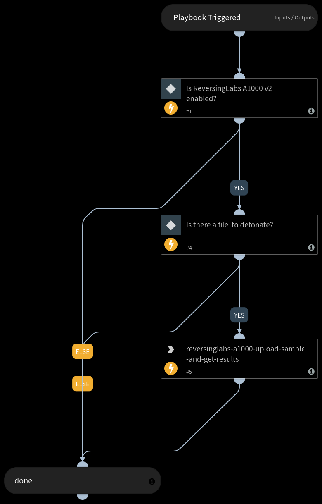

Upload sample to ReversingLabs  A1000 appliance and automatically retrieve the analysis report.

## Dependencies
This playbook uses the following sub-playbooks, integrations, and scripts.

### Sub-playbooks
This playbook does not use any sub-playbooks.

### Integrations
* ReversingLabs A1000 v2

### Scripts
This playbook does not use any scripts.

### Commands
* reversinglabs-a1000-upload-sample-and-get-results

## Playbook Inputs
---

| **Name** | **Description** | **Default Value** | **Required** |
| --- | --- | --- | --- |
| EntryID | The Entry ID. | ${File.EntryID} | Optional |

## Playbook Outputs
---

| **Path** | **Description** | **Type** |
| --- | --- | --- |
| File.SHA256 | The SHA256 hash of the file. | unknown |
| File.SHA1 | The SHA1 hash of the file. | unknown |
| File.SHA512 | The SHA512 hash of the file. | unknown |
| File.Name | The name of the file. | unknown |
| File.EntryID | The Entry ID. | unknown |
| File.Info | Information about the file. | unknown |
| File.Type | The type of the file. | unknown |
| File.MD5 | MD5 hash of the file. | unknown |
| DBotScore.Score | The actual score. | unknown |
| DBotScore.Type | The indicator type. | unknown |
| DBotScore.Indicator | The indicator that was tested. | unknown |
| DBotScore.Vendor | The vendor used to calculate the score. | unknown |
| ReversingLabs.a1000_report | A1000 report | unknown |

## Playbook Image
---
