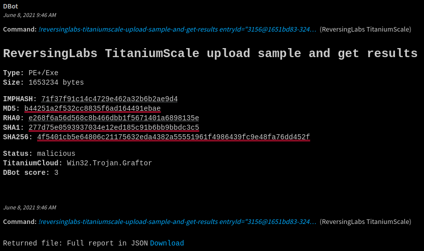
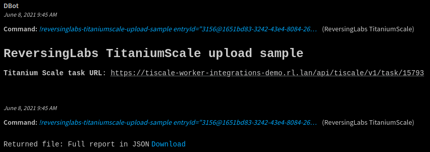
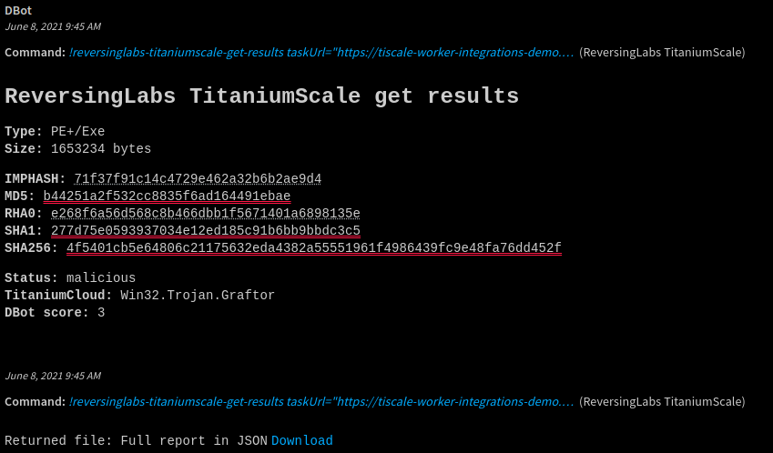

## Overview
This integration supports using ReversingLabs Advanced File Analysis to 'detonate file' on the TitaniumScale Advanced Malware
Analysis Appliance.

The ReversingLabs TitaniumScale Appliance is powered by TitaniumCore, the malware analysis engine that performs 
automated static analysis using the Active File Decomposition technology.

TitaniumCore unpacks and recursively analyzes files without executing them, and extracts internal threat indicators to 
classify files and determine their threat level. TitaniumCore is capable of identifying thousands of file format 
families. It recursively unpacks hundreds of file format families, and fully repairs extracted files to enable further 
analysis.

* * *
## Prerequisites

You need to obtain the following:

*   TitaniumScale instance
*   TitaniumScale API Token

## Configure ReversingLabs TitaniumScale on Cortex XSOAR

1. Navigate to **Settings** > **Integrations** > **Servers & Services**.
2. Search for **Reversinglabs TitaniumScale**.
3. Click **Add instance** to create and configure a new integration instance.

    | **Parameter** | **Required** |
    | --- | --- |
    | ReversingLabs TitaniumScale instance URL | True |
    | API Token | True |  
    | Verify host certificates | True (default: False) |
    | Reliability  |  True (default: C - Fairly reliable)
    |Wait time between report fetching retries (seconds)| True (default: 2)|
    |Number of report fetching retries| True (default: 30)|
    | HTTP proxy address with the protocol and port number. | False |
    | HTTP proxy username | False |
    | HTTP proxy password | False |
    | HTTPS proxy address with the protocol and port number. | False |
    | HTTPS proxy username | False |
    | HTTPS proxy password | False |

4. Click **Test** to validate connection.

## Commands
You can execute these commands from the XSOAR CLI, as part of an automation, or in a playbook. 
After you successfully execute a command, a DBot message appears in the War Room with the command details.
For all commands, full report is saved as a part of the context and also returned as a downloadable file.

- [reversinglabs-titaniumscale-upload-sample-and-get-results](#reversinglabs-titaniumscale-upload-sample-and-get-results)
- [reversinglabs-titaniumscale-upload-sample](#reversinglabs-titaniumscale-upload-sample)
- [reversinglabs-titaniumscale-get-results](#reversinglabs-titaniumscale-get-results)

***
## reversinglabs-titaniumscale-upload-sample-and-get-results
Upload sample to TitaniumScale instance and retrieve the analysis report. 

### Input

| **Argument Name** | **Description** | **Required** |
| --- | --- | --- |
| entryId | Entry ID of the sample to be uploaded | True | 

### Command Example
```!reversinglabs-titaniumscale-upload-sample-and-get-results entryId="3156@1651bd83-3242-43e4-8084-26de8937ca81"```

### Human Readable Output:


### Context Output

| **Path** | **Description** |
| --- | --- |
| File | File indicator | 
| DBotScore | Score | 
| ReversingLabs.tc_report | Full report in JSON | 


<br>

<details><summary>Context Example:</summary>
<p>

```json
{
    "Type": 1,
    "ContentsFormat": "json",
    "Contents": {
        "tc_report": [
            {
                "info": {
                    "file": {
                        "file_subtype": "Exe",
                        "entropy": 6.18799192412328,
                        "file_type": "PE+",
                        "file_name": "1651bd83-3242-43e4-8084-26de8937ca81_31051651bd83-3242-43e4-8084-26de8937ca81",
                        "hashes": [
                            {
                                "name": "imphash",
                                "value": "71f37f91c14c4729e462a32b6b2ae9d4"
                            },
                            {
                                "name": "md5",
                                "value": "b44251a2f532cc8835f6ad164491ebae"
                            },
                            {
                                "name": "rha0",
                                "value": "e268f6a56d568c8b466dbb1f5671401a6898135e"
                            },
                            {
                                "name": "sha1",
                                "value": "277d75e0593937034e12ed185c91b6bb9bbdc3c5"
                            },
                            {
                                "name": "sha256",
                                "value": "4f5401cb5e64806c21175632eda4382a55551961f4986439fc9e48fa76dd452f"
                            }
                        ],
                        "file_path": "/scratch/1651bd83-3242-43e4-8084-26de8937ca81_31051651bd83-3242-43e4-8084-26de8937ca81",
                        "size": 1653234
                    }
                },
                "indicators": [
                    {
                        "priority": 6,
                        "category": 10,
                        "description": "Executes a file."
                    },
                    {
                        "priority": 5,
                        "category": 0,
                        "description": "Contains IP addresses."
                    },
                    {
                        "priority": 5,
                        "category": 11,
                        "description": "Tampers with user/account privileges."
                    },
                    {
                        "priority": 5,
                        "category": 22,
                        "description": "Writes to files in Windows system directories."
                    },
                    {
                        "priority": 4,
                        "category": 22,
                        "description": "Creates/opens files in Windows system directories."
                    },
                    {
                        "priority": 4,
                        "category": 13,
                        "description": "Enumerates system information."
                    },
                    {
                        "priority": 4,
                        "category": 4,
                        "description": "Possibly does process injection."
                    },
                    {
                        "priority": 4,
                        "category": 22,
                        "description": "Reads from files in Windows system directories."
                    },
                    {
                        "priority": 4,
                        "category": 11,
                        "description": "Requests permission required to lock physical pages in memory."
                    },
                    {
                        "priority": 3,
                        "category": 7,
                        "description": "Detects/enumerates process modules."
                    },
                    {
                        "priority": 3,
                        "category": 10,
                        "description": "Terminates a process/thread."
                    },
                    {
                        "priority": 3,
                        "category": 1,
                        "description": "Uses anti-debugging methods."
                    },
                    {
                        "priority": 3,
                        "category": 22,
                        "description": "Writes to files."
                    },
                    {
                        "priority": 2,
                        "category": 13,
                        "description": "Enumerates system variables."
                    },
                    {
                        "priority": 2,
                        "category": 10,
                        "description": "Might load additional DLLs and APIs."
                    },
                    {
                        "priority": 2,
                        "category": 12,
                        "description": "Monitors directory changes."
                    },
                    {
                        "priority": 2,
                        "category": 22,
                        "description": "Reads from files."
                    },
                    {
                        "priority": 2,
                        "category": 10,
                        "description": "Uses pipes for interprocess communication."
                    },
                    {
                        "priority": 1,
                        "category": 10,
                        "description": "Contains reference to api-ms-win-core-synch-l1-2-0.dll which is ApiSet Stub DLL."
                    },
                    {
                        "priority": 1,
                        "category": 10,
                        "description": "Contains reference to kernel32.dll which is Windows NT BASE API Client DLL."
                    },
                    {
                        "priority": 1,
                        "category": 10,
                        "description": "Contains reference to ntdll.dll which is NT Layer DLL."
                    },
                    {
                        "priority": 1,
                        "category": 10,
                        "description": "Contains reference to powrprof.dll which is Power Profile Helper DLL."
                    },
                    {
                        "priority": 1,
                        "category": 10,
                        "description": "Contains reference to psapi.dll which is Process Status Helper."
                    },
                    {
                        "priority": 1,
                        "category": 10,
                        "description": "Contains reference to user32.dll which is Multi-User Windows USER API Client DLL."
                    },
                    {
                        "priority": 1,
                        "category": 12,
                        "description": "Contains references to document file extensions."
                    },
                    {
                        "priority": 1,
                        "category": 12,
                        "description": "Contains references to executable file extensions."
                    },
                    {
                        "priority": 1,
                        "category": 12,
                        "description": "Contains references to source code file extensions."
                    },
                    {
                        "priority": 1,
                        "category": 22,
                        "description": "Creates/Opens a file."
                    }
                ],
                "interesting_strings": [
                    {
                        "category": "http",
                        "values": [
                            "donate.v2.xmrig.com"
                        ]
                    },
                    {
                        "category": "ipv4",
                        "values": [
                            "0.0.0.0",
                            "127.0.0.1",
                            "3.120.209.58:8080"
                        ]
                    },
                    {
                        "category": "mailto",
                        "values": [
                            "pP0P@0.0.0.0"
                        ]
                    }
                ],
                "classification": {
                    "propagation_source": {
                        "name": "sha1",
                        "value": "848899ad7d2afabfb64806cc9ef8d7d1a3f77641"
                    },
                    "propagated": true,
                    "scan_results": [
                        {
                            "result": "Win32.Trojan.Graftor",
                            "type": "cloud",
                            "name": "TitaniumCloud",
                            "classification": 3,
                            "factor": 5
                        },
                        {
                            "result": "Win64.Coinminer.Malxmr",
                            "type": "cloud",
                            "name": "TitaniumCloud",
                            "classification": 3,
                            "factor": 4
                        }
                    ],
                    "classification": 3,
                    "factor": 5
                },
                "metadata": {
                    "application": {
                        "capabilities": 827063294
                    }
                }
            },
            {
                "info": {
                    "file": {
                        "file_subtype": "Exe",
                        "entropy": 6.60580452906475,
                        "file_type": "PE",
                        "file_name": "0",
                        "hashes": [
                            {
                                "name": "md5",
                                "value": "8b84009488f7254a2be3c4409bcf286a"
                            },
                            {
                                "name": "rha0",
                                "value": "42f8f3d9c5a7044a0895c89f27c1d9cdc2777511"
                            },
                            {
                                "name": "sha1",
                                "value": "848899ad7d2afabfb64806cc9ef8d7d1a3f77641"
                            },
                            {
                                "name": "sha256",
                                "value": "91ad1155d57e91caa994da40fff6048eb8c10fcf9a6c1b7d5a393f605d718acc"
                            }
                        ],
                        "file_path": "1651bd83-3242-43e4-8084-26de8937ca81_31051651bd83-3242-43e4-8084-26de8937ca81/binary_layer/overlay/0",
                        "size": 620530
                    }
                },
                "indicators": [
                    {
                        "priority": 1,
                        "category": 12,
                        "description": "Contains references to executable file extensions."
                    }
                ],
                "classification": {
                    "propagated": false,
                    "scan_results": [
                        {
                            "result": "Win32.Trojan.Graftor",
                            "type": "cloud",
                            "name": "TitaniumCloud",
                            "classification": 3,
                            "factor": 5
                        }
                    ],
                    "classification": 3,
                    "factor": 5
                },
                "metadata": {
                    "application": {
                        "capabilities": 0
                    }
                }
            },
            {
                "info": {
                    "file": {
                        "file_subtype": "XML",
                        "entropy": 4.9116145157351045,
                        "file_type": "Text",
                        "file_name": "1",
                        "hashes": [
                            {
                                "name": "md5",
                                "value": "1e4a89b11eae0fcf8bb5fdd5ec3b6f61"
                            },
                            {
                                "name": "rha0",
                                "value": "4260284ce14278c397aaf6f389c1609b0ab0ce51"
                            },
                            {
                                "name": "sha1",
                                "value": "4260284ce14278c397aaf6f389c1609b0ab0ce51"
                            },
                            {
                                "name": "sha256",
                                "value": "4bb79dcea0a901f7d9eac5aa05728ae92acb42e0cb22e5dd14134f4421a3d8df"
                            }
                        ],
                        "file_path": "1651bd83-3242-43e4-8084-26de8937ca81_31051651bd83-3242-43e4-8084-26de8937ca81/binary_layer/resource/1",
                        "size": 381
                    }
                },
                "classification": {
                    "propagated": false,
                    "scan_results": [
                        {
                            "type": "cloud",
                            "name": "TitaniumCloud",
                            "classification": 1,
                            "factor": 0
                        }
                    ],
                    "classification": 1,
                    "factor": 0
                }
            }
        ]
    },
    "HumanReadable": "## ReversingLabs TitaniumScale get report\n\n **Type:** PE+/Exe\n                             **Size:** 1653234 bytes \n\n **IMPHASH:** 71f37f91c14c4729e462a32b6b2ae9d4\n **MD5:** b44251a2f532cc8835f6ad164491ebae\n **RHA0:** e268f6a56d568c8b466dbb1f5671401a6898135e\n **SHA1:** 277d75e0593937034e12ed185c91b6bb9bbdc3c5\n **SHA256:** 4f5401cb5e64806c21175632eda4382a55551961f4986439fc9e48fa76dd452f\n\n **Status:** malicious\n **TitaniumCloud:** Win32.Trojan.Graftor\n **DBot score:** 3\n",
    "EntryContext": {
        "File(val.MD5 && val.MD5 == obj.MD5 || val.SHA1 && val.SHA1 == obj.SHA1 || val.SHA256 && val.SHA256 == obj.SHA256 || val.SHA512 && val.SHA512 == obj.SHA512 || val.CRC32 && val.CRC32 == obj.CRC32 || val.CTPH && val.CTPH == obj.CTPH || val.SSDeep && val.SSDeep == obj.SSDeep)": [
            {
                "MD5": "b44251a2f532cc8835f6ad164491ebae",
                "SHA1": "277d75e0593937034e12ed185c91b6bb9bbdc3c5",
                "SHA256": "4f5401cb5e64806c21175632eda4382a55551961f4986439fc9e48fa76dd452f",
                "Malicious": {
                    "Vendor": "ReversingLabs TitaniumScale",
                    "Description": "\n **TitaniumCloud:** Win32.Trojan.Graftor"
                }
            }
        ],
        "DBotScore(val.Indicator && val.Indicator == obj.Indicator && val.Vendor == obj.Vendor && val.Type == obj.Type)": [
            {
                "Indicator": "277d75e0593937034e12ed185c91b6bb9bbdc3c5",
                "Type": "file",
                "Vendor": "ReversingLabs TitaniumScale",
                "Score": 3
            }
        ],
        "ReversingLabs": {
            "tc_report": [
                {
                    "info": {
                        "file": {
                            "file_subtype": "Exe",
                            "entropy": 6.18799192412328,
                            "file_type": "PE+",
                            "file_name": "1651bd83-3242-43e4-8084-26de8937ca81_31051651bd83-3242-43e4-8084-26de8937ca81",
                            "hashes": [
                                {
                                    "name": "imphash",
                                    "value": "71f37f91c14c4729e462a32b6b2ae9d4"
                                },
                                {
                                    "name": "md5",
                                    "value": "b44251a2f532cc8835f6ad164491ebae"
                                },
                                {
                                    "name": "rha0",
                                    "value": "e268f6a56d568c8b466dbb1f5671401a6898135e"
                                },
                                {
                                    "name": "sha1",
                                    "value": "277d75e0593937034e12ed185c91b6bb9bbdc3c5"
                                },
                                {
                                    "name": "sha256",
                                    "value": "4f5401cb5e64806c21175632eda4382a55551961f4986439fc9e48fa76dd452f"
                                }
                            ],
                            "file_path": "/scratch/1651bd83-3242-43e4-8084-26de8937ca81_31051651bd83-3242-43e4-8084-26de8937ca81",
                            "size": 1653234
                        }
                    },
                    "indicators": [
                        {
                            "priority": 6,
                            "category": 10,
                            "description": "Executes a file."
                        },
                        {
                            "priority": 5,
                            "category": 0,
                            "description": "Contains IP addresses."
                        },
                        {
                            "priority": 5,
                            "category": 11,
                            "description": "Tampers with user/account privileges."
                        },
                        {
                            "priority": 5,
                            "category": 22,
                            "description": "Writes to files in Windows system directories."
                        },
                        {
                            "priority": 4,
                            "category": 22,
                            "description": "Creates/opens files in Windows system directories."
                        },
                        {
                            "priority": 4,
                            "category": 13,
                            "description": "Enumerates system information."
                        },
                        {
                            "priority": 4,
                            "category": 4,
                            "description": "Possibly does process injection."
                        },
                        {
                            "priority": 4,
                            "category": 22,
                            "description": "Reads from files in Windows system directories."
                        },
                        {
                            "priority": 4,
                            "category": 11,
                            "description": "Requests permission required to lock physical pages in memory."
                        },
                        {
                            "priority": 3,
                            "category": 7,
                            "description": "Detects/enumerates process modules."
                        },
                        {
                            "priority": 3,
                            "category": 10,
                            "description": "Terminates a process/thread."
                        },
                        {
                            "priority": 3,
                            "category": 1,
                            "description": "Uses anti-debugging methods."
                        },
                        {
                            "priority": 3,
                            "category": 22,
                            "description": "Writes to files."
                        },
                        {
                            "priority": 2,
                            "category": 13,
                            "description": "Enumerates system variables."
                        },
                        {
                            "priority": 2,
                            "category": 10,
                            "description": "Might load additional DLLs and APIs."
                        },
                        {
                            "priority": 2,
                            "category": 12,
                            "description": "Monitors directory changes."
                        },
                        {
                            "priority": 2,
                            "category": 22,
                            "description": "Reads from files."
                        },
                        {
                            "priority": 2,
                            "category": 10,
                            "description": "Uses pipes for interprocess communication."
                        },
                        {
                            "priority": 1,
                            "category": 10,
                            "description": "Contains reference to api-ms-win-core-synch-l1-2-0.dll which is ApiSet Stub DLL."
                        },
                        {
                            "priority": 1,
                            "category": 10,
                            "description": "Contains reference to kernel32.dll which is Windows NT BASE API Client DLL."
                        },
                        {
                            "priority": 1,
                            "category": 10,
                            "description": "Contains reference to ntdll.dll which is NT Layer DLL."
                        },
                        {
                            "priority": 1,
                            "category": 10,
                            "description": "Contains reference to powrprof.dll which is Power Profile Helper DLL."
                        },
                        {
                            "priority": 1,
                            "category": 10,
                            "description": "Contains reference to psapi.dll which is Process Status Helper."
                        },
                        {
                            "priority": 1,
                            "category": 10,
                            "description": "Contains reference to user32.dll which is Multi-User Windows USER API Client DLL."
                        },
                        {
                            "priority": 1,
                            "category": 12,
                            "description": "Contains references to document file extensions."
                        },
                        {
                            "priority": 1,
                            "category": 12,
                            "description": "Contains references to executable file extensions."
                        },
                        {
                            "priority": 1,
                            "category": 12,
                            "description": "Contains references to source code file extensions."
                        },
                        {
                            "priority": 1,
                            "category": 22,
                            "description": "Creates/Opens a file."
                        }
                    ],
                    "interesting_strings": [
                        {
                            "category": "http",
                            "values": [
                                "donate.v2.xmrig.com"
                            ]
                        },
                        {
                            "category": "ipv4",
                            "values": [
                                "0.0.0.0",
                                "127.0.0.1",
                                "3.120.209.58:8080"
                            ]
                        },
                        {
                            "category": "mailto",
                            "values": [
                                "pP0P@0.0.0.0"
                            ]
                        }
                    ],
                    "classification": {
                        "propagation_source": {
                            "name": "sha1",
                            "value": "848899ad7d2afabfb64806cc9ef8d7d1a3f77641"
                        },
                        "propagated": true,
                        "scan_results": [
                            {
                                "result": "Win32.Trojan.Graftor",
                                "type": "cloud",
                                "name": "TitaniumCloud",
                                "classification": 3,
                                "factor": 5
                            },
                            {
                                "result": "Win64.Coinminer.Malxmr",
                                "type": "cloud",
                                "name": "TitaniumCloud",
                                "classification": 3,
                                "factor": 4
                            }
                        ],
                        "classification": 3,
                        "factor": 5
                    },
                    "metadata": {
                        "application": {
                            "capabilities": 827063294
                        }
                    }
                },
                {
                    "info": {
                        "file": {
                            "file_subtype": "Exe",
                            "entropy": 6.60580452906475,
                            "file_type": "PE",
                            "file_name": "0",
                            "hashes": [
                                {
                                    "name": "md5",
                                    "value": "8b84009488f7254a2be3c4409bcf286a"
                                },
                                {
                                    "name": "rha0",
                                    "value": "42f8f3d9c5a7044a0895c89f27c1d9cdc2777511"
                                },
                                {
                                    "name": "sha1",
                                    "value": "848899ad7d2afabfb64806cc9ef8d7d1a3f77641"
                                },
                                {
                                    "name": "sha256",
                                    "value": "91ad1155d57e91caa994da40fff6048eb8c10fcf9a6c1b7d5a393f605d718acc"
                                }
                            ],
                            "file_path": "1651bd83-3242-43e4-8084-26de8937ca81_31051651bd83-3242-43e4-8084-26de8937ca81/binary_layer/overlay/0",
                            "size": 620530
                        }
                    },
                    "indicators": [
                        {
                            "priority": 1,
                            "category": 12,
                            "description": "Contains references to executable file extensions."
                        }
                    ],
                    "classification": {
                        "propagated": false,
                        "scan_results": [
                            {
                                "result": "Win32.Trojan.Graftor",
                                "type": "cloud",
                                "name": "TitaniumCloud",
                                "classification": 3,
                                "factor": 5
                            }
                        ],
                        "classification": 3,
                        "factor": 5
                    },
                    "metadata": {
                        "application": {
                            "capabilities": 0
                        }
                    }
                },
                {
                    "info": {
                        "file": {
                            "file_subtype": "XML",
                            "entropy": 4.9116145157351045,
                            "file_type": "Text",
                            "file_name": "1",
                            "hashes": [
                                {
                                    "name": "md5",
                                    "value": "1e4a89b11eae0fcf8bb5fdd5ec3b6f61"
                                },
                                {
                                    "name": "rha0",
                                    "value": "4260284ce14278c397aaf6f389c1609b0ab0ce51"
                                },
                                {
                                    "name": "sha1",
                                    "value": "4260284ce14278c397aaf6f389c1609b0ab0ce51"
                                },
                                {
                                    "name": "sha256",
                                    "value": "4bb79dcea0a901f7d9eac5aa05728ae92acb42e0cb22e5dd14134f4421a3d8df"
                                }
                            ],
                            "file_path": "1651bd83-3242-43e4-8084-26de8937ca81_31051651bd83-3242-43e4-8084-26de8937ca81/binary_layer/resource/1",
                            "size": 381
                        }
                    },
                    "classification": {
                        "propagated": false,
                        "scan_results": [
                            {
                                "type": "cloud",
                                "name": "TitaniumCloud",
                                "classification": 1,
                                "factor": 0
                            }
                        ],
                        "classification": 1,
                        "factor": 0
                    }
                }
            ]
        }
    },
    "IndicatorTimeline": [],
    "IgnoreAutoExtract": false,
    "Note": false,
    "Relationships": []
}

```
</p>
</details>

***
## reversinglabs-titaniumscale-upload-sample
Upload sample to TitaniumScale instance for analysis. Returns the taskUrl which can be later used to retrieve the report. 

### Input

| **Argument Name** | **Description** | **Required** |
| --- | --- | --- |
| entryId | entryId of the sample to upload | True | 

### Command Example
```!reversinglabs-titaniumscale-upload-sample entryId="3156@1651bd83-3242-43e4-8084-26de8937ca81"```

### Human Readable Output:


### Context Output

| **Path** | **Description** |
| --- | --- |
| ReversingLabs.tc_task_url | URL to retrieve the report from| 
 
<br>

<details><summary>Context Example:</summary>
<p>

```json
{
    "Type": 1,
    "ContentsFormat": "json",
    "Contents": {
        "tc_task_url": "https://tiscale-worker-integrations-demo.rl.lan/api/tiscale/v1/task/15795"
    },
    "HumanReadable": "## ReversingLabs TitaniumScale file upload\n **Titanium Scale task URL**: https://tiscale-worker-integrations-demo.rl.lan/api/tiscale/v1/task/15795",
    "EntryContext": {
        "ReversingLabs": {
            "tc_task_url": "https://tiscale-worker-integrations-demo.rl.lan/api/tiscale/v1/task/15795"
        }
    },
    "IndicatorTimeline": [],
    "IgnoreAutoExtract": false,
    "Note": false,
    "Relationships": []
}
```
</p>
</details>

***
## reversinglabs-titaniumscale-get-results
Retrieve analysis report from TitaniumScale instance by taskUrl.

### Input

| **Argument Name** | **Description** | **Required** |
| --- | --- | --- |
| taskUrl | URL to fetch the report from | True | 

### Command Example
```!reversinglabs-titaniumscale-get-results taskUrl="https://tiscale-worker-integrations-demo.rl.lan/api/tiscale/v1/task/15794"```

### Human Readable Output:


### Context Output
| **Path** | **Description** |
| --- | --- |
| File | File indicator | 
| DBotScore | Score | 
| ReversingLabs.tc_report | Full report in JSON | 

<br>

<details><summary>Context Example:</summary>
<p>

```json
{
    "Type": 1,
    "ContentsFormat": "json",
    "Contents": {
        "tc_report": [
            {
                "info": {
                    "file": {
                        "file_subtype": "Exe",
                        "entropy": 6.18799192412328,
                        "file_type": "PE+",
                        "file_name": "1651bd83-3242-43e4-8084-26de8937ca81_31051651bd83-3242-43e4-8084-26de8937ca81",
                        "hashes": [
                            {
                                "name": "imphash",
                                "value": "71f37f91c14c4729e462a32b6b2ae9d4"
                            },
                            {
                                "name": "md5",
                                "value": "b44251a2f532cc8835f6ad164491ebae"
                            },
                            {
                                "name": "rha0",
                                "value": "e268f6a56d568c8b466dbb1f5671401a6898135e"
                            },
                            {
                                "name": "sha1",
                                "value": "277d75e0593937034e12ed185c91b6bb9bbdc3c5"
                            },
                            {
                                "name": "sha256",
                                "value": "4f5401cb5e64806c21175632eda4382a55551961f4986439fc9e48fa76dd452f"
                            }
                        ],
                        "file_path": "/scratch/1651bd83-3242-43e4-8084-26de8937ca81_31051651bd83-3242-43e4-8084-26de8937ca81",
                        "size": 1653234
                    }
                },
                "indicators": [
                    {
                        "priority": 6,
                        "category": 10,
                        "description": "Executes a file."
                    },
                    {
                        "priority": 5,
                        "category": 0,
                        "description": "Contains IP addresses."
                    },
                    {
                        "priority": 5,
                        "category": 11,
                        "description": "Tampers with user/account privileges."
                    },
                    {
                        "priority": 5,
                        "category": 22,
                        "description": "Writes to files in Windows system directories."
                    },
                    {
                        "priority": 4,
                        "category": 22,
                        "description": "Creates/opens files in Windows system directories."
                    },
                    {
                        "priority": 4,
                        "category": 13,
                        "description": "Enumerates system information."
                    },
                    {
                        "priority": 4,
                        "category": 4,
                        "description": "Possibly does process injection."
                    },
                    {
                        "priority": 4,
                        "category": 22,
                        "description": "Reads from files in Windows system directories."
                    },
                    {
                        "priority": 4,
                        "category": 11,
                        "description": "Requests permission required to lock physical pages in memory."
                    },
                    {
                        "priority": 3,
                        "category": 7,
                        "description": "Detects/enumerates process modules."
                    },
                    {
                        "priority": 3,
                        "category": 10,
                        "description": "Terminates a process/thread."
                    },
                    {
                        "priority": 3,
                        "category": 1,
                        "description": "Uses anti-debugging methods."
                    },
                    {
                        "priority": 3,
                        "category": 22,
                        "description": "Writes to files."
                    },
                    {
                        "priority": 2,
                        "category": 13,
                        "description": "Enumerates system variables."
                    },
                    {
                        "priority": 2,
                        "category": 10,
                        "description": "Might load additional DLLs and APIs."
                    },
                    {
                        "priority": 2,
                        "category": 12,
                        "description": "Monitors directory changes."
                    },
                    {
                        "priority": 2,
                        "category": 22,
                        "description": "Reads from files."
                    },
                    {
                        "priority": 2,
                        "category": 10,
                        "description": "Uses pipes for interprocess communication."
                    },
                    {
                        "priority": 1,
                        "category": 10,
                        "description": "Contains reference to api-ms-win-core-synch-l1-2-0.dll which is ApiSet Stub DLL."
                    },
                    {
                        "priority": 1,
                        "category": 10,
                        "description": "Contains reference to kernel32.dll which is Windows NT BASE API Client DLL."
                    },
                    {
                        "priority": 1,
                        "category": 10,
                        "description": "Contains reference to ntdll.dll which is NT Layer DLL."
                    },
                    {
                        "priority": 1,
                        "category": 10,
                        "description": "Contains reference to powrprof.dll which is Power Profile Helper DLL."
                    },
                    {
                        "priority": 1,
                        "category": 10,
                        "description": "Contains reference to psapi.dll which is Process Status Helper."
                    },
                    {
                        "priority": 1,
                        "category": 10,
                        "description": "Contains reference to user32.dll which is Multi-User Windows USER API Client DLL."
                    },
                    {
                        "priority": 1,
                        "category": 12,
                        "description": "Contains references to document file extensions."
                    },
                    {
                        "priority": 1,
                        "category": 12,
                        "description": "Contains references to executable file extensions."
                    },
                    {
                        "priority": 1,
                        "category": 12,
                        "description": "Contains references to source code file extensions."
                    },
                    {
                        "priority": 1,
                        "category": 22,
                        "description": "Creates/Opens a file."
                    }
                ],
                "interesting_strings": [
                    {
                        "category": "http",
                        "values": [
                            "donate.v2.xmrig.com"
                        ]
                    },
                    {
                        "category": "ipv4",
                        "values": [
                            "0.0.0.0",
                            "127.0.0.1",
                            "3.120.209.58:8080"
                        ]
                    },
                    {
                        "category": "mailto",
                        "values": [
                            "pP0P@0.0.0.0"
                        ]
                    }
                ],
                "classification": {
                    "propagation_source": {
                        "name": "sha1",
                        "value": "848899ad7d2afabfb64806cc9ef8d7d1a3f77641"
                    },
                    "propagated": true,
                    "scan_results": [
                        {
                            "result": "Win32.Trojan.Graftor",
                            "type": "cloud",
                            "name": "TitaniumCloud",
                            "classification": 3,
                            "factor": 5
                        },
                        {
                            "result": "Win64.Coinminer.Malxmr",
                            "type": "cloud",
                            "name": "TitaniumCloud",
                            "classification": 3,
                            "factor": 4
                        }
                    ],
                    "classification": 3,
                    "factor": 5
                },
                "metadata": {
                    "application": {
                        "capabilities": 827063294
                    }
                }
            },
            {
                "info": {
                    "file": {
                        "file_subtype": "Exe",
                        "entropy": 6.60580452906475,
                        "file_type": "PE",
                        "file_name": "0",
                        "hashes": [
                            {
                                "name": "md5",
                                "value": "8b84009488f7254a2be3c4409bcf286a"
                            },
                            {
                                "name": "rha0",
                                "value": "42f8f3d9c5a7044a0895c89f27c1d9cdc2777511"
                            },
                            {
                                "name": "sha1",
                                "value": "848899ad7d2afabfb64806cc9ef8d7d1a3f77641"
                            },
                            {
                                "name": "sha256",
                                "value": "91ad1155d57e91caa994da40fff6048eb8c10fcf9a6c1b7d5a393f605d718acc"
                            }
                        ],
                        "file_path": "1651bd83-3242-43e4-8084-26de8937ca81_31051651bd83-3242-43e4-8084-26de8937ca81/binary_layer/overlay/0",
                        "size": 620530
                    }
                },
                "indicators": [
                    {
                        "priority": 1,
                        "category": 12,
                        "description": "Contains references to executable file extensions."
                    }
                ],
                "classification": {
                    "propagated": false,
                    "scan_results": [
                        {
                            "result": "Win32.Trojan.Graftor",
                            "type": "cloud",
                            "name": "TitaniumCloud",
                            "classification": 3,
                            "factor": 5
                        }
                    ],
                    "classification": 3,
                    "factor": 5
                },
                "metadata": {
                    "application": {
                        "capabilities": 0
                    }
                }
            },
            {
                "info": {
                    "file": {
                        "file_subtype": "XML",
                        "entropy": 4.9116145157351045,
                        "file_type": "Text",
                        "file_name": "1",
                        "hashes": [
                            {
                                "name": "md5",
                                "value": "1e4a89b11eae0fcf8bb5fdd5ec3b6f61"
                            },
                            {
                                "name": "rha0",
                                "value": "4260284ce14278c397aaf6f389c1609b0ab0ce51"
                            },
                            {
                                "name": "sha1",
                                "value": "4260284ce14278c397aaf6f389c1609b0ab0ce51"
                            },
                            {
                                "name": "sha256",
                                "value": "4bb79dcea0a901f7d9eac5aa05728ae92acb42e0cb22e5dd14134f4421a3d8df"
                            }
                        ],
                        "file_path": "1651bd83-3242-43e4-8084-26de8937ca81_31051651bd83-3242-43e4-8084-26de8937ca81/binary_layer/resource/1",
                        "size": 381
                    }
                },
                "classification": {
                    "propagated": false,
                    "scan_results": [
                        {
                            "type": "cloud",
                            "name": "TitaniumCloud",
                            "classification": 1,
                            "factor": 0
                        }
                    ],
                    "classification": 1,
                    "factor": 0
                }
            }
        ]
    },
    "HumanReadable": "## ReversingLabs TitaniumScale get report\n\n **Type:** PE+/Exe\n                             **Size:** 1653234 bytes \n\n **IMPHASH:** 71f37f91c14c4729e462a32b6b2ae9d4\n **MD5:** b44251a2f532cc8835f6ad164491ebae\n **RHA0:** e268f6a56d568c8b466dbb1f5671401a6898135e\n **SHA1:** 277d75e0593937034e12ed185c91b6bb9bbdc3c5\n **SHA256:** 4f5401cb5e64806c21175632eda4382a55551961f4986439fc9e48fa76dd452f\n\n **Status:** malicious\n **TitaniumCloud:** Win32.Trojan.Graftor\n **DBot score:** 3\n",
    "EntryContext": {
        "File(val.MD5 && val.MD5 == obj.MD5 || val.SHA1 && val.SHA1 == obj.SHA1 || val.SHA256 && val.SHA256 == obj.SHA256 || val.SHA512 && val.SHA512 == obj.SHA512 || val.CRC32 && val.CRC32 == obj.CRC32 || val.CTPH && val.CTPH == obj.CTPH || val.SSDeep && val.SSDeep == obj.SSDeep)": [
            {
                "MD5": "b44251a2f532cc8835f6ad164491ebae",
                "SHA1": "277d75e0593937034e12ed185c91b6bb9bbdc3c5",
                "SHA256": "4f5401cb5e64806c21175632eda4382a55551961f4986439fc9e48fa76dd452f",
                "Malicious": {
                    "Vendor": "ReversingLabs TitaniumScale",
                    "Description": "\n **TitaniumCloud:** Win32.Trojan.Graftor"
                }
            }
        ],
        "DBotScore(val.Indicator && val.Indicator == obj.Indicator && val.Vendor == obj.Vendor && val.Type == obj.Type)": [
            {
                "Indicator": "277d75e0593937034e12ed185c91b6bb9bbdc3c5",
                "Type": "file",
                "Vendor": "ReversingLabs TitaniumScale",
                "Score": 3
            }
        ],
        "ReversingLabs": {
            "tc_report": [
                {
                    "info": {
                        "file": {
                            "file_subtype": "Exe",
                            "entropy": 6.18799192412328,
                            "file_type": "PE+",
                            "file_name": "1651bd83-3242-43e4-8084-26de8937ca81_31051651bd83-3242-43e4-8084-26de8937ca81",
                            "hashes": [
                                {
                                    "name": "imphash",
                                    "value": "71f37f91c14c4729e462a32b6b2ae9d4"
                                },
                                {
                                    "name": "md5",
                                    "value": "b44251a2f532cc8835f6ad164491ebae"
                                },
                                {
                                    "name": "rha0",
                                    "value": "e268f6a56d568c8b466dbb1f5671401a6898135e"
                                },
                                {
                                    "name": "sha1",
                                    "value": "277d75e0593937034e12ed185c91b6bb9bbdc3c5"
                                },
                                {
                                    "name": "sha256",
                                    "value": "4f5401cb5e64806c21175632eda4382a55551961f4986439fc9e48fa76dd452f"
                                }
                            ],
                            "file_path": "/scratch/1651bd83-3242-43e4-8084-26de8937ca81_31051651bd83-3242-43e4-8084-26de8937ca81",
                            "size": 1653234
                        }
                    },
                    "indicators": [
                        {
                            "priority": 6,
                            "category": 10,
                            "description": "Executes a file."
                        },
                        {
                            "priority": 5,
                            "category": 0,
                            "description": "Contains IP addresses."
                        },
                        {
                            "priority": 5,
                            "category": 11,
                            "description": "Tampers with user/account privileges."
                        },
                        {
                            "priority": 5,
                            "category": 22,
                            "description": "Writes to files in Windows system directories."
                        },
                        {
                            "priority": 4,
                            "category": 22,
                            "description": "Creates/opens files in Windows system directories."
                        },
                        {
                            "priority": 4,
                            "category": 13,
                            "description": "Enumerates system information."
                        },
                        {
                            "priority": 4,
                            "category": 4,
                            "description": "Possibly does process injection."
                        },
                        {
                            "priority": 4,
                            "category": 22,
                            "description": "Reads from files in Windows system directories."
                        },
                        {
                            "priority": 4,
                            "category": 11,
                            "description": "Requests permission required to lock physical pages in memory."
                        },
                        {
                            "priority": 3,
                            "category": 7,
                            "description": "Detects/enumerates process modules."
                        },
                        {
                            "priority": 3,
                            "category": 10,
                            "description": "Terminates a process/thread."
                        },
                        {
                            "priority": 3,
                            "category": 1,
                            "description": "Uses anti-debugging methods."
                        },
                        {
                            "priority": 3,
                            "category": 22,
                            "description": "Writes to files."
                        },
                        {
                            "priority": 2,
                            "category": 13,
                            "description": "Enumerates system variables."
                        },
                        {
                            "priority": 2,
                            "category": 10,
                            "description": "Might load additional DLLs and APIs."
                        },
                        {
                            "priority": 2,
                            "category": 12,
                            "description": "Monitors directory changes."
                        },
                        {
                            "priority": 2,
                            "category": 22,
                            "description": "Reads from files."
                        },
                        {
                            "priority": 2,
                            "category": 10,
                            "description": "Uses pipes for interprocess communication."
                        },
                        {
                            "priority": 1,
                            "category": 10,
                            "description": "Contains reference to api-ms-win-core-synch-l1-2-0.dll which is ApiSet Stub DLL."
                        },
                        {
                            "priority": 1,
                            "category": 10,
                            "description": "Contains reference to kernel32.dll which is Windows NT BASE API Client DLL."
                        },
                        {
                            "priority": 1,
                            "category": 10,
                            "description": "Contains reference to ntdll.dll which is NT Layer DLL."
                        },
                        {
                            "priority": 1,
                            "category": 10,
                            "description": "Contains reference to powrprof.dll which is Power Profile Helper DLL."
                        },
                        {
                            "priority": 1,
                            "category": 10,
                            "description": "Contains reference to psapi.dll which is Process Status Helper."
                        },
                        {
                            "priority": 1,
                            "category": 10,
                            "description": "Contains reference to user32.dll which is Multi-User Windows USER API Client DLL."
                        },
                        {
                            "priority": 1,
                            "category": 12,
                            "description": "Contains references to document file extensions."
                        },
                        {
                            "priority": 1,
                            "category": 12,
                            "description": "Contains references to executable file extensions."
                        },
                        {
                            "priority": 1,
                            "category": 12,
                            "description": "Contains references to source code file extensions."
                        },
                        {
                            "priority": 1,
                            "category": 22,
                            "description": "Creates/Opens a file."
                        }
                    ],
                    "interesting_strings": [
                        {
                            "category": "http",
                            "values": [
                                "donate.v2.xmrig.com"
                            ]
                        },
                        {
                            "category": "ipv4",
                            "values": [
                                "0.0.0.0",
                                "127.0.0.1",
                                "3.120.209.58:8080"
                            ]
                        },
                        {
                            "category": "mailto",
                            "values": [
                                "pP0P@0.0.0.0"
                            ]
                        }
                    ],
                    "classification": {
                        "propagation_source": {
                            "name": "sha1",
                            "value": "848899ad7d2afabfb64806cc9ef8d7d1a3f77641"
                        },
                        "propagated": true,
                        "scan_results": [
                            {
                                "result": "Win32.Trojan.Graftor",
                                "type": "cloud",
                                "name": "TitaniumCloud",
                                "classification": 3,
                                "factor": 5
                            },
                            {
                                "result": "Win64.Coinminer.Malxmr",
                                "type": "cloud",
                                "name": "TitaniumCloud",
                                "classification": 3,
                                "factor": 4
                            }
                        ],
                        "classification": 3,
                        "factor": 5
                    },
                    "metadata": {
                        "application": {
                            "capabilities": 827063294
                        }
                    }
                },
                {
                    "info": {
                        "file": {
                            "file_subtype": "Exe",
                            "entropy": 6.60580452906475,
                            "file_type": "PE",
                            "file_name": "0",
                            "hashes": [
                                {
                                    "name": "md5",
                                    "value": "8b84009488f7254a2be3c4409bcf286a"
                                },
                                {
                                    "name": "rha0",
                                    "value": "42f8f3d9c5a7044a0895c89f27c1d9cdc2777511"
                                },
                                {
                                    "name": "sha1",
                                    "value": "848899ad7d2afabfb64806cc9ef8d7d1a3f77641"
                                },
                                {
                                    "name": "sha256",
                                    "value": "91ad1155d57e91caa994da40fff6048eb8c10fcf9a6c1b7d5a393f605d718acc"
                                }
                            ],
                            "file_path": "1651bd83-3242-43e4-8084-26de8937ca81_31051651bd83-3242-43e4-8084-26de8937ca81/binary_layer/overlay/0",
                            "size": 620530
                        }
                    },
                    "indicators": [
                        {
                            "priority": 1,
                            "category": 12,
                            "description": "Contains references to executable file extensions."
                        }
                    ],
                    "classification": {
                        "propagated": false,
                        "scan_results": [
                            {
                                "result": "Win32.Trojan.Graftor",
                                "type": "cloud",
                                "name": "TitaniumCloud",
                                "classification": 3,
                                "factor": 5
                            }
                        ],
                        "classification": 3,
                        "factor": 5
                    },
                    "metadata": {
                        "application": {
                            "capabilities": 0
                        }
                    }
                },
                {
                    "info": {
                        "file": {
                            "file_subtype": "XML",
                            "entropy": 4.9116145157351045,
                            "file_type": "Text",
                            "file_name": "1",
                            "hashes": [
                                {
                                    "name": "md5",
                                    "value": "1e4a89b11eae0fcf8bb5fdd5ec3b6f61"
                                },
                                {
                                    "name": "rha0",
                                    "value": "4260284ce14278c397aaf6f389c1609b0ab0ce51"
                                },
                                {
                                    "name": "sha1",
                                    "value": "4260284ce14278c397aaf6f389c1609b0ab0ce51"
                                },
                                {
                                    "name": "sha256",
                                    "value": "4bb79dcea0a901f7d9eac5aa05728ae92acb42e0cb22e5dd14134f4421a3d8df"
                                }
                            ],
                            "file_path": "1651bd83-3242-43e4-8084-26de8937ca81_31051651bd83-3242-43e4-8084-26de8937ca81/binary_layer/resource/1",
                            "size": 381
                        }
                    },
                    "classification": {
                        "propagated": false,
                        "scan_results": [
                            {
                                "type": "cloud",
                                "name": "TitaniumCloud",
                                "classification": 1,
                                "factor": 0
                            }
                        ],
                        "classification": 1,
                        "factor": 0
                    }
                }
            ]
        }
    },
    "IndicatorTimeline": [],
    "IgnoreAutoExtract": false,
    "Note": false,
    "Relationships": []
}
```
</p>
</details>

