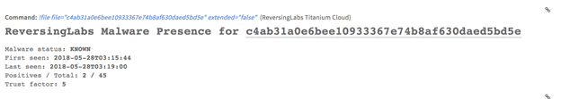
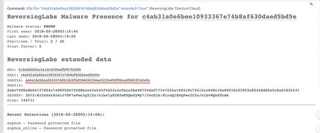

<!-- HTML_DOC -->
<h2>Overview</h2>

Use the TitaniumCloud Integration Malware Analysis Platform to increase detection, analysis and response efficiency by identifying files with global goodware and malware database. It is a powerful threat intelligence solution with up-to-date, threat classification and rich context on over 6B goodware and malware files.

This integration was integrated and tested with ReversingLabs TitaniumCloud™.

<h2>Use Cases</h2>
<ul>
<li>Provide a file reputation status for a file to prepare for emerging threats by monitoring malware.</li>
</ul>

<h2>Prerequisites</h2>

You need to obtain the following ReversingLabs TitaniumCloud information.

<ul>
<li>
<strong>Base URL for malware presence</strong> :
<ul>
<li>Preconfigured on Cortex XSOAR - https://ticloud-aws1-api.reversinglabs.com
</li>
</ul>
</li>
<li>
<strong>Base URL for extended RL Data</strong> :
<ul>
<li>Preconfigured on Cortex XSOAR - https://ticloud-cdn-api.reversinglabs.com
</li>
</ul>
</li>
<li>
<strong>Credentials for ReversingLabs TitaniumCloud</strong>
<ul>
<li>UserName</li>
<li>Password</li>
</ul>
</li>
</ul>

<h2>Configure ReversingLabs Titanium Cloud on Cortex XSOAR</h2>
<ol>
<li>Navigate to <strong>Settings</strong> &gt; <strong>Integrations</strong> &gt; <strong>Servers &amp; Services</strong>.</li>
<li>Search for ReversingLabs Titanium Cloud.</li>
<li>Click <strong>Add instance</strong> to create and configure a new integration instance.
<ul>
<li>
<strong>Name</strong>: a meaningful name for the integration instance.</li>
<li>
<strong>Base URL for malware presence </strong>: https://ticloud-aws1-api.reversinglabs.com
</li>
<li>
<strong>Base URL for extended RL Data</strong> : https://ticloud-cdn-api.reversinglabs.com
</li>
<li>
<strong>Credentials and Password</strong>: paste the username and password for your TitaniumCloud account.</li>
</ul>
</li>
<li>Click <strong>Test</strong> to validate the URLs and connection.</li>
</ol>

<h2>Commands</h2>

You can execute these commands from the Cortex XSOAR CLI, as part of an automation, or in a playbook. After you successfully execute a command, a DBot message appears in the War Room with the command details.

<ul>
<li>Retrieve malware presence status of a sample: file</li>
</ul>
<h3>Retrieve malware presence status of a sample: file</h3>

Get the ReversingLabs malware presence status for a file. This service supports single has queries and the option to return additional response data. The ReversingLabs Malware Statuses are:

<ul>
<li>Malicious</li>
<li>Suspicious</li>
<li>Known</li>
<li>Unknown</li>
</ul>
<h4>Command Example</h4>

<code>!file file="c4ab31a0e6bee10933367e74b8af630daed5bd5e" extended="true"</code>

<h4>Input</h4>
<table style="height: 69px; width: 657px;" border="2" cellpadding="6">
<tbody>
<tr>
<td style="width: 139px;"><strong>Parameter</strong></td>
<td style="width: 402px;"><strong>Description</strong></td>
<td class="wysiwyg-text-align-center" style="width: 111px;"><strong>Required?</strong></td>
</tr>
<tr>
<td style="width: 139px;">file</td>
<td style="width: 402px;">The hash that you want to get reputation data for. Hexadecimal representation of SHA-1, SHA-256, SHA-512, or MD5 digest.</td>
<td class="wysiwyg-text-align-center" style="width: 111px;">required</td>
</tr>
<tr>
<td style="width: 139px;">extended</td>
<td style="width: 402px;">Directs the data browser to return richer response schema, with additional classifications and facts about the queried sample. If you do not specify this parameter in the command, the default is <em>false</em>.</td>
<td class="wysiwyg-text-align-center" style="width: 111px;">optional</td>
</tr>
</tbody>
</table>
<h4> </h4>
<h4>Human Readable Output (extended = false)</h4>

<h4>Human Readable Output (extended = true)</h4>

<h4> </h4>
<h4>Context Output</h4>
<table width="624">
<tbody>
<tr>
<td width="247">

<strong>Parameter</strong>

</td>
<td width="377">

<strong>Description</strong>

</td>
</tr>
<tr>
<td width="247">

File.MD5

</td>
<td width="377">

Bad hash detected.

</td>
</tr>
<tr>
<td width="247">

File.SHA1

</td>
<td width="377">

Bad hash SHA-1.

</td>
</tr>
<tr>
<td width="247">

File.Malicious.Vendor

</td>
<td width="377">

For malicious files, the vendor that made the decision.

</td>
</tr>
<tr>
<td width="247">

File.Malicious.Detections

</td>
<td width="377">

For malicious files, the total number of detections.

</td>
</tr>
<tr>
<td width="247">

File.Malicious.TotalEngines

</td>
<td width="377">

For malicious files, the total number of engines.

</td>
</tr>
<tr>
<td width="247">

DBotScore.Indicator

</td>
<td width="377">

The indicator that is being tested.

</td>
</tr>
<tr>
<td width="247">

DBotScore.Type

</td>
<td width="377">

Indicator type.

</td>
</tr>
<tr>
<td width="247">

DBotScore.Vendor

</td>
<td width="377">

Vendor used to calculate the score.

</td>
</tr>
<tr>
<td width="247">

DBotScore.Score

</td>
<td width="377">

The actual score.

</td>
</tr>
</tbody>
</table>
<h4> </h4>
<h4>Raw Output</h4>
<section class="results">

 

<section class="results">

{      "malware_presence":{         "first_seen":"2018-05-28T03:15:44",       "last_seen":"2018-05-28T03:19:00",       "query_hash":{            sha1:c4ab31a0e6bee10933367e74b8af630daed5bd5e       },       "scanner_count":45,       "scanner_match":2,       "scanner_percent":4.44444465637207,       "status":"KNOWN",       "threat_level":0,       "trust_factor":5,     } }

</section>

</section>
