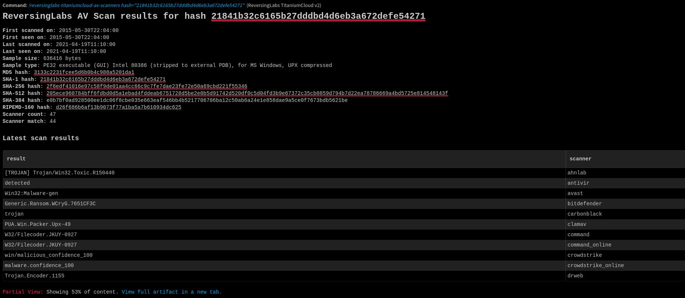
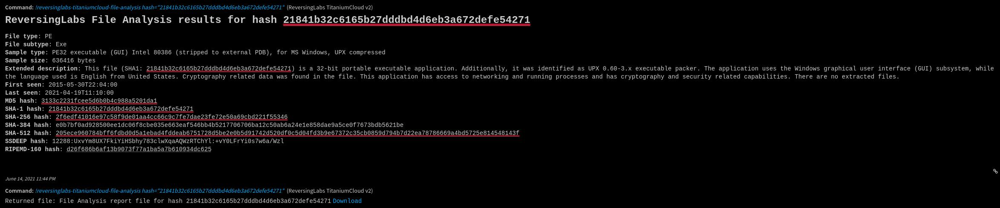
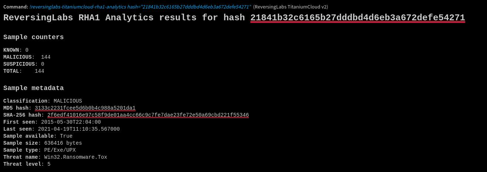
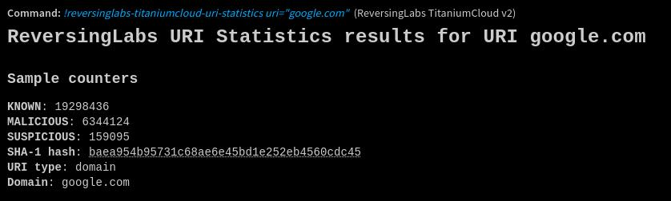
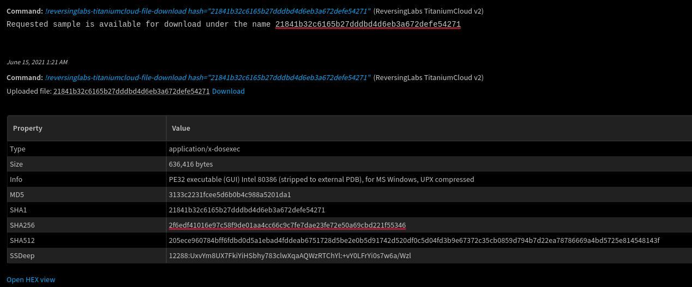
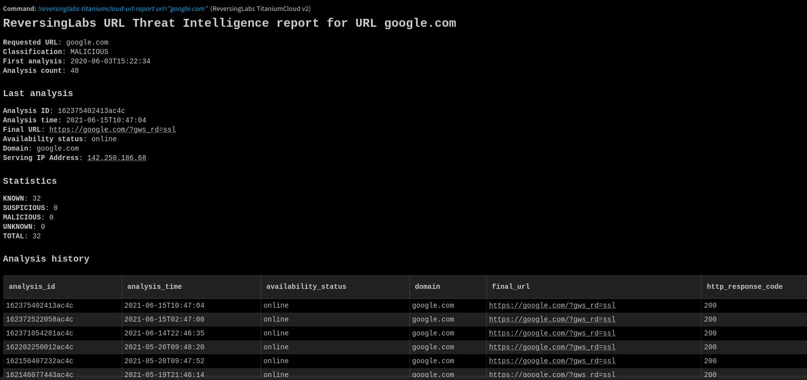
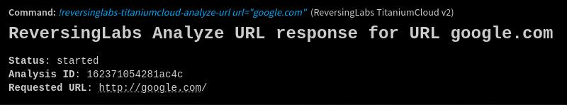
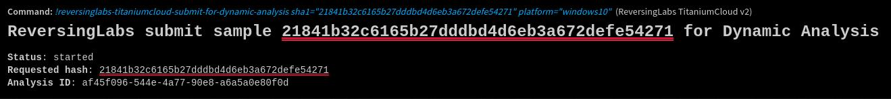

## Overview

ReversingLabs TitaniumCloud is a threat intelligence solution providing up-to-date file reputation services, threat classification and rich context on over 10 billion goodware and malware files. A powerful set of REST API query and feed functions deliver targeted file and malware intelligence for threat identification, analysis, intelligence development, and threat hunting services.


This integration was integrated and tested with ReversingLabs TitaniumCloud.

* * *

## Prerequisites

In order to use this integration you will need to obtain a **TitaniumCloud account** with sufficient user rights.
Depending on the command in question, this integration requires user rights on several TitaniumCloud API-s.  
See the details on required API user rights in each of the commands' section.

* * *

## Configure ReversingLabs Titanium Cloud on Cortex XSOAR

1. Visit the **Marketplace** and search for the **ReversingLabs TitaniumCloud** pack.
2. Upon finding the pack, install it.
3. Navigate to **Settings** > **Integrations** > **Servers & Services**.
4. After finding the ReversingLabs TitaniumCloud v2 integration, click **Add instance** to create and configure a new integration instance.
5. Configure the following fields:
    *   **Name**
        *   A meaningful name for your integration instance
    *   **ReversingLabs TitaniumCloud URL**
        *   The base URL of TitaniumCloud
        *   Default value is "https://data.reversinglabs.com"
    *   **Credentials**
        *   TitaniumCloud username
        *   TitaniumCloud password
    *   **Reliability**
        * Your desired reliability for this integration
6. Click **Test** to validate the configuration.
7. Click **Done** to finish configuring this instance.

* * *

## Commands

The following is a list of commands that you can execute on Cortex XSOAR either as part of an automation or in a playbook. After you successfully execute a command, a DBot message appears in the War Room with the command details.

- [reversinglabs-titaniumcloud-file-reputation](#reversinglabs-titaniumcloud-file-reputation)
- [reversinglabs-titaniumcloud-av-scanners](#reversinglabs-titaniumcloud-av-scanners)
- [reversinglabs-titaniumcloud-file-analysis](#reversinglabs-titaniumcloud-file-analysis)
- [reversinglabs-titaniumcloud-rha1-functional-similarity](#reversinglabs-titaniumcloud-rha1-functional-similarity)
- [reversinglabs-titaniumcloud-rha1-analytics](#reversinglabs-titaniumcloud-rha1-analytics)
- [reversinglabs-titaniumcloud-uri-statistics](#reversinglabs-titaniumcloud-uri-statistics)
- [reversinglabs-titaniumcloud-uri-index](#reversinglabs-titaniumcloud-uri-index)
- [reversinglabs-titaniumcloud-advanced-search](#reversinglabs-titaniumcloud-advanced-search)
- [reversinglabs-titaniumcloud-expression-search](#reversinglabs-titaniumcloud-expression-search)
- [reversinglabs-titaniumcloud-file-download](#reversinglabs-titaniumcloud-file-download)
- [reversinglabs-titaniumcloud-file-upload](#reversinglabs-titaniumcloud-file-upload)
- [reversinglabs-titaniumcloud-url-report](#reversinglabs-titaniumcloud-url-report)
- [reversinglabs-titaniumcloud-analyze-url](#reversinglabs-titaniumcloud-analyze-url)
- [reversinglabs-titaniumcloud-submit-for-dynamic-analysis](#reversinglabs-titaniumcloud-submit-for-dynamic-analysis)
- [reversinglabs-titaniumcloud-get-dynamic-analysis-results](#reversinglabs-titaniumcloud-get-dynamic-analysis-results)
- [reversinglabs-titaniumcloud-certificate-analytics](#reversinglabs-titaniumcloud-certificate-analytics)

* * *

## reversinglabs-titaniumcloud-file-reputation
Provides file reputation data for a file (malicious, suspicious, known good or unknown).   
Required API rights:
- TCA-0101

### Command Example
```!reversinglabs-titaniumcloud-file-reputation hash="21841b32c6165b27dddbd4d6eb3a672defe54271"```

### Input
| **Argument Name** | **Description** | **Required** |
| --- | --- | --- |
| hash | Desired sample hash | True | 

### Human Readable Output


### Context Output
| **Path** | **Description** |
| --- | --- |
| File.MD5 | MD5 indicator. |
| File.SHA1 | SHA-1 indicator. |
| File.SHA256 | SHA-256 indicator. |
| DBotScore | Returned DBot score. | 
| ReversingLabs.file_reputation | Full report in JSON. |

### Context Example
<details><summary>Full context:</summary>
<p>

```json
{
    "Type": 1,
    "ContentsFormat": "json",
    "Contents": {
        "file_reputation": {
            "rl": {
                "malware_presence": {
                    "status": "MALICIOUS",
                    "sha1": "21841b32c6165b27dddbd4d6eb3a672defe54271",
                    "threat_level": 5,
                    "classification": {
                        "platform": "Win32",
                        "type": "Ransomware",
                        "is_generic": false,
                        "family_name": "Tox"
                    },
                    "scanner_percent": 93.61701965332031,
                    "threat_name": "Win32.Ransomware.Tox",
                    "scanner_match": 44,
                    "last_seen": "2021-04-19T11:10:35",
                    "reason": "antivirus",
                    "scanner_count": 47,
                    "query_hash": {
                        "sha1": "21841b32c6165b27dddbd4d6eb3a672defe54271"
                    },
                    "first_seen": "2015-05-30T22:04:00",
                    "sha256": "2f6edf41016e97c58f9de01aa4cc66c9c7fe7dae23fe72e50a69cbd221f55346",
                    "trust_factor": 5,
                    "md5": "3133c2231fcee5d6b0b4c988a5201da1"
                }
            }
        }
    },
    "HumanReadable": "## ReversingLabs File Reputation for hash 21841b32c6165b27dddbd4d6eb3a672defe54271\n **Classification**: MALICIOUS\n    **Classification reason**: antivirus\n    **First seen**: 2015-05-30T22:04:00\n    **Last seen**: 2021-04-19T11:10:35\n    **AV scanner hits / total number of scanners**: 44 / 47\n    **AV scanner hit percentage**: 93.61701965332031%\n    **MD5 hash**: 3133c2231fcee5d6b0b4c988a5201da1\n    **SHA-1 hash**: 21841b32c6165b27dddbd4d6eb3a672defe54271\n    **SHA-256 hash**: 2f6edf41016e97c58f9de01aa4cc66c9c7fe7dae23fe72e50a69cbd221f55346\n        **Threat name**: Win32.Ransomware.Tox\n        **Threat level**: 5\n        ",
    "EntryContext": {
        "File(val.MD5 && val.MD5 == obj.MD5 || val.SHA1 && val.SHA1 == obj.SHA1 || val.SHA256 && val.SHA256 == obj.SHA256 || val.SHA512 && val.SHA512 == obj.SHA512 || val.CRC32 && val.CRC32 == obj.CRC32 || val.CTPH && val.CTPH == obj.CTPH || val.SSDeep && val.SSDeep == obj.SSDeep)": [
            {
                "MD5": "3133c2231fcee5d6b0b4c988a5201da1",
                "SHA1": "21841b32c6165b27dddbd4d6eb3a672defe54271",
                "SHA256": "2f6edf41016e97c58f9de01aa4cc66c9c7fe7dae23fe72e50a69cbd221f55346",
                "Malicious": {
                    "Vendor": "ReversingLabs TitaniumCloud v2",
                    "Description": "antivirus - Win32.Ransomware.Tox"
                }
            }
        ],
        "DBotScore(val.Indicator && val.Indicator == obj.Indicator && val.Vendor == obj.Vendor && val.Type == obj.Type)": [
            {
                "Indicator": "21841b32c6165b27dddbd4d6eb3a672defe54271",
                "Type": "file",
                "Vendor": "ReversingLabs TitaniumCloud v2",
                "Score": 3,
                "Reliability": "C - Fairly reliable"
            }
        ],
        "ReversingLabs": {
            "file_reputation": {
                "rl": {
                    "malware_presence": {
                        "status": "MALICIOUS",
                        "sha1": "21841b32c6165b27dddbd4d6eb3a672defe54271",
                        "threat_level": 5,
                        "classification": {
                            "platform": "Win32",
                            "type": "Ransomware",
                            "is_generic": false,
                            "family_name": "Tox"
                        },
                        "scanner_percent": 93.61701965332031,
                        "threat_name": "Win32.Ransomware.Tox",
                        "scanner_match": 44,
                        "last_seen": "2021-04-19T11:10:35",
                        "reason": "antivirus",
                        "scanner_count": 47,
                        "query_hash": {
                            "sha1": "21841b32c6165b27dddbd4d6eb3a672defe54271"
                        },
                        "first_seen": "2015-05-30T22:04:00",
                        "sha256": "2f6edf41016e97c58f9de01aa4cc66c9c7fe7dae23fe72e50a69cbd221f55346",
                        "trust_factor": 5,
                        "md5": "3133c2231fcee5d6b0b4c988a5201da1"
                    }
                }
            }
        }
    },
    "IndicatorTimeline": [],
    "IgnoreAutoExtract": false,
    "Note": false,
    "Relationships": []
}

```
</p>
</details>


* * *


## reversinglabs-titaniumcloud-av-scanners
Provides AV vendor cross-reference data for a desired sample from multiple AV scanners.  
Required API rights:
- TCA-0103

### Command Example
```!reversinglabs-titaniumcloud-av-scanners hash="21841b32c6165b27dddbd4d6eb3a672defe54271"```

### Input
| **Argument Name** | **Description** | **Required** |
| --- | --- | --- |
| hash | Desired sample hash | True | 

### Human Readable Output


### Context Output
| **Path** | **Description** |
| --- | --- |
| File.MD5 | MD5 indicator. |
| File.SHA1 | SHA-1 indicator. |
| File.SHA256 | SHA-256 indicator. |
| ReversingLabs.av_scanners | Full report in JSON. |

### Context Example
<details><summary>Full context:</summary>
<p>

```json
{
    "Type": 1,
    "ContentsFormat": "json",
    "Contents": {
        "av_scanners": {
            "rl": {
                "sample": {
                    "sha1": "21841b32c6165b27dddbd4d6eb3a672defe54271",
                    "first_seen_on": "2015-05-30T22:04:00",
                    "last_scanned_on": "2021-04-19T11:10:00",
                    "last_seen_on": "2021-04-19T11:10:00",
                    "single_scan": false,
                    "first_scanned_on": "2015-05-30T22:04:00",
                    "sample_type": "PE32 executable (GUI) Intel 80386 (stripped to external PDB), for MS Windows, UPX compressed",
                    "sample_size": 636416,
                    "xref": [
                        {
                            "scanner_match": 44,
                            "scanner_count": 47,
                            "scanners": [
                                {
                                    "timestamp": "2021-04-19T08:00:00",
                                    "version": "ahnscan-console.zip",
                                    "name": "ahnlab"
                                },
                                {
                                    "timestamp": "2021-04-19T06:10:00",
                                    "version": "vdf_fusebundle.zip",
                                    "name": "antivir"
                                },
                                {
                                    "timestamp": "2021-04-19T10:25:00",
                                    "version": "avast_stream.zip",
                                    "name": "avast"
                                },
                                {
                                    "timestamp": "2021-04-19T09:50:00",
                                    "version": "bdc.zip",
                                    "name": "bitdefender"
                                },
                                {
                                    "timestamp": "2021-04-19T11:09:00",
                                    "version": "carbonblack.exe",
                                    "name": "carbonblack"
                                },
                                {
                                    "timestamp": "2021-04-18T19:15:00",
                                    "version": "daily.cvd",
                                    "name": "clamav"
                                },
                                {
                                    "timestamp": "2021-04-19T09:20:00",
                                    "version": "antivir-v2-z-202104190807.zip",
                                    "name": "command"
                                },
                                {
                                    "timestamp": "2021-04-19T09:20:00",
                                    "version": "antivir-v2-z-202104190807.zip",
                                    "name": "command_online"
                                },
                                {
                                    "timestamp": "2021-04-19T11:09:00",
                                    "version": "crowdstrike_v1.exe",
                                    "name": "crowdstrike"
                                },
                                {
                                    "timestamp": "2021-04-19T11:09:00",
                                    "version": "crowdstrike_scan_result_lookup.exe",
                                    "name": "crowdstrike_online"
                                },
                                {
                                    "timestamp": "2021-04-19T10:15:00",
                                    "version": "drweb-500-wcl.zip",
                                    "name": "drweb"
                                },
                                {
                                    "timestamp": "2021-04-19T11:09:00",
                                    "version": "endgame.exe",
                                    "name": "endgame"
                                },
                                {
                                    "timestamp": "2021-04-19T11:09:00",
                                    "version": "ensilo.exe",
                                    "name": "ensilo"
                                },
                                {
                                    "timestamp": "2021-04-19T09:20:00",
                                    "version": "antivir.def",
                                    "name": "f_prot"
                                },
                                {
                                    "timestamp": "2021-04-19T11:09:00",
                                    "version": "ffri.exe",
                                    "name": "ffri"
                                },
                                {
                                    "timestamp": "2021-04-19T09:55:00",
                                    "version": "fireeye_pack.rar",
                                    "name": "fireeye_online"
                                },
                                {
                                    "timestamp": "2021-04-19T10:15:00",
                                    "version": "vir_high",
                                    "name": "fortinet"
                                },
                                {
                                    "timestamp": "2021-04-19T10:20:00",
                                    "version": "gd_sig.zip",
                                    "name": "gdata"
                                },
                                {
                                    "timestamp": "2021-04-19T08:20:00",
                                    "version": "t3sigs.vdb",
                                    "name": "ikarus"
                                },
                                {
                                    "timestamp": "2021-04-19T08:40:00",
                                    "version": "K7Cmdline.zip",
                                    "name": "k7computing"
                                },
                                {
                                    "timestamp": "2021-04-19T10:20:00",
                                    "version": "database.zip",
                                    "name": "kaspersky"
                                },
                                {
                                    "timestamp": "2021-04-19T10:20:00",
                                    "version": "database.zip",
                                    "name": "kaspersky_online"
                                },
                                {
                                    "timestamp": "2021-04-19T11:09:00",
                                    "version": "mbbr.exe",
                                    "name": "malwarebytes"
                                },
                                {
                                    "timestamp": "2021-04-18T14:05:00",
                                    "version": "avvdat-9958.zip",
                                    "name": "mcafee"
                                },
                                {
                                    "timestamp": "2021-04-19T09:45:00",
                                    "version": "avvwin_netware_betadat.zip",
                                    "name": "mcafee_beta"
                                },
                                {
                                    "timestamp": "2021-04-18T14:05:00",
                                    "version": "avvdat-9958.zip",
                                    "name": "mcafee_online"
                                },
                                {
                                    "timestamp": "2021-04-19T03:05:00",
                                    "version": "mfegw-cmd-scanner-windows.zip",
                                    "name": "mcafeegwedition_online"
                                },
                                {
                                    "timestamp": "2021-04-19T07:05:00",
                                    "version": "mpam-fe.exe",
                                    "name": "microsoft"
                                },
                                {
                                    "timestamp": "2021-04-19T07:05:00",
                                    "version": "mpam-fe.exe",
                                    "name": "microsoft_online"
                                },
                                {
                                    "timestamp": "2021-04-19T06:40:00",
                                    "version": "panda_pack.rar",
                                    "name": "panda"
                                },
                                {
                                    "timestamp": "2021-04-19T06:40:00",
                                    "version": "panda_pack.rar",
                                    "name": "panda_online"
                                },
                                {
                                    "timestamp": "2021-04-18T12:25:00",
                                    "version": "qhadvdef.zip",
                                    "name": "quickheal"
                                },
                                {
                                    "timestamp": "2021-04-19T09:45:00",
                                    "version": "rame.zip",
                                    "name": "rising"
                                },
                                {
                                    "timestamp": "2021-04-19T09:45:00",
                                    "version": "rame.zip",
                                    "name": "rising_online"
                                },
                                {
                                    "timestamp": "2021-04-19T11:09:00",
                                    "version": "sentinelone.exe",
                                    "name": "sentinelone"
                                },
                                {
                                    "timestamp": "2021-04-19T11:09:00",
                                    "version": "sonicwall.exe",
                                    "name": "sonicwall"
                                },
                                {
                                    "timestamp": "2021-04-19T02:25:00",
                                    "version": "ide_5.83.zip",
                                    "name": "sophos"
                                },
                                {
                                    "timestamp": "2021-04-19T02:25:00",
                                    "version": "ide_5.83.zip",
                                    "name": "sophos_online"
                                },
                                {
                                    "timestamp": "2021-04-19T11:09:00",
                                    "version": "susicli.exe",
                                    "name": "sophos_susi"
                                },
                                {
                                    "timestamp": "2021-04-19T10:00:00",
                                    "version": "CSE39VT-EN-91944-F.sbr.sgn",
                                    "name": "sunbelt"
                                },
                                {
                                    "timestamp": "2021-04-19T10:20:00",
                                    "version": "streamset.zip",
                                    "name": "symantec"
                                },
                                {
                                    "timestamp": "2021-04-19T10:10:00",
                                    "version": "symrapidreleasedefscore15-v5i32.exe",
                                    "name": "symantec_beta"
                                },
                                {
                                    "timestamp": "2021-04-19T10:20:00",
                                    "version": "streamset.zip",
                                    "name": "symantec_online"
                                },
                                {
                                    "timestamp": "2021-04-19T06:30:00",
                                    "version": "ioth1666500.zip",
                                    "name": "trendmicro"
                                },
                                {
                                    "timestamp": "2021-04-18T15:15:00",
                                    "version": "hcoth1666395.zip",
                                    "name": "trendmicro_consumer"
                                },
                                {
                                    "timestamp": "2021-04-19T09:00:00",
                                    "version": "vba32w-latest.7z",
                                    "name": "vba32"
                                },
                                {
                                    "timestamp": "2021-04-19T11:09:00",
                                    "version": "WWHS64.exe",
                                    "name": "watchguard"
                                }
                            ],
                            "scanned_on": "2021-04-19T11:10:00",
                            "results": [
                                {
                                    "scanner": "ahnlab",
                                    "result": "[TROJAN] Trojan/Win32.Toxic.R150440"
                                },
                                {
                                    "scanner": "antivir",
                                    "result": "detected"
                                },
                                {
                                    "scanner": "avast",
                                    "result": "Win32:Malware-gen"
                                },
                                {
                                    "scanner": "bitdefender",
                                    "result": "Generic.Ransom.WCryG.7651CF3C"
                                },
                                {
                                    "scanner": "carbonblack",
                                    "result": "trojan"
                                },
                                {
                                    "scanner": "clamav",
                                    "result": "PUA.Win.Packer.Upx-49"
                                },
                                {
                                    "scanner": "command",
                                    "result": "W32/Filecoder.JKUY-0927"
                                },
                                {
                                    "scanner": "command_online",
                                    "result": "W32/Filecoder.JKUY-0927"
                                },
                                {
                                    "scanner": "crowdstrike",
                                    "result": "win/malicious_confidence_100"
                                },
                                {
                                    "scanner": "crowdstrike_online",
                                    "result": "malware.confidence_100"
                                },
                                {
                                    "scanner": "drweb",
                                    "result": "Trojan.Encoder.1155"
                                },
                                {
                                    "scanner": "endgame",
                                    "result": "malicious (moderate confidence)"
                                },
                                {
                                    "scanner": "ensilo",
                                    "result": "Malicious-High"
                                },
                                {
                                    "scanner": "f_prot",
                                    "result": "W32/Filecoder.E"
                                },
                                {
                                    "scanner": "ffri",
                                    "result": "Detected"
                                },
                                {
                                    "scanner": "fireeye_online",
                                    "result": "Generic.mg.3133c2231fcee5d6"
                                },
                                {
                                    "scanner": "fortinet",
                                    "result": "W32/ToxKrypt.A!tr"
                                },
                                {
                                    "scanner": "gdata",
                                    "result": "Generic.Ransom.WCryG.7651CF3C"
                                },
                                {
                                    "scanner": "ikarus",
                                    "result": "Trojan.Win32.Filecoder"
                                },
                                {
                                    "scanner": "k7computing",
                                    "result": "Trojan (0055e3ef1)"
                                },
                                {
                                    "scanner": "kaspersky",
                                    "result": "detected"
                                },
                                {
                                    "scanner": "kaspersky_online",
                                    "result": "detected"
                                },
                                {
                                    "scanner": "malwarebytes",
                                    "result": ""
                                },
                                {
                                    "scanner": "mcafee",
                                    "result": "Ransom-Tox!11B48E409D96 (trojan)"
                                },
                                {
                                    "scanner": "mcafee_beta",
                                    "result": "Ransom-Tox!11B48E409D96 (trojan)"
                                },
                                {
                                    "scanner": "mcafee_online",
                                    "result": "Artemis!3133C2231FCE (trojan)"
                                },
                                {
                                    "scanner": "mcafeegwedition_online",
                                    "result": "BehavesLike.Win32.Dropper.jc"
                                },
                                {
                                    "scanner": "microsoft",
                                    "result": "Ransom:Win32/Tocrypt.B"
                                },
                                {
                                    "scanner": "microsoft_online",
                                    "result": "Ransom:Win32/Tocrypt.B"
                                },
                                {
                                    "scanner": "panda",
                                    "result": "Trj/Genetic.gen"
                                },
                                {
                                    "scanner": "panda_online",
                                    "result": "Trj/Genetic.gen"
                                },
                                {
                                    "scanner": "quickheal",
                                    "result": ""
                                },
                                {
                                    "scanner": "rising",
                                    "result": "Ransom.Tocrypt!8.53B6"
                                },
                                {
                                    "scanner": "rising_online",
                                    "result": "Ransom.Tocrypt!8.53B6"
                                },
                                {
                                    "scanner": "sentinelone",
                                    "result": "DFI - Suspicious PE"
                                },
                                {
                                    "scanner": "sonicwall",
                                    "result": ""
                                },
                                {
                                    "scanner": "sophos",
                                    "result": "Troj/ToxKrypt-A"
                                },
                                {
                                    "scanner": "sophos_online",
                                    "result": "Troj/ToxKrypt-A"
                                },
                                {
                                    "scanner": "sophos_susi",
                                    "result": "Troj/ToxKrypt-A"
                                },
                                {
                                    "scanner": "sunbelt",
                                    "result": "Trojan.Win32.Generic!BT"
                                },
                                {
                                    "scanner": "symantec",
                                    "result": "Trojan.Gen.2"
                                },
                                {
                                    "scanner": "symantec_beta",
                                    "result": "Trojan.Gen.2"
                                },
                                {
                                    "scanner": "symantec_online",
                                    "result": "Trojan.Gen.2"
                                },
                                {
                                    "scanner": "trendmicro",
                                    "result": "TROJ_CRYPTOX.T"
                                },
                                {
                                    "scanner": "trendmicro_consumer",
                                    "result": "TROJ_CRYPTOX.T"
                                },
                                {
                                    "scanner": "vba32",
                                    "result": "SScope.Malware-Cryptor.Toxic"
                                },
                                {
                                    "scanner": "watchguard",
                                    "result": "AboveThreshold563.008318"
                                }
                            ]
                        }
                    ],
                    "sha384": "e0b7bf0ad928500ee1dc06f8cbe035e663eaf546bb4b5217706706ba12c50ab6a24e1e858dae9a5ce0f7673bdb5621be",
                    "sha256": "2f6edf41016e97c58f9de01aa4cc66c9c7fe7dae23fe72e50a69cbd221f55346",
                    "sha512": "205ece960784bff6fdbd0d5a1ebad4fddeab6751728d5be2e0b5d91742d520df0c5d04fd3b9e67372c35cb0859d794b7d22ea78786669a4bd5725e814548143f",
                    "ripemd160": "d26f686b6af13b9073f77a1ba5a7b610934dc625",
                    "md5": "3133c2231fcee5d6b0b4c988a5201da1"
                }
            }
        }
    },
    "HumanReadable": "## ReversingLabs AV Scan results for hash 21841b32c6165b27dddbd4d6eb3a672defe54271\n **First scanned on**: 2015-05-30T22:04:00\n    **First seen on**: 2015-05-30T22:04:00\n    **Last scanned on**: 2021-04-19T11:10:00\n    **Last seen on**: 2021-04-19T11:10:00\n    **Sample size**: 636416 bytes\n    **Sample type**: PE32 executable (GUI) Intel 80386 (stripped to external PDB), for MS Windows, UPX compressed\n    **MD5 hash**: 3133c2231fcee5d6b0b4c988a5201da1\n    **SHA-1 hash**: 21841b32c6165b27dddbd4d6eb3a672defe54271\n    **SHA-256 hash**: 2f6edf41016e97c58f9de01aa4cc66c9c7fe7dae23fe72e50a69cbd221f55346\n    **SHA-512 hash**: 205ece960784bff6fdbd0d5a1ebad4fddeab6751728d5be2e0b5d91742d520df0c5d04fd3b9e67372c35cb0859d794b7d22ea78786669a4bd5725e814548143f\n    **SHA-384 hash**: e0b7bf0ad928500ee1dc06f8cbe035e663eaf546bb4b5217706706ba12c50ab6a24e1e858dae9a5ce0f7673bdb5621be\n    **RIPEMD-160 hash**: d26f686b6af13b9073f77a1ba5a7b610934dc625\n    **Scanner count**: 47\n    **Scanner match**: 44\n    \n ### Latest scan results\n|result|scanner|\n|---|---|\n| [TROJAN] Trojan/Win32.Toxic.R150440 | ahnlab |\n| detected | antivir |\n| Win32:Malware-gen | avast |\n| Generic.Ransom.WCryG.7651CF3C | bitdefender |\n| trojan | carbonblack |\n| PUA.Win.Packer.Upx-49 | clamav |\n| W32/Filecoder.JKUY-0927 | command |\n| W32/Filecoder.JKUY-0927 | command_online |\n| win/malicious_confidence_100 | crowdstrike |\n| malware.confidence_100 | crowdstrike_online |\n| Trojan.Encoder.1155 | drweb |\n| malicious (moderate confidence) | endgame |\n| Malicious-High | ensilo |\n| W32/Filecoder.E | f_prot |\n| Detected | ffri |\n| Generic.mg.3133c2231fcee5d6 | fireeye_online |\n| W32/ToxKrypt.A!tr | fortinet |\n| Generic.Ransom.WCryG.7651CF3C | gdata |\n| Trojan.Win32.Filecoder | ikarus |\n| Trojan (0055e3ef1) | k7computing |\n| detected | kaspersky |\n| detected | kaspersky_online |\n|  | malwarebytes |\n| Ransom-Tox!11B48E409D96 (trojan) | mcafee |\n| Ransom-Tox!11B48E409D96 (trojan) | mcafee_beta |\n| Artemis!3133C2231FCE (trojan) | mcafee_online |\n| BehavesLike.Win32.Dropper.jc | mcafeegwedition_online |\n| Ransom:Win32/Tocrypt.B | microsoft |\n| Ransom:Win32/Tocrypt.B | microsoft_online |\n| Trj/Genetic.gen | panda |\n| Trj/Genetic.gen | panda_online |\n|  | quickheal |\n| Ransom.Tocrypt!8.53B6 | rising |\n| Ransom.Tocrypt!8.53B6 | rising_online |\n| DFI - Suspicious PE | sentinelone |\n|  | sonicwall |\n| Troj/ToxKrypt-A | sophos |\n| Troj/ToxKrypt-A | sophos_online |\n| Troj/ToxKrypt-A | sophos_susi |\n| Trojan.Win32.Generic!BT | sunbelt |\n| Trojan.Gen.2 | symantec |\n| Trojan.Gen.2 | symantec_beta |\n| Trojan.Gen.2 | symantec_online |\n| TROJ_CRYPTOX.T | trendmicro |\n| TROJ_CRYPTOX.T | trendmicro_consumer |\n| SScope.Malware-Cryptor.Toxic | vba32 |\n| AboveThreshold563.008318 | watchguard |\n",
    "EntryContext": {
        "File(val.MD5 && val.MD5 == obj.MD5 || val.SHA1 && val.SHA1 == obj.SHA1 || val.SHA256 && val.SHA256 == obj.SHA256 || val.SHA512 && val.SHA512 == obj.SHA512 || val.CRC32 && val.CRC32 == obj.CRC32 || val.CTPH && val.CTPH == obj.CTPH || val.SSDeep && val.SSDeep == obj.SSDeep)": [
            {
                "MD5": "3133c2231fcee5d6b0b4c988a5201da1",
                "SHA1": "21841b32c6165b27dddbd4d6eb3a672defe54271",
                "SHA256": "2f6edf41016e97c58f9de01aa4cc66c9c7fe7dae23fe72e50a69cbd221f55346"
            }
        ],
        "ReversingLabs": {
            "av_scanners": {
                "rl": {
                    "sample": {
                        "sha1": "21841b32c6165b27dddbd4d6eb3a672defe54271",
                        "first_seen_on": "2015-05-30T22:04:00",
                        "last_scanned_on": "2021-04-19T11:10:00",
                        "last_seen_on": "2021-04-19T11:10:00",
                        "single_scan": false,
                        "first_scanned_on": "2015-05-30T22:04:00",
                        "sample_type": "PE32 executable (GUI) Intel 80386 (stripped to external PDB), for MS Windows, UPX compressed",
                        "sample_size": 636416,
                        "xref": [
                            {
                                "scanner_match": 44,
                                "scanner_count": 47,
                                "scanners": [
                                    {
                                        "timestamp": "2021-04-19T08:00:00",
                                        "version": "ahnscan-console.zip",
                                        "name": "ahnlab"
                                    },
                                    {
                                        "timestamp": "2021-04-19T06:10:00",
                                        "version": "vdf_fusebundle.zip",
                                        "name": "antivir"
                                    },
                                    {
                                        "timestamp": "2021-04-19T10:25:00",
                                        "version": "avast_stream.zip",
                                        "name": "avast"
                                    },
                                    {
                                        "timestamp": "2021-04-19T09:50:00",
                                        "version": "bdc.zip",
                                        "name": "bitdefender"
                                    },
                                    {
                                        "timestamp": "2021-04-19T11:09:00",
                                        "version": "carbonblack.exe",
                                        "name": "carbonblack"
                                    },
                                    {
                                        "timestamp": "2021-04-18T19:15:00",
                                        "version": "daily.cvd",
                                        "name": "clamav"
                                    },
                                    {
                                        "timestamp": "2021-04-19T09:20:00",
                                        "version": "antivir-v2-z-202104190807.zip",
                                        "name": "command"
                                    },
                                    {
                                        "timestamp": "2021-04-19T09:20:00",
                                        "version": "antivir-v2-z-202104190807.zip",
                                        "name": "command_online"
                                    },
                                    {
                                        "timestamp": "2021-04-19T11:09:00",
                                        "version": "crowdstrike_v1.exe",
                                        "name": "crowdstrike"
                                    },
                                    {
                                        "timestamp": "2021-04-19T11:09:00",
                                        "version": "crowdstrike_scan_result_lookup.exe",
                                        "name": "crowdstrike_online"
                                    },
                                    {
                                        "timestamp": "2021-04-19T10:15:00",
                                        "version": "drweb-500-wcl.zip",
                                        "name": "drweb"
                                    },
                                    {
                                        "timestamp": "2021-04-19T11:09:00",
                                        "version": "endgame.exe",
                                        "name": "endgame"
                                    },
                                    {
                                        "timestamp": "2021-04-19T11:09:00",
                                        "version": "ensilo.exe",
                                        "name": "ensilo"
                                    },
                                    {
                                        "timestamp": "2021-04-19T09:20:00",
                                        "version": "antivir.def",
                                        "name": "f_prot"
                                    },
                                    {
                                        "timestamp": "2021-04-19T11:09:00",
                                        "version": "ffri.exe",
                                        "name": "ffri"
                                    },
                                    {
                                        "timestamp": "2021-04-19T09:55:00",
                                        "version": "fireeye_pack.rar",
                                        "name": "fireeye_online"
                                    },
                                    {
                                        "timestamp": "2021-04-19T10:15:00",
                                        "version": "vir_high",
                                        "name": "fortinet"
                                    },
                                    {
                                        "timestamp": "2021-04-19T10:20:00",
                                        "version": "gd_sig.zip",
                                        "name": "gdata"
                                    },
                                    {
                                        "timestamp": "2021-04-19T08:20:00",
                                        "version": "t3sigs.vdb",
                                        "name": "ikarus"
                                    },
                                    {
                                        "timestamp": "2021-04-19T08:40:00",
                                        "version": "K7Cmdline.zip",
                                        "name": "k7computing"
                                    },
                                    {
                                        "timestamp": "2021-04-19T10:20:00",
                                        "version": "database.zip",
                                        "name": "kaspersky"
                                    },
                                    {
                                        "timestamp": "2021-04-19T10:20:00",
                                        "version": "database.zip",
                                        "name": "kaspersky_online"
                                    },
                                    {
                                        "timestamp": "2021-04-19T11:09:00",
                                        "version": "mbbr.exe",
                                        "name": "malwarebytes"
                                    },
                                    {
                                        "timestamp": "2021-04-18T14:05:00",
                                        "version": "avvdat-9958.zip",
                                        "name": "mcafee"
                                    },
                                    {
                                        "timestamp": "2021-04-19T09:45:00",
                                        "version": "avvwin_netware_betadat.zip",
                                        "name": "mcafee_beta"
                                    },
                                    {
                                        "timestamp": "2021-04-18T14:05:00",
                                        "version": "avvdat-9958.zip",
                                        "name": "mcafee_online"
                                    },
                                    {
                                        "timestamp": "2021-04-19T03:05:00",
                                        "version": "mfegw-cmd-scanner-windows.zip",
                                        "name": "mcafeegwedition_online"
                                    },
                                    {
                                        "timestamp": "2021-04-19T07:05:00",
                                        "version": "mpam-fe.exe",
                                        "name": "microsoft"
                                    },
                                    {
                                        "timestamp": "2021-04-19T07:05:00",
                                        "version": "mpam-fe.exe",
                                        "name": "microsoft_online"
                                    },
                                    {
                                        "timestamp": "2021-04-19T06:40:00",
                                        "version": "panda_pack.rar",
                                        "name": "panda"
                                    },
                                    {
                                        "timestamp": "2021-04-19T06:40:00",
                                        "version": "panda_pack.rar",
                                        "name": "panda_online"
                                    },
                                    {
                                        "timestamp": "2021-04-18T12:25:00",
                                        "version": "qhadvdef.zip",
                                        "name": "quickheal"
                                    },
                                    {
                                        "timestamp": "2021-04-19T09:45:00",
                                        "version": "rame.zip",
                                        "name": "rising"
                                    },
                                    {
                                        "timestamp": "2021-04-19T09:45:00",
                                        "version": "rame.zip",
                                        "name": "rising_online"
                                    },
                                    {
                                        "timestamp": "2021-04-19T11:09:00",
                                        "version": "sentinelone.exe",
                                        "name": "sentinelone"
                                    },
                                    {
                                        "timestamp": "2021-04-19T11:09:00",
                                        "version": "sonicwall.exe",
                                        "name": "sonicwall"
                                    },
                                    {
                                        "timestamp": "2021-04-19T02:25:00",
                                        "version": "ide_5.83.zip",
                                        "name": "sophos"
                                    },
                                    {
                                        "timestamp": "2021-04-19T02:25:00",
                                        "version": "ide_5.83.zip",
                                        "name": "sophos_online"
                                    },
                                    {
                                        "timestamp": "2021-04-19T11:09:00",
                                        "version": "susicli.exe",
                                        "name": "sophos_susi"
                                    },
                                    {
                                        "timestamp": "2021-04-19T10:00:00",
                                        "version": "CSE39VT-EN-91944-F.sbr.sgn",
                                        "name": "sunbelt"
                                    },
                                    {
                                        "timestamp": "2021-04-19T10:20:00",
                                        "version": "streamset.zip",
                                        "name": "symantec"
                                    },
                                    {
                                        "timestamp": "2021-04-19T10:10:00",
                                        "version": "symrapidreleasedefscore15-v5i32.exe",
                                        "name": "symantec_beta"
                                    },
                                    {
                                        "timestamp": "2021-04-19T10:20:00",
                                        "version": "streamset.zip",
                                        "name": "symantec_online"
                                    },
                                    {
                                        "timestamp": "2021-04-19T06:30:00",
                                        "version": "ioth1666500.zip",
                                        "name": "trendmicro"
                                    },
                                    {
                                        "timestamp": "2021-04-18T15:15:00",
                                        "version": "hcoth1666395.zip",
                                        "name": "trendmicro_consumer"
                                    },
                                    {
                                        "timestamp": "2021-04-19T09:00:00",
                                        "version": "vba32w-latest.7z",
                                        "name": "vba32"
                                    },
                                    {
                                        "timestamp": "2021-04-19T11:09:00",
                                        "version": "WWHS64.exe",
                                        "name": "watchguard"
                                    }
                                ],
                                "scanned_on": "2021-04-19T11:10:00",
                                "results": [
                                    {
                                        "scanner": "ahnlab",
                                        "result": "[TROJAN] Trojan/Win32.Toxic.R150440"
                                    },
                                    {
                                        "scanner": "antivir",
                                        "result": "detected"
                                    },
                                    {
                                        "scanner": "avast",
                                        "result": "Win32:Malware-gen"
                                    },
                                    {
                                        "scanner": "bitdefender",
                                        "result": "Generic.Ransom.WCryG.7651CF3C"
                                    },
                                    {
                                        "scanner": "carbonblack",
                                        "result": "trojan"
                                    },
                                    {
                                        "scanner": "clamav",
                                        "result": "PUA.Win.Packer.Upx-49"
                                    },
                                    {
                                        "scanner": "command",
                                        "result": "W32/Filecoder.JKUY-0927"
                                    },
                                    {
                                        "scanner": "command_online",
                                        "result": "W32/Filecoder.JKUY-0927"
                                    },
                                    {
                                        "scanner": "crowdstrike",
                                        "result": "win/malicious_confidence_100"
                                    },
                                    {
                                        "scanner": "crowdstrike_online",
                                        "result": "malware.confidence_100"
                                    },
                                    {
                                        "scanner": "drweb",
                                        "result": "Trojan.Encoder.1155"
                                    },
                                    {
                                        "scanner": "endgame",
                                        "result": "malicious (moderate confidence)"
                                    },
                                    {
                                        "scanner": "ensilo",
                                        "result": "Malicious-High"
                                    },
                                    {
                                        "scanner": "f_prot",
                                        "result": "W32/Filecoder.E"
                                    },
                                    {
                                        "scanner": "ffri",
                                        "result": "Detected"
                                    },
                                    {
                                        "scanner": "fireeye_online",
                                        "result": "Generic.mg.3133c2231fcee5d6"
                                    },
                                    {
                                        "scanner": "fortinet",
                                        "result": "W32/ToxKrypt.A!tr"
                                    },
                                    {
                                        "scanner": "gdata",
                                        "result": "Generic.Ransom.WCryG.7651CF3C"
                                    },
                                    {
                                        "scanner": "ikarus",
                                        "result": "Trojan.Win32.Filecoder"
                                    },
                                    {
                                        "scanner": "k7computing",
                                        "result": "Trojan (0055e3ef1)"
                                    },
                                    {
                                        "scanner": "kaspersky",
                                        "result": "detected"
                                    },
                                    {
                                        "scanner": "kaspersky_online",
                                        "result": "detected"
                                    },
                                    {
                                        "scanner": "malwarebytes",
                                        "result": ""
                                    },
                                    {
                                        "scanner": "mcafee",
                                        "result": "Ransom-Tox!11B48E409D96 (trojan)"
                                    },
                                    {
                                        "scanner": "mcafee_beta",
                                        "result": "Ransom-Tox!11B48E409D96 (trojan)"
                                    },
                                    {
                                        "scanner": "mcafee_online",
                                        "result": "Artemis!3133C2231FCE (trojan)"
                                    },
                                    {
                                        "scanner": "mcafeegwedition_online",
                                        "result": "BehavesLike.Win32.Dropper.jc"
                                    },
                                    {
                                        "scanner": "microsoft",
                                        "result": "Ransom:Win32/Tocrypt.B"
                                    },
                                    {
                                        "scanner": "microsoft_online",
                                        "result": "Ransom:Win32/Tocrypt.B"
                                    },
                                    {
                                        "scanner": "panda",
                                        "result": "Trj/Genetic.gen"
                                    },
                                    {
                                        "scanner": "panda_online",
                                        "result": "Trj/Genetic.gen"
                                    },
                                    {
                                        "scanner": "quickheal",
                                        "result": ""
                                    },
                                    {
                                        "scanner": "rising",
                                        "result": "Ransom.Tocrypt!8.53B6"
                                    },
                                    {
                                        "scanner": "rising_online",
                                        "result": "Ransom.Tocrypt!8.53B6"
                                    },
                                    {
                                        "scanner": "sentinelone",
                                        "result": "DFI - Suspicious PE"
                                    },
                                    {
                                        "scanner": "sonicwall",
                                        "result": ""
                                    },
                                    {
                                        "scanner": "sophos",
                                        "result": "Troj/ToxKrypt-A"
                                    },
                                    {
                                        "scanner": "sophos_online",
                                        "result": "Troj/ToxKrypt-A"
                                    },
                                    {
                                        "scanner": "sophos_susi",
                                        "result": "Troj/ToxKrypt-A"
                                    },
                                    {
                                        "scanner": "sunbelt",
                                        "result": "Trojan.Win32.Generic!BT"
                                    },
                                    {
                                        "scanner": "symantec",
                                        "result": "Trojan.Gen.2"
                                    },
                                    {
                                        "scanner": "symantec_beta",
                                        "result": "Trojan.Gen.2"
                                    },
                                    {
                                        "scanner": "symantec_online",
                                        "result": "Trojan.Gen.2"
                                    },
                                    {
                                        "scanner": "trendmicro",
                                        "result": "TROJ_CRYPTOX.T"
                                    },
                                    {
                                        "scanner": "trendmicro_consumer",
                                        "result": "TROJ_CRYPTOX.T"
                                    },
                                    {
                                        "scanner": "vba32",
                                        "result": "SScope.Malware-Cryptor.Toxic"
                                    },
                                    {
                                        "scanner": "watchguard",
                                        "result": "AboveThreshold563.008318"
                                    }
                                ]
                            }
                        ],
                        "sha384": "e0b7bf0ad928500ee1dc06f8cbe035e663eaf546bb4b5217706706ba12c50ab6a24e1e858dae9a5ce0f7673bdb5621be",
                        "sha256": "2f6edf41016e97c58f9de01aa4cc66c9c7fe7dae23fe72e50a69cbd221f55346",
                        "sha512": "205ece960784bff6fdbd0d5a1ebad4fddeab6751728d5be2e0b5d91742d520df0c5d04fd3b9e67372c35cb0859d794b7d22ea78786669a4bd5725e814548143f",
                        "ripemd160": "d26f686b6af13b9073f77a1ba5a7b610934dc625",
                        "md5": "3133c2231fcee5d6b0b4c988a5201da1"
                    }
                }
            }
        }
    },
    "IndicatorTimeline": [],
    "IgnoreAutoExtract": false,
    "Note": false,
    "Relationships": []
}
```
</p>
</details>

* * *


## reversinglabs-titaniumcloud-file-analysis
Provides file analysis data on hashes. Metadata can include relevant portions of static analysis, AV scan information, file sources and any related IP/domain information.  
Required API rights:
- TCA-0104

### Command Example
```!reversinglabs-titaniumcloud-file-analysis hash="21841b32c6165b27dddbd4d6eb3a672defe54271"```

### Input
| **Argument Name** | **Description** | **Required** |
| --- | --- | --- |
| hash | Desired sample hash. | True |

### Human Readable Output


### Context Output
| **Path** | **Description** |
| --- | --- |
| File.MD5 | MD5 indicator. |
| File.SHA1 | SHA-1 indicator. |
| File.SHA256 | SHA-256 indicator. |
| ReversingLabs.file_analysis | Full report in JSON. |

* * *


## reversinglabs-titaniumcloud-rha1-functional-similarity
Provides a list of SHA1 hashes of files that are functionally similar to the provided file (SHA1 hash) at the selected precision level.  
Required API rights:
- TCA-0301
- TCA-0104

### Command Example
```!reversinglabs-titaniumcloud-rha1-functional-similarity hash="21841b32c6165b27dddbd4d6eb3a672defe54271" result-limit="20"```

### Input
| **Argument Name** | **Description** | **Required** |
| --- | --- | --- |
| hash | Desired sample hash. | True | 
| result-limit | Maximum number of results. | False | 

### Human Readable Output
A downloadable file containing the complete analysis report JSON is returned.

### Context Output
| **Path** | **Description** |
| --- | --- |
| ReversingLabs.functional_similarity | Full report in JSON. |

### Context Example
<details><summary>Full context:</summary>
<p>

```json
{
    "Type": 1,
    "ContentsFormat": "json",
    "Contents": {
        "functional_similarity": [
            {
                "sha1": "03823b9fab3931d7c634fd3c2d40a89555c783af",
                "sha256": "5cf1f17aef32603d3ec7c9af88c23122dd259b4303b7b8282a0e204cb4d1f1a4",
                "md5": "0e3e231c255a5eefefd20d70c247d5f0",
                "classification": "MALICIOUS",
                "sample_type": "PE/Exe/UPX",
                "sample_size": 636416,
                "sample_available": true,
                "trust_factor": 5,
                "threat_level": 5,
                "threat_name": "Win32.Ransomware.Tox",
                "malware_family": "Tox",
                "malware_type": "Ransomware",
                "platform": "Win32",
                "first_seen": "2015-06-01T19:11:00.592000",
                "last_seen": "2021-01-29T18:39:28.242000"
            },
            {
                "sha1": "0649cbb97387cb2ff5d1ed2f5c238b0914a2b63a",
                "sha256": "354371ec3b0b2bc03e567dbef57e9211e700381f3f39fe3604fc26abfd16a641",
                "md5": "f4fa4d7c774eaba895ed005f3c84a8b3",
                "classification": "MALICIOUS",
                "sample_type": "PE/Exe/UPX",
                "sample_size": 636416,
                "sample_available": true,
                "trust_factor": 5,
                "threat_level": 5,
                "threat_name": "Win32.Ransomware.Tox",
                "malware_family": "Tox",
                "malware_type": "Ransomware",
                "platform": "Win32",
                "first_seen": "2015-05-29T00:18:00",
                "last_seen": "2021-02-10T11:42:49.119000"
            },
            {
                "sha1": "08a5ac2463fc46215eb4ed42c3419cb84c73388f",
                "sha256": "ee287840992ab3f066fe35c09201f5f43fe7939125b7e3712e0213888d9a40f1",
                "md5": "048f19d79c953e523675e96fb6e417a9",
                "classification": "MALICIOUS",
                "sample_type": "PE/Exe/UPX",
                "sample_size": 636416,
                "sample_available": true,
                "trust_factor": 5,
                "threat_level": 5,
                "threat_name": "Win32.Ransomware.Tox",
                "malware_family": "Tox",
                "malware_type": "Ransomware",
                "platform": "Win32",
                "first_seen": "2015-05-30T22:11:00",
                "last_seen": "2021-01-05T10:14:41.627000"
            },
            {
                "sha1": "0c140fc266225c7070ed3f4f5175318bb86066ea",
                "sha256": "8944406a0d048ef717a93146495b96765eecd73a890caf0167a696dc0f3ea8c6",
                "md5": "c86dc1d0378cc0b579a11d873ac944e7",
                "classification": "MALICIOUS",
                "sample_type": "PE/Exe/UPX",
                "sample_size": 636416,
                "sample_available": true,
                "trust_factor": 5,
                "threat_level": 5,
                "threat_name": "Win32.Ransomware.Tox",
                "malware_family": "Tox",
                "malware_type": "Ransomware",
                "platform": "Win32",
                "first_seen": "2015-05-28T22:36:00",
                "last_seen": "2021-01-09T17:04:08.569000"
            },
            {
                "sha1": "0e70790d92a346a9688e7eeb2af5c73d3a8cb4b0",
                "sha256": "2b49ff2e6ee9be2898c5129caabb104ea9cac2b171a3e28d6bddbf217822abd7",
                "md5": "e0f7e6b96ca72b9755965b9dac3ce77e",
                "classification": "MALICIOUS",
                "sample_type": "PE/Exe/UPX",
                "sample_size": 636416,
                "sample_available": true,
                "trust_factor": 5,
                "threat_level": 5,
                "threat_name": "Win32.Ransomware.Tox",
                "malware_family": "Tox",
                "malware_type": "Ransomware",
                "platform": "Win32",
                "first_seen": "2015-06-01T03:29:00",
                "last_seen": "2021-01-07T17:28:09.099000"
            },
            {
                "sha1": "13d3b430b2f23b4b82e49c8b6716e370710091a4",
                "sha256": "e8b2b98ed418bec8abe0c84a57c8b1d123028dfc7b160e15600126f4913f3f31",
                "md5": "3a19c91c1c0baa7dd4a9def2e0b7c3e9",
                "classification": "MALICIOUS",
                "sample_type": "PE/Exe/UPX",
                "sample_size": 636416,
                "sample_available": true,
                "trust_factor": 5,
                "threat_level": 5,
                "threat_name": "Win32.Ransomware.Tox",
                "malware_family": "Tox",
                "malware_type": "Ransomware",
                "platform": "Win32",
                "first_seen": "2015-05-31T13:04:25",
                "last_seen": "2021-01-13T23:40:33.109000"
            },
            {
                "sha1": "1484c2a52361b7b7ace7894376079fc8214e1a58",
                "sha256": "1ebda0b74060cfb6a0fad47350e050038537d25a13461d91b39fc4b1ab60fc6a",
                "md5": "fb7fd5623fa6b7791a221fad463223cd",
                "classification": "MALICIOUS",
                "sample_type": "PE/Exe/UPX",
                "sample_size": 636928,
                "sample_available": true,
                "trust_factor": 5,
                "threat_level": 5,
                "threat_name": "Win32.Ransomware.Tox",
                "malware_family": "Tox",
                "malware_type": "Ransomware",
                "platform": "Win32",
                "first_seen": "2015-06-01T10:20:00",
                "last_seen": "2021-05-21T04:50:24.774000"
            },
            {
                "sha1": "15af07937afe2d9f446277e31fe54338481a18cb",
                "sha256": "1666eb5ad3ebe3255f9cead2406596424dae3efb8c847a1282cea6286df8ac41",
                "md5": "02ecfb44b9b11b846ea8233d524ecda3",
                "classification": "MALICIOUS",
                "sample_type": "PE/Exe/UPX",
                "sample_size": 636416,
                "sample_available": true,
                "trust_factor": 5,
                "threat_level": 5,
                "threat_name": "Win32.Ransomware.Tox",
                "malware_family": "Tox",
                "malware_type": "Ransomware",
                "platform": "Win32",
                "first_seen": "2015-05-31T12:07:00",
                "last_seen": "2021-06-04T05:18:53.278000"
            },
            {
                "sha1": "15dff42a01882d206f47151256a17d23bd4b55a7",
                "sha256": "bbf39b57544aba61d299f02af37983e5db4ec90136bd7b68da90c6bdbcc2aadd",
                "md5": "51cad5d45cdbc2940a66d044d5a8dabf",
                "classification": "MALICIOUS",
                "sample_type": "PE/Exe/UPX",
                "sample_size": 636416,
                "sample_available": true,
                "trust_factor": 5,
                "threat_level": 5,
                "threat_name": "Win32.Ransomware.Tox",
                "malware_family": "Tox",
                "malware_type": "Ransomware",
                "platform": "Win32",
                "first_seen": "2015-05-28T15:37:00",
                "last_seen": "2021-01-09T07:43:01.107000"
            },
            {
                "sha1": "16051218d2f6f9044307f5c69509617a1b44c558",
                "sha256": "880e766543cff1f25761536a88c6936e14c56c848a472b4e259021bfb42a276f",
                "md5": "eb34ab7e444268e0ecf2e80c2306733f",
                "classification": "MALICIOUS",
                "sample_type": "PE/Exe/UPX",
                "sample_size": 636416,
                "sample_available": true,
                "trust_factor": 5,
                "threat_level": 5,
                "threat_name": "Win32.Ransomware.Tox",
                "malware_family": "Tox",
                "malware_type": "Ransomware",
                "platform": "Win32",
                "first_seen": "2015-06-06T09:47:00",
                "last_seen": "2021-05-27T03:09:27.530000"
            }
        ]
    },
    "HumanReadable": "Full report is returned in a downloadable file",
    "EntryContext": {
        "ReversingLabs": {
            "functional_similarity": [
                {
                    "sha1": "03823b9fab3931d7c634fd3c2d40a89555c783af",
                    "sha256": "5cf1f17aef32603d3ec7c9af88c23122dd259b4303b7b8282a0e204cb4d1f1a4",
                    "md5": "0e3e231c255a5eefefd20d70c247d5f0",
                    "classification": "MALICIOUS",
                    "sample_type": "PE/Exe/UPX",
                    "sample_size": 636416,
                    "sample_available": true,
                    "trust_factor": 5,
                    "threat_level": 5,
                    "threat_name": "Win32.Ransomware.Tox",
                    "malware_family": "Tox",
                    "malware_type": "Ransomware",
                    "platform": "Win32",
                    "first_seen": "2015-06-01T19:11:00.592000",
                    "last_seen": "2021-01-29T18:39:28.242000"
                },
                {
                    "sha1": "0649cbb97387cb2ff5d1ed2f5c238b0914a2b63a",
                    "sha256": "354371ec3b0b2bc03e567dbef57e9211e700381f3f39fe3604fc26abfd16a641",
                    "md5": "f4fa4d7c774eaba895ed005f3c84a8b3",
                    "classification": "MALICIOUS",
                    "sample_type": "PE/Exe/UPX",
                    "sample_size": 636416,
                    "sample_available": true,
                    "trust_factor": 5,
                    "threat_level": 5,
                    "threat_name": "Win32.Ransomware.Tox",
                    "malware_family": "Tox",
                    "malware_type": "Ransomware",
                    "platform": "Win32",
                    "first_seen": "2015-05-29T00:18:00",
                    "last_seen": "2021-02-10T11:42:49.119000"
                },
                {
                    "sha1": "08a5ac2463fc46215eb4ed42c3419cb84c73388f",
                    "sha256": "ee287840992ab3f066fe35c09201f5f43fe7939125b7e3712e0213888d9a40f1",
                    "md5": "048f19d79c953e523675e96fb6e417a9",
                    "classification": "MALICIOUS",
                    "sample_type": "PE/Exe/UPX",
                    "sample_size": 636416,
                    "sample_available": true,
                    "trust_factor": 5,
                    "threat_level": 5,
                    "threat_name": "Win32.Ransomware.Tox",
                    "malware_family": "Tox",
                    "malware_type": "Ransomware",
                    "platform": "Win32",
                    "first_seen": "2015-05-30T22:11:00",
                    "last_seen": "2021-01-05T10:14:41.627000"
                },
                {
                    "sha1": "0c140fc266225c7070ed3f4f5175318bb86066ea",
                    "sha256": "8944406a0d048ef717a93146495b96765eecd73a890caf0167a696dc0f3ea8c6",
                    "md5": "c86dc1d0378cc0b579a11d873ac944e7",
                    "classification": "MALICIOUS",
                    "sample_type": "PE/Exe/UPX",
                    "sample_size": 636416,
                    "sample_available": true,
                    "trust_factor": 5,
                    "threat_level": 5,
                    "threat_name": "Win32.Ransomware.Tox",
                    "malware_family": "Tox",
                    "malware_type": "Ransomware",
                    "platform": "Win32",
                    "first_seen": "2015-05-28T22:36:00",
                    "last_seen": "2021-01-09T17:04:08.569000"
                },
                {
                    "sha1": "0e70790d92a346a9688e7eeb2af5c73d3a8cb4b0",
                    "sha256": "2b49ff2e6ee9be2898c5129caabb104ea9cac2b171a3e28d6bddbf217822abd7",
                    "md5": "e0f7e6b96ca72b9755965b9dac3ce77e",
                    "classification": "MALICIOUS",
                    "sample_type": "PE/Exe/UPX",
                    "sample_size": 636416,
                    "sample_available": true,
                    "trust_factor": 5,
                    "threat_level": 5,
                    "threat_name": "Win32.Ransomware.Tox",
                    "malware_family": "Tox",
                    "malware_type": "Ransomware",
                    "platform": "Win32",
                    "first_seen": "2015-06-01T03:29:00",
                    "last_seen": "2021-01-07T17:28:09.099000"
                },
                {
                    "sha1": "13d3b430b2f23b4b82e49c8b6716e370710091a4",
                    "sha256": "e8b2b98ed418bec8abe0c84a57c8b1d123028dfc7b160e15600126f4913f3f31",
                    "md5": "3a19c91c1c0baa7dd4a9def2e0b7c3e9",
                    "classification": "MALICIOUS",
                    "sample_type": "PE/Exe/UPX",
                    "sample_size": 636416,
                    "sample_available": true,
                    "trust_factor": 5,
                    "threat_level": 5,
                    "threat_name": "Win32.Ransomware.Tox",
                    "malware_family": "Tox",
                    "malware_type": "Ransomware",
                    "platform": "Win32",
                    "first_seen": "2015-05-31T13:04:25",
                    "last_seen": "2021-01-13T23:40:33.109000"
                },
                {
                    "sha1": "1484c2a52361b7b7ace7894376079fc8214e1a58",
                    "sha256": "1ebda0b74060cfb6a0fad47350e050038537d25a13461d91b39fc4b1ab60fc6a",
                    "md5": "fb7fd5623fa6b7791a221fad463223cd",
                    "classification": "MALICIOUS",
                    "sample_type": "PE/Exe/UPX",
                    "sample_size": 636928,
                    "sample_available": true,
                    "trust_factor": 5,
                    "threat_level": 5,
                    "threat_name": "Win32.Ransomware.Tox",
                    "malware_family": "Tox",
                    "malware_type": "Ransomware",
                    "platform": "Win32",
                    "first_seen": "2015-06-01T10:20:00",
                    "last_seen": "2021-05-21T04:50:24.774000"
                },
                {
                    "sha1": "15af07937afe2d9f446277e31fe54338481a18cb",
                    "sha256": "1666eb5ad3ebe3255f9cead2406596424dae3efb8c847a1282cea6286df8ac41",
                    "md5": "02ecfb44b9b11b846ea8233d524ecda3",
                    "classification": "MALICIOUS",
                    "sample_type": "PE/Exe/UPX",
                    "sample_size": 636416,
                    "sample_available": true,
                    "trust_factor": 5,
                    "threat_level": 5,
                    "threat_name": "Win32.Ransomware.Tox",
                    "malware_family": "Tox",
                    "malware_type": "Ransomware",
                    "platform": "Win32",
                    "first_seen": "2015-05-31T12:07:00",
                    "last_seen": "2021-06-04T05:18:53.278000"
                },
                {
                    "sha1": "15dff42a01882d206f47151256a17d23bd4b55a7",
                    "sha256": "bbf39b57544aba61d299f02af37983e5db4ec90136bd7b68da90c6bdbcc2aadd",
                    "md5": "51cad5d45cdbc2940a66d044d5a8dabf",
                    "classification": "MALICIOUS",
                    "sample_type": "PE/Exe/UPX",
                    "sample_size": 636416,
                    "sample_available": true,
                    "trust_factor": 5,
                    "threat_level": 5,
                    "threat_name": "Win32.Ransomware.Tox",
                    "malware_family": "Tox",
                    "malware_type": "Ransomware",
                    "platform": "Win32",
                    "first_seen": "2015-05-28T15:37:00",
                    "last_seen": "2021-01-09T07:43:01.107000"
                },
                {
                    "sha1": "16051218d2f6f9044307f5c69509617a1b44c558",
                    "sha256": "880e766543cff1f25761536a88c6936e14c56c848a472b4e259021bfb42a276f",
                    "md5": "eb34ab7e444268e0ecf2e80c2306733f",
                    "classification": "MALICIOUS",
                    "sample_type": "PE/Exe/UPX",
                    "sample_size": 636416,
                    "sample_available": true,
                    "trust_factor": 5,
                    "threat_level": 5,
                    "threat_name": "Win32.Ransomware.Tox",
                    "malware_family": "Tox",
                    "malware_type": "Ransomware",
                    "platform": "Win32",
                    "first_seen": "2015-06-06T09:47:00",
                    "last_seen": "2021-05-27T03:09:27.530000"
                }
            ]
        }
    },
    "IndicatorTimeline": [],
    "IgnoreAutoExtract": false,
    "Note": false,
    "Relationships": []
}
```
</p>
</details>

* * *


## reversinglabs-titaniumcloud-rha1-analytics
Provides real-time counters of malicious, suspicious and known samples functionally similar to the provided file (SHA1 hash) at the selected precision level.  
Required API rights:
- TCA-0321
- TCA-0104

### Command Example
```!reversinglabs-titaniumcloud-rha1-analytics hash="21841b32c6165b27dddbd4d6eb3a672defe54271"```

### Input
| **Argument Name** | **Description** | **Required** |
| --- | --- | --- |
| hash | Desired sample hash. | True | 

### Human Readable Output


### Context Output
| **Path** | **Description** |
| --- | --- |
| File.MD5 | MD5 indicator. |
| File.SHA1 | SHA-1 indicator. |
| File.SHA256 | SHA-256 indicator. |
| DBotScore | Returned DBot score. | 
| ReversingLabs.rha1_analytics | Full report in JSON. |

### Context Example
<details><summary>Full context:</summary>
<p>

```json
{
    "Type": 1,
    "ContentsFormat": "json",
    "Contents": {
        "rha1_analytics": {
            "rl": {
                "rha1_counters": {
                    "sha1": "21841b32c6165b27dddbd4d6eb3a672defe54271",
                    "rha1_type": "pe01",
                    "rha1_first_seen": "2015-05-26T03:53:56",
                    "rha1_last_seen": "2020-04-20T00:42:11",
                    "sample_counters": {
                        "known": 0,
                        "malicious": 144,
                        "suspicious": 0,
                        "total": 144
                    },
                    "sample_metadata": {
                        "md5": "3133c2231fcee5d6b0b4c988a5201da1",
                        "sha256": "2f6edf41016e97c58f9de01aa4cc66c9c7fe7dae23fe72e50a69cbd221f55346",
                        "classification": "MALICIOUS",
                        "sample_type": "PE/Exe/UPX",
                        "sample_size": 636416,
                        "sample_available": true,
                        "trust_factor": 5,
                        "threat_level": 5,
                        "threat_name": "Win32.Ransomware.Tox",
                        "malware_family": "Tox",
                        "malware_type": "Ransomware",
                        "platform": "Win32",
                        "first_seen": "2015-05-30T22:04:00",
                        "last_seen": "2021-04-19T11:10:35.567000"
                    }
                }
            }
        }
    },
    "HumanReadable": "## ReversingLabs RHA1 Analytics results for hash 21841b32c6165b27dddbd4d6eb3a672defe54271\n ### Sample counters\n **KNOWN**: 0\n    **MALICIOUS**:  144\n    **SUSPICIOUS**: 0\n    **TOTAL**:    144\n ### Sample metadata\n **Classification**: MALICIOUS\n    **MD5 hash**: 3133c2231fcee5d6b0b4c988a5201da1\n    **SHA-256 hash**: 2f6edf41016e97c58f9de01aa4cc66c9c7fe7dae23fe72e50a69cbd221f55346\n    **First seen**: 2015-05-30T22:04:00\n    **Last seen**: 2021-04-19T11:10:35.567000\n    **Sample available**: True\n    **Sample size**: 636416 bytes\n    **Sample type**: PE/Exe/UPX\n        **Threat name**: Win32.Ransomware.Tox\n        **Threat level**: 5",
    "EntryContext": {
        "File(val.MD5 && val.MD5 == obj.MD5 || val.SHA1 && val.SHA1 == obj.SHA1 || val.SHA256 && val.SHA256 == obj.SHA256 || val.SHA512 && val.SHA512 == obj.SHA512 || val.CRC32 && val.CRC32 == obj.CRC32 || val.CTPH && val.CTPH == obj.CTPH || val.SSDeep && val.SSDeep == obj.SSDeep)": [
            {
                "MD5": "3133c2231fcee5d6b0b4c988a5201da1",
                "SHA1": "21841b32c6165b27dddbd4d6eb3a672defe54271",
                "SHA256": "2f6edf41016e97c58f9de01aa4cc66c9c7fe7dae23fe72e50a69cbd221f55346",
                "Malicious": {
                    "Vendor": "ReversingLabs TitaniumCloud v2",
                    "Description": "Win32.Ransomware.Tox"
                }
            }
        ],
        "DBotScore(val.Indicator && val.Indicator == obj.Indicator && val.Vendor == obj.Vendor && val.Type == obj.Type)": [
            {
                "Indicator": "21841b32c6165b27dddbd4d6eb3a672defe54271",
                "Type": "file",
                "Vendor": "ReversingLabs TitaniumCloud v2",
                "Score": 3,
                "Reliability": "C - Fairly reliable"
            }
        ],
        "ReversingLabs": {
            "rha1_analytics": {
                "rl": {
                    "rha1_counters": {
                        "sha1": "21841b32c6165b27dddbd4d6eb3a672defe54271",
                        "rha1_type": "pe01",
                        "rha1_first_seen": "2015-05-26T03:53:56",
                        "rha1_last_seen": "2020-04-20T00:42:11",
                        "sample_counters": {
                            "known": 0,
                            "malicious": 144,
                            "suspicious": 0,
                            "total": 144
                        },
                        "sample_metadata": {
                            "md5": "3133c2231fcee5d6b0b4c988a5201da1",
                            "sha256": "2f6edf41016e97c58f9de01aa4cc66c9c7fe7dae23fe72e50a69cbd221f55346",
                            "classification": "MALICIOUS",
                            "sample_type": "PE/Exe/UPX",
                            "sample_size": 636416,
                            "sample_available": true,
                            "trust_factor": 5,
                            "threat_level": 5,
                            "threat_name": "Win32.Ransomware.Tox",
                            "malware_family": "Tox",
                            "malware_type": "Ransomware",
                            "platform": "Win32",
                            "first_seen": "2015-05-30T22:04:00",
                            "last_seen": "2021-04-19T11:10:35.567000"
                        }
                    }
                }
            }
        }
    },
    "IndicatorTimeline": [],
    "IgnoreAutoExtract": false,
    "Note": false,
    "Relationships": []
}
```
</p>
</details>

* * *


## reversinglabs-titaniumcloud-uri-statistics
Provides the number of MALICIOUS, SUSPICIOUS and KNOWN files associated with a specific URI (domain, IP address, email or URL).  
Required API rights:
- TCA-0402

### Command Example
```!reversinglabs-titaniumcloud-uri-statistics uri="google.com"```

### Input
| **Argument Name** | **Description** | **Required** |
| --- | --- | --- |
| uri | Desired URI string. | True | 

### Human Readable Output


### Context Output
| **Path** | **Description** |
| --- | --- |
| IP.Address | IPv4 address. |
| Domain.Name | Domain name. |
| URL.Data | URL string. |
| Email.To | Email recipient. | 
| ReversingLabs.uri-statistics | Full report in JSON. |

### Context Example
<details><summary>Full context:</summary>
<p>

```json
{
    "Type": 1,
    "ContentsFormat": "json",
    "Contents": {
        "uri_statistics": {
            "rl": {
                "uri_state": {
                    "domain": "google.com",
                    "sha1": "baea954b95731c68ae6e45bd1e252eb4560cdc45",
                    "uri_type": "domain",
                    "counters": {
                        "known": 19298436,
                        "malicious": 6344124,
                        "suspicious": 159095
                    }
                }
            }
        }
    },
    "HumanReadable": "## ReversingLabs URI Statistics results for URI google.com\n ### Sample counters\n **KNOWN**: 19298436\n    **MALICIOUS**: 6344124\n    **SUSPICIOUS**: 159095\n    **SHA-1 hash**: baea954b95731c68ae6e45bd1e252eb4560cdc45\n    **URI type**: domain\n    **Domain**: google.com",
    "EntryContext": {
        "Domain(val.Name && val.Name == obj.Name)": [
            {
                "Name": "google.com"
            }
        ],
        "ReversingLabs": {
            "uri_statistics": {
                "rl": {
                    "uri_state": {
                        "domain": "google.com",
                        "sha1": "baea954b95731c68ae6e45bd1e252eb4560cdc45",
                        "uri_type": "domain",
                        "counters": {
                            "known": 19298436,
                            "malicious": 6344124,
                            "suspicious": 159095
                        }
                    }
                }
            }
        }
    },
    "IndicatorTimeline": [],
    "IgnoreAutoExtract": false,
    "Note": false,
    "Relationships": []
}
```
</p>
</details>

* * *


## reversinglabs-titaniumcloud-uri-index
Provides a list of all available file hashes associated with a given URI (domain, IP address, email or URL) regardless of file classification.  
Required API rights:
- TCA-0401

### Command Example
```!reversinglabs-titaniumcloud-uri-index uri="google.com" result-limit="10"```

### Input
| **Argument Name** | **Description** | **Required** |
| --- | --- | --- |
| uri | Desired URI string. | True | 
| result-limit | Maximum number of results. | False | 

### Human Readable Output
A downloadable file containing the complete analysis report JSON is returned.

### Context Output
| **Path** | **Description** |
| --- | --- |
| ReversingLabs.uri-index | Full report in JSON. |

### Context Example
<details><summary>Full context:</summary>
<p>

```json
{
    "Type": 1,
    "ContentsFormat": "json",
    "Contents": {
        "uri_index": [
            "00000067a0a26a489e46560d64a67735a23fe697",
            "0000010efd519927e426d3997ab9f4fd250dccac",
            "0000014a076179bc98c54afc507ca13d29473715",
            "0000014f7ca12d43c77da9b07a101ac6a3216925",
            "000001ef32893ec0636286a3b7a134b7f784b3fa",
            "000002804a9c43414515ca48141ff5410c40a75b",
            "0000031185694d6ea5119204dbb4a3388f8688ca",
            "000003cd283502c064cc5851043343a5c02b8ba8",
            "0000042018062a913b1ed124dd73ba8f41f545c8",
            "0000043848e6396cf3fb941d12d60eac81779697"
        ]
    },
    "HumanReadable": "Full report is returned in a downloadable file",
    "EntryContext": {
        "ReversingLabs": {
            "uri_index": [
                "00000067a0a26a489e46560d64a67735a23fe697",
                "0000010efd519927e426d3997ab9f4fd250dccac",
                "0000014a076179bc98c54afc507ca13d29473715",
                "0000014f7ca12d43c77da9b07a101ac6a3216925",
                "000001ef32893ec0636286a3b7a134b7f784b3fa",
                "000002804a9c43414515ca48141ff5410c40a75b",
                "0000031185694d6ea5119204dbb4a3388f8688ca",
                "000003cd283502c064cc5851043343a5c02b8ba8",
                "0000042018062a913b1ed124dd73ba8f41f545c8",
                "0000043848e6396cf3fb941d12d60eac81779697"
            ]
        }
    },
    "IndicatorTimeline": [],
    "IgnoreAutoExtract": false,
    "Note": false,
    "Relationships": []
}
```
</p>
</details>

* * *


## reversinglabs-titaniumcloud-advanced-search
Search for hashes using multi-part search criteria. Supported criteria include more than 60 keywords, 35 antivirus vendors, 137 sample types and subtypes, and 283 tags that enable creating 510 unique search expressions with support for Boolean operators and case-insensitive wildcard matching. A number of search keywords support relational operators '<=' and '>='.  
Required API rights:
- TCA-0320

### Command Example
```!reversinglabs-titaniumcloud-advanced-search query="av-count:5 available:TRUE" result-limit="10"```

### Input
| **Argument Name** | **Description** | **Required** |
| --- | --- | --- |
| query | Advanced Search query. | True | 
| result-limit | Maximum number of results. | False | 

### Human Readable Output
A downloadable file containing the complete analysis report JSON is returned.

### Context Output
| **Path** | **Description** |
| --- | --- |
| ReversingLabs.advanced_search | Full report in JSON. |

### Context Example
<details><summary>Full context:</summary>
<p>

```json
{
    "Type": 1,
    "ContentsFormat": "json",
    "Contents": {
        "advanced_search": [
            {
                "available": true,
                "sha1": "3cbc03147c7d4f83728c264accdeec4a40dace0a",
                "classification": "MALICIOUS",
                "threatname": "Script-JS.Trojan.Cryxos",
                "sampletype": "Text/HTML/HTML",
                "antivirus": 5,
                "firstseen": "2021-06-13T23:40:59Z",
                "lastseen": "2021-06-13T23:58:44Z",
                "trustfactor": 5,
                "filecount": 0,
                "threatlevel": 5,
                "sha256": "1b6771553c48b5e4f46644199fb35d65fea865cd8cd6a8d7609295c2783338b6",
                "md5": "19db817773604b483c19c8a11a8491dd",
                "size": 108648
            },
            {
                "available": true,
                "sha1": "7f3c4cf657c9e1070dc4b4e26ca3016b30ba8f70",
                "classification": "MALICIOUS",
                "threatname": "Script-JS.Trojan.FaceLiker",
                "sampletype": "Binary/Archive/GZIP",
                "antivirus": 5,
                "firstseen": "2021-06-13T23:40:42Z",
                "lastseen": "2021-06-13T23:58:46Z",
                "trustfactor": 5,
                "filecount": 0,
                "threatlevel": 5,
                "sha256": "ea7a1e1aa569806d7fed31c18193c3247ed02cbf9f77983c39c6752b480587c2",
                "md5": "77c6c1dedaf62db8a9655c436a34ae17",
                "size": 86520
            },
            {
                "available": true,
                "sha1": "688c6edf37d8e93124e129ea94094fe5a78a87a0",
                "classification": "MALICIOUS",
                "threatname": "Script-JS.Trojan.Cryxos",
                "sampletype": "Text/JavaScript",
                "antivirus": 5,
                "firstseen": "2021-06-13T23:40:39Z",
                "lastseen": "2021-06-13T23:51:32Z",
                "trustfactor": 5,
                "filecount": 0,
                "threatlevel": 5,
                "sha256": "7269c63f0b73f2305ce63a9a40da2593542977ae94d395dfbf060780c9078335",
                "md5": "475d8c81d92f0b13312870706b633229",
                "size": 330
            },
            {
                "available": true,
                "sha1": "cde080516e8ec9cc6a5330d499f64ac1e58335e6",
                "classification": "MALICIOUS",
                "threatname": "Script-JS.Trojan.Cryxos",
                "sampletype": "Text/HTML/HTML",
                "antivirus": 5,
                "firstseen": "2021-06-13T23:32:17Z",
                "lastseen": "2021-06-13T23:48:42Z",
                "trustfactor": 5,
                "filecount": 0,
                "threatlevel": 5,
                "sha256": "e3b7941196aa8d191ded082da199dbc1d57b980da808c2a0aa7c86539e4a3911",
                "md5": "69d544b5fee47a3cc1ce6eca73abcbc5",
                "size": 108648
            },
            {
                "available": true,
                "sha1": "aa2a1dd3ded4eb2975c21a9cc260409745ae9f93",
                "classification": "SUSPICIOUS",
                "threatname": "Document-HTML.Packed.Generic",
                "sampletype": "Text/HTML/HTML",
                "antivirus": 5,
                "firstseen": "2021-06-13T23:32:00Z",
                "lastseen": "2021-06-13T23:51:12Z",
                "trustfactor": 5,
                "filecount": 0,
                "threatlevel": 1,
                "sha256": "80c2f9c0f94335e9af2709496479b34bb99bf22bd7dadd3aefde137ad4b80481",
                "md5": "ec1b9840b0efcbbbc9f1520923182611",
                "size": 2080
            },
            {
                "available": true,
                "sha1": "49f37ccc3ac9068d5da4dfd8bdcac4ba41a0662f",
                "classification": "MALICIOUS",
                "threatname": "Document-HTML.Hacktool.Heuristic",
                "sampletype": "Text/HTML/HTML",
                "antivirus": 5,
                "firstseen": "2021-06-13T23:31:00Z",
                "lastseen": "2021-06-13T23:56:34Z",
                "trustfactor": 5,
                "filecount": 0,
                "threatlevel": 1,
                "sha256": "93b8d7e2a8234632ff1449cd9902f82972966022c5fd0fb68bf63c84ccafc939",
                "md5": "9eddcf6f6ea149ec69ec02e3ed77604e",
                "size": 48987
            },
            {
                "available": true,
                "sha1": "367fe5306726e27c03fbe99d7ce9ed40d520ef61",
                "classification": "KNOWN",
                "sampletype": "Text/HTML/HTML",
                "antivirus": 5,
                "filename": "2.html",
                "firstseen": "2021-06-13T23:23:29Z",
                "lastseen": "2021-06-13T23:59:40Z",
                "trustfactor": 5,
                "filecount": 0,
                "threatlevel": 0,
                "sha256": "f4a53a8af9d0d07830a1755212e60d8e4f919c53e8d22d93c6cee2b555c6f539",
                "md5": "525924d9198f9296e615863150060a53",
                "size": 13392
            },
            {
                "available": true,
                "sha1": "57fd23f2ba18d210a45c4bd475f7a01baaba5ddf",
                "classification": "MALICIOUS",
                "threatname": "Win64.Adware.OpenSUpdater",
                "sampletype": "PE+/Exe",
                "antivirus": 5,
                "firstseen": "2021-06-13T23:20:27Z",
                "lastseen": "2021-06-13T23:33:52Z",
                "trustfactor": 5,
                "filecount": 0,
                "threatlevel": 1,
                "sha256": "4ecae4d403dbbb6c3d1bf683ef01fb0a1193c9a04fed8c44808258092f887b8f",
                "md5": "b49e57cde0928d1bd6dbd0ddb3b1ce9b",
                "size": 30265840
            },
            {
                "available": true,
                "sha1": "24db38bd37680d4375e79d49dd93e37eeaddbd97",
                "classification": "MALICIOUS",
                "threatname": "Win32.Virus.Virut",
                "sampletype": "PE/Exe",
                "antivirus": 5,
                "firstseen": "2021-06-13T23:20:15Z",
                "lastseen": "2021-06-13T23:33:51Z",
                "trustfactor": 5,
                "filecount": 0,
                "threatlevel": 5,
                "sha256": "4f22d4a1eb9ff1d57735fb81899fcbcc319ae8a4fe3e3760d25c424d7b63d9d8",
                "md5": "23b4a2bf1a7a2d23d125b021e3826b53",
                "size": 802816
            },
            {
                "available": true,
                "sha1": "9749d9d82155d8163a901aa19e10b90c6f829aad",
                "classification": "MALICIOUS",
                "threatname": "Document-HTML.Trojan.RedirBA",
                "sampletype": "Text/HTML/HTML",
                "antivirus": 5,
                "firstseen": "2021-06-13T23:19:14Z",
                "lastseen": "2021-06-13T23:35:04Z",
                "trustfactor": 5,
                "filecount": 0,
                "threatlevel": 5,
                "sha256": "b710feacef357d29bb64c930d35469d540ad5c10c938c02c2f03e46634b06885",
                "md5": "d12f82625fb935603e0293680bfd7639",
                "size": 88802
            }
        ]
    },
    "HumanReadable": "Full report is returned in a downloadable file",
    "EntryContext": {
        "ReversingLabs": {
            "advanced_search": [
                {
                    "available": true,
                    "sha1": "3cbc03147c7d4f83728c264accdeec4a40dace0a",
                    "classification": "MALICIOUS",
                    "threatname": "Script-JS.Trojan.Cryxos",
                    "sampletype": "Text/HTML/HTML",
                    "antivirus": 5,
                    "firstseen": "2021-06-13T23:40:59Z",
                    "lastseen": "2021-06-13T23:58:44Z",
                    "trustfactor": 5,
                    "filecount": 0,
                    "threatlevel": 5,
                    "sha256": "1b6771553c48b5e4f46644199fb35d65fea865cd8cd6a8d7609295c2783338b6",
                    "md5": "19db817773604b483c19c8a11a8491dd",
                    "size": 108648
                },
                {
                    "available": true,
                    "sha1": "7f3c4cf657c9e1070dc4b4e26ca3016b30ba8f70",
                    "classification": "MALICIOUS",
                    "threatname": "Script-JS.Trojan.FaceLiker",
                    "sampletype": "Binary/Archive/GZIP",
                    "antivirus": 5,
                    "firstseen": "2021-06-13T23:40:42Z",
                    "lastseen": "2021-06-13T23:58:46Z",
                    "trustfactor": 5,
                    "filecount": 0,
                    "threatlevel": 5,
                    "sha256": "ea7a1e1aa569806d7fed31c18193c3247ed02cbf9f77983c39c6752b480587c2",
                    "md5": "77c6c1dedaf62db8a9655c436a34ae17",
                    "size": 86520
                },
                {
                    "available": true,
                    "sha1": "688c6edf37d8e93124e129ea94094fe5a78a87a0",
                    "classification": "MALICIOUS",
                    "threatname": "Script-JS.Trojan.Cryxos",
                    "sampletype": "Text/JavaScript",
                    "antivirus": 5,
                    "firstseen": "2021-06-13T23:40:39Z",
                    "lastseen": "2021-06-13T23:51:32Z",
                    "trustfactor": 5,
                    "filecount": 0,
                    "threatlevel": 5,
                    "sha256": "7269c63f0b73f2305ce63a9a40da2593542977ae94d395dfbf060780c9078335",
                    "md5": "475d8c81d92f0b13312870706b633229",
                    "size": 330
                },
                {
                    "available": true,
                    "sha1": "cde080516e8ec9cc6a5330d499f64ac1e58335e6",
                    "classification": "MALICIOUS",
                    "threatname": "Script-JS.Trojan.Cryxos",
                    "sampletype": "Text/HTML/HTML",
                    "antivirus": 5,
                    "firstseen": "2021-06-13T23:32:17Z",
                    "lastseen": "2021-06-13T23:48:42Z",
                    "trustfactor": 5,
                    "filecount": 0,
                    "threatlevel": 5,
                    "sha256": "e3b7941196aa8d191ded082da199dbc1d57b980da808c2a0aa7c86539e4a3911",
                    "md5": "69d544b5fee47a3cc1ce6eca73abcbc5",
                    "size": 108648
                },
                {
                    "available": true,
                    "sha1": "aa2a1dd3ded4eb2975c21a9cc260409745ae9f93",
                    "classification": "SUSPICIOUS",
                    "threatname": "Document-HTML.Packed.Generic",
                    "sampletype": "Text/HTML/HTML",
                    "antivirus": 5,
                    "firstseen": "2021-06-13T23:32:00Z",
                    "lastseen": "2021-06-13T23:51:12Z",
                    "trustfactor": 5,
                    "filecount": 0,
                    "threatlevel": 1,
                    "sha256": "80c2f9c0f94335e9af2709496479b34bb99bf22bd7dadd3aefde137ad4b80481",
                    "md5": "ec1b9840b0efcbbbc9f1520923182611",
                    "size": 2080
                },
                {
                    "available": true,
                    "sha1": "49f37ccc3ac9068d5da4dfd8bdcac4ba41a0662f",
                    "classification": "MALICIOUS",
                    "threatname": "Document-HTML.Hacktool.Heuristic",
                    "sampletype": "Text/HTML/HTML",
                    "antivirus": 5,
                    "firstseen": "2021-06-13T23:31:00Z",
                    "lastseen": "2021-06-13T23:56:34Z",
                    "trustfactor": 5,
                    "filecount": 0,
                    "threatlevel": 1,
                    "sha256": "93b8d7e2a8234632ff1449cd9902f82972966022c5fd0fb68bf63c84ccafc939",
                    "md5": "9eddcf6f6ea149ec69ec02e3ed77604e",
                    "size": 48987
                },
                {
                    "available": true,
                    "sha1": "367fe5306726e27c03fbe99d7ce9ed40d520ef61",
                    "classification": "KNOWN",
                    "sampletype": "Text/HTML/HTML",
                    "antivirus": 5,
                    "filename": "2.html",
                    "firstseen": "2021-06-13T23:23:29Z",
                    "lastseen": "2021-06-13T23:59:40Z",
                    "trustfactor": 5,
                    "filecount": 0,
                    "threatlevel": 0,
                    "sha256": "f4a53a8af9d0d07830a1755212e60d8e4f919c53e8d22d93c6cee2b555c6f539",
                    "md5": "525924d9198f9296e615863150060a53",
                    "size": 13392
                },
                {
                    "available": true,
                    "sha1": "57fd23f2ba18d210a45c4bd475f7a01baaba5ddf",
                    "classification": "MALICIOUS",
                    "threatname": "Win64.Adware.OpenSUpdater",
                    "sampletype": "PE+/Exe",
                    "antivirus": 5,
                    "firstseen": "2021-06-13T23:20:27Z",
                    "lastseen": "2021-06-13T23:33:52Z",
                    "trustfactor": 5,
                    "filecount": 0,
                    "threatlevel": 1,
                    "sha256": "4ecae4d403dbbb6c3d1bf683ef01fb0a1193c9a04fed8c44808258092f887b8f",
                    "md5": "b49e57cde0928d1bd6dbd0ddb3b1ce9b",
                    "size": 30265840
                },
                {
                    "available": true,
                    "sha1": "24db38bd37680d4375e79d49dd93e37eeaddbd97",
                    "classification": "MALICIOUS",
                    "threatname": "Win32.Virus.Virut",
                    "sampletype": "PE/Exe",
                    "antivirus": 5,
                    "firstseen": "2021-06-13T23:20:15Z",
                    "lastseen": "2021-06-13T23:33:51Z",
                    "trustfactor": 5,
                    "filecount": 0,
                    "threatlevel": 5,
                    "sha256": "4f22d4a1eb9ff1d57735fb81899fcbcc319ae8a4fe3e3760d25c424d7b63d9d8",
                    "md5": "23b4a2bf1a7a2d23d125b021e3826b53",
                    "size": 802816
                },
                {
                    "available": true,
                    "sha1": "9749d9d82155d8163a901aa19e10b90c6f829aad",
                    "classification": "MALICIOUS",
                    "threatname": "Document-HTML.Trojan.RedirBA",
                    "sampletype": "Text/HTML/HTML",
                    "antivirus": 5,
                    "firstseen": "2021-06-13T23:19:14Z",
                    "lastseen": "2021-06-13T23:35:04Z",
                    "trustfactor": 5,
                    "filecount": 0,
                    "threatlevel": 5,
                    "sha256": "b710feacef357d29bb64c930d35469d540ad5c10c938c02c2f03e46634b06885",
                    "md5": "d12f82625fb935603e0293680bfd7639",
                    "size": 88802
                }
            ]
        }
    },
    "IndicatorTimeline": [],
    "IgnoreAutoExtract": false,
    "Note": false,
    "Relationships": []
}
```
</p>
</details>

* * *


## reversinglabs-titaniumcloud-expression-search
This service provides samples first seen on a particular date, filtered by search criteria. At least 2 criteria must be supplied for a successful query. Available search criteria are: reputation status, threat level, trust factor, threat name, platform, subplatform, malware type, malware family, file type, file size, and AV scanner detection. Certain fields support relational operators: ‘<=’, ‘>=’, and ‘=’.  
Required API rights:
- TCA-0306

### Command Example
```!reversinglabs-titaniumcloud-expression-search query="status=MALICIOUS sample_type=MicrosoftWord|MicrosoftExcel|MicrosoftPowerPoint" result-limit="10"```

### Input
| **Argument Name** | **Description** | **Required** |
| --- | --- | --- |
| query | Expression Search query. | True | 
| date | Search date. | False |
| result-limit | Maximum number of results. | False | 

### Human Readable Output
A downloadable file containing the complete analysis report JSON is returned.

### Context Output
| **Path** | **Description** |
| --- | --- | 
| ReversingLabs.expression_search | Full report in JSON. |

### Context Example
<details><summary>Full context:</summary>
<p>

```json
{
    "Type": 1,
    "ContentsFormat": "json",
    "Contents": {
        "expression_search": [
            {
                "status": "MALICIOUS",
                "sha1": "446df89e2babfec4bef60a3d3e4ad8a7e5cac662",
                "last_seen": "2021-06-13 05:51:56",
                "sample_size": "18012",
                "subplatform": "Word",
                "threat_name": "Document-Word.Downloader.SLoad",
                "sample_type": "Document/None/MicrosoftWord",
                "sha256": "4437cbe540f3d27830a1ecca8922b46f465108ce7fb39972569a093ee0e64d55",
                "sample_available": "True",
                "platform": "Document",
                "malware_type": "Downloader",
                "first_seen": "2021-06-13 00:00:00",
                "threat_level": 3,
                "trust_factor": 5,
                "malware_family": "SLoad",
                "md5": "7dee715394c4b2166c3c4db6cc31bd86"
            },
            {
                "status": "MALICIOUS",
                "sha1": "4d93d11bf1fb28fa61a5adc33834eaa20ddc477a",
                "last_seen": "2021-06-13 11:23:36",
                "sample_size": "23956",
                "subplatform": "Macro",
                "threat_name": "Script-Macro.Downloader.Powdow",
                "sample_type": "Document/None/MicrosoftWord",
                "sha256": "3f4b1c6775e22668715a4635a38112c6c3c379238b0299168cf4789519dfa838",
                "sample_available": "True",
                "platform": "Script",
                "malware_type": "Downloader",
                "first_seen": "2021-06-13 00:00:00",
                "threat_level": 3,
                "trust_factor": 5,
                "malware_family": "Powdow",
                "md5": "7fd9ea1265d0ccc7f4e3a417b73617dc"
            },
            {
                "status": "MALICIOUS",
                "sha1": "64ba12979f6268d0bb26e1c0d30bbe30d51630f7",
                "last_seen": "2021-06-13 11:29:55",
                "sample_size": "11279",
                "subplatform": "",
                "threat_name": "Document.Trojan.Byron",
                "sample_type": "Document/None/MicrosoftExcel",
                "sha256": "35b2d6206a344a765ea86ced3b338626f2d594de5c84e67debd2f304af701ad9",
                "sample_available": "True",
                "platform": "Document",
                "malware_type": "Trojan",
                "first_seen": "2021-06-13 00:01:00",
                "threat_level": 5,
                "trust_factor": 5,
                "malware_family": "Byron",
                "md5": "8efd445db9bbd5a39262e6e11e3ceb08"
            },
            {
                "status": "MALICIOUS",
                "sha1": "07d05de9839e70020fee1c6e378027fb4d0eb241",
                "last_seen": "2021-06-13 00:32:51",
                "sample_size": "158761",
                "subplatform": "Office",
                "threat_name": "Document-Office.Downloader.EncDoc",
                "sample_type": "Document/None/MicrosoftExcel",
                "sha256": "dc6936dff94463d49c97aa4477af76efcac213405a76c77bb0d5ab119adf7577",
                "sample_available": "False",
                "platform": "Document",
                "malware_type": "Downloader",
                "first_seen": "2021-06-13 00:01:05",
                "threat_level": 3,
                "trust_factor": 5,
                "malware_family": "EncDoc",
                "md5": "dc0eb9eab45d220d09701f65579e3c5b"
            },
            {
                "status": "MALICIOUS",
                "sha1": "1221f1387e884fb3d910273666114f74b3732e35",
                "last_seen": "2021-06-13 11:54:04",
                "sample_size": "346807",
                "subplatform": "Office",
                "threat_name": "Document-Office.Backdoor.Quakbot",
                "sample_type": "Document/None/MicrosoftExcel",
                "sha256": "9134c1ef8fb07281ff7b8a84a07356e33437be369e817966f745860fcde092f8",
                "sample_available": "True",
                "platform": "Document",
                "malware_type": "Backdoor",
                "first_seen": "2021-06-13 00:01:17",
                "threat_level": 5,
                "trust_factor": 5,
                "malware_family": "Quakbot",
                "md5": "b403fdc2c586cb0901ebb329c7b2b07b"
            },
            {
                "status": "MALICIOUS",
                "sha1": "886973c116369424d836e52648a72e632341ad86",
                "last_seen": "2021-06-13 00:31:24",
                "sample_size": "316482",
                "subplatform": "Macro",
                "threat_name": "Script-Macro.Malware.Amphitryon",
                "sample_type": "Document/None/MicrosoftWord",
                "sha256": "673e2f897886810bf1c6708f958dccbde10bf34f024c622cc83e0c28695284e0",
                "sample_available": "False",
                "platform": "Script",
                "malware_type": "Malware",
                "first_seen": "2021-06-13 00:09:59",
                "threat_level": 2,
                "trust_factor": 5,
                "malware_family": "Amphitryon",
                "md5": "3cbf3a2b3b82c90a5986243d11feeb66"
            },
            {
                "status": "MALICIOUS",
                "sha1": "76813a9ebddf2266bc3b2241bdf869c97f33e51b",
                "last_seen": "2021-06-13 05:36:18",
                "sample_size": "775296",
                "subplatform": "",
                "threat_name": "Win32.Worm.AutoRun",
                "sample_type": "Document/None/MicrosoftExcel",
                "sha256": "3736ce75e28557f0bb2ee87840a7e68d06fa29ab8aa3201692e52a7b3e4bffea",
                "sample_available": "True",
                "platform": "Win32",
                "malware_type": "Worm",
                "first_seen": "2021-06-13 00:32:10",
                "threat_level": 5,
                "trust_factor": 5,
                "malware_family": "AutoRun",
                "md5": "927a7f80793de141d3b73db609d5d7e9"
            },
            {
                "status": "MALICIOUS",
                "sha1": "b62be47ab9bfea4a9edfb154cfd3a0c778b8fb69",
                "last_seen": "2021-06-13 05:33:09",
                "sample_size": "775296",
                "subplatform": "",
                "threat_name": "Win32.Worm.AutoRun",
                "sample_type": "Document/None/MicrosoftExcel",
                "sha256": "1b0775277cca028ebd7621a3cb044dd4175818c2beb6da52abe3be33dfb247a8",
                "sample_available": "True",
                "platform": "Win32",
                "malware_type": "Worm",
                "first_seen": "2021-06-13 00:32:11",
                "threat_level": 5,
                "trust_factor": 5,
                "malware_family": "AutoRun",
                "md5": "4c7a4b4c2eb3c777260dbe47bb44fa6f"
            },
            {
                "status": "MALICIOUS",
                "sha1": "d7279e712f8bdc8d7ad5a1fccbd35b5775eeb1a1",
                "last_seen": "2021-06-13 05:42:44",
                "sample_size": "775296",
                "subplatform": "",
                "threat_name": "Win32.Worm.AutoRun",
                "sample_type": "Document/None/MicrosoftExcel",
                "sha256": "80fc61adecd8e6c78fd749ecc2d8ac7063695c93d70fdfa4a8fce856e117dd91",
                "sample_available": "True",
                "platform": "Win32",
                "malware_type": "Worm",
                "first_seen": "2021-06-13 00:32:16",
                "threat_level": 5,
                "trust_factor": 5,
                "malware_family": "AutoRun",
                "md5": "d3f30fdc49f9efd9e7a54d8863f0766a"
            },
            {
                "status": "MALICIOUS",
                "sha1": "8a9b6562d098ca61eaa833760963d46584442711",
                "last_seen": "2021-06-13 04:55:37",
                "sample_size": "1711296",
                "subplatform": "",
                "threat_name": "Win32.Worm.AutoRun",
                "sample_type": "Document/None/MicrosoftExcel",
                "sha256": "ae47058c44a537955dfb2014d0bad21d1c1b57552de4ca1399164e33ba5643b5",
                "sample_available": "True",
                "platform": "Win32",
                "malware_type": "Worm",
                "first_seen": "2021-06-13 00:33:10",
                "threat_level": 5,
                "trust_factor": 5,
                "malware_family": "AutoRun",
                "md5": "ca8f6641a871eb1d4d2127cad9c1a543"
            }
        ]
    },
    "HumanReadable": "Full report is returned in a downloadable file",
    "EntryContext": {
        "ReversingLabs": {
            "expression_search": [
                {
                    "status": "MALICIOUS",
                    "sha1": "446df89e2babfec4bef60a3d3e4ad8a7e5cac662",
                    "last_seen": "2021-06-13 05:51:56",
                    "sample_size": "18012",
                    "subplatform": "Word",
                    "threat_name": "Document-Word.Downloader.SLoad",
                    "sample_type": "Document/None/MicrosoftWord",
                    "sha256": "4437cbe540f3d27830a1ecca8922b46f465108ce7fb39972569a093ee0e64d55",
                    "sample_available": "True",
                    "platform": "Document",
                    "malware_type": "Downloader",
                    "first_seen": "2021-06-13 00:00:00",
                    "threat_level": 3,
                    "trust_factor": 5,
                    "malware_family": "SLoad",
                    "md5": "7dee715394c4b2166c3c4db6cc31bd86"
                },
                {
                    "status": "MALICIOUS",
                    "sha1": "4d93d11bf1fb28fa61a5adc33834eaa20ddc477a",
                    "last_seen": "2021-06-13 11:23:36",
                    "sample_size": "23956",
                    "subplatform": "Macro",
                    "threat_name": "Script-Macro.Downloader.Powdow",
                    "sample_type": "Document/None/MicrosoftWord",
                    "sha256": "3f4b1c6775e22668715a4635a38112c6c3c379238b0299168cf4789519dfa838",
                    "sample_available": "True",
                    "platform": "Script",
                    "malware_type": "Downloader",
                    "first_seen": "2021-06-13 00:00:00",
                    "threat_level": 3,
                    "trust_factor": 5,
                    "malware_family": "Powdow",
                    "md5": "7fd9ea1265d0ccc7f4e3a417b73617dc"
                },
                {
                    "status": "MALICIOUS",
                    "sha1": "64ba12979f6268d0bb26e1c0d30bbe30d51630f7",
                    "last_seen": "2021-06-13 11:29:55",
                    "sample_size": "11279",
                    "subplatform": "",
                    "threat_name": "Document.Trojan.Byron",
                    "sample_type": "Document/None/MicrosoftExcel",
                    "sha256": "35b2d6206a344a765ea86ced3b338626f2d594de5c84e67debd2f304af701ad9",
                    "sample_available": "True",
                    "platform": "Document",
                    "malware_type": "Trojan",
                    "first_seen": "2021-06-13 00:01:00",
                    "threat_level": 5,
                    "trust_factor": 5,
                    "malware_family": "Byron",
                    "md5": "8efd445db9bbd5a39262e6e11e3ceb08"
                },
                {
                    "status": "MALICIOUS",
                    "sha1": "07d05de9839e70020fee1c6e378027fb4d0eb241",
                    "last_seen": "2021-06-13 00:32:51",
                    "sample_size": "158761",
                    "subplatform": "Office",
                    "threat_name": "Document-Office.Downloader.EncDoc",
                    "sample_type": "Document/None/MicrosoftExcel",
                    "sha256": "dc6936dff94463d49c97aa4477af76efcac213405a76c77bb0d5ab119adf7577",
                    "sample_available": "False",
                    "platform": "Document",
                    "malware_type": "Downloader",
                    "first_seen": "2021-06-13 00:01:05",
                    "threat_level": 3,
                    "trust_factor": 5,
                    "malware_family": "EncDoc",
                    "md5": "dc0eb9eab45d220d09701f65579e3c5b"
                },
                {
                    "status": "MALICIOUS",
                    "sha1": "1221f1387e884fb3d910273666114f74b3732e35",
                    "last_seen": "2021-06-13 11:54:04",
                    "sample_size": "346807",
                    "subplatform": "Office",
                    "threat_name": "Document-Office.Backdoor.Quakbot",
                    "sample_type": "Document/None/MicrosoftExcel",
                    "sha256": "9134c1ef8fb07281ff7b8a84a07356e33437be369e817966f745860fcde092f8",
                    "sample_available": "True",
                    "platform": "Document",
                    "malware_type": "Backdoor",
                    "first_seen": "2021-06-13 00:01:17",
                    "threat_level": 5,
                    "trust_factor": 5,
                    "malware_family": "Quakbot",
                    "md5": "b403fdc2c586cb0901ebb329c7b2b07b"
                },
                {
                    "status": "MALICIOUS",
                    "sha1": "886973c116369424d836e52648a72e632341ad86",
                    "last_seen": "2021-06-13 00:31:24",
                    "sample_size": "316482",
                    "subplatform": "Macro",
                    "threat_name": "Script-Macro.Malware.Amphitryon",
                    "sample_type": "Document/None/MicrosoftWord",
                    "sha256": "673e2f897886810bf1c6708f958dccbde10bf34f024c622cc83e0c28695284e0",
                    "sample_available": "False",
                    "platform": "Script",
                    "malware_type": "Malware",
                    "first_seen": "2021-06-13 00:09:59",
                    "threat_level": 2,
                    "trust_factor": 5,
                    "malware_family": "Amphitryon",
                    "md5": "3cbf3a2b3b82c90a5986243d11feeb66"
                },
                {
                    "status": "MALICIOUS",
                    "sha1": "76813a9ebddf2266bc3b2241bdf869c97f33e51b",
                    "last_seen": "2021-06-13 05:36:18",
                    "sample_size": "775296",
                    "subplatform": "",
                    "threat_name": "Win32.Worm.AutoRun",
                    "sample_type": "Document/None/MicrosoftExcel",
                    "sha256": "3736ce75e28557f0bb2ee87840a7e68d06fa29ab8aa3201692e52a7b3e4bffea",
                    "sample_available": "True",
                    "platform": "Win32",
                    "malware_type": "Worm",
                    "first_seen": "2021-06-13 00:32:10",
                    "threat_level": 5,
                    "trust_factor": 5,
                    "malware_family": "AutoRun",
                    "md5": "927a7f80793de141d3b73db609d5d7e9"
                },
                {
                    "status": "MALICIOUS",
                    "sha1": "b62be47ab9bfea4a9edfb154cfd3a0c778b8fb69",
                    "last_seen": "2021-06-13 05:33:09",
                    "sample_size": "775296",
                    "subplatform": "",
                    "threat_name": "Win32.Worm.AutoRun",
                    "sample_type": "Document/None/MicrosoftExcel",
                    "sha256": "1b0775277cca028ebd7621a3cb044dd4175818c2beb6da52abe3be33dfb247a8",
                    "sample_available": "True",
                    "platform": "Win32",
                    "malware_type": "Worm",
                    "first_seen": "2021-06-13 00:32:11",
                    "threat_level": 5,
                    "trust_factor": 5,
                    "malware_family": "AutoRun",
                    "md5": "4c7a4b4c2eb3c777260dbe47bb44fa6f"
                },
                {
                    "status": "MALICIOUS",
                    "sha1": "d7279e712f8bdc8d7ad5a1fccbd35b5775eeb1a1",
                    "last_seen": "2021-06-13 05:42:44",
                    "sample_size": "775296",
                    "subplatform": "",
                    "threat_name": "Win32.Worm.AutoRun",
                    "sample_type": "Document/None/MicrosoftExcel",
                    "sha256": "80fc61adecd8e6c78fd749ecc2d8ac7063695c93d70fdfa4a8fce856e117dd91",
                    "sample_available": "True",
                    "platform": "Win32",
                    "malware_type": "Worm",
                    "first_seen": "2021-06-13 00:32:16",
                    "threat_level": 5,
                    "trust_factor": 5,
                    "malware_family": "AutoRun",
                    "md5": "d3f30fdc49f9efd9e7a54d8863f0766a"
                },
                {
                    "status": "MALICIOUS",
                    "sha1": "8a9b6562d098ca61eaa833760963d46584442711",
                    "last_seen": "2021-06-13 04:55:37",
                    "sample_size": "1711296",
                    "subplatform": "",
                    "threat_name": "Win32.Worm.AutoRun",
                    "sample_type": "Document/None/MicrosoftExcel",
                    "sha256": "ae47058c44a537955dfb2014d0bad21d1c1b57552de4ca1399164e33ba5643b5",
                    "sample_available": "True",
                    "platform": "Win32",
                    "malware_type": "Worm",
                    "first_seen": "2021-06-13 00:33:10",
                    "threat_level": 5,
                    "trust_factor": 5,
                    "malware_family": "AutoRun",
                    "md5": "ca8f6641a871eb1d4d2127cad9c1a543"
                }
            ]
        }
    },
    "IndicatorTimeline": [],
    "IgnoreAutoExtract": false,
    "Note": false,
    "Relationships": []
}
```
</p>
</details>

* * *


## reversinglabs-titaniumcloud-file-download
Downloads files associated with a SHA1, MD5 or SHA256 hash.  
Required API rights:
- TCA-0201

### Command Example
```!reversinglabs-titaniumcloud-file-download hash=21841b32c6165b27dddbd4d6eb3a672defe54271```

### Input
| **Argument Name** | **Description** | **Required** |
| --- | --- | --- |
| hash | Desired sample hash. | True | 

### Human Readable Output



* * *


## reversinglabs-titaniumcloud-file-upload
Uploads a file to TitaniumCloud. Using this API, the file is automatically sent for analysis.  
Required API rights:
- TCA-0202

### Command Example
```!reversinglabs-titaniumcloud-file-upload entryId="3552@1651bd83-3242-43e4-8084-26de8937ca81"```

### Input
| **Argument Name** | **Description** | **Required** |
| --- | --- | --- |
| entryId | File entry ID. | True |

### Human Readable Output
```
Command:
 
!reversinglabs-titaniumcloud-file-upload entryId="3552@1651bd83-3242-43e4-8084-26de8937ca81"
(ReversingLabs TitaniumCloud v2)

Successfully uploaded file test123.txt
```


* * *


## reversinglabs-titaniumcloud-url-report
This service returns threat intelligence data for the submitted URL.  
Required API rights:
- TCA-0403

### Command Example
```!reversinglabs-titaniumcloud-url-report url="google.com"```

### Input
| **Argument Name** | **Description** | **Required** |
| --- | --- | --- |
| url | Desired URL string. | True | 

### Human Readable Output


### Context Output
| **Path** | **Description** |
| --- | --- |
| URL.Data | The selected URL. |
| DBotScore | Returned DBot score. | 
| ReversingLabs.url_report | Full report in JSON. | 

### Context Example
<details><summary>Full context:</summary>
<p>

```json
{
    "Type": 1,
    "ContentsFormat": "json",
    "Contents": {
        "url_report": {
            "rl": {
                "requested_url": "google.com",
                "classification": "malicious",
                "analysis": {
                    "first_analysis": "2020-06-03T15:22:34",
                    "analysis_count": 45,
                    "last_analysis": {
                        "analysis_id": "162202250012ac4c",
                        "analysis_time": "2021-05-26T09:48:20",
                        "final_url": "https://google.com/?gws_rd=ssl",
                        "http_response_code": 200,
                        "availability_status": "online",
                        "domain": "google.com",
                        "serving_ip_address": "172.217.169.132"
                    },
                    "statistics": {
                        "known": 31,
                        "unknown": 0,
                        "malicious": 0,
                        "suspicious": 0,
                        "total": 31
                    },
                    "analysis_history": [
                        {
                            "analysis_id": "162202250012ac4c",
                            "analysis_time": "2021-05-26T09:48:20",
                            "final_url": "https://google.com/?gws_rd=ssl",
                            "http_response_code": 200,
                            "availability_status": "online",
                            "domain": "google.com",
                            "serving_ip_address": "172.217.169.132"
                        },
                        {
                            "analysis_id": "162150407232ac4c",
                            "analysis_time": "2021-05-20T09:47:52",
                            "final_url": "https://google.com/?gws_rd=ssl",
                            "http_response_code": 200,
                            "availability_status": "online",
                            "domain": "google.com",
                            "serving_ip_address": "172.217.169.132"
                        },
                        {
                            "analysis_id": "162146077443ac4c",
                            "analysis_time": "2021-05-19T21:46:14",
                            "final_url": "https://google.com/?gws_rd=ssl",
                            "http_response_code": 200,
                            "availability_status": "online",
                            "domain": "google.com",
                            "serving_ip_address": "142.250.185.196"
                        },
                        {
                            "analysis_id": "162143197335ac4c",
                            "analysis_time": "2021-05-19T13:46:13",
                            "final_url": "https://google.com/?gws_rd=ssl",
                            "http_response_code": 200,
                            "availability_status": "online",
                            "domain": "google.com",
                            "serving_ip_address": "216.58.214.196"
                        },
                        {
                            "analysis_id": "162141727857ac4c",
                            "analysis_time": "2021-05-19T09:46:41",
                            "final_url": "https://google.com/?gws_rd=ssl",
                            "http_response_code": 200,
                            "availability_status": "online",
                            "domain": "google.com",
                            "serving_ip_address": "216.58.212.132"
                        },
                        {
                            "analysis_id": "162141691599ac4c",
                            "analysis_time": "2021-05-19T09:40:40",
                            "final_url": "https://google.com/?gws_rd=ssl",
                            "http_response_code": 200,
                            "availability_status": "online",
                            "domain": "google.com",
                            "serving_ip_address": "172.217.169.100"
                        },
                        {
                            "analysis_id": "162141658337ac4c",
                            "analysis_time": "2021-05-19T09:34:39",
                            "final_url": "https://google.com/?gws_rd=ssl",
                            "http_response_code": 200,
                            "availability_status": "online",
                            "domain": "google.com",
                            "serving_ip_address": "172.217.169.100"
                        },
                        {
                            "analysis_id": "162141584283ac4c",
                            "analysis_time": "2021-05-19T09:22:37",
                            "final_url": "https://google.com/?gws_rd=ssl",
                            "http_response_code": 200,
                            "availability_status": "online",
                            "domain": "google.com",
                            "serving_ip_address": "172.217.169.100"
                        },
                        {
                            "analysis_id": "162141547911ac4c",
                            "analysis_time": "2021-05-19T09:16:36",
                            "final_url": "https://google.com/?gws_rd=ssl",
                            "http_response_code": 200,
                            "availability_status": "online",
                            "domain": "google.com",
                            "serving_ip_address": "172.217.169.100"
                        },
                        {
                            "analysis_id": "162141511639ac4c",
                            "analysis_time": "2021-05-19T09:10:35",
                            "final_url": "https://google.com/?gws_rd=ssl",
                            "http_response_code": 200,
                            "availability_status": "online",
                            "domain": "google.com",
                            "serving_ip_address": "172.217.169.100"
                        }
                    ]
                },
                "third_party_reputations": {
                    "statistics": {
                        "total": 11,
                        "malicious": 1,
                        "clean": 0,
                        "undetected": 10
                    },
                    "sources": [
                        {
                            "source": "adminus_labs",
                            "update_time": "2021-06-14T10:38:15",
                            "detect_time": "2021-04-09T23:35:01",
                            "detection": "malicious"
                        },
                        {
                            "source": "alien_vault",
                            "update_time": "2021-06-14T02:57:31",
                            "detection": "undetected"
                        },
                        {
                            "source": "comodo_valkyrie",
                            "update_time": "2021-06-14T13:32:55",
                            "detection": "undetected"
                        },
                        {
                            "source": "malsilo",
                            "update_time": "2021-06-14T13:09:09",
                            "detection": "undetected"
                        },
                        {
                            "source": "malwaredomainlist",
                            "update_time": "2021-05-27T08:07:25",
                            "detection": "undetected"
                        },
                        {
                            "source": "netstar",
                            "update_time": "2021-06-14T13:28:44",
                            "detection": "undetected"
                        },
                        {
                            "source": "openphish",
                            "update_time": "2021-06-14T12:44:27",
                            "detection": "undetected"
                        },
                        {
                            "source": "phishstats",
                            "update_time": "2021-06-14T05:43:44",
                            "detection": "undetected"
                        },
                        {
                            "source": "phishtank",
                            "update_time": "2021-06-14T12:24:14",
                            "detection": "undetected"
                        },
                        {
                            "source": "urlhaus",
                            "update_time": "2021-06-14T13:32:54",
                            "detection": "undetected"
                        },
                        {
                            "source": "vxvault",
                            "update_time": "2021-06-14T10:24:36",
                            "detection": "undetected"
                        }
                    ]
                }
            }
        }
    },
    "HumanReadable": "## ReversingLabs URL Threat Intelligence report for URL google.com\n **Requested URL**: google.com\n    **Classification**: MALICIOUS\n    **First analysis**: 2020-06-03T15:22:34\n    **Analysis count**: 45\n ### Last analysis\n **Analysis ID**: 162202250012ac4c\n    **Analysis time**: 2021-05-26T09:48:20\n    **Final URL**: https://google.com/?gws_rd=ssl\n    **Availability status**: online\n    **Domain**: google.com\n    **Serving IP Address**: 172.217.169.132\n ### Statistics\n **KNOWN**: 31\n    **SUSPICIOUS**: 0\n    **MALICIOUS**: 0\n    **UNKNOWN**: 0\n    **TOTAL**: 31\n ### Analysis history\n|analysis_id|analysis_time|availability_status|domain|final_url|http_response_code|serving_ip_address|\n|---|---|---|---|---|---|---|\n| 162202250012ac4c | 2021-05-26T09:48:20 | online | google.com | https://google.com/?gws_rd=ssl | 200 | 172.217.169.132 |\n| 162150407232ac4c | 2021-05-20T09:47:52 | online | google.com | https://google.com/?gws_rd=ssl | 200 | 172.217.169.132 |\n| 162146077443ac4c | 2021-05-19T21:46:14 | online | google.com | https://google.com/?gws_rd=ssl | 200 | 142.250.185.196 |\n| 162143197335ac4c | 2021-05-19T13:46:13 | online | google.com | https://google.com/?gws_rd=ssl | 200 | 216.58.214.196 |\n| 162141727857ac4c | 2021-05-19T09:46:41 | online | google.com | https://google.com/?gws_rd=ssl | 200 | 216.58.212.132 |\n| 162141691599ac4c | 2021-05-19T09:40:40 | online | google.com | https://google.com/?gws_rd=ssl | 200 | 172.217.169.100 |\n| 162141658337ac4c | 2021-05-19T09:34:39 | online | google.com | https://google.com/?gws_rd=ssl | 200 | 172.217.169.100 |\n| 162141584283ac4c | 2021-05-19T09:22:37 | online | google.com | https://google.com/?gws_rd=ssl | 200 | 172.217.169.100 |\n| 162141547911ac4c | 2021-05-19T09:16:36 | online | google.com | https://google.com/?gws_rd=ssl | 200 | 172.217.169.100 |\n| 162141511639ac4c | 2021-05-19T09:10:35 | online | google.com | https://google.com/?gws_rd=ssl | 200 | 172.217.169.100 |\n\n ### Third party statistics\n **TOTAL**: 11\n    **MALICIOUS**: 1\n    **CLEAN**: 0\n    **UNDETECTED**: 10\n\n ### Third party sources\n|detect_time|detection|source|update_time|\n|---|---|---|---|\n| 2021-04-09T23:35:01 | malicious | adminus_labs | 2021-06-14T10:38:15 |\n|  | undetected | alien_vault | 2021-06-14T02:57:31 |\n|  | undetected | comodo_valkyrie | 2021-06-14T13:32:55 |\n|  | undetected | malsilo | 2021-06-14T13:09:09 |\n|  | undetected | malwaredomainlist | 2021-05-27T08:07:25 |\n|  | undetected | netstar | 2021-06-14T13:28:44 |\n|  | undetected | openphish | 2021-06-14T12:44:27 |\n|  | undetected | phishstats | 2021-06-14T05:43:44 |\n|  | undetected | phishtank | 2021-06-14T12:24:14 |\n|  | undetected | urlhaus | 2021-06-14T13:32:54 |\n|  | undetected | vxvault | 2021-06-14T10:24:36 |\n",
    "EntryContext": {
        "URL(val.Data && val.Data == obj.Data)": [
            {
                "Data": "google.com",
                "Malicious": {
                    "Vendor": "ReversingLabs TitaniumCloud v2",
                    "Description": "MALICIOUS"
                }
            }
        ],
        "DBotScore(val.Indicator && val.Indicator == obj.Indicator && val.Vendor == obj.Vendor && val.Type == obj.Type)": [
            {
                "Indicator": "google.com",
                "Type": "url",
                "Vendor": "ReversingLabs TitaniumCloud v2",
                "Score": 3,
                "Reliability": "C - Fairly reliable"
            }
        ],
        "ReversingLabs": {
            "url_report": {
                "rl": {
                    "requested_url": "google.com",
                    "classification": "malicious",
                    "analysis": {
                        "first_analysis": "2020-06-03T15:22:34",
                        "analysis_count": 45,
                        "last_analysis": {
                            "analysis_id": "162202250012ac4c",
                            "analysis_time": "2021-05-26T09:48:20",
                            "final_url": "https://google.com/?gws_rd=ssl",
                            "http_response_code": 200,
                            "availability_status": "online",
                            "domain": "google.com",
                            "serving_ip_address": "172.217.169.132"
                        },
                        "statistics": {
                            "known": 31,
                            "unknown": 0,
                            "malicious": 0,
                            "suspicious": 0,
                            "total": 31
                        },
                        "analysis_history": [
                            {
                                "analysis_id": "162202250012ac4c",
                                "analysis_time": "2021-05-26T09:48:20",
                                "final_url": "https://google.com/?gws_rd=ssl",
                                "http_response_code": 200,
                                "availability_status": "online",
                                "domain": "google.com",
                                "serving_ip_address": "172.217.169.132"
                            },
                            {
                                "analysis_id": "162150407232ac4c",
                                "analysis_time": "2021-05-20T09:47:52",
                                "final_url": "https://google.com/?gws_rd=ssl",
                                "http_response_code": 200,
                                "availability_status": "online",
                                "domain": "google.com",
                                "serving_ip_address": "172.217.169.132"
                            },
                            {
                                "analysis_id": "162146077443ac4c",
                                "analysis_time": "2021-05-19T21:46:14",
                                "final_url": "https://google.com/?gws_rd=ssl",
                                "http_response_code": 200,
                                "availability_status": "online",
                                "domain": "google.com",
                                "serving_ip_address": "142.250.185.196"
                            },
                            {
                                "analysis_id": "162143197335ac4c",
                                "analysis_time": "2021-05-19T13:46:13",
                                "final_url": "https://google.com/?gws_rd=ssl",
                                "http_response_code": 200,
                                "availability_status": "online",
                                "domain": "google.com",
                                "serving_ip_address": "216.58.214.196"
                            },
                            {
                                "analysis_id": "162141727857ac4c",
                                "analysis_time": "2021-05-19T09:46:41",
                                "final_url": "https://google.com/?gws_rd=ssl",
                                "http_response_code": 200,
                                "availability_status": "online",
                                "domain": "google.com",
                                "serving_ip_address": "216.58.212.132"
                            },
                            {
                                "analysis_id": "162141691599ac4c",
                                "analysis_time": "2021-05-19T09:40:40",
                                "final_url": "https://google.com/?gws_rd=ssl",
                                "http_response_code": 200,
                                "availability_status": "online",
                                "domain": "google.com",
                                "serving_ip_address": "172.217.169.100"
                            },
                            {
                                "analysis_id": "162141658337ac4c",
                                "analysis_time": "2021-05-19T09:34:39",
                                "final_url": "https://google.com/?gws_rd=ssl",
                                "http_response_code": 200,
                                "availability_status": "online",
                                "domain": "google.com",
                                "serving_ip_address": "172.217.169.100"
                            },
                            {
                                "analysis_id": "162141584283ac4c",
                                "analysis_time": "2021-05-19T09:22:37",
                                "final_url": "https://google.com/?gws_rd=ssl",
                                "http_response_code": 200,
                                "availability_status": "online",
                                "domain": "google.com",
                                "serving_ip_address": "172.217.169.100"
                            },
                            {
                                "analysis_id": "162141547911ac4c",
                                "analysis_time": "2021-05-19T09:16:36",
                                "final_url": "https://google.com/?gws_rd=ssl",
                                "http_response_code": 200,
                                "availability_status": "online",
                                "domain": "google.com",
                                "serving_ip_address": "172.217.169.100"
                            },
                            {
                                "analysis_id": "162141511639ac4c",
                                "analysis_time": "2021-05-19T09:10:35",
                                "final_url": "https://google.com/?gws_rd=ssl",
                                "http_response_code": 200,
                                "availability_status": "online",
                                "domain": "google.com",
                                "serving_ip_address": "172.217.169.100"
                            }
                        ]
                    },
                    "third_party_reputations": {
                        "statistics": {
                            "total": 11,
                            "malicious": 1,
                            "clean": 0,
                            "undetected": 10
                        },
                        "sources": [
                            {
                                "source": "adminus_labs",
                                "update_time": "2021-06-14T10:38:15",
                                "detect_time": "2021-04-09T23:35:01",
                                "detection": "malicious"
                            },
                            {
                                "source": "alien_vault",
                                "update_time": "2021-06-14T02:57:31",
                                "detection": "undetected"
                            },
                            {
                                "source": "comodo_valkyrie",
                                "update_time": "2021-06-14T13:32:55",
                                "detection": "undetected"
                            },
                            {
                                "source": "malsilo",
                                "update_time": "2021-06-14T13:09:09",
                                "detection": "undetected"
                            },
                            {
                                "source": "malwaredomainlist",
                                "update_time": "2021-05-27T08:07:25",
                                "detection": "undetected"
                            },
                            {
                                "source": "netstar",
                                "update_time": "2021-06-14T13:28:44",
                                "detection": "undetected"
                            },
                            {
                                "source": "openphish",
                                "update_time": "2021-06-14T12:44:27",
                                "detection": "undetected"
                            },
                            {
                                "source": "phishstats",
                                "update_time": "2021-06-14T05:43:44",
                                "detection": "undetected"
                            },
                            {
                                "source": "phishtank",
                                "update_time": "2021-06-14T12:24:14",
                                "detection": "undetected"
                            },
                            {
                                "source": "urlhaus",
                                "update_time": "2021-06-14T13:32:54",
                                "detection": "undetected"
                            },
                            {
                                "source": "vxvault",
                                "update_time": "2021-06-14T10:24:36",
                                "detection": "undetected"
                            }
                        ]
                    }
                }
            }
        }
    },
    "IndicatorTimeline": [],
    "IgnoreAutoExtract": false,
    "Note": false,
    "Relationships": []
}
```
</p>
</details>

* * *


## reversinglabs-titaniumcloud-analyze-url
This service allows users to submit a URL for analysis.  
Required API rights:
- TCA-0404

### Command Example
```!reversinglabs-titaniumcloud-analyze-url url="google.com"```

### Input
| **Argument Name** | **Description** | **Required** |
| --- | --- | --- |
| url | Desired URL string. | True |

### Human Readable Output


### Context Output
| **Path** | **Description** |
| --- | --- |
| ReversingLabs.analyze_url | Full report in JSON. |

### Context Example
<details><summary>Full context:</summary>
<p>

```json
{
    "Type": 1,
    "ContentsFormat": "json",
    "Contents": {
        "analyze_url": {
            "rl": {
                "status": "started",
                "analysis_id": "162371054281ac4c",
                "requested_url": "http://google.com/"
            }
        }
    },
    "HumanReadable": "## ReversingLabs Analyze URL response for URL google.com\n **Status**: started\n    **Analysis ID**: 162371054281ac4c\n    **Requested URL**: http://google.com/",
    "EntryContext": {
        "ReversingLabs": {
            "analyze_url": {
                "rl": {
                    "status": "started",
                    "analysis_id": "162371054281ac4c",
                    "requested_url": "http://google.com/"
                }
            }
        }
    },
    "IndicatorTimeline": [],
    "IgnoreAutoExtract": false,
    "Note": false,
    "Relationships": []
}
```
</p>
</details>

* * *


## reversinglabs-titaniumcloud-submit-for-dynamic-analysis
This service allows users to detonate a file in the ReversingLabs TitaniumCloud sandbox. To submit a file for analysis, it must exist in TitaniumCloud.  
Required API rights:
- TCA-0207

### Command Example
```!reversinglabs-titaniumcloud-submit-for-dynamic-analysis sha1="21841b32c6165b27dddbd4d6eb3a672defe54271" platform="windows10"```

### Input
| **Argument Name** | **Description** | **Required** |
| --- | --- | --- |
| sha1 | Selected sample's SHA-1 hash. | True | 
| platform | Selected platform on which the analysis will be performed. See TCA-0207 API documentation for available options. | True | 

### Human Readable Output


### Context Output
| **Path** | **Description** |
| --- | --- |
| ReversingLabs.detonate_sample_dynamic | Full report in JSON. |

### Context Example
<details><summary>Full context:</summary>
<p>

```json
{
    "Type": 1,
    "ContentsFormat": "json",
    "Contents": {
        "detonate_sample_dynamic": {
            "rl": {
                "status": "started",
                "requested_hash": "21841b32c6165b27dddbd4d6eb3a672defe54271",
                "analysis_id": "af45f096-544e-4a77-90e8-a6a5a0e80f0d"
            }
        }
    },
    "HumanReadable": "## ReversingLabs submit sample 21841b32c6165b27dddbd4d6eb3a672defe54271 for Dynamic Analysis\n **Status**: started\n    **Requested hash**: 21841b32c6165b27dddbd4d6eb3a672defe54271\n    **Analysis ID**: af45f096-544e-4a77-90e8-a6a5a0e80f0d",
    "EntryContext": {
        "ReversingLabs": {
            "detonate_sample_dynamic": {
                "rl": {
                    "status": "started",
                    "requested_hash": "21841b32c6165b27dddbd4d6eb3a672defe54271",
                    "analysis_id": "af45f096-544e-4a77-90e8-a6a5a0e80f0d"
                }
            }
        }
    },
    "IndicatorTimeline": [],
    "IgnoreAutoExtract": false,
    "Note": false,
    "Relationships": []
}
```
</p>
</details>

* * *


## reversinglabs-titaniumcloud-get-dynamic-analysis-results
This service allows users to retrieve dynamic analysis results for a file that was submitted for dynamic analysis.  
Required API rights:
- TCA-0106

### Command Example
```!reversinglabs-titaniumcloud-get-dynamic-analysis-results sha1="21841b32c6165b27dddbd4d6eb3a672defe54271"```

### Input
| **Argument Name** | **Description** | **Required** |
| --- | --- | --- |
| sha1 | Selected sample's SHA-1 hash. | True | 

### Human Readable Output
A downloadable file containing the complete analysis report JSON is returned.

### Context Output
| **Path** | **Description** |
| --- | --- |
| File.SHA1 | SHA-1 indicator. |
| ReversingLabs.dynamic_analysis_results | Full report in JSON. |

* * *


## reversinglabs-titaniumcloud-certificate-analytics
Based on Certificate thumbprint, the API returns certificate analytics and the certificate chain of trust.  
Required API rights:
- TCA-0502

### Command Example
```!reversinglabs-titaniumcloud-certificate-analytics certificate-thumbprint="21841b32c6165b27dddbd4d6eb3a672defe54271"```

### Input
| **Argument Name** | **Description** | **Required** |
| --- | --- | --- |
| certificate-thumbprint | A desired certificate's SHA-1 thumbprint. | True | 

### Human Readable Output
A downloadable file containing the complete analysis report JSON is returned.

### Context Output
| **Path** | **Description** |
| --- | --- |
| ReversingLabs.certificate_analytics | Full report in JSON. |