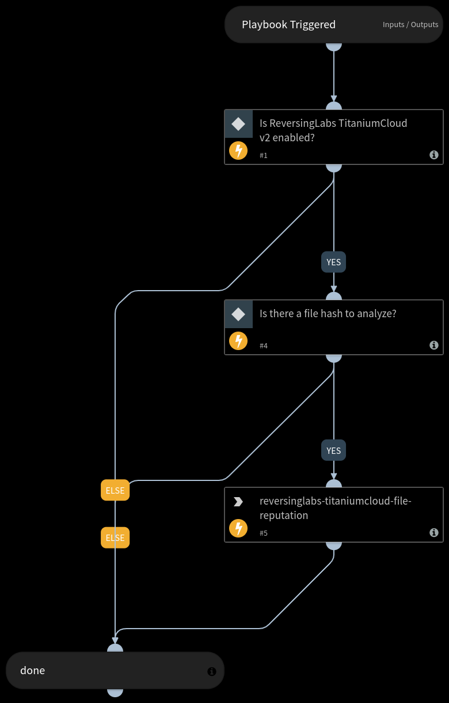

Provides file reputation data for a file (malicious, suspicious, known good or unknown).
Required TitaniumCloud API rights:

TCA-0101

## Dependencies
This playbook uses the following sub-playbooks, integrations, and scripts.

### Sub-playbooks
This playbook does not use any sub-playbooks.

### Integrations
* ReversingLabs TitaniumCloud v2

### Scripts
This playbook does not use any scripts.

### Commands
* reversinglabs-titaniumcloud-file-reputation

## Playbook Inputs
---

| **Name** | **Description** | **Default Value** | **Required** |
| --- | --- | --- | --- |
| hash | File hash. | ${File.SHA1} | Optional |

## Playbook Outputs
---

| **Path** | **Description** | **Type** |
| --- | --- | --- |
| File.MD5 | Bad hash found | unknown |
| File.SHA1 | Bad hash SHA1 | unknown |
| File.SHA256 | Bad hash SHA256 | unknown |
| DBotScore.Score | The actual score. | unknown |
| DBotScore.Type | The indicator type. | unknown |
| DBotScore.Indicator | The indicator that was tested. | unknown |
| DBotScore.Vendor | The vendor used to calculate the score. | unknown |
| ReversingLabs.file_reputation | Report in JSON. | unknown |

## Playbook Image
---
