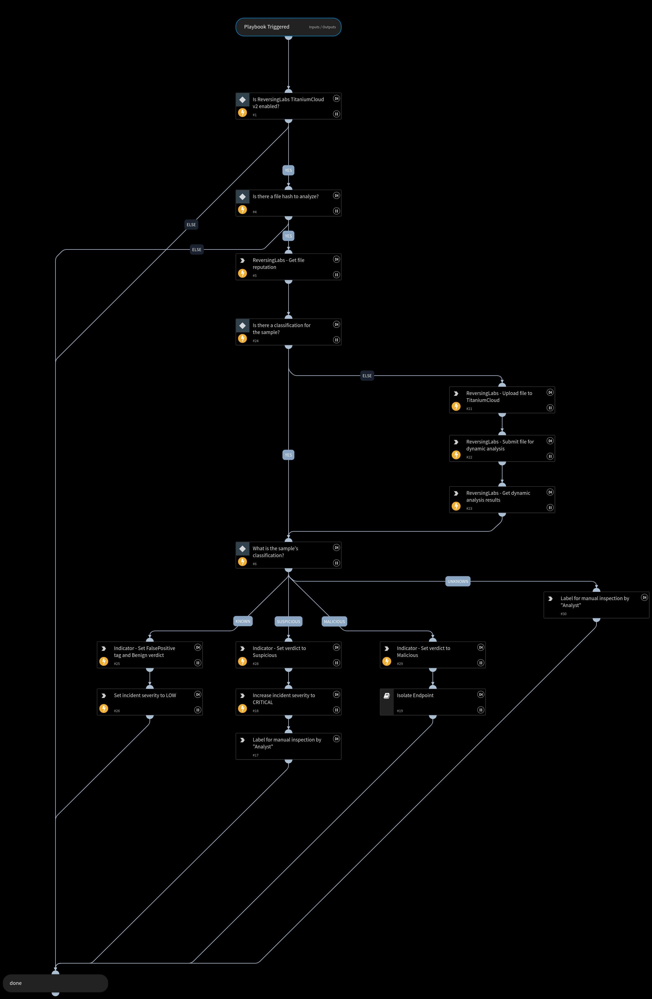

Provides the TitaniumCloud classification of a file hash, and takes remediation actions based on that classification.

## Dependencies

This playbook uses the following sub-playbooks, integrations, and scripts.

### Sub-playbooks

* Isolate Endpoint

### Integrations

* ReversingLabs TitaniumCloud v2

### Scripts

* IncreaseIncidentSeverity

### Commands

* setIndicator
* setIncident
* reversinglabs-titaniumcloud-file-upload
* reversinglabs-titaniumcloud-get-sample-dynamic-analysis-results
* reversinglabs-titaniumcloud-submit-sample-for-dynamic-analysis
* reversinglabs-titaniumcloud-file-reputation

## Playbook Inputs

---

| **Name** | **Description** | **Default Value** | **Required** |
| --- | --- | --- | --- |
| hash | SHA1 hash of a file. | ${File.SHA1} | Optional |
| file | The file itself. | ${File.EntryID} | Optional |
| EndpointIP | IP address of the endpoint from which the indicator came. | ${Endpoint.IPAddress} | Optional |

## Playbook Outputs

---

| **Path** | **Description** | **Type** |
| --- | --- | --- |
| File.MD5 | Bad hash found | unknown |
| File.SHA1 | Bad hash SHA1 | unknown |
| File.SHA256 | Bad hash SHA256 | unknown |
| DBotScore.Score | The actual score. | unknown |
| DBotScore.Type | The indicator type. | unknown |
| DBotScore.Indicator | The indicator that was tested. | unknown |
| DBotScore.Vendor | The vendor used to calculate the score. | unknown |
| ReversingLabs.file_reputation | Report in JSON. | unknown |

## Playbook Image

---

