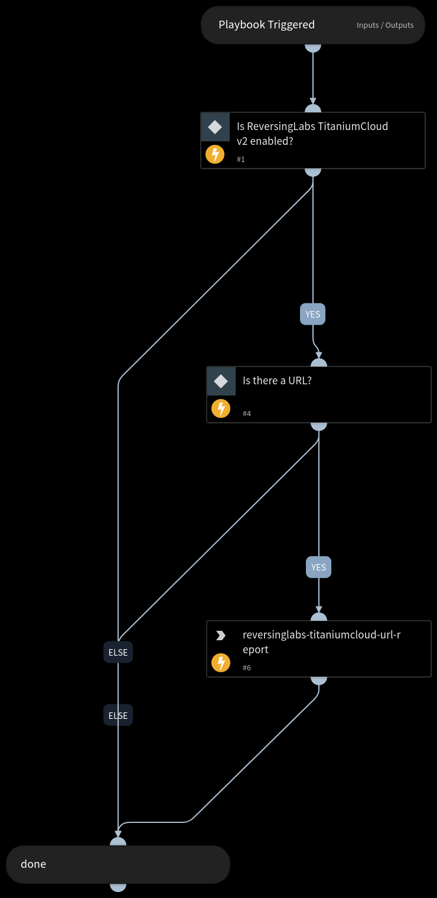

Get reputation data for the submitted URL.
Required TitaniumCloud API rights:

TCA-0403

## Dependencies

This playbook uses the following sub-playbooks, integrations, and scripts.

### Sub-playbooks

This playbook does not use any sub-playbooks.

### Integrations

* ReversingLabs TitaniumCloud v2

### Scripts

This playbook does not use any scripts.

### Commands

* reversinglabs-titaniumcloud-url-report

## Playbook Inputs

---

| **Name** | **Description** | **Default Value** | **Required** |
| --- | --- | --- | --- |
| URL | URL to analyze | URL.Data | Optional |

## Playbook Outputs

---

| **Path** | **Description** | **Type** |
| --- | --- | --- |
| URL.Data | The URL | unknown |
| DBotScore.Score | The actual score. | unknown |
| DBotScore.Type | The indicator type. | unknown |
| DBotScore.Indicator | The indicator that was tested. | unknown |
| DBotScore.Vendor | The vendor used to calculate the score. | unknown |
| ReversingLabs.url_report | Report in JSON | unknown |

## Playbook Image

---

