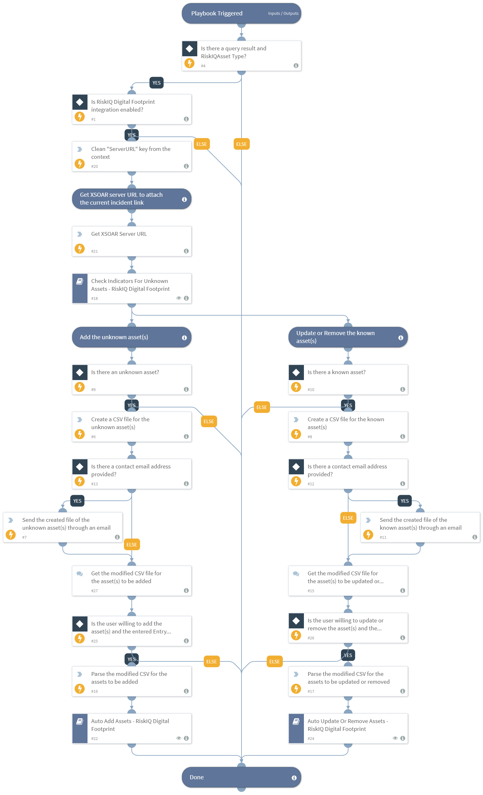

Adds the unknown indicators or updates/removes the indicators identified as a known asset in the RiskIQ Digital Footprint inventory according to the user inputs for each asset. To select the indicators you want to add, go to playbook inputs, choose "from indicators" and set your query. For example reputation:None etc. The purpose of the playbook is to check if the indicators with the unknown reputation are known assets. The default playbook query is "reputation:None". In case indicators with different reputations are to be added to the inventory, the query must be edited accordingly. This playbook cannot be run in quiet mode. This playbook needs to be used with caution as it might use up the integration’s API license when running for large amounts of indicators.
Supported integration:
- RiskIQ Digital Footprint

## Dependencies
This playbook uses the following sub-playbooks, integrations, and scripts.

### Sub-playbooks
* Check Indicators For Unknown Assets - RiskIQ Digital Footprint
* Auto Add Assets - RiskIQ Digital Footprint
* Auto Update Or Remove Assets - RiskIQ Digital Footprint

### Integrations
* RiskIQ Digital Footprint

### Scripts
* ExportToCSV
* ParseCSV
* DeleteContext
* GetServerURL

### Commands
* send-mail

## Playbook Inputs
---

| **Name** | **Description** | **Default Value** | **Required** |
| --- | --- | --- | --- |
| Indicator Query | Indicators matching the indicator query will be used as playbook input | reputation:None | Optional |
| support_contact | The contact email address of the support team from which manual inputs should be fetched. | incident.riskiqsupportcontact | Optional |

## Playbook Outputs
---
There are no outputs for this playbook.

## Playbook Image
---

