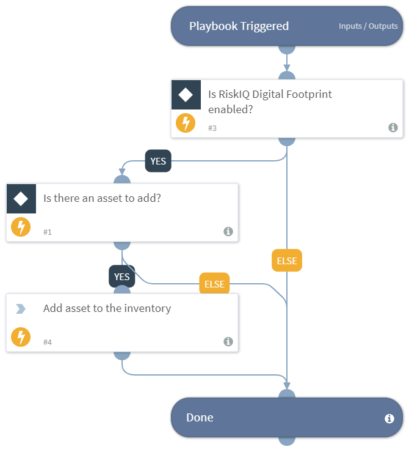

This playbook automatically adds the provided asset(s) to the RiskIQ Digital Footprint inventory according to the values provided. Use this playbook as a sub playbook and loop over each asset in the asset list in order to add multiple assets.
Supported integration:
- RiskIQ Digital Footprint

## Dependencies
This playbook uses the following sub-playbooks, integrations, and scripts.

### Sub-playbooks
This playbook does not use any sub-playbooks.

### Integrations
* RiskIQ Digital Footprint

### Scripts
This playbook does not use any scripts.

### Commands
* df-add-assets

## Playbook Inputs
---

| **Name** | **Description** | **Default Value** | **Required** |
| --- | --- | --- | --- |
| assets_to_add | The list of asset\(s\) to be added. The list should have some specific keys used in this playbook and this playbook should be used as a sub playbook in a loop in order to add multiple assets. Example of the list: \[\{"Asset Name": "asset1", "Asset Type": "Domain", "Should the asset be added? Yes or No": "Yes"\}\] |  | Required |
| server_url | The XSOAR server URL to attach with the added asset. |  | Optional |

## Playbook Outputs
---
There are no outputs for this playbook.

## Playbook Image
---
