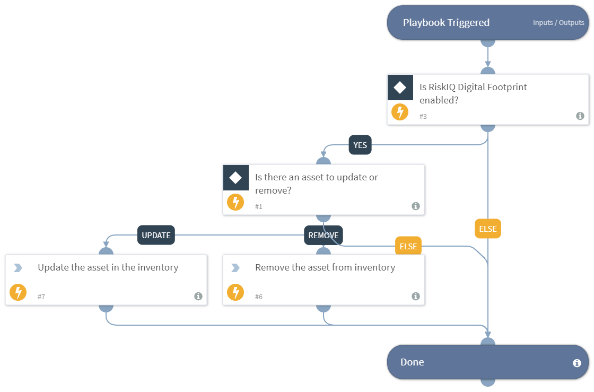

This playbook automatically updates or removes the provided asset(s) from the RiskIQ Digital Footprint inventory according to the values provided. Use this playbook as a sub playbook and loop over each asset in the asset list in order to update or remove multiple assets.
Supported integration:
- RiskIQ Digital Footprint

## Dependencies
This playbook uses the following sub-playbooks, integrations, and scripts.

### Sub-playbooks
This playbook does not use any sub-playbooks.

### Integrations
* RiskIQ Digital Footprint

### Scripts
This playbook does not use any scripts.

### Commands
* df-update-assets

## Playbook Inputs
---

| **Name** | **Description** | **Default Value** | **Required** |
| --- | --- | --- | --- |
| assets_to_update | The list of the assets to be updated or removed. The list should have some specific keys used in this playbook. Example of the list: \[\{"Asset Name": "asset1", "Asset Type": "Domain", "Operation to be performed on the asset: Update or Remove or None": "Update", "Action to be performed on the asset property: Add or Update or Remove": "Add", "Asset State: Candidate or Approved Inventory or Requires Investigation or Dependencies or Monitor Only": "Candidate", "Asset Priority: High or Medium or Low or None": "High", "Is the asset an enterprise asset? true or false": "true", "Brands of the asset": "RiskIQ", "Organizations of the asset": "RiskIQ", "Tags of the asset": "RiskIQ", "Affected target asset types": "Host"\}\] |  | Required |

## Playbook Outputs
---
There are no outputs for this playbook.

## Playbook Image
---
