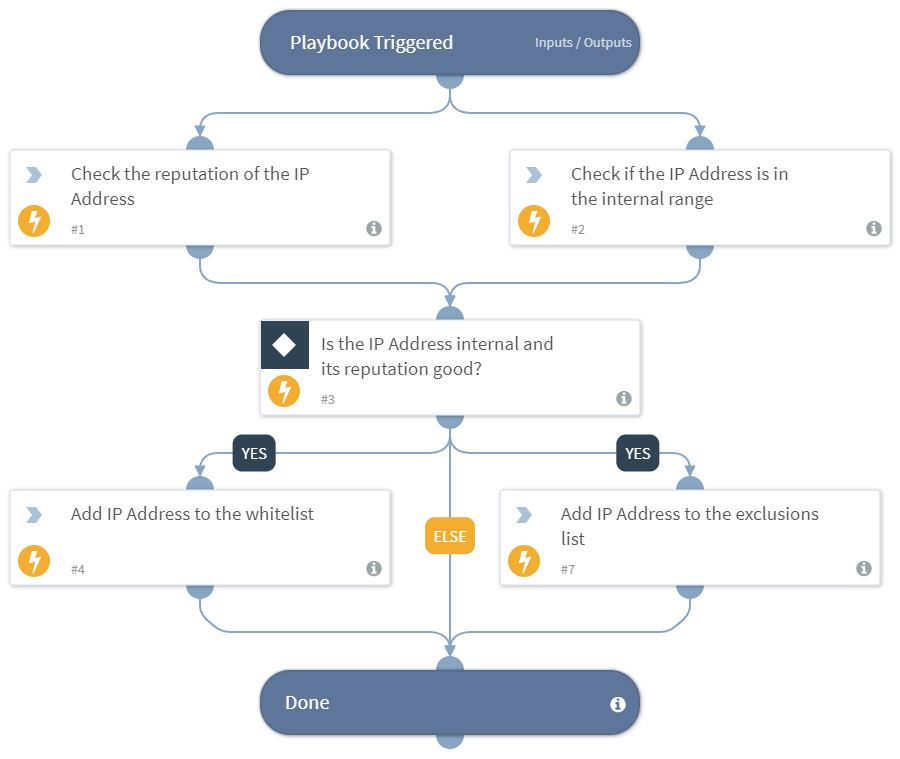

Checks if the provided IP Address should be added to allow list and excluded or not. Use this playbook as a sub-playbook to loop over multiple IP Addresses to check if they should be added to allow list and excluded.

## Dependencies
This playbook uses the following sub-playbooks, integrations, and scripts.

### Sub-playbooks
This playbook does not use any sub-playbooks.

### Integrations
This playbook does not use any integrations.

### Scripts
* IsIPInRanges
* Set

### Commands
* ip

## Playbook Inputs
---

| **Name** | **Description** | **Default Value** | **Required** |
| --- | --- | --- | --- |
| IP | IP Address for checking if it should be add to allow list. Use this playbook as a sub-playbook to loop over multiple IP Addresses to check if they should be added to allow list.  |  | Required |
| InternalRange | A list of IP ranges to check the IP in. The list should be provided in CIDR notation, separated by commas. An example of a list of ranges would be: "172.16.0.0/12,10.0.0.0/8,192.168.0.0/16" \(without quotes\). If a list is not provided, will use default list provided in the IsIPInRanges script \(the known IPv4 private address ranges\). |  | Optional |

## Playbook Outputs
---

| **Path** | **Description** | **Type** |
| --- | --- | --- |
| IPWhitelist | The list of IP Address\(es\) to be added to allow list. | unknown |
| IPExclusionList | The list of IP Address\(es\) to be excluded. | unknown |

## Playbook Image
---
