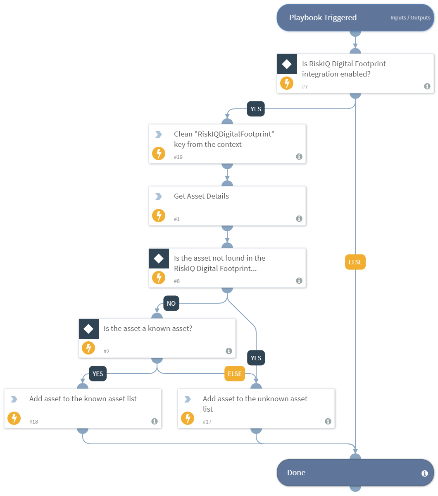

This playbook receives indicators from its parent playbook and checks if the indicator is an unknown or a known asset in the RiskIQ Digital Footprint inventory and gives out a list of the unknown as well as known assets. This playbook cannot be run in quiet mode. This playbook needs to be used with caution as it might use up the integration’s API license when running for large amounts of indicators.
Supported integration:
- RiskIQ Digital Footprint

## Dependencies
This playbook uses the following sub-playbooks, integrations, and scripts.

### Sub-playbooks
This playbook does not use any sub-playbooks.

### Integrations
* RiskIQ Digital Footprint

### Scripts
* DeleteContext
* isError
* Set

### Commands
* df-get-asset

## Playbook Inputs
---

| **Name** | **Description** | **Default Value** | **Required** |
| --- | --- | --- | --- |
| asset_name | Name of the asset. |  | Required |
| asset_type | Type of the asset. Possible values: Domain, Host, IP Address, IP Block, ASN, Page, SSL Cert, Contact. |  | Required |

## Playbook Outputs
---

| **Path** | **Description** | **Type** |
| --- | --- | --- |
| UnknownAssets | The list of indicators that are identified as unknown assets. | unknown |
| KnownAssets | The list of indicators that are identified as known assets. | unknown |

## Playbook Image
---
