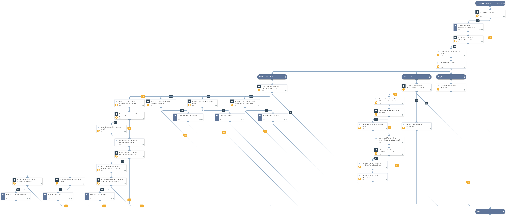

Adds the IP Address(es) to allow list after checking if it should be added to allow list according to the user inputs provided. This playbook also adds these IP Address indicators to the exclusion list and tags it with the "RiskIQ Whitelisted IP Address" tag.

## Dependencies
This playbook uses the following sub-playbooks, integrations, and scripts.

### Sub-playbooks
* Allow IP - Okta Zone
* IP Whitelist - GCP Firewall
* Check IP Address For Whitelisting - RiskIQ Digital Footprint
* IP Whitelist - AWS Security Group

### Integrations
This playbook does not use any integrations.

### Scripts
* ParseCSV
* GetServerURL
* ExportToCSV
* DeleteContext

### Commands
* send-mail
* excludeIndicators
* setIndicators

## Playbook Inputs
---

| **Name** | **Description** | **Default Value** | **Required** |
| --- | --- | --- | --- |
| ip_address | The list of IP Address\(es\) to be added to allow list and excluded. |  | Required |
| InternalRange | A list of IP ranges to check if the IP Address is in that range to add to allow list. The list should be provided in CIDR notation, separated by commas. An example of a list of ranges would be: "172.16.0.0/12,10.0.0.0/8,192.168.0.0/16" \(without quotes\). If a list is not provided, will use the default list provided in the IsIPInRanges script \(the known IPv4 private address ranges\). |  | Optional |
| auto_whitelist_ip_address | Automatically add to allow list the IP Address\(es\). You can set this as 'Yes' or 'No' manually here or you can set it into a custom incident field 'RiskIQ Auto Whitelist IP Address'. | incident.riskiqautowhitelistipaddress | Optional |
| auto_exclude_whitelisted_ip_address | Automatically add the IP Address\(es\) on allow list to the exclusion list. You can set this as 'Yes' or 'No' manually here or you can set it into a custom incident field 'RiskIQ Auto Exclude Whitelisted IP Address'. | incident.riskiqautoexcludewhitelistedipaddress | Optional |
| support_contact | The contact email address of the support team from which manual inputs should be fetched. | incident.riskiqsupportcontact | Optional |
| aws_security_group_name | Name of the AWS Security Group to update the allow listed IPs. | incident.riskiqassetawssecuritygroupname | Optional |
| gcp_firewall_name | Name of the GCP Firewall where the playbook should set the allow listed IPs. | incident.riskiqassetgcpfirewallname | Optional |
| okta_zone_id | ID of the Okta Zone to update the allow listed IPs. Use \!okta-list-zones to obtain the available zones. | incident.riskiqassetoktazoneid | Optional |

## Playbook Outputs
---
There are no outputs for this playbook.

## Playbook Image
---
