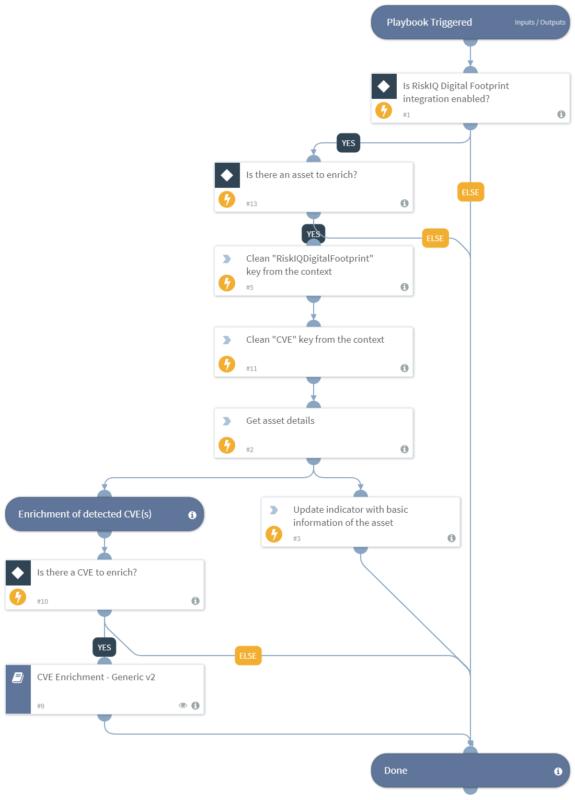

This playbook receives indicators from its parent playbook and enriches the basic information and the detected CVEs for the "RiskIQAsset" type of indicators. This playbook needs to be used with caution as it might use up the integrations' API license when running for large amounts of indicators.
Supported Integrations:
- RiskIQ Digital Footprint
- VulnDB
- CVE Search
- IBM X-Force

## Dependencies
This playbook uses the following sub-playbooks, integrations, and scripts.

### Sub-playbooks
* CVE Enrichment - Generic v2

### Integrations
* RiskIQ Digital Footprint
* VulnDB
* CVE Search
* IBM X-Force

### Scripts
* DeleteContext

### Commands
* df-get-asset
* setIndicator

## Playbook Inputs
---

| **Name** | **Description** | **Default Value** | **Required** |
| --- | --- | --- | --- |
| asset_name | Name of the asset. |  | Required |
| asset_type | Type of the asset. Possible values: Domain, Host, IP Address, IP Block, ASN, Page, SSL Cert, Contact. |  | Required |

## Playbook Outputs
---
There are no outputs for this playbook.

## Playbook Image
---
