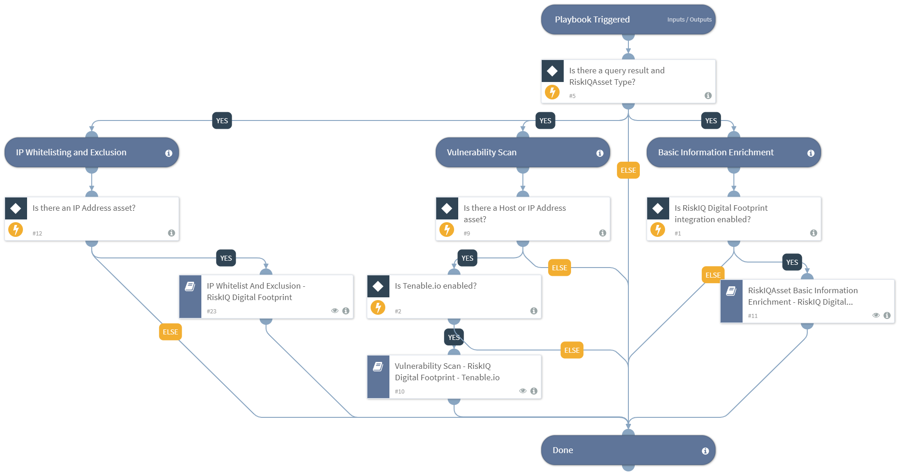

Enriches the "RiskIQAsset" type of indicators with basic information and CVEs detected for the asset, performs a vulnerability scan for "Host" and "IP Address" type of assets, and enriches received information in the context as well as provides the user to add to allow list a list of "IP Address" type of assets. This playbook also enriches the detected CVEs. To select the indicators you want to enrich, go to playbook inputs, choose "from indicators" and set your query. For example type:RiskIQAsset etc. The default playbook query is "type:RiskIQAsset". In case indicators with specific "riskiqassettype" are to be enriched, the query must be edited accordingly. This playbook needs to be used with caution as it might use up the integrations' API license when running for large amounts of indicators.
Supported integrations:
- RiskIQ Digital Footprint
- Tenable.io
- Google Cloud Compute
- AWS - EC2
- Okta v2

## Dependencies
This playbook uses the following sub-playbooks, integrations, and scripts.

### Sub-playbooks
* IP Whitelist And Exclusion - RiskIQ Digital Footprint
* Vulnerability Scan - RiskIQ Digital Footprint - Tenable.io
* RiskIQAsset Basic Information Enrichment - RiskIQ Digital Footprint

### Integrations
* RiskIQ Digital Footprint
* Tenable.io
* Google Cloud Compute
* AWS - EC2
* Okta v2

### Scripts
This playbook does not use any scripts.

### Commands
This playbook does not use any commands.

## Playbook Inputs
---

| **Name** | **Description** | **Default Value** | **Required** |
| --- | --- | --- | --- |
| Indicator Query | Indicators matching the indicator query will be used as playbook input | type:RiskIQAsset | Optional |
| InternalRange | A list of IP ranges to check if the IP Address is in that range for adding to allow list. The list should be provided in CIDR notation, separated by commas. An example of a list of ranges would be: "172.16.0.0/12,10.0.0.0/8,192.168.0.0/16" \(without quotes\). If a list is not provided, will use the default list provided in the IsIPInRanges script \(the known IPv4 private address ranges\). |  | Optional |
| auto_whitelist_ip_address | Automatically adds the IP Address\(es\) to allow list. You can set this as 'Yes' or 'No' manually here or you can set it into a custom incident field 'RiskIQ Auto Whitelist IP Address'. | incident.riskiqautowhitelistipaddress | Optional |
| auto_exclude_whitelisted_ip_address | Automatically add the IP Address\(es\) on allow list to the exclusions list. You can set this as 'Yes' or 'No' manually here or you can set it into a custom incident field 'RiskIQ Auto Exclude Whitelisted IP Address'. | incident.riskiqautoexcludewhitelistedipaddress | Optional |
| support_contact | The contact email address of the support team from which manual inputs should be fetched. | incident.riskiqsupportcontact | Optional |
| aws_security_group_name | Name of the AWS Security Group to update the IPs on allow list. | incident.riskiqassetawssecuritygroupname | Optional |
| gcp_firewall_name | Name of the GCP Firewall where the playbook should set the IPs on allow list. | incident.riskiqassetgcpfirewallname | Optional |
| okta_zone_id | ID of the Okta Zone to update the IPs on allow list. Use \!okta-list-zones to obtain the available zones. | incident.riskiqassetoktazoneid | Optional |

## Playbook Outputs
---
There are no outputs for this playbook.

## Playbook Image
---
