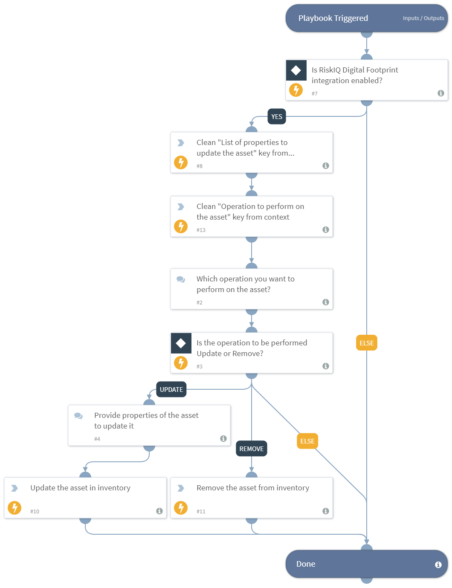

Checks if the user wants to update or remove the asset using various user inputs and performs the respective actions.
Supported integration:
- RiskIQ Digital Footprint

## Dependencies
This playbook uses the following sub-playbooks, integrations, and scripts.

### Sub-playbooks
This playbook does not use any sub-playbooks.

### Integrations
* RiskIQ Digital Footprint

### Scripts
* DeleteContext

### Commands
* df-update-assets

## Playbook Inputs
---

| **Name** | **Description** | **Default Value** | **Required** |
| --- | --- | --- | --- |
| asset_name | Name of the asset. |  | Required |
| asset_type | Type of the asset. Possible values: Domain, Host, IP Address, IP Block, ASN, Page, SSL Cert, Contact. |  | Required |
| support_email_address | The contact email address of the support team from which manual inputs should be fetched. |  | Optional |

## Playbook Outputs
---
There are no outputs for this playbook.

## Playbook Image
---
