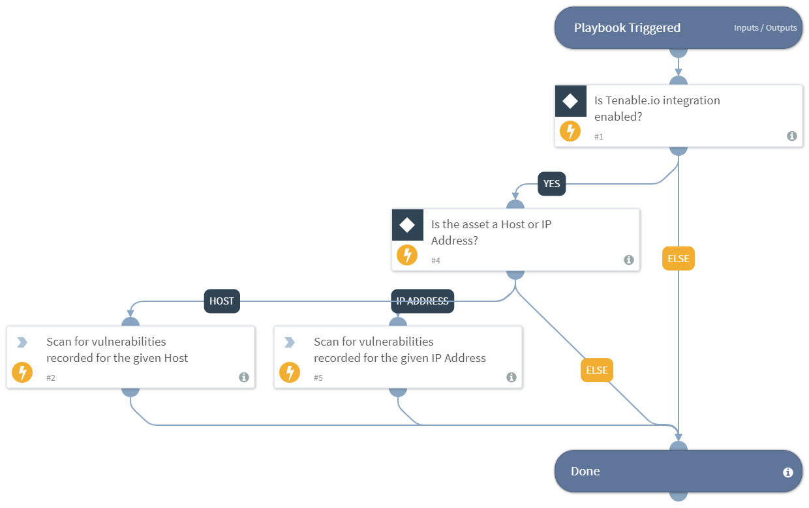

Performs a vulnerability scan for an asset of type "Host" and "IP Address" using Tenable.io integration.
Supported integration:
- Tenable.io

## Dependencies
This playbook uses the following sub-playbooks, integrations, and scripts.

### Sub-playbooks
This playbook does not use any sub-playbooks.

### Integrations
* Tenable.io

### Scripts
This playbook does not use any scripts.

### Commands
* tenable-io-get-vulnerabilities-by-asset

## Playbook Inputs
---

| **Name** | **Description** | **Default Value** | **Required** |
| --- | --- | --- | --- |
| asset_name | Name of the asset. |  | Required |
| asset_type | Type of the asset. Possible values: Domain, Host, IP Address, IP Block, ASN, Page, SSL Cert, Contact. |  | Required |

## Playbook Outputs
---
There are no outputs for this playbook.

## Playbook Image
---

