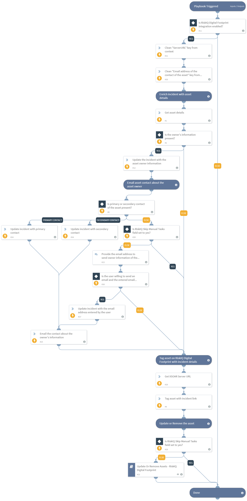
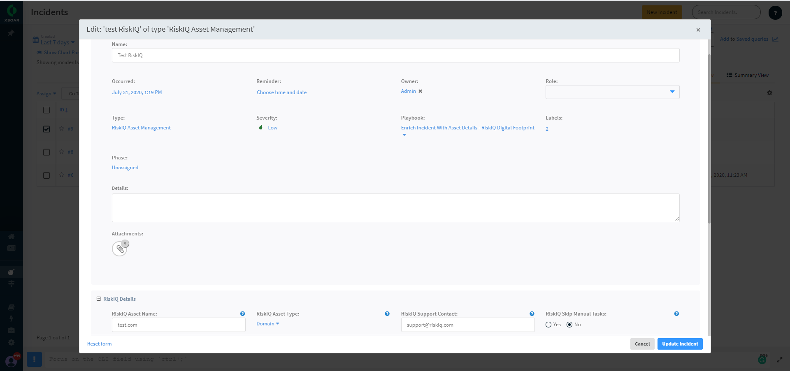
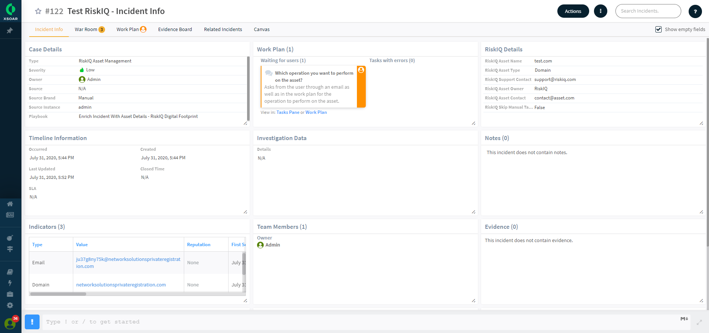
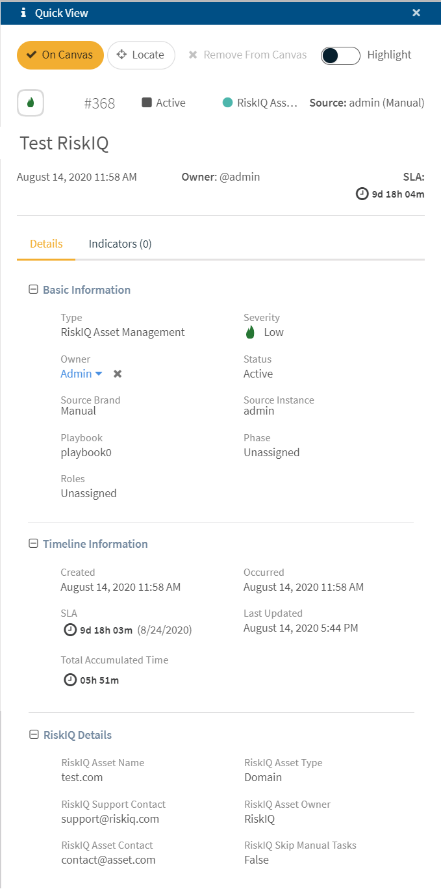

RiskIQ Digital Footprint software provides an active, comprehensive inventory of all of your IPs, domains, and hosts. RiskIQ scans millions of web pages and IPs every day, collecting telemetric data to produce a map of the internet. Digital Footprint uncovers and inventories all digital assets appearing online that tie back to your organization and that you depend on for your digital presence. Digital Footprint enables your security team to manage assets outside your firewall, bring unknown assets under management, and survey your digital footprint from the view of the global adversary.

This RiskIQ Digital Footprint Pack includes following entities in order to provide the aforementioned functionalities.

### Integration

RiskIQ Digital Footprint integration enables your security team to manage assets outside your firewall, by bringing its details, providing you to add or update assets and analyze your digital footprint from the view of the global adversary with the help of various commands that summarize the activities performed on your assets.

### Playbooks

* Enrich Incident With Asset Details - RiskIQ Digital Footprint
* Update Or Remove Assets - RiskIQ Digital Footprint

#### Enrich Incident With Asset Details - RiskIQ Digital Footprint

This playbook helps perform the following functionalities:
* Enriches the incident with asset details.
* Enriches the asset with the incident URL on the RiskIQ Digital Footprint platform.
* Sends an email containing the owner's information to the primary or secondary contact of the asset.
* Provides the user with an opportunity to update or remove the asset.

#### Update Or Remove Assets - RiskIQ Digital Footprint

This playbook checks if the user wants to update or remove the asset using various user inputs and performs the respective actions.

### Layouts

#### RiskIQ Asset Management Incident New/Edit Form

#### RiskIQ Asset Management Incident Summary

#### RiskIQ Asset Management Incident Quick View

As part of this pack, you will also get out-of-the-box RiskIQ Asset Management incident type, RiskIQAsset indicator type, incident & indicator fields, and incident layouts. All of these are easily customizable to suit the needs of your organization.
