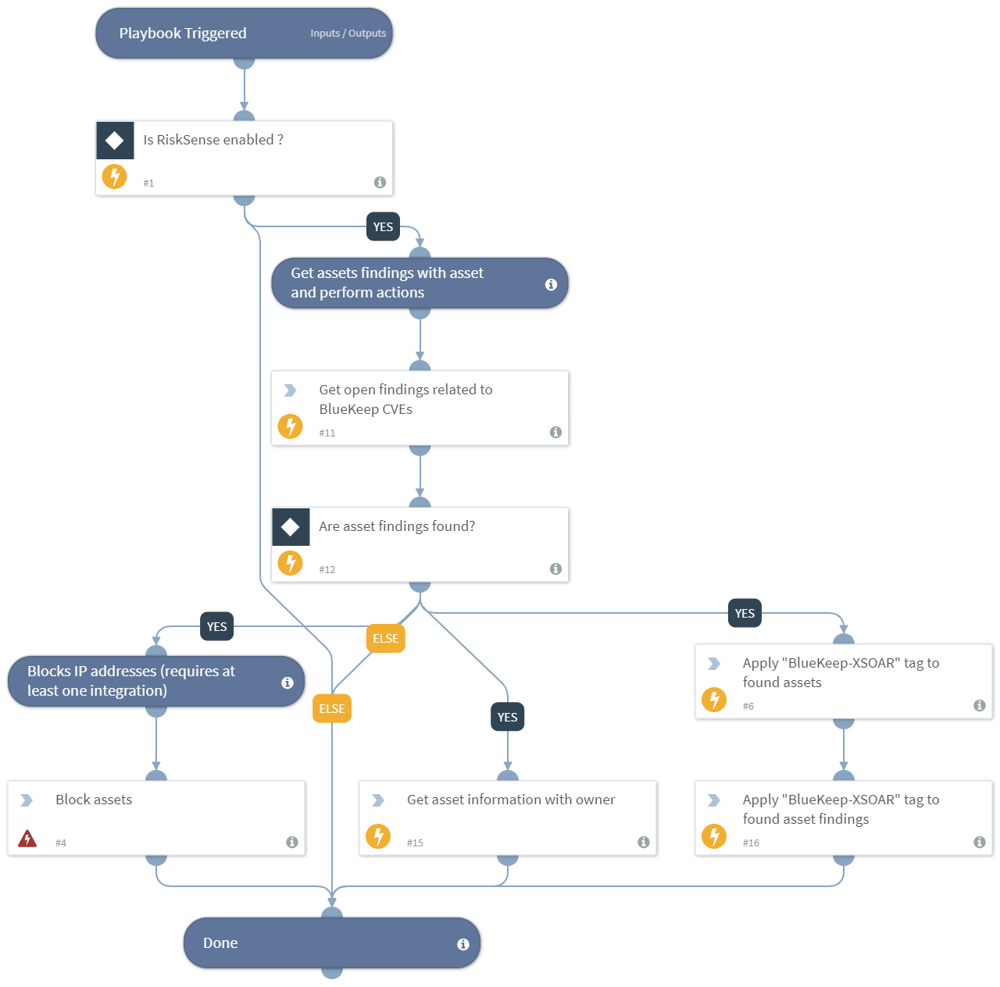

Block IPs and apply the tag to assets that are vulnerable to BlueKeep CVE (CVE-2019-0708).

## Dependencies
This playbook uses the following sub-playbooks, integrations, and scripts.

### Sub-playbooks
Block IP - Generic

### Integrations
* RiskSense

### Scripts
* IsIntegrationAvailable

### Commands
* risksense-get-host-findings
* risksense-get-hosts
* risksense-apply-tag

## Playbook Inputs
---
There are no inputs for this playbook.

## Playbook Outputs
---
There are no outputs for this playbook.

 