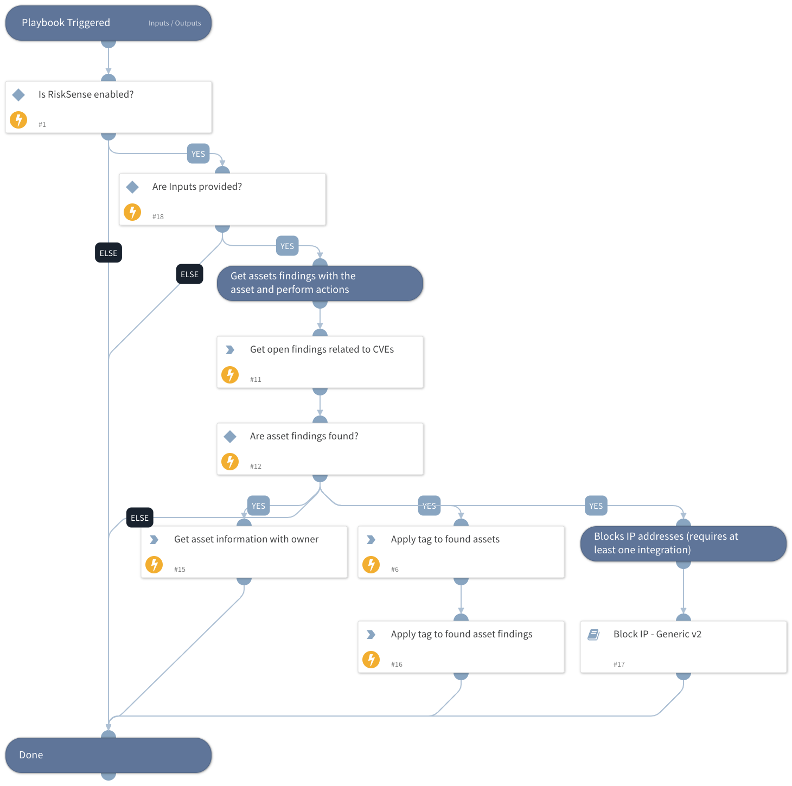

Block IPs and apply the tag to assets that are vulnerable to specified CVE.

## Dependencies
This playbook uses the following sub-playbooks, integrations, and scripts.

### Sub-playbooks
* Block IP - Generic v2

### Integrations
* RiskSense

### Scripts
* IsIntegrationAvailable

### Commands
* risksense-apply-tag
* risksense-get-hosts
* risksense-get-host-findings

## Playbook Inputs
---

| **Name** | **Description** | **Default Value** | **Required** |
| --- | --- | --- | --- |
| CVES | Specify Common Vulnerabilities and Exposures \(CVE\). You can mention multiple cves by comma\-separated list. | CVE-2017-11882,CVE-2017-0199,CVE-2017-5638,CVE-2012-0158 | Required |
| TagName | Tags in RiskSense can be applied to assets, web applications, and vulnerabilities. Tags are useful in the soft grouping, workflow creation and to identify compliance\-related assets. | DHS-Top-10 | Required |

## Playbook Outputs
---

| **Path** | **Description** | **Type** |
| --- | --- | --- |
| RiskSense.TagAssociation | Tag association details including tag name, association ID, created. | unknown |
| RiskSense.HostFinding | List of the host finding details. | unknown |
| RiskSense.Host | List of the host details. | unknown |

## Playbook Image
---
