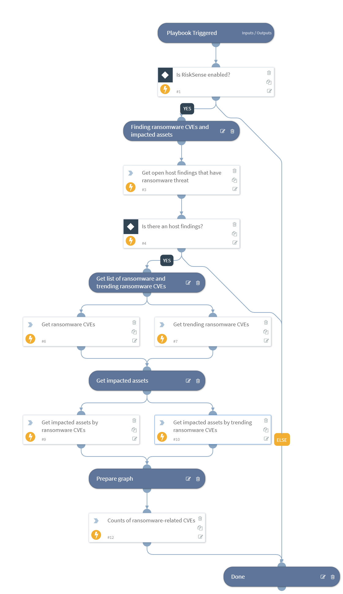

The ransomware exposure playbook reveals an organization's exposure to the specific vulnerabilities that are being exploited to launch ransomware attacks.

## Dependencies
This playbook uses the following sub-playbooks, integrations, and scripts.

### Sub-playbooks
This playbook does not use any sub-playbooks.

### Integrations
This playbook does not use any integrations.

### Scripts
* IsIntegrationAvailable
* DisplayCVEChartScript
* RiskSenseGetRansomewareCVEScript

### Commands
* risksense-get-hosts

## Playbook Inputs
---
There are no inputs for this playbook.

## Playbook Outputs
---

| **Path** | **Description** | **Type** |
| --- | --- | --- |
| RiskSense.RansomwareCves | List of ransomware CVEs, including threats and vulnerabilities. | unknown |
| RiskSense.RansomwareTrendingCves | List of trending \(Last 7 days\) ransomware CVEs, including threats and vulnerabilities. | unknown |
| RiskSense.HostFinding | List of host finding details. | unknown |
| RiskSense.Host | List of host details. | unknown |

## Playbook Image
---

